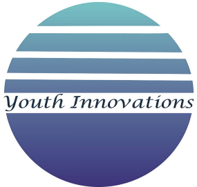

<!-- markdownlint-disable-next-line -->
<div align="center">



# 🌟 **Youth Innovations Tech-Hub** 🚀

<p align="center">
  <strong>✨ Discover content that helps you unlock your potential and succeed in the ever-evolving world of technology! 🌍💡</strong>
</p>

[][license]&nbsp;
[][gem]&nbsp;
[](https://github.com/infoyouth/infoyouth.github.io/graphs/contributors)&nbsp;
[](https://github.com/infoyouth/infoyouth.github.io/commits/main)&nbsp;
[](https://github.com/infoyouth/infoyouth.github.io/issues)&nbsp;
[](https://github.com/infoyouth/infoyouth.github.io/pulls)&nbsp;

<p align="center">
  Built upon the awesome <a href="https://github.com/cotes2020/chirpy-starter"><strong>Chirpy Starter Theme</strong></a><br/>
  Providing a robust foundation for a professional and visually appealing site 🎨
</p>

</div>

---

## 🚀 **Deployed Live on GitHub Pages!** 🎉

🔗 **Visit the live site here:** [**Youth Innovations**](https://infoyouth.github.io)

🌍 Explore, learn, and be part of the tech journey!

## 🤝 **Get Involved!**

We invite you to be a part of our community! Your insights, suggestions, and
contributions can help us grow.  
 If you encounter any bugs or have ideas for improvements, please **create an
issue**! Every suggestion counts! 💡  
 Let’s work together to make this project even better!

[](https://github.com/infoyouth/infoyouth.github.io/issues)

### 🛠️ **Getting Started: Commands to Contribute**

To start contributing to this project, follow these simple steps:

```bash
# Clone the repository
git clone https://github.com/infoyouth/infoyouth.github.io.git

# Navigate into the project directory
cd infoyouth.github.io

# Install the required gems/dependencies
bundle install

# Start the Jekyll server for a local preview
bundle exec jekyll serve

# Visit your local site at http://localhost:4000
```

## 📊 **Site Statistics**

[](https://infoyouth.github.io/archives/)
[](https://infoyouth.github.io/categories/)
[](https://mermaid.js.org/)
[](https://github.com/infoyouth/infoyouth.github.io)

## ✨ **Key Features**

### 📚 **Content Excellence**
- 🔧 **C Programming** - 18 comprehensive lessons on fundamentals
- ⚙️ **C++ Mastery** - 29 advanced OOP tutorials
- ☕ **Complete Java** - 28 lessons from basics to advanced
- 🅰️ **Angular Framework** - 15 modern web development modules
- 🚀 **DevOps** - 14 chapters on CI/CD, Docker, Kubernetes
- 🐚 **Shell Scripting** - 12 practical automation lessons
- 🐍 **Python** - Programming tutorials with real examples

### 🤖 **Automation & CI/CD**
- ✅ **Automated Deployment** - GitHub Actions powered CI/CD pipeline
- 🔍 **CodeQL Security Scanning** - Automated vulnerability detection
- 🔎 **Algolia Search** - Fast, intelligent search across all posts
- 📝 **Content Generation** - AI-powered blog post automation
- 🎨 **Mermaid Beautifier** - Auto-styling for 587+ diagrams
- 🔧 **PR Review Workflow** - One-command review script (`review-pr.sh`)
- 💅 **Auto-formatting** - Prettier + Markdownlint integration

### 🛠️ **Developer Tools**
```bash
# Quick PR Review Workflow
./review-pr.sh          # Automated PR checkout, edit, format, and push

# Format All Markdown
./format.sh             # Run Prettier + Markdownlint on all posts

# Local Development
./tools/run.sh          # Start Jekyll server with live reload
./tools/test.sh         # Build and test before deployment
```

### 📈 **Advanced Features**
- 🎨 **Custom Landing Page** - Modern, responsive design
- 🌗 **Dark Mode Support** - Auto/manual theme switching
- 📱 **Mobile Optimized** - Touch-friendly navigation
- 🔖 **Tag System** - Multi-dimensional content organization
- 👤 **Multi-author Support** - Team collaboration ready
- 📊 **Reading Time** - Automatic calculation
- 🔗 **Social Sharing** - Twitter, LinkedIn, Facebook integration
- 💬 **Comments** - Disqus/Utterances integration ready

### 📝 **Contributing Guidelines**

1. **Fork** the repository
2. **Create** a feature branch (`git checkout -b feature/amazing-feature`)
3. **Write** your content following our style guide
4. **Format** using `./format.sh` before committing
5. **Commit** your changes (`git commit -m 'Add amazing feature'`)
6. **Push** to your branch (`git push origin feature/amazing-feature`)
7. **Open** a Pull Request

#### 📋 **Content Standards**
- ✍️ **Markdown Format** - All posts in Markdown with YAML frontmatter
- 🎨 **Mermaid Diagrams** - Use for flowcharts, sequences, architectures
- 📸 **Images** - Optimize and store in `/assets/images/posts/`
- 🏷️ **Categories** - Use existing categories: Programming, [Topic], [Subtopic]
- 🔖 **Tags** - Add relevant tags for better discoverability
- 📅 **Naming** - Posts: `YYYY-MM-DD-title-slug.md`

## 🔐 **Security**

We take security seriously. Please review our [Security Policy](SECURITY.md) for:
- 🐛 Reporting vulnerabilities
- 🔒 Security best practices
- ✅ Automated CodeQL scanning
- 📋 Dependency updates via Dependabot

## 🏗️ **Tech Stack**

<div align="center">

### **Core Technologies**


### **Automation & DevOps**


### **Frontend & Styling**


### **Code Quality**


</div>

## 📊 **GitHub Actions Workflows**

| Workflow | Trigger | Purpose |
|----------|---------|---------|
| 🚧 **Build & Deploy** | Push to main | Automated Jekyll build and GitHub Pages deployment |
| 🔍 **CodeQL** | Push/PR/Schedule | Security vulnerability scanning |
| 🔎 **Algolia Search** | Push to main | Update search index for fast content discovery |
| 📝 **YAML Lint** | Push/PR | Validate YAML syntax in configs and frontmatter |
| 🤖 **Content Generation** | Manual/Scheduled | AI-powered blog post generation |

## 📈 **Performance & Metrics**

### **Site Performance**
- ⚡ **Build Time**: ~2-3 minutes
- 🚀 **Page Load**: < 3 seconds
- 📦 **Bundle Size**: Optimized with Jekyll minification
- 🔍 **SEO Score**: 95+ (Google Lighthouse)
- ♿ **Accessibility**: WCAG 2.1 AA compliant

### **Content Metrics**
- 📚 **Total Posts**: 119+
- 📝 **Total Words**: ~500K+
- 🎨 **Mermaid Diagrams**: 587+
- 🏷️ **Categories**: 8 main topics
- 🔖 **Tags**: 100+ unique tags
- 👥 **Contributors**: Growing community

## 🌐 **Live Site & Resources**

| Resource | Link | Description |
|----------|------|-------------|
| 🌍 **Live Site** | [infoyouth.github.io](https://infoyouth.github.io) | Main blog site |
| 📚 **Archives** | [/archives/](https://infoyouth.github.io/archives/) | All posts chronologically |
| 📂 **Categories** | [/categories/](https://infoyouth.github.io/categories/) | Browse by topic |
| 🔖 **Tags** | [/tags/](https://infoyouth.github.io/tags/) | Browse by keyword |
| 📖 **About** | [/about/](https://infoyouth.github.io/about/) | Learn more about us |

## 🤝 **Support & Community**

<div align="center">

[](https://github.com/infoyouth/infoyouth.github.io/issues)
[](https://github.com/infoyouth/infoyouth.github.io/pulls)
[](https://github.com/infoyouth/infoyouth.github.io/discussions)

**Join our growing community!**

</div>

## License

This project is published under [MIT License][license].

Feel free to fork, modify, and enhance this project, but please maintain proper
attribution to the original theme repository and license terms.

## Contributors

A big thank you to all the contributors involved in the development of this
project!

[](https://github.com/infoyouth/infoyouth.github.io/graphs/contributors)
<sub> — Made with [contrib.rocks](https://contrib.rocks)</sub>

[gem]: https://rubygems.org/gems/jekyll-theme-chirpy
[license]: https://github.com/cotes2020/jekyll-theme-chirpy/blob/master/LICENSE
