# Reusable GitHub Action for Python Code Quality 🚀

Reusable GitHub Actions help you <span style="color: #4CAF50; font-weight: bold;">**save time**</span> and avoid repeating work. They make your coding process easier and help everyone follow the <span style="color: #2196F3; font-style: italic;">*best practices*</span>. This guide will show you how to create a GitHub Action for checking and formatting Python code using <span style="color: #FF5722; font-weight: bold;">**Ruff**</span> and <span style="color: #FF5722; font-weight: bold;">**Black**</span>.


## In this guide, you will learn:

- 🔍 **What reusable GitHub Actions are** and why they are useful
- 🛠️ The **main steps** to create your GitHub Action
- ⚙️ How to **set up your action** so it works correctly
- ✅ How to **test and publish your action** for others to use

```mermaid
    flowchart TD
        A[🔍 What reusable GitHub Actions are and why they are useful] --> B[🛠️ The main steps to create your GitHub Action]
        B --> C[⚙️ How to set up your action so it works correctly]
        C --> D[✅ How to test and publish your action for others to use]

        %% Style Definitions
        classDef step fill:#ffffff,stroke:#007BFF,stroke-width:2px;  %% White background with blue stroke
        classDef highlight fill:#F8F9FA,stroke:#28A745,stroke-width:2px; %% Light background with green stroke
        classDef action fill:#4CAF50,stroke:#333,stroke-width:2px;   %% Green for main actions
        classDef info fill:#2196F3,stroke:#333,stroke-width:2px;   %% Blue for informational steps

        class A step;
        class B highlight;
        class C action;
        class D info;
```




# 🔍 What Reusable GitHub Actions Are and Why They Are Useful

## **Introduction**
**Reusable GitHub Actions** are like **templates** for workflows. They allow you to **define a set of tasks** that can be reused across multiple projects. This means you don’t have to write the same code over and over again for different repositories.

### **Why Use Reusable Actions?**

1. **Embrace the DRY Principle**: 
   - <span style="color:#00BFFF; font-weight:bold;">**DRY**</span> stands for *Don’t Repeat Yourself*. By using <span style="color:#32CD32; font-weight:bold;">**reusable actions**</span>, you can avoid redundancy in your code. Instead of writing the same workflows in every project, you can simply call the action whenever you need it.

   

2. **Consistency Across Projects**: 
   - Using the same action across different repositories ensures that your workflows remain <span style="color:#FFD700; font-weight:bold;">**consistent**</span>. This leads to fewer errors and makes it easier for new developers to understand how things work.

3. **Simplified Maintenance**: 
   - When you need to update a process, you only have to change it in one place—the <span style="color:#32CD32; font-weight:bold;">**reusable action**</span>. This makes maintaining your code much easier and less time-consuming.

4. **Faster Development**: 
   - <span style="color:#FF4500; font-weight:bold;">**Reusable actions**</span> save time. By leveraging pre-defined workflows, developers can focus on building new features instead of repetitive tasks.

### **Example**
Imagine you’re working on multiple projects that require <span style="color:#FFD700; font-weight:bold;">**code quality checks**</span>. Instead of creating the same checks in each repository, you can create one <span style="color:#32CD32; font-weight:bold;">**reusable action**</span> for those checks and use it in all your projects. 

Here’s a simple flow of how this works:

1. **Create the Action**: Define the tasks (like running tests or checking code style).
2. **Publish the Action**: Make it available for your other repositories.
3. **Use the Action**: Reference this action in your projects, and it will run the defined tasks.

### **Conclusion**
In summary, <span style="color:#00BFFF; font-weight:bold;">**reusable GitHub Actions**</span> streamline your development process, promote <span style="color:#FFD700; font-weight:bold;">**best practices**</span>, and enhance collaboration within teams. They are a powerful tool for any developer looking to improve <span style="color:#FF4500; font-weight:bold;">**efficiency**</span> and <span style="color:#FFD700; font-weight:bold;">**consistency**</span> in their projects.

> **Pro Tip**: Always document your <span style="color:#32CD32; font-weight:bold;">**reusable actions**</span> clearly so that other developers (and future you!) can easily understand how to use them. 

---

*Remember: Good tools make good developers!*

# 🛠️ The Main Steps to Create Your GitHub Action

Creating a **GitHub Action** involves several key steps. These steps guide you through defining what your action will do, setting it up in a repository, and ensuring it runs smoothly. Following these steps helps you create a **reusable action** that can enhance your workflows.

### <span style="color:#00FFFF; font-weight:bold;">Step 1: Define the Purpose and Requirements</span>
- Start by clearly defining the purpose of your action. What tasks do you want to automate?
- Consider integrating tools like <span style="color:#00BFFF; font-weight:bold;">**Ruff**</span> for linting and <span style="color:#32CD32; font-weight:bold;">**Black**</span> for automatic code formatting. Identify specific configurations and rules you’ll need for both tools.

  > **Example**: If you want to enforce a specific style with <span style="color:#32CD32; font-weight:bold;">**Black**</span>, set the options in your configuration.

### <span style="color:#00FFFF; font-weight:bold;">Step 2: Set Up a New GitHub Repository</span>
- Create a dedicated GitHub repository for your action.
- Organize your folder structure to keep your files neat. This separation makes it easier to find files related to your action and documentation.

  ```bash
  mkdir my-github-action
  cd my-github-action
  mkdir .github/workflows
  ```
### <span style="color:#00FFFF; font-weight:bold;">Step 3: Create the Action Metadata File</span>
In this step, you will create an important file called <span style="color:#FFD700; font-weight:bold;">`action.yml`</span>. This file tells GitHub about your action and how it works. It defines inputs, outputs, and the steps your action will execute.

#### **Creating the Directory and File**

1. **Open Your Terminal**:
   - Navigate to your GitHub repository directory using the terminal. You can use the command:
     ```bash
     cd /path/to/your/repo
     ```

2. **Create the Directory Structure**:
   - Create a new directory for your action inside the `.github` folder. Use the following command:
     ```bash
     mkdir -p .github/actions/my-action
     ```

3. **Create the `action.yml` File**:
   - Now, create the `action.yml` file in the new directory:
     ```bash
     touch .github/actions/my-action/action.yml
     ```

#### **Writing the Metadata**

Open the `action.yml` file in a text editor (like VS Code, Atom, etc.) and add the following content:

```yaml
name: "My GitHub Action" # The name of your action
description: "A reusable action for code quality checks" # Brief description of what your action does
inputs: # Define the inputs your action will accept
  directory:
    description: "The directory of Python files to analyze" # Explain the input
    required: true # This input is mandatory
    default: "./" # Default value if not provided
  ruff_config:
    description: "Configuration options for Ruff" # Explain the input
    required: false # This input is optional
    default: "" # Default value if not provided
  black_config:
    description: "Configuration options for Black" # Explain the input
    required: false # This input is optional
    default: "" # Default value if not provided
runs: # Define how your action runs
  using: "composite" # This means it's a composite action
  steps: # List the steps your action will execute
    - name: Run Ruff # Step name
      run: ruff ${ { inputs.directory } } --config ${ { inputs.ruff_config } } # Command to run Ruff
    - name: Run Black # Step name
      run: black ${ { inputs.directory } } --config ${ { inputs.black_config } } # Command to run Black
```
#### <span style="color:#FFD700; font-weight:bold;"> Components of `action.yml`</span>

- **<span style="color:#FF6347;">`name`</span>**: 
  This is the name of your action, which will appear in the GitHub UI.

- **<span style="color:#00BFFF;">`description`</span>**: 
  A short summary of what your action does.

- **<span style="color:#32CD32;">`inputs`</span>**: 
  These are the parameters your action can accept. You define what inputs are required and what their defaults should be.

- **<span style="color:#FF4500;">`runs`</span>**: 
  This section specifies how your action will run. Here, we are using a composite action, which allows you to run multiple commands in sequence.

- **<span style="color:#9370DB;">`steps`</span>**: 
  Each step is a command that will be executed when the action is run. In this example, we are running <span style="color:#00BFFF;">**Ruff**</span> and <span style="color:#FFD700;">**Black**</span> on the specified directory of Python files.

### <span style="color:#00FFFF; font-weight:bold;">Step 4: Write the Code for the Action</span>

In this step, you’ll write the code that your action will execute. The main goal is to run **<span style="color:#00BFFF;">Ruff</span>** and **<span style="color:#32CD32;">Black</span>** on the specified Python files to check for linting issues and format the code automatically.

#### **<span style="color:#FF6347;">Creating a Script for Your Action</span>**

You can create a script using **shell commands** or a **Python script**. Let’s go with a simple shell script to invoke both tools:

- **Create a file named** `run.sh` inside the folder where your `action.yml` is located: ie in `.github/workflows/run.sh` and copy paste below content in the script

```bash
# run.sh
echo "Running Ruff and Black on the specified directory..."
ruff .            # Runs Ruff on the current directory
black .           # Automatically formats Python files using Black
```
<span style="color:#9370DB;">Modify the action.yml File to Include the Script</span>
```yaml
name: Lint and Format Action
description: This action runs Ruff and Black on the specified Python files.
inputs:
  path:
    description: 'The directory to run Ruff and Black on'
    required: true
    default: '.'
runs:
  using: "composite"
  steps:
    - name: Run Ruff and Black
      run: ./run.sh
```
<span style="color:#FFD700;">Test and Verify Your Action</span>
- Create a new branch and commit your changes.
- Create a pull request or push your branch to trigger the workflow and see if <span style="color:#00BFFF;">**Ruff**</span> and <span style="color:#FFD700;">**Black**</span> are executed correctly.

**For more information of above topics please refer**
- [YAML Syntax](https://yaml.org/)
- [GitHub Actions Metadata Syntax Guide](https://docs.github.com/en/actions/creating-actions/metadata-syntax-for-github-actions)


# <span style="color:#FFD700;">✨ Stay Tuned for the Next Part! ✨</span>

---

Thank you for reading this post on <span style="color:#00BFFF; font-weight:bold;">**Creating Reusable GitHub Actions**</span>! We’ve covered some important steps and concepts so far. Here’s what we’ve learned:

- 🔍 <span style="color:#32CD32;">What Reusable GitHub Actions Are and Why They Are Useful</span>
- 🛠️ <span style="color:#FF4500;">The Main Steps to Create Your GitHub Action</span>
- ⚙️ <span style="color:#FF69B4;">Explanation of the action.yml Components</span>
- ✅ <span style="color:#FFD700;">How to Set Up Your Action So It Works Correctly</span>

Feel free to leave any comments or questions below. Your thoughts are important!

---
*Happy coding, and see you in the next post! 🎉*
