# 🚀 GitHub Actions for Beginners

**GitHub Actions** is a handy tool for automating tasks in your GitHub projects.
🛠️ It helps you create workflows with simple YAML files. 📄 These workflows run
tasks like building, testing, and deploying code.

You can set triggers to start these tasks. For example, they can run when you
push code or create a pull request. This automation saves you time and reduces
errors. ✅ It also keeps your code consistent and reliable. 🌍

## ⚠️ Challenges Without GitHub Actions

<ul>
    <li><span style="color: #f39c12; font-weight: bold;">👥 Inconsistent Code Quality</span>: When many people work together, keeping everyone on the same page with coding standards can be hard. Some might forget formatting rules, making the code look messy.</li>
    <li><span style="color: #f39c12; font-weight: bold;">⏳ Time-Consuming Manual Checks</span>: Checking code by hand takes a lot of time and slows everything down. Plus, it’s easy to miss mistakes when doing things over and over.</li>
    <li><span style="color: #f39c12; font-weight: bold;">🔄 Difficulty in Testing Across Multiple Languages</span>: Different programming languages often have their own testing tools. This can create headaches when trying to merge code from different sources.</li>
</ul>

## 🌟 How GitHub Actions Can Help

Using GitHub Actions can solve these problems effectively:

<ul>
    <li><span style="color: #27ae60; font-weight: bold;">🌐 Consistent Code Quality</span>:  
        GitHub Actions automatically checks coding styles and rules for every pull request, making sure everything meets the standards before merging.
    </li>
    <li><span style="color: #27ae60; font-weight: bold;">🚀 Automated Testing</span>:  
        Set up workflows to run tests automatically whenever code is updated. This helps catch any issues early, saving you time and effort later.
    </li>
    <li><span style="color: #27ae60; font-weight: bold;">📦 Unified Workflows Across Languages</span>:  
        You can create specific workflows for each programming language in the same repository. This keeps everything organized and makes teamwork easier.
    </li>
</ul>

## 📈 Examples of Open-Source Projects using CI/CD

Below are two of the most popular projects that effectively utilize GitHub
Actions for continuous integration and delivery.

### 🚀 Node.js: Continuous Testing

- ✨ **Overview:** Node.js runs automated tests for each pull request using
  GitHub Actions. This checks that new contributions don’t break existing
  functionality.
- 🛡️ **Impact:** Developers can merge code confidently, knowing that the
  automated tests ensure high code quality.

### 🎉 Django: Cross-Version Compatibility

- 📚 **Overview:** Django employs GitHub Actions to execute its test suite on
  multiple Python versions for every code push.
- ✅ **Impact:** This guarantees that all contributions work seamlessly across
  supported environments, reducing bugs and increasing reliability.

### 🌟 **Key Advantages of CI/CD in Open Source**

<li><span style="color: #27ae60; font-weight: bold;">🎯 Faster Releases:</span> Continuous integration and delivery allow for rapid iterations and quicker deployments.</li>  
<li><span style="color: #27ae60; font-weight: bold;">💪 Increased Reliability:</span> Automated tests catch bugs early, resulting in fewer issues for users.</li>  
<li><span style="color: #27ae60; font-weight: bold;">🔄 Streamlined Collaboration:</span> Multiple contributors can work simultaneously without the fear of breaking the codebase.
</li>

## 🌟 Understanding The Automation Framework

Let's dive into the framework itself. Below is a simple repository structure
needed to trigger an action.

### 🗂️ Complete Repository Structure

```c
🗂️ your-repo/
├── .github/
│   └──workflows/
│      └──main.yml
└── src/
    └──main.py
```

Below shows simple yaml file for example.

```yaml
name: CI

on: [push, pull_request]

jobs:
  build:
    runs-on: ubuntu-latest

    steps:
      - name: Checkout code
        uses: actions/checkout@v2

      - name: Run tests
        run: python -m unittest discover
```

For further details on YAML syntax, you can refer to the
[YAML documentation](https://yaml.org/start.html).

## ⚙️ Understanding the Workflow

### 📝 Workflow Name

- **Description**: This defines the workflow as **"CI" (Continuous
  Integration)**. It helps in automating the testing and integration of code
  changes to ensure stability.

### 🔄 Trigger Events

- **Details**: The workflow runs on two key events:
  - **`push`**: Activates when new code is pushed to the repository.
  - **`pull_request`**: Activates when a pull request is opened or updated,
    allowing for early feedback on code changes.

### 🛠️ Job Definition

- **Build Job**: This job runs on the **latest Ubuntu environment**. It provides
  a consistent and up-to-date platform for testing.

### 🏗️ Steps in the Job

1. **Checkout Code**:

   - **Function**: Uses `actions/checkout@v2` to access the repository's files.
   - **Example**: Allows the workflow to work with the latest code changes
     before executing tests.

2. **Run Tests**:
   - **Function**: Executes unit tests using the command
     `python -m unittest discover`.
   - **Importance**: Ensures that any new code changes do not break existing
     functionality, maintaining high code quality.

### 🚀 Benefits

- Automating these processes helps teams identify issues early, promotes
  collaboration, and ensures consistent code quality across contributions.

Here is the pictorial representation

```mermaid
graph TD;
    A([🚀 Workflow: CI]):::workflow --> B((🎯 Trigger Events)):::trigger
    B --> C([🔄 Events: Push & Pull Request]):::event
    C --> D([🛠 Job: Build on Ubuntu]):::job
    D --> E((📋 Steps)):::steps
    E --> F([📂 Checkout Code]):::checkout
    F --> G([🧪 Run Tests]):::tests

    classDef workflow fill:#f39c12,stroke:#e67e22,stroke-width:3px,stroke-dasharray:5;
    classDef trigger fill:#3498db,stroke:#2980b9,stroke-width:2px;
    classDef event fill:#e74c3c,stroke:#c0392b,stroke-width:2px,stroke-dasharray:3;
    classDef job fill:#27ae60,stroke:#16a085,stroke-width:2px;
    classDef steps fill:#8e44ad,stroke:#6c3483,stroke-width:3px;
    classDef checkout fill:#f1c40f,stroke:#d4ac0d,stroke-width:2px;
    classDef tests fill:#9b59b6,stroke:#8e44ad,stroke-width:2px;
```



## 🚀 Practical Section: Let's Get Our Hands Dirty

1. **Open your terminal**.

2. **Clone an empty GitHub repository or create a new folder**:

   ```bash
   git clone https://github.com/yourusername/your-repo.git
   cd your-repo
   # or create a new folder
   mkdir your-repo
   cd your-repo
   ```

3. **Create the folder structure:**.

   ```bash
    mkdir -p .github/workflows src
   ```

4. **Create the `main.yml` workflow file::**.

   ```bash
   vi .github/workflows/main.yml
   ```

   Add the following content:

   ```yaml
   name: CI

    on: [push, pull_request]

    jobs:
      build:
        runs-on: ubuntu-latest

        steps:
          - name: Checkout code
            uses: actions/checkout@v2

          - name: Run script
            run: python src/main.py

   ```

   Save and exit. 📝

5. **Create a simple Python script `main.py`:**

   ```bash
   vi src/main.py
   ```

   Add the following content:

   ```python
   def add(a, b):
    return a + b

   result = add(3, 4)
   print(f"The result of adding 3 and 4 is: {result}")
   ```

   Save and exit. 🐍

6. **Create the `verify.py` script**:

   ```bash
   vi src/verify.py
   ```

   and paste the below content in it.

   ```python
     from main import add

     print("Verifying the add function...")
     expected = 7
     actual = add(3, 4)

     if actual == expected:
       print("Test passed! 🎉")
     else:
       print("Test failed! ❌")
   ```

   Save and exit. 💾

7. **Stage and Commit and push Your Changes**:

   ```bash
   git add .
   git commit -m "Initial commit with workflow and Python files"
   git push origin main
   ```

8. **Where to Look for Actions Running:**

   - Go to your GitHub repository page.

   - Click on the "Actions" tab.

   - This will show the status of your workflows triggered by the push! 📊

### 🔗 **Useful Resources for Your CI/CD Journey**

1. **📚 [GitHub Actions Documentation](https://docs.github.com/en/actions)**:  
   A comprehensive guide to setting up and mastering GitHub Actions 🚀,
   including workflows, triggers, and more.

2. **📝 [YAML Syntax](https://yaml.org/)**:  
   A resource to help you write structured `.yml` files for your workflows with
   ease.

3. **🔄 [GitHub Actions: Checkout](https://github.com/actions/checkout)**:  
   Learn how to use the `actions/checkout` to access your repo's code in
   workflows.
4. **💡
   [Git Commands Cheat Sheet](https://education.github.com/git-cheat-sheet-education.pdf)**:  
   A
   quick and handy reference for essential Git commands.

## 🔥 Recap of Our CI/CD Journey

We walked through the process of setting up GitHub Actions from scratch,
explored key elements like workflow triggers, jobs, and steps, and even got our
hands dirty by creating a simple Python verification script. We also pushed
changes to GitHub and learned where to check the status of actions.

## 🎯 Final Thoughts

Embracing CI/CD streamlines your workflow, ensuring quality code and faster
releases. 🚀 Now it's your turn to implement this in your projects!

## 🗨️ What did you think?

Let us know in the comments below! ⬇️
