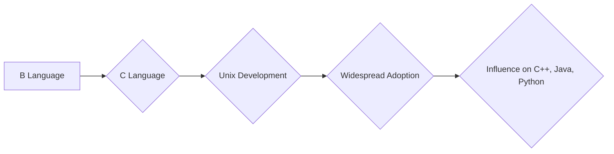
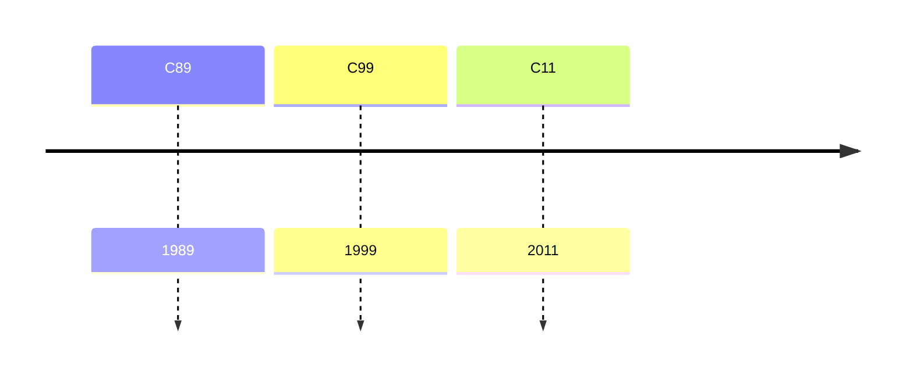
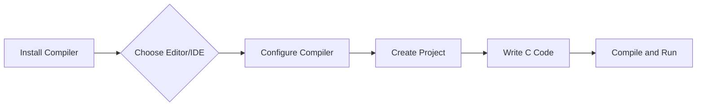

<h1><span style="color:#e67e22; font-size: 24px;">What we will learn in this post?</span></h1>
<ul style='list-style-type: none; padding-left: 0;'>
<li style='margin: 5px 0; font-size: 18px;'><span style='color: #2980b9; font-weight: bold;'>•</span> <span style='color: #2ecc71; font-weight: bold;'>Introduction to the C Language</span></li>
<li style='margin: 5px 0; font-size: 18px;'><span style='color: #2980b9; font-weight: bold;'>•</span> <span style='color: #2ecc71; font-weight: bold;'>Features of the C Programming Language</span></li>
<li style='margin: 5px 0; font-size: 18px;'><span style='color: #2980b9; font-weight: bold;'>•</span> <span style='color: #2ecc71; font-weight: bold;'>Understanding the C Language Standards</span></li>
<li style='margin: 5px 0; font-size: 18px;'><span style='color: #2980b9; font-weight: bold;'>•</span> <span style='color: #2ecc71; font-weight: bold;'>Setting Up a C Development Environment</span></li>
<li style='margin: 5px 0; font-size: 18px;'><span style='color: #2980b9; font-weight: bold;'>•</span> <span style='color: #2ecc71; font-weight: bold;'>Writing and Running a Basic C Program</span></li>
<li style='margin: 5px 0; font-size: 18px;'><span style='color: #2980b9; font-weight: bold;'>•</span> <span style='color: #2ecc71; font-weight: bold;'>Understanding C Comments</span></li>
<li style='margin: 5px 0; font-size: 18px;'><span style='color: #2980b9; font-weight: bold;'>•</span> <span style='color: #2ecc71; font-weight: bold;'>Conclusion!</span></li>
</ul>

<h1><span style="color:#e67e22">C: A Timeless Language</span></h1>

<h2><span style="color:#2980b9">Origins & Evolution</span></h2>

C emerged in the early 1970s at Bell Labs, developed by Dennis Ritchie. It evolved from an earlier language called **B**, aiming for a more efficient and portable system programming language.

<h3><span style="color:#8e44ad">Key Milestones</span></h3>

* **1972:** C's initial development.
* **1978:** Publication of "The C Programming Language" by Kernighan and Ritchie, solidifying its standardization.
* **1980s:** C's popularity skyrocketed with the rise of Unix and its adoption by various software vendors.

<h2><span style="color:#2980b9">Historical Importance</span></h2>

C played a crucial role in shaping modern computing:

* **Foundation of Unix:** C's portability enabled Unix's widespread adoption, revolutionizing operating systems.
* **Efficiency & Control:**  C provided programmers with low-level control, optimizing performance for resource-constrained systems.
* **Influential Language:** C inspired numerous other programming languages, including C++, Java, and Python.

<h2><span style="color:#2980b9">Enduring Relevance</span></h2>

C remains relevant today due to its:

* **Performance:** It's still used in performance-critical applications, like embedded systems and game engines.
* **Portability:**  C code can be compiled on various platforms, ensuring compatibility across diverse environments.
* **Foundation:** Understanding C provides a strong base for learning other languages and how software interacts with hardware. 

**Resources:**
* [History of C Programming Language](https://www.geeksforgeeks.org/history-of-c-programming-language/)
* [The C Programming Language (2nd Edition)](https://en.wikipedia.org/wiki/The_C_Programming_Language)

**Diagram:** 



<h1><span style="color:#e67e22">Key Features of C</span></h1>

<h2><span style="color:#2980b9">Flexibility and Performance</span></h2>

C's key features contribute significantly to its flexibility and performance:

<h3><span style="color:#8e44ad">Portability</span></h3>

- C compiles into machine code, making it highly portable across different platforms. 
- Developers can easily adapt their code for various operating systems and hardware architectures.

**Resource:** [https://en.wikipedia.org/wiki/C_(programming_language)](https://en.wikipedia.org/wiki/C_(programming_language))

<h3><span style="color:#8e44ad">Efficiency</span></h3>

- C offers direct access to hardware, enabling highly optimized and efficient code. 
- Its low-level nature allows for precise memory management and control over system resources.

**Resource:** [https://www.tutorialspoint.com/cprogramming/c_efficiency.htm](https://www.tutorialspoint.com/cprogramming/c_efficiency.htm)

<h3><span style="color:#8e44ad">Modularity</span></h3>

- C supports modular programming through functions and libraries. 
- This allows for code reuse, making development faster and less error-prone.

**Resource:** [https://www.geeksforgeeks.org/modular-programming-in-c/](https://www.geeksforgeeks.org/modular-programming-in-c/)

### <span style="color:#8e44ad">Other Features</span>

- **Low-level access:** C provides direct control over memory and hardware, making it suitable for system programming and embedded systems.
- **Extensive libraries:** C offers a rich set of standard libraries for common tasks, reducing development time and effort.
- **Strong community:** A large and active community provides ample resources, support, and libraries for developers.

These features combined make C a powerful and flexible language for various applications, from operating systems to game development and scientific computing. 


<h1><span style="color:#e67e22">Evolution of C Standards</span></h1>

## <span style="color:#2980b9">A Journey Through Time</span>

The C programming language has evolved over the years, with new standards defining its features and functionalities. Here's a glimpse into this evolution:

### <span style="color:#8e44ad">C89 (ANSI C)</span>

*  **Year:** 1989
* **Key Features:** Standardized the language, provided a common ground for developers. 

### <span style="color:#8e44ad">C99</span>

* **Year:** 1999
* **Key Features:** 
    * **New Data Types:**  `long long`, `_Bool`
    * **Improved Type Checking:**  More strict type checking.
    * **New Keywords:**  `inline`, `restrict`
    * **Enhanced Library Functions:**  `snprintf`, `vsnprintf`

### <span style="color:#8e44ad">C11</span>

* **Year:** 2011
* **Key Features:**
    * **Thread-safe Libraries:**  Support for multi-threaded programming.
    * **Generic Selectors:**  More flexible handling of input/output.
    * **Atomic Operations:**  Support for concurrent programming.
    * **Alignof Operator:**  Determine data alignment.

## <span style="color:#2980b9">Resources</span>

* **[ISO C Standards](https://www.iso.org/standard/67530.html)**
* **[C Standard Website](https://www.open-std.org/JTC1/SC22/WG14/)**

## <span style="color:#2980b9">Evolution Timeline</span>



**Note:**  This is a simplified overview. Each standard introduced many more features and refinements. For detailed information, please refer to the official documentation.


<h1><span style="color:#e67e22">C Development Environment Setup Guide</span></h1>

This guide outlines the essential tools and steps for setting up a C development environment on popular platforms.

<h2><span style="color:#2980b9">Common Tools</span></h2>

* **Compiler:** The heart of C development, responsible for translating your code into machine-readable instructions. 
    * **Windows:** [MinGW-w64](https://www.mingw-w64.org/) or [Microsoft Visual Studio](https://visualstudio.microsoft.com/)
    * **macOS:** [Xcode](https://developer.apple.com/xcode/) or [GCC](https://gcc.gnu.org/)
    * **Linux:** [GCC](https://gcc.gnu.org/) is typically pre-installed.
* **Text Editor/IDE:** Choose a tool for writing and managing your code. 
    * **Popular Options:** [Visual Studio Code](https://code.visualstudio.com/), [Sublime Text](https://www.sublimetext.com/), [Atom](https://atom.io/) 

<h2><span style="color:#2980b9">Setup Steps</span></h2>

1. **Install Compiler:** Download and install the appropriate compiler for your platform.
2. **Install Text Editor/IDE:** Choose and install your preferred editor or IDE.
3. **Configure Compiler:** Configure your IDE or editor to use the installed compiler.
4. **Create a Project:** Create a new directory for your C project.
5. **Write Your Code:** Create a `.c` file and write your C code.
6. **Compile and Run:** Use the command line or IDE's build tools to compile and execute your program.

<h2><span style="color:#2980b9">Example Flowchart (Using Mermaid)</span></h2>



This setup empowers you to write, compile, and run C programs across various platforms, fostering a smooth and enjoyable development experience.


<h1><span style="color:#e67e22">Your First C Program: A Guide 💻</span></h1>

## <span style="color:#2980b9">Code Structure: The Foundation</span>

A simple C program usually has three parts:

* **Header Files:** These include libraries with pre-defined functions.
* **Main Function:**  This is where your program's execution begins. 
* **Program Code:**  This is where you write the instructions for your program.

```c
#include <stdio.h> // Header file for input/output

int main() { 
  printf("Hello, world!\n"); // Code for printing the message 
  return 0; 
}
```

## <span style="color:#2980b9">Compiling: Turning Code into an Executable</span>

* **Save the code:** Save your code in a file with the `.c` extension (e.g., `hello.c`).
* **Open your terminal:** Navigate to the directory where you saved the file.
* **Use a compiler:** For example, using `gcc`: `gcc hello.c -o hello` 

This will create an executable file named `hello`.

## <span style="color:#2980b9">Running the Program: Bringing Your Code to Life</span>

To run your compiled program, simply type: 

```bash
./hello 
```

This will execute the program and print "Hello, world!" to your terminal.

### <span style="color:#8e44ad">Platform Variations</span>

* **Windows:**  You might need to use a different compiler (like MinGW) and adapt the command slightly.
* **Mac:**  Use the `clang` compiler.

**Tip:**  There are online C compilers for quick experimentation.  

**Enjoy your journey into the world of programming! 🎉**

<h1><span style="color:#e67e22">C Comments: Your Code's Guide 🗺️</span></h1>

<h2><span style="color:#2980b9">Why Comment? 🤔</span></h2>

Comments in C are like notes you leave for yourself or other programmers. They explain **what** the code does, making it easier to understand, debug, and maintain. 

<h2><span style="color:#2980b9">Types of Comments 📝</span></h2>

<h3><span style="color:#8e44ad">Single-Line Comments</span></h3>

* Begin with `//` and continue until the end of the line.

```c
// This is a single-line comment.
int age = 25; // Assigning age value
```

<h3><span style="color:#8e44ad">Multi-Line Comments</span></h3>

* Begin with `/*` and end with `*/`, spanning multiple lines.

```c
/* This is a multi-line
comment that can span
multiple lines. */
int age = 25;
```

<h2><span style="color:#2980b9">Effective Commenting Tips 💡</span></h2>

* **Be Clear:** Use simple language and avoid technical jargon.
* **Be Concise:** Don't be overly verbose.
* **Explain the "Why":** Focus on the purpose, not just the code.
* **Update Regularly:** Keep comments in sync with code changes. 

By following these tips, your comments will become invaluable tools for your code, making it more readable, maintainable, and ultimately, successful. 


<h1><span style='color:#e67e22'>Conclusion</span></h1>

And there you have it!  We've covered a lot of ground today, and I hope you found this information helpful and insightful.  😊  As always, I'd love to hear your thoughts!  What are your experiences with [topic of the blog post]?  What questions do you have?  Leave a comment below and let's keep the conversation going!  👇 


