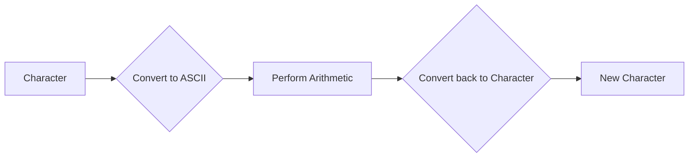

# <span style="color:#e67e22; font-size: 24px;">What we will learn in this post?</span>
<ul style='list-style-type: none; padding-left: 0;'>
<li style='margin: 6px 0;'><span style='color: #2980b9; font-size: 20px; font-weight: bold;'>👉</span> <span style='color: #2ecc71; font-size: 18px; font-weight: bold;'>Data Types in C</span></li>
<li style='margin: 6px 0;'><span style='color: #2980b9; font-size: 20px; font-weight: bold;'>👉</span> <span style='color: #2ecc71; font-size: 18px; font-weight: bold;'>Data Type Modifiers in C</span></li>
<li style='margin: 6px 0;'><span style='color: #2980b9; font-size: 20px; font-weight: bold;'>👉</span> <span style='color: #2ecc71; font-size: 18px; font-weight: bold;'>Literals in C</span></li>
<li style='margin: 6px 0;'><span style='color: #2980b9; font-size: 20px; font-weight: bold;'>👉</span> <span style='color: #2ecc71; font-size: 18px; font-weight: bold;'>Escape Sequence in C</span></li>
<li style='margin: 6px 0;'><span style='color: #2980b9; font-size: 20px; font-weight: bold;'>👉</span> <span style='color: #2ecc71; font-size: 18px; font-weight: bold;'>bool in C</span></li>
<li style='margin: 6px 0;'><span style='color: #2980b9; font-size: 20px; font-weight: bold;'>👉</span> <span style='color: #2ecc71; font-size: 18px; font-weight: bold;'>Integer Promotions in C</span></li>
<li style='margin: 6px 0;'><span style='color: #2980b9; font-size: 20px; font-weight: bold;'>👉</span> <span style='color: #2ecc71; font-size: 18px; font-weight: bold;'>Character Arithmetic in C</span></li>
<li style='margin: 6px 0;'><span style='color: #2980b9; font-size: 20px; font-weight: bold;'>👉</span> <span style='color: #2ecc71; font-size: 18px; font-weight: bold;'>Type Conversion in C</span></li>
<li style='margin: 6px 0;'><span style='color: #2980b9; font-size: 20px; font-weight: bold;'>👉</span> <span style='color: #2ecc71; font-size: 18px; font-weight: bold;'>Conclusion!</span></li>
</ul>

# <span style="color:#e67e22">C Data Types: Your Building Blocks for Programming</span> 🏗️

In the world of C programming, data types are like the building blocks of your programs. They tell the compiler what kind of information you're working with, helping it understand how to store, manipulate, and interpret your data. 

## <span style="color:#2980b9">Basic Data Types: The Foundation</span> 🧱

Here's a look at some of the most common data types in C:

### <span style="color:#8e44ad">Integer Types (int)</span> 🔢
*   **What they do:**  Store whole numbers (without decimal points) like 10, -5, and 0.
*   **Example:**
    ```c
    int age = 25; 
    int score = -10;
    ```
*   **Size in Memory:**  The size of an `int` can vary depending on your system (usually 4 bytes).

### <span style="color:#8e44ad">Floating-Point Types (float, double)</span> 🧮
*   **What they do:** Store numbers with decimal points, like 3.14, -2.5, and 1.0. 
*   **Example:**
    ```c
    float pi = 3.14159; 
    double price = 19.99;
    ```
*   **Size in Memory:** 
    *   `float`: Typically 4 bytes
    *   `double`: Usually 8 bytes (for more precision)

### <span style="color:#8e44ad">Character Type (char)</span> ✍️
*   **What it does:** Stores single characters, like 'A', '!', and '5'. 
*   **Example:**
    ```c
    char initial = 'J';
    char symbol = '$';
    ```
*   **Size in Memory:** Usually 1 byte

## <span style="color:#2980b9">Visualizing Data Types</span> 🖼️

Here's a simple diagram illustrating the memory representation of these basic data types:

```mermaid
graph LR
    A[int (4 bytes)] --> B[float (4 bytes)]
    B --> C[double (8 bytes)]
    C --> D[char (1 byte)]
```

## <span style="color:#2980b9">Choosing the Right Data Type</span> 🤔

Selecting the appropriate data type for your variables is crucial for efficient and accurate programming. Here are some key considerations:

*   **Memory Usage:** Choose the smallest data type that can hold your data to save memory.
*   **Precision:**  For decimal numbers, consider using `float` for general use or `double` for higher accuracy.
*   **Range of Values:** Make sure the data type can represent the full range of values you need.

**Pro Tip:** Always consider the data type you need before writing your code! 💡


# <span style="color:#e67e22">Data Type Modifiers in C: A Visual Guide</span> 🎨

## <span style="color:#2980b9">Introduction</span> 🤔

In the world of C programming, data types are like containers holding different kinds of information. But sometimes, you need to fine-tune these containers to fit your specific needs. This is where **data type modifiers** come in. They act like **special switches** that alter the size and range of your data types. 

Think of it this way: Imagine a box designed to hold a specific number of toys. You can use modifiers to make the box bigger or smaller, or change the type of toys it can hold. 

## <span style="color:#2980b9">Key Modifiers: A Visual Breakdown</span> 🧰

### <span style="color:#8e44ad">Size Modifiers: `short` and `long`</span> 📏

* **`short`**: This modifier makes the data type **smaller**, reducing the number of bits used to store the value.  
* **`long`**:  This modifier makes the data type **bigger**, increasing the number of bits and allowing for a larger range of values.

Let's visualize this using an example:

**`int`**:  A standard integer in C.  Imagine it as a box that can hold a specific number of marbles. 

**`short int`**: A smaller box, able to hold fewer marbles. 

**`long int`**: A larger box, capable of holding more marbles.

**Example:**

```c
short int age = 25;    // A smaller box for a person's age
long int population = 1000000;  // A larger box for a city's population
```

### <span style="color:#8e44ad">Sign Modifiers: `signed` and `unsigned`</span> ➕➖

* **`signed`**: This modifier allows the data type to store **both positive and negative** values. 
* **`unsigned`**: This modifier restricts the data type to **positive values only**.

**Visualization:**

Think of it like a number line:

* **`signed`**: Includes both the positive and negative sides of the line.
* **`unsigned`**: Only includes the positive side of the line.

**Example:**

```c
signed int temperature = -10;  // A signed integer to store negative temperatures
unsigned int count = 10;        // An unsigned integer to count items 
```

## <span style="color:#2980b9">Applying Modifiers to Base Data Types</span> 🛠️

**Base Data Type:** | **Modifier** | **Resulting Data Type** | **Purpose**
---|---|---|---
`int` | `short` | `short int` | Smaller integer for memory efficiency 
`int` | `long` | `long int` | Larger integer for larger values
`int` | `signed` | `signed int` | Allows for both positive and negative values (default)
`int` | `unsigned` | `unsigned int` | Restricts to positive values only
`char` | `unsigned` | `unsigned char` | Store characters with extended values (like ASCII)
`float` | `long` | `long double` | High-precision floating-point numbers

**Remember:** The exact size of data types depends on the specific compiler and architecture. 

## <span style="color:#2980b9">Example: Tracking Time</span> ⏱️

Let's say you're writing a program to track the time in seconds:

```c
#include <stdio.h>

int main() {
    // Storing seconds as a `short int`
    short int seconds = 59; 
    printf("Seconds: %hd\n", seconds); // Use %hd for short int 
    return 0;
}
```

**Output:**
```
Seconds: 59
```

**Why use `short int`?**

*  Since `short int` is smaller, it uses less memory, making your program more efficient. 
*  You don't need the full range of an `int` to store seconds because time usually won't exceed a specific limit.

## <span style="color:#2980b9">Conclusion</span> 🏁

Data type modifiers are powerful tools that let you precisely control the properties of your data. By understanding these modifiers, you can optimize your code for memory usage, improve accuracy, and tailor your program to specific needs. 


# <span style="color:#e67e22">Literals in C: The Building Blocks of Data</span> 
 
Think of literals as the **raw materials** you use in your C program. They represent **fixed values** that you can directly insert into your code. 

## <span style="color:#2980b9">Types of Literals</span>

Imagine a toolbox filled with different tools, each for a specific purpose.  Likewise, C has different types of literals, each representing a different type of data.  Let's explore them!

### <span style="color:#8e44ad">Integer Literals</span>  
 
* **Whole numbers** like 10, 5, -20, 0.
* **Examples:**
    * `10` 
    * `-5`
    * `0`
* **Usage:**
    * In calculations: `int result = 10 + 5;`
    * As indices in arrays: `int numbers[5] = {1, 2, 3, 4, 5};`

### <span style="color:#8e44ad">Floating-Point Literals</span> 

* **Numbers with decimal points** like 3.14, 1.5, -2.5.
* **Examples:**
    * `3.14159`
    * `-2.5`
    * `1.0`
* **Usage:**
    * For calculations involving decimals: `double area = 3.14159 * radius * radius;` 
    * In scientific notation: `1.2345e-2` (equivalent to 0.012345)

### <span style="color:#8e44ad">Character Literals</span> 

* **Single characters** enclosed in single quotes, like 'A', '!', '?'.
* **Examples:**
    * `'A'`
    * `'!'`
    * `'\n'` (newline character)
* **Usage:**
    * Displaying characters: `printf("The character is: %c\n", 'A');`
    * Storing single characters: `char initial = 'M';`

### <span style="color:#8e44ad">String Literals</span> 

* **Sequences of characters** enclosed in double quotes, like "Hello, world!", "C programming".
* **Examples:**
    * `"Hello, world!"`
    * `"This is a string."`
* **Usage:**
    * Displaying text: `printf("Hello, world!\n");`
    * Storing strings: `char greeting[] = "Hello, world!";`

## <span style="color:#2980b9">Illustrative Code Examples</span>

```c
#include <stdio.h>

int main() {
    // Integer literal
    int age = 25; 
    printf("My age is: %d\n", age);

    // Floating-point literal
    float pi = 3.14159;
    printf("The value of pi is: %.2f\n", pi);

    // Character literal
    char letter = 'A';
    printf("The letter is: %c\n", letter);

    // String literal
    char message[] = "This is a string literal.";
    printf("%s\n", message); 

    return 0;
}
```

## <span style="color:#2980b9">Key Points to Remember</span>

* Literals are **fundamental** in C, providing the values your program operates on. 
* Choose the **correct literal type** based on the data you need to represent. 
* Always enclose **character literals** in single quotes and **string literals** in double quotes.

**Remember:** C is all about how you combine these building blocks (literals) to create larger structures and powerful programs!

# <span style="color:#e67e22">Escape Sequences in C: A Beginner's Guide 📖</span>

## <span style="color:#2980b9">What are Escape Sequences? 🤔</span>

Imagine you're writing a program, and you want to include a special character in your string, like a newline (`\n`) or a tab (`\t`).  These special characters have a specific meaning in C and can't be directly typed into your code. That's where **escape sequences** come to the rescue! 🦸

Escape sequences are special character combinations that represent specific characters or actions within a string. They begin with a backslash (`\`) followed by a specific character. 

### <span style="color:#8e44ad">Common Escape Sequences 🔑</span>

Here are some common escape sequences you'll encounter in C:

| Escape Sequence | Description | Example |
|---|---|---|
| `\n` | Newline character - moves the cursor to the beginning of the next line | `printf("Line 1\nLine 2");` |
| `\t` | Horizontal tab character - inserts a tab space | `printf("Column 1\tColumn 2");` |
| `\\` | Backslash character | `printf("This is a backslash: \\");` |
| `\"` | Double quote character | `printf("This is a double quote: \"");` |
| `\'` | Single quote character | `printf("This is a single quote: \'");` |
| `\a` | Audible alert (bell) | `printf("\a");` |
| `\b` | Backspace | `printf("Hello\bWorld");` |
| `\r` | Carriage return - moves the cursor to the beginning of the current line | `printf("Hello\rWorld");` |
| `\v` | Vertical tab | `printf("Line 1\vLine 2");` |
| `\0` | Null character (marks the end of a string) | `char myString[] = "Hello\0";` |

## <span style="color:#2980b9">Examples of Escape Sequences in Strings 💻</span>

Let's see how escape sequences are used in strings:

**Example 1: Printing a newline:**

```c
#include <stdio.h>

int main() {
    printf("This is line 1.\n");
    printf("This is line 2.\n");
    return 0;
}
```

**Output:**

```
This is line 1.
This is line 2.
```

**Example 2: Printing a tab:**

```c
#include <stdio.h>

int main() {
    printf("Name\tAge\tCity\n");
    printf("John\t30\tNew York\n");
    return 0;
}
```

**Output:**

```
Name	Age	City
John	30	New York
```

**Example 3: Printing a double quote:**

```c
#include <stdio.h>

int main() {
    printf("He said, \"Hello!\" \n");
    return 0;
}
```

**Output:**

```
He said, "Hello!" 
```

## <span style="color:#2980b9">Why are Escape Sequences Important? 🤔</span>

Escape sequences are crucial for:

* **Representing Special Characters:** They allow you to include characters that are not directly available on your keyboard.
* **Controlling Output:** They give you fine-grained control over how your output is formatted.
* **Clarity and Readability:** They improve code readability by making it easier to understand what special characters are being used.

Remember, mastering escape sequences is a vital step in becoming a proficient C programmer.  Happy coding! 😊


# <span style="color:#e67e22">The Power of "True" and "False": Understanding `bool` in C</span> 

## <span style="color:#2980b9">What is `bool`?</span>

The `bool` data type in C represents a boolean value, which can be either **true** or **false**. Think of it as a light switch: it's either **on** or **off**.  

### <span style="color:#8e44ad">Why is it important?</span>

* **Logical operations:**  `bool` is crucial for performing logical operations like **and**, **or**, and **not**, which are the building blocks of decision-making in your code. 
* **Clarity and readability:**  Using `bool` makes your code easier to understand. Instead of using `1` for true and `0` for false, you can explicitly write `true` or `false`, making your intentions clear.
* **Standard compliance:**  `bool` was introduced in the C99 standard (published in 1999), becoming a part of the language.

## <span style="color:#2980b9">Working with `bool`</span> 

### <span style="color:#8e44ad">Declaring `bool` variables</span>

```c
bool is_active = true;
bool is_finished = false;
```

### <span style="color:#8e44ad">Using `bool` in conditional statements</span>

```c
#include <stdbool.h> 

int main() {
  bool is_raining = true;
  if (is_raining) {
    printf("Don't forget your umbrella! ☔️\n");
  } else {
    printf("Enjoy the sunshine! ☀️\n");
  }
  return 0;
}
```

### <span style="color:#8e44ad">Logical operators</span>

* **`&&` (AND):** Both conditions must be true for the result to be true. 
    * `true && true == true`
    * `true && false == false`
* **`||` (OR):**  At least one condition must be true for the result to be true.
    * `true || true == true`
    * `true || false == true`
    * `false || false == false`
* **`!` (NOT):**  Reverses the truth value.
    * `!true == false`
    * `!false == true`

### <span style="color:#8e44ad">Example: Checking if a number is even</span>

```c
#include <stdbool.h>

int main() {
  int number = 10;
  bool is_even = (number % 2 == 0); // True if number is divisible by 2
  if (is_even) {
    printf("%d is even.\n", number);
  } else {
    printf("%d is odd.\n", number);
  }
  return 0;
}
```

## <span style="color:#2980b9">Visualizing `bool` in action</span>

```mermaid
graph LR
  A[is_raining (true)] --> B{Take umbrella?}
  B --> C[Yes]
  B --> D[No]
  C --> E[Enjoy the sunshine!]
  D --> F[Get wet!]
```

This flowchart demonstrates how the `bool` variable `is_raining` influences the decision-making process in your code.

## <span style="color:#2980b9">Key points to remember:</span>

*  Always include `<stdbool.h>` header file to use the `bool` type. 
* `true` and `false` are defined as macros, so you don't need to worry about their internal representation.

Using `bool`  effectively can help you write more readable, efficient, and logically sound C programs.


# <span style="color:#e67e22">Integer Promotions in C:  Boosting Your Data 📈</span>

## <span style="color:#2980b9">Why Do We Need Integer Promotions?</span>

Imagine you're cooking and need to measure ingredients. Sometimes, you might have a small measuring spoon, but the recipe calls for a larger cup.  You'd need to convert the measurement from the spoon to the cup, right? 

Integer promotions in C work similarly.  Sometimes, you have smaller integer types like **`char`** or **`short`**, but your calculations or operations require a larger type like **`int`** or **`long`**.  Integer promotion helps you seamlessly convert those smaller types to larger ones. 

## <span style="color:#2980b9">How Integer Promotions Work: A Step-by-Step Guide</span>

Let's break down the promotion process:

### <span style="color:#8e44ad">Step 1: The "Smaller"  Types</span>

- **`char`**:  This is the smallest integer type, holding a single character.
- **`short`**: This type holds a smaller integer value than **`int`**.
- **`unsigned char`** and **`unsigned short`**: These are unsigned versions of **`char`** and **`short`**, allowing them to hold only positive values. 

### <span style="color:#8e44ad">Step 2: The Promotion Rules</span>

1. **The "int" Rule**: Smaller types (like **`char`** or **`short`**) are automatically promoted to **`int`** if the **`int`** type is large enough to hold their value.

2. **The "Larger" Rule**: If **`int`** isn't large enough to hold the value, then smaller types are promoted to **`unsigned int`** or the next larger type (e.g., **`long`**) that can hold the value.

### <span style="color:#8e44ad">Step 3: Operations and Conversions</span>

- **Arithmetic Operations**: When you perform calculations, all smaller types get promoted to at least **`int`** before the operation happens. This ensures consistent results.
- **Function Arguments**: When you pass a smaller type as an argument to a function, it gets promoted to **`int`** or a larger type based on the rules. 

## <span style="color:#2980b9">Let's See It In Action: Examples</span>

### <span style="color:#8e44ad">Example 1: The Simple Promotion</span>
```c
char myChar = 'A';
int myInt = myChar; // myChar gets promoted to int 
printf("myInt: %d\n", myInt);  // Output: myInt: 65
```

In this example, `myChar` (which holds the ASCII code for 'A', which is 65) is promoted to an `int` when assigned to `myInt`.

### <span style="color:#8e44ad">Example 2: Promotions in Calculations</span>
```c
short shortVal = 10;
char charVal = 5;
int result = shortVal + charVal; 
// both shortVal and charVal get promoted to int before addition
printf("result: %d\n", result);  // Output: result: 15
```

Here, both `shortVal` and `charVal` are promoted to `int` before the addition happens.

## <span style="color:#2980b9">Why Does This Matter?</span>

Integer promotions are crucial because they ensure that:

- **Operations Are Consistent**: All calculations are performed using the same type, regardless of the original types of the operands.
- **Data Integrity**:  Promoting smaller types to larger ones prevents data loss, ensuring the accuracy of your calculations.

## <span style="color:#2980b9">Diagrammatic View</span>

```mermaid
graph LR
A[char, short] --> B[int (if int is large enough)]
B --> C[unsigned int (if int is not large enough)]
C --> D[long (if unsigned int is not large enough)]
``` 
**This diagram represents the different scenarios of integer promotion based on the size of the int data type.**

Remember,  understanding integer promotions is essential for writing efficient and predictable C code.  It's like having the right measuring tools in your kitchen – ensuring everything comes out just right! 👨‍🍳 


# <span style="color:#e67e22">Character Arithmetic in C: Cracking the Code 🔐</span>

## <span style="color:#2980b9">The Magic Behind Characters 🪄</span>

In C, characters are not just letters, numbers, and symbols; they have an internal numerical representation. Think of it like a secret code! 🤔 Each character is assigned a unique integer value based on the **ASCII** (American Standard Code for Information Interchange) standard. 

### <span style="color:#8e44ad">ASCII: The Character Codebook 📚</span>

ASCII maps characters to numbers from 0 to 127. For example, 'A' is represented by 65, 'a' by 97, '0' by 48, and so on. This allows the computer to manipulate characters using numerical operations. 

**Example:**

```c
int characterValue = 'A'; // characterValue will be 65
```

## <span style="color:#2980b9">Character Arithmetic: Playing with Numbers 🧮</span>

We can use arithmetic operators like addition (+), subtraction (-), multiplication (*), and division (/) on characters because C treats them as integer values behind the scenes. 

**Let's illustrate with some examples:**

* **Adding to a character:**

  ```c
  char letter = 'a';
  letter = letter + 1;  // letter now becomes 'b' (98 in ASCII)
  ```

* **Subtracting from a character:**

  ```c
  char digit = '5';
  digit = digit - 2; // digit now becomes '3' (51 in ASCII)
  ```

* **Converting lowercase to uppercase:**

  ```c
  char lowercase = 'z';
  char uppercase = lowercase - 32; // uppercase becomes 'Z' (90 in ASCII)
  ```

## <span style="color:#2980b9">Visualizing Character Arithmetic: A Flowchart 🗺️</span>

Here's a flowchart that visually explains how character arithmetic works:



## <span style="color:#2980b9">Caveats and Considerations ⚠️</span>

* **Overflow:** Be cautious when performing arithmetic operations on characters, as exceeding the ASCII range (0-127) can lead to unexpected results.
* **Character Specifics:** Remember that character arithmetic is primarily for manipulating characters, not for general numerical calculations.

## <span style="color:#2980b9">Key Takeaways ✨</span>

* Characters in C are represented by integer values based on the ASCII standard.
* You can perform arithmetic operations on characters, treating them as integers.
* Understand the ASCII codebook and character ranges to avoid unexpected outcomes. 

By understanding the inner workings of character arithmetic, you gain more control over text manipulation in your C programs! 🎉


# <span style="color:#e67e22">Type Conversion in C: Making Data Fit</span> 

In the world of C programming, data types are like containers holding different kinds of information. Sometimes, you need to move data from one container to another, which is where **type conversion** comes into play. It's like pouring liquid from a glass to a bottle! 

## <span style="color:#2980b9">What is Type Conversion?</span> 

Type conversion, also called **casting**, is the process of changing the data type of a variable or expression. This is done to allow operations that might not be possible with the original data type. Imagine trying to mix oil and water - you'd need a way to make them compatible, right? Type conversion is similar for data in C!

### <span style="color:#8e44ad">Why Use Type Conversion?</span>

* **To perform arithmetic operations:**  You might need to add an integer to a floating-point number.
* **To use library functions:** Some functions require specific data types as arguments.
* **To fit data into a smaller container:** You might want to store a large number in a smaller data type like a `char`.

## <span style="color:#2980b9">Implicit Conversion: The Automatic Change</span>

Implicit type conversion happens automatically by the C compiler, like a helpful assistant! It usually occurs when you combine different data types in an expression.

### <span style="color:#8e44ad">Example: Mixing Data Types</span>

```c
int age = 25;
float average_score = 8.5;
float total_score = age + average_score; // Implicit conversion of 'age' to float
```

**Explanation:**

* The variable `age` is an integer, while `average_score` is a float. 
* When they are added, the compiler automatically converts the integer `age` to a float to match the data type of `average_score`.
* The result, `total_score`, is then stored as a float.

## <span style="color:#2980b9">Explicit Conversion: You're in Control</span>

Explicit type conversion, also called **casting**, is when you manually specify the data type you want to convert to. This gives you more control over the conversion process.

### <span style="color:#8e44ad">Example: Force a Change</span>

```c
double balance = 123.45;
int rounded_balance = (int)balance; // Explicitly cast 'balance' to an integer
```

**Explanation:**

* The variable `balance` is a double, representing a floating-point number with high precision.
* We use `(int)` to explicitly cast `balance` to an integer.
* This will truncate the decimal part, leaving only the whole number, which is then stored in `rounded_balance`. 

## <span style="color:#2980b9">Visualizing Type Conversion</span>

```mermaid
graph LR
A[Integer (int)] --> B[Float (float)]
B[Float (float)] --> C[Double (double)]
```

**Explanation:**

* This diagram shows how implicit type conversion works with different number data types.
* The arrow indicates that an implicit conversion occurs when a value of a higher data type is used in an expression with a lower data type. For example, an integer can be implicitly converted to a float, and a float can be converted to a double.

## <span style="color:#2980b9">Important Notes</span>

* **Data Loss:** Be careful with type conversion, especially when converting from a larger data type to a smaller one. You may lose data during the conversion process. For example, converting a `float` to an `int` will lose any decimal part of the number.
* **Casting vs. Implicit Conversion:** Remember that implicit conversion is done automatically by the compiler, while explicit casting is done manually by the programmer. 

## <span style="color:#2980b9">Key Takeaway</span>

Type conversion is a powerful tool in C. It allows you to work with different data types and perform operations that might not be possible otherwise. Understanding the difference between implicit and explicit conversion is crucial for writing correct and efficient code. 


<h1><span style='color:#e67e22'>Conclusion</span></h1>

And there you have it!  We've covered a lot of ground today, and I hope you found this information helpful and insightful.  I'm always eager to learn more, so I'd love to hear your thoughts and opinions!  😊  What are your experiences with [topic]? Do you have any tips or suggestions to add?  Let's keep the conversation going in the comments below! 👇 


