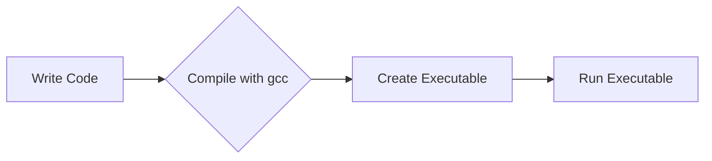

# <span style="color:#e67e22; font-size: 24px;">What we will learn in this post?</span>
<ul style='list-style-type: none; padding-left: 0;'>
<li style='margin: 6px 0;'><span style='color: #2980b9; font-size: 20px; font-weight: bold;'>👉</span> <span style='color: #2ecc71; font-size: 18px; font-weight: bold;'>Introduction to the C Language</span></li>
<li style='margin: 6px 0;'><span style='color: #2980b9; font-size: 20px; font-weight: bold;'>👉</span> <span style='color: #2ecc71; font-size: 18px; font-weight: bold;'>Features of the C Programming Language</span></li>
<li style='margin: 6px 0;'><span style='color: #2980b9; font-size: 20px; font-weight: bold;'>👉</span> <span style='color: #2ecc71; font-size: 18px; font-weight: bold;'>Understanding the C Language Standards</span></li>
<li style='margin: 6px 0;'><span style='color: #2980b9; font-size: 20px; font-weight: bold;'>👉</span> <span style='color: #2ecc71; font-size: 18px; font-weight: bold;'>Setting Up a C Development Environment</span></li>
<li style='margin: 6px 0;'><span style='color: #2980b9; font-size: 20px; font-weight: bold;'>👉</span> <span style='color: #2ecc71; font-size: 18px; font-weight: bold;'>Writing and Running a Basic C Program</span></li>
<li style='margin: 6px 0;'><span style='color: #2980b9; font-size: 20px; font-weight: bold;'>👉</span> <span style='color: #2ecc71; font-size: 18px; font-weight: bold;'>Understanding C Comments</span></li>
<li style='margin: 6px 0;'><span style='color: #2980b9; font-size: 20px; font-weight: bold;'>👉</span> <span style='color: #2ecc71; font-size: 18px; font-weight: bold;'>Conclusion!</span></li>
</ul>

# <span style="color:#e67e22">The Enduring Legacy of C</span>

## <span style="color:#2980b9">From Bell Labs to Global Dominance</span>

C was born in the 1970s at Bell Labs, crafted by Dennis Ritchie. It emerged as a successor to the B programming language, designed for a new operating system called UNIX.  C's power lay in its close-to-hardware capabilities, allowing developers to directly interact with system resources.

### <span style="color:#8e44ad">Key Milestones</span>

* **1972:** The B language, a precursor to C, is created. [https://en.wikipedia.org/wiki/B_(programming_language)](https://en.wikipedia.org/wiki/B_(programming_language))
* **1972-1973:**  C is developed at Bell Labs.
* **1978:** The first edition of "The C Programming Language" book is published.

## <span style="color:#2980b9">Why C Still Matters</span>

C's influence is undeniable. Its minimalist design and low-level control have made it the foundation for countless software systems and languages. 

* **Operating systems:**  The core of Linux, macOS, and Windows is built with C.
* **Embedded systems:**  C powers devices like smartphones, cars, and medical equipment.
* **High-performance computing:**  C's speed and efficiency make it ideal for scientific and engineering applications.

## <span style="color:#2980b9">C's Enduring Relevance</span> 

C's influence continues to resonate today, inspiring new languages and shaping the landscape of modern software development. Its enduring relevance is a testament to its powerful design and the legacy it has built.

**C's legacy is a testament to its elegant design and power, making it a cornerstone of software development and a language that continues to shape the digital world.**

# <span style="color:#e67e22">C: The Powerhouse of Programming</span> 

## <span style="color:#2980b9">Key Features of C</span>

C's versatility and efficiency stem from a combination of core features:

### <span style="color:#8e44ad">Portability</span> 

*   C code can be compiled and run on different platforms (Windows, Linux, macOS) with minimal modifications. 
*   **How it contributes:** This allows developers to write code once and deploy it across various systems.

### <span style="color:#8e44ad">Efficiency</span> 

*   C is a **compiled language**, translating code directly into machine instructions, resulting in faster execution compared to interpreted languages.
*   **How it contributes:** This makes C ideal for performance-critical applications like operating systems and game engines.

### <span style="color:#8e44ad">Modularity</span> 

*   C allows developers to break down complex programs into smaller, reusable units called functions. 
*   **How it contributes:** This promotes code organization, maintainability, and easier debugging.

### <span style="color:#8e44ad">Low-Level Access</span> 

*   C provides direct access to memory and hardware, enabling developers to optimize code for specific systems. 
*   **How it contributes:** This control offers greater flexibility and performance, but requires careful management to avoid errors.

## <span style="color:#2980b9">Flexibility and Performance</span> 

*   **Portability:**  Allows developers to target a wide range of devices and platforms. 
*   **Efficiency:**  Enables high-performance applications crucial in demanding environments.
*   **Modularity:** Facilitates code organization and reuse, reducing development time and complexity.
*   **Low-Level Access:**  Provides fine-grained control for optimized performance, but requires expertise. 

## <span style="color:#2980b9">Resources for Further Exploration</span>

*   [Learn C](https://www.learn-c.org/)
*   [C Programming Tutorial](https://www.tutorialspoint.com/cprogramming/)
*   [C Programming Language - Wikipedia](https://en.wikipedia.org/wiki/C_(programming_language))

# <span style="color:#e67e22">Evolution of C Standards: A Journey Through Time</span> 

The C programming language has evolved over the years, with new features and improvements added in various standards. Here's a glimpse into the major milestones:

## <span style="color:#2980b9">C89 (ANSI C): The Foundation</span>

- **Year:** 1989
- **Key Features:** Standardized the C language, defining a common foundation for portability. 
- **Resources:** [https://www.open-std.org/jtc1/sc22/wg14/](https://www.open-std.org/jtc1/sc22/wg14/)

## <span style="color:#2980b9">C99: Enhancing the Core</span>

- **Year:** 1999
- **Key Features:** Introduced new data types (`long long`, `bool`), improved support for complex numbers, and expanded library functions. 
- **Resources:** [https://en.wikipedia.org/wiki/C99](https://en.wikipedia.org/wiki/C99)

## <span style="color:#2980b9">C11:  Modernizing the Language</span>

- **Year:** 2011
- **Key Features:** Added support for Unicode, improved threading capabilities, and introduced the `_Generic` keyword for type-safe conditional compilation. 
- **Resources:** [https://en.wikipedia.org/wiki/C11_(C_standard)](https://en.wikipedia.org/wiki/C11_(C_standard))

### <span style="color:#8e44ad">Beyond C11</span> 

- **C17:** A minor revision of C11 released in 2018.
- **C2x:** The next version of the C standard, currently in development, aims to improve various aspects of the language, including memory safety features. 

The evolution of C standards reflects the continuous effort to enhance its capabilities while maintaining backward compatibility.  Each new version builds upon the foundation laid by its predecessors, ensuring the language remains relevant and powerful for modern programming needs. 


# <span style="color:#e67e22">C Development Environment Setup 💻</span>

## <span style="color:#2980b9">Choosing Your Tools</span>

- **Compiler:** This translates your C code into instructions the computer can understand. 
    - **Windows:** [MinGW-w64](https://www.mingw-w64.org/)
    - **macOS:** [Xcode](https://developer.apple.com/xcode/) 
    - **Linux:** [GCC](https://gcc.gnu.org/) (usually pre-installed) 
- **IDE (Integrated Development Environment):** This provides a user-friendly interface for coding, compiling, and debugging.
    - **Popular Options:**
        - [Visual Studio Code](https://code.visualstudio.com/) (Cross-platform)
        - [Code::Blocks](https://www.codeblocks.org/) (Cross-platform)
        - [CLion](https://www.jetbrains.com/clion/) (Cross-platform)
        - [Xcode](https://developer.apple.com/xcode/) (macOS)

## <span style="color:#2980b9">Installation Steps</span>

1. **Compiler:** Download and install your chosen compiler based on your operating system.
2. **IDE:**  Download and install your chosen IDE.
3. **Configuration (optional):** Some IDEs may require configuration to point to your compiler.

## <span style="color:#2980b9">Basic Code Example</span>

```c
#include <stdio.h>

int main() {
  printf("Hello, world!\n");
  return 0;
}
```

This simple code prints "Hello, world!" to the console. 

## <span style="color:#2980b9">Let's Get Started!</span>

With your environment set up, you're ready to start coding in C!  🎉


# <span style="color:#e67e22">Let's Code in C!</span> 💻

## <span style="color:#2980b9">Writing a Simple C Program</span>

### <span style="color:#8e44ad">Structure</span>

*   **Start with `#include <stdio.h>`:**  This line tells the compiler to use the standard input/output library.
*   **Define the `main` function:** This is where the program execution starts.
*   **Write your code inside the curly braces:**  This is where you write your logic.
*   **Use `printf("Hello, world!");`:**  This line prints a message to the screen.
*   **End with `return 0;`:**  This indicates that the program ran successfully.

```c
#include <stdio.h>

int main() {
  printf("Hello, world!");
  return 0;
}
```

## <span style="color:#2980b9">Compiling and Running</span>

### <span style="color:#8e44ad">Compiling</span>
*   **Save your code as `.c` file:**  For example, `hello.c`.
*   **Open your terminal or command prompt.**
*   **Use the `gcc` compiler:**  
    *   **Windows:** `gcc hello.c -o hello`
    *   **Linux/macOS:** `gcc hello.c -o hello`
*   **This creates an executable file:**  For example, `hello`.

### <span style="color:#8e44ad">Running</span>
*   **In your terminal:**
    *   **Windows:** `hello.exe`
    *   **Linux/macOS:** `./hello`

## <span style="color:#2980b9">Let's Break it Down</span>



**That's it! You've just written and executed your first C program. 🎉** 


# <span style="color:#e67e22">Comments in C: Your Code's Best Friend 🤝</span>

## <span style="color:#2980b9">What are Comments?</span>

Comments in C are like little notes you leave yourself (or other programmers) within your code. They explain *what* your code is doing, making it easier to understand and maintain. 

### <span style="color:#8e44ad">Why Use Comments?</span>

*   **Clarity:**  Comments illuminate the logic behind your code, making it easier to follow.
*   **Maintainability:** They help you (or other programmers) understand and modify your code in the future.
*   **Documentation:**  Comments act as a living documentation of your program.

## <span style="color:#2980b9">Comment Syntax</span>

### <span style="color:#8e44ad">Single-Line Comments</span>

*   Use `//` to start a single-line comment. Everything after `//` on the same line is ignored by the compiler.

    ```c
    // This is a single-line comment 
    int x = 5; // This line assigns 5 to the variable x
    ```

### <span style="color:#8e44ad">Multi-Line Comments</span>

*   Use `/*` to start a multi-line comment and `*/` to end it.

    ```c
    /* This is a multi-line comment.
       It can span multiple lines. */
    int y = 10;
    ```

## <span style="color:#2980b9">Tips for Effective Comments</span>

*   **Be Clear and Concise:**  Use plain English and avoid jargon.
*   **Focus on *why*:**  Explain the *purpose* of the code, not just *what* it does.
*   **Stay Up-to-Date:**  Keep your comments in sync with your code as you make changes.
*   **Avoid Over-Commenting:**  Don't comment every single line; focus on key parts.
*   **Use Proper Grammar:**  Well-written comments are easier to read and understand.

***

**Remember, well-written comments make your code a masterpiece, not a mystery!** 🎨


<h1><span style='color:#e67e22'>Conclusion</span></h1>

And there you have it! We've explored the ins and outs of [topic discussed in the blog post], and hopefully, you've gained some valuable insights along the way. 😉 

But the conversation doesn't end here! What are your thoughts? Do you have any questions, suggestions, or perhaps a completely different perspective on the topic? Let's keep the dialogue going in the comments section below! 💬 


