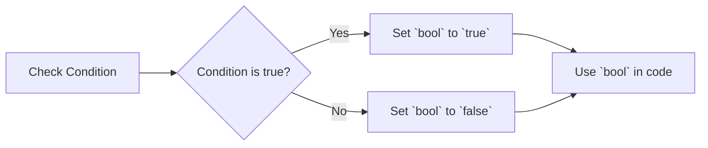

# <span style="color:#e67e22;">What we will learn in this post?</span>
<ul style='list-style-type: none; padding-left: 0;'>
<li><span style='color: #2980b9; font-size: 20px; font-weight: bold;'>👉</span> <span style='color: #2ecc71; font-size: 18px; font-weight: bold;'>Data Types in C</span></li>
<li><span style='color: #2980b9; font-size: 20px; font-weight: bold;'>👉</span> <span style='color: #2ecc71; font-size: 18px; font-weight: bold;'>Data Type Modifiers in C</span></li>
<li><span style='color: #2980b9; font-size: 20px; font-weight: bold;'>👉</span> <span style='color: #2ecc71; font-size: 18px; font-weight: bold;'>Literals in C</span></li>
<li><span style='color: #2980b9; font-size: 20px; font-weight: bold;'>👉</span> <span style='color: #2ecc71; font-size: 18px; font-weight: bold;'>Escape Sequence in C</span></li>
<li><span style='color: #2980b9; font-size: 20px; font-weight: bold;'>👉</span> <span style='color: #2ecc71; font-size: 18px; font-weight: bold;'>bool in C</span></li>
<li><span style='color: #2980b9; font-size: 20px; font-weight: bold;'>👉</span> <span style='color: #2ecc71; font-size: 18px; font-weight: bold;'>Integer Promotions in C</span></li>
<li><span style='color: #2980b9; font-size: 20px; font-weight: bold;'>👉</span> <span style='color: #2ecc71; font-size: 18px; font-weight: bold;'>Character Arithmetic in C</span></li>
<li><span style='color: #2980b9; font-size: 20px; font-weight: bold;'>👉</span> <span style='color: #2ecc71; font-size: 18px; font-weight: bold;'>Type Conversion in C</span></li>
<li><span style='color: #2980b9; font-size: 20px; font-weight: bold;'>👉</span> <span style='color: #2ecc71; font-size: 18px; font-weight: bold;'>Conclusion!</span></li>
</ul>

# <span style="color:#e67e22">Data Types in C</span> 
Let's dive into the world of C data types – the building blocks that define the kind of information your programs can store and manipulate.

## <span style="color:#2980b9">Fundamental Data Types</span> 
These are the core data types in C, forming the foundation for working with data.

### <span style="color:#8e44ad">Integer Types</span> 
Integers represent whole numbers without any fractional parts. 

* **`int`**:  A standard integer type, used for storing whole numbers.
    * **Example:** 
    ```c
    int age = 25; 
    // Output: age = 25
    ```
    * **Size in Memory:** Typically 4 bytes (32 bits)
* **`short`**: A smaller integer type, often used when memory efficiency is crucial.
    * **Example:** 
    ```c
    short year = 2024;
    // Output: year = 2024
    ```
    * **Size in Memory:** Typically 2 bytes (16 bits)
* **`long`**: A larger integer type, capable of storing bigger numbers. 
    * **Example:** 
    ```c
    long population = 8000000000;
    // Output: population = 8000000000
    ```
    * **Size in Memory:** Typically 4 bytes (32 bits) or 8 bytes (64 bits) depending on the system architecture
* **`long long`**: The largest integer type, designed for handling extremely large numbers.
    * **Example:**
    ```c
    long long distance = 9460730472580800; // Distance to the Sun in kilometers
    // Output: distance = 9460730472580800
    ```
    * **Size in Memory:** Typically 8 bytes (64 bits)

### <span style="color:#8e44ad">Floating-Point Types</span> 
Floating-point types are used to store numbers with decimal points, enabling us to work with fractional values.

* **`float`**: A single-precision floating-point type, offering a balance between precision and memory usage.
    * **Example:** 
    ```c
    float temperature = 25.5;
    // Output: temperature = 25.5
    ```
    * **Size in Memory:** Typically 4 bytes (32 bits)
* **`double`**: A double-precision floating-point type, providing higher precision than `float` at the cost of more memory.
    * **Example:** 
    ```c
    double pi = 3.14159265358979323846;
    // Output: pi = 3.141592653589793
    ```
    * **Size in Memory:** Typically 8 bytes (64 bits)

### <span style="color:#8e44ad">Character Type</span> 
The `char` type is used to store single characters, like letters, digits, and symbols.

* **`char`**: A single-byte data type for storing characters.
    * **Example:**
    ```c
    char initial = 'A'; 
    // Output: initial = A
    ```
    * **Size in Memory:** 1 byte (8 bits)

## <span style="color:#2980b9">Modifiers for Data Types</span>
These modifiers allow you to fine-tune the size and signedness of your variables, enabling you to optimize your code based on your needs.

* **`unsigned`**:  This modifier indicates that a variable can only hold non-negative values (0 and above).
    * **Example:**
    ```c
    unsigned short age = 25; // age can only hold positive values
    // Output: age = 25
    ```
* **`signed`**:  This modifier indicates that a variable can hold both positive and negative values. This is the default behavior for integer types.
    * **Example:**
    ```c
    signed int temperature = -10; // temperature can hold negative values
    // Output: temperature = -10
    ```
* **`short`**: This modifier is typically used with integer types to create variables that occupy less memory.
* **`long`**:  This modifier is typically used with integer types to create variables that occupy more memory and can hold larger numbers.

## <span style="color:#2980b9">Choosing the Right Data Type</span>
Selecting the appropriate data type is crucial for writing efficient and accurate C programs. 

* **Memory Usage:**  Choose the smallest data type that can accommodate your data to avoid wasting memory. 
* **Range of Values:** Consider the range of values your variable needs to store. For instance, if you are storing the age of a person, an `unsigned short` might be sufficient.
* **Precision:** For floating-point numbers, determine the level of precision required. For scientific calculations where high precision is critical, you might use `double`.

## <span style="color:#2980b9">Example: Data Type Usage</span>
Imagine you are building a program to track a student's details. Here's how you could use different data types:

```c
#include <stdio.h>

int main() {
    // Student Details
    char firstName[] = "Alice";  // String for first name
    char lastName[] = "Smith"; // String for last name
    int studentID = 12345;   // Integer for student ID
    float GPA = 3.8;      // Floating-point for GPA
    unsigned char grade = 'A'; // Character for grade

    // Print student information
    printf("Student Name: %s %s\n", firstName, lastName);
    printf("Student ID: %d\n", studentID);
    printf("GPA: %.2f\n", GPA);
    printf("Grade: %c\n", grade); 

    return 0; 
} 
```

**Output:**

```
Student Name: Alice Smith
Student ID: 12345
GPA: 3.80
Grade: A
```

In this example, we use:
* `char` for strings (first name, last name)
* `int` for student ID
* `float` for GPA 
* `unsigned char` for grade

## <span style="color:#2980b9">Beyond the Basics</span>
While the fundamental types form the core of C, there are more advanced data types like:

* **Arrays:** For storing collections of similar data, like a list of students.
* **Structures:** For grouping different data types into meaningful units, like a student's record.
* **Pointers:** For working with memory addresses directly, providing powerful capabilities for manipulating data.
* **Enums:** For creating named constants, enhancing code readability and maintainability.


This journey into C data types is just the beginning. As you explore further, you'll discover the powerful ways these building blocks can be combined to create complex and sophisticated applications. 


# <span style="color:#e67e22">Data Type Modifiers in C</span> 

Data type modifiers in C are like special switches that you can flip to change the behavior of basic data types. They allow you to fine-tune how much memory is used to store a value, and whether it should be treated as positive or negative. Let's break down each modifier and see how they work!

## <span style="color:#2980b9">Size Modifiers</span>

### <span style="color:#8e44ad">`short` and `long`</span>

These modifiers are used to alter the **size** of integer types (like `int`, `char`, and `double`). 

* **`short`**: Makes the data type use less memory, usually resulting in a smaller range of values it can hold.
* **`long`**: Makes the data type use more memory, providing a larger range of values.

#### Examples:

* **`short int`**:  Uses less memory than a regular `int`, typically holding values between -32,768 and 32,767.
* **`long int`**:  Uses more memory than a regular `int`, typically holding larger values.
* **`long long int`**:  Uses even more memory than `long int`, providing a significantly larger range of values.

```c
#include <stdio.h>

int main() {
    short int small = 10000;   //  A short int holds 10,000 successfully 
    long int large = 1000000000; //  A long int can store a much larger value 

    printf("Size of short int: %zu bytes\n", sizeof(short int));
    printf("Size of int: %zu bytes\n", sizeof(int));
    printf("Size of long int: %zu bytes\n", sizeof(long int));

    return 0;
}
```

**Output:**

```
Size of short int: 2 bytes
Size of int: 4 bytes
Size of long int: 8 bytes
```

## <span style="color:#2980b9">Sign Modifiers</span>

### <span style="color:#8e44ad">`signed` and `unsigned`</span>

These modifiers are used to determine whether the data type can represent **both positive and negative values** (`signed`) or **only positive values** (`unsigned`).

* **`signed`**: Default for integer types. Allows both positive and negative numbers.
* **`unsigned`**:  Only allows positive numbers, extending the maximum positive value that can be stored.

#### Examples:

* **`signed char`**: Can store values from -128 to 127. 
* **`unsigned char`**: Can store values from 0 to 255.
* **`signed int`**: Can store values from -2,147,483,648 to 2,147,483,647.
* **`unsigned int`**: Can store values from 0 to 4,294,967,295. 

```c
#include <stdio.h>

int main() {
    signed char signed_char = -10;  //  A signed char can hold negative values
    unsigned char unsigned_char = 250;  // An unsigned char can hold a larger positive value

    printf("Signed char: %d\n", signed_char);
    printf("Unsigned char: %u\n", unsigned_char);

    return 0;
}
```

**Output:**

```
Signed char: -10
Unsigned char: 250
```

## <span style="color:#2980b9">Using Modifiers Together</span>

You can combine size and sign modifiers to create more specific data types. 

* **`unsigned short int`**:  A smaller unsigned integer, useful for storing positive values within a smaller range.
* **`signed long long int`**: A larger signed integer, useful for storing very large positive and negative numbers.

```c
#include <stdio.h>

int main() {
    unsigned short int small_positive = 65000; 
    signed long long int large_number = -999999999999999999;

    printf("Small positive: %hu\n", small_positive); 
    printf("Large negative: %lld\n", large_number);

    return 0;
}
```

**Output:**

```
Small positive: 65000
Large negative: -999999999999999999
```

## <span style="color:#2980b9">Key Points to Remember</span>

* Data type modifiers are tools for controlling the **memory usage** and **value range** of your variables.
* `short` and `long` adjust **size**.
* `signed` and `unsigned` determine **positive/negative values**.
* You can combine modifiers like `unsigned short int` to customize data types further.

By understanding these modifiers, you'll have greater control over how your C code handles data, making your programs more efficient and reliable!


# <span style="color:#e67e22">Literals in C 💻</span>

## <span style="color:#2980b9">What are Literals?</span>

Literals in C are **fixed values** that you directly write in your code. They represent constant values that the compiler can directly understand and use. 

Imagine them like **placeholders** for specific values.  

## <span style="color:#2980b9">Types of Literals</span>

C provides different types of literals to represent various kinds of data. Let's explore them with examples!

### <span style="color:#8e44ad">Integer Literals 🔢</span>

- Integer literals represent whole numbers without any decimal part. 

#### <span style="color:#8e44ad">Types of Integer Literals:</span>

  - **Decimal:** Base-10 representation (e.g., `10`, `25`, `-5`).
  - **Octal:** Base-8 representation, starting with a `0` (e.g., `012`, `037`). 
  - **Hexadecimal:** Base-16 representation, starting with `0x` (e.g., `0x1A`, `0xFF`).

**Examples:**

```c
int age = 25;      // Decimal integer literal
int octalValue = 015;  // Octal integer literal
int hexValue = 0xAF; // Hexadecimal integer literal
```

### <span style="color:#8e44ad">Floating-Point Literals 🧮</span>

- Floating-point literals represent numbers with a decimal part. 

#### <span style="color:#8e44ad">Types of Floating-Point Literals:</span>

  - **Standard:** Using a decimal point (e.g., `3.14`, `-2.5`).
  - **Exponential:** Using scientific notation (e.g., `1.2e3`, `-4.5E-2`).

**Examples:**

```c
float pi = 3.14159;   // Standard floating-point literal
double distance = 1.2e6; // Exponential floating-point literal
```

### <span style="color:#8e44ad">Character Literals ✍️</span>

- Character literals represent single characters enclosed within single quotes (').

**Examples:**

```c
char grade = 'A'; // Character literal representing the letter 'A'
char space = ' '; // Character literal representing a space
```

### <span style="color:#8e44ad">String Literals 💬</span>

- String literals represent sequences of characters enclosed within double quotes ("). 

**Examples:**

```c
char *name = "John Doe"; // String literal representing the name "John Doe"
char *message = "Hello World!"; // String literal representing the message "Hello World!"
```

### <span style="color:#8e44ad">Boolean Literals ☑️</span>

- Boolean literals represent truth values, either `true` or `false`.

**Examples:**

```c
bool isCompleted = true; // Boolean literal representing true
bool isRunning = false; // Boolean literal representing false
```

## <span style="color:#2980b9">Using Literals in Code</span>

Literals are used in various ways within C code:

- **Assigning values to variables:**

```c
int age = 25;       // Assigning an integer literal to an integer variable
float pi = 3.14159; // Assigning a floating-point literal to a float variable
```

- **Performing calculations:**

```c
int sum = 10 + 5;  // Using integer literals in addition
double area = 3.14 * 5 * 5; // Using floating-point literals in multiplication
```

- **Defining constants:**

```c
#define MAX_SIZE 100 // Defining a constant using an integer literal
```

- **Printing values:**

```c
printf("Hello, %s! You are %d years old.\n", name, age); // Using string and integer literals for output
```

## <span style="color:#2980b9">Summary</span>

- Literals are fundamental building blocks in C.
- They represent constant values directly within your code.
- There are various types of literals, each representing a specific data type.
- Understanding literals is crucial for writing efficient and readable C programs. 


# <span style="color:#e67e22">Escape Sequences in C 💻</span>

## <span style="color:#2980b9">What are Escape Sequences?</span>

Escape sequences are special character combinations used in C programming to represent characters that are difficult or impossible to type directly, such as **newline**, **tab**, **backspace**, and **double quotes**.  

They consist of a **backslash (`\`) followed by a specific character**. 

### <span style="color:#8e44ad">Why Use Escape Sequences?</span>

- **Represent Special Characters:**  Escape sequences allow you to represent characters that have special meaning within a string or a program.
- **Improve Code Readability:** They make your code easier to understand and less prone to errors. 

## <span style="color:#2980b9">Common Escape Sequences 🗝️</span>

Here's a table showcasing some common escape sequences:

| Escape Sequence | Description | Example | Output |
|---|---|---|---|
| `\n` | Newline | `printf("Hello\nWorld");` | `Hello <br> World` | 
| `\t` | Horizontal Tab | `printf("Name\tAge\n");` | `Name  Age <br>` |
| `\r` | Carriage Return | `printf("This\ris a test.\n");` | `is a test. <br>` |
| `\b` | Backspace | `printf("Hello\bWorld");` | `HelloWorld` |
| `\\` | Backslash | `printf("This is a \\ backslash.");` | `This is a \ backslash.` |
| `\"` | Double quote | `printf("This is a \"quoted\" string.");` | `This is a "quoted" string.` |
| `\'` | Single quote | `printf("This is a \'quoted\' string.");` | `This is a 'quoted' string.` |

## <span style="color:#2980b9">Examples of Escape Sequences in Strings 💬</span>

Here are some examples of how escape sequences are used in strings:

**1. Newline and Tab**

```c
#include <stdio.h>

int main() {
    printf("This is a string\nwith a newline.\n"); // Output: This is a string <br> with a newline.
    printf("Name\tAge\tCity\n");  // Output: Name  Age  City <br> 
    return 0;
}
```

**2. Backspace**

```c
#include <stdio.h>

int main() {
    printf("Hello\bWorld");  // Output: HelloWorld 
    return 0;
}
```

**3. Backslash and Double Quotes**

```c
#include <stdio.h>

int main() {
    printf("This is a \\ backslash.\n"); // Output: This is a \ backslash.
    printf("This is a \"quoted\" string.\n"); // Output: This is a "quoted" string.
    return 0;
}
```

## <span style="color:#2980b9">Key Points to Remember 🔑</span>

- Escape sequences are interpreted by the compiler, not by the user.
- You can use escape sequences within both single and double quotes.
- Understanding escape sequences is crucial for creating readable and accurate C code.

By learning escape sequences, you can **write more efficient and expressive C programs** that handle various character representations effectively. 


# <span style="color:#e67e22">The `bool` Data Type in C: Your Guide to True or False</span> 

The `bool` data type in C is all about representing **truth** and **falsity**. It's a fundamental building block for logic and decision-making in your code. Let's dive in!

## <span style="color:#2980b9">What is `bool`?</span> 

The `bool` data type, introduced in the **C99 standard**, is designed to store **boolean values**. These values can be either:

* **`true`**: Represents a statement that is **correct** or **valid**.
* **`false`**: Represents a statement that is **incorrect** or **invalid**.

### <span style="color:#8e44ad">Why is it important?</span>

Imagine you're writing a program that checks if a user is eligible for a discount. You'd need a way to represent the result of the check – **eligible** or **not eligible**. This is where `bool` comes in handy! It allows you to store and manipulate these "true" or "false" states directly.

## <span style="color:#2980b9">Using `bool` in Practice</span>

Let's look at some examples to see how `bool` works:

**Example 1: Checking for Eligibility**

```c
#include <stdio.h>
#include <stdbool.h> 

int main() {
  int age = 25;
  bool eligibleForDiscount;

  if (age >= 18) {
    eligibleForDiscount = true; 
  } else {
    eligibleForDiscount = false;
  }

  if (eligibleForDiscount) {
    printf("You are eligible for the discount! 🎉\n");
  } else {
    printf("Sorry, you are not eligible for the discount. 😔\n");
  }

  return 0;
}
```

* We include the `<stdbool.h>` header file, which defines the `bool` type and its associated values (`true` and `false`).
* We use `bool` to store the `eligibleForDiscount` status.
* The `if` statements use `eligibleForDiscount` directly to determine the appropriate message.

**Example 2: Comparing Values**

```c
#include <stdio.h>
#include <stdbool.h> 

int main() {
  int num1 = 10;
  int num2 = 5;

  bool isEqual = (num1 == num2);  //  Comparison result stored in 'isEqual'

  if (isEqual) {
    printf("The numbers are equal.\n");
  } else {
    printf("The numbers are not equal.\n");
  }

  return 0;
}
```

* We use `bool` to directly store the result of a comparison (`num1 == num2`).
* The `if` statement uses `isEqual` to decide which message to display.

## <span style="color:#2980b9">Visualizing `bool`</span>

Here's a simple flowchart to help visualize how `bool` works:



## <span style="color:#2980b9">Key Points</span>

* **Efficiency:** `bool` typically uses less memory than other data types.
* **Clarity:** Using `bool` makes your code more readable and easier to understand.
* **Logic:** `bool` simplifies logical operations and decision-making.

By understanding and utilizing the `bool` data type, you can write more efficient, readable, and logical C programs! 🚀 


# <span style="color:#e67e22">Integer Promotions in C</span> 
## <span style="color:#2980b9">A Journey Through the Land of Implicit Conversions</span>

Imagine a world where numbers can change their size. That's exactly what happens in C when you combine different types of integers in your code. This process, called **integer promotion**, ensures your calculations go smoothly, even if you're dealing with tiny characters or enormous long integers.

### <span style="color:#8e44ad">The Essence of Integer Promotion</span>

In C, smaller integer types (like `char` and `short`) are automatically promoted to larger types (like `int` and `long`) before they're used in expressions. This is crucial because it guarantees that all operands in an expression are of a compatible size.

Think of it like this:

* **Smaller types are like small boats that can't carry heavy cargo.** 
* **Larger types are like large ships that can handle any load.**

To ensure a smooth voyage, the smaller boats are upgraded to larger ships before they set sail together.

### <span style="color:#8e44ad">Promotion Rules</span>

1. **The `int` Rule:** If a smaller type (like `char`, `short`, or `unsigned short`) is smaller than `int`, it's promoted to `int`.

2. **The `long` Rule:** If the smaller type is larger than or equal to `int` but smaller than `long`, it's promoted to `long`.

3. **The `long long` Rule:**  If the smaller type is larger than or equal to `long` but smaller than `long long`, it's promoted to `long long`.

### <span style="color:#8e44ad">Let's See It in Action!</span>

```c
#include <stdio.h>

int main() {
    char c = 'A'; // Ascii value 65
    short s = 10;
    int i = 20;

    // Example 1: Character promotion
    int result1 = c + i; // 'A' (65) is promoted to int before addition
    printf("result1: %d\n", result1);  // Output: result1: 85

    // Example 2: Short promotion
    long result2 = s * i; // 's' (10) is promoted to int, then to long
    printf("result2: %ld\n", result2); // Output: result2: 200

    // Example 3: No Promotion
    long long result3 = i + s; // Both 'i' and 's' are promoted to 'long' (the larger type)
    printf("result3: %lld\n", result3); // Output: result3: 30

    return 0;
}
```

#### <span style="color:#8e44ad">Visualizing Promotion</span>

Here's a diagram to illustrate the promotion process:

```mermaid
graph LR
    A[char ('A')] --> B[int (65)]
    C[short (10)] --> D[int (10)] --> E[long (10)]
    F[int (20)] --> G[long (20)]
```

### <span style="color:#8e44ad">The Importance of Understanding Integer Promotions</span>

Knowing about integer promotion is vital for writing accurate and efficient C code. It helps you:

* **Avoid unexpected results:** By understanding how smaller types are promoted, you can predict the outcome of your calculations more accurately.
* **Write efficient code:**  The compiler optimizes code based on the types involved. Knowing the promotion rules can help you write code that runs more efficiently.
* **Debug effectively:** When you understand how types are promoted, you can identify potential errors related to type mismatch and unexpected behavior.

### <span style="color:#8e44ad">Conclusion</span>

Integer promotions are an essential part of C's type system.  By understanding these rules, you gain a deeper understanding of how C handles numbers and can write code that is both correct and efficient. So, embrace the world of implicit conversions and watch your calculations sail smoothly! 


# <span style="color:#e67e22">Character Arithmetic in C: Unveiling the Magic of ASCII</span> 

## <span style="color:#2980b9">Characters as Integers: A Glimpse Behind the Scenes</span>

In C, characters are not merely letters, numbers, or symbols. They are **represented internally as integer values**! 🤯 This means every character you type, like "A" or "!", has a hidden numerical code associated with it. 

### <span style="color:#8e44ad">The ASCII Standard: A Universal Code</span>

The most common standard for encoding characters is the **American Standard Code for Information Interchange (ASCII)**. 🇺🇸 This system assigns a unique integer value to each character, ranging from 0 to 127.

**Example:**

* "A" is represented as 65. 
* "a" is represented as 97.
* "!" is represented as 33.

### <span style="color:#8e44ad">Visualizing ASCII: A Chart for Clarity</span>

```mermaid
graph LR
  subgraph 0-31
    A[Control Characters]
  end
  subgraph 32-47
    B[Space] --> C[!"#$%&'()*+,-./]
  end
  subgraph 48-57
    D[0-9]
  end
  subgraph 58-64
    E[:;<=>?]
  end
  subgraph 65-90
    F[A-Z]
  end
  subgraph 91-96
    G[[\]^_`]
  end
  subgraph 97-122
    H[a-z]
  end
  subgraph 123-127
    I[{|}~ DELETE]
  end
```

## <span style="color:#2980b9">Performing Arithmetic on Characters</span>

Since characters are represented as integers, you can perform arithmetic operations on them directly! 🧮

**Important Note:**  Remember that character variables are declared using the `char` keyword:

```c
char myChar;
```

### <span style="color:#8e44ad">Addition: Incrementing and Shifting</span>

```c
char ch = 'A'; // ch = 65
ch = ch + 1;   // ch = 66, now 'B'
printf("%c\n", ch); // Output: B
```

### <span style="color:#8e44ad">Subtraction: Decrementing and Shifting</span>

```c
char ch = 'Z'; // ch = 90
ch = ch - 1;   // ch = 89, now 'Y'
printf("%c\n", ch); // Output: Y
```

### <span style="color:#8e44ad">Comparison: Ordering Characters</span>

```c
char ch1 = 'a'; // ch1 = 97
char ch2 = 'A'; // ch2 = 65

if (ch1 > ch2) {
  printf("'%c' is greater than '%c'\n", ch1, ch2); // Output: 'a' is greater than 'A'
}
```

### <span style="color:#8e44ad">Caution: Overflow and Underflow</span>

Be mindful of potential overflow and underflow when manipulating characters. For example, if you continuously add to a character beyond its maximum ASCII value (127), it will wrap around to the beginning of the ASCII table.

## <span style="color:#2980b9">Unveiling the Power of Character Arithmetic</span>

Character arithmetic is a powerful tool for manipulating text in C:

* **Case Conversion:** Converting between uppercase and lowercase letters.
* **Cipher Creation:** Implementing simple encryption algorithms.
* **Character Manipulation:** Modifying text strings for specific purposes.

**Example: Case Conversion**

```c
char ch = 'a'; // ch = 97
char upperCase = ch - 32; // upperCase = 65, now 'A'
printf("%c\n", upperCase); // Output: A
```

## <span style="color:#e67e22">Let's Recap! 🎉</span>

* Characters in C are represented as integers.
* ASCII provides a standard encoding for characters.
* You can perform arithmetic operations on characters directly.
* Character arithmetic has numerous applications in text manipulation. 

Remember that understanding how characters are represented internally unlocks new possibilities for working with text in C! 💡


# <span style="color:#e67e22">Type Conversion in C</span> 

## <span style="color:#2980b9">Introduction</span>

Type conversion, also known as **type casting**, is the process of changing the data type of a variable or expression. This is essential in C programming because it allows us to work with different data types and perform operations that might not be possible with the original data type. 

## <span style="color:#2980b9">Types of Type Conversion</span>

C offers two main types of type conversions:

### <span style="color:#8e44ad">Implicit Conversion</span> 

**Implicit conversion** happens automatically by the compiler when two different data types are used in an expression. It's like the compiler saying, "I know you're using different types, let me handle it for you!"  This is often done to ensure consistency during calculations.

**Example:**

```c
#include <stdio.h>

int main() {
  int num1 = 10;
  float num2 = 3.14;

  // Implicit conversion of 'num1' to float before addition
  float result = num1 + num2;  

  printf("Result: %f \n", result); // Output: Result: 13.140000
  return 0;
}
```

### <span style="color:#8e44ad">Explicit Conversion</span>

**Explicit conversion**, also known as **casting**, is when you explicitly tell the compiler what data type you want the variable to be converted to. This is like giving the compiler specific instructions to perform the conversion.

**Example:**

```c
#include <stdio.h>

int main() {
  float num1 = 3.14;
  int num2 = (int) num1; // Explicit conversion of 'num1' to int

  printf("Integer value: %d \n", num2); // Output: Integer value: 3
  return 0;
}
```

## <span style="color:#2980b9">When Type Conversion Occurs</span>

Type conversion happens in various situations:

* **Arithmetic Operations:** When different data types are used in arithmetic operations, implicit conversion happens to bring them to a common type.
* **Assignment:** When you assign a value of one data type to a variable of another data type, implicit or explicit conversion might occur.
* **Function Arguments:** When passing arguments to functions, implicit conversion can happen to match the expected data types of the function parameters.

## <span style="color:#2980b9">Important Considerations</span>

* **Data Loss:**  Be aware that conversion can sometimes lead to data loss, especially when going from a larger data type to a smaller one. For example, converting a `double` to an `int` can discard the decimal part.
* **Precision:** Understand the precision limitations of different data types. Converting a `float` to an `int` can lead to loss of precision.

## <span style="color:#2980b9">Visual Representation</span>

```mermaid
graph LR
A[Variable 1 (type A)] --> B{Implicit Conversion} --> C[Variable 2 (type B)]
D[Variable 1 (type A)] --> E{Explicit Conversion} --> F[Variable 2 (type B)]
```

**Explanation:**

* The left branch of the flowchart represents implicit conversion where the compiler automatically converts the data type of Variable 1 to match that of Variable 2.
* The right branch of the flowchart represents explicit conversion where you explicitly tell the compiler to convert the data type of Variable 1 to match that of Variable 2 using a cast operator.


Type conversion in C is a powerful tool, but it requires careful consideration. Understanding when and how type conversion occurs is crucial for writing correct and efficient code. 


<h1><span style='color:#e67e22'>Conclusion</span></h1>

That's all, folks! 👋  We've covered a lot of ground in this article, and hopefully, you found it informative and engaging.  

We're always open to hearing your thoughts and feedback.  Do you have any questions, comments, or suggestions?  Let us know in the comments section below! 👇

We're excited to continue this conversation with you and build a vibrant community of learners together! 🤩


