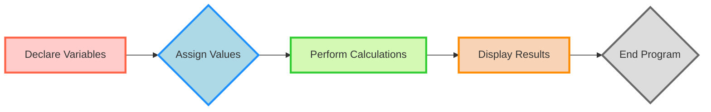
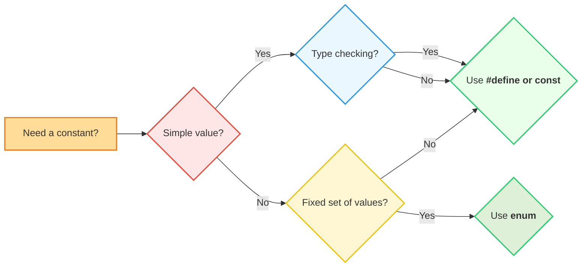
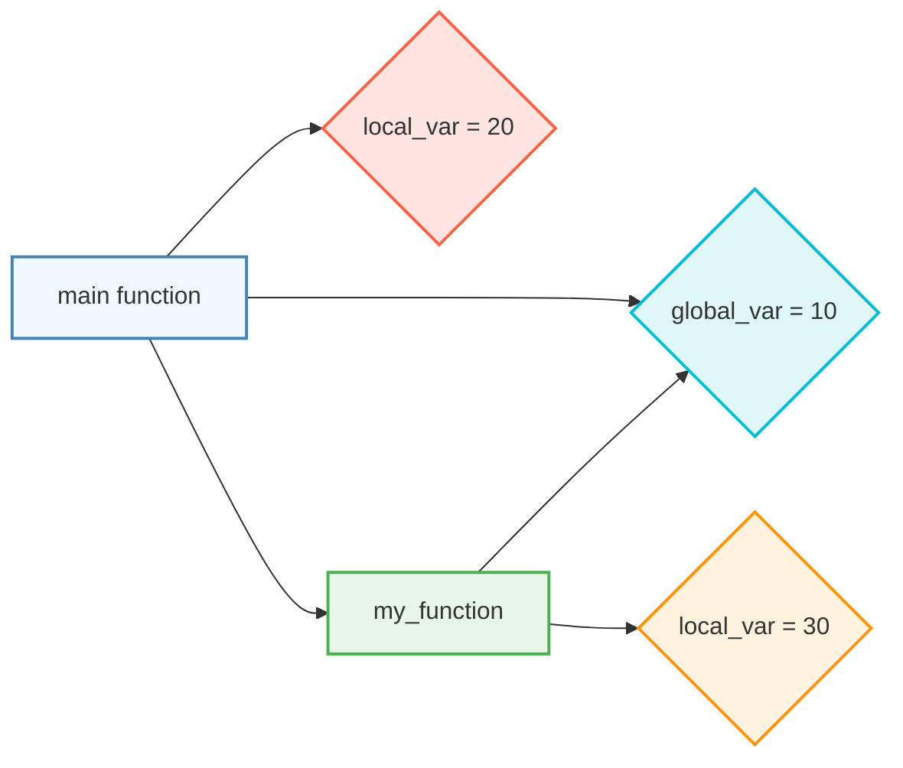
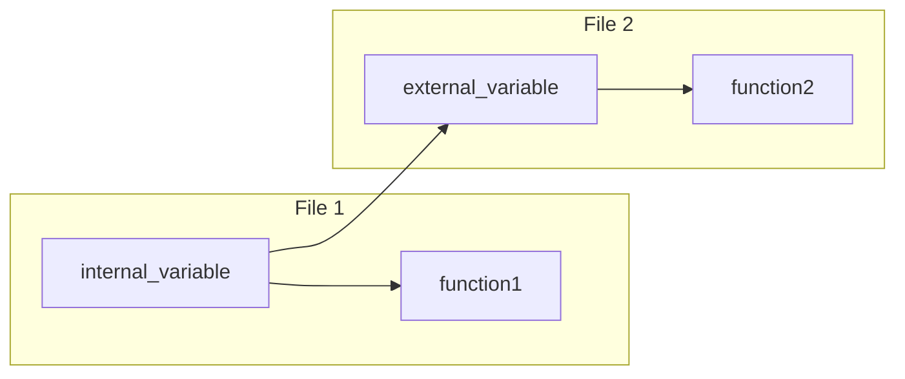
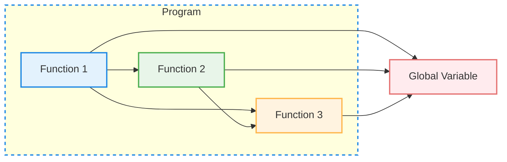

# <span style="color:#e67e22;">What we will learn in this post?</span>

<ul style='list-style-type: none; padding-left: 0;'>
<li><span style='color: #2980b9; font-size: 20px; font-weight: bold;'>👉</span> <span style='color: #2ecc71; font-size: 18px; font-weight: bold;'>C Variables</span></li>
<li><span style='color: #2980b9; font-size: 20px; font-weight: bold;'>👉</span> <span style='color: #2ecc71; font-size: 18px; font-weight: bold;'>Constants in C</span></li>
<li><span style='color: #2980b9; font-size: 20px; font-weight: bold;'>👉</span> <span style='color: #2ecc71; font-size: 18px; font-weight: bold;'>Const Qualifier in C</span></li>
<li><span style='color: #2980b9; font-size: 20px; font-weight: bold;'>👉</span> <span style='color: #2ecc71; font-size: 18px; font-weight: bold;'>Different Ways to Declare Variable as Constant in C</span></li>
<li><span style='color: #2980b9; font-size: 20px; font-weight: bold;'>👉</span> <span style='color: #2ecc71; font-size: 18px; font-weight: bold;'>Scope Rules in C</span></li>
<li><span style='color: #2980b9; font-size: 20px; font-weight: bold;'>👉</span> <span style='color: #2ecc71; font-size: 18px; font-weight: bold;'>Internal Linkage and External Linkage in C</span></li>
<li><span style='color: #2980b9; font-size: 20px; font-weight: bold;'>👉</span> <span style='color: #2ecc71; font-size: 18px; font-weight: bold;'>Global Variables in C</span></li>
<li><span style='color: #2980b9; font-size: 20px; font-weight: bold;'>👉</span> <span style='color: #2ecc71; font-size: 18px; font-weight: bold;'>Conclusion!</span></li>
</ul>

# <span style="color:#e67e22">What are Variables in C?</span>

Variables are like **containers** in your C program that hold **data**. They are
named memory locations where you store information that your program can access
and manipulate. Think of them as labelled boxes where you can put different
things: numbers, letters, or even more complex data.

## <span style="color:#2980b9">Why are Variables Important?</span>

Variables are essential in C programming for several reasons:

- **Flexibility:** They allow your program to work with dynamic data that can
  change during execution.
- **Data Storage:** They provide a way to hold information that your program
  needs to perform calculations, make decisions, and display results.
- **Organization:** By giving meaningful names to variables, you can make your
  code easier to read and understand.

## <span style="color:#2980b9">Types of Variables in C</span>

C offers a variety of variable types, each designed to store different kinds of
data. Here are some common ones:

### <span style="color:#8e44ad">Integer Variables (int)</span>

- **What they store:** Whole numbers without decimal points (e.g., 10, -5, 0).
- **Example:**

```c
#include <stdio.h>

int main() {
    int age = 25; // Declaring an integer variable named 'age' and assigning a value
    printf("My age is: %d\n", age); // Output: My age is: 25
    return 0;
}
```

### <span style="color:#8e44ad">Floating-Point Variables (float, double)</span>

- **What they store:** Numbers with decimal points (e.g., 3.14, -2.5, 1.0).
- **Difference between float and double:** `double` provides higher precision
  (more decimal places) than `float`.
- **Example:**

```c
#include <stdio.h>

int main() {
    float pi = 3.14159; // Declaring a float variable named 'pi'
    printf("Pi is approximately: %.5f\n", pi); // Output: Pi is approximately: 3.14159
    return 0;
}
```

### <span style="color:#8e44ad">Character Variables (char)</span>

- **What they store:** Single characters (e.g., 'A', '!', '5'). Note that single
  characters are enclosed in single quotes.
- **Example:**

```c
#include <stdio.h>

int main() {
    char initial = 'J'; // Declaring a character variable named 'initial'
    printf("My initial is: %c\n", initial); // Output: My initial is: J
    return 0;
}
```

## <span style="color:#2980b9">Declaring Variables in C</span>

To use a variable in your C program, you need to declare it first. This tells
the compiler the variable's name and the type of data it will hold. The general
syntax is:

```c
data_type variable_name;
```

**Example:**

```c
int age; // Declaring an integer variable named 'age'
float temperature; // Declaring a floating-point variable named 'temperature'
char grade; // Declaring a character variable named 'grade'
```

## <span style="color:#2980b9">Assigning Values to Variables</span>

Once you have declared a variable, you can assign a value to it using the
assignment operator `=`.

**Example:**

```c
age = 25; // Assigning the value 25 to the variable 'age'
temperature = 37.5; // Assigning the value 37.5 to the variable 'temperature'
grade = 'A'; // Assigning the character 'A' to the variable 'grade'
```

## <span style="color:#2980b9">Using Variables in Calculations and Output</span>

You can use variables in mathematical calculations and display their values
using `printf()`.

**Example:**

```c
#include <stdio.h>

int main() {
    int num1 = 10, num2 = 5; // Declaring and initializing variables
    int sum = num1 + num2; // Performing calculation
    printf("The sum of %d and %d is: %d\n", num1, num2, sum); // Output: The sum of 10 and 5 is: 15
    return 0;
}
```

## <span style="color:#2980b9">Flowchart for Variable Usage</span>



Variables are fundamental building blocks in C programming. By understanding
their different types, how to declare them, and how to use them, you can start
creating complex and interesting programs!

# <span style="color:#e67e22">Constants in C: The Foundation of Reliable Code</span>

## <span style="color:#2980b9">What are Constants?</span>

Constants are values in a C program that remain fixed and cannot be changed
during the execution of the program. They are like unbreakable promises in your
code, ensuring stability and predictability.

### <span style="color:#8e44ad">Why Use Constants?</span>

- **Readability and Maintenance:** Constants make your code easier to
  understand. Instead of using magic numbers scattered throughout, you use
  meaningful names like `PI` or `MAX_SIZE`. This makes your code more
  self-documenting and simplifies future modifications.
- **Error Prevention:** By using constants, you prevent accidental modification
  of crucial values. This reduces the risk of bugs and enhances the reliability
  of your program.
- **Flexibility:** You can easily change the value of a constant without having
  to modify every line of code where it's used. This makes it easier to adapt
  your program to new requirements.

## <span style="color:#2980b9">Defining Constants in C</span>

There are two primary ways to define constants in C: using `#define` and using
`const`.

### <span style="color:#8e44ad">Using `#define`</span>

The `#define` directive is a preprocessor directive that replaces every
occurrence of a constant name with its defined value before the compilation
process begins.

```c
#define PI 3.14159
#define MAX_SIZE 100
```

**Explanation:**

- `#define PI 3.14159`: This line defines a constant `PI` and assigns it the
  value `3.14159`. Every time the compiler encounters `PI` in the code, it will
  substitute it with `3.14159`.
- `#define MAX_SIZE 100`: Similarly, this line defines a constant `MAX_SIZE`
  with the value `100`.

### <span style="color:#8e44ad">Using `const`</span>

The `const` keyword is used to declare variables as constants. It tells the
compiler that the variable's value cannot be changed after its initialization.

```c
const int NUM_DAYS_IN_WEEK = 7;
const float GRAVITY = 9.81;
```

**Explanation:**

- `const int NUM_DAYS_IN_WEEK = 7`: This line declares an integer constant
  `NUM_DAYS_IN_WEEK` and initializes it with the value `7`.
- `const float GRAVITY = 9.81`: This line declares a floating-point constant
  `GRAVITY` and initializes it with the value `9.81`.

## <span style="color:#2980b9">Choosing the Right Approach</span>

**#define vs. `const`:**

| Feature                | `#define`                        | `const`                                     |
| ---------------------- | -------------------------------- | ------------------------------------------- |
| **Preprocessing:**     | Replaces text before compilation | Creates a constant variable                 |
| **Data Type:**         | No type checking                 | Data type must be specified                 |
| **Scope:**             | Global                           | Can be global or local                      |
| **Debugging:**         | Less informative error messages  | More informative error messages             |
| **Memory Allocation:** | No memory allocation             | Memory is allocated for a constant variable |

**In general, `const` is considered a better option for defining constants
because it provides more type safety and better error handling.** However,
`#define` can be more convenient in simple cases where you only need to define a
simple value without considering data types.

## <span style="color:#2980b9">Example: Calculating the Area of a Circle</span>

```c
#include <stdio.h>

#define PI 3.14159

int main() {
  float radius = 5.0;
  float area = PI * radius * radius;

  printf("The area of the circle is: %.2f\n", area);
  return 0;
}
```

**Output:**

```
The area of the circle is: 78.54
```

This program demonstrates the use of `#define` to define a constant `PI` for
calculating the area of a circle. Using a constant makes the code more readable
and helps prevent errors.

## <span style="color:#2980b9">Key Takeaways</span>

- Constants are fundamental to writing robust and maintainable C code.
- Choose `#define` for simple definitions and `const` for more complex and
  type-safe constants.
- Use constants to improve code readability, prevent errors, and enhance
  flexibility.

Remember, embrace constants and let them empower you to write exceptional C
code! ✨

# <span style="color:#e67e22">The `const` Qualifier in C: A Deep Dive</span>

## <span style="color:#2980b9">Introduction</span>

The `const` qualifier in C acts like a **lock** for variables. Once a variable
is declared as `const`, its value becomes **immutable**, meaning it cannot be
changed after its initialization.

Think of it like a **read-only memory** - you can read the data stored in it,
but you can't modify it. This plays a crucial role in improving code reliability
and safety by preventing accidental modifications.

## <span style="color:#2980b9">Purpose of `const`</span>

Here's why `const` is so important in C:

- **Data Integrity:** It ensures the value of a variable remains unchanged
  throughout the program.
- **Improved Code Readability:** Clearly indicates variables whose values should
  not be modified, improving code understanding.
- **Optimization Potential:** The compiler can optimize code by knowing a
  variable's value won't change.
- **Enhanced Safety:** Prevents accidental modifications, leading to fewer bugs.

## <span style="color:#2980b9">How `const` Affects Variable Usage</span>

### <span style="color:#8e44ad">Declaration and Initialization</span>

A `const` variable must be initialized at the time of declaration, as it cannot
be assigned a value later.

```c
const int age = 25; // Initialized during declaration

//  Error: Cannot re-assign value to a const variable
// age = 30;
```

### <span style="color:#8e44ad">Usage Restrictions</span>

You can only use `const` variables in read-only operations:

- **Passing as arguments to functions:** Can be passed to functions that expect
  a constant value.
- **Accessing the value:** You can access the value using the variable name.
- **Using in expressions:** Can be used in expressions where a constant value is
  needed.

However, you **cannot:**

- **Modify the value:** Assigning a new value to a `const` variable results in a
  compilation error.
- **Take the address of a `const` variable:** You cannot get the memory address
  of a `const` variable, as changing it through the address would violate the
  `const` restriction.

## <span style="color:#2980b9">Examples</span>

### <span style="color:#8e44ad">Example 1: Constant vs Non-Constant</span>

```c
#include <stdio.h>

int main() {
    const int MAX_SIZE = 100; // Constant
    int count = 0; // Non-constant

    //  Error: Cannot assign a new value to MAX_SIZE
    // MAX_SIZE = 200;

    count = 50;

    printf("MAX_SIZE: %d, count: %d\n", MAX_SIZE, count); // Output: MAX_SIZE: 100, count: 50
    return 0;
}
```

### <span style="color:#8e44ad">Example 2: Using `const` in a Function</span>

```c
#include <stdio.h>

void print_message(const char *message) {
    printf("%s\n", message);
}

int main() {
    const char *greeting = "Hello, World!";
    print_message(greeting); //  Output: Hello, World!
    return 0;
}
```

## <span style="color:#2980b9">Conclusion</span>

The `const` qualifier provides a powerful way to create immutable variables in
C, enhancing code safety and reliability. By understanding its purpose and
limitations, you can use `const` effectively to make your C code more robust and
readable.

# <span style="color:#e67e22">Declaring Constants in C</span>

In the world of C programming, constants are values that remain unchanged
throughout the execution of a program. They are essential for ensuring code
integrity and making programs more readable and maintainable.

Let's dive into the various methods of declaring constants in C:

## <span style="color:#2980b9">Using `#define`</span>

The `#define` directive is a preprocessor directive that allows us to create
symbolic constants. The preprocessor replaces all occurrences of the defined
constant with its value before the program is compiled.

### <span style="color:#8e44ad">Example</span>

```c
#define PI 3.14159
#define NAME "John Doe"

int main() {
  // Calculate the area of a circle
  float radius = 5.0;
  float area = PI * radius * radius;
  printf("Area of the circle: %.2f\n", area);

  // Print the name
  printf("Name: %s\n", NAME);
  return 0;
}
```

```
// Output:
// Area of the circle: 78.54
// Name: John Doe
```

### <span style="color:#8e44ad">Pros</span>

- **Simple and widely used:** It's a classic method and works across various C
  compilers.
- **Preprocessor-based:** The replacement occurs before compilation, making it
  efficient.

### <span style="color:#8e44ad">Cons</span>

- **No type checking:** The preprocessor doesn't perform type checks, so errors
  might not be detected until runtime.
- **Lack of scoping:** `#define` constants have global scope, meaning they can
  be accessed from anywhere in the program.

## <span style="color:#2980b9">Using `const`</span>

The `const` keyword creates a constant variable at compile time. This variable
cannot be modified during the program's execution. It provides type checking and
better control over the constant's scope.

### <span style="color:#8e44ad">Example</span>

```c
const int MAX_SIZE = 100;
const char *CITY = "New York";

int main() {
  // Declare a variable within the allowed size
  int array[MAX_SIZE];

  // Print the city name
  printf("City: %s\n", CITY);

  // Attempting to modify a const variable (Error!)
  // CITY = "Los Angeles"; // This line will cause a compiler error
  return 0;
}
```

```
// Output:
// City: New York
```

### <span style="color:#8e44ad">Pros</span>

- **Type checking:** The compiler enforces type safety, preventing potential
  errors.
- **Scoped constants:** `const` constants can be declared with block scope or
  file scope.

### <span style="color:#8e44ad">Cons</span>

- **Not as efficient as `#define`:** `const` variables are created at runtime,
  potentially affecting performance slightly.
- **Limited to simple values:** `const` works best for simple data types; for
  complex constants, other methods might be preferable.

## <span style="color:#2980b9">Using Enumerations (Enums)</span>

Enumerations allow us to define a set of named integer constants. They are
particularly useful for representing a fixed set of values, such as days of the
week or status codes.

### <span style="color:#8e44ad">Example</span>

```c
enum Days {
  MONDAY,
  TUESDAY,
  WEDNESDAY,
  THURSDAY,
  FRIDAY,
  SATURDAY,
  SUNDAY
};

int main() {
  enum Days today = FRIDAY;

  // Print the day
  printf("Today is: %d\n", today);
  return 0;
}
```

```
// Output:
// Today is: 4
```

### <span style="color:#8e44ad">Pros</span>

- **Improved readability:** Enums provide meaningful names for constants, making
  the code more understandable.
- **Type safety:** Enums introduce a new type, providing type checking and
  preventing accidental assignment of incorrect values.
- **Easy to modify:** Adding or removing values from an enum is straightforward.

### <span style="color:#8e44ad">Cons</span>

- **Limited to integer constants:** Enums can only represent integer constants,
  not other data types.
- **Less flexible than `#define` or `const`:** Enums are more restrictive in
  terms of flexibility and customization.

## <span style="color:#2980b9">Choosing the Right Method</span>

**Use `#define` when:**

- You need simple constants.
- Performance is critical.

**Use `const` when:**

- You need type checking.
- You want to declare scoped constants.

**Use Enums when:**

- You need to define a fixed set of named constants.
- You prioritize code readability.

### <span style="color:#8e44ad">Flowchart: Choosing the Right Method</span>



By understanding the pros and cons of each method, you can choose the most
suitable approach for your C programs. This ensures that your code is efficient,
readable, and less prone to errors.

# <span style="color:#e67e22">Variable Scope in C</span>

## <span style="color:#2980b9">Understanding Scope</span>

Variable scope in C defines where a variable is accessible within your program.
It's like a "visibility" rule, dictating which parts of your code can "see" and
use a particular variable.

### <span style="color:#8e44ad">Why Scope Matters</span>

- **Organization:** It helps keep your code organized and prevents unintended
  modifications.
- **Data Security:** It limits access to variables, protecting sensitive
  information.
- **Error Prevention:** It reduces the chances of naming conflicts (using the
  same variable name in different parts of the code).

## <span style="color:#2980b9">Types of Variable Scope</span>

### <span style="color:#8e44ad">1. Local Scope</span>

- **Declaration:** Variables declared inside a function or block of code.
- **Accessibility:** Only accessible within the function or block where they are
  declared.
- **Lifetime:** They exist only during the execution of the function or block.

```c
#include <stdio.h>

int main() {
  int local_var = 10; // Local variable declared within the main function
  printf("Value of local_var: %d\n", local_var); // Output: 10

  // Error: Trying to access local_var outside the function
  // printf("Outside function: %d\n", local_var);
  return 0;
}
```

### <span style="color:#8e44ad">2. Global Scope</span>

- **Declaration:** Variables declared outside any function.
- **Accessibility:** Accessible from any part of the program, including all
  functions.
- **Lifetime:** They exist throughout the entire program's execution.

```c
#include <stdio.h>

int global_var = 20; // Global variable declared outside any function

int main() {
  printf("Value of global_var: %d\n", global_var); // Output: 20
  return 0;
}

int another_function() {
  printf("Value of global_var in another function: %d\n", global_var); // Output: 20
  return 0;
}
```

## <span style="color:#2980b9">Scope Example with Functions</span>

```c
#include <stdio.h>

int global_var = 10; // Global variable

int main() {
  int local_var = 20; // Local variable within the main function

  printf("Inside main:\n");
  printf("Global variable: %d\n", global_var); // Output: 10
  printf("Local variable: %d\n", local_var); // Output: 20

  my_function();
  return 0;
}

int my_function() {
  int local_var = 30; // Local variable within my_function
  printf("Inside my_function:\n");
  printf("Global variable: %d\n", global_var); // Output: 10
  printf("Local variable: %d\n", local_var); // Output: 30
  return 0;
}
```

**Output:**

```
Inside main:
Global variable: 10
Local variable: 20
Inside my_function:
Global variable: 10
Local variable: 30
```

**Explanation:**

- `global_var` is accessible in both `main` and `my_function`.
- `local_var` in `main` is different from `local_var` in `my_function`. They
  have their own individual scopes.

## <span style="color:#2980b9">Scope and Data Protection</span>

- **Global Variables:** Accessible from anywhere. This can make your code less
  secure, as any part of the program can modify them.
- **Local Variables:** More secure. They are restricted to specific functions or
  blocks of code, making it harder to accidentally change them.

### <span style="color:#8e44ad">Best Practices</span>

- **Minimize Global Variables:** Use them only when absolutely necessary.
- **Use Local Variables Whenever Possible:** This promotes cleaner and more
  secure code.

## <span style="color:#2980b9">Visual Representation</span>



**Explanation:**

This flowchart visually illustrates the scope of the variables. `global_var` is
shared between both functions, while the `local_var` variables are unique to
each function.

Understanding variable scope is crucial for writing well-structured, efficient,
and maintainable C code. By using variables in the appropriate scope, you can
create a more robust and reliable application.

# <span style="color:#e67e22">Internal vs External Linkage in C: Variable Visibility and File Sharing</span>

In the world of C programming, understanding how variables interact across
different files is crucial for building complex applications. Enter the concepts
of **internal** and **external linkage**, which determine a variable's
visibility and lifespan. Let's dive in!

## <span style="color:#2980b9">What is Linkage?</span>

Linkage refers to the way a variable or function is _connected_ across multiple
files in your C program. Think of it as a network of connections allowing
different parts of your program to communicate and share data.

## <span style="color:#2980b9">Internal Linkage: Local Heroes 🦸‍♀️</span>

### <span style="color:#8e44ad">Definition:</span>

Internal linkage means a variable is **confined** to the file where it's
defined. It's like a secret shared within a single room. 🤫

### <span style="color:#8e44ad">How It Works:</span>

- Use the `static` keyword before your variable declaration.
- **Example:**

```c
static int secret_number = 42; // Variable only accessible within this file
```

### <span style="color:#8e44ad">Visibility:</span>

- **Visible only within the file it's defined.**
- Cannot be accessed from other files.

### <span style="color:#8e44ad">Benefits:</span>

- Encapsulation: Keeps variables private to specific parts of your code.
- Reduced scope: Prevents accidental modification from other parts of the
  program.

## <span style="color:#2980b9">External Linkage: Global Stars 🌟</span>

### <span style="color:#8e44ad">Definition:</span>

External linkage means a variable is **accessible across different files** in
your project. It's like broadcasting your data for everyone to see. 📢

### <span style="color:#8e44ad">How It Works:</span>

- Define the variable **outside of any function** in your file.
- **Example:**

```c
int global_count = 0; // Variable accessible from any file that includes the header file
```

### <span style="color:#8e44ad">Visibility:</span>

- **Visible from any file that includes the file where it's defined.**
- Can be accessed and modified by other files.

### <span style="color:#8e44ad">Benefits:</span>

- Sharing data across files: Enables collaboration between different components
  of your program.
- Global access: Provides convenient access to shared data.

## <span style="color:#2980b9">Visualizing Linkage: A Flowchart</span>



This flowchart shows how internal variables (`internal_variable`) are local to a
file and external variables (`external_variable`) can be accessed across files.

## <span style="color:#2980b9">Example: Sharing Data Across Files</span>

Let's see a real-world example using both internal and external linkage. We'll
have two files: `file1.c` and `file2.c`.

**file1.c**

```c
#include <stdio.h>

// External linkage: shared counter
int shared_count = 0;

// Internal linkage: local variable
static int secret_value = 10;

void increment_shared() {
    shared_count++;
}

void print_shared() {
    printf("Shared Count: %d\n", shared_count);
}

int main() {
    increment_shared(); // Modifies the shared counter
    print_shared(); // Displays the shared counter
    // Trying to access 'secret_value' would result in an error
    // printf("Secret Value: %d\n", secret_value); // Error: variable is static
    return 0;
}
```

**file2.c**

```c
#include <stdio.h>
#include "file1.h" // Include file1.h for external variable access

int main() {
    increment_shared(); // Modifies the shared counter
    print_shared(); // Displays the shared counter
    // Trying to access 'secret_value' would result in an error
    // printf("Secret Value: %d\n", secret_value); // Error: variable is static
    return 0;
}
```

**Output:**

```
Shared Count: 1
Shared Count: 2
```

**Explanation:**

- `shared_count` is declared as an external variable, making it accessible from
  both `file1.c` and `file2.c`.
- `secret_value` is declared as an internal variable, making it only accessible
  within `file1.c`.
- Both files can modify and display `shared_count`.
- Accessing `secret_value` from `file2.c` would result in a compilation error
  because it has internal linkage.

## <span style="color:#2980b9">Key Takeaways</span>

- Internal linkage: Restrict variable visibility to the file where it's defined.
- External linkage: Share variables across multiple files.
- Use `static` for internal linkage, and define variables outside functions for
  external linkage.
- Choose the appropriate linkage based on the scope and visibility requirements
  of your variables.

Understanding linkage is crucial for organizing your C code efficiently,
ensuring data integrity, and fostering collaboration between different parts of
your program. Happy coding! 🎉

# <span style="color:#e67e22">Global Variables in C: Understanding the Basics and Implications</span>

## <span style="color:#2980b9">What are Global Variables?</span>

Think of global variables as **publicly accessible data containers** within your
C program. They exist throughout the entire program's lifetime, meaning any
function can access and modify them. This makes them available in all parts of
your code.

**Here's a visual representation:**



### <span style="color:#8e44ad">Declaring Global Variables</span>

To create a global variable, simply declare it outside any function:

```c
#include <stdio.h>

int global_variable = 10; // Declared outside any function

int main() {
  printf("Value of global_variable: %d\n", global_variable);
  return 0;
}
```

**Output:**

```
Value of global_variable: 10
```

## <span style="color:#2980b9">Implications for Program Design</span>

Global variables offer flexibility but also carry potential drawbacks:

**Advantages:**

- **Accessibility:** Global variables can be accessed and modified by any
  function in your program.
- **Data Persistence:** They maintain their values throughout the program's
  execution.

**Drawbacks:**

- **Namespace Pollution:** Having many global variables can make your code
  harder to manage and understand, especially as your program grows.
- **Unintentional Modification:** Any function can change a global variable,
  potentially leading to unexpected errors in other parts of the code.
- **Debugging Challenges:** Tracking down errors caused by global variable
  changes can be complex.

## <span style="color:#2980b9">Examples of Using Global Variables</span>

Here are some situations where global variables might be useful:

### <span style="color:#8e44ad">Example 1: Sharing Data Between Functions</span>

```c
#include <stdio.h>

int shared_data = 0; // Global variable

void function1() {
  shared_data += 5;
}

void function2() {
  printf("Value of shared_data: %d\n", shared_data);
}

int main() {
  function1(); // Modifies global_variable
  function2(); // Accesses the changed global_variable
  return 0;
}
```

**Output:**

```
Value of shared_data: 5
```

### <span style="color:#8e44ad">Example 2: Storing Configuration Settings</span>

```c
#include <stdio.h>

int max_size = 100; // Global variable for a maximum size limit

int main() {
  // Use max_size within the program for calculations or constraints
  return 0;
}
```

## <span style="color:#2980b9">Best Practices and Alternatives</span>

**Minimize Global Variable Use:**

- **Favor Local Variables:** Declare variables within functions to reduce the
  scope and risk of accidental modifications.
- **Use Structures and Pointers:** Group related data together in structures,
  and pass pointers to these structures between functions to share information.
- **Implement Global Constants:** For values that should never change, define
  them as global constants using the `const` keyword.

**Example: Using a Structure to Share Data**

```c
#include <stdio.h>

struct SharedData {
  int value;
};

void function1(struct SharedData *data) {
  data->value += 5;
}

void function2(struct SharedData *data) {
  printf("Value of shared_data: %d\n", data->value);
}

int main() {
  struct SharedData data = {0}; // Initialize the structure
  function1(&data);
  function2(&data);
  return 0;
}
```

**Output:**

```
Value of shared_data: 5
```

**Remember:** Strive for clear, organized code that prioritizes readability and
maintainability. While global variables have their uses, carefully consider
their implications before incorporating them into your program.

<h1><span style='color:#e67e22'>Conclusion</span></h1>

We've covered a lot of ground today, exploring the ins and outs of
`C Variables and Constants`. It's been a journey, and hopefully, you've learned
a thing or two! 😉

## <span style="color:#2980b9">Your Turn!</span>

Now, it's your turn to weigh in. What did you think? 🤔 Did you find this
information useful? Do you have any questions or suggestions? Let's keep the
conversation going in the comments section below! 💬

We're all ears (or rather, eyes) for your thoughts! 😊
