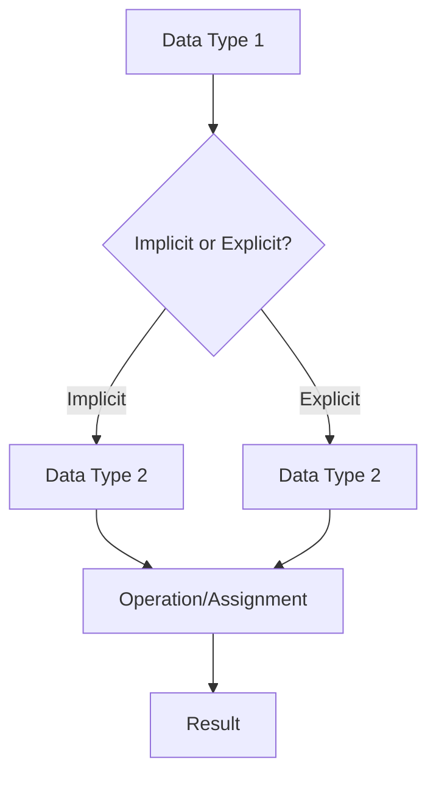
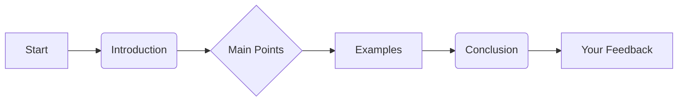

# <span style="color:#e67e22;">What we will learn in this post?</span>
<ul style='list-style-type: none; padding-left: 0;'>
<li><span style='color: #2980b9; font-size: 20px; font-weight: bold;'>👉</span> <span style='color: #2ecc71; font-size: 18px; font-weight: bold;'>Data Types in C</span></li>
<li><span style='color: #2980b9; font-size: 20px; font-weight: bold;'>👉</span> <span style='color: #2ecc71; font-size: 18px; font-weight: bold;'>Data Type Modifiers in C</span></li>
<li><span style='color: #2980b9; font-size: 20px; font-weight: bold;'>👉</span> <span style='color: #2ecc71; font-size: 18px; font-weight: bold;'>Literals in C</span></li>
<li><span style='color: #2980b9; font-size: 20px; font-weight: bold;'>👉</span> <span style='color: #2ecc71; font-size: 18px; font-weight: bold;'>Escape Sequence in C</span></li>
<li><span style='color: #2980b9; font-size: 20px; font-weight: bold;'>👉</span> <span style='color: #2ecc71; font-size: 18px; font-weight: bold;'>bool in C</span></li>
<li><span style='color: #2980b9; font-size: 20px; font-weight: bold;'>👉</span> <span style='color: #2ecc71; font-size: 18px; font-weight: bold;'>Integer Promotions in C</span></li>
<li><span style='color: #2980b9; font-size: 20px; font-weight: bold;'>👉</span> <span style='color: #2ecc71; font-size: 18px; font-weight: bold;'>Character Arithmetic in C</span></li>
<li><span style='color: #2980b9; font-size: 20px; font-weight: bold;'>👉</span> <span style='color: #2ecc71; font-size: 18px; font-weight: bold;'>Type Conversion in C</span></li>
<li><span style='color: #2980b9; font-size: 20px; font-weight: bold;'>👉</span> <span style='color: #2ecc71; font-size: 18px; font-weight: bold;'>Conclusion!</span></li>
</ul>

# <span style="color:#e67e22">C Data Types Explained 🎉</span>

This guide explores the fundamental data types in the C programming language.  We'll cover their sizes (which can vary slightly depending on your system's architecture), usage, and provide illustrative examples.


## <span style="color:#2980b9">Basic Data Types 🧮</span>

C offers several built-in data types to represent different kinds of information.  Let's examine the most common ones:


### <span style="color:#8e44ad">Integers (`int`) 🔢</span>

*   **Purpose:**  Used to store whole numbers (without decimal points).
*   **Size:** Typically 4 bytes (32 bits) –  *can vary*
*   **Range:** Approximately -2,147,483,648 to 2,147,483,647
*   **Example:**

```c
#include <stdio.h>
#include <limits.h> // For INT_MAX and INT_MIN

int main() {
  int age = 30;
  printf("Age: %d\n", age); // Output: Age: 30
  printf("Maximum int value: %d\n", INT_MAX); // Output: Maximum int value: 2147483647 (or similar)
  printf("Minimum int value: %d\n", INT_MIN); // Output: Minimum int value: -2147483648 (or similar)
  return 0;
}
```


### <span style="color:#8e44ad">Floating-Point Numbers (`float`, `double`) 📈</span>

*   **Purpose:** Used to store numbers with decimal points.  `double` provides higher precision than `float`.
*   **Size:** `float`: Typically 4 bytes; `double`: Typically 8 bytes – *can vary*
*   **Example:**

```c
#include <stdio.h>

int main() {
  float price = 99.99;
  double pi = 3.14159265358979323846;
  printf("Price: %.2f\n", price); // Output: Price: 99.99
  printf("Pi: %lf\n", pi); // Output: Pi: 3.141593 (or similar, precision may vary)
  return 0;
}
```


### <span style="color:#8e44ad">Characters (`char`) 🔤</span>

*   **Purpose:** Used to store single characters.
*   **Size:** Typically 1 byte (8 bits)
*   **Example:**

```c
#include <stdio.h>

int main() {
  char initial = 'J';
  printf("Initial: %c\n", initial); // Output: Initial: J
  return 0;
}
```


## <span style="color:#2980b9">Other Important Types 💡</span>


### <span style="color:#8e44ad">Boolean (`_Bool`)  ✅</span>

* **Purpose:** Stores either true (1) or false (0).
* **Size:** Typically 1 byte (though it might be smaller depending on compiler).
* **Example:**

```c
#include <stdio.h>
#include <stdbool.h> // For bool type

int main() {
    bool isAdult = true;
    printf("Is adult: %d\n", isAdult); // Output: Is adult: 1
    return 0;
}
```


### <span style="color:#8e44ad">Void (`void`) ∅</span>

*   **Purpose:**  Indicates the absence of a type.  Often used for functions that don't return a value.
*   **Size:**  Has no size.


## <span style="color:#2980b9">Data Type Sizes – System Dependency 🤔</span>

The sizes of data types (except `char`) can vary depending on the compiler and the system architecture (32-bit vs. 64-bit).  It's always a good practice to use `sizeof` operator to determine the size in your specific environment.

```c
#include <stdio.h>

int main() {
  printf("Size of int: %zu bytes\n", sizeof(int));
  printf("Size of float: %zu bytes\n", sizeof(float));
  printf("Size of double: %zu bytes\n", sizeof(double));
  printf("Size of char: %zu bytes\n", sizeof(char));
  printf("Size of bool: %zu bytes\n", sizeof(bool));
  return 0;
}
```

This will output the sizes on your system.  Remember `%zu` is the correct format specifier for `size_t`, the type returned by `sizeof`.


**Note:**  This is a simplified overview. C also has more complex data types like pointers, arrays, structures, unions, and enums, which will be covered in more advanced tutorials.


# <span style="color:#e67e22">C Data Type Modifiers:  A Deep Dive 🔬</span>

C offers several *modifiers* that fine-tune the properties of its fundamental data types (like `int`, `char`, `float`, etc.). These modifiers control aspects like the size (amount of memory used) and range (minimum and maximum values) of variables. Let's explore the most common ones:


## <span style="color:#2980b9">Size Modifiers: `short` and `long` 📏</span>

These modifiers primarily influence the size (in bytes) a variable occupies in memory.  The exact sizes are *implementation-defined* (meaning they might vary slightly across different compilers and systems), but generally:

*   `short int` (or just `short`): Typically uses less memory than a standard `int`.
*   `long int` (or just `long`): Typically uses more memory than a standard `int`.
*   `long long int` (or just `long long`): Uses even more memory than `long int`.


### <span style="color:#8e44ad">Example illustrating `short` and `long`</span>

```c
#include <stdio.h>
#include <limits.h> // For limits of data types

int main() {
    short int shortVar = 32767;  // Often 2 bytes
    long int longVar = 2147483647; // Often 4 bytes
    long long int longLongVar = 9223372036854775807; // Often 8 bytes


    printf("Size of short: %zu bytes\n", sizeof(shortVar)); //Output: Size of short: 2 bytes
    printf("Size of long: %zu bytes\n", sizeof(longVar));   //Output: Size of long: 4 bytes
    printf("Size of long long: %zu bytes\n", sizeof(longLongVar)); //Output: Size of long long: 8 bytes

    printf("Maximum short: %d\n", SHRT_MAX); //Output: Maximum short: 32767
    printf("Maximum long: %ld\n", LONG_MAX);  //Output: Maximum long: 2147483647
    printf("Maximum long long: %lld\n", LLONG_MAX); //Output: Maximum long long: 9223372036854775807

    return 0;
}
```


## <span style="color:#2980b9">Sign Modifiers: `signed` and `unsigned` ➕➖</span>

These modifiers dictate whether a variable can hold both positive and negative values (signed) or only non-negative values (unsigned).

*   `signed`: (Default for `int`, `char`, etc.) Allows both positive and negative numbers.  The highest bit represents the sign.
*   `unsigned`: Allows only non-negative numbers (0 and positive values).  All bits represent the magnitude.


### <span style="color:#8e44ad">Example illustrating `signed` and `unsigned`</span>


```c
#include <stdio.h>
#include <limits.h>

int main() {
    unsigned int unsignedVar = 4294967295; // Often 4 bytes, all bits for magnitude
    signed int signedVar = -1;           // Often 4 bytes, one bit for sign

    printf("Size of unsigned int: %zu bytes\n", sizeof(unsignedVar)); //Output: Size of unsigned int: 4 bytes
    printf("Size of signed int: %zu bytes\n", sizeof(signedVar));     //Output: Size of signed int: 4 bytes

    printf("Unsigned int value: %u\n", unsignedVar); //Output: Unsigned int value: 4294967295
    printf("Signed int value: %d\n", signedVar);     //Output: Signed int value: -1
    printf("Maximum unsigned int: %u\n", UINT_MAX); //Output: Maximum unsigned int: 4294967295
    printf("Maximum signed int: %d\n", INT_MAX);   //Output: Maximum signed int: 2147483647


    return 0;
}
```


## <span style="color:#2980b9">Visual Summary 📊</span>


```mermaid
graph LR
A[Data Type (e.g., int)] --> B(short);
A --> C(long);
A --> D(long long);
B --> E{signed};
B --> F{unsigned};
C --> E;
C --> F;
D --> E;
D --> F;
```


**Key Takeaway:**  Choosing the right modifiers is crucial for efficient memory usage and preventing unexpected overflow errors (when a value exceeds the data type's capacity).  Understanding the implications of `short`, `long`, `signed`, and `unsigned` empowers you to write more robust and optimized C code. 🎉


# <span style="color:#e67e22">Literals in C: A Comprehensive Guide 📖</span>

Literals in C are constant values that are directly written into the source code.  They represent fixed data that the compiler can understand and use during compilation. Think of them as the raw data you feed into your C programs. Let's explore the different types!

## <span style="color:#2980b9">Integer Literals 🔢</span>

Integer literals represent whole numbers without any fractional part.  They can be decimal, octal (base-8), or hexadecimal (base-16).

### <span style="color:#8e44ad">Decimal Literals</span>

These are the most common type of integer literals and are written in base 10 (0-9).

* **Example:**
```c
int age = 30; // age is assigned the decimal literal 30
printf("Age: %d\n", age); // Output: Age: 30
```

### <span style="color:#8e44ad">Octal Literals</span>

Octal literals are prefixed with a `0` (zero).

* **Example:**
```c
int octalNum = 017; // octal literal representing 15 in decimal
printf("Octal Number: %d\n", octalNum); // Output: Octal Number: 15
```

### <span style="color:#8e44ad">Hexadecimal Literals</span>

Hexadecimal literals are prefixed with `0x` or `0X`.  They use digits 0-9 and letters A-F (or a-f) to represent values 0-15.

* **Example:**
```c
int hexNum = 0x1A; // hexadecimal literal representing 26 in decimal
printf("Hexadecimal Number: %d\n", hexNum); // Output: Hexadecimal Number: 26
```


## <span style="color:#2980b9">Floating-Point Literals 🧮</span>

Floating-point literals represent numbers with fractional parts.  They can be written in either decimal or exponential notation.

* **Example (Decimal):**
```c
float price = 99.99;
printf("Price: %.2f\n", price); // Output: Price: 99.99
```

* **Example (Exponential):**
```c
double avogadro = 6.022e23; // 6.022 x 10^23
printf("Avogadro's Number: %e\n", avogadro); // Output: Avogadro's Number: 6.022000e+23
```


## <span style="color:#2980b9">Character Literals 🔤</span>

Character literals represent single characters enclosed in single quotes (`' '`).

* **Example:**
```c
char initial = 'J';
printf("Initial: %c\n", initial); // Output: Initial: J
```

* **Escape Sequences:** Special characters like newline (`\n`), tab (`\t`), and backslash (`\\`) are represented using escape sequences.
```c
char newline = '\n';
printf("This is on one line.\nThis is on the next line.\n");
//Output: This is on one line.
//This is on the next line.
```


## <span style="color:#2980b9">String Literals 📜</span>

String literals represent sequences of characters enclosed in double quotes (`" "`). They are actually arrays of characters terminated by a null character (`\0`).

* **Example:**
```c
char* message = "Hello, World!";
printf("%s\n", message); // Output: Hello, World!
```


## <span style="color:#2980b9">Boolean Literals ☑️</span> (C99 and later)

Boolean literals represent truth values.  `0` represents `false` and any non-zero value represents `true`.  While `_Bool` is the type, often `int` is used.

* **Example:**
```c
_Bool isAdult = 1; // True
_Bool isMinor = 0; // False
printf("Is Adult: %d\n", isAdult); //Output: Is Adult: 1
printf("Is Minor: %d\n", isMinor); //Output: Is Minor: 0
```


## <span style="color:#2980b9">Summary  💡</span>

This table summarizes the different types of literals in C:

| Literal Type       | Example       | Description                                   |
|--------------------|----------------|-----------------------------------------------|
| Integer            | `10`, `012`, `0xA` | Decimal, Octal, Hexadecimal                   |
| Floating-Point     | `3.14`, `1e-2` | Decimal and Exponential notation               |
| Character          | `'A'`, `'\n'` | Single character, including escape sequences     |
| String             | `"Hello"`      | Sequence of characters, null-terminated       |
| Boolean (C99+)    | `1`, `0`       | `1` for true, `0` for false                  |


This guide provides a foundational understanding of literals in C.  Mastering these fundamental building blocks is crucial for writing effective C programs. Remember to choose the appropriate literal type based on the data you need to represent in your code.


# <span style="color:#e67e22">Escape Sequences in C: A Visual Guide 📖</span>

Escape sequences in C are special character combinations that allow you to include characters in your strings that would otherwise be difficult or impossible to type directly.  Think of them as secret codes for your compiler! ✨

## <span style="color:#2980b9">Understanding Escape Sequences 🤔</span>

Escape sequences always begin with a backslash (`\`).  The backslash tells the compiler, "Hey, what follows isn't a regular character; it's a special instruction!"

### <span style="color:#8e44ad">Common Escape Sequences</span>

Here's a table summarizing some frequently used escape sequences:

| Escape Sequence | Description             | Example in String Literal           | Output                                      |
|-----------------|--------------------------|------------------------------------|----------------------------------------------|
| `\n`            | Newline (line break)     | `"Hello\nWorld"`                    | `Hello<br>World`                             |
| `\t`            | Horizontal tab          | `"Name\tAge"`                       | `Name    Age`                               |
| `\r`            | Carriage return         | `"Line1\rLine2"`                    | `Line2` (overwrites Line1)                    |
| `\\`            | Backslash itself        | `"C:\\Users\\Documents"`            | `C:\Users\Documents`                        |
| `\"`            | Double quote             | `"He said, \"Hello!\""`            | `He said, "Hello!"`                         |
| `\'`            | Single quote             | `'It\'s a quote'`                   | `It's a quote`                             |
| `\?`            | Question mark             | `"What\?`                            | `What?`                                     |
| `\ooo`          | Octal representation     | `"\110\145\154\154\157"`           | `Hello` (octal representation of 'H', 'e', etc.) |
| `\xhh`          | Hexadecimal representation| `"\x48\x65\x6c\x6c\x6f"`           | `Hello` (hexadecimal representation of 'H', 'e', etc.) |
| `\a`            | Audible alert (bell)    | `"Warning!\a"`                      | Warning! (accompanied by a beep sound)       |
| `\b`            | Backspace               | `"Hello\bWorld"`                    | `HelloWorld` (the 'o' is overwritten)       |
| `\v`            | Vertical tab            | `"Line1\vLine2"`                    | `Line1<br>Line2` (vertical tab is less common)  |


**Example 1: Using `\n` and `\t`**

```c
#include <stdio.h>

int main() {
    printf("Name\tAge\n"); // \n for newline, \t for tab
    printf("John\t25\n");
    return 0;
}
```

/* Output:
Name    Age
John    25
*/


**Example 2: Using `\\` and `\"`**

```c
#include <stdio.h>

int main() {
    printf("The file path is C:\\Users\\Documents\\file.txt\n"); // \\ escapes backslash
    printf("He said, \"Hello!\" \n"); // \" escapes double quote
    return 0;
}
```

/* Output:
The file path is C:\Users\Documents\file.txt
He said, "Hello!" 
*/


## <span style="color:#2980b9">Why Use Escape Sequences? 🤔</span>

* **Represent special characters:**  Characters like newline, tab, and backslash have special meanings in C strings. Escape sequences allow you to include them literally.
* **Improve readability:** Escape sequences make your code cleaner and more understandable, especially when dealing with formatted output.
* **Control output format:** You can precisely control the layout of text printed to the console using newline, tab, and other escape sequences.


## <span style="color:#2980b9">A Simple Flowchart Illustrating Escape Sequence Handling ⚙️</span>

```mermaid
graph TD
    A[Compiler encounters backslash (\)] --> B{Is it a valid escape sequence?};
    B -- Yes --> C[Process escape sequence, e.g., \n becomes a newline];
    B -- No --> D[Treat backslash as a literal character];
    C --> E[Output processed character(s)];
    D --> E;
    E --> F[Continue processing the string];
```


Using escape sequences correctly is crucial for writing well-formatted and functional C programs.  Mastering them enhances your ability to control the appearance and behavior of your output.  Happy coding! 🎉


# <span style="color:#e67e22">The `bool` Data Type in C: A Deep Dive 🔎</span>


The `bool` data type in C represents Boolean values, which can be either *true* or *false*.  While not available in older C standards, it was formally introduced in **C99**, significantly improving code readability and maintainability.  Before C99, programmers often used integers (0 for false, non-zero for true) to simulate Boolean logic, which could lead to confusion.


## <span style="color:#2980b9">Understanding `bool`</span> 💡


The `bool` type, as defined in `<stdbool.h>`, allows you to work with true/false values directly, making your code clearer and less prone to errors.  It typically occupies one byte of memory.

* **True:** Represented by a non-zero value (often 1).
* **False:** Represented by 0.


### <span style="color:#8e44ad">Including the Header</span>


Before using `bool`, you *must* include the `<stdbool.h>` header file in your code. This header file defines the `bool` type, along with the macros `true` and `false`.


```c
#include <stdio.h>
#include <stdbool.h>  //Crucial for using bool

int main() {
  bool isAdult = true;
  bool isRaining = false;

  printf("Is adult: %s\n", isAdult ? "true" : "false"); //Prints "Is adult: true"
  printf("Is raining: %s\n", isRaining ? "true" : "false"); //Prints "Is raining: false"

  return 0;
}
```

<!-- Output:
Is adult: true
Is raining: false
 -->


## <span style="color:#2980b9">Using `bool` in Conditional Statements</span> ⚙️


`bool` variables are particularly useful in conditional statements (`if`, `else if`, `else`, `while`, `for`).


```c
#include <stdio.h>
#include <stdbool.h>

int main() {
  bool hasPassed = true;

  if (hasPassed) {
    printf("Congratulations! You passed the exam! 🎉\n");
  } else {
    printf("Better luck next time! 😥\n");
  }
  return 0;
}
```

<!-- Output:
Congratulations! You passed the exam! 🎉
 -->


## <span style="color:#2980b9">Boolean Operations</span> 🧮


C supports standard Boolean operations:


* **`&&` (logical AND):**  Both operands must be true for the result to be true.
* **`||` (logical OR):** At least one operand must be true for the result to be true.
* **`!` (logical NOT):** Inverts the truth value of the operand.


```c
#include <stdio.h>
#include <stdbool.h>

int main() {
    bool a = true;
    bool b = false;
    
    printf("a && b: %s\n", (a && b) ? "true" : "false"); //false
    printf("a || b: %s\n", (a || b) ? "true" : "false"); //true
    printf("!a: %s\n", (!a) ? "true" : "false"); //false

    return 0;
}
```

<!-- Output:
a && b: false
a || b: true
!a: false
 -->


## <span style="color:#2980b9">A Simple Flowchart Illustrating `bool` in a Conditional Statement</span> 📊

```mermaid
graph TD
    A[Start] --> B{Is `hasPassed` true?};
    B -- Yes --> C[Print "Congratulations!"];
    B -- No --> D[Print "Better luck next time!"];
    C --> E[End];
    D --> E;
```


## <span style="color:#2980b9">Advantages of Using `bool`</span> 👍


* **Improved Readability:** Makes code easier to understand.
* **Reduced Errors:** Minimizes the chance of accidental misinterpretation of integer values as Boolean values.
* **Enhanced Maintainability:**  Simplifies code modification and debugging.
* **Standard Compliance:** Adheres to the C99 standard and beyond (C11, C17, etc.).


By using the `bool` data type effectively, you can write more robust, readable, and maintainable C code.  Remember to always include `<stdbool.h>`!


# <span style="color:#e67e22">Integer Promotions in C: A Visual Guide 🧮</span>


C's integer promotion rules ensure that arithmetic operations are performed consistently, regardless of the size of the integer operands.  Smaller integer types are automatically *promoted* to larger types before calculations begin. This prevents unexpected results from operations involving different-sized integers. Let's delve into the details!


## <span style="color:#2980b9">Understanding Integer Promotion 🤔</span>

Integer promotion is an implicit type conversion that happens automatically during compilation.  It involves converting smaller integer types (like `char`, `short`, `int`) to a larger integer type, typically `int` (or `unsigned int` in some cases).  This is crucial for ensuring that operations are carried out with sufficient precision.


### <span style="color:#8e44ad">The Promotion Process ✨</span>

The promotion process follows these rules:

* **Rule 1:** If an `int` can represent all values of the original type, the smaller type is promoted to `int`.
* **Rule 2:** Otherwise, the smaller type is promoted to `unsigned int`.


This means that if you're working with a `char` variable (typically 1 byte), and it's involved in an arithmetic operation with an `int` (typically 4 bytes), the `char` will be promoted to an `int` before the operation is performed.


## <span style="color:#2980b9">Illustrative Examples 💡</span>

Let's examine some code examples to solidify our understanding.

**Example 1: `char` and `int` addition**

```c
#include <stdio.h>

int main() {
  char a = 10;
  int b = 20;
  int sum = a + b; // 'a' is promoted to int before addition
  printf("Sum: %d\n", sum); // Output: Sum: 30
  return 0;
}
```

**Example 2: `short` and `int` subtraction**

```c
#include <stdio.h>

int main() {
  short x = 100;
  int y = 50;
  int diff = y - x; // 'x' is promoted to int before subtraction
  printf("Difference: %d\n", diff); // Output: Difference: -50
  return 0;
}
```

**Example 3: `unsigned short` and `int` multiplication**

```c
#include <stdio.h>

int main() {
    unsigned short us = 65535; //Max value for a typical unsigned short
    int i = 2;
    int product = us * i; // us is promoted to int
    printf("Product: %d\n", product); // Output: Product: 131070
    return 0;
}
```

**Example 4:  `char` and `unsigned char` comparison**

```c
#include <stdio.h>

int main() {
    char c = -1; //Often represented as 255 in unsigned form.
    unsigned char uc = 255;
    if (c == uc) {
        printf("Equal\n"); // Output: Equal. Both are promoted to int, -1 and 255 are bitwise equal.
    }
    return 0;
}
```


## <span style="color:#2980b9">Visualizing the Process 📊</span>

```mermaid
graph TD
    A[Smaller Integer Type (e.g., char, short)] --> B{Can int represent all values?};
    B -- Yes --> C[Promotion to int];
    B -- No --> D[Promotion to unsigned int];
    C --> E[Arithmetic Operation];
    D --> E;
    E --> F[Result];
```


## <span style="color:#2980b9">Why is Integer Promotion Important? 🤔</span>

* **Consistency:**  Guarantees consistent operation regardless of operand sizes.
* **Precision:** Prevents loss of precision due to smaller data types.
* **Portability:** Makes code more portable across different platforms with varying integer sizes.


By understanding integer promotion, you can write more robust and predictable C code. Remember that this is an *implicit* process – the compiler handles it automatically, but understanding the rules is crucial for debugging and writing efficient code. 


# <span style="color:#e67e22">Character Arithmetic in C ➕➖✖️➗</span>


In C, characters are not just letters, numbers, or symbols; they're actually represented internally as *integer* values. This means you can perform arithmetic operations on them!  This is because each character is assigned a numerical code based on its position within a character set like ASCII (American Standard Code for Information Interchange) or Unicode.


## <span style="color:#2980b9">Character Representation 🗄️</span>

### <span style="color:#8e44ad">ASCII Encoding</span>

The ASCII table assigns a unique 7-bit integer to each character. For example:

* 'A' is typically represented by 65.
* 'a' is typically represented by 97.
* '0' is typically represented by 48.

This means that if you add 1 to the integer value representing 'A', you get the integer representation of a different character.

**Note:**  The exact numerical representation might vary slightly depending on the system's character encoding (though ASCII is very common).


## <span style="color:#2980b9">Arithmetic Operations on Characters 🧮</span>

You can perform standard arithmetic operations (+, -, *, /, %) on characters directly.  C implicitly converts the character to its integer representation before performing the calculation.


### <span style="color:#8e44ad">Examples</span>

Let's look at some code examples:

```c
#include <stdio.h>

int main() {
  char ch = 'A';

  // Addition
  ch = ch + 1;  //ch now represents 'B'
  printf("ch + 1 = %c (ASCII value: %d)\n", ch, ch); // Output: ch + 1 = B (ASCII value: 66)

  // Subtraction
  ch = ch - 32; //ch now represents 'b'
  printf("ch - 32 = %c (ASCII value: %d)\n", ch, ch); // Output: ch - 32 = b (ASCII value: 98)


  //Note: Using other operations like multiplication or division might result in unexpected character values.


  return 0;
}
```

This code demonstrates how adding 1 to 'A' results in 'B', and subtracting 32 from 'B' (uppercase) converts it to 'b' (lowercase). This works due to the sequential nature of ASCII values for uppercase and lowercase alphabets.

### <span style="color:#8e44ad">Important Considerations</span>

* **Overflow:** Be mindful of potential integer overflow if you perform arithmetic that results in a value outside the range of your character type (usually `unsigned char`).
* **Character Set Dependence:**  The behavior relies heavily on the underlying character encoding.  Code may behave differently on systems using different encodings.
* **Readability:** While character arithmetic can be useful in specific scenarios (e.g., converting case), it can make code less readable.  Use it judiciously.


## <span style="color:#2980b9">Visual Representation of Character Arithmetic</span>


```mermaid
graph LR
    A[Character 'A' (ASCII 65)] --> B{+1};
    B --> C[Character 'B' (ASCII 66)];
    C --> D{ -32};
    D --> E[Character 'b' (ASCII 98)];
```

This diagram visually depicts the flow of the arithmetic operations on character 'A' in the previous example.


## <span style="color:#2980b9">Conclusion 🎯</span>

Understanding that characters have integer representations is crucial for intermediate and advanced C programming. This knowledge empowers you to perform subtle manipulations like case conversion and other character-based operations. However, always prioritize code readability and be cautious of potential pitfalls like overflow and encoding-specific behaviors. Remember to use appropriate comments to clarify your intentions, making your code easier for others (and your future self!) to understand.


# <span style="color:#e67e22">Type Conversion in C 🔄</span>

Type conversion, also known as *casting*, is the process of changing a variable from one data type to another.  This is crucial in C because it allows you to perform operations on variables of different types.  There are two main types: implicit and explicit.

## <span style="color:#2980b9">Implicit Type Conversion (Automatic) 🤖</span>

Implicit type conversion happens automatically by the compiler without any explicit instruction from the programmer. The compiler attempts to *promote* the "lower" data type to the "higher" one to avoid data loss.  The order of promotion is generally: `char` < `int` < `float` < `double`.

### <span style="color:#8e44ad">When it Occurs</span>

*   **Mixing data types in expressions:** When you perform an arithmetic operation involving variables of different types, the compiler implicitly converts them to a common type.
*   **Function arguments:** If a function expects a specific data type, and you pass a different type, implicit conversion might take place.
*   **Assignments:** When assigning a value of one type to a variable of a different (usually larger) type.

### <span style="color:#8e44ad">Example</span>

```c
#include <stdio.h>

int main() {
    int x = 10;
    float y = 3.14;
    float sum = x + y;  // x is implicitly converted to float before addition

    printf("Sum: %f\n", sum); // Output: Sum: 13.140000
    return 0;
}
```

## <span style="color:#2980b9">Explicit Type Conversion (Casting) 🎯</span>

Explicit type conversion, or casting, is when the programmer explicitly tells the compiler to change the data type of a variable using a *cast operator*.  This gives you more control over the conversion process, but it also carries a higher risk of data loss or unexpected behavior if not done carefully.

### <span style="color:#8e44ad">How it's Done</span>

The syntax is: `(type) expression`.  For example, `(int) 3.14` converts the floating-point number `3.14` to an integer `3`.

### <span style="color:#8e44ad">Example</span>

```c
#include <stdio.h>

int main() {
    float z = 12.75;
    int a = (int)z; // Explicitly casting float to int

    printf("Integer value: %d\n", a); // Output: Integer value: 12  (fractional part is truncated)
    return 0;
}
```


## <span style="color:#2980b9">Data Loss Considerations ⚠️</span>

*   **Narrowing Conversions:** Converting from a larger type (e.g., `double` to `int`) can lead to data loss. Fractional parts are truncated, and large numbers might overflow.
*   **Widening Conversions:** Converting from a smaller type to a larger type (e.g., `int` to `double`) is generally safe, as no data is lost.


## <span style="color:#2980b9">Visual Representation of Type Conversion 📊</span>



This diagram shows the basic flow of type conversion in C, branching based on whether the conversion is implicit or explicit.


Remember to be mindful of potential data loss when performing type conversions, particularly when narrowing the data type.  Use explicit casting when necessary to control the conversion process and prevent unexpected results.  Understanding type conversion is fundamental to writing correct and efficient C programs.


<h1><span style='color:#e67e22'>Conclusion</span></h1>

So there you have it!  We've covered a lot of ground today, from  `basic concepts` to some more *advanced techniques*.  Hopefully, this blog post has been helpful and informative 🤗.  Whether you're a seasoned pro or just starting out, we believe this information can boost your skills and knowledge.

## <span style="color:#2980b9">Your Thoughts Matter! 🤔</span>

We'd love to hear your thoughts on this topic! Did you find this helpful?  What other topics would you like us to cover?  Do you have any suggestions for improvement?  Your feedback is invaluable to us and helps us create even better content in the future.


### <span style="color:#8e44ad">Share Your Wisdom! 🗣️</span>

Don't be shy!  Leave a comment below 👇 and let us know what you think. We're eager to engage in a discussion and learn from your experiences. Maybe you have a unique perspective or a clever tip to share?  Let's build a community of learners together! 🎉


**Here's a quick visual summary of our journey:**



* **We appreciate your time!**  Thanks for reading.
* **Don't forget to comment!** Your insights are crucial.
* **We look forward to hearing from you!**  Let's connect!


We're excited to see your comments! 😄


