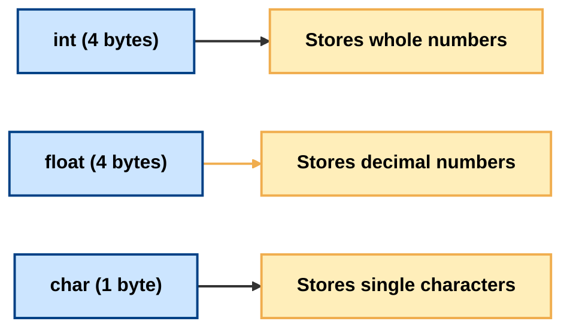
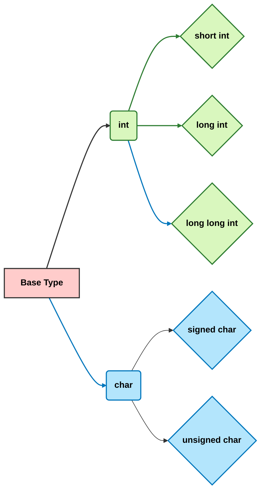
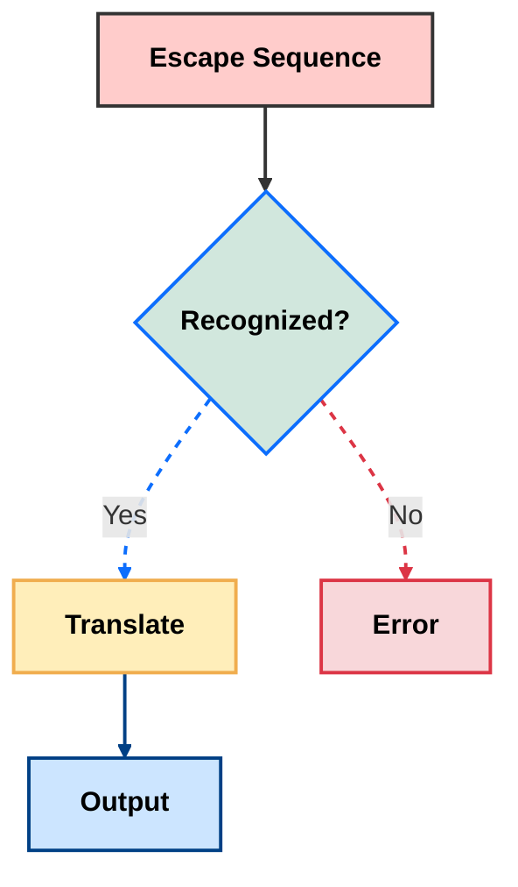
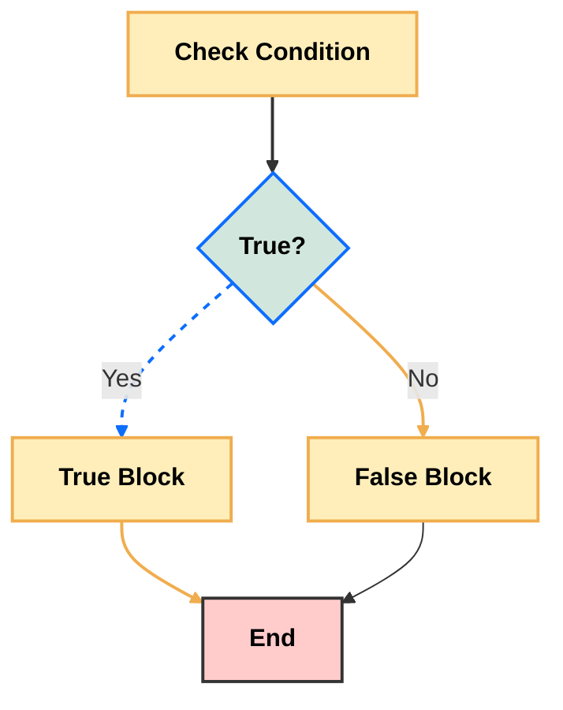
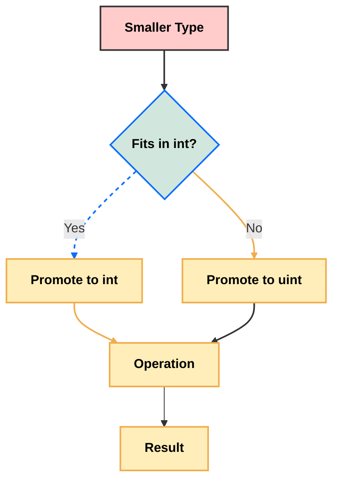
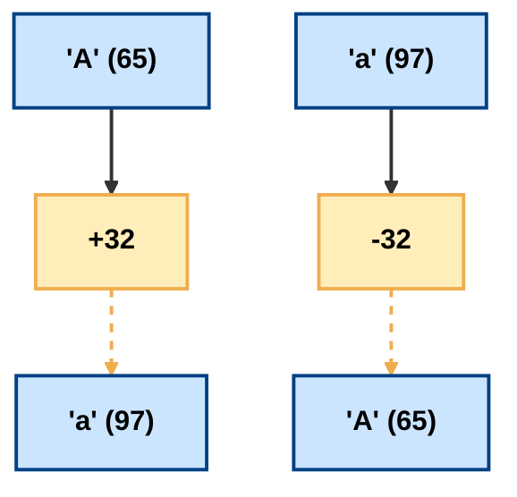
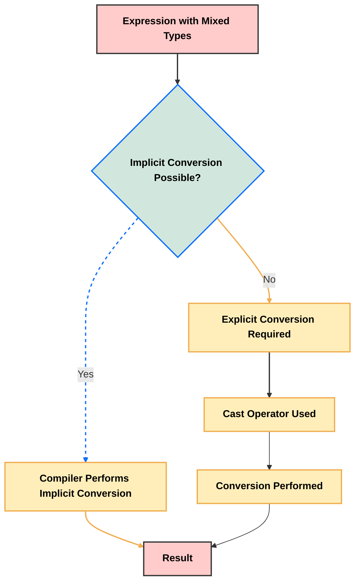

# <span style="color:#e67e22;">What we will learn in this post?</span>

<ul style='list-style-type: none; padding-left: 0;'>
<li><span style='color: #2980b9; font-size: 20px; font-weight: bold;'>👉</span> <span style='color: #2ecc71; font-size: 18px; font-weight: bold;'>Data Types in C</span></li>
<li><span style='color: #2980b9; font-size: 20px; font-weight: bold;'>👉</span> <span style='color: #2ecc71; font-size: 18px; font-weight: bold;'>Data Type Modifiers in C</span></li>
<li><span style='color: #2980b9; font-size: 20px; font-weight: bold;'>👉</span> <span style='color: #2ecc71; font-size: 18px; font-weight: bold;'>Literals in C</span></li>
<li><span style='color: #2980b9; font-size: 20px; font-weight: bold;'>👉</span> <span style='color: #2ecc71; font-size: 18px; font-weight: bold;'>Escape Sequence in C</span></li>
<li><span style='color: #2980b9; font-size: 20px; font-weight: bold;'>👉</span> <span style='color: #2ecc71; font-size: 18px; font-weight: bold;'>bool in C</span></li>
<li><span style='color: #2980b9; font-size: 20px; font-weight: bold;'>👉</span> <span style='color: #2ecc71; font-size: 18px; font-weight: bold;'>Integer Promotions in C</span></li>
<li><span style='color: #2980b9; font-size: 20px; font-weight: bold;'>👉</span> <span style='color: #2ecc71; font-size: 18px; font-weight: bold;'>Character Arithmetic in C</span></li>
<li><span style='color: #2980b9; font-size: 20px; font-weight: bold;'>👉</span> <span style='color: #2ecc71; font-size: 18px; font-weight: bold;'>Type Conversion in C</span></li>
<li><span style='color: #2980b9; font-size: 20px; font-weight: bold;'>👉</span> <span style='color: #2ecc71; font-size: 18px; font-weight: bold;'>Conclusion!</span></li>
</ul>

# <span style="color:#e67e22">Exploring C Data Types 🧮</span>

C offers a variety of data types to represent different kinds of information.
Understanding these types is crucial for writing efficient and correct C
programs. Let's explore some key ones!

## <span style="color:#2980b9">Basic Data Types ✨</span>

These are the fundamental building blocks of C's data representation.

### <span style="color:#8e44ad">Integer Types 🔢</span>

Integers represent whole numbers (without decimal points). The size (in bytes)
and range depend on the system's architecture (32-bit vs 64-bit), but here's a
general idea:

| Type           | Size (bytes) | Range                                                   | Example                                    |
| -------------- | ------------ | ------------------------------------------------------- | ------------------------------------------ |
| `int`          | 4 (usually)  | -2,147,483,648 to 2,147,483,647                         | `int age = 30;`                            |
| `short`        | 2 (usually)  | -32,768 to 32,767                                       | `short smallNum = 100;`                    |
| `long`         | 4 or 8       | System-dependent, usually larger than `int`             | `long bigNum = 1234567890;`                |
| `long long`    | 8 (usually)  | -9,223,372,036,854,775,808 to 9,223,372,036,854,775,807 | `long long hugeNum = 1234567890123456789;` |
| `unsigned int` | 4 (usually)  | 0 to 4,294,967,295                                      | `unsigned int count = 1000;`               |

**Example demonstrating `int`:**

```c
#include <stdio.h>

int main() {
  int age = 30;
  printf("My age is: %d\n", age); // Output: My age is: 30
  return 0;
}
```

### <span style="color:#8e44ad">Floating-Point Types 📈</span>

These represent numbers with decimal points.

| Type          | Size (bytes) | Precision (approx.)            | Example                                          |
| ------------- | ------------ | ------------------------------ | ------------------------------------------------ |
| `float`       | 4            | 7 decimal digits               | `float price = 99.99;`                           |
| `double`      | 8            | 15 decimal digits              | `double pi = 3.14159265359;`                     |
| `long double` | 16 (usually) | Higher precision than `double` | `long double preciseVal = 1.234567890123456789;` |

**Example demonstrating `float`:**

```c
#include <stdio.h>

int main() {
  float price = 99.99f; // The 'f' suffix indicates a float literal
  printf("The price is: %.2f\n", price); // Output: The price is: 99.99
  return 0;
}
```

### <span style="color:#8e44ad">Character Type 🔤</span>

The `char` type stores single characters. It's typically 1 byte in size.

```c
#include <stdio.h>

int main() {
  char initial = 'J';
  printf("My initial is: %c\n", initial); // Output: My initial is: J
  return 0;
}
```

## <span style="color:#2980b9">Derived Data Types 🧱</span>

These are built upon the basic types. We'll cover some common ones in a later
section. For now, let's focus on the fundamentals.

## <span style="color:#2980b9">Memory Representation 🤔</span>

The size of each data type influences how much memory your program uses. Larger
types require more space. Understanding this helps in optimizing your code's
memory usage. For example, using `int` when `short` suffices can unnecessarily
consume memory.



This diagram visually represents the memory allocation differences between basic
data types. Remember that the exact sizes may vary based on your system
architecture. Always compile and test to understand your specific environment's
behavior.

# <span style="color:#e67e22">Understanding C Data Type Modifiers 🧮</span>

C offers several modifiers to fine-tune the properties of its base data types
(like `int`, `char`, etc.). These modifiers control things like the size (amount
of memory used) and the range of values a variable can hold. Let's explore them!

## <span style="color:#2980b9">Size Modifiers: `short` and `long` 📏</span>

These modifiers primarily affect the size (and therefore the range) of integer
types (`int`).

### <span style="color:#8e44ad">`short` 🩳</span>

- Indicates a _smaller_ integer type than the default `int`. The exact size
  isn't fixed and depends on the compiler and system architecture (usually 2
  bytes).
- **Example:**

```c
#include <stdio.h>
#include <limits.h> // For SHRT_MIN and SHRT_MAX

int main() {
  short smallNum = 32000;
  printf("Size of short: %zu bytes\n", sizeof(short)); // Output: Size of short: 2 bytes
  printf("Minimum short: %d\n", SHRT_MIN); //Output: Minimum short: -32768
  printf("Maximum short: %d\n", SHRT_MAX); //Output: Maximum short: 32767
  return 0;
}
```

### <span style="color:#8e44ad">`long` 📏</span>

- Indicates a _larger_ integer type than the default `int`. Again, the exact
  size depends on the system (often 4 or 8 bytes). You can also use `long long`
  for even larger integers.
- **Example:**

```c
#include <stdio.h>
#include <limits.h> // For LONG_MIN and LONG_MAX

int main() {
  long bigNum = 2147483647; // Example value, might vary depending on system
  printf("Size of long: %zu bytes\n", sizeof(long)); // Output: Size of long: 4 or 8 bytes (system dependent)
  printf("Minimum long: %ld\n", LONG_MIN); //Output: Minimum long: -2147483648 (example)
  printf("Maximum long: %ld\n", LONG_MAX); //Output: Maximum long: 2147483647 (example)
  return 0;
}
```

## <span style="color:#2980b9">Sign Modifiers: `signed` and `unsigned` ➕➖</span>

These modifiers determine whether a variable can hold negative values.

### <span style="color:#8e44ad">`signed` ➕➖</span>

- (Default for `char` and `int` types) Allows both positive and negative values.
  The highest bit represents the sign (0 for positive, 1 for negative).
- **Example:** (Implicitly signed)

```c
int signedNumber = -10;
```

### <span style="color:#8e44ad">`unsigned` ➕</span>

- Allows only non-negative values (0 and positive). All bits are used to
  represent the magnitude of the number. This doubles the maximum positive value
  compared to a signed type of the same size.
- **Example:**

```c
unsigned int unsignedNumber = 4294967295; //Max value for unsigned int on 32-bit systems
```

## <span style="color:#2980b9">Visual Summary: Data Type Sizes & Ranges 🤔</span>

The actual sizes and ranges depend heavily on your system architecture (32-bit
vs 64-bit).



_Note: `short` and `long` can be used with other types like `long double` (for
higher precision floating-point numbers)._

Remember to always consult your compiler's documentation or use `sizeof()` to
determine the exact size of a data type on your specific system. Choosing the
right data type is crucial for efficient memory management and avoiding
potential overflow errors.

# <span style="color:#e67e22">Literals in C: A Visual Guide 📖</span>

Literals in C are constant values that are directly written into the source
code. They represent fixed data that the compiler can understand. Think of them
as the raw ingredients in your C cooking recipe! 👩‍🍳

## <span style="color:#2980b9">Integer Literals 🔢</span>

These represent whole numbers without any fractional part.

### <span style="color:#8e44ad">Types of Integer Literals</span>

- **Decimal:** Base-10 numbers (0-9).
  - Example: `int age = 30;` // _age_ will hold the value 30.
- **Octal:** Base-8 numbers (0-7), prefixed with `0`.
  - Example: `int octalNum = 077;` // _octalNum_ will hold the decimal value 63
    (7\*8 + 7).
- **Hexadecimal:** Base-16 numbers (0-9, A-F), prefixed with `0x` or `0X`.
  - Example: `int hexNum = 0x1A;` // _hexNum_ will hold the decimal value 26
    (1\*16 + 10).

## <span style="color:#2980b9">Floating-Point Literals 🧮</span>

These represent numbers with fractional parts.

### <span style="color:#8e44ad">Types of Floating-Point Literals</span>

- **Single-precision (float):** Use `f` or `F` suffix.
  - Example: `float pi = 3.14159f;` // _pi_ will hold the value 3.14159 (single
    precision)
- **Double-precision (double):** Default type if no suffix is used.
  - Example: `double e = 2.71828;` // _e_ will hold the value 2.71828 (double
    precision).
- **Long double:** Use `l` or `L` suffix for higher precision.
  - Example: `long double veryPrecise = 1.234567890123456789L;` // _veryPrecise_
    holds a value with higher precision than double.

## <span style="color:#2980b9">Character Literals 🔤</span>

These represent single characters enclosed in single quotes.

### <span style="color:#8e44ad">Escape Sequences</span>

Special characters are represented using escape sequences:

- `\n`: Newline
- `\t`: Tab
- `\\`: Backslash
- `\'`: Single quote
- `\"`: Double quote

- Example: `char initial = 'J';` // _initial_ will hold the character 'J'.
- Example: `char newline = '\n';` // _newline_ will hold the newline character.

## <span style="color:#2980b9">String Literals 📜</span>

These represent sequences of characters enclosed in double quotes. They are
actually arrays of characters terminated by a null character (`\0`).

- Example: `char message[] = "Hello, world!";` // _message_ will hold the string
  "Hello, world!".

## <span style="color:#2980b9">Boolean Literals ☑️</span>

These represent truth values. C99 and later standards support `_Bool` type.

- `0`: Represents `false`
- `1`: Represents `true`

- Example: `_Bool isAdult = 1;` // _isAdult_ is true.

## <span style="color:#2980b9">Example Code Snippet</span>

```c
#include <stdio.h>

int main() {
    int age = 30;          // Integer literal
    float price = 99.99f;  // Floating-point literal (float)
    char initial = 'A';     // Character literal
    char* message = "Hello!"; // String literal
    _Bool isRaining = 0; // Boolean literal (false)

    printf("Age: %d\n", age);       // Output: Age: 30
    printf("Price: %.2f\n", price); // Output: Price: 99.99
    printf("Initial: %c\n", initial); // Output: Initial: A
    printf("Message: %s\n", message); // Output: Message: Hello!
    printf("Is it raining? %d\n", isRaining); // Output: Is it raining? 0
    return 0;
}
```

This example demonstrates the usage of various literals in a simple C program.
Remember that the type of a literal determines how it's stored and used within
your program. Choosing the right literal type is crucial for efficient and
correct code.

# <span style="color:#e67e22">Escape Sequences in C: A Deep Dive 🔍</span>

Escape sequences in C are special character combinations that allow you to
represent characters that are difficult or impossible to type directly into your
code. They begin with a backslash (`\`), followed by one or more characters.
Think of them as secret codes for your compiler! ✨

## <span style="color:#2980b9">Why Use Escape Sequences? 🤔</span>

- **Representing Special Characters:** Some characters have special meanings in
  C strings (like the newline character which starts a new line). Escape
  sequences let you include these characters literally within strings.
- **Improving Readability:** Using escape sequences makes your code cleaner and
  easier to understand, especially when dealing with characters that aren't
  easily typed or displayed directly.
- **Control Characters:** Escape sequences provide a way to control the
  formatting and behavior of your output.

## <span style="color:#2980b9">Common Escape Sequences 📜</span>

Here are some frequently used escape sequences:

| Escape Sequence | Description                                     | Example                             | Output                               |
| --------------- | ----------------------------------------------- | ----------------------------------- | ------------------------------------ |
| `\n`            | Newline (moves the cursor to the next line)     | `printf("Hello\nWorld!");`          | `Hello` <br> `World!`                |
| `\t`            | Horizontal tab (inserts whitespace)             | `printf("Name:\tAge:");`            | `Name:    Age:`                      |
| `\\`            | Backslash (represents a backslash)              | `printf("C:\\Users\\Documents");`   | `C:\Users\Documents`                 |
| `\'`            | Single quote (represents a single quote)        | `printf("It\'s a beautiful day!");` | `It's a beautiful day!`              |
| `\"`            | Double quote (represents a double quote)        | `printf("He said, \"Hello!\"");`    | `He said, "Hello!"`                  |
| `\?`            | Question mark                                   | `printf("What is this?\?");`        | `What is this?`                      |
| `\a`            | Audible alert (makes a beep sound)              | `printf("\aError!");`               | _(Produces a beep sound)_            |
| `\r`            | Carriage return (moves cursor to start of line) | `printf("Hello\rWorld!");`          | `World!`                             |
| `\v`            | Vertical tab                                    | `printf("Line1\vLine2");`           | _(Moves the cursor down vertically)_ |
| `\0`            | Null character (ends a string)                  | `char str[] = "Hello\0World";`      | _(The string ends at "Hello")_       |

### <span style="color:#8e44ad">Example: Combining Escape Sequences</span>

```c
#include <stdio.h>

int main() {
    printf("This is a line.\n\tThis is a tabbed line.\n"); //This is a line.  This is a tabbed line.
    printf("This uses \"double quotes\" and \\backslash.\n"); // This uses "double quotes" and \backslash.
    printf("A beep \a will follow!"); // *(Produces a beep)*

    return 0;
}
```

## <span style="color:#2980b9">Visual Representation: Escape Sequence Flow 🌊</span>



## <span style="color:#2980b9">Important Notes ⚠️</span>

- Escape sequences are _only_ interpreted within string literals and character
  constants.
- Incorrectly using backslashes can lead to compilation errors. Always ensure
  you use them correctly according to the escape sequence you want.

This comprehensive guide should provide a solid understanding of escape
sequences in C. Remember to practice using them in your code to build your
mastery! 💪

# <span style="color:#e67e22">Exploring the `bool` Data Type in C 💡</span>

The `bool` data type in C represents boolean values, which can be either _true_
or _false_. While not part of the original C standard, it's been a significant
addition, improving code readability and maintainability. Let's delve into its
details.

## <span style="color:#2980b9">Introduction to `bool` 🎉</span>

Before C99, programmers often used integers (0 for false, non-zero for true) to
represent boolean values. This was less intuitive and could lead to errors. The
introduction of the `bool` type in **C99** standardized this, making code
cleaner and easier to understand.

### <span style="color:#8e44ad">Inclusion of `<stdbool.h>` 📚</span>

To use the `bool` type, you _must_ include the `<stdbool.h>` header file. This
header defines the `bool` type, along with the macros `true` and `false`.

```c
#include <stdio.h>
#include <stdbool.h>

int main() {
  bool isAdult = true;
  bool isRaining = false;

  printf("Is adult: %s\n", isAdult ? "true" : "false"); // Output: Is adult: true
  printf("Is raining: %s\n", isRaining ? "true" : "false"); // Output: Is raining: false
  return 0;
}
```

## <span style="color:#2980b9">Using `bool` in Conditional Statements 🔀</span>

The real power of `bool` lies in its use within conditional statements like
`if`, `else if`, and `while`.

```c
#include <stdio.h>
#include <stdbool.h>

int main() {
  bool hasLicense = true;
  int age = 25;

  if (hasLicense && age >= 18) {
    printf("Eligible to drive!\n"); // Output: Eligible to drive!
  } else {
    printf("Not eligible to drive.\n");
  }
  return 0;
}
```

This example clearly demonstrates how `bool` improves code readability. The
intention is instantly clear compared to using integers.

## <span style="color:#2980b9">Comparison with Integer Representation 🤔</span>

| Feature         | `bool`                                    | Integer (0/1)                          |
| --------------- | ----------------------------------------- | -------------------------------------- |
| **Readability** | Improved, self-documenting                | Less clear, prone to misinterpretation |
| **Type Safety** | Enforces boolean logic                    | Can lead to logical errors             |
| **Standard**    | Standardized in C99                       | Pre-C99 practice                       |
| **Size**        | Typically 1 byte (implementation-defined) | Typically 4 bytes (int)                |

## <span style="color:#2980b9">Flowchart Illustrating a Boolean Decision 📊</span>



## <span style="color:#2980b9">Conclusion 🎯</span>

The `bool` data type, introduced in C99, is a valuable asset for modern C
programming. It significantly enhances code readability, prevents potential
logical errors associated with integer-based boolean representations, and
promotes better software engineering practices. By using `bool`, your code
becomes clearer, more maintainable, and easier to debug. Remember to always
include `<stdbool.h>` when using it!

# <span style="color:#e67e22">Integer Promotions in C 🧮</span>

C's integer promotion rules ensure that operations involving different integer
types are performed consistently, preventing unexpected results. Essentially,
smaller integer types are automatically "upgraded" to a larger type before
calculations. This process avoids data loss and ensures that operations are done
with sufficient precision.

## <span style="color:#2980b9">The "Usual Arithmetic Conversions" ✨</span>

Before any arithmetic operation (+, -, *, /, %), C performs what's called "usual
arithmetic conversions." This involves several steps, but the core is _integer
promotion_. The process aims to find a*common type\* for the operands involved.

### <span style="color:#8e44ad">The Promotion Process ⬆️</span>

The promotion rules are straightforward:

- **Smaller Integer Types:** `char`, `short`, `unsigned char`, `unsigned short`,
  and `enum` are promoted to `int` (if `int` can represent all the values of the
  original type) or `unsigned int` (otherwise). Think of it as a "minimum size
  guarantee".

- **Larger Integer Types:** `int` and `unsigned int` usually remain as they are.
  `long`, `unsigned long`, `long long`, and `unsigned long long` also typically
  remain the same; however, they might be promoted further if necessary to
  achieve a common type.

### <span style="color:#8e44ad">Example 1: `char` and `int`</span>

```c
#include <stdio.h>

int main() {
  char a = 10;
  int b = 20;
  int sum = a + b; // 'a' is promoted to 'int' before addition
  printf("Sum: %d\n", sum); // Output: Sum: 30
  return 0;
}
```

In this example, the `char` variable `a` is promoted to `int` before the
addition with `b`. The result is correctly calculated as an `int`.

### <span style="color:#8e44ad">Example 2: `short` and `unsigned short`</span>

```c
#include <stdio.h>
#include <limits.h>

int main() {
  short x = SHRT_MAX; // Maximum value for a short
  unsigned short y = 1;
  int sum = x + y;  //x is promoted to int, resulting in an unexpected positive value.
  printf("Sum: %d\n", sum); // Output will vary depending on system, but will likely be a positive number; not an overflow.
  return 0;
}
```

Here, both `short` and `unsigned short` are promoted to `int`. Notice, the
potential for overflow if the `int` is not large enough to accommodate the
result of the sum of the original `short` and `unsigned short`.

## <span style="color:#2980b9">Visualizing the Process 📊</span>

Here's a simple flowchart illustrating the promotion:



## <span style="color:#2980b9">Important Considerations 🤔</span>

- **Signed vs. Unsigned:** When dealing with signed and unsigned integers of the
  same rank (e.g., `int` and `unsigned int`), the signed type is converted to
  unsigned. This can lead to unexpected results if you are not careful with the
  potential range implications.

- **Compiler-Specific Behaviors:** While the standards define the promotion
  rules, some subtle aspects might vary slightly between compilers.

- **Avoid Implicit Conversions:** It's good practice to be explicit in your code
  whenever possible. For instance, if you anticipate large values, it's safer to
  explicitly cast variables to larger types to guarantee that your computations
  are performed with sufficient precision.

By understanding integer promotions, you can write more robust and predictable C
code, avoiding common pitfalls related to integer overflow and unexpected type
interactions. Remember to always be mindful of the potential impact of these
automatic conversions on your programs' behavior.

# <span style="color:#e67e22">Character Arithmetic in C 🧮</span>

In C, characters are not just letters, numbers, or symbols; they're actually
represented internally as _integer_ values. This seemingly simple fact opens up
a world of possibilities, including performing arithmetic operations directly on
characters! Let's explore how this works.

## <span style="color:#2980b9">Character Encoding: ASCII & Beyond 📜</span>

Computers store everything as numbers. To represent characters (like 'A', 'b',
'!', '5'), a standard encoding scheme is used. The most common is **ASCII
(American Standard Code for Information Interchange)**. ASCII assigns a unique
integer value (from 0 to 127) to each character.

For instance:

- 'A' is typically represented as 65.
- 'a' is typically represented as 97.
- '0' is typically represented as 48.

This mapping allows the compiler to treat characters as numbers seamlessly.
Beyond ASCII, other encodings like Unicode (UTF-8) exist to represent a wider
range of characters from different languages. However, the core principle of
representing characters as numbers remains the same.

### <span style="color:#8e44ad">ASCII Table Snippet</span>

A small portion of the ASCII table to illustrate:

| Character | Decimal Value |
| --------- | ------------- |
| 'A'       | 65            |
| 'B'       | 66            |
| 'a'       | 97            |
| 'b'       | 98            |
| '0'       | 48            |
| '1'       | 49            |

## <span style="color:#2980b9">Arithmetic with Characters ✨</span>

Since characters are integers, we can perform arithmetic operations on them.
This is particularly useful for tasks such as:

- **Converting between uppercase and lowercase:** The difference between the
  ASCII values of uppercase and lowercase letters is constant (32).
- **Generating character sequences:** Incrementing a character's value can
  produce the next character in a sequence.
- **Simple cryptography:** Performing basic arithmetic can be used as a simple
  form of encryption.

### <span style="color:#8e44ad">Examples of Character Arithmetic</span>

Let's see some code examples illustrating these operations:

```c
#include <stdio.h>

int main() {
  char ch1 = 'A';
  char ch2 = 'a';
  char digit = '5';

  //Adding integers to characters
  char uppercase_ch = ch1 + 32; //'a'   (Convert uppercase to lowercase)
  printf("Uppercase to lowercase: %c\n", uppercase_ch); // Output: a

  char lowercase_ch = ch2 - 32; //'A'   (Convert lowercase to uppercase)
  printf("Lowercase to uppercase: %c\n", lowercase_ch); //Output: A


  //Incrementing characters
  char next_char = ch1 + 1; //'B'
  printf("Next character: %c\n", next_char); // Output: B

  //Arithmetic with digits
  int digit_value = digit - '0'; //5 (Convert character digit to integer)
  printf("Digit value: %d\n", digit_value); // Output: 5

  return 0;
}
```

**Important Note:** Be cautious about potential overflow issues when performing
arithmetic on characters, especially when dealing with characters near the
highest or lowest values in your encoding scheme.

## <span style="color:#2980b9">Visualizing Character Arithmetic 📊</span>



This diagram shows the conversion between uppercase and lowercase characters
using addition and subtraction.

This exploration showcases the fascinating duality of characters in C—their
representation as both symbolic entities and numerical values, enabling powerful
and concise manipulations. Remember to always keep in mind the underlying
integer representation to avoid unexpected results.

# <span style="color:#e67e22">Type Conversion in C 🔄</span>

Type conversion, also known as _casting_, is the process of changing a variable
from one data type to another. This is crucial in C because it allows you to
perform operations that involve variables of different types. C offers two main
ways to do this: _implicitly_ and _explicitly_.

## <span style="color:#2980b9">Implicit Type Conversion (Automatic Casting) 🤫</span>

Implicit type conversion happens automatically by the compiler without any
explicit instruction from the programmer. The compiler usually promotes the
"smaller" data type to the "larger" one to avoid data loss. This is also known
as _automatic type promotion_.

### <span style="color:#8e44ad">When it Occurs</span>

Implicit conversion typically occurs in expressions involving mixed data types.
For instance, if you add an `int` and a `float`, the `int` will be implicitly
converted to a `float` before the addition takes place.

### <span style="color:#8e44ad">Examples</span>

```c
#include <stdio.h>

int main() {
  int x = 10;
  float y = 2.5;
  float z = x + y; // x is implicitly converted to float

  printf("Implicit Conversion: z = %f\n", z); // Output: Implicit Conversion: z = 12.500000
  return 0;
}
```

Another Example:

```c
#include <stdio.h>

int main() {
    int a = 10;
    double b = 20.5;
    double c = a + b; //a is implicitly converted to double
    printf("Implicit Conversion: c = %lf\n", c); //Output: Implicit Conversion: c = 30.500000
    return 0;
}

```

## <span style="color:#2980b9">Explicit Type Conversion (Casting) 🔨</span>

Explicit type conversion, also called _casting_, involves explicitly telling the
compiler to change a variable's data type using a _cast operator_. This gives
you more control over the conversion process. The syntax involves placing the
desired data type in parentheses before the variable.

### <span style="color:#8e44ad">When to Use it</span>

Use explicit conversion when:

- You need to convert a larger data type to a smaller one (potential for data
  loss).
- You want to force a specific type conversion that the compiler wouldn't
  perform implicitly.
- You need more control over the conversion process to handle potential overflow
  or truncation.

### <span style="color:#8e44ad">Examples</span>

```c
#include <stdio.h>

int main() {
  float x = 10.75;
  int y = (int)x; // Explicit conversion from float to int (truncation)

  printf("Explicit Conversion: y = %d\n", y); // Output: Explicit Conversion: y = 10
  return 0;
}
```

Another example showing potential data loss:

```c
#include <stdio.h>

int main(){
    double x = 1234567890.12345;
    int y = (int) x; // explicit conversion, potential loss of precision
    printf("Explicit Conversion: y = %d\n", y); //Output: Explicit Conversion: y = 1234567890
    return 0;
}
```

## <span style="color:#2980b9">Type Conversion Flowchart 📊</span>



**Key Considerations:**

- **Data Loss:** Be mindful of potential data loss when converting from a larger
  data type to a smaller one (e.g., `double` to `int`). The extra information
  will be truncated.
- **Overflow:** Converting a large number to a smaller data type can lead to
  _overflow_, where the result is incorrect due to the limitations of the
  smaller type's range.

By understanding both implicit and explicit type conversion, you can write more
robust and efficient C programs. Remember to choose the appropriate method based
on your needs and be aware of potential pitfalls. Always prioritize clarity and
maintainability in your code.

<h1><span style='color:#e67e22'>Conclusion</span></h1>

So, there you have it! We've covered a lot of ground today. Hopefully, this post
has been helpful and insightful! 😊

Let us know in the comments section below! 👇 We're eager to engage with you and
continue the discussion. Your input helps us improve and create even better
content for everyone. 🎉

## <span style="color:#2980b9">Share Your Thoughts!</span>

- **What did you find most helpful?** Tell us what resonated with you most in
  the post!
- **What questions do you still have?** No question is too small or silly –
  we're here to help!
- **Any suggestions for future topics?** What would _you_ like to learn more
  about?

We look forward to reading your comments! Thanks for joining us! 🤗
