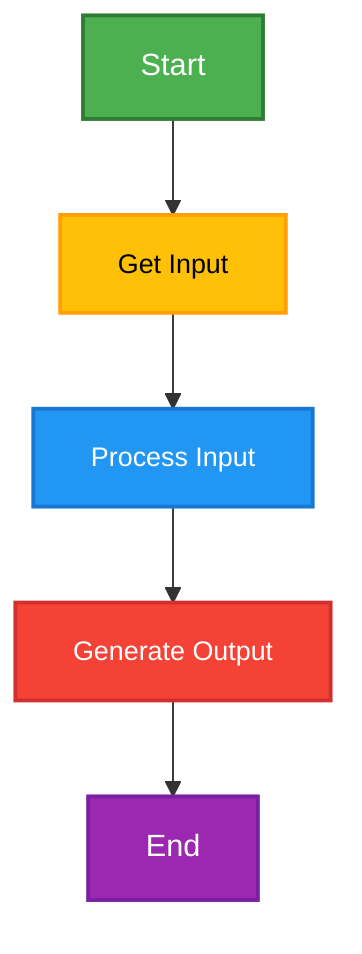
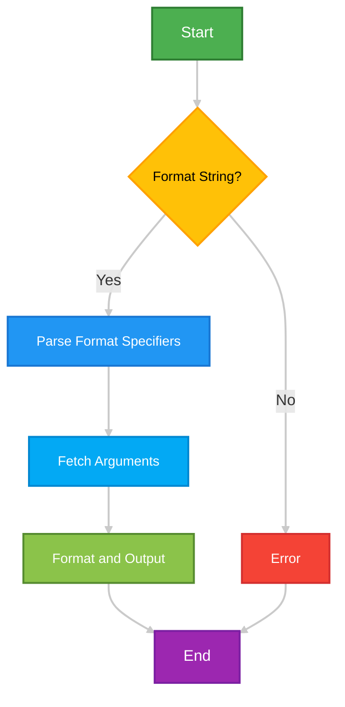
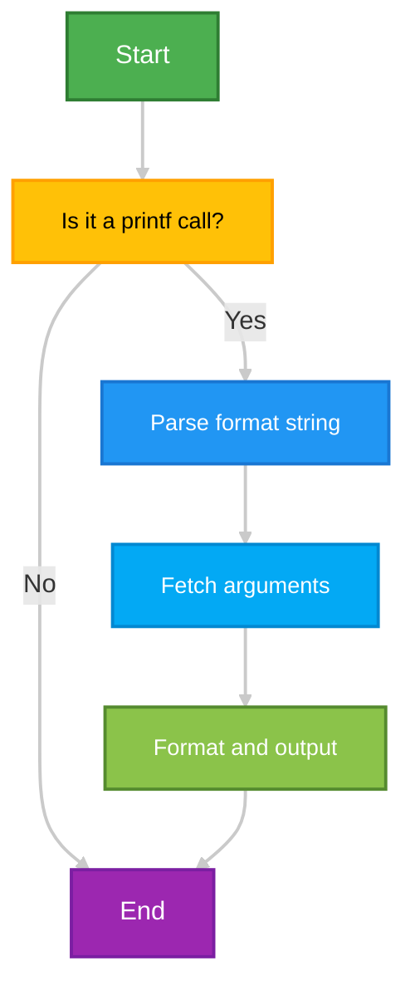
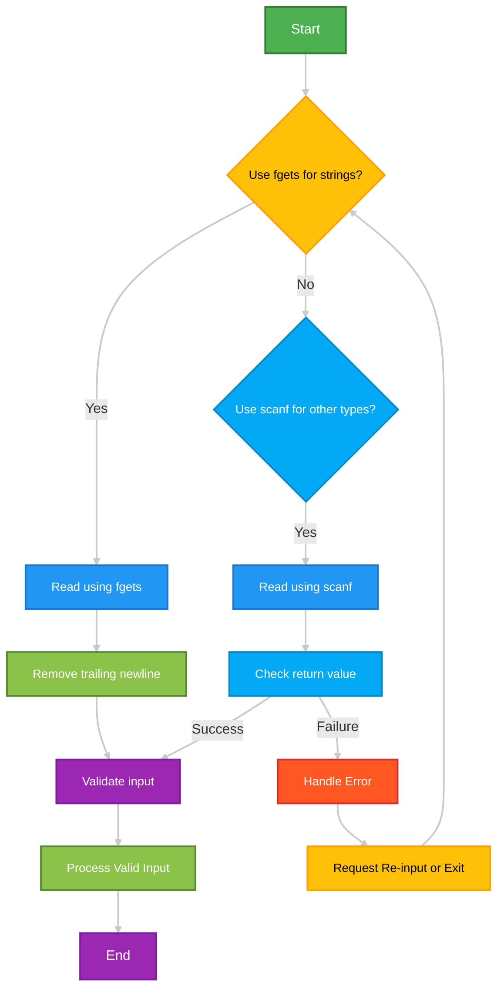
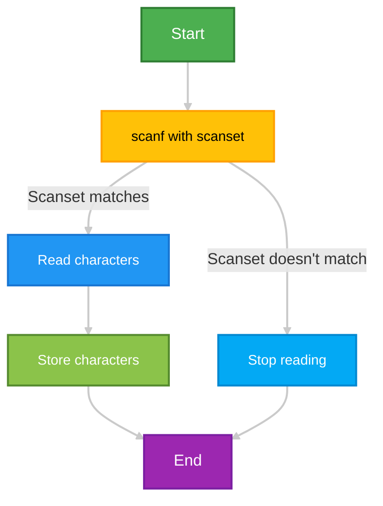
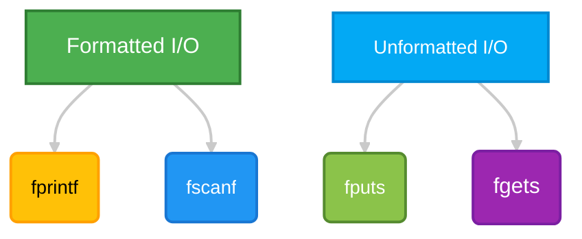

# <span style="color:#e67e22;">What we will learn in this post?</span>

<ul style='list-style-type: none; padding-left: 0;'>
<li><span style='color: #2980b9; font-size: 20px; font-weight: bold;'>👉</span> <span style='color: #2ecc71; font-size: 18px; font-weight: bold;'>Basic Input and Output in C</span></li>
<li><span style='color: #2980b9; font-size: 20px; font-weight: bold;'>👉</span> <span style='color: #2ecc71; font-size: 18px; font-weight: bold;'>Format Specifiers in C</span></li>
<li><span style='color: #2980b9; font-size: 20px; font-weight: bold;'>👉</span> <span style='color: #2ecc71; font-size: 18px; font-weight: bold;'>printf in C</span></li>
<li><span style='color: #2980b9; font-size: 20px; font-weight: bold;'>👉</span> <span style='color: #2ecc71; font-size: 18px; font-weight: bold;'>scanf in C</span></li>
<li><span style='color: #2980b9; font-size: 20px; font-weight: bold;'>👉</span> <span style='color: #2ecc71; font-size: 18px; font-weight: bold;'>Scansets in C</span></li>
<li><span style='color: #2980b9; font-size: 20px; font-weight: bold;'>👉</span> <span style='color: #2ecc71; font-size: 18px; font-weight: bold;'>Formatted and Unformatted Input and Output Functions</span></li>
<li><span style='color: #2980b9; font-size: 20px; font-weight: bold;'>👉</span> <span style='color: #2ecc71; font-size: 18px; font-weight: bold;'>Conclusion!</span></li>
</ul>

# <span style="color:#e67e22">Input and Output in C Programming ⌨️</span>

C programs interact with the outside world through input and output (I/O)
operations. Input involves getting data from the user or a file, while output
involves displaying results to the user or writing data to a file. Let's explore
this crucial aspect of C programming!

## <span style="color:#2980b9">Standard Input/Output Streams 🌊</span>

C provides three standard I/O streams:

- **`stdin` (standard input):** This stream is typically connected to your
  keyboard. It's where the program receives input.
- **`stdout` (standard output):** This stream is usually connected to your
  console (the screen). It's where the program sends its output.
- **`stderr` (standard error):** This stream is also connected to your console
  but is used for displaying error messages. This helps to separate error
  messages from regular program output.

### <span style="color:#8e44ad">The `printf` Function 🗣️</span>

The `printf` function is used to display formatted output to the `stdout` stream
(your screen). It's a very versatile function.

```c
#include <stdio.h>

int main() {
  int age = 30;
  char name[] = "Alice";
  printf("My name is %s and I am %d years old.\n", name, age); // Output: My name is Alice and I am 30 years old.
  return 0;
}
```

- `%s` is a _format specifier_ that tells `printf` to expect a string (like
  "Alice").
- `%d` is a format specifier for an integer (like 30).
- `\n` is a newline character, which moves the cursor to the next line.

### <span style="color:#8e44ad">The `scanf` Function ⌨️</span>

The `scanf` function is used to read formatted input from the `stdin` stream
(your keyboard).

```c
#include <stdio.h>

int main() {
  int age;
  char name[50]; // Allocate space for the name, 50 chars is enough.
  printf("Enter your name: ");
  scanf("%s", name); // Read a string into name
  printf("Enter your age: ");
  scanf("%d", &age); // Read an integer into age, note the & (address-of operator)
  printf("Your name is %s and you are %d years old.\n", name, age); //Output depends on user input.
  return 0;
}
```

- `&age` is the _address_ of the `age` variable. `scanf` needs the memory
  location to store the input value.
- `%s` reads a string until it encounters whitespace.

## <span style="color:#2980b9">A Simple I/O Example ✨</span>

Let's combine `printf` and `scanf` to create a simple program that takes a
user's name and age as input, and then prints a personalized greeting:

```c
#include <stdio.h>

int main() {
  char name[50];
  int age;

  printf("What is your name? ");
  scanf("%s", name);

  printf("How old are you? ");
  scanf("%d", &age);

  printf("Hello, %s! You are %d years old.  It's nice to meet you!\n", name, age); // Output depends on user input
  return 0;
}
```

## <span style="color:#2980b9">Flowchart of Input/Output Process</span>



This flowchart visually represents the basic flow of a C program using input and
output.

Remember that proper error handling (e.g., checking the return value of `scanf`)
is crucial in real-world applications to make your programs more robust. This
simple introduction gives you a foundational understanding of input and output
operations in C programming. Happy coding! 🎉

# <span style="color:#e67e22">Format Specifiers in C: A Visual Guide 📖</span>

Format specifiers in C are special symbols used within format strings (typically
passed to functions like `printf` and `scanf`) to control how data is presented
during input and output operations. They essentially tell the compiler _what
type of data_ to expect and _how to format it_. Think of them as instructions
for your computer to display information neatly.

## <span style="color:#2980b9">Understanding the Basics 🤔</span>

Format specifiers always start with a `%` symbol, followed by characters that
specify the data type and formatting options. Let's look at some key components:

- **`%` (Percent Sign):** Signals the start of a format specifier.
- **Conversion Specifier:** Indicates the data type (e.g., `d` for integer, `f`
  for float, `s` for string).
- **Flags (Optional):** Modify the output's alignment, sign display, etc. (e.g.,
  `-` for left-alignment, `+` to always show the sign).
- **Width (Optional):** Specifies the minimum field width.
- **Precision (Optional):** Controls the number of decimal places for
  floating-point numbers or the maximum number of characters for strings.
- **Length Modifier (Optional):** Specifies the size of the data type (e.g., `l`
  for `long int`).

### <span style="color:#8e44ad">Common Format Specifiers ✨</span>

Here's a table summarizing common specifiers:

| Specifier | Data Type         | Description                                           | Example                  |
| --------- | ----------------- | ----------------------------------------------------- | ------------------------ |
| `%d`      | `int`             | Signed decimal integer                                | `printf("%d", 10);`      |
| `%u`      | `unsigned int`    | Unsigned decimal integer                              | `printf("%u", 10);`      |
| `%x`      | `int`             | Unsigned hexadecimal integer (lowercase)              | `printf("%x", 10);`      |
| `%X`      | `int`             | Unsigned hexadecimal integer (uppercase)              | `printf("%X", 10);`      |
| `%o`      | `int`             | Unsigned octal integer                                | `printf("%o", 10);`      |
| `%f`      | `float`, `double` | Floating-point number                                 | `printf("%f", 3.14);`    |
| `%e`      | `float`, `double` | Floating-point number in scientific notation          | `printf("%e", 3.14);`    |
| `%g`      | `float`, `double` | Floating-point number (chooses between `%f` and `%e`) | `printf("%g", 3.14);`    |
| `%s`      | `char*` (string)  | Character string                                      | `printf("%s", "Hello");` |
| `%%`      |                   | Prints a literal `%` sign                             | `printf("%%");`          |

## <span style="color:#2980b9">Examples in Action 💻</span>

Let's illustrate with some code and their outputs:

```c
#include <stdio.h>

int main() {
  int age = 30;
  float pi = 3.14159;
  char name[] = "Alice";

  printf("My age is: %d years old.\n", age); // Output: My age is: 30 years old.
  printf("The value of pi is approximately: %.2f\n", pi); // Output: The value of pi is approximately: 3.14
  printf("My name is: %s\n", name); // Output: My name is: Alice

  return 0;
}
```

## <span style="color:#2980b9">Advanced Formatting Options ⚙️</span>

You can further customize the output using:

- **Field Width:** `printf("%10d", 10);` // Outputs `10` (10 spaces before 10)
- **Precision:** `printf("%.3f", 3.14159);` //Outputs `3.142` (3 decimal places)
- **Flags:** `printf("%+d", 10);` // Outputs `+10` (always show the plus sign
  for positive numbers)

### <span style="color:#8e44ad">Flowchart for `printf` Function</span>



Remember to consult a comprehensive C reference for a complete list of format
specifiers and their options. Mastering these specifiers significantly improves
the readability and control over your C programs' output! 🎉

# <span style="color:#e67e22">Printf: Your C Output Superstar ⭐</span>

The `printf` function is your go-to tool in C for displaying formatted output to
the console. It's incredibly versatile, allowing you to control the appearance
of your text with amazing precision. Let's dive in!

## <span style="color:#2980b9">Syntax and Basic Usage ✍️</span>

The basic syntax of `printf` is straightforward:

```c
printf(format_string, argument1, argument2, ...);
```

- **`format_string`**: This is a string literal containing format specifiers
  (explained below). It dictates _how_ the arguments will be displayed.
- **`argument1`, `argument2`, ...**: These are the values you want to print.
  Their types _must_ match the format specifiers in the `format_string`.

### <span style="color:#8e44ad">Example: A Simple Print</span>

```c
#include <stdio.h>

int main() {
    int age = 30;
    char name[] = "Alice";
    printf("My name is %s and I am %d years old.\n", name, age); // Output: My name is Alice and I am 30 years old.
    return 0;
}
```

## <span style="color:#2980b9">Format Specifiers: The Magic ✨</span>

Format specifiers are codes within the `format_string` that tell `printf` how to
interpret and display the arguments. They start with a `%` symbol.

| Specifier | Description                     | Example                  |
| --------- | ------------------------------- | ------------------------ |
| `%c`      | Character                       | `printf("%c", 'A');`     |
| `%s`      | String                          | `printf("%s", "Hello");` |
| `%d`      | Signed decimal integer          | `printf("%d", 10);`      |
| `%u`      | Unsigned decimal integer        | `printf("%u", 10);`      |
| `%f`      | Floating-point number           | `printf("%f", 3.14);`    |
| `%x`      | Hexadecimal integer (lowercase) | `printf("%x", 15);`      |
| `%X`      | Hexadecimal integer (uppercase) | `printf("%X", 15);`      |
| `%%`      | Prints a literal `%`            | `printf("%%");`          |

### <span style="color:#8e44ad">Example: Various Data Types</span>

```c
#include <stdio.h>

int main() {
    char initial = 'J';
    int num = 12345;
    float pi = 3.14159;
    printf("Initial: %c, Number: %d, Pi: %f\n", initial, num, pi); // Output: Initial: J, Number: 12345, Pi: 3.141590
    return 0;
}
```

## <span style="color:#2980b9">Precision and Formatting 💪</span>

You can fine-tune the output using modifiers within the format specifiers:

- **Field Width:** `%10d` prints a decimal integer in a field of width 10
  (right-aligned).
- **Precision:** For floating-point numbers, `.2f` limits the output to 2
  decimal places.
- **Left Alignment:** `%-10d` left-aligns the integer in a field of width 10.

### <span style="color:#8e44ad">Example: Precision and Alignment</span>

```c
#include <stdio.h>

int main() {
    double price = 123.4567;
    int id = 12;
    printf("Product ID: %05d, Price: %.2f\n", id, price); //Output: Product ID: 00012, Price: 123.46
    printf("Product ID: %-5d, Price: %8.2f\n", id, price); // Output: Product ID: 12   , Price:   123.46

    return 0;
}
```

## <span style="color:#2980b9">Escape Sequences 👻</span>

Escape sequences allow you to insert special characters into your output:

- `\n`: Newline
- `\t`: Tab
- `\\`: Backslash
- `\"`: Double quote
- `\'`: Single quote

### <span style="color:#8e44ad">Example: Escape Sequences</span>

```c
#include <stdio.h>

int main() {
    printf("This is a newline:\nThis is on the next line.\n");
    printf("This is a tab:\tTabbed text.\n");
    printf("This prints a backslash: \\ \n");
    printf("This prints quotes: \"Hello, world!\"'\n"); // Output contains both single and double quotes.
    return 0;
}
```

## <span style="color:#2980b9">A Simple Flowchart 📊</span>



This flowchart illustrates the basic steps involved in a `printf` function call.
Remember that the actual implementation is far more complex!

Remember to always include `<stdio.h>` when using `printf`. Happy printing! 🎉

# <span style="color:#e67e22">Understanding `scanf` in C: User Input Made Easy ✍️</span>

The `scanf` function is a powerful tool in C for reading formatted input from
the standard input stream (usually the keyboard). It's crucial for interacting
with users and getting data into your programs. However, it's also notorious for
security vulnerabilities if not used carefully. Let's explore it safely!

## <span style="color:#2980b9">Syntax and Format Specifiers 🔤</span>

The basic syntax of `scanf` is:

```c
int scanf(const char *format, ...);
```

- `format`: A string containing format specifiers that dictate how to interpret
  the input.
- `...`: A variable number of arguments, each corresponding to a format
  specifier in `format`. These arguments must have addresses (using the `&`
  operator) for `scanf` to write to them.

### <span style="color:#8e44ad">Common Format Specifiers</span>

Here are some frequently used format specifiers:

| Specifier | Description                             | Example               |
| :-------- | :-------------------------------------- | :-------------------- |
| `%d`      | Signed decimal integer                  | `int age;`            |
| `%u`      | Unsigned decimal integer                | `unsigned int count;` |
| `%f`      | Floating-point number                   | `float price;`        |
| `%lf`     | Double-precision floating-point number  | `double balance;`     |
| `%c`      | Single character                        | `char initial;`       |
| `%s`      | String of characters (until whitespace) | `char name[50];`      |
| `%x`      | Hexadecimal integer                     | `int hexValue;`       |

## <span style="color:#2980b9">Safe Input Handling 🛡️</span>

Improper use of `scanf` can lead to buffer overflows and other security risks.
Here's how to do it safely:

### <span style="color:#8e44ad">Always Check the Return Value</span>

`scanf` returns the number of items successfully read. Always check this value
to ensure the input was correctly parsed.

```c
int age;
if (scanf("%d", &age) != 1) {
    fprintf(stderr, "Invalid input. Please enter an integer.\n");
    // Handle the error appropriately, e.g., exit, request re-input
}
```

### <span style="color:#8e44ad">Using `fgets` for Strings</span>

For strings, `fgets` is a much safer alternative to `%s` in `scanf`. `fgets`
reads a line of input at a time, preventing buffer overflows.

```c
char name[50];
if (fgets(name, sizeof(name), stdin) != NULL) {
    // Remove trailing newline character from fgets
    name[strcspn(name, "\n")] = 0;
} else {
    fprintf(stderr, "Input error.\n");
}
```

### <span style="color:#8e44ad">Input Validation</span>

Always validate the input after reading it to make sure it meets your program's
requirements.

```c
int age;
if (scanf("%d", &age) == 1 && age > 0) {
    // Process valid age
} else {
    fprintf(stderr, "Invalid age. Please enter a positive integer.\n");
}
```

## <span style="color:#2980b9">Examples ✨</span>

**Example 1: Reading an integer and a float**

```c
#include <stdio.h>

int main() {
    int num;
    float price;

    printf("Enter an integer: ");
    if (scanf("%d", &num) == 1) {
        printf("Enter a float: ");
        if (scanf("%f", &price) == 1) {
            printf("Integer: %d, Float: %.2f\n", num, price);
        } else {
            printf("Invalid float input.\n");
        }
    } else {
        printf("Invalid integer input.\n");
    }
    return 0;
}
```

**Example 2: Reading a name using `fgets`**

```c
#include <stdio.h>
#include <string.h>

int main() {
    char name[50];
    printf("Enter your name: ");
    if (fgets(name, sizeof(name), stdin) != NULL) {
        name[strcspn(name, "\n")] = 0; //remove trailing newline
        printf("Hello, %s!\n", name);
    } else {
        printf("Error reading input.\n");
    }
    return 0;
}
```

## <span style="color:#2980b9">Flowchart of Safe `scanf` Usage</span>



By following these guidelines, you can use `scanf` effectively and securely in
your C programs, preventing common pitfalls and vulnerabilities. Remember to
prioritize robust input validation and error handling for reliable and safe
applications.

# <span style="color:#e67e22">Scansets in C: A Comprehensive Guide 🔎</span>

## <span style="color:#2980b9">What are Scansets? 🤔</span>

Scansets in C are powerful tools within the `scanf` function that allow you to
define custom character sets for input. Instead of specifying individual
characters, you use a _scanset_ to specify a _range_ or _set_ of characters that
`scanf` should read. This significantly improves flexibility and readability
when dealing with complex input patterns.

Scansets are defined using square brackets `[]` within the `scanf` format
string. Inside the brackets, you specify the characters you want to accept.

### <span style="color:#8e44ad">Defining Scansets</span>

- **Including Characters:** To include a character directly, simply list it
  within the brackets. For example, `[abc]` will read only 'a', 'b', or 'c'.
- **Ranges of Characters:** You can specify ranges using a hyphen `-`. For
  example, `[a-z]` will read any lowercase letter, and `[0-9]` will read any
  digit.
- **Negating Scansets:** To read _any character except_ those specified, place a
  caret `^` as the _first_ character inside the brackets. For example, `[^abc]`
  will read any character _except_ 'a', 'b', or 'c'.

## <span style="color:#2980b9">Practical Examples ✨</span>

Let's illustrate scanset usage with some examples:

```c
#include <stdio.h>

int main() {
  char str[100];
  int num;

  // Example 1: Reading lowercase letters only
  printf("Enter lowercase letters only: ");
  scanf("%[a-z]", str);
  printf("You entered: %s\n", str); // Output: You entered: hello

  // Example 2: Reading digits only
  printf("Enter digits only: ");
  scanf("%[0-9]", str);
  printf("You entered: %s\n", str); // Output: You entered: 12345

  // Example 3: Reading alphanumeric characters only
  printf("Enter alphanumeric characters only: ");
  scanf("%[a-zA-Z0-9]", str);
  printf("You entered: %s\n", str); // Output: You entered: HelloWorld123

  // Example 4: Reading any character except digits
  printf("Enter characters (except digits): ");
  scanf("%[^0-9]", str);
  printf("You entered: %s\n", str); // Output: You entered: abcdef


  //Example 5:  Reading until a space is encountered
  printf("Enter a word (until space): ");
  scanf("%[^ ]", str); //reads characters until a space is encountered.
  printf("You entered: %s\n", str); //Output: You entered: ThisIsAWord


  return 0;
}
```

## <span style="color:#2980b9">Handling Whitespace 🧹</span>

One crucial aspect is how scansets interact with whitespace. By default, `scanf`
skips leading whitespace. If you need to read whitespace characters, you must
explicitly include them in your scanset. For instance, `%[ a-zA-Z0-9]` will read
alphanumeric characters and spaces.

## <span style="color:#2980b9">Flowchart illustrating Scanset Functionality</span>



## <span style="color:#2980b9">Conclusion 🎉</span>

Scansets provide a flexible and efficient way to parse input in C, allowing for
customized character selection and improved code readability. Mastering their
usage is key to writing robust and adaptable input handling routines. Remember
to carefully consider whitespace handling and potential pitfalls when designing
your scansets. Happy coding!

# <span style="color:#e67e22">Formatted vs. Unformatted I/O in C</span> 💾

This document compares formatted and unformatted input/output functions in C,
focusing on `fprintf`, `fscanf`, `fgets`, and `fputs`. We'll use examples to
illustrate the differences and benefits of each approach.

## <span style="color:#2980b9">Formatted I/O: Precision and Control ✨</span>

Formatted I/O functions provide fine-grained control over how data is read from
and written to files or the console. They use format specifiers (`%d`, `%f`,
`%s`, etc.) to specify the data type and formatting options.

### <span style="color:#8e44ad">`fprintf` (Formatted Output) ✍️</span>

`fprintf` writes formatted data to a file. It's similar to `printf`, but instead
of printing to the console, it writes to a file.

```c
#include <stdio.h>

int main() {
  FILE *fp = fopen("output.txt", "w"); // Open file for writing
  if (fp == NULL) {
    perror("Error opening file");
    return 1;
  }

  int age = 30;
  float pi = 3.14159;
  char name[] = "Alice";

  fprintf(fp, "Name: %s, Age: %d, Pi: %.2f\n", name, age, pi); //Formatted output to file

  fclose(fp); // Close the file
  // Output in output.txt: Name: Alice, Age: 30, Pi: 3.14
  return 0;
}
```

### <span style="color:#8e44ad">`fscanf` (Formatted Input) 📖</span>

`fscanf` reads formatted data from a file. It's the file equivalent of `scanf`.

```c
#include <stdio.h>

int main() {
  FILE *fp = fopen("input.txt", "r"); // Open file for reading
  if (fp == NULL) {
    perror("Error opening file");
    return 1;
  }

  int age;
  float pi;
  char name[50];

  fscanf(fp, "Name: %s, Age: %d, Pi: %f", name, &age, &pi); //Formatted input from file

  printf("Name: %s, Age: %d, Pi: %f\n", name, age, pi);

  fclose(fp); //Close the file
  // Assuming input.txt contains: Name: Bob, Age: 25, Pi: 3.14159
  // Output to console: Name: Bob, Age: 25, Pi: 3.141590
  return 0;
}
```

## <span style="color:#2980b9">Unformatted I/O: Raw Data Handling 📦</span>

Unformatted I/O functions deal with data as raw bytes, without any
interpretation or formatting. This is often faster and simpler for certain
tasks.

### <span style="color:#8e44ad">`fputs` (Unformatted Output) 📤</span>

`fputs` writes a string to a file. It doesn't handle format specifiers.

```c
#include <stdio.h>
#include <string.h>

int main() {
  FILE *fp = fopen("output2.txt", "w");
  if (fp == NULL) {
    perror("Error opening file");
    return 1;
  }

  char message[] = "Hello, world!\n";
  fputs(message, fp); //Write the string directly to the file

  fclose(fp);
  // output2.txt contains: Hello, world!
  return 0;
}
```

### <span style="color:#8e44ad">`fgets` (Unformatted Input) 📥</span>

`fgets` reads a line of text from a file. It reads until a newline character or
the end-of-file is reached.

```c
#include <stdio.h>
#include <string.h>

int main() {
  FILE *fp = fopen("input2.txt", "r");
  if (fp == NULL) {
    perror("Error opening file");
    return 1;
  }

  char line[100];
  fgets(line, sizeof(line), fp); // Read a line from the file

  printf("Line read: %s", line); //Print the line read

  fclose(fp);
  // Assuming input2.txt contains: This is a test line.
  // Output to console: Line read: This is a test line.
  return 0;
}

```

## <span style="color:#2980b9">Comparison Table 📊</span>

| Function  | Type   | Description                      | Formatted? |
| --------- | ------ | -------------------------------- | ---------- |
| `fprintf` | Output | Writes formatted data to a file  | Yes        |
| `fscanf`  | Input  | Reads formatted data from a file | Yes        |
| `fputs`   | Output | Writes a string to a file        | No         |
| `fgets`   | Input  | Reads a line from a file         | No         |

## <span style="color:#2980b9">Choosing the Right Function 🤔</span>

- Use **formatted I/O** when you need precise control over the appearance of
  your output or need to parse data with specific formats.
- Use **unformatted I/O** when dealing with raw data, large files, or when
  performance is critical. It's generally simpler for tasks that don't require
  complex formatting.



This diagram shows the relationship between the categories and their respective
functions. Remember to always handle potential errors (like file opening
failures) appropriately in your C code!

<h1><span style='color:#e67e22'>Conclusion</span></h1>

And there you have it! We hope you enjoyed this journey with us. We've covered a
lot of ground, and we're excited to hear your thoughts! 🎉 Did something
resonate with you? Do you have any questions, brilliant ideas, or even gentle
disagreements? We'd love to hear all about it! Let us know in the comments
section below – your feedback helps us improve and makes this community even
better. 👇💬 We can't wait to chat! 🤗
