# <span style="color:#e67e22;">What we will learn in this post?</span>

<ul style='list-style-type: none; padding-left: 0;'>
<li><span style='color: #2980b9; font-size: 20px; font-weight: bold;'>👉</span> <span style='color: #2ecc71; font-size: 18px; font-weight: bold;'>Operators in C</span></li>
<li><span style='color: #2980b9; font-size: 20px; font-weight: bold;'>👉</span> <span style='color: #2ecc71; font-size: 18px; font-weight: bold;'>Arithmetic Operators in C</span></li>
<li><span style='color: #2980b9; font-size: 20px; font-weight: bold;'>👉</span> <span style='color: #2ecc71; font-size: 18px; font-weight: bold;'>Unary Operators in C</span></li>
<li><span style='color: #2980b9; font-size: 20px; font-weight: bold;'>👉</span> <span style='color: #2ecc71; font-size: 18px; font-weight: bold;'>Relational Operators in C</span></li>
<li><span style='color: #2980b9; font-size: 20px; font-weight: bold;'>👉</span> <span style='color: #2ecc71; font-size: 18px; font-weight: bold;'>Bitwise Operators in C</span></li>
<li><span style='color: #2980b9; font-size: 20px; font-weight: bold;'>👉</span> <span style='color: #2ecc71; font-size: 18px; font-weight: bold;'>Logical Operators in C</span></li>
<li><span style='color: #2980b9; font-size: 20px; font-weight: bold;'>👉</span> <span style='color: #2ecc71; font-size: 18px; font-weight: bold;'>Assignment Operators in C</span></li>
<li><span style='color: #2980b9; font-size: 20px; font-weight: bold;'>👉</span> <span style='color: #2ecc71; font-size: 18px; font-weight: bold;'>Increment and Decrement Operators in C</span></li>
<li><span style='color: #2980b9; font-size: 20px; font-weight: bold;'>👉</span> <span style='color: #2ecc71; font-size: 18px; font-weight: bold;'>Conditional or Ternary Operator (?:) in C</span></li>
<li><span style='color: #2980b9; font-size: 20px; font-weight: bold;'>👉</span> <span style='color: #2ecc71; font-size: 18px; font-weight: bold;'>size of Operator in C</span></li>
<li><span style='color: #2980b9; font-size: 20px; font-weight: bold;'>👉</span> <span style='color: #2ecc71; font-size: 18px; font-weight: bold;'>Operator Precedence and Associativity in C</span></li>
<li><span style='color: #2980b9; font-size: 20px; font-weight: bold;'>👉</span> <span style='color: #2ecc71; font-size: 18px; font-weight: bold;'>Conclusion!</span></li>
</ul>

# <span style="color:#e67e22">Operators in C: The Power Behind the Code ⚙️</span>

In C programming, operators are special symbols that perform operations on
variables and values. Think of them as the verbs of your program – they dictate
what actions are taken. They're crucial for manipulating data and controlling
the flow of your program. Let's explore the different types!

## <span style="color:#2980b9">Arithmetic Operators: The Math Wizards ➕➖✖️➗</span>

These operators perform basic mathematical calculations.

### <span style="color:#8e44ad">Common Arithmetic Operators</span>

- `+` (Addition): Adds two operands. `x + y`
- `-` (Subtraction): Subtracts the second operand from the first. `x - y`
- `*` (Multiplication): Multiplies two operands. `x * y`
- `/` (Division): Divides the first operand by the second. `x / y`
- `%` (Modulo): Returns the remainder after division. `x % y` (e.g., 10 % 3 = 1)
- `++` (Increment): Increases the value of an operand by 1. `x++`
- `--` (Decrement): Decreases the value of an operand by 1. `x--`

## <span style="color:#2980b9">Relational Operators: Making Comparisons ⚖️</span>

These operators compare two operands and return a boolean value (true or false).

### <span style="color:#8e44ad">Relational Operators Explained</span>

- `==` (Equal to): Checks if two operands are equal. `x == y`
- `!=` (Not equal to): Checks if two operands are not equal. `x != y`
- `>` (Greater than): Checks if the first operand is greater than the second.
  `x > y`
- `<` (Less than): Checks if the first operand is less than the second. `x < y`
- `>=` (Greater than or equal to): Checks if the first operand is greater than
  or equal to the second. `x >= y`
- `<=` (Less than or equal to): Checks if the first operand is less than or
  equal to the second. `x <= y`

## <span style="color:#2980b9">Logical Operators: Combining Truth 🔗</span>

These operators combine boolean expressions.

### <span style="color:#8e44ad">Logical Operators in Action</span>

- `&&` (Logical AND): Returns true if _both_ operands are true.
- `||` (Logical OR): Returns true if _at least one_ operand is true.
- `!` (Logical NOT): Reverses the logical state of its operand (true becomes
  false, false becomes true).

## <span style="color:#2980b9">Assignment Operators: Giving Values ✨</span>

These operators assign values to variables.

### <span style="color:#8e44ad">Assignment Operator Examples</span>

- `=` (Assignment): Assigns a value to a variable. `x = 5;`
- `+=` (Add and assign): Adds a value to a variable and assigns the result.
  `x += 3;` (equivalent to `x = x + 3;`)
- `-=`, `*=`, `/=`, `%=`, etc.: Similar to `+=`, but for subtraction,
  multiplication, division, and modulo, respectively.

## <span style="color:#2980b9">Bitwise Operators: Working with Bits ⚙️</span>

These operators work directly on the individual bits of an integer. (More
advanced topic, often used for low-level programming or optimization).

## <span style="color:#2980b9">Other Operators: A Diverse Group 杂</span>

C also includes operators for things like:

- **Conditional Operator:** `?:` (ternary operator) – provides a shorthand way
  for writing `if-else` statements.
- **Comma Operator:** `,` – evaluates multiple expressions sequentially.
- **Sizeof Operator:** `sizeof` – returns the size of a variable or data type.
- **Address-of Operator:** `&` – returns the memory address of a variable.
- **Dereference Operator:** `*` – accesses the value at a given memory address
  (pointers).

This overview covers the most common operators. Mastering them is fundamental to
writing effective C programs. Remember to consult a C reference manual for a
complete list and detailed explanations.

# <span style="color:#e67e22">Arithmetic Operators in C ➕➖✖️➗</span>

This guide explains the fundamental arithmetic operators in the C programming
language. We'll cover addition, subtraction, multiplication, and division,
demonstrating their usage with various data types.

## <span style="color:#2980b9">Addition (+)</span>

The `+` operator adds two operands together.

### <span style="color:#8e44ad">Examples</span>

- **Integer Addition:**

```c
int a = 10;
int b = 5;
int sum = a + b;  //sum will be 15
printf("Sum of %d and %d is: %d\n", a, b, sum); // Output: Sum of 10 and 5 is: 15
```

- **Floating-Point Addition:**

```c
float x = 10.5;
float y = 5.2;
float sum_float = x + y; //sum_float will be 15.7
printf("Sum of %.1f and %.1f is: %.1f\n", x, y, sum_float); //Output: Sum of 10.5 and 5.2 is: 15.7
```

- **Mixed-Type Addition:** (C will implicitly convert to the larger data type)

```c
int num1 = 10;
float num2 = 5.5;
float sum_mixed = num1 + num2; // sum_mixed will be 15.5
printf("Sum of %d and %.1f is: %.1f\n", num1, num2, sum_mixed); // Output: Sum of 10 and 5.5 is: 15.5
```

## <span style="color:#2980b9">Subtraction (-)</span>

The `-` operator subtracts the second operand from the first.

### <span style="color:#8e44ad">Examples</span>

- **Integer Subtraction:**

```c
int p = 20;
int q = 7;
int difference = p - q; //difference will be 13
printf("Difference between %d and %d is: %d\n", p, q, difference); // Output: Difference between 20 and 7 is: 13
```

- **Floating-Point Subtraction:**

```c
float r = 25.8;
float s = 12.3;
float diff_float = r - s; // diff_float will be 13.5
printf("Difference between %.1f and %.1f is: %.1f\n", r, s, diff_float); //Output: Difference between 25.8 and 12.3 is: 13.5
```

## <span style="color:#2980b9">Multiplication (\*)</span>

The `*` operator multiplies two operands.

### <span style="color:#8e44ad">Examples</span>

- **Integer Multiplication:**

```c
int m = 6;
int n = 4;
int product = m * n; //product will be 24
printf("Product of %d and %d is: %d\n", m, n, product); // Output: Product of 6 and 4 is: 24
```

- **Floating-Point Multiplication:**

```c
float u = 7.2;
float v = 3.5;
float product_float = u * v; // product_float will be 25.2
printf("Product of %.1f and %.1f is: %.1f\n", u, v, product_float); // Output: Product of 7.2 and 3.5 is: 25.2
```

## <span style="color:#2980b9">Division (/)</span>

The `/` operator divides the first operand by the second.

### <span style="color:#8e44ad">Examples and Important Note!</span>

- **Integer Division:** _Be careful!_ Integer division truncates (removes the
  decimal part).

```c
int i = 10;
int j = 3;
int quotient = i / j; // quotient will be 3 (not 3.333...)
printf("Quotient of %d and %d is: %d\n", i, j, quotient); // Output: Quotient of 10 and 3 is: 3
```

- **Floating-Point Division:** Provides a floating-point result.

```c
float o = 10.0;
float p = 3.0;
float quotient_float = o / p; // quotient_float will be 3.333...
printf("Quotient of %.1f and %.1f is: %.3f\n", o, p, quotient_float); // Output: Quotient of 10.0 and 3.0 is: 3.333
```

- **Mixed-Type Division:** Similar to addition, C promotes to the larger data
  type.

```c
int num3 = 10;
float num4 = 3.0;
float quotient_mixed = num3 / num4; // quotient_mixed will be 3.333...
printf("Quotient of %d and %.1f is: %.3f\n", num3, num4, quotient_mixed); // Output: Quotient of 10 and 3.0 is: 3.333
```

**Important Note:** Dividing by zero is undefined behavior and can lead to
program crashes. Avoid it!

## <span style="color:#2980b9">Flowchart of Arithmetic Operations</span>


This flowchart simplifies the process. Remember to handle potential errors like
division by zero in your actual code. Using appropriate data types is crucial
for accurate results.

# <span style="color:#e67e22">Unary Operators in C: A Deep Dive 🔬</span>

Unary operators in C are operators that work on only _one_ operand. They perform
a single operation on a single variable or value. Let's explore some key unary
operators:

## <span style="color:#2980b9">Increment and Decrement Operators ➕➖</span>

These are probably the most commonly used unary operators. They modify the value
of a variable by increasing or decreasing it by one.

### <span style="color:#8e44ad">Increment Operator (++):</span>

The increment operator (`++`) adds 1 to the value of a variable. It has two
forms:

- **Prefix Increment (`++x`):** The increment happens _before_ the value is used
  in the expression.
- **Postfix Increment (`x++`):** The increment happens _after_ the value is used
  in the expression.

```c
#include <stdio.h>

int main() {
  int x = 5;
  int y = 5;

  printf("Prefix increment: %d\n", ++x); // Output: 6
  printf("x after prefix increment: %d\n", x); // Output: 6
  printf("Postfix increment: %d\n", y++); // Output: 5
  printf("y after postfix increment: %d\n", y); // Output: 6
  return 0;
}
```

### <span style="color:#8e44ad">Decrement Operator (--):</span>

The decrement operator (`--`) subtracts 1 from the value of a variable. Similar
to the increment operator, it also has prefix and postfix forms.

```c
#include <stdio.h>

int main() {
  int x = 5;
  int y = 5;

  printf("Prefix decrement: %d\n", --x); // Output: 4
  printf("x after prefix decrement: %d\n", x); // Output: 4
  printf("Postfix decrement: %d\n", y--); // Output: 5
  printf("y after postfix decrement: %d\n", y); // Output: 4
  return 0;
}
```

## <span style="color:#2980b9">Negation Operator ➖</span>

The negation operator (`-`) changes the sign of a numeric value. It's a unary
minus.

```c
#include <stdio.h>

int main() {
  int x = 10;
  int y = -5;

  printf("Negation of x: %d\n", -x); // Output: -10
  printf("Negation of y: %d\n", -y); // Output: 5
  return 0;
}
```

## <span style="color:#2980b9">Logical NOT Operator ❗</span>

The logical NOT operator (`!`) inverts the truth value of a boolean expression.
It returns `1` (true) if the operand is `0` (false), and `0` (false) if the
operand is non-zero (true).

```c
#include <stdio.h>

int main() {
  int x = 0;
  int y = 1;

  printf("Logical NOT of x: %d\n", !x); // Output: 1 (true)
  printf("Logical NOT of y: %d\n", !y); // Output: 0 (false)
  return 0;
}
```

## <span style="color:#2980b9">Bitwise NOT Operator inversores inversores ~</span>

The bitwise NOT operator (`~`) inverts the bits of an integer. Each bit that is
0 becomes 1, and each bit that is 1 becomes 0.

```c
#include <stdio.h>

int main() {
  int x = 5; // Binary: 0101
  printf("Bitwise NOT of x: %d\n", ~x); // Output: -6 (Binary: 1010, two's complement representation)
  return 0;
}
```

**Note:** The output of the bitwise NOT operator depends on the system's
representation of negative numbers (typically two's complement).

This comprehensive guide provides a clear understanding of unary operators in C,
illustrated with simple examples and clear explanations. Remember to practice
using these operators to solidify your understanding! 🚀

# <span style="color:#e67e22">Relational Operators in C: A Visual Guide 🔍</span>

Relational operators in C are used to compare two values. They return either 1
(true) or 0 (false), depending on whether the comparison is true or false. Let's
explore each operator with examples and visual representations.

## <span style="color:#2980b9">Understanding the Operators ⚙️</span>

C provides six primary relational operators:

| Operator | Meaning                  | Example    | Output      |
| -------- | ------------------------ | ---------- | ----------- |
| `==`     | Equal to                 | `5 == 5`   | `1` (true)  |
| `!=`     | Not equal to             | `5 != 5`   | `0` (false) |
| `>`      | Greater than             | `10 > 5`   | `1` (true)  |
| `<`      | Less than                | `5 < 10`   | `1` (true)  |
| `>=`     | Greater than or equal to | `10 >= 10` | `1` (true)  |
| `<=`     | Less than or equal to    | `5 <= 10`  | `1` (true)  |

### <span style="color:#8e44ad">Example Code Snippets and Explanations 📝</span>

Let's illustrate each operator with simple C code examples:

**1. Equal to (`==`)**

```c
#include <stdio.h>

int main() {
  int a = 5;
  int b = 5;
  int result = (a == b);  // Comparing if a is equal to b
  printf("a == b: %d\n", result); // Output: 1 (true)
  return 0;
}
```

**2. Not Equal to (`!=`)**

```c
#include <stdio.h>

int main() {
  int a = 5;
  int b = 10;
  int result = (a != b);  // Comparing if a is not equal to b
  printf("a != b: %d\n", result); // Output: 1 (true)
  return 0;
}
```

**3. Greater Than (`>`)**

```c
#include <stdio.h>

int main() {
  int a = 10;
  int b = 5;
  int result = (a > b);  // Comparing if a is greater than b
  printf("a > b: %d\n", result); // Output: 1 (true)
  return 0;
}
```

**4. Less Than (`<`)**

```c
#include <stdio.h>

int main() {
  int a = 5;
  int b = 10;
  int result = (a < b);  // Comparing if a is less than b
  printf("a < b: %d\n", result); // Output: 1 (true)
  return 0;
}
```

**5. Greater Than or Equal To (`>=`)**

```c
#include <stdio.h>

int main() {
  int a = 10;
  int b = 10;
  int result = (a >= b);  // Comparing if a is greater than or equal to b
  printf("a >= b: %d\n", result); // Output: 1 (true)
  return 0;
}
```

**6. Less Than or Equal To (`<=`)**

```c
#include <stdio.h>

int main() {
  int a = 5;
  int b = 10;
  int result = (a <= b);  // Comparing if a is less than or equal to b
  printf("a <= b: %d\n", result); // Output: 1 (true)
  return 0;
}
```

## <span style="color:#2980b9">Important Considerations 🤔</span>

- **Beware of Assignment vs. Comparison:** Using a single equals sign (`=`) is
  an _assignment_ operator, not a comparison. This is a common source of errors.
  Always use `==` for comparison.
- **Boolean Values:** While C doesn't have a dedicated `boolean` type (like many
  modern languages), 0 represents `false` and any non-zero value represents
  `true`.
- **Data Types:** Relational operators can be used to compare various data types
  (integers, floats, characters), but be mindful of implicit type conversions.

```mermaid
graph LR
    A[🌟 Start]
    B{⚖️ Evaluate Condition}
    C[✅ Result: 1 True]
    D[❌ Result: 0 False]
    E[🏁 End]

    style A fill:#FF5733,stroke:#C1351D,stroke-width:2px,color:#FFFFFF,font-size:16px
    style B fill:#F4D03F,stroke:#F39C12,stroke-width:2px,color:#000000,font-size:14px
    style C fill:#2980B9,stroke:#1F618D,stroke-width:2px,color:#FFFFFF,font-size:14px
    style D fill:#27AE60,stroke:#1E8449,stroke-width:2px,color:#FFFFFF,font-size:14px
    style E fill:#8E44AD,stroke:#7D3C98,stroke-width:2px,color:#FFFFFF,font-size:14px

    A --> B
    B -- True --> C
    B -- False --> D
    C --> E
    D --> E
```

## <span style="color:#2980b9">Flowchart Representation 📊</span>



This flowchart represents the general logic of a relational operation: a
condition is evaluated, and the result is either true (1) or false (0).

This comprehensive guide, with its code examples, explanations, and visual aids,
should provide a solid understanding of relational operators in C. Remember to
practice and experiment to solidify your knowledge!

# <span style="color:#e67e22">Bitwise Operators in C ⚙️</span>

Bitwise operators in C work directly on the individual bits (binary digits: 0
or 1) of integer data types. They provide a powerful way to manipulate data at a
low level, enabling efficient operations and specific bit manipulations. Let's
explore each operator:

## <span style="color:#2980b9">Bitwise AND (&)</span>

The bitwise AND operator compares corresponding bits of two operands. If both
bits are 1, the resulting bit is 1; otherwise, it's 0.

### <span style="color:#8e44ad">Example:</span>

```c
int a = 10; // Binary: 1010
int b = 4;  // Binary: 0100
int result = a & b; //Result: 0
printf("a & b = %d \n", result); // Output: a & b = 0
```

- `1010` (a)
- `0100` (b)
- `0000` (result)

## <span style="color:#2980b9">Bitwise OR (|) </span>

The bitwise OR operator compares corresponding bits. If at least one bit is 1,
the resulting bit is 1; otherwise, it's 0.

### <span style="color:#8e44ad">Example:</span>

```c
int a = 10; // Binary: 1010
int b = 4;  // Binary: 0100
int result = a | b; // Result: 14
printf("a | b = %d \n", result); // Output: a | b = 14
```

- `1010` (a)
- `0100` (b)
- `1110` (result = 14)

## <span style="color:#2980b9">Bitwise XOR (^)</span>

The bitwise XOR (exclusive OR) operator compares corresponding bits. If the bits
are _different_, the resulting bit is 1; otherwise, it's 0.

### <span style="color:#8e44ad">Example:</span>

```c
int a = 10; // Binary: 1010
int b = 4;  // Binary: 0100
int result = a ^ b; // Result: 14
printf("a ^ b = %d \n", result); // Output: a ^ b = 14
```

- `1010` (a)
- `0100` (b)
- `1110` (result = 14)

## <span style="color:#2980b9">Bitwise NOT (~)</span>

The bitwise NOT operator inverts each bit of its operand. 0 becomes 1, and 1
becomes 0. Note that this operation is dependent on the number of bits used to
represent the integer (e.g., 32-bit integers).

### <span style="color:#8e44ad">Example:</span>

```c
int a = 10; // Binary: 1010 (assuming 32 bit int)
int result = ~a;
printf("~a = %d \n", result); // Output will be a negative number (e.g., -11 on a system with two's complement representation)
```

## <span style="color:#2980b9">Bitwise Shift Operators (<< and >>)</span>

These operators shift the bits of an operand to the left (<<) or right (>>).

### <span style="color:#8e44ad">Left Shift (<<)</span>

Shifts bits to the left, filling the rightmost bits with 0s. Each left shift by
one position is equivalent to multiplying by 2.

### <span style="color:#8e44ad">Example:</span>

```c
int a = 10; // Binary: 1010
int result = a << 2; //Shifts left by 2 positions
printf("a << 2 = %d \n", result); // Output: a << 2 = 40 (101000)
```

### <span style="color:#8e44ad">Right Shift (>>)</span>

Shifts bits to the right. The behavior of the leftmost bits depends on whether
the integer is signed or unsigned. For unsigned integers, it fills with 0s. For
signed integers, it typically fills with the sign bit (sign extension). Each
right shift by one position is equivalent to integer division by 2 (truncating
the result).

### <span style="color:#8e44ad">Example (Unsigned):</span>

```c
unsigned int a = 10; // Binary: 1010
unsigned int result = a >> 1; //Shifts right by 1 position
printf("a >> 1 = %u \n", result); // Output: a >> 1 = 5 (0101)
```

### <span style="color:#8e44ad">Example (Signed):</span>

```c
int a = -10;  // Example with a negative number.  The exact binary representation depends on the system's representation (e.g., two's complement).
int result = a >> 1;
printf("a >> 1 = %d \n", result); //Output will be -5 (or a similar negative number depending on the system's signed right-shift implementation).
```

**Note:** The behavior of right shift on signed integers can vary slightly
depending on the compiler and the system architecture. It's crucial to
understand how your compiler handles it.

## <span style="color:#2980b9">Applications of Bitwise Operators</span>

Bitwise operators are used in various scenarios, including:

- **Low-level programming:** Interfacing with hardware, manipulating device
  registers.
- **Graphics programming:** Pixel manipulation, color manipulation.
- **Network programming:** Working with network packets.
- **Cryptography:** Encryption and decryption algorithms.
- **Efficient code:** Setting or clearing individual flags in a status register,
  performing fast arithmetic operations.

This comprehensive guide provides a foundational understanding of bitwise
operators in C. Remember to practice using them to solidify your understanding
and discover their powerful capabilities!

# <span style="color:#e67e22">Logical Operators in C: Making Decisions 🧠</span>

Logical operators are the building blocks of decision-making in C programming.
They allow us to combine multiple conditions to create more complex expressions
within our code. Let's explore the three main logical operators: AND, OR, and
NOT.

## <span style="color:#2980b9">AND Operator (&&): The "Both" Condition 🤝</span>

The AND operator (`&&`) returns `true` (1) _only if both_ the conditions on
either side are true. If even one condition is false, the entire expression
becomes false (0).

### <span style="color:#8e44ad">Example:</span>

```c
#include <stdio.h>

int main() {
  int age = 25;
  int hasLicense = 1; // 1 represents true, 0 represents false

  if (age >= 18 && hasLicense == 1) {
    printf("You can drive!\n"); // This line will be executed
  } else {
    printf("You cannot drive.\n");
  }
  return 0;
}
// Output: You can drive!
```

In this example, both `age >= 18` and `hasLicense == 1` are true, so the AND
condition is met.

## <span style="color:#2980b9">OR Operator (||): The "Either/Or" Condition 🤝‍🧑</span>

The OR operator (`||`) returns `true` (1) if _at least one_ of the conditions on
either side is true. It only returns `false` (0) if _both_ conditions are false.

### <span style="color:#8e44ad">Example:</span>

```c
#include <stdio.h>

int main() {
  int isWeekend = 0;
  int isHoliday = 1;

  if (isWeekend == 1 || isHoliday == 1) {
    printf("It's a day off!\n"); // This line will be executed
  } else {
    printf("It's a workday.\n");
  }
  return 0;
}
// Output: It's a day off!
```

Here, `isHoliday == 1` is true, making the entire OR condition true even though
`isWeekend == 1` is false.

## <span style="color:#2980b9">NOT Operator (!): The "Inverter" 🔄</span>

The NOT operator (`!`) reverses the truth value of a condition. If a condition
is true, `!` makes it false, and vice-versa.

### <span style="color:#8e44ad">Example:</span>

```c
#include <stdio.h>

int main() {
  int isRaining = 1;

  if (!isRaining) {
    printf("Let's go for a walk!\n");
  } else {
    printf("Stay inside!\n"); // This line will be executed
  }
  return 0;
}
// Output: Stay inside!
```

Since `isRaining` is true (1), `!isRaining` becomes false (0), and the `else`
block is executed.

## <span style="color:#2980b9">Truth Tables 📊</span>

Let's visualize the behavior of these operators using truth tables:

| p       | q       | p && q  | p       |         | q   | !p  |
| ------- | ------- | ------- | ------- | ------- | --- | --- |
| _true_  | _true_  | _true_  | _true_  | _false_ |
| _true_  | _false_ | _false_ | _true_  | _false_ |
| _false_ | _true_  | _false_ | _true_  | _true_  |
| _false_ | _false_ | _false_ | _false_ | _true_  |

```mermaid
graph TD
    A[🔢 Condition p]
    B{❓ Is p true?}
    C[🔄 Condition q]
    D[❌ False]
    E[✅ True]
    F[🏁 Result]

    style A fill:#FF6347,stroke:#D32F2F,stroke-width:2px,color:#FFFFFF,font-size:16px
    style B fill:#FFEB3B,stroke:#FBC02D,stroke-width:2px,color:#000000,font-size:14px
    style C fill:#4CAF50,stroke:#388E3C,stroke-width:2px,color:#FFFFFF,font-size:14px
    style D fill:#9E9E9E,stroke:#757575,stroke-width:2px,color:#FFFFFF,font-size:14px
    style E fill:#2196F3,stroke:#1976D2,stroke-width:2px,color:#FFFFFF,font-size:14px
    style F fill:#8E44AD,stroke:#7D3C98,stroke-width:2px,color:#FFFFFF,font-size:14px

    A --> B
    B -- Yes --> C
    B -- No --> D
    C -- Yes --> E
    C -- No --> D
    D --> F
    E --> F
```

## <span style="color:#2980b9">Flowchart Illustrating AND Operator</span>



Remember to use parentheses `()` to group conditions and control the order of
evaluation when using multiple logical operators in a single expression to avoid
ambiguity and ensure your code behaves as intended. This will improve code
readability and prevent unexpected results.

# <span style="color:#e67e22">C Assignment Operators: Modifying Variables with Ease 🧮</span>

In C programming, assignment operators are crucial for modifying the values of
variables. They essentially tell the computer, "Take this value and put it into
this variable." Let's explore the different types, using easy-to-understand
examples.

## <span style="color:#2980b9">Simple Assignment Operator (=)</span>

The simplest form is the _equals_ sign (`=`). It assigns the value on the
right-hand side to the variable on the left-hand side.

### <span style="color:#8e44ad">Example:</span>

```c
#include <stdio.h>

int main() {
  int x;  // Declare an integer variable x
  x = 10; // Assign the value 10 to x
  printf("The value of x is: %d\n", x); // Output: The value of x is: 10
  return 0;
}
```

This code declares an integer variable `x` and then assigns the value `10` to
it.

## <span style="color:#2980b9">Compound Assignment Operators ➕➖✖️➗</span>

Compound assignment operators combine an arithmetic operation with the
assignment operation. They make your code more concise and efficient. Here are
some common ones:

### <span style="color:#8e44ad">Addition Assignment (+=)</span>

Adds the right-hand operand to the left-hand operand and assigns the result to
the left-hand operand.

```c
#include <stdio.h>

int main() {
  int y = 5;
  y += 3; // Equivalent to y = y + 3;
  printf("The value of y is: %d\n", y); // Output: The value of y is: 8
  return 0;
}
```

### <span style="color:#8e44ad">Subtraction Assignment (-=)</span>

Subtracts the right-hand operand from the left-hand operand and assigns the
result to the left-hand operand.

```c
#include <stdio.h>

int main() {
  int z = 10;
  z -= 4; // Equivalent to z = z - 4;
  printf("The value of z is: %d\n", z); // Output: The value of z is: 6
  return 0;
}
```

### <span style="color:#8e44ad">Multiplication Assignment (\*=)</span>

Multiplies the left-hand operand by the right-hand operand and assigns the
result to the left-hand operand.

```c
#include <stdio.h>

int main() {
  int a = 5;
  a *= 2; // Equivalent to a = a * 2;
  printf("The value of a is: %d\n", a); // Output: The value of a is: 10
  return 0;
}
```

### <span style="color:#8e44ad">Division Assignment (/=)</span>

Divides the left-hand operand by the right-hand operand and assigns the result
to the left-hand operand.

```c
#include <stdio.h>

int main() {
  int b = 10;
  b /= 2; // Equivalent to b = b / 2;
  printf("The value of b is: %d\n", b); // Output: The value of b is: 5
  return 0;
}
```

### <span style="color:#8e44ad">Modulo Assignment (%=)</span>

Calculates the remainder when the left-hand operand is divided by the right-hand
operand and assigns the result to the left-hand operand.

```c
#include <stdio.h>

int main() {
  int c = 11;
  c %= 5; // Equivalent to c = c % 5;
  printf("The value of c is: %d\n", c); // Output: The value of c is: 1
  return 0;
}
```

## <span style="color:#2980b9">Visualizing Assignment: A Flowchart ➡️</span>



```mermaid
graph TD
    A[🔠 Variable]
    B{🔄 Assignment Operator}
    C[= Simple Assignment]
    D[+= Addition Assignment]
    E[-= Subtraction Assignment]
    F[*= Multiplication Assignment]
    G[ /= Division Assignment]
    H[%= Modulo Assignment]
    I[✅ New Value Assigned]

    style A fill:#FF6347,stroke:#D32F2F,stroke-width:2px,color:#FFFFFF,font-size:16px
    style B fill:#FFEB3B,stroke:#FBC02D,stroke-width:2px,color:#000000,font-size:14px
    style C fill:#4CAF50,stroke:#388E3C,stroke-width:2px,color:#FFFFFF,font-size:14px
    style D fill:#2196F3,stroke:#1976D2,stroke-width:2px,color:#FFFFFF,font-size:14px
    style E fill:#FF9800,stroke:#F57C00,stroke-width:2px,color:#FFFFFF,font-size:14px
    style F fill:#9C27B0,stroke:#7B1FA2,stroke-width:2px,color:#FFFFFF,font-size:14px
    style G fill:#03A9F4,stroke:#0288D1,stroke-width:2px,color:#FFFFFF,font-size:14px
    style H fill:#8BC34A,stroke:#558B2F,stroke-width:2px,color:#FFFFFF,font-size:14px
    style I fill:#8E44AD,stroke:#7D3C98,stroke-width:2px,color:#FFFFFF,font-size:14px

    A --> B
    B -- = --> C
    B -- += --> D
    B -- -= --> E
    B -- *= --> F
    B -- /= --> G
    B -- %= --> H
    C --> I
    D --> I
    E --> I
    F --> I
    G --> I
    H --> I

```

This flowchart visually represents how different assignment operators work,
leading to a new value being assigned to a variable.

Remember that understanding assignment operators is fundamental to writing
efficient and readable C code. Use them wisely! 👍

# <span style="color:#e67e22">Increment and Decrement Operators in C ➕➖</span>

This guide explains the increment (++) and decrement (--) operators in C,
fundamental tools for manipulating numerical values. We'll explore their
functionality, pre- and post- increment/decrement variations, and demonstrate
their effects with illustrative examples.

## <span style="color:#2980b9">Understanding the Operators</span>

The increment and decrement operators are unary operators (meaning they operate
on a single operand). They modify a variable's value by adding or subtracting 1,
respectively.

### <span style="color:#8e44ad">Increment Operator (++):</span>

The increment operator (`++`) adds 1 to the value of a variable. There are two
versions:

- **Pre-increment (++x):** The increment happens _before_ the value is used in
  an expression.
- **Post-increment (x++):** The increment happens _after_ the value is used in
  an expression.

### <span style="color:#8e44ad">Decrement Operator (--):</span>

The decrement operator (`--`) subtracts 1 from the value of a variable. Similar
to the increment operator, it has two forms:

- **Pre-decrement (--x):** The decrement happens _before_ the value is used in
  an expression.
- **Post-decrement (x--):** The decrement happens _after_ the value is used in
  an expression.

## <span style="color:#2980b9">Illustrative Examples</span>

Let's explore the differences between pre- and post- increment/decrement with
code examples:

```c
#include <stdio.h>

int main() {
  int x = 5;
  int y;

  // Pre-increment
  y = ++x; // x becomes 6 first, then assigned to y
  printf("Pre-increment: x = %d, y = %d\n", x, y); // Output: Pre-increment: x = 6, y = 6

  x = 5; // Reset x
  // Post-increment
  y = x++; // y gets the original value of x (5), then x increments to 6
  printf("Post-increment: x = %d, y = %d\n", x, y); // Output: Post-increment: x = 6, y = 5


  x = 5; //Reset x
  // Pre-decrement
  y = --x; // x becomes 4 first, then assigned to y
  printf("Pre-decrement: x = %d, y = %d\n", x, y); // Output: Pre-decrement: x = 4, y = 4

  x = 5; //Reset x
  // Post-decrement
  y = x--; // y gets the original value of x (5), then x decrements to 4
  printf("Post-decrement: x = %d, y = %d\n", x, y); // Output: Post-decrement: x = 4, y = 5

  return 0;
}
```

## <span style="color:#2980b9">Visualizing the Difference</span>

Here's a flowchart illustrating the difference between pre- and post-increment:

```mermaid
graph TD
    A[x = 5]
    B{🔼 Pre-increment ++x}
    C[x = 6; y = 6]
    D{🔽 Post-increment x++}
    E[y = 5; x = 6]
    F[x = 5]
    G{⬇️ Pre-decrement --x}
    H[x = 4; y = 4]
    I{🔽 Post-decrement x--}
    J[y = 5; x = 4]

    style A fill:#FF6347,stroke:#D32F2F,stroke-width:2px,color:#FFFFFF,font-size:16px
    style B fill:#FFC107,stroke:#FFA000,stroke-width:2px,color:#000000,font-size:14px
    style C fill:#4CAF50,stroke:#388E3C,stroke-width:2px,color:#FFFFFF,font-size:14px
    style D fill:#2196F3,stroke:#1976D2,stroke-width:2px,color:#FFFFFF,font-size:14px
    style E fill:#FF9800,stroke:#F57C00,stroke-width:2px,color:#FFFFFF,font-size:14px
    style F fill:#FF6347,stroke:#D32F2F,stroke-width:2px,color:#FFFFFF,font-size:16px
    style G fill:#FFC107,stroke:#FFA000,stroke-width:2px,color:#000000,font-size:14px
    style H fill:#4CAF50,stroke:#388E3C,stroke-width:2px,color:#FFFFFF,font-size:14px
    style I fill:#2196F3,stroke:#1976D2,stroke-width:2px,color:#FFFFFF,font-size:14px
    style J fill:#FF9800,stroke:#F57C00,stroke-width:2px,color:#FFFFFF,font-size:14px

    A --> B
    B --> C
    A --> D
    D --> E
    A --> F
    F --> G
    G --> H
    F --> I
    I --> J

```



## <span style="color:#2980b9">Key Considerations</span>

- **Readability:** While powerful, overuse of increment/decrement operators can
  reduce code readability. Use them judiciously.
- **Side effects:** Be mindful of potential side effects, especially when using
  them within complex expressions. Understanding pre- and
  post-increment/decrement is crucial to avoid unexpected results.
- **Debugging:** When debugging, carefully trace the value of variables affected
  by these operators to ensure correct functionality.

This guide provides a comprehensive overview of increment and decrement
operators in C. Remember to practice and experiment to solidify your
understanding! Happy coding! 🎉

# <span style="color:#e67e22">The C Conditional (Ternary) Operator: A Concise Guide 💡</span>

The conditional operator, also known as the ternary operator, is a concise way
to express a simple _if-else_ statement in C. It allows you to write shorter,
more readable code, especially when dealing with simple conditional assignments
or expressions.

## <span style="color:#2980b9">Syntax and Structure ⚙️</span>

The basic syntax of the ternary operator is:

```c
condition ? expression1 : expression2;
```

Let's break it down:

- **`condition`**: This is an expression that evaluates to either _true_
  (non-zero) or _false_ (zero).
- **`?`**: This is the question mark, separating the condition from the
  expressions.
- **`expression1`**: This expression is evaluated and its value is returned if
  the `condition` is _true_.
- **`:`**: This is the colon, separating the two expressions.
- **`expression2`**: This expression is evaluated and its value is returned if
  the `condition` is _false_.

```mermaid
graph TD
    A[🔍 Condition?]
    B{📝 Expression1}
    C{🔄 Expression2}
    D[✅ Result]

    style A fill:#FF6347,stroke:#D32F2F,stroke-width:2px,color:#FFFFFF,font-size:16px
    style B fill:#FFC107,stroke:#FFA000,stroke-width:2px,color:#000000,font-size:14px
    style C fill:#2196F3,stroke:#1976D2,stroke-width:2px,color:#FFFFFF,font-size:14px
    style D fill:#4CAF50,stroke:#388E3C,stroke-width:2px,color:#FFFFFF,font-size:14px

    A -->|True| B
    A -->|False| C
    B --> D
    C --> D
```

### <span style="color:#8e44ad">Flowchart Representation 📊</span>



## <span style="color:#2980b9">Examples: If-Else in Disguise 🎭</span>

Let's illustrate with some examples, showing how the ternary operator replaces
traditional _if-else_ structures.

### <span style="color:#8e44ad">Example 1: Finding the Maximum of Two Numbers 🔢</span>

```c
#include <stdio.h>

int main() {
    int a = 10, b = 5;
    int max = (a > b) ? a : b;  //Ternary Operator
    printf("The maximum is: %d\n", max); // Output: The maximum is: 10
    return 0;
}
```

This code snippet finds the maximum between `a` and `b` using the ternary
operator. It's equivalent to:

```c
int max;
if (a > b) {
    max = a;
} else {
    max = b;
}
```

### <span style="color:#8e44ad">Example 2: Assigning a Grade Based on Score ✍️</span>

```c
#include <stdio.h>

int main() {
    int score = 85;
    char grade = (score >= 90) ? 'A' : (score >= 80) ? 'B' : (score >= 70) ? 'C' : 'F';
    printf("The grade is: %c\n", grade); // Output: The grade is: B
    return 0;
}
```

This example demonstrates nested ternary operators to assign a letter grade
based on a numerical score. This is more compact than a series of _if-else
if-else_ statements.

### <span style="color:#8e44ad">Example 3: Conditional String Output 💬</span>

```c
#include <stdio.h>
#include <string.h>

int main() {
    int age = 25;
    char *message = (age >= 18) ? "You are an adult" : "You are a minor";
    printf("%s\n", message); // Output: You are an adult
    return 0;
}

```

Here, a pointer to a string is conditionally assigned.

## <span style="color:#2980b9">Advantages and Considerations 🤔</span>

- **Readability:** For simple conditions, the ternary operator can improve code
  readability, making it more concise.
- **Efficiency:** In some cases, the compiler might optimize ternary operations
  slightly better than equivalent _if-else_ blocks. However, this difference is
  often negligible.
- **Overuse:** Avoid overly complex nested ternary operators. If the condition
  becomes too convoluted, it's better to use a standard _if-else_ statement for
  clarity.

This guide provides a comprehensive overview of the C ternary operator, enabling
you to use this powerful tool effectively and write cleaner, more efficient
code. Remember to prioritize readability, especially when dealing with complex
logic!

# <span style="color:#e67e22">Understanding the `sizeof` Operator in C 👨‍💻</span>

The `sizeof` operator in C is a powerful tool that lets you find out how much
memory a variable or data type occupies. Think of it as a built-in "measuring
tape" for your program's data! It's incredibly useful for memory management,
dynamic memory allocation, and understanding data structures.

## <span style="color:#2980b9">Purpose of `sizeof` 📏</span>

The primary purpose of `sizeof` is to determine the size (in bytes) of:

- **Variables:** Find the memory space used by a specific variable.
- **Data Types:** Determine the size of a fundamental data type like `int`,
  `char`, `float`, `double`, etc.
- **Structures and Unions:** Calculate the total memory occupied by a custom
  data structure.
- **Arrays:** Get the total size of an array in bytes.

The `sizeof` operator returns a value of type `size_t`, which is an unsigned
integer type.

### <span style="color:#8e44ad">How `sizeof` Works 🤔</span>

`sizeof` can be used in two ways:

1. **`sizeof(data_type)`:** This gives the size of the specified data type.
2. **`sizeof(variable)`:** This returns the size of the specified variable.

The compiler determines the size based on the target system's architecture
(32-bit, 64-bit, etc.).

## <span style="color:#2980b9">Examples ✨</span>

Let's look at some practical examples to illustrate how `sizeof` works:

```c
#include <stdio.h>

int main() {
  int age = 30;
  float price = 99.99;
  char initial = 'J';
  //Declare an array
  int numbers[5] = {1,2,3,4,5};

  printf("Size of int: %zu bytes\n", sizeof(int));      // Output: Size of int: 4 bytes
  printf("Size of float: %zu bytes\n", sizeof(float));    // Output: Size of float: 4 bytes
  printf("Size of char: %zu bytes\n", sizeof(char));     // Output: Size of char: 1 bytes
  printf("Size of age: %zu bytes\n", sizeof(age));       // Output: Size of age: 4 bytes
  printf("Size of price: %zu bytes\n", sizeof(price));     // Output: Size of price: 4 bytes
  printf("Size of initial: %zu bytes\n", sizeof(initial)); // Output: Size of initial: 1 bytes
  printf("Size of numbers array: %zu bytes\n", sizeof(numbers)); // Output: Size of numbers array: 20 bytes

  return 0;
}
```

**Note:** The output might vary slightly depending on your system's architecture
(e.g., 8 bytes for `int` on a 64-bit system). `%zu` is the correct format
specifier for `size_t`.

```mermaid
graph TD
    A[🚀 Start] --> B{🔢 Use sizeof operator};
    B -- sizeof(data_type) --> C[📏 Returns size of data type];
    B -- sizeof(variable) --> D[📐 Returns size of variable];
    C --> E[✅ End];
    D --> E[✅ End];

    style A fill:#4CAF50,stroke:#2E7D32,stroke-width:2px,color:#FFFFFF,font-size:16px
    style B fill:#FFC107,stroke:#FFA000,stroke-width:2px,color:#000000,font-size:14px
    style C fill:#2196F3,stroke:#1976D2,stroke-width:2px,color:#FFFFFF,font-size:14px
    style D fill:#03A9F4,stroke:#0288D1,stroke-width:2px,color:#FFFFFF,font-size:14px
    style E fill:#8BC34A,stroke:#558B2F,stroke-width:2px,color:#FFFFFF,font-size:14px

```

## <span style="color:#2980b9">Illustrative Flowchart 📊</span>



## <span style="color:#2980b9">Practical Applications 🚀</span>

- **Dynamic Memory Allocation:** `sizeof` is crucial when using functions like
  `malloc` and `calloc` to allocate memory dynamically. You need to specify the
  correct size to avoid memory leaks or buffer overflows. For example:
  `int *ptr = (int *)malloc(10 * sizeof(int));` allocates enough memory for 10
  integers.

- **Structure Padding:** Understanding how `sizeof` works helps in optimizing
  structures to minimize memory usage. Sometimes, the compiler adds padding
  bytes to structures to align data on memory boundaries, improving performance.

- **Data Serialization/Deserialization:** `sizeof` is used to determine the size
  of data structures when you need to save them to a file or transmit them over
  a network.

By mastering the `sizeof` operator, you gain a deeper understanding of memory
management in C, leading to more efficient and robust code. Remember to always
consider the system architecture when interpreting the results!

# <span style="color:#e67e22">Understanding Operator Precedence and Associativity in C 👨‍💻</span>

C, like many programming languages, has rules that determine the order in which
operators are evaluated in an expression. These rules are governed by _operator
precedence_ and _associativity_. Let's break them down:

## <span style="color:#2980b9">Operator Precedence 👑</span>

Precedence dictates which operator gets evaluated _first_ in a complex
expression. Think of it like the order of operations in mathematics
(PEMDAS/BODMAS). Operators with higher precedence are evaluated before those
with lower precedence.

### <span style="color:#8e44ad">Example Scenario 🧮</span>

Consider the expression: `10 + 5 * 2`.

Multiplication (`*`) has higher precedence than addition (`+`). Therefore, the
multiplication is performed first:

1. `5 * 2 = 10`
2. `10 + 10 = 20`

The final result is 20, not 30.

Here's a simplified precedence table (a complete one is lengthy):

| Precedence | Operator(s)        | Associativity |
| ---------- | ------------------ | ------------- |
| Highest    | `()` (parentheses) | Left-to-right |
| High       | `*`, `/`, `%`      | Left-to-right |
| Medium     | `+`, `-`           | Left-to-right |
| Low        | `=` (assignment)   | Right-to-left |

## <span style="color:#2980b9">Associativity 🤝</span>

Associativity comes into play when you have _multiple operators of the same
precedence_ in an expression. It determines the _order of evaluation_ from left
to right or right to left.

### <span style="color:#8e44ad">Left-to-Right Associativity ➡️</span>

Most operators in C, like addition and multiplication, are _left-associative_.
This means they are evaluated from left to right.

**Example:** `10 - 5 + 2`

1. `10 - 5 = 5`
2. `5 + 2 = 7`

The result is 7.

### <span style="color:#8e44ad">Right-to-Left Associativity ⬅️</span>

Some operators, like the assignment operator (`=`), are _right-associative_.
This means the rightmost operation is performed first.

**Example:** `x = y = 5;`

1. `y = 5;` (y is assigned the value 5)
2. `x = y;` (x is assigned the value of y, which is 5)

Both x and y will be 5.

## <span style="color:#2980b9">Impact on Expression Evaluation 💡</span>

Operator precedence and associativity directly influence how expressions are
evaluated. Incorrect understanding can lead to unexpected results and bugs in
your code. Always use parentheses `()` to explicitly define the order of
operations if you're unsure.

### <span style="color:#8e44ad">Example with Parentheses 🤔</span>

Let's revisit `10 + 5 * 2`. If we want addition to happen first, we use
parentheses:

`(10 + 5) * 2 = 30`

## <span style="color:#2980b9">Flow chart Representation 📊</span>


## <span style="color:#2980b9">Key Takeaways 🎯</span>

- **Precedence:** Higher precedence operators are evaluated first.
- **Associativity:** Determines evaluation order for operators of the same
  precedence.
- **Parentheses:** Use parentheses `()` to explicitly control evaluation order
  and avoid ambiguity.
- Understanding these concepts is crucial for writing correct and predictable C
  code.

By understanding operator precedence and associativity, you can write cleaner,
more efficient, and less error-prone C programs! Always double-check your
expressions, especially complex ones, to ensure they're evaluated as intended.
😉

<h1><span style='color:#e67e22'>Conclusion</span></h1>

So there you have it! We hope you enjoyed this post and found it helpful 😊.
We're always looking to improve, so we'd love to hear your thoughts! What did
you think? Any questions? Got any brilliant ideas we missed? Let us know in the
comments below 👇. We can't wait to chat with you! 🥳
