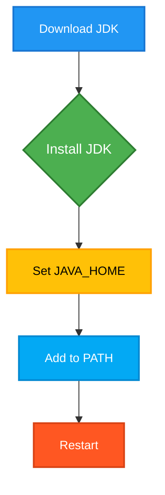

# <span style="color:#e67e22;">What we will learn in this post?</span>

<ul style='list-style-type: none; padding-left: 0;'>
<li><span style='color: #2980b9; font-size: 20px; font-weight: bold;'>👉</span> <span style='color: #2ecc71; font-size: 18px; font-weight: bold;'>Introduction to Java</span></li>
<li><span style='color: #2980b9; font-size: 20px; font-weight: bold;'>👉</span> <span style='color: #2ecc71; font-size: 18px; font-weight: bold;'>History of Java</span></li>
<li><span style='color: #2980b9; font-size: 20px; font-weight: bold;'>👉</span> <span style='color: #2ecc71; font-size: 18px; font-weight: bold;'>Java vs C++ vs Python</span></li>
<li><span style='color: #2980b9; font-size: 20px; font-weight: bold;'>👉</span> <span style='color: #2ecc71; font-size: 18px; font-weight: bold;'>How to Download and Install Java</span></li>
<li><span style='color: #2980b9; font-size: 20px; font-weight: bold;'>👉</span> <span style='color: #2ecc71; font-size: 18px; font-weight: bold;'>Setting Up the Environment in Java</span></li>
<li><span style='color: #2980b9; font-size: 20px; font-weight: bold;'>👉</span> <span style='color: #2ecc71; font-size: 18px; font-weight: bold;'>How to Download and Install Eclipse on Windows</span></li>
<li><span style='color: #2980b9; font-size: 20px; font-weight: bold;'>👉</span> <span style='color: #2ecc71; font-size: 18px; font-weight: bold;'>Java Development Kit (JDK) in Java</span></li>
<li><span style='color: #2980b9; font-size: 20px; font-weight: bold;'>👉</span> <span style='color: #2ecc71; font-size: 18px; font-weight: bold;'>JVM and its Architecture</span></li>
<li><span style='color: #2980b9; font-size: 20px; font-weight: bold;'>👉</span> <span style='color: #2ecc71; font-size: 18px; font-weight: bold;'>JDK vs JRE vs JVM</span></li>
<li><span style='color: #2980b9; font-size: 20px; font-weight: bold;'>👉</span> <span style='color: #2ecc71; font-size: 18px; font-weight: bold;'>Just In Time (JIT) Compiler</span></li>
<li><span style='color: #2980b9; font-size: 20px; font-weight: bold;'>👉</span> <span style='color: #2ecc71; font-size: 18px; font-weight: bold;'>JIT vs JVM</span></li>
<li><span style='color: #2980b9; font-size: 20px; font-weight: bold;'>👉</span> <span style='color: #2ecc71; font-size: 18px; font-weight: bold;'>Byte Code vs Machine Code</span></li>
<li><span style='color: #2980b9; font-size: 20px; font-weight: bold;'>👉</span> <span style='color: #2ecc71; font-size: 18px; font-weight: bold;'>Conclusion!</span></li>
</ul>

# <span style="color:#e67e22">Java: A Versatile Programming Language ☕</span>

Java is a powerful and popular programming language known for its _portability_
and _object-oriented_ nature. Think of it like a set of Lego bricks – you can
combine different pieces (code) to build many things.

## <span style="color:#2980b9">Key Features ✨</span>

- **Portability:** Java code runs on any device with a Java Virtual Machine
  (JVM), like your phone, computer, or server. It's like having a universal
  translator for your code. `Example:` Write once, run anywhere (WORA).

- **Object-Oriented Programming (OOP):** Java organizes code into "objects,"
  making it easier to manage complex projects. Think of objects as containers
  holding data (like a user's name and age) and actions (like logging in).

### <span style="color:#8e44ad">Object-Oriented Example</span>

```
class Dog {
  String name;
  void bark() { System.out.println("Woof!"); }
}
```

## <span style="color:#2980b9">Java in Action 🌎</span>

- **Web Applications:** Many websites use Java for backend processing (the
  "behind-the-scenes" work). _Example:_ Large e-commerce sites.
- **Mobile Applications:** Android apps are often built using Java (or Kotlin,
  which works well with Java).
- **Enterprise Applications:** Large-scale business systems often rely on Java's
  robustness and scalability.

Java's popularity stems from its reliability, vast community support, and wide
range of applications. It's a solid choice for beginners and experienced
programmers alike.

# <span style="color:#e67e22">Java's Journey: From J2SE to Java 21 🚀</span>

Java's story began in the mid-1990s. Initially called Oak, it evolved into Java
and quickly gained popularity. While "Java 2" (J2SE) marked a significant step,
true evolution began later.

## <span style="color:#2980b9">Major Milestones 🗓️</span>

- **Java 5 (2004):** Introduced _generics_ `<T>`, improving type safety and
  reducing code bloat.
- **Java 8 (2014):** A game-changer with _lambdas_ `(x) -> x + 1` and _streams_,
  enabling functional programming and simplifying parallel processing.
- **Java 11 (2018):** Marked a shift to a new release model with _Long-Term
  Support (LTS)_ versions, providing extended updates and stability.

## <span style="color:#2980b9">Recent Advancements 💡</span>

- **Java 17 (2021):** Another LTS release, building upon previous improvements
  and offering enhanced performance and security.
- **Java 21 (2023):** The latest release, featuring _Project Loom_, a
  groundbreaking project introducing _virtual threads_ for significantly
  improved concurrency and scalability. This makes it easier to write highly
  concurrent applications.

### <span style="color:#8e44ad">Project Loom's Impact</span>

Project Loom simplifies concurrent programming, reducing the complexity of
managing many threads. This leads to more efficient and responsive applications.

```mermaid
graph LR
    style A fill:#4CAF50,stroke:#2E7D32,stroke-width:2px,color:#FFFFFF,font-size:16px
    style B fill:#FFC107,stroke:#FFA000,stroke-width:2px,color:#000000,font-size:14px
    style C fill:#2196F3,stroke:#1976D2,stroke-width:2px,color:#FFFFFF,font-size:14px
    style D fill:#03A9F4,stroke:#0288D1,stroke-width:2px,color:#FFFFFF,font-size:14px

    A[📱 Application] --> B(📝 Many Tasks)
    B --> C{🔄 Virtual Threads?}
    C --> D[⚡ Improved Concurrency]

```



Java's evolution continues, constantly adapting to changing technological
demands. Its commitment to regular updates and focus on developer experience
ensures its continued relevance in the ever-evolving world of software
development.

# <span style="color:#e67e22">Java vs. C++ vs. Python</span> 💻

## <span style="color:#2980b9">Syntax Comparison</span> ✍️

# Java vs. C++ vs. Python 💻

## Syntax Comparison ✍️

| Language   | Syntax Complexity      | Example Code                                                                                           | Key Features ✨                                                                                 |
| ---------- | ---------------------- | ------------------------------------------------------------------------------------------------------ | ---------------------------------------------------------------------------------------------- |
| **Java**   | Verbose and Structured | `public class HelloWorld { public static void main(String[] args) { System.out.println("Hello!"); } }` | 🛠️ **Verbose syntax** for clarity. Requires explicit declaration of the class and main method.  |
| **C++**    | Flexible but Complex   | `#include <iostream> int main() { std::cout << "Hello!" << std::endl; return 0; }`                     | 🔧 **More control** over system resources. Requires manual handling of memory and file streams. |
| **Python** | Concise and Readable   | `print("Hello!")`                                                                                      | ✍️ **Concise and readable** syntax. Emphasizes ease of learning and writing.                    |

### Key Points

- **Java** 🛠️: Uses a more structured approach, requiring more code to achieve
  basic tasks. Its syntax is precise, making it easier for developers to
  maintain large systems.
- **C++** 🔧: Provides more control over hardware and memory, offering better
  performance, but at the cost of complexity. It's ideal for system-level
  programming.
- **Python** ✍️: Known for its simplicity and readability, Python allows
  developers to write code quickly and intuitively. Perfect for beginners and
  rapid development.

## <span style="color:#2980b9">Performance</span> 🚀

- **C++:** Generally the fastest due to its low-level control and ability to
  directly manage memory.
- **Java:** Compiles to bytecode, offering good performance with the Java
  Virtual Machine (JVM). Performance can vary based on JVM optimization.
- **Python:** Interpreted language; slower than Java and C++ but easier to use.

## <span style="color:#2980b9">Primary Use Cases</span> 🎯

- **Java:** Android development, enterprise applications, large-scale systems.
- **C++:** System-level programming, game development, high-performance
  computing.
- **Python:** Data science, machine learning, web development, scripting.

### <span style="color:#8e44ad">Summary Table</span> 📊

| Feature     | Java                | C++            | Python            |
| ----------- | ------------------- | -------------- | ----------------- |
| Syntax      | Verbose             | Complex        | Concise           |
| Performance | Good                | Fastest        | Slowest           |
| Use Cases   | Android, Enterprise | Systems, Games | Data Science, Web |

This simple comparison highlights the key differences. The best choice depends
on your project's specific needs.

# <span style="color:#e67e22">Java JDK Installation Guide ☕</span>

This guide helps you install Java JDK on Windows or Mac.

## <span style="color:#2980b9">Download Java JDK</span> ⬇️

1. Go to
   [https://www.oracle.com/java/technologies/javase-downloads.html](https://www.oracle.com/java/technologies/javase-downloads.html).
2. Accept the license agreement.
3. Download the correct installer for your operating system (Windows or macOS).

## <span style="color:#2980b9">Installation</span> ⚙️

1. **Windows:** Run the downloaded `.exe` file and follow the on-screen
   instructions. Choose a custom installation path if you want more control.
2. **macOS:** Open the downloaded `.dmg` file, drag the JDK installer into the
   `Applications` folder, and then run it.

### <span style="color:#8e44ad">Setting JAVA_HOME</span> 🏡

1. **Find the JDK installation path:** This is where you installed the JDK
   (e.g., `C:\Program Files\Java\jdk-17` on Windows,
   `/Library/Java/JavaVirtualMachines/jdk-17.jdk/Contents/Home` on macOS).
2. **Set JAVA_HOME:**
   - **Windows:** Search for "environment variables", edit the
     `System variables`, and add a new variable named `JAVA_HOME` with the JDK
     path as its value.
   - **macOS:** Open your `.zshrc` or `.bashrc` file in a text editor, add
     `export JAVA_HOME="/path/to/jdk/home"`, replacing `/path/to/jdk/home` with
     your actual JDK path, and save the file. Then run `source ~/.zshrc` or
     `source ~/.bashrc` in your terminal.

## <span style="color:#2980b9">Add to PATH</span> 🗺️

1. **Windows:** Edit the `System variables` `Path` and add `%JAVA_HOME%\bin` to
   the end.
2. **macOS:** Add `export PATH="$JAVA_HOME/bin:$PATH"` to your `.zshrc` or
   `.bashrc` file (same as step 2 above for JAVA_HOME).

_Restart your computer after completing the steps._



Now you have Java installed and ready to use! 🎉

# <span style="color:#e67e22">Setting up your Java Development Environment ☕</span>

## <span style="color:#2980b9">1. Download and Install the JDK ⬇️</span>

- Go to the official Oracle website or AdoptOpenJDK and download the JDK
  installer suitable for your operating system (Windows, macOS, or Linux).
- Run the installer and follow the on-screen instructions. Remember where you
  install it! (e.g., `C:\Program Files\Java\jdk-17` on Windows)

## <span style="color:#2980b9">2. Configure Environment Variables ⚙️</span>

### <span style="color:#8e44ad">Setting JAVA_HOME</span>

- **Windows:** Search for "environment variables," click "Edit the system
  environment variables," then "Environment Variables...". Create a new _System
  variable_ named `JAVA_HOME` and set its value to your JDK installation path
  (e.g., `C:\Program Files\Java\jdk-17`).

- **macOS/Linux:** Instructions vary depending on your shell (bash, zsh etc.).
  You'll typically edit a file like `.bashrc` or `.zshrc` and add
  `export JAVA_HOME=<your_jdk_path>`.

### <span style="color:#8e44ad">Setting PATH</span>

- Add the path to the `bin` directory within your JDK installation to the `PATH`
  environment variable. For example: `%JAVA_HOME%\bin` (Windows) or
  `$JAVA_HOME/bin` (macOS/Linux). This allows you to run `javac` and `java` from
  any directory.

## <span style="color:#2980b9">3. Verification 🎉</span>

Open your terminal or command prompt and type:

```bash
java -version
javac -version
```

If you see the Java version information, you've successfully set up your Java
development environment!

```mermaid
graph TD
    A[Download JDK 🖥️] --> B{Install JDK 🛠️};
    B --> C[Set JAVA_HOME ⚙️];
    C --> D[Set PATH 🌍];
    D --> E[Verify Installation ✅];
    E --> F[Success! 👍];

    style A fill:#2196F3,stroke:#1976D2,stroke-width:2px,color:#FFFFFF,font-size:14px
    style B fill:#4CAF50,stroke:#2E7D32,stroke-width:2px,color:#FFFFFF,font-size:16px
    style C fill:#FFC107,stroke:#FFA000,stroke-width:2px,color:#000000,font-size:14px
    style D fill:#03A9F4,stroke:#0288D1,stroke-width:2px,color:#FFFFFF,font-size:14px
    style E fill:#8BC34A,stroke:#558B2F,stroke-width:2px,color:#FFFFFF,font-size:14px
    style F fill:#FF5722,stroke:#D84315,stroke-width:2px,color:#FFFFFF,font-size:14px

```



# <span style="color:#e67e22">Eclipse IDE for Java on Windows ☕</span>

## <span style="color:#2980b9">Download & Installation ⬇️</span>

1. Download the Eclipse IDE for Java Developers from the official website.
   Choose the Windows 64-bit installer.
2. Run the installer. Choose a directory (e.g., `C:\eclipse`), and extract the
   contents.

## <span style="color:#2980b9">Setting up the JRE ⚙️</span>

- Eclipse usually detects your JRE automatically. If not, go to _Window_ ->
  _Preferences_ -> _Java_ -> _Installed JREs_.
- Click _Add_, select _Standard VM_, point to your JDK installation
  (`C:\Program Files\Java\jdk-version`), and click _Finish_.

## <span style="color:#2980b9">Creating a Java Project 🚀</span>

1. Click _File_ -> _New_ -> _Java Project_.
2. Name your project (e.g., `MyFirstProject`).
3. Click _Finish_.
4. Right-click on the project -> _New_ -> _Class_.
5. Name your class (e.g., `Main`). Check the box for
   `public static void main(String[] args)`.
6. Write your code (e.g., `System.out.println("Hello, World!");`).
7. Run your code by right-clicking and selecting _Run As_ -> _Java Application_.

```mermaid
graph TD
    A[Download Eclipse 🌐] --> B(Install Eclipse 🛠️);
    B --> C{JRE Detected? 🤔};
    C -- Yes --> D[Create Project 📂];
    C -- No --> E[Configure JRE ⚙️];
    E --> D;
    D --> F[Write & Run Code 💻];

    style A fill:#2196F3,stroke:#1976D2,stroke-width:2px,color:#FFFFFF,font-size:14px
    style B fill:#4CAF50,stroke:#2E7D32,stroke-width:2px,color:#FFFFFF,font-size:16px
    style C fill:#FFC107,stroke:#FFA000,stroke-width:2px,color:#000000,font-size:14px
    style D fill:#03A9F4,stroke:#0288D1,stroke-width:2px,color:#FFFFFF,font-size:14px
    style E fill:#8BC34A,stroke:#558B2F,stroke-width:2px,color:#FFFFFF,font-size:14px
    style F fill:#FF5722,stroke:#D84315,stroke-width:2px,color:#FFFFFF,font-size:14px

```



_Remember to replace placeholders like `jdk-version` with your actual JDK
version._

# <span style="color:#e67e22">Java Development Kit (JDK) Explained ☕</span>

The Java Development Kit (JDK) is everything you need to develop Java
applications. Think of it as your complete toolbox!

## <span style="color:#2980b9">Key Components 🛠️</span>

- **JRE (Java Runtime Environment):** This is the engine that runs your Java
  programs. It includes the Java Virtual Machine (JVM) and core libraries. Think
  of it as the car engine.

- **Compiler (javac):** This translates your human-readable Java code (`*.java`)
  into bytecode (`*.class`), which the JVM understands. Think of it as the
  translator.

- **Tools:** The JDK provides many tools, `javac` being the most important.
  Others help with debugging, documentation, and more.

## <span style="color:#2980b9">Compiling and Running a Java Program 🚀</span>

Let's create a simple program:

```java
public class HelloWorld {
    public static void main(String[] args) {
        System.out.println("Hello, World!");
    }
}
```

1. **Compile:** Open your terminal, navigate to the file location, and type
   `javac HelloWorld.java`. This creates `HelloWorld.class`.

2. **Run:** Type `java HelloWorld`. This runs the bytecode, printing "Hello,
   World!" to the console.

```mermaid
graph TD
    A[Java Code *.java* 📄] --> B{javac Compiler ⚙️};
    B --> C[Bytecode *.class* 💾];
    C --> D{JVM 🖥️};
    D --> E[Output 🖨️];

    style A fill:#4CAF50,stroke:#2E7D32,stroke-width:2px,color:#FFFFFF,font-size:16px
    style B fill:#FFC107,stroke:#FFA000,stroke-width:2px,color:#000000,font-size:14px
    style C fill:#2196F3,stroke:#1976D2,stroke-width:2px,color:#FFFFFF,font-size:14px
    style D fill:#03A9F4,stroke:#0288D1,stroke-width:2px,color:#FFFFFF,font-size:14px
    style E fill:#FF5722,stroke:#D84315,stroke-width:2px,color:#FFFFFF,font-size:14px

```

### <span style="color:#8e44ad">Simple Flowchart</span>



In short, the JDK is your essential toolkit for creating and running Java
applications, comprising the JRE, the compiler (`javac`), and other useful
tools. It's a crucial component for any Java developer.

# <span style="color:#e67e22">Java Virtual Machine (JVM): Platform Independence ☕</span>

The JVM is the engine that runs Java applications. Its key role is making Java
_platform-independent_ (write once, run anywhere). Instead of compiling directly
to machine code, Java compiles to _bytecode_, a platform-neutral intermediate
language.

## <span style="color:#2980b9">JVM Architecture ⚙️</span>

The JVM consists of several key components:

- **Class Loader:** Loads `.class` files (bytecode) into memory.
- **Bytecode Verifier:** Ensures bytecode safety.
- **Execution Engine:** Interprets or compiles bytecode to machine code
  (Just-In-Time compilation).
- **Garbage Collector:** Automatically manages memory, reclaiming unused
  objects.
- **Runtime Data Areas:** Stores data like method areas, heap, stack, etc.

```mermaid
graph LR
    A[Java Code 📄] --> B{Compilation ⚙️};
    B --> C[Bytecode *.class* 💾];
    C --> D[Class Loader 🛠️];
    D --> E[Bytecode Verifier 🔍];
    E --> F[Execution Engine 🚀];
    F --> G[Machine Code/Interpretation 💻];
    G --> H[Output 🖨️];

    style A fill:#4CAF50,stroke:#2E7D32,stroke-width:2px,color:#FFFFFF,font-size:16px
    style B fill:#FFC107,stroke:#FFA000,stroke-width:2px,color:#000000,font-size:14px
    style C fill:#2196F3,stroke:#1976D2,stroke-width:2px,color:#FFFFFF,font-size:14px
    style D fill:#03A9F4,stroke:#0288D1,stroke-width:2px,color:#FFFFFF,font-size:14px
    style E fill:#8BC34A,stroke:#558B2F,stroke-width:2px,color:#FFFFFF,font-size:14px
    style F fill:#9C27B0,stroke:#7B1FA2,stroke-width:2px,color:#FFFFFF,font-size:16px
    style G fill:#FF5722,stroke:#D84315,stroke-width:2px,color:#FFFFFF,font-size:14px
    style H fill:#00BCD4,stroke:#0097A7,stroke-width:2px,color:#FFFFFF,font-size:14px

```

### <span style="color:#8e44ad">Bytecode Execution Flowchart</span>



## <span style="color:#2980b9">Simple Example 💻</span>

```java
public class HelloWorld {
    public static void main(String[] args) {
        System.out.println("Hello, World!");
    }
}
```

This Java code is compiled to `HelloWorld.class` (bytecode). The JVM loads this
bytecode, verifies it, and then executes it, printing "Hello, World!" on the
console, regardless of the underlying operating system. This demonstrates Java's
portability thanks to the JVM.

# <span style="color:#e67e22">Understanding JDK, JRE, and JVM ☕</span>

Java development and execution rely on three key components: the Java
Development Kit (JDK), the Java Runtime Environment (JRE), and the Java Virtual
Machine (JVM). Think of them as nested building blocks.

## <span style="color:#2980b9">The Java Virtual Machine (JVM) ⚙️</span>

### <span style="color:#8e44ad">The Engine</span>

The JVM is the _core_ engine. It's the _runtime environment_ that executes Java
bytecode (`.class` files). Imagine it as a translator, converting the bytecode
into instructions your computer's processor can understand. Without the JVM, you
can't run Java programs.

## <span style="color:#2980b9">The Java Runtime Environment (JRE) 📦</span>

### <span style="color:#8e44ad">The Package</span>

The JRE includes the JVM plus libraries (pre-written code) needed for your Java
programs to run. It's like a toolbox with all the essential tools. If you _only_
need to _run_ a Java program, you just need the JRE.

## <span style="color:#2980b9">The Java Development Kit (JDK) 🛠️</span>

### <span style="color:#8e44ad">The Complete Kit</span>

The JDK is the _complete package_ for Java _development_. It contains the JRE
_plus_ tools like the Java compiler (`javac`), debugger (`jdb`), and other
utilities needed to _create_ Java programs. Think of it as the complete
workshop, including the toolbox (JRE) and all the construction tools.

**In short:** JDK contains JRE, which contains JVM. You need the JDK to _write_
Java code, and the JRE (or JDK) to _run_ it.

```mermaid
graph LR
    JDK[Java Development Kit 🛠️] --> JRE[Java Runtime Environment 🌐];
    JRE --> JVM[Java Virtual Machine 🖥️];

    subgraph "Development 🧑‍💻"
        JDK
    end
    subgraph "Execution 🚀"
        JRE
        JVM
    end

    style JDK fill:#4CAF50,stroke:#2E7D32,stroke-width:2px,color:#FFFFFF,font-size:16px
    style JRE fill:#FFC107,stroke:#FFA000,stroke-width:2px,color:#000000,font-size:14px
    style JVM fill:#2196F3,stroke:#1976D2,stroke-width:2px,color:#FFFFFF,font-size:14px

```



# <span style="color:#e67e22">Java's Just-In-Time (JIT) Compiler 🚀</span>

## <span style="color:#2980b9">Understanding JIT Compilation</span>

Java programs are initially compiled into _bytecode_, an intermediate language.
The Java Virtual Machine (JVM) then uses the JIT compiler to translate this
bytecode into native machine code _during_ program execution. This is unlike
traditional compilers which translate the entire source code before execution.

### <span style="color:#8e44ad">How JIT Improves Performance</span>

- **Optimized Machine Code:** JIT compilers analyze the running program's
  behavior and optimize the generated machine code for specific hardware and
  conditions. This leads to significant speed improvements.
- **Adaptive Optimization:** JIT continuously monitors the code's execution path
  and refines the generated machine code over time. Frequently executed code
  segments are optimized more aggressively.

## <span style="color:#2980b9">A Simple Example 💡</span>

Consider a loop that calculates the sum of numbers:

```java
long sum = 0;
for (int i = 0; i < 1000000; i++) {
    sum += i;
}
```

Initially, the JVM executes this loop using interpreted bytecode. As the loop
runs repeatedly, the JIT compiler recognizes the pattern and optimizes the
machine code for this specific loop, resulting in faster execution on subsequent
iterations. The improvement becomes noticeable for computationally intensive
tasks.

```mermaid
graph TD
    A[Java Source Code 📝] --> B[Bytecode Compilation 🛠️];
    B --> C{JVM Execution ⚙️};
    C -- First Run ⏳ --> D[Interpreted Bytecode *Slow* 🐢];
    C -- Subsequent Runs 🚀 --> E[JIT Compilation *Native Code* ⚡];
    E --> F[Optimized Execution *Fast* 🚀];

    style A fill:#4CAF50,stroke:#2E7D32,stroke-width:2px,color:#FFFFFF,font-size:16px
    style B fill:#FFC107,stroke:#FFA000,stroke-width:2px,color:#000000,font-size:14px
    style C fill:#2196F3,stroke:#1976D2,stroke-width:2px,color:#FFFFFF,font-size:14px
    style D fill:#FF5722,stroke:#D84315,stroke-width:2px,color:#FFFFFF,font-size:14px
    style E fill:#00BCD4,stroke:#0097A7,stroke-width:2px,color:#FFFFFF,font-size:14px
    style F fill:#8BC34A,stroke:#558B2F,stroke-width:2px,color:#FFFFFF,font-size:14px

```

## <span style="color:#2980b9">Visual Representation 📊</span>



The diagram shows that the first runs use interpreted bytecode, whereas
subsequent runs use optimized native code thanks to JIT compilation. This
results in a significant performance boost over time.

# <span style="color:#e67e22">Java Runtime: JVM & JIT ☕</span>

## <span style="color:#2980b9">The Java Virtual Machine (JVM) ⚙️</span>

The JVM is the _runtime environment_ for Java programs. It's
_platform-independent_, meaning the same bytecode runs on different operating
systems. The JVM loads `.class` files (bytecode) and manages memory, security,
and execution.

```mermaid
graph TD
    A[Load .class file 📂] --> B{Verify Bytecode 🔍};
    B -- Valid ✅ --> C[Interpret/JIT Compile ⚡];
    B -- Invalid ❌ --> D[Error 🚨];
    C --> E[Execute ▶️];

    style A fill:#4CAF50,stroke:#2E7D32,stroke-width:2px,color:#FFFFFF,font-size:16px
    style B fill:#FFC107,stroke:#FFA000,stroke-width:2px,color:#000000,font-size:14px
    style C fill:#2196F3,stroke:#1976D2,stroke-width:2px,color:#FFFFFF,font-size:14px
    style D fill:#FF5722,stroke:#D84315,stroke-width:2px,color:#FFFFFF,font-size:14px
    style E fill:#8BC34A,stroke:#558B2F,stroke-width:2px,color:#FFFFFF,font-size:14px

```

### <span style="color:#8e44ad">Bytecode Execution Flow</span>



## <span style="color:#2980b9">Just-In-Time (JIT) Compilation 🚀</span>

JIT is a _component_ of the JVM that _improves performance_. Instead of
interpreting bytecode line by line (slow), JIT _compiles_ frequently executed
bytecode sections into native machine code _at runtime_. This leads to
significant speed boosts.

### <span style="color:#8e44ad">Example</span>

```java
public class Example {
    public static void main(String[] args) {
        int sum = 0;
        for (int i = 0; i < 100000; i++) {
            sum += i;
        }
        System.out.println(sum);
    }
}
```

This simple loop would benefit greatly from JIT compilation as it's executed
repeatedly. The JVM initially interprets it, then JIT compiles it for faster
execution during subsequent iterations.

- **JVM:** Loads and manages bytecode.
- **JIT:** Optimizes bytecode to native code for faster execution. Both work
  together for efficient Java program execution.

# <span style="color:#e67e22">Bytecode vs. Machine Code ☕</span>

## <span style="color:#2980b9">Understanding the Difference</span>

Imagine you're writing a recipe (your program). _Machine code_ is like writing
the recipe directly in the language of a specific oven (computer). Each oven
understands a different language, so the recipe needs to be rewritten for every
oven. _Bytecode_, however, is like writing the recipe in a standard,
intermediate language. A translator (the JVM) then converts it into the language
of the specific oven.

### <span style="color:#8e44ad">Java and Cross-Platform Support</span>

Java uses bytecode to achieve _cross-platform compatibility_. When you compile a
Java program, it doesn't create machine code directly. Instead, it generates
_bytecode_ (`.class` files). This bytecode is platform-independent.

**Example:**

1. You write a Java program (`HelloWorld.java`).
2. The Java compiler compiles it into bytecode (`HelloWorld.class`).
3. The Java Virtual Machine (JVM), specific to your operating system (Windows,
   macOS, Linux), reads and interprets this bytecode, translating it into the
   native machine code of your computer.

```mermaid
graph LR
    A[Java Code *.java* 📄] --> B(Java Compiler 🛠️);
    B --> C[Bytecode *.class* 💻];
    C --> D{JVM *Windows* 🪟};
    C --> E{JVM *macOS* 🍏};
    C --> F{JVM *Linux* 🐧};
    D --> G[Machine Code *Windows* 💾];
    E --> H[Machine Code *macOS* 💻];
    F --> I[Machine Code *Linux* ⚙️];

    style A fill:#4CAF50,stroke:#2E7D32,stroke-width:2px,color:#FFFFFF,font-size:16px
    style B fill:#FFC107,stroke:#FFA000,stroke-width:2px,color:#000000,font-size:14px
    style C fill:#2196F3,stroke:#1976D2,stroke-width:2px,color:#FFFFFF,font-size:14px
    style D fill:#03A9F4,stroke:#0288D1,stroke-width:2px,color:#FFFFFF,font-size:14px
    style E fill:#8BC34A,stroke:#558B2F,stroke-width:2px,color:#FFFFFF,font-size:14px
    style F fill:#9C27B0,stroke:#7B1FA2,stroke-width:2px,color:#FFFFFF,font-size:14px
    style G fill:#FF5722,stroke:#D84315,stroke-width:2px,color:#FFFFFF,font-size:14px
    style H fill:#00BCD4,stroke:#0097A7,stroke-width:2px,color:#FFFFFF,font-size:14px
    style I fill:#FF9800,stroke:#F57C00,stroke-width:2px,color:#000000,font-size:14px

```



- **Bytecode:** Platform-independent intermediate code.
- **Machine Code:** Platform-specific instructions directly understood by the
  CPU.

This allows the same Java bytecode to run on any machine with a compatible JVM,
making Java truly "write once, run anywhere". 🎉

<h1><span style='color:#e67e22'>Conclusion</span></h1>

And there you have it! We've covered a lot of ground today, and hopefully, you
found this information helpful and interesting 😊. We're always striving to
improve, so we'd love to hear your thoughts! What did you think of this post?
Any questions, feedback, or suggestions? Let us know in the comments below 👇.
We can't wait to hear from you! 🎉
