# <span style="color:#e67e22;">What we will learn in this post?</span>

<ul style='list-style-type: none; padding-left: 0;'>
<li><span style='color: #2980b9; font-size: 20px; font-weight: bold;'>👉</span> <span style='color: #2ecc71; font-size: 18px; font-weight: bold;'>How to Take Input from Users in Java</span></li>
<li><span style='color: #2980b9; font-size: 20px; font-weight: bold;'>👉</span> <span style='color: #2ecc71; font-size: 18px; font-weight: bold;'>Scanner Class in Java</span></li>
<li><span style='color: #2980b9; font-size: 20px; font-weight: bold;'>👉</span> <span style='color: #2ecc71; font-size: 18px; font-weight: bold;'>BufferedReader Class in Java</span></li>
<li><span style='color: #2980b9; font-size: 20px; font-weight: bold;'>👉</span> <span style='color: #2ecc71; font-size: 18px; font-weight: bold;'>Scanner vs BufferedReader in Java</span></li>
<li><span style='color: #2980b9; font-size: 20px; font-weight: bold;'>👉</span> <span style='color: #2ecc71; font-size: 18px; font-weight: bold;'>Ways to Read Input from Console in Java</span></li>
<li><span style='color: #2980b9; font-size: 20px; font-weight: bold;'>👉</span> <span style='color: #2ecc71; font-size: 18px; font-weight: bold;'>Print Output in Java</span></li>
<li><span style='color: #2980b9; font-size: 20px; font-weight: bold;'>👉</span> <span style='color: #2ecc71; font-size: 18px; font-weight: bold;'>print() vs println() in Java</span></li>
<li><span style='color: #2980b9; font-size: 20px; font-weight: bold;'>👉</span> <span style='color: #2ecc71; font-size: 18px; font-weight: bold;'>Formatted Outputs in Java</span></li>
<li><span style='color: #2980b9; font-size: 20px; font-weight: bold;'>👉</span> <span style='color: #2ecc71; font-size: 18px; font-weight: bold;'>Conclusion!</span></li>
</ul>

# <span style="color:#e67e22">User Input in Java: Mastering Scanner & BufferedReader</span> 🎉

This guide demonstrates how to efficiently handle user input in Java using `Scanner` and `BufferedReader`. Learning to effectively `read input in Java console` is crucial for interactive program development.

## <span style="color:#2980b9">Using the Scanner Class</span> 📖

The `Scanner` class provides a straightforward way to obtain various input types.

### <span style="color:#8e44ad">Reading Integers and Strings</span>

```java
import java.util.Scanner;

public class ScannerExample {
    public static void main(String[] args) {
        Scanner input = new Scanner(System.in);
        System.out.print("Enter an integer: ");
        int num = input.nextInt();
        System.out.print("Enter a string: ");
        String str = input.next(); // Reads only until the first space
        System.out.println("You entered: " + num + " and " + str);
        input.close(); // Important: Close the Scanner
    }
}
```

_Expected Output:_ If you input `10` and `Hello World`, the output will be: `You entered: 10 and Hello`. Note that `next()` only reads up to the first space. To read the entire line, use `nextLine()`.

## <span style="color:#2980b9">Leveraging the BufferedReader Class</span> 💨

`BufferedReader` offers faster input, especially for large datasets.

### <span style="color:#8e44ad">Reading a Line of Text</span>

```java
import java.io.BufferedReader;
import java.io.IOException;
import java.io.InputStreamReader;

public class BufferedReaderExample {
    public static void main(String[] args) throws IOException {
        BufferedReader reader = new BufferedReader(new InputStreamReader(System.in));
        System.out.print("Enter a line of text: ");
        String line = reader.readLine();
        System.out.println("You entered: " + line);
    }
}
```

_Expected Output:_ If you enter "This is a line", the output will be: `You entered: This is a line`.

## <span style="color:#2980b9">Choosing the Right Approach</span> 🤔

- **`Scanner`:** Simpler for basic input, good for interactive applications.
- **`BufferedReader`:** More efficient for large inputs, preferred for performance-critical tasks.

Remember to always close your input streams (`input.close()` for `Scanner`) to release resources. Choosing between `Scanner` and `BufferedReader` depends on your specific needs. Mastering both enhances your Java programming skills significantly!

# <span style="color:#e67e22">Java Scanner Tutorial: Input Handling with Scanner</span> 📖

This tutorial introduces the Java `Scanner` class, a powerful tool for reading various data types from user input or files. It simplifies input handling in your Java programs.

## <span style="color:#2980b9">What is the Scanner Class?</span> 💻

The `Scanner` class, found in the `java.util` package, is used to obtain input from various sources, most commonly the console (keyboard). It allows you to read different data types such as integers, floating-point numbers, and strings easily.

### <span style="color:#8e44ad">Importing the Scanner Class</span>

Before using the `Scanner` class, you need to import it:

```java
import java.util.Scanner;
```

## <span style="color:#2980b9">Reading Different Data Types</span> 🔢

Here's how to read different data types using the `Scanner`:

```java
import java.util.Scanner;

public class ScannerExample {
    public static void main(String[] args) {
        Scanner scanner = new Scanner(System.in);

        System.out.print("Enter an integer: ");
        int integerValue = scanner.nextInt(); //Reads an integer
        System.out.println("You entered: " + integerValue); // Output: You entered: [user input integer]

        System.out.print("Enter a floating-point number: ");
        float floatValue = scanner.nextFloat(); //Reads a float
        System.out.println("You entered: " + floatValue); // Output: You entered: [user input float]

        scanner.nextLine(); // Consume newline character left by nextFloat()

        System.out.print("Enter a String: ");
        String stringValue = scanner.nextLine(); //Reads a String
        System.out.println("You entered: " + stringValue); // Output: You entered: [user input String]

        scanner.close();
    }
}
```

_Note:_ `scanner.nextLine()` after `nextFloat()` is crucial to consume the newline character left in the buffer by `nextFloat()`, preventing issues with subsequent `nextLine()` calls.

```mermaid
graph LR
    A[💡 Start] --> B{🛠️ Create Scanner Object};
    B --> C{🔤 Prompt User for Input};
    C --> D{📥 Read Input using Scanner methods *nextInt*, *nextFloat*, *nextLine*};
    D --> E{⚙️ Process Input};
    E --> F[🏁 End];

    style A fill:#4CAF50,stroke:#2E7D32,stroke-width:2px,color:#FFFFFF,font-size:16px,shadow:1
    style B fill:#FFC107,stroke:#FFA000,stroke-width:2px,color:#000000,font-size:14px,shadow:1
    style C fill:#2196F3,stroke:#1976D2,stroke-width:2px,color:#FFFFFF,font-size:14px,shadow:1
    style D fill:#03A9F4,stroke:#0288D1,stroke-width:2px,color:#FFFFFF,font-size:14px,shadow:1
    style E fill:#8BC34A,stroke:#558B2F,stroke-width:2px,color:#FFFFFF,font-size:14px,shadow:1
    style F fill:#9C27B0,stroke:#7B1FA2,stroke-width:2px,color:#FFFFFF,font-size:16px,shadow:1

```

## <span style="color:#2980b9">Flowchart for Scanner Input</span> 📊



This simple flowchart illustrates the basic steps involved in using the `Scanner` class for input handling. Remember to always close the `Scanner` using `scanner.close()` when finished to release resources. This is best practice for efficient memory management in Java.

This _Java Scanner tutorial_ provides a foundational understanding of _input handling with Scanner_. Remember to practice and experiment to become more comfortable with this essential Java tool! 👍

# <span style="color:#e67e22">Java BufferedReader: Reading Console Input</span> 📖

This explains the `BufferedReader` class in Java, a powerful tool for efficient text input, particularly from the console. This is crucial for many Java applications needing user interaction. Search terms like 'Java BufferedReader example' and 'console input in Java' will often lead you here.

## <span style="color:#2980b9">Understanding BufferedReader</span> 💡

The `BufferedReader` class improves the performance of reading text from a character-input stream. It reads data in larger chunks (buffers) instead of character by character, making it significantly faster than using `Scanner` for large inputs.

### <span style="color:#8e44ad">Syntax and Usage</span> 💻

```java
BufferedReader reader = new BufferedReader(new InputStreamReader(System.in));
String inputLine = reader.readLine();
```

This code creates a `BufferedReader` linked to the standard input stream (`System.in`). `readLine()` reads a line of text from the console. Remember to handle potential `IOExceptions`.

## <span style="color:#2980b9">Example: Reading User Input</span> ⌨️

Here's a simple example demonstrating console input using `BufferedReader` in Java.

```java
import java.io.*;

public class BufferedReaderExample {
    public static void main(String[] args) throws IOException {
        BufferedReader reader = new BufferedReader(new InputStreamReader(System.in));
        System.out.print("Enter your name: ");
        String name = reader.readLine();
        System.out.println("Hello, " + name + "!"); //Expected Output: Hello, [User's Name]!
        reader.close();
    }
}
```

- **Import:** The `java.io.*` package is imported for I/O operations.
- **BufferedReader Creation:** A `BufferedReader` is created, connected to `System.in`.
- **User Prompt:** The program prompts the user to enter their name.
- **readLine():** The `readLine()` method reads the user's input from the console.
- **Output:** The program greets the user using the entered name.

## <span style="color:#2980b9">Error Handling</span> ⚠️

Always use a `try-catch` block to handle potential `IOExceptions` when working with `BufferedReader`:

```java
try {
    // Your BufferedReader code here
} catch (IOException e) {
    System.err.println("An error occurred: " + e.getMessage());
}
```

This ensures robust error handling in your Java applications dealing with console input. Remember to close the `BufferedReader` using `reader.close()` to release system resources. Using `BufferedReader` offers a cleaner, more efficient approach to 'console input in Java' compared to other methods.

# <span style="color:#e67e22">Scanner vs BufferedReader in Java: Choosing the Best Input Method</span> 📖

This guide compares Java's `Scanner` and `BufferedReader` classes, helping you decide which is best for your needs. The question, "**best input method in Java**," often depends on the specific application.

## <span style="color:#2980b9">Scanner: Ease of Use vs. Performance</span> 💨

### <span style="color:#8e44ad">Advantages</span>

- Simple to use: Great for beginners; handles various data types directly.
- Flexible parsing: Easily reads integers, strings, etc., without manual type conversion.

### <span style="color:#8e44ad">Limitations</span>

- Performance overhead: Significantly slower than `BufferedReader` for large inputs.
- Resource intensive: Less efficient memory management.

### <span style="color:#8e44ad">Code Example</span>

```java
import java.util.Scanner;

public class ScannerExample {
    public static void main(String[] args) {
        Scanner scanner = new Scanner(System.in);
        System.out.print("Enter an integer: ");
        int num = scanner.nextInt();
        System.out.println("You entered: " + num); // Output: You entered: [user input]
        scanner.close();
    }
}
```

## <span style="color:#2980b9">BufferedReader: Speed and Efficiency</span> 🚀

### <span style="color:#8e44ad">Advantages</span>

- High performance: Significantly faster for large files or inputs.
- Efficient memory usage: Reads data in chunks, minimizing memory consumption.

### <span style="color:#8e44ad">Limitations</span>

- More complex usage: Requires manual parsing and type conversion.
- Steeper learning curve for beginners.

### <span style="color:#8e44ad">Code Example</span>

```java
import java.io.BufferedReader;
import java.io.IOException;
import java.io.InputStreamReader;

public class BufferedReaderExample {
    public static void main(String[] args) throws IOException {
        BufferedReader reader = new BufferedReader(new InputStreamReader(System.in));
        System.out.print("Enter a line of text: ");
        String line = reader.readLine();
        System.out.println("You entered: " + line); // Output: You entered: [user input]
    }
}
```

## <span style="color:#2980b9">When to Use Which? A Quick Guide</span> 💡

- **Scanner:** Ideal for small inputs, interactive programs, or situations where ease of use is prioritized over performance. Good for beginners learning `Scanner vs BufferedReader Java`.
- **BufferedReader:** The better choice for processing large files, dealing with significant input data streams, or when performance is critical.

This comparison provides a solid foundation for understanding the nuances of `Scanner vs BufferedReader Java`. Choosing the _best input method in Java_ hinges on your project's specific requirements. Remember to close your `Scanner` to release resources!

# <span style="color:#e67e22">Console Input in Java: A Tutorial 📖</span>

This tutorial demonstrates different ways to read console input in Java. This is a crucial skill for any Java programmer! We'll cover `System.in`, `Scanner`, and `BufferedReader`.

## <span style="color:#2980b9">Method 1: Using System.in ➡️</span>

This method uses the `System.in` stream, which is a basic input stream. It requires more manual handling.

### <span style="color:#8e44ad">Example:</span>

```java
import java.io.IOException;
import java.io.InputStream;

public class SystemInExample {
    public static void main(String[] args) throws IOException {
        InputStream inputStream = System.in;
        int value;
        while ((value = inputStream.read()) != -1) {
            System.out.print((char) value); // Prints character by character
        }
        //Expected Output: Whatever the user types in the console.
    }
}
```

## <span style="color:#2980b9">Method 2: Using Scanner 🔍</span>

The `Scanner` class provides a user-friendly way to read various data types.

### <span style="color:#8e44ad">Example:</span>

```java
import java.util.Scanner;

public class ScannerExample {
    public static void main(String[] args) {
        Scanner scanner = new Scanner(System.in);
        System.out.print("Enter your name: ");
        String name = scanner.nextLine();
        System.out.println("Hello, " + name + "!");
        scanner.close();
        //Expected Output:  Enter your name: [User Input]  Hello, [User Input]!
    }
}
```

## <span style="color:#2980b9">Method 3: Using BufferedReader 📚</span>

`BufferedReader` offers efficient reading, especially for large inputs. It's often used with `InputStreamReader` to wrap `System.in`.

### <span style="color:#8e44ad">Example:</span>

```java
import java.io.BufferedReader;
import java.io.IOException;
import java.io.InputStreamReader;

public class BufferedReaderExample {
    public static void main(String[] args) throws IOException {
        BufferedReader reader = new BufferedReader(new InputStreamReader(System.in));
        System.out.print("Enter a line of text: ");
        String line = reader.readLine();
        System.out.println("You entered: " + line);
        //Expected Output: Enter a line of text: [User Input] You entered: [User Input]
    }
}
```

**Choosing the right method:**

- For simple input, `Scanner` is ideal.
- For large inputs or performance-critical applications, `BufferedReader` is preferred.
- `System.in` offers low-level control but requires more code.

This _console input Java tutorial_ provides a solid foundation for handling user input effectively. Remember to always handle potential `IOExceptions` when working with input streams! 👍

# <span style="color:#e67e22">Java Console Output ✨</span>

This guide explains how to print to the Java console using `System.out.print` and `System.out.println`. Learning _how to print in Java_ is fundamental!

## <span style="color:#2980b9">Using `System.out.print()`</span>

`System.out.print()` displays text to the console _without_ moving to the next line.

### <span style="color:#8e44ad">Example:</span>

```java
public class Main {
  public static void main(String[] args) {
    System.out.print("Hello"); // Output: Hello
    System.out.print(" World!"); // Output: Hello World! (on the same line)
  }
}
```

## <span style="color:#2980b9">Using `System.out.println()`</span>

`System.out.println()` displays text to the console _and_ moves the cursor to the next line afterwards. This is often preferred for cleaner output.

### <span style="color:#8e44ad">Example:</span>

```java
public class Main {
  public static void main(String[] args) {
    System.out.println("Hello"); // Output: Hello (on a new line)
    System.out.println("World!"); // Output: World! (on a new line)
  }
}
```

## <span style="color:#2980b9">Key Differences Summarized 📝</span>

- `System.out.print()` : Continues printing on the same line.
- `System.out.println()`: Prints on a new line each time.

## <span style="color:#2980b9">Printing Variables 🧮</span>

You can easily print the value of variables using string concatenation:

```java
int age = 30;
System.out.println("My age is: " + age); // Output: My age is: 30
```

Remember these simple methods are the foundation of any Java program's interaction with the user. Mastering them is crucial for any Java developer! 👍

# <span style="color:#e67e22">Print vs println in Java: A Clear Comparison 🖨️</span>

This clarifies the difference between the `print()` and `println()` methods in Java, crucial elements of any Java programmer's toolkit. We'll explore their behavior with examples and make understanding easy.

## <span style="color:#2980b9">Understanding Java's Print Methods</span>

Java offers two primary methods for displaying output to the console: `System.out.print()` and `System.out.println()`. The key distinction lies in how they handle newline characters.

### <span style="color:#8e44ad">`System.out.print()`</span>

_This method simply displays the provided text to the console without adding a newline character at the end._ Subsequent calls to `print()` will continue printing on the same line.

```java
System.out.print("Hello"); //Output: Hello
System.out.print(" World!");//Output: Hello World!
```

### <span style="color:#8e44ad">`System.out.println()`</span>

_This method displays the text and \_then_ adds a newline character (`\n`).\_ Each call to `println()` starts output on a new line.

```java
System.out.println("Hello"); //Output: Hello
System.out.println("World!");//Output: World!
```

## <span style="color:#2980b9">Illustrative Examples</span>

Here's a table summarizing the key differences:

| Method      | Newline Character? | Output Behavior                       |
| ----------- | ------------------ | ------------------------------------- |
| `print()`   | No                 | Continues on the same line            |
| `println()` | Yes                | Moves to the next line after printing |

**In essence:** Use `println()` for neatly formatted, multi-line output, and use `print()` when you need to keep multiple outputs on a single line, perhaps building a dynamic progress bar or a single-line status update.

<br>
Remember to include `import java.io.*;` (though not strictly necessary for basic `System.out` usage) for complete code compilation.  Happy coding! 🎉

# <span style="color:#e67e22">Formatted Output in Java: A Comprehensive Guide</span> ✨

This provides a simple explanation of how to achieve formatted output in Java, a crucial skill for any Java programmer. We'll explore the `printf` and `format` methods, offering a clear `Java printf tutorial`.

## <span style="color:#2980b9">Using `printf` for Formatted Output</span> 💻

The `printf` method, a part of Java's `System.out` object, offers a powerful and flexible way to format your output. It uses format specifiers to control the appearance of your data.

### <span style="color:#8e44ad">Example using `printf`</span>

```java
public class PrintfExample {
    public static void main(String[] args) {
        int age = 30;
        String name = "Alice";
        double gpa = 3.8;

        System.out.printf("Name: %s, Age: %d, GPA: %.2f%n", name, age, gpa); // Output: Name: Alice, Age: 30, GPA: 3.80
    }
}
```

- `%s` represents a string.
- `%d` represents an integer.
- `%.2f` represents a floating-point number with 2 decimal places.
- `%n` adds a newline character.

## <span style="color:#2980b9">Employing the `format` Method</span> 📝

The `String.format` method provides a similar functionality, returning a formatted string instead of directly printing it.

### <span style="color:#8e44ad">Example using `format`</span>

```java
public class FormatExample {
    public static void main(String[] args) {
        int num = 12345;
        String formattedNum = String.format("%08d", num); // Output: 00012345

        System.out.println(formattedNum);
    }
}
```

- `%08d` formats the integer to be an 8-digit number, padded with leading zeros.

## <span style="color:#2980b9">Key Differences and When to Use Each</span> 🤔

Both methods achieve similar results, but `printf` directly prints to the console, while `format` returns a formatted string that you can further manipulate or store. Choose `printf` for direct console output and `format` for more complex string manipulation.

This _Java printf tutorial_ helps you master formatted output in Java, improving the readability and presentation of your applications. Remember to consult the Java documentation for a complete list of format specifiers to unlock the full potential of these powerful methods for creating elegant and informative output.

<h1><span style='color:#e67e22'>Conclusion</span></h1>

So there you have it! We've covered a lot of ground today, and hopefully, you found it helpful and interesting. 😊 We're always striving to improve, and your thoughts are super valuable to us! What did you think? What could we have done better? Do you have any burning questions or brilliant ideas? Let us know in the comments below! 👇 We'd love to hear from you! 🥳
