# <span style="color:#e67e22;">What we will learn in this post?</span>

<ul style='list-style-type: none; padding-left: 0;'>
<li><span style='color: #2980b9; font-size: 20px; font-weight: bold;'>👉</span> <span style='color: #2ecc71; font-size: 18px; font-weight: bold;'>C Arrays</span></li>
<li><span style='color: #2980b9; font-size: 20px; font-weight: bold;'>👉</span> <span style='color: #2ecc71; font-size: 18px; font-weight: bold;'>Properties of Array in C</span></li>
<li><span style='color: #2980b9; font-size: 20px; font-weight: bold;'>👉</span> <span style='color: #2ecc71; font-size: 18px; font-weight: bold;'>Multidimensional Arrays in C</span></li>
<li><span style='color: #2980b9; font-size: 20px; font-weight: bold;'>👉</span> <span style='color: #2ecc71; font-size: 18px; font-weight: bold;'>Initialization of Multidimensional Arrays in C</span></li>
<li><span style='color: #2980b9; font-size: 20px; font-weight: bold;'>👉</span> <span style='color: #2ecc71; font-size: 18px; font-weight: bold;'>Pass Array to Functions in C</span></li>
<li><span style='color: #2980b9; font-size: 20px; font-weight: bold;'>👉</span> <span style='color: #2ecc71; font-size: 18px; font-weight: bold;'>Pass a 2D Array as a Parameter in C</span></li>
<li><span style='color: #2980b9; font-size: 20px; font-weight: bold;'>👉</span> <span style='color: #2ecc71; font-size: 18px; font-weight: bold;'>Data Types for Which Array is Not Possible</span></li>
<li><span style='color: #2980b9; font-size: 20px; font-weight: bold;'>👉</span> <span style='color: #2ecc71; font-size: 18px; font-weight: bold;'>Pass an Array by Value in C</span></li>
<li><span style='color: #2980b9; font-size: 20px; font-weight: bold;'>👉</span> <span style='color: #2ecc71; font-size: 18px; font-weight: bold;'>Strings in C</span></li>
<li><span style='color: #2980b9; font-size: 20px; font-weight: bold;'>👉</span> <span style='color: #2ecc71; font-size: 18px; font-weight: bold;'>An Array of Strings in C</span></li>
<li><span style='color: #2980b9; font-size: 20px; font-weight: bold;'>👉</span> <span style='color: #2ecc71; font-size: 18px; font-weight: bold;'>Difference Between Single Quoted and Double Quoted Initialization</span></li>
<li><span style='color: #2980b9; font-size: 20px; font-weight: bold;'>👉</span> <span style='color: #2ecc71; font-size: 18px; font-weight: bold;'>String Functions in C</span></li>
<li><span style='color: #2980b9; font-size: 20px; font-weight: bold;'>👉</span> <span style='color: #2ecc71; font-size: 18px; font-weight: bold;'>Conclusion!</span></li>
</ul>

# <span style="color:#e67e22">Arrays in C: Storing Multiple Values 🗄️</span>

## <span style="color:#2980b9">What are Arrays? 🤔</span>

Imagine you need to store a list of your friend's ages. You could use individual variables like `age1`, `age2`, `age3`, and so on. But what if you have 100 friends? That's where arrays come in handy!

An array in C is a _contiguous_ block of memory that holds multiple values of the _same data type_. Think of it like a numbered box with compartments, each holding one item of the same kind. You access each element using its _index_ (position), which starts at 0.

### <span style="color:#8e44ad">Why Use Arrays? 🚀</span>

- **Efficiency:** Arrays provide a more efficient way to store and access multiple values compared to using individual variables.
- **Organization:** They keep related data together, making your code more organized and readable.
- **Iteration:** Arrays are ideal for using loops to process large amounts of data.

## <span style="color:#2980b9">Array Declaration and Initialization ✍️</span>

### <span style="color:#8e44ad">Declaration Syntax</span>

To declare an array, you specify the data type, the array name, and the number of elements (size) within square brackets `[]`.

```c
data_type array_name[array_size];
```

For example, to declare an array to hold 5 integers:

```c
int ages[5];  // Declares an integer array named 'ages' with 5 elements.
```

### <span style="color:#8e44ad">Initialization</span>

You can initialize an array during declaration:

```c
int ages[5] = {25, 30, 22, 28, 35}; // Initializes the array with values.
```

You can also initialize only some elements and the rest will be filled with 0:

```c
int scores[10] = {85, 92, 78}; // scores[0] = 85, scores[1] = 92, scores[2] = 78, scores[3] to scores[9] will be 0
```

## <span style="color:#2980b9">Accessing Array Elements 🔍</span>

You access individual elements using their index (position) within square brackets:

```c
int firstAge = ages[0]; // Accesses the first element (index 0)
int thirdAge = ages[2]; // Accesses the third element (index 2)
```

Remember that indices start at 0, so `ages[0]` is the first element, `ages[1]` is the second, and so on. Trying to access an element outside the array bounds (e.g., `ages[5]` in our example) will lead to unpredictable behavior (undefined behavior).

## <span style="color:#2980b9">Example: Calculating the Average Age 🧮</span>

```c
#include <stdio.h>

int main() {
  int ages[5] = {25, 30, 22, 28, 35};
  int sum = 0;
  float average;

  for (int i = 0; i < 5; i++) {
    sum += ages[i];
  }

  average = (float)sum / 5; // Type casting to avoid integer division

  printf("The average age is: %.2f\n", average);
  return 0;
}
```

This code calculates the average age from the `ages` array using a `for` loop.

```mermaid
graph LR
    style A fill:#FFCDD2,stroke:#D32F2F,stroke-width:2px,color:#B71C1C,font-size:16px,background:#FFFFFF80
    style B fill:#C8E6C9,stroke:#388E3C,stroke-width:2px,color:#1B5E20,font-size:14px,background:#FFFFFF80
    style C fill:#BBDEFB,stroke:#1976D2,stroke-width:2px,color:#0D47A1,font-size:14px,background:#FFFFFF80
    style D fill:#FFF9C4,stroke:#FBC02D,stroke-width:2px,color:#F57F17,font-size:14px,background:#FFFFFF80
    style E fill:#D1C4E9,stroke:#7B1FA2,stroke-width:2px,color:#4A148C,font-size:14px,background:#FFFFFF80

    A["ages[0]" = 25 🎉] --> B;
    B["ages[1]" = 30 🎂] --> C;
    C["ages[2]" = 22 👶] --> D;
    D["ages[3]" = 28 📈] --> E;
    E["ages[4]" = 35 👴];
```

## <span style="color:#2980b9">Visual Representation 📊</span>



This diagram shows how the `ages` array stores its elements in contiguous memory locations.

Remember to always be mindful of array bounds to avoid errors. Arrays are a fundamental data structure in C, so mastering them is crucial for efficient programming. Happy coding! 🎉

# <span style="color:#e67e22">Arrays in C: A Deep Dive 🧮</span>

Arrays are fundamental data structures in C, providing a way to store and manage collections of elements of the same data type. Let's explore their key properties:

## <span style="color:#2980b9">Fixed Size 🤔</span>

One of the defining characteristics of C arrays is their _fixed size_. This means that once you declare an array, its size cannot be changed during the program's execution. The size is determined at compile time.

### <span style="color:#8e44ad">Example:</span>

```c
int numbers[5]; // Declares an array named 'numbers' that can hold 5 integers.
```

This code creates an array capable of storing five integers. You _cannot_ later resize `numbers` to hold, say, 10 integers. Attempting to do so will result in a program crash or unexpected behavior.

## <span style="color:#2980b9">Index-Based Access ➡️</span>

C arrays use _zero-based indexing_ to access individual elements. This means the first element is at index 0, the second at index 1, and so on.

### <span style="color:#8e44ad">Example:</span>

```c
int numbers[5] = {10, 20, 30, 40, 50};

printf("The first element is: %d\n", numbers[0]); // Output: 10
printf("The third element is: %d\n", numbers[2]); // Output: 30
```

Here, `numbers[0]` accesses the first element (10), and `numbers[2]` accesses the third element (30). Trying to access an element outside the array's bounds (e.g., `numbers[5]`) leads to _undefined behavior_, often a program crash.

## <span style="color:#2980b9">Memory Allocation 📦</span>

Arrays are stored contiguously in memory. This means that the elements of the array are placed one after another in a sequential block of memory locations. This contiguous storage allows for efficient access to elements using their index.

```mermaid
graph LR
    style A fill:#E3F2FD,stroke:#1E88E5,stroke-width:2px,color:#0D47A1,font-size:16px,background:#FFFFFF80
    style B fill:#FFEBEE,stroke:#E53935,stroke-width:2px,color:#B71C1C,font-size:14px,background:#FFFFFF80
    style C fill:#F3E5F5,stroke:#8E24AA,stroke-width:2px,color:#4A148C,font-size:14px,background:#FFFFFF80
    style D fill:#FFF3E0,stroke:#FB8C00,stroke-width:2px,color:#E65100,font-size:14px,background:#FFFFFF80
    style E fill:#E8F5E9,stroke:#43A047,stroke-width:2px,color:#1B5E20,font-size:14px,background:#FFFFFF80

    A["numbers[0] (10) 🎯"] --> B["numbers[1] (20) 🔢"];
    B --> C["numbers[2] (30) 🎉"];
    C --> D["numbers[3] (40) 📈"];
    D --> E["numbers[4] (50) 🏁"];
```

### <span style="color:#8e44ad">Memory Layout Diagram:</span>



This diagram illustrates how the `numbers` array from the previous example is stored in memory. Each element occupies a contiguous memory location.

## <span style="color:#2980b9">Advantages & Disadvantages 👍👎</span>

**Advantages:**

- _Efficient access_: Direct access to elements using indices is very fast (constant time complexity O(1)).
- _Simple to use_: Arrays are relatively easy to understand and implement.
- _Memory efficiency_: Elements are stored contiguously, minimizing memory overhead.

**Disadvantages:**

- _Fixed size_: The size is determined at compile time and cannot be changed dynamically.
- _Potential for out-of-bounds errors_: Accessing elements outside the valid index range can lead to program crashes.
- _Memory wastage_: If you don't know the exact size beforehand, you might allocate more memory than needed, leading to wastage.

## <span style="color:#2980b9">Beyond Basic Arrays ✨</span>

While standard arrays have limitations, C offers other options for dynamic memory allocation, like `malloc` and `calloc`, allowing you to create arrays whose size is determined during runtime. These provide more flexibility but require careful memory management to avoid memory leaks.

This comprehensive overview should give you a solid understanding of C arrays and their properties. Remember to always be mindful of the fixed size and potential for out-of-bounds errors when working with arrays in C!

# <span style="color:#e67e22">Multidimensional Arrays in C 🧮</span>

Multidimensional arrays in C are like spreadsheets or tables within your program's memory. They allow you to store data in a grid-like structure, enabling efficient organization and access to collections of related data. Think of them as arrays _within_ arrays!

## <span style="color:#2980b9">Understanding the Structure 🗄️</span>

Imagine a 2D array (a common type) as a table with rows and columns. Each element within the array is accessed using its row and column index. You can extend this concept to 3D arrays (think of a cube), 4D arrays, and even higher dimensions, but it becomes progressively more challenging to visualize.

### <span style="color:#8e44ad">Declaration and Initialization</span>

A multidimensional array is declared similarly to a one-dimensional array, but with multiple sizes specified within the square brackets:

```c
// Declaring a 2D array (3 rows, 4 columns) of integers
int matrix[3][4];

// Declaring a 3D array (2 layers, 3 rows, 4 columns) of floats
float cube[2][3][4];
```

**Initialization:**

You can initialize multidimensional arrays during declaration:

```c
int matrix[3][4] = {
    {1, 2, 3, 4},
    {5, 6, 7, 8},
    {9, 10, 11, 12}
};

float cube[2][3][4] = {
    {
        {1.1, 1.2, 1.3, 1.4},
        {1.5, 1.6, 1.7, 1.8},
        {1.9, 2.0, 2.1, 2.2}
    },
    {
        {2.3, 2.4, 2.5, 2.6},
        {2.7, 2.8, 2.9, 3.0},
        {3.1, 3.2, 3.3, 3.4}
    }
};

```

_Note:_ If you don't initialize all elements, the remaining elements will be automatically initialized to 0 for numeric types.

## <span style="color:#2980b9">Accessing Elements 🔍</span>

Accessing elements in a multidimensional array uses multiple indices:

```c
// Accessing the element at row 1, column 2 of 'matrix' (remember, indexing starts at 0!)
int value = matrix[1][2]; // value will be 7

// Accessing the element at layer 0, row 1, column 3 of 'cube'
float cubeValue = cube[0][1][3]; // cubeValue will be 1.8
```

## <span style="color:#2980b9">Example: A Simple Matrix Addition ➕</span>

Let's add two 2x2 matrices:

```c
#include <stdio.h>

int main() {
    int matrix1[2][2] = \{\{1, 2\}, \{3, 4\}\}; //Ignore black slashes here
    int matrix2[2][2] = \{\{5, 6\}, \{7, 8\}\}; //Ignore black slashes here
    int result[2][2];

    // Add the matrices
    for (int i = 0; i < 2; i++) {
        for (int j = 0; j < 2; j++) {
            result[i][j] = matrix1[i][j] + matrix2[i][j];
        }
    }

    // Print the result
    printf("Resultant Matrix:\n");
    for (int i = 0; i < 2; i++) {
        for (int j = 0; j < 2; j++) {
            printf("%d ", result[i][j]);
        }
        printf("\n");
    }

    return 0;
}
```

This code will output:

```
Resultant Matrix:
6 8
10 12
```

## <span style="color:#2980b9">Memory Layout 🧠</span>

Multidimensional arrays are stored contiguously in memory. For example, a 2D array is stored row by row. Understanding this is crucial for efficient memory management and pointer arithmetic.

```mermaid
graph LR
    style A fill:#FFCDD2,stroke:#D32F2F,stroke-width:2px,color:#B71C1C,font-size:16px,background:#FFFFFF80
    style B fill:#C8E6C9,stroke:#388E3C,stroke-width:2px,color:#1B5E20,font-size:14px,background:#FFFFFF80
    style C fill:#BBDEFB,stroke:#1976D2,stroke-width:2px,color:#0D47A1,font-size:14px,background:#FFFFFF80
    style D fill:#FFF9C4,stroke:#FBC02D,stroke-width:2px,color:#F57F17,font-size:14px,background:#FFFFFF80
    style E fill:#D1C4E9,stroke:#7B1FA2,stroke-width:2px,color:#4A148C,font-size:14px,background:#FFFFFF80
    style F fill:#FFECB3,stroke:#FFA000,stroke-width:2px,color:#FF6F00,font-size:14px,background:#FFFFFF80

    A["matrix[0][0] 🔢"] --> B["matrix[0][1] 🎯"];
    B --> C["matrix[0][2] 🚀"];
    C --> D["matrix[1][0] 🌟"];
    D --> E["matrix[1][1] 🔗"];
    E --> F["matrix[1][2] 🏁"];

```



## <span style="color:#2980b9">Advantages and Disadvantages ⚖️</span>

**Advantages:**

- Efficient storage and access for structured data.
- Easy to understand and use for tabular data.

**Disadvantages:**

- Can be less flexible than dynamic data structures (like linked lists) for some applications.
- Requires knowing the dimensions at compile time (unless using dynamic memory allocation).

This comprehensive guide provides a solid foundation for working with multidimensional arrays in C. Remember to practice and experiment to fully grasp their capabilities! Happy coding! 🎉

# <span style="color:#e67e22">Initializing Multidimensional Arrays in C 💡</span>

Multidimensional arrays in C can seem intimidating at first, but initializing them is manageable once you grasp the fundamental techniques. This guide will walk you through various methods with clear examples and visual aids.

## <span style="color:#2980b9">Method 1: Complete Initialization 🔢</span>

This method involves explicitly specifying each element's value within curly braces `{}`. It's straightforward but can become tedious for larger arrays.

### <span style="color:#8e44ad">Example: 2D Array</span>

```c
int matrix[3][4] = {
    {1, 2, 3, 4},
    {5, 6, 7, 8},
    {9, 10, 11, 12}
};
```

This initializes a 3x4 integer array. Notice the nested curly braces – each inner set represents a row.

### <span style="color:#8e44ad">Example: 3D Array</span>

```c
int cube[2][3][2] = {
    {
        {1, 2},
        {3, 4},
        {5, 6}
    },
    {
        {7, 8},
        {9, 10},
        {11, 12}
    }
};
```

This shows a 2x3x2 array. The nesting continues to represent the dimensions. Remember, it's _essential_ to maintain the correct structure to avoid errors!

## <span style="color:#2980b9">Method 2: Partial Initialization ✍️</span>

You can initialize only some elements, leaving the rest to default values (usually 0 for integers).

### <span style="color:#8e44ad">Example</span>

```c
int arr[3][3] = {
    {1, 2},  // Row 0 initialized partially
    {4},     // Row 1 initialized partially
    {7, 8, 9} // Row 2 completely initialized
};
```

The uninitialized elements in `arr` will be set to 0. This is convenient for smaller initializations but requires understanding how C handles defaults.

## <span style="color:#2980b9">Method 3: Using Designated Initializers 🚀</span>

This advanced technique lets you specify elements by their indices, making initialization more flexible. It's particularly useful when initializing sparse arrays (many elements are 0).

### <span style="color:#8e44ad">Example</span>

```c
int arr[3][3] = {
    [0][0] = 1,
    [1][1] = 5,
    [2][2] = 9
};
```

This initializes only the diagonal elements of the 3x3 array to 1, 5, and 9, respectively. The other elements will be 0.

## <span style="color:#2980b9">Important Considerations ⚠️</span>

- **Array Size:** The compiler needs to know the array's dimensions. You can specify it directly like `int arr[3][4];` or let the compiler infer it during complete initialization.
- **Memory Allocation:** Remember that multidimensional arrays allocate contiguous blocks of memory.
- **Row-Major Ordering:** C uses _row-major_ ordering – elements are stored row by row in memory.

## <span style="color:#2980b9">Visualizing Memory Allocation 🗺️</span>


This diagram illustrates how a 3x4 array is stored sequentially in memory.

By understanding these methods and considerations, you can confidently initialize multidimensional arrays in your C programs, enhancing their readability and maintainability. Remember to choose the method best suited to your needs and array size. Happy coding! 😊

# <span style="color:#e67e22">Passing Arrays to Functions in C 🎉</span>

In C, passing arrays to functions is a bit different than passing other data types. You don't actually copy the entire array into the function; instead, you pass a _pointer_ to the beginning of the array. This means changes made to the array _inside_ the function will be reflected outside the function as well. Let's explore this with some examples!

## <span style="color:#2980b9">Understanding Array Pointers 📌</span>

When you declare an array like this: `int myArray[5];`, the name `myArray` acts as a _constant pointer_ to the first element of the array. This is crucial for understanding how array passing works.

### <span style="color:#8e44ad">Key Concept: Pointer</span>

A pointer is a variable that holds the memory address of another variable. When you pass an array to a function, you're essentially passing the memory address where the array begins.

```mermaid
graph LR
    style A fill:#4CAF50,stroke:#388E3C,stroke-width:2px,color:#FFFFFF,font-size:16px,background:#FFFFFF80
    style B fill:#FFC107,stroke:#FFA000,stroke-width:2px,color:#000000,font-size:14px,background:#FFFFFF80
    style C fill:#2196F3,stroke:#1565C0,stroke-width:2px,color:#FFFFFF,font-size:14px,background:#FFFFFF80
    style D fill:#FF5722,stroke:#D84315,stroke-width:2px,color:#FFFFFF,font-size:14px,background:#FFFFFF80


    A["📂 myArray"] --> B["📍 Memory Address"];
    B --> C{"📋 Array Elements"};
    subgraph Function Call
        B --> D["📨 Function Parameter"];
    end

```



## <span style="color:#2980b9">Syntax and Examples 💻</span>

Let's see how to pass arrays to functions. We'll use examples to illustrate how this works.

### <span style="color:#8e44ad">Example 1: Calculating the Sum</span>

This function calculates the sum of elements in an integer array:

```c
#include <stdio.h>

int calculateSum(int arr[], int size) { //Note: arr[] is equivalent to *arr - we're passing a pointer
  int sum = 0;
  for (int i = 0; i < size; i++) {
    sum += arr[i];
  }
  return sum;
}

int main() {
  int numbers[] = {1, 2, 3, 4, 5};
  int size = sizeof(numbers) / sizeof(numbers[0]); // Calculating array size
  int total = calculateSum(numbers, size);
  printf("Sum of array elements: %d\n", total);
  return 0;
}
```

- Notice that we pass the array `numbers` and its `size` to the `calculateSum` function.
- Inside the function, `arr` acts like an array, even though it's technically a pointer.

### <span style="color:#8e44ad">Example 2: Modifying Array Elements</span>

This function doubles the value of each element in an array:

```c
#include <stdio.h>

void doubleElements(int arr[], int size) {
  for (int i = 0; i < size; i++) {
    arr[i] *= 2;
  }
}

int main() {
  int numbers[] = {1, 2, 3, 4, 5};
  int size = sizeof(numbers) / sizeof(numbers[0]);
  doubleElements(numbers, size);
  printf("Doubled array elements: ");
  for (int i = 0; i < size; i++) {
    printf("%d ", numbers[i]);
  }
  printf("\n");
  return 0;
}
```

- The changes made to `arr` inside `doubleElements` are directly reflected in the `numbers` array in `main`. This is because we're working with the same memory location.

## <span style="color:#2980b9">Important Considerations 🤔</span>

- **Array Size:** You _must_ pass the size of the array to the function separately, as the function doesn't automatically know the size of the array it receives. `sizeof(arr)` inside the function would only give you the size of the pointer, _not_ the size of the original array.
- **Memory Management:** You don't need to worry about allocating memory for the array inside the function. The memory is already allocated when you declare the array in the `main` function.

This detailed explanation and the provided examples should give you a clear understanding of how to pass arrays to functions effectively in C. Remember that you are passing a pointer, and any modifications within the function will affect the original array. Happy coding! 🚀

# <span style="color:#e67e22">Passing 2D Arrays to C Functions 🎉</span>

In C, you can't directly pass a 2D array like you might in other languages. Instead, you need to understand how C handles arrays in memory and adapt your function parameters accordingly. This guide will walk you through the process, making it easy to grasp!

## <span style="color:#2980b9">Understanding Array Decay ⬇️</span>

### <span style="color:#8e44ad">The Core Concept</span>

When you pass an array to a function in C, it _decays_ into a pointer to its first element. This means the function receives the memory address of the first element, not the entire array itself. This is crucial for understanding how to pass 2D arrays.

### <span style="color:#8e44ad">Visualizing Decay</span>

Imagine a 2D array as a table:

```mermaid
graph LR
    style A fill:#4CAF50,stroke:#388E3C,stroke-width:2px,color:#FFFFFF,font-size:16px,background:#FFFFFF80
    style B fill:#FFC107,stroke:#FFA000,stroke-width:2px,color:#000000,font-size:14px,background:#FFFFFF80
    style C fill:#2196F3,stroke:#1565C0,stroke-width:2px,color:#FFFFFF,font-size:14px,background:#FFFFFF80
    style D fill:#FF5722,stroke:#D84315,stroke-width:2px,color:#FFFFFF,font-size:14px,background:#FFFFFF80
    style G fill:#03A9F4,stroke:#0288D1,stroke-width:2px,color:#FFFFFF,font-size:14px,background:#FFFFFF80
    style H fill:#8BC34A,stroke:#558B2F,stroke-width:2px,color:#FFFFFF,font-size:14px,background:#FFFFFF80
    style I fill:#FFC107,stroke:#FFA000,stroke-width:2px,color:#000000,font-size:14px,background:#FFFFFF80
    style J fill:#9C27B0,stroke:#7B1FA2,stroke-width:2px,color:#FFFFFF,font-size:14px,background:#FFFFFF80

    A["📂 Array"] --> B["🔗 Pointer to first row"];
    B --> C{"📝 Row 1"};
    C --> D{"📍 Element 1,1"};
    C --> E{"📍 Element 1,2"};
    C --> F{"📍 Element 1,3"};
    B --> G{"📝 Row 2"};
    G --> H{"📍 Element 2,1"};
    G --> I{"📍 Element 2,2"};
    G --> J{"📍 Element 2,3"};


```



When you pass the array, you're essentially passing the address of `B`, the pointer to the first row.

## <span style="color:#2980b9">Methods for Passing 2D Arrays 🚀</span>

We'll explore two primary approaches:

### <span style="color:#8e44ad">Method 1: Passing Row Pointer and Size</span>

This method is more flexible and generally preferred. You pass a pointer to the first element of the array (which is a pointer to the first row) along with the number of rows and columns.

- **Syntax:**

```c
void myFunction(int *arr, int rows, int cols) {
  // Access elements using pointer arithmetic:
  for (int i = 0; i < rows; i++) {
    for (int j = 0; j < cols; j++) {
      printf("Element [%d][%d]: %d\n", i, j, *(arr + i * cols + j));
    }
  }
}

int main() {
  int myArray[3][4] = \{\{1, 2, 3, 4\}, \{5, 6, 7, 8\}, \{9, 10, 11, 12\}\}; //Ignore black slashes here
  myFunction(&myArray[0][0], 3, 4); // Pass the address of the first element, rows, and cols
  return 0;
}
```

- **Explanation:** `&myArray[0][0]` gives the address of the first element. `*(arr + i * cols + j)` cleverly uses pointer arithmetic to access the element at row `i` and column `j`.

### <span style="color:#8e44ad">Method 2: Passing an Array of Pointers (Less Common)</span>

This approach declares the function parameter as an array of pointers to integers. Each pointer points to a row of the 2D array.

- **Syntax:**

```c
void myFunction(int (*arr)[4], int rows) { // Note the important parentheses!
  for (int i = 0; i < rows; i++) {
    for (int j = 0; j < 4; j++) {
      printf("Element [%d][%d]: %d\n", i, j, arr[i][j]);
    }
  }
}

int main() {
  int myArray[3][4] = \{\{1, 2, 3, 4\}, \{5, 6, 7, 8\}, \{9, 10, 11, 12\}\}; //Ignore black slashes here
  myFunction(myArray, 3); // Pass the array directly (no ampersand needed)
  return 0;
}

```

- **Explanation:** `int (*arr)[4]` declares `arr` as a pointer to an array of 4 integers. This is important because it tells the compiler the size of each row, enabling proper access.

## <span style="color:#2980b9">Choosing the Right Method 🤔</span>

- **Method 1 (Pointer to the first element):** More flexible; works even if the number of columns varies.
- **Method 2 (Array of pointers):** Simpler syntax if the number of columns is constant; requires knowing the column size at compile time.

For most cases, **Method 1** is recommended for its flexibility and clarity.

## <span style="color:#2980b9">Key Takeaways 💡</span>

- Remember array decay! You're passing a pointer, not the entire array.
- Clearly specify the dimensions (rows and columns) to avoid out-of-bounds errors.
- Choose the method that best suits your needs and coding style.

This detailed guide, enriched with visuals and clear explanations, should empower you to confidently pass 2D arrays to your C functions! Happy coding! 🎉

# <span style="color:#e67e22">Data Types You Can't Put in a C Array 🚫</span>

In C, arrays are fundamental data structures, but you can't just throw any data type into them. Some types are simply incompatible. Let's explore these limitations.

## <span style="color:#2980b9">Functions isFunction🤔</span>

You can't directly create an array of functions. This is because a function's name, when not followed by parentheses `()`, decays into a pointer to its address in memory. While you can have an array of _pointers_ to functions, the function itself isn't something you can directly store in an array.

### <span style="color:#8e44ad">Example and Explanation</span>

```c
// This is INVALID:  You cannot create an array of functions directly.
// int myArray[3] = {myFunction, anotherFunction, yetAnotherFunction};

// This is VALID: Array of function pointers
int (*funcPtrArray[3])(int); // An array of 3 pointers to functions that take an int and return an int

int myFunction(int x) { return x * 2; }
int anotherFunction(int x) { return x + 5; }

int main() {
  funcPtrArray[0] = myFunction;
  funcPtrArray[1] = anotherFunction;
  // ... Initialize other elements ...
  return 0;
}

```

The key is to use pointers to functions. `funcPtrArray` is an array of three pointers, each capable of holding the address of a function with the specified signature.

## <span style="color:#2980b9">Incomplete Types 🚧</span>

An incomplete type is a type whose size is unknown at the time of its declaration. You can't create an array of an incomplete type because the compiler needs to know the size of each element to allocate the correct amount of memory for the array.

### <span style="color:#8e44ad">Examples of Incomplete Types</span>

- **Structures/Unions declared without members:** Declaring a `struct` or `union` without defining its members results in an incomplete type.

- **Forward declarations without definitions:** Declaring a `struct` or other type without providing its definition makes it incomplete.

- **Pointers to incomplete types:** If a pointer points to an incomplete type, the size is unknown.

### <span style="color:#8e44ad">Illustrative Example</span>

```c
// Incomplete type: struct myStruct is declared but not defined
struct myStruct; // Incomplete type

// This is INVALID:  Size of myStruct is unknown.
// struct myStruct myArray[10];

//Complete the struct definition:
struct myStruct {
    int a;
    float b;
};

//Now this is valid
struct myStruct myArray[10];


```

## <span style="color:#2980b9">Arrays of Void 🙅</span>

You cannot create an array of `void`. `void` represents the absence of type, meaning it has no size, preventing array creation.

## <span style="color:#2980b9">Summary of Restrictions 📝</span>

- **No direct function arrays:** Use pointers to functions instead.
- **No arrays of incomplete types:** Define the type completely before creating arrays.
- **No `void` arrays:** `void` lacks a defined size.

Remember, understanding these limitations is crucial for writing correct and efficient C code. Always ensure your data types are fully defined and suitable before attempting to create arrays.

```mermaid
graph TD
    style A fill:#4CAF50,stroke:#388E3C,stroke-width:2px,color:#FFFFFF,font-size:16px,background:#FFFFFF80
    style B fill:#FFC107,stroke:#FFA000,stroke-width:2px,color:#000000,font-size:14px,background:#FFFFFF80
    style C fill:#2196F3,stroke:#1565C0,stroke-width:2px,color:#FFFFFF,font-size:14px,background:#FFFFFF80
    style D fill:#FF5722,stroke:#D84315,stroke-width:2px,color:#FFFFFF,font-size:14px,background:#FFFFFF80
    style E fill:#8BC34A,stroke:#558B2F,stroke-width:2px,color:#FFFFFF,font-size:14px,background:#FFFFFF80
    style F fill:#03A9F4,stroke:#0288D1,stroke-width:2px,color:#FFFFFF,font-size:14px,background:#FFFFFF80
    style G fill:#FF9800,stroke:#F57C00,stroke-width:2px,color:#000000,font-size:14px,background:#FFFFFF80
    style H fill:#9C27B0,stroke:#7B1FA2,stroke-width:2px,color:#FFFFFF,font-size:14px,background:#FFFFFF80

    A["📊 Data Type"] --> B{"✅ Complete?"};
    B -- Yes --> C["📐 Array Creation Possible"];
    B -- No --> D["❌ Error: Incomplete Type"];
    A --> E{"🔄 Function?"};
    E -- Yes --> F["🧩 Use Function Pointers"];
    A --> G{"🚫 Void?"};
    G -- Yes --> H["❌ Error: Void Type"];


```



# <span style="color:#e67e22">Passing Arrays by Value in C 🤔</span>

In C, when you pass an array to a function, you're _not_ passing the entire array's content as a single value. Instead, you're passing a _copy_ of the array's **memory address**. This is subtly different from passing by value for other data types like `int` or `float`. Let's break it down.

## <span style="color:#2980b9">Understanding the Mechanics ⚙️</span>

### <span style="color:#8e44ad">Memory Addresses</span>

Think of an array as a block of consecutive memory locations. Each element in the array occupies one of these locations. When you declare an array like `int myArray[5];`, the compiler allocates space for five integers and assigns it a starting memory address. When you pass `myArray` to a function, you're essentially passing this starting address.

### <span style="color:#8e44ad">Passing the Address, Not the Data</span>

The function receives a _pointer_ to the beginning of the array. A pointer is a variable that holds a memory address. This means the function can access and modify the original array's elements directly, because it has the address to find them. This is often mistakenly referred to as "pass by reference," although technically it's "passing a pointer by value." The value being passed is the memory address, not the entire array's contents.

## <span style="color:#2980b9">Implications ✨</span>

- **Changes within the function affect the original array:** Any modifications made to the array elements _inside_ the function will be reflected in the original array outside the function. This is because the function is working directly with the original memory locations.
- **Array size is not explicitly passed:** The function typically needs to know the size of the array (usually passed as a separate argument) to prevent accessing memory outside the array's bounds, which can lead to errors or crashes.
- **Efficiency:** Passing the address is generally more efficient than copying the entire array's content, especially for large arrays.

## <span style="color:#2980b9">Illustrative Examples 💡</span>

Let's compare passing an `int` by value and passing an array:

```c
#include <stdio.h>

void modifyInt(int x) {
  x = 100; // Changes only the local copy
}

void modifyArray(int arr[], int size) { //Note: arr[] decays to a pointer to the first element
  for (int i = 0; i < size; i++) {
    arr[i] *= 2; // Modifies the original array
  }
}

int main() {
  int num = 5;
  int myArray[5] = {1, 2, 3, 4, 5};

  modifyInt(num);
  printf("num after modifyInt: %d\n", num); // Output: 5 (original value unchanged)

  modifyArray(myArray, 5);
  printf("myArray after modifyArray: ");
  for (int i = 0; i < 5; i++) {
    printf("%d ", myArray[i]); // Output: 2 4 6 8 10 (original array modified)
  }
  printf("\n");

  return 0;
}
```

## <span style="color:#2980b9">Visual Representation 📊</span>



```mermaid
graph LR
    style A fill:#4CAF50,stroke:#388E3C,stroke-width:2px,color:#FFFFFF,font-size:16px,background:#FFFFFF80
    style B fill:#FFC107,stroke:#FFA000,stroke-width:2px,color:#000000,font-size:14px,background:#FFFFFF80
    style C fill:#2196F3,stroke:#1565C0,stroke-width:2px,color:#FFFFFF,font-size:14px,background:#FFFFFF80
    style D fill:#FF5722,stroke:#D84315,stroke-width:2px,color:#FFFFFF,font-size:14px,background:#FFFFFF80
    style E fill:#8BC34A,stroke:#558B2F,stroke-width:2px,color:#FFFFFF,font-size:14px,background:#FFFFFF80
    style F fill:#03A9F4,stroke:#0288D1,stroke-width:2px,color:#FFFFFF,font-size:14px,background:#FFFFFF80
    style G fill:#FF9800,stroke:#F57C00,stroke-width:2px,color:#000000,font-size:14px,background:#FFFFFF80

    A["🔲 main() function"] --> B["🧮 myArray: [1, 2, 3, 4, 5]"];
    A --> C["🔢 num: 5"];
    B --> D{"🔄 modifyArray()"};
    C --> E{"✏️ modifyInt()"};
    D --> F["🧮 myArray: [2, 4, 6, 8, 10]"];
    E --> G["🔢 num: 5"];

```

This diagram shows how `modifyArray` directly changes `myArray`, while `modifyInt` only works with a copy of `num`.

## <span style="color:#2980b9">Conclusion 🎉</span>

Understanding how arrays are passed in C is crucial for writing correct and efficient code. Remember, you're passing a pointer (memory address) by value, which allows functions to directly modify the original array's contents. Always be mindful of the array's size to avoid out-of-bounds errors. Using appropriate size checks ensures your program's stability and prevents unexpected behavior.

# <span style="color:#e67e22">Strings in C: A Character Array Adventure 🧵</span>

In C, strings aren't a built-in data type like integers or floats. Instead, they're cleverly represented as **arrays of characters**. This means a string is essentially a sequence of individual characters stored consecutively in memory. Let's explore this exciting concept!

## <span style="color:#2980b9">Understanding Character Arrays 📚</span>

A character array is simply an array where each element holds a single character. We declare these arrays using the `char` keyword:

```c
char myString[10]; // Declares an array that can hold up to 10 characters.
```

This creates space to store 10 characters. But how does C know where the string ends? 🤔 That's where our special friend comes in...

### <span style="color:#8e44ad">The Null Terminator: The Unsung Hero 🏅</span>

The null terminator, represented by `\0` (a single null character), marks the end of a string. It's crucial because it tells C where the string ends. Without it, C wouldn't know when to stop reading characters, potentially leading to errors or crashes.

**Example:**

Let's say we want to store "Hello" in our array:

```c
char myString[6] = {'H', 'e', 'l', 'l', 'o', '\0'}; // Note the null terminator!
```

This array looks like this in memory:

```
+---+---+---+---+---+---+
| H | e | l | l | o | \0|
+---+---+---+---+---+---+
```

The `\0` signals the end. Notice we need 6 elements (5 for "Hello" + 1 for `\0`). If you don't include the `\0`, you're dealing with a character array, _not_ a C string.

## <span style="color:#2980b9">String Initialization 🎉</span>

There are convenient ways to initialize strings:

- **Using string literals:** This is the most common method.

```c
char myString[] = "Hello"; // The compiler automatically adds the null terminator!
```

- **Explicitly including the null terminator:** We've already seen this.

- **Character-by-character:** More manual, but gives fine-grained control.

## <span style="color:#2980b9">Important Considerations 🤔</span>

- **Array Size:** Always make sure your array is large enough to hold your string _plus_ the null terminator. Otherwise, you'll risk overwriting memory!

- **String Manipulation:** C provides functions in `<string.h>` (like `strcpy`, `strcat`, `strlen`) for working with strings safely. Using these functions is generally recommended over manual character-by-character manipulation.

- **Memory Management:** You're responsible for allocating and freeing memory for strings (especially when using dynamic memory allocation).

## <span style="color:#2980b9">Illustrative Example ✨</span>

Let's build a simple program to demonstrate:

```c
#include <stdio.h>
#include <string.h>

int main() {
  char myString[20] = "Hello, world!";
  printf("String: %s\n", myString); //Prints the string.  %s is the format specifier for strings.
  printf("Length: %zu\n", strlen(myString)); //Prints the length (excluding the null terminator)
  return 0;
}

```

This shows how to print a string and get its length using the `strlen` function from `<string.h>`.

This comprehensive guide should get you started with strings in C! Remember, understanding the null terminator is key to working with strings effectively and avoiding common pitfalls. Happy coding! 🎉

# <span style="color:#e67e22">Arrays of Strings in C: A Beginner's Guide 🎉</span>

C doesn't have a built-in string type like some other languages (e.g., Python's `str`). Instead, strings are represented as arrays of characters, terminated by a null character (`\0`). This guide will walk you through creating and manipulating arrays of these string representations.

## <span style="color:#2980b9">Creating an Array of Strings 🏗️</span>

To create an array of strings, you essentially create an array where each element is a character array (representing a string). Here's how:

### <span style="color:#8e44ad">Declaration and Initialization</span>

```c
#include <stdio.h>

int main() {
  // Method 1: Declare and initialize directly
  char *names[] = {"Alice", "Bob", "Charlie"};

  // Method 2: Declare and initialize later
  char *fruits[3];
  fruits[0] = "Apple";
  fruits[1] = "Banana";
  fruits[2] = "Cherry";

  return 0;
}
```

- `char *names[]`: This declares an array named `names`. `char *` means each element is a _pointer_ to a character (i.e., a string). The compiler automatically determines the size of the array based on the initializer list.
- `char *fruits[3]`: This declares an array named `fruits` with a _fixed size_ of 3 elements. Each element can hold a pointer to a string. We initialize these elements individually later.

## <span style="color:#2980b9">Accessing and Printing Strings 🗣️</span>

Accessing individual strings in the array is straightforward:

```c
#include <stdio.h>

int main() {
  char *names[] = {"Alice", "Bob", "Charlie"};

  printf("The first name is: %s\n", names[0]); // Accessing the first string
  printf("The second name is: %s\n", names[1]); // Accessing the second string

  return 0;
}
```

This code will print:

```
The first name is: Alice
The second name is: Bob
```

## <span style="color:#2980b9">Iterating Through an Array of Strings 🔄</span>

You can use loops to iterate through the array and process each string:

```c
#include <stdio.h>
#include <string.h> //Needed for strlen()

int main() {
  char *names[] = {"Alice", "Bob", "Charlie"};
  int num_names = sizeof(names) / sizeof(names[0]); //Calculate the number of strings

  for (int i = 0; i < num_names; i++) {
    printf("Name %d: %s, Length: %lu\n", i + 1, names[i], strlen(names[i]));
  }
  return 0;
}
```

This uses a `for` loop and `strlen()` (from `string.h`) to print each name and its length. Remember to include `string.h` for string manipulation functions.

## <span style="color:#2980b9">Memory Management 💾</span>

- **String Literals:** When you initialize an array with string literals like `"Alice"`, these strings are stored in read-only memory. Modifying them directly would lead to undefined behavior.
- **Dynamic Memory Allocation:** For more flexible string manipulation (e.g., changing string lengths), use functions like `malloc()` and `strcpy()` for dynamic memory allocation. Remember to use `free()` to release allocated memory to avoid memory leaks. This is advanced and we will not cover that here.

## <span style="color:#2980b9">Example: A Simple String Array Program 👨‍💻</span>

Let's create a program that takes a list of names as input and prints them:

```c
#include <stdio.h>
#include <string.h>

#define MAX_NAMES 10
#define MAX_NAME_LENGTH 50

int main() {
  char names[MAX_NAMES][MAX_NAME_LENGTH]; // 2D array to store strings
  int num_names = 0;

  printf("Enter names (enter 'done' to finish):\n");
  while (num_names < MAX_NAMES) {
    scanf("%s", names[num_names]);
    if (strcmp(names[num_names], "done") == 0) {
        break; // exit if user inputs "done"
    }
    num_names++;
  }

  printf("\nEntered names:\n");
  for (int i = 0; i < num_names; i++) {
    printf("%s\n", names[i]);
  }

  return 0;
}
```

This program uses a 2D array to store names, making it slightly more robust. It also demonstrates input from the user and checking for termination.

This guide provides a foundation for working with arrays of strings in C. Remember to carefully manage memory and be aware of the limitations of fixed-size arrays. Happy coding! 😊

# <span style="color:#e67e22">Single vs. Double Quotes in C String Initialization 🧵</span>

This guide explores the subtle yet crucial differences between using single and double quotes when initializing strings in the C programming language. We'll use examples and visuals to clarify the implications of each.

## <span style="color:#2980b9">Understanding the Basics 🤔</span>

In C, both single (`'...'`) and double quotes (`"..."`) are used to define character literals and string literals respectively. However, their application in string initialization is vastly different.

### <span style="color:#8e44ad">Single Quotes: Character Literals 🔤</span>

Single quotes enclose _character literals_. These represent a _single_ character and are stored as integers (their ASCII/Unicode values).

- **Example:**

```c
char myChar = 'A'; // Stores the ASCII value of 'A' (65)
```

**Note:** You cannot directly initialize a string using single quotes. Trying to do so will result in a compiler error.

### <span style="color:#8e44ad">Double Quotes: String Literals 📜</span>

Double quotes enclose _string literals_. These represent a sequence of characters, including the null terminator (`\0`), which marks the end of the string.

- **Example:**

```c
char myString[] = "Hello"; // Stores "Hello\0"
```

## <span style="color:#2980b9">Key Differences and Implications ⚠️</span>

The core difference lies in how the compiler handles each:

- **Single quotes:** Create a single character constant.
- **Double quotes:** Create a null-terminated character array (a string).

This seemingly small difference has significant implications:

- **Memory Allocation:** String literals (`"..."`) automatically allocate sufficient memory to store the entire string _plus_ the null terminator. Character literals (`'...'`) only allocate space for a single character.

- **Data Type:** Strings are arrays of characters (`char[]`), while character literals are of type `char`.

- **Concatenation:** You can easily concatenate string literals using the `+` operator (not directly supported for character literals).

## <span style="color:#2980b9">Illustrative Examples 💡</span>

Let's look at some examples to solidify the concepts:

```c
#include <stdio.h>

int main() {
  char singleQuoteChar = 'A';
  char doubleQuoteString[] = "Hello, World!";

  printf("Single quote character: %c, its ASCII value: %d\n", singleQuoteChar, singleQuoteChar);
  printf("Double quote string: %s\n", doubleQuoteString);

  //Attempting to concatenate char and string directly
  //char combined[20] = singleQuoteChar + doubleQuoteString; //This will not compile

  return 0;
}
```

This code snippet highlights the difference. Note how `singleQuoteChar` holds only a single character, while `doubleQuoteString` holds a complete string.

## <span style="color:#2980b9">Error Handling and Best Practices 👍</span>

- **Avoid mixing single and double quotes for string initialization:** Sticking to double quotes for strings ensures consistency and avoids common errors.

- **Always remember the null terminator:** Strings in C are null-terminated. Forgetting this can lead to unexpected behavior.

- **Use appropriate data types:** Use `char[]` or `char*` (pointers) for strings, and `char` for single characters.

- **Check compiler warnings:** Pay close attention to compiler warnings – they often highlight potential issues related to string initialization.

## <span style="color:#2980b9">Visual Representation 📊</span>


This diagram visually separates the distinct roles of single and double quotes in C string initialization.

By understanding these differences and adhering to best practices, you can write cleaner, more efficient, and error-free C code. Remember to always double-check your string handling to avoid unexpected runtime issues.

# <span style="color:#e67e22">Common String Functions in C 🧵</span>

This guide explores common string functions in C, explaining their purpose and usage with illustrative examples. We'll use Markdown formatting to make it visually appealing and easy to understand.

## <span style="color:#2980b9">String Manipulation Basics 🛠️</span>

Before diving into specific functions, remember that in C, strings are essentially arrays of characters terminated by a null character (`\0`). This null character signifies the end of the string.

### <span style="color:#8e44ad">Key Concepts</span>

- **String Length:** The number of characters in a string _excluding_ the null terminator.
- **String Concatenation:** Joining two or more strings together.
- **String Copying:** Creating a duplicate of a string.
- **String Comparison:** Determining the relationship (equal, less than, greater than) between two strings.
- **Substrings:** Extracting a portion of a string.

## <span style="color:#2980b9">Essential String Functions 🧰</span>

Let's examine some frequently used string functions from the `<string.h>` header file:

### <span style="color:#8e44ad">`strlen()` - Finding String Length📏</span>

The `strlen()` function calculates the length of a string (excluding the null terminator).

```c
#include <stdio.h>
#include <string.h>

int main() {
  char myString[] = "Hello, world!";
  int len = strlen(myString);
  printf("Length of the string: %d\n", len); // Output: 13
  return 0;
}
```

### <span style="color:#8e44ad">`strcpy()` - Copying Strings 📄</span>

`strcpy()` copies the source string to the destination string. **Important:** Ensure the destination array has enough allocated memory to hold the entire source string _including_ the null terminator.

```c
#include <stdio.h>
#include <string.h>

int main() {
  char source[] = "Source String";
  char destination[50]; // Make sure it's large enough!

  strcpy(destination, source);
  printf("Copied string: %s\n", destination); // Output: Source String
  return 0;
}
```

### <span style="color:#8e44ad">`strcat()` - Concatenating Strings 🔗</span>

`strcat()` appends a source string to the end of a destination string. Again, ensure sufficient memory in the destination array.

```c
#include <stdio.h>
#include <string.h>

int main() {
  char str1[50] = "Hello";
  char str2[] = " World!";
  strcat(str1, str2);
  printf("Concatenated string: %s\n", str1); // Output: Hello World!
  return 0;
}
```

### <span style="color:#8e44ad">`strcmp()` - Comparing Strings ⚖️</span>

`strcmp()` compares two strings lexicographically. It returns:

- 0 if the strings are equal.
- A negative value if the first string is less than the second.
- A positive value if the first string is greater than the second.

```c
#include <stdio.h>
#include <string.h>

int main() {
  char str1[] = "apple";
  char str2[] = "banana";
  char str3[] = "apple";

  printf("Comparing \"%s\" and \"%s\": %d\n", str1, str2, strcmp(str1, str2)); // Negative value
  printf("Comparing \"%s\" and \"%s\": %d\n", str1, str3, strcmp(str1, str3)); // 0
  return 0;
}
```

### <span style="color:#8e44ad">`strstr()` - Finding Substrings 🔎</span>

`strstr()` searches for the first occurrence of a substring within a string. It returns a pointer to the beginning of the substring if found, otherwise `NULL`.

```c
#include <stdio.h>
#include <string.h>

int main() {
  char str[] = "This is a test string.";
  char *ptr = strstr(str, "test");
  if (ptr != NULL) {
    printf("Substring found at: %s\n", ptr); // Output: test string.
  } else {
    printf("Substring not found.\n");
  }
  return 0;
}
```

## <span style="color:#2980b9">Visualizing String Operations 📊</span>



```mermaid
graph LR
    style A fill:#4CAF50,stroke:#388E3C,stroke-width:2px,color:#FFFFFF,font-size:16px,background:#FFFFFF80
    style B fill:#FFC107,stroke:#FFA000,stroke-width:2px,color:#000000,font-size:14px,background:#FFFFFF80
    style C fill:#2196F3,stroke:#1565C0,stroke-width:2px,color:#FFFFFF,font-size:14px,background:#FFFFFF80
    style D fill:#FF5722,stroke:#D84315,stroke-width:2px,color:#FFFFFF,font-size:14px,background:#FFFFFF80
    style E fill:#03A9F4,stroke:#0288D1,stroke-width:2px,color:#FFFFFF,font-size:14px,background:#FFFFFF80
    style F fill:#8BC34A,stroke:#558B2F,stroke-width:2px,color:#FFFFFF,font-size:14px,background:#FFFFFF80
    style G fill:#9C27B0,stroke:#7B1FA2,stroke-width:2px,color:#FFFFFF,font-size:14px,background:#FFFFFF80
    style H fill:#FF9800,stroke:#F57C00,stroke-width:2px,color:#000000,font-size:14px,background:#FFFFFF80
    style I fill:#673AB7,stroke:#512DA8,stroke-width:2px,color:#FFFFFF,font-size:14px,background:#FFFFFF80
    style J fill:#E91E63,stroke:#C2185B,stroke-width:2px,color:#FFFFFF,font-size:14px,background:#FFFFFF80
    style K fill:#8D6E63,stroke:#6D4C41,stroke-width:2px,color:#FFFFFF,font-size:14px,background:#FFFFFF80
    style L fill:#00BCD4,stroke:#0097A7,stroke-width:2px,color:#FFFFFF,font-size:14px,background:#FFFFFF80
    style M fill:#607D8B,stroke:#455A64,stroke-width:2px,color:#FFFFFF,font-size:14px,background:#FFFFFF80
    style N fill:#FFEB3B,stroke:#FBC02D,stroke-width:2px,color:#000000,font-size:14px,background:#FFFFFF80
    style O fill:#9E9D24,stroke:#7E7D23,stroke-width:2px,color:#FFFFFF,font-size:14px,background:#FFFFFF80

    A["String 1 📝"] --> B["strcpy() 🔄"]
    B --> C["String 2 (copy) 🧑‍💻"]
    D["String 3 📝"] --> E["strcat() ➕"]
    E --> F["String 4 (concatenated) 🍰"]
    G["String 5 📝"] -.-> H["strlen() 🔢"]
    H --> I["Length 📏"]
    J["String 6 📝"] -.-> K["strcmp() ⚖️"]
    K --> L["Comparison Result ✅"]
    M["String 7 📝"] -.-> N["strstr() 🔍"]
    N --> O["Substring Pointer/NULL 🔑❌"]

```

This diagram shows the flow of data for various string operations.

Remember to always handle memory carefully when working with strings in C to avoid buffer overflows and other errors! Use functions like `strncpy` and `strncat` for safer string manipulation when dealing with potentially large strings or user input. Happy coding! 🎉

<h1><span style='color:#e67e22'>Conclusion</span></h1>

That's a wrap! We’ve covered a lot today, and we hope it was helpful! 😊 We’d love to hear your thoughts, feedback, and ideas. What did you think of Arrays and Strings? Any other topics you'd like us to explore? Drop a comment below – we’re excited to hear from you! 👇 Let’s keep the conversation going! 🎉
