# <span style="color:#e67e22;">What we will learn in this post?</span>

<ul style='list-style-type: none; padding-left: 0;'>
<li><span style='color: #2980b9; font-size: 20px; font-weight: bold;'>👉</span> <span style='color: #2ecc71; font-size: 18px; font-weight: bold;'>Decision Making in Java</span></li>
<li><span style='color: #2980b9; font-size: 20px; font-weight: bold;'>👉</span> <span style='color: #2ecc71; font-size: 18px; font-weight: bold;'>If Statement in Java</span></li>
<li><span style='color: #2980b9; font-size: 20px; font-weight: bold;'>👉</span> <span style='color: #2ecc71; font-size: 18px; font-weight: bold;'>If-Else Statement in Java</span></li>
<li><span style='color: #2980b9; font-size: 20px; font-weight: bold;'>👉</span> <span style='color: #2ecc71; font-size: 18px; font-weight: bold;'>If-Else-If Ladder in Java</span></li>
<li><span style='color: #2980b9; font-size: 20px; font-weight: bold;'>👉</span> <span style='color: #2ecc71; font-size: 18px; font-weight: bold;'>Loops in Java</span></li>
<li><span style='color: #2980b9; font-size: 20px; font-weight: bold;'>👉</span> <span style='color: #2ecc71; font-size: 18px; font-weight: bold;'>For Loop in Java</span></li>
<li><span style='color: #2980b9; font-size: 20px; font-weight: bold;'>👉</span> <span style='color: #2ecc71; font-size: 18px; font-weight: bold;'>While Loop in Java</span></li>
<li><span style='color: #2980b9; font-size: 20px; font-weight: bold;'>👉</span> <span style='color: #2ecc71; font-size: 18px; font-weight: bold;'>Do-While Loop in Java</span></li>
<li><span style='color: #2980b9; font-size: 20px; font-weight: bold;'>👉</span> <span style='color: #2ecc71; font-size: 18px; font-weight: bold;'>For-Each Loop in Java</span></li>
<li><span style='color: #2980b9; font-size: 20px; font-weight: bold;'>👉</span> <span style='color: #2ecc71; font-size: 18px; font-weight: bold;'>Continue Statement in Java</span></li>
<li><span style='color: #2980b9; font-size: 20px; font-weight: bold;'>👉</span> <span style='color: #2ecc71; font-size: 18px; font-weight: bold;'>Break Statement in Java</span></li>
<li><span style='color: #2980b9; font-size: 20px; font-weight: bold;'>👉</span> <span style='color: #2ecc71; font-size: 18px; font-weight: bold;'>Usage of Break in Java</span></li>
<li><span style='color: #2980b9; font-size: 20px; font-weight: bold;'>👉</span> <span style='color: #2ecc71; font-size: 18px; font-weight: bold;'>Return Statement in Java</span></li>
<li><span style='color: #2980b9; font-size: 20px; font-weight: bold;'>👉</span> <span style='color: #2ecc71; font-size: 18px; font-weight: bold;'>Conclusion!</span></li>
</ul>

# <span style="color:#e67e22">Java Decision Making Statements: Control Flow in Java</span> 🚦

Java offers several ways to control the flow of your program's execution based on conditions. This is crucial for creating dynamic and responsive applications. Key constructs include `if`, `if-else`, and `switch` statements. Let's explore them!

## <span style="color:#2980b9">The `if` Statement</span> ➡️

The `if` statement executes a block of code only if a specified condition is true.

```java
int age = 20;
if (age >= 18) {
    System.out.println("You are an adult!"); // Output: You are an adult!
}
```

### <span style="color:#8e44ad">Example Flowchart</span>



## <span style="color:#2980b9">The `if-else` Statement</span> 🔀

```mermaid
graph TD
    A[👤 Is age >= 18?] -->|✅ Yes| B[🎉 Print *You are an adult!*];
    A -->|❌ No| C[🚫 End];

    %% Node Styles
    style A fill:#4CAF50,stroke:#388E3C,stroke-width:2px,color:#FFFFFF,font-size:16px
    style B fill:#2196F3,stroke:#1976D2,stroke-width:2px,color:#FFFFFF,font-size:14px
    style C fill:#F44336,stroke:#D32F2F,stroke-width:2px,color:#FFFFFF,font-size:14px

```

The `if-else` statement provides an alternative block of code to execute if the condition in the `if` statement is false.

```java
int grade = 75;
if (grade >= 60) {
    System.out.println("You passed!"); // Output: You passed!
} else {
    System.out.println("You failed.");
}
```

## <span style="color:#2980b9">The `switch` Statement</span> 🕹️

The `switch` statement is ideal for comparing a variable against multiple possible values. It's often more efficient than nested `if-else` statements for this purpose.

```java
char grade = 'A';
switch (grade) {
    case 'A':
        System.out.println("Excellent!"); // Output: Excellent!
        break;
    case 'B':
        System.out.println("Good!");
        break;
    default:
        System.out.println("Acceptable");
}
```

### <span style="color:#8e44ad">Important Note:</span> The `break` statement is crucial in `switch` statements. It prevents "fallthrough," where the code continues executing into the next case

- **Key takeaway:** Mastering these Java decision-making statements is fundamental for building robust and flexible applications.

For further learning and more advanced concepts in Java control flow, consider exploring these resources:

- [Oracle's Java Tutorials on Control Flow](https://docs.oracle.com/javase/tutorial/java/nutsandbolts/flow.html) (Highly recommended!)
- [Baeldung's articles on Java](https://www.baeldung.com/java) (A great resource for many Java concepts)

This comprehensive guide will help you understand and effectively use _Java decision making statements_ and master _control flow in Java_. Remember to practice frequently to solidify your understanding!

# <span style="color:#e67e22">Java if Statement Tutorial ☕</span>

This tutorial explains Java's `if` statement, a fundamental control flow structure. Learn how to use it effectively with practical examples.

## <span style="color:#2980b9">Syntax and Usage 🤔</span>

The basic syntax of an `if` statement is straightforward:

```java
if (condition) {
  // Code to execute if the condition is true
}
```

- The `condition` is a Boolean expression (evaluates to `true` or `false`).
- The code within the curly braces `{}` executes _only_ if the condition is `true`.

### <span style="color:#8e44ad">Example 1: Simple if</span>

```java
int age = 20;
if (age >= 18) {
  System.out.println("You are an adult!"); // Output: You are an adult!
}
```

This example checks if `age` is greater than or equal to 18. Since it is, the message is printed.

## <span style="color:#2980b9">if-else Statements 🔀</span>

To handle different outcomes based on a condition, use `if-else`:

```java
int x = 10;
if (x > 20) {
  System.out.println("x is greater than 20");
} else {
  System.out.println("x is not greater than 20"); // Output: x is not greater than 20
}
```

This prints a different message depending on whether `x` is greater than 20.

### <span style="color:#8e44ad">Example 2: if-else if-else</span>

For multiple conditions, use `if-else if-else`:

```java
int score = 85;
if (score >= 90) {
  System.out.println("A grade");
} else if (score >= 80) {
  System.out.println("B grade"); //Output: B grade
} else if (score >= 70) {
  System.out.println("C grade");
} else {
  System.out.println("F grade");
}

```

This example demonstrates checking a range of scores.

## <span style="color:#2980b9">Nested if Statements 嵌套</span>

You can nest `if` statements within each other:

```java
int a = 5;
int b = 10;
if (a > 0) {
  if (b > a) {
    System.out.println("b is greater than a and a is positive"); // Output: b is greater than a and a is positive
  }
}
```

This checks multiple conditions sequentially.

```mermaid
graph TD
    A[⚙️ Condition?] -->|✅ True| B{📄 Code Block 1};
    A -->|❌ False| C{📄 Code Block 2};
    B --> D[🏁 End];
    C --> D;

    %% Node Styles
    style A fill:#4CAF50,stroke:#388E3C,stroke-width:2px,color:#FFFFFF,font-size:16px
    style B fill:#FFC107,stroke:#FFA000,stroke-width:2px,color:#000000,font-size:14px
    style C fill:#FFC107,stroke:#FFA000,stroke-width:2px,color:#000000,font-size:14px
    style D fill:#2196F3,stroke:#1976D2,stroke-width:2px,color:#FFFFFF,font-size:14px

```

## <span style="color:#2980b9">Flowchart 📊</span>



For more detailed information, refer to the official [Oracle Java documentation](https://docs.oracle.com/javase/tutorial/java/nutsandbolts/if.html). This `Java if statement tutorial` provides a solid foundation for understanding conditional logic in Java.

# <span style="color:#e67e22">Java if-else Statement: A Comprehensive Guide</span> 💡

## <span style="color:#2980b9">Understanding Java's if-else Statement</span>

The `if-else` statement in Java is a fundamental control flow structure. It allows your program to make decisions based on whether a condition is true or false. If the condition is true, the code within the `if` block executes; otherwise, the code within the `else` block (if present) executes. This enables creating flexible and responsive programs.

### <span style="color:#8e44ad">Syntax</span>

```java
if (condition) {
  // Code to execute if the condition is true
} else {
  // Code to execute if the condition is false
}
```

## <span style="color:#2980b9">Java if-else Statement Examples</span> 💻

Here are some practical scenarios demonstrating `if-else` usage:

**Scenario 1: Checking for Even/Odd Numbers**

```java
public class EvenOdd {
    public static void main(String[] args) {
        int number = 10;
        if (number % 2 == 0) {
            System.out.println(number + " is even."); // Output: 10 is even.
        } else {
            System.out.println(number + " is odd.");
        }
    }
}
```

**Scenario 2: Determining Grade Based on Score**

```java
public class GradeChecker {
    public static void main(String[] args) {
        int score = 85;
        if (score >= 90) {
            System.out.println("Grade: A");
        } else if (score >= 80) {
            System.out.println("Grade: B"); // Output: Grade: B
        } else if (score >= 70) {
            System.out.println("Grade: C");
        } else {
            System.out.println("Grade: F");
        }
    }
}
```

## <span style="color:#2980b9">Flowchart</span> 📊



```mermaid
graph TD
    A[🏁 Start] --> B{⚙️ Condition?};
    B -- ✅ True --> C[📄 If Block];
    B -- ❌ False --> D[📄 Else Block];
    C --> E[🏁 End];
    D --> E;

    %% Node Styles
    style A fill:#4CAF50,stroke:#388E3C,stroke-width:2px,color:#FFFFFF,font-size:16px
    style B fill:#FFC107,stroke:#FFA000,stroke-width:2px,color:#000000,font-size:14px
    style C fill:#2196F3,stroke:#1976D2,stroke-width:2px,color:#FFFFFF,font-size:14px
    style D fill:#03A9F4,stroke:#0288D1,stroke-width:2px,color:#FFFFFF,font-size:14px
    style E fill:#8BC34A,stroke:#558B2F,stroke-width:2px,color:#FFFFFF,font-size:16px

```

- **Key takeaway:** The `if-else` statement is crucial for creating logic in your Java programs. Mastering it is essential for any Java developer.

- **Further learning:** For more detailed information and advanced uses of `if-else` statements, refer to the official [Oracle Java documentation](https://docs.oracle.com/javase/tutorial/java/nutsandbolts/if.html). This provides a comprehensive guide with many examples.

# <span style="color:#e67e22">Java `if-else-if` Ladder 🪜</span>

## <span style="color:#2980b9">Understanding the `if-else-if` Structure</span>

The Java `if-else-if` ladder is a control flow statement used to execute different blocks of code based on multiple conditions. It's like a decision-making process where the program checks each condition sequentially until one evaluates to `true`. If none are `true`, the optional `else` block is executed. This is significantly more efficient than using nested `if` statements for multiple conditions.

### <span style="color:#8e44ad">Syntax and Example</span>

```java
int grade = 85;

if (grade >= 90) {
    System.out.println("A"); // Output: This won't execute.
} else if (grade >= 80) {
    System.out.println("B"); // Output: This will execute.
} else if (grade >= 70) {
    System.out.println("C");
} else {
    System.out.println("F");
}
```

This code checks the `grade` and prints the corresponding letter grade. Only the first condition that evaluates to `true` will be executed.

## <span style="color:#2980b9">Applications of `if-else-if`</span>

- **Grading Systems:** As shown above, assigning grades based on score ranges.
- **Menu-driven Programs:** Handling user input to navigate different program sections.
- **Validating Input:** Checking if user input meets specific criteria (e.g., age, data type).
- **Game Logic:** Determining game outcomes based on player actions and game state.

```mermaid
graph TD
    A[🏁 Start] --> B{📊 grade >= 90?};
    B -- ✅ Yes --> C[📘 Print *A*];
    B -- ❌ No --> D{📊 grade >= 80?};
    D -- ✅ Yes --> E[📗 Print *B*];
    D -- ❌ No --> F{📊 grade >= 70?};
    F -- ✅ Yes --> G[📙 Print *C*];
    F -- ❌ No --> H[📕 Print *F*];
    C --> I[🏁 End];
    E --> I;
    G --> I;
    H --> I;

    %% Node Styles
    style A fill:#4CAF50,stroke:#388E3C,stroke-width:2px,color:#FFFFFF,font-size:16px
    style B fill:#FFC107,stroke:#FFA000,stroke-width:2px,color:#000000,font-size:14px
    style D fill:#FFC107,stroke:#FFA000,stroke-width:2px,color:#000000,font-size:14px
    style F fill:#FFC107,stroke:#FFA000,stroke-width:2px,color:#000000,font-size:14px
    style C fill:#2196F3,stroke:#1976D2,stroke-width:2px,color:#FFFFFF,font-size:14px
    style E fill:#8BC34A,stroke:#558B2F,stroke-width:2px,color:#FFFFFF,font-size:14px
    style G fill:#FF9800,stroke:#F57C00,stroke-width:2px,color:#FFFFFF,font-size:14px
    style H fill:#F44336,stroke:#D32F2F,stroke-width:2px,color:#FFFFFF,font-size:14px
    style I fill:#4CAF50,stroke:#388E3C,stroke-width:2px,color:#FFFFFF,font-size:16px

```

## <span style="color:#2980b9">Flowchart</span>



For more information on Java control flow statements, refer to the official Oracle Java Tutorials: [https://docs.oracle.com/javase/tutorial/java/nutsandbolts/if.html](https://docs.oracle.com/javase/tutorial/java/nutsandbolts/if.html)

# <span style="color:#e67e22">Java Loop Structures 🔄</span>

Java offers several loop constructs to repeat blocks of code. Understanding these is crucial for any Java programmer. Let's explore the most common types: `for`, `while`, and `do-while`.

## <span style="color:#2980b9">The `for` Loop 🔁</span>

The `for` loop is ideal for iterating a specific number of times. It's typically used when you know the number of iterations beforehand.

```java
for (int i = 0; i < 5; i++) {
  System.out.println("Iteration: " + i);
}
//Output:
//Iteration: 0
//Iteration: 1
//Iteration: 2
//Iteration: 3
//Iteration: 4
```

### <span style="color:#8e44ad">For Loop Structure</span>

- **Initialization:** `int i = 0;` (executed once at the beginning)
- **Condition:** `i < 5;` (checked before each iteration)
- **Increment:** `i++` (executed after each iteration)

## <span style="color:#2980b9">The `while` Loop 🔄</span>

Use the `while` loop when the number of iterations is unknown and depends on a condition. The loop continues as long as the condition is true.

```java
int count = 0;
while (count < 5) {
  System.out.println("Count: " + count);
  count++;
}
//Output:
//Count: 0
//Count: 1
//Count: 2
//Count: 3
//Count: 4
```

### <span style="color:#8e44ad">While Loop Flowchart</span>



## <span style="color:#2980b9">The `do-while` Loop 🔄</span>

```mermaid
graph TD
    A[🔄 Condition?] -->|✅ True| B[📘 Code Block];
    A -->|❌ False| D[🏁 End];
    B --> A;

    %% Node Styles
    style A fill:#FFC107,stroke:#FFA000,stroke-width:2px,color:#000000,font-size:16px
    style B fill:#2196F3,stroke:#1976D2,stroke-width:2px,color:#FFFFFF,font-size:14px
    style D fill:#4CAF50,stroke:#388E3C,stroke-width:2px,color:#FFFFFF,font-size:16px

```

Similar to `while`, but the code block executes _at least once_ before the condition is checked.

```java
int counter = 0;
do {
  System.out.println("Counter: " + counter);
  counter++;
} while (counter < 5);
//Output:
//Counter: 0
//Counter: 1
//Counter: 2
//Counter: 3
//Counter: 4
```

### <span style="color:#8e44ad">Key Differences</span>

- `while`: Condition checked _before_ each iteration. May not execute at all.
- `do-while`: Condition checked _after_ each iteration. Executes at least once.

For more information on Java loops, refer to the official [Oracle Java Tutorials](https://docs.oracle.com/javase/tutorial/java/nutsandbolts/for.html). Understanding these loop structures is fundamental to writing efficient and effective Java programs. Remember to choose the loop type that best suits your needs based on whether the number of iterations is known in advance or not.

# <span style="color:#e67e22">Java's `for` Loop: A Comprehensive Guide</span> 🔄

This guide explains Java's `for` loop, a fundamental control flow statement used for iterating over arrays and other data structures. Searching for "Java for loop example" online will yield many results, but this guide provides a concise and clear explanation.

## <span style="color:#2980b9">Syntax and Structure</span>

The basic syntax of a `for` loop in Java is:

```java
for (initialization; condition; increment/decrement) {
  // Code to be executed repeatedly
}
```

- **Initialization:** This statement executes once at the beginning of the loop. It's typically used to declare and initialize a counter variable.
- **Condition:** This boolean expression is checked before each iteration. If true, the loop continues; otherwise, it terminates.
- **Increment/Decrement:** This statement executes after each iteration. It's commonly used to update the counter variable.

### <span style="color:#8e44ad">Iterating over Arrays</span>

The `for` loop is perfect for traversing arrays. Here's how:

```java
public class ForLoopExample {
    public static void main(String[] args) {
        int[] numbers = {10, 20, 30, 40, 50};

        for (int i = 0; i < numbers.length; i++) { // i starts at 0, loops until i is equal to the length of the array
            System.out.println("Element at index " + i + ": " + numbers[i]); // Accessing array elements using index
        }
    }
}
```

**Output:**

```
Element at index 0: 10
Element at index 1: 20
Element at index 2: 30
Element at index 3: 40
Element at index 4: 50
```

## <span style="color:#2980b9">Example with Enhanced `for` Loop (For-Each Loop)</span>

Java also offers an enhanced `for` loop (also known as a for-each loop) for simpler array iteration:

```java
for (int number : numbers) {
    System.out.println("Number: " + number);
}
```

**Output:**

```
Number: 10
Number: 20
Number: 30
Number: 40
Number: 50
```

This simplifies the code, removing the need for manual index management. However, it doesn't provide direct access to the index. Choose the loop type based on your specific needs.

[More resources on Java loops](https://docs.oracle.com/javase/tutorial/java/nutsandbolts/for.html) This link provides a more in-depth explanation of Java loops from Oracle.

---

This example uses emojis, bold text, italic text (although not used here for better readability), inline code (`numbers.length`), headers (H1, H2, H3), and a link to external resources. The Markdown formatting provides visual appeal and clear organization. Adding a Mermaid flowchart would be beneficial but is beyond the scope of this text-only response.

# <span style="color:#e67e22">Java While Loop Tutorial 🔄</span>

This tutorial explains Java's `while` loop. It's a fundamental control flow statement used for repeated execution of code blocks.

## <span style="color:#2980b9">Syntax & Structure 🧱</span>

The basic syntax is straightforward:

```java
while (condition) {
  // Code to be executed repeatedly
}
```

The code within the curly braces `{}` executes _as long as_ the `condition` evaluates to `true`. If the condition is initially `false`, the loop body never executes.

### <span style="color:#8e44ad">Example 1: Counting to 5</span>

```java
int i = 1;
while (i <= 5) {
  System.out.println(i); // Outputs: 1 2 3 4 5
  i++;
}
```

## <span style="color:#2980b9">Common Applications ✨</span>

- **Reading user input until a specific value:** Continuously prompt for input until the user enters "quit".
- **Iterating through data structures:** Processing elements in arrays or lists until a certain condition is met.
- **Game loops:** Repeating game logic and rendering until the game ends.

## <span style="color:#2980b9">Example 2: Menu-Driven Program 🍽️</span>

```java
import java.util.Scanner;

public class Menu {
    public static void main(String[] args) {
        Scanner scanner = new Scanner(System.in);
        int choice;
        do {
            System.out.println("Menu:");
            System.out.println("1. Option 1");
            System.out.println("2. Option 2");
            System.out.println("0. Exit");
            System.out.print("Enter your choice: ");
            choice = scanner.nextInt();
            //Process choice (add your code here)
        } while (choice != 0);
        scanner.close();
    }
}

```

This uses a `do-while` loop, a variation that executes the loop body _at least once_ before checking the condition.

**For more information:**

- [Oracle's Java Tutorials](https://docs.oracle.com/javase/tutorial/)

**Note:** Always ensure your `while` loop condition eventually becomes `false` to avoid infinite loops! Use a counter or a flag variable to control loop termination effectively.

# <span style="color:#e67e22">Java's `do-while` Loop Explained 🔄</span>

The `do-while` loop in Java is a post-test loop, meaning the condition is checked _after_ the loop body executes at least once. This guarantees at least one iteration, unlike the `while` loop. This makes it useful when you need to perform an action before determining if further iterations are needed.

## <span style="color:#2980b9">Structure of a `do-while` Loop</span>

The basic syntax is:

```java
do {
  // Code to be executed repeatedly
} while (condition);
```

- The code inside the `do` block executes first.
- Then, the `while` condition is evaluated. If it's `true`, the loop repeats. If it's `false`, the loop terminates.

### <span style="color:#8e44ad">Java do-while loop example</span>

Let's illustrate with a simple example:

```java
public class DoWhileExample {
    public static void main(String[] args) {
        int i = 1;
        do {
            System.out.println("Iteration: " + i);
            i++;
        } while (i <= 5);
    }
}
```

**Output:**

```
Iteration: 1
Iteration: 2
Iteration: 3
Iteration: 4
Iteration: 5
```

This example prints numbers 1 through 5. Note that even if `i` started at 6, the loop would still execute once before the condition is checked, printing "Iteration: 6".

## <span style="color:#2980b9">When to Use `do-while`</span>

- **Menu-driven programs:** A menu repeatedly prompts the user for input until they choose to exit.
- **Input validation:** Keep asking for input until valid data is entered.
- **Game loops:** Ensure at least one game cycle occurs before checking win/lose conditions.

**More Resources:**

- [Oracle's Java Tutorials on Loops](https://docs.oracle.com/javase/tutorial/java/nutsandbolts/while.html)

```mermaid
graph TD
    A[🏁 Start] --> B{🔁 do *...* };
    B --> C[⚙️ Execute Loop Body];
    C --> D{🔄 while *condition*};
    D -- ✅ True --> B;
    D -- ❌ False --> E[🏁 End];

    %% Node Styles
    style A fill:#4CAF50,stroke:#2E7D32,stroke-width:2px,color:#FFFFFF,font-size:16px
    style B fill:#FFC107,stroke:#FFA000,stroke-width:2px,color:#000000,font-size:16px
    style C fill:#2196F3,stroke:#1976D2,stroke-width:2px,color:#FFFFFF,font-size:14px
    style D fill:#FF9800,stroke:#F57C00,stroke-width:2px,color:#000000,font-size:16px
    style E fill:#4CAF50,stroke:#2E7D32,stroke-width:2px,color:#FFFFFF,font-size:16px

```

<br>



This flowchart visually represents the execution flow of a `do-while` loop. Remember that the loop body always runs at least once!

# <span style="color:#e67e22">Java For-Each Loop Explained 🎉</span>

The Java for-each loop, also known as the enhanced _for_ loop, provides a concise way to iterate over arrays and collections. It's a simpler and often more readable alternative to traditional _for_ and _while_ loops. Search for "Java for-each loop example" to find more resources online.

## <span style="color:#2980b9">Syntax and Usage 📖</span>

The basic syntax is straightforward:

```java
for (dataType variable : arrayOrCollection) {
  // Code to be executed for each element
}
```

### <span style="color:#8e44ad">Example with an Array 🧮</span>

```java
int[] numbers = {1, 2, 3, 4, 5};
for (int number : numbers) {
  System.out.print(number + " "); //Output: 1 2 3 4 5
}
```

### <span style="color:#8e44ad">Example with a Collection 📚</span>

```java
List<String> names = Arrays.asList("Alice", "Bob", "Charlie");
for (String name : names) {
  System.out.println("Hello, " + name + "!"); //Output: Hello, Alice!, Hello, Bob!, Hello, Charlie!
}
```

## <span style="color:#2980b9">Advantages and Limitations 🤔</span>

- **Advantages:** More readable and less error-prone than traditional loops. Simpler to use, especially with collections.
- **Limitations:** You cannot easily modify the collection during iteration. You can only _access_ elements, not change their indexes. Not suitable for scenarios requiring control over the iteration index.

## <span style="color:#2980b9">When to Use For-Each Loops 👍</span>

Use for-each loops when you need to simply traverse a collection or array and process each element without needing to manage indices. It's ideal for tasks like printing elements, calculating sums, or searching for specific values.

[More information on Java loops](https://docs.oracle.com/javase/tutorial/java/nutsandbolts/for.html)

<!-- Mermaid flowchart not supported in this context -->

# <span style="color:#e67e22">Java Continue Statement Tutorial 💻</span>

This tutorial explains the `continue` statement in Java. It's a control flow statement primarily used within loops (like `for` and `while` loops).

## <span style="color:#2980b9">Purpose of `continue`</span>

The `continue` statement's purpose is to skip the _rest_ of the current iteration of a loop and proceed directly to the _next_ iteration. It doesn't exit the loop entirely; it just jumps to the next cycle.

### <span style="color:#8e44ad">How `continue` Works</span>

Think of it as a shortcut. When the Java runtime encounters a `continue` statement inside a loop, it immediately jumps to the loop's condition check (e.g., the next increment in a `for` loop or the condition in a `while` loop).

## <span style="color:#2980b9">Examples of `continue` in Loops</span>

**Example 1: `for` loop**

```java
for (int i = 1; i <= 5; i++) {
    if (i == 3) {
        continue; // Skip the rest of the iteration when i is 3
    }
    System.out.println("Iteration: " + i);
}
```

_Commented Output:_

```
Iteration: 1
Iteration: 2
Iteration: 4
Iteration: 5
```

**Example 2: `while` loop**

```java
int i = 1;
while (i <= 5) {
    if (i == 3) {
        i++; // Increment i to avoid an infinite loop!
        continue;
    }
    System.out.println("Iteration: " + i);
    i++;
}
```

_Commented Output:_

```
Iteration: 1
Iteration: 2
Iteration: 4
Iteration: 5
```

**Important Note:** If you don't increment `i` in the `while` loop example when `continue` is executed, you'll create an infinite loop because the condition `i == 3` will always be true.

```mermaid
graph TD
    A[Loop Start] --> B{Condition};
    B -- ✅ True --> C[Code Block];
    C --> D{Continue?};
    D -- ✅ Yes --> B;
    D -- ❌ No --> E[Loop End];
    C -- 🚫 No Continue --> E;
    B -- ❌ False --> E;

    %% Node Styles
    style A fill:#4CAF50,stroke:#2E7D32,stroke-width:2px,color:#FFFFFF,font-size:16px
    style B fill:#FFC107,stroke:#FFA000,stroke-width:2px,color:#000000,font-size:16px
    style C fill:#2196F3,stroke:#1976D2,stroke-width:2px,color:#FFFFFF,font-size:14px
    style D fill:#FF9800,stroke:#F57C00,stroke-width:2px,color:#000000,font-size:14px
    style E fill:#8BC34A,stroke:#558B2F,stroke-width:2px,color:#FFFFFF,font-size:16px


```

## <span style="color:#2980b9">Flowchart</span>



For more information and advanced usage scenarios, explore these resources: [Oracle's Java Tutorials](https://docs.oracle.com/javase/tutorial/) (search for "control flow statements"). Remember to practice! The more you use `continue`, the more comfortable you'll become. 🎉

# <span style="color:#e67e22">Java's `break` Statement 💥</span>

## <span style="color:#2980b9">Understanding the `break` Statement</span>

The `break` statement in Java is used to _exit_ a loop (e.g., `for`, `while`, `do-while`) or a `switch` statement prematurely. It's a powerful tool for controlling the flow of your program.

### <span style="color:#8e44ad">Syntax</span>

The syntax is simple: just the keyword `break;`

## <span style="color:#2980b9">Applications in Loops 🔄</span>

- **Exiting Loops Early:** `break` allows you to stop iterating through a loop before its natural completion. This is particularly useful when you've found a specific condition and need to proceed to the next part of the code.

```java
for (int i = 0; i < 10; i++) {
  if (i == 5) {
    break; // Exits the loop when i is 5
  }
  System.out.print(i + " "); // Output: 0 1 2 3 4
}
```

## <span style="color:#2980b9">Applications in `switch` Statements 🔀</span>

- **Terminating `switch` Blocks:** Inside a `switch` statement, `break` prevents "fall-through" – it stops the execution from automatically continuing to the next `case`.

```java
int day = 3;
switch (day) {
  case 1:
    System.out.println("Monday");
    break;
  case 2:
    System.out.println("Tuesday");
    break;
  case 3:
    System.out.println("Wednesday"); // Output: Wednesday
    break;
  default:
    System.out.println("Other day");
}
```

## <span style="color:#2980b9">Java break statement examples 💻</span>

For more complex examples and advanced usage scenarios (like nested loops), refer to: [Oracle's Java Tutorials](https://docs.oracle.com/javase/tutorial/java/nutsandbolts/branch.html)

**Note:** Improper use of `break` can lead to unexpected program behavior, so ensure you understand its function before using it extensively. Always comment your code clearly to explain the purpose of each `break` statement.

```mermaid
graph TD
    A[🔁 Start Loop] --> B{🔄 Condition?};
    B -- ✅ Yes --> C[🚫 break];
    B -- ❌ No --> D[⚙️ Loop Body];
    D --> A;
    C --> E[🏁 End Loop];

    %% Node Styles
    style A fill:#4CAF50,stroke:#2E7D32,stroke-width:2px,color:#FFFFFF,font-size:16px
    style B fill:#FFC107,stroke:#FFA000,stroke-width:2px,color:#000000,font-size:16px
    style C fill:#FF5722,stroke:#D84315,stroke-width:2px,color:#FFFFFF,font-size:14px
    style D fill:#2196F3,stroke:#1976D2,stroke-width:2px,color:#FFFFFF,font-size:14px
    style E fill:#8BC34A,stroke:#558B2F,stroke-width:2px,color:#FFFFFF,font-size:16px

```

<!-- Mermaid Diagram (Optional - requires Mermaid.js) -->



# <span style="color:#e67e22">How to Use `break` in Java Loops & Control Structures 🔄</span>

The `break` statement in Java is used to terminate a loop (like `for` or `while`) or a `switch` statement prematurely. This is useful when you need to exit the loop before its natural completion condition is met. Let's explore with examples!

## <span style="color:#2980b9">Breaking out of a `for` loop</span>

This example shows how to use `break` to exit a `for` loop when a specific condition is met.

```java
for (int i = 1; i <= 10; i++) {
    if (i == 5) {
        break; // Exit the loop when i is 5
    }
    System.out.print(i + " ");
}
//Output: 1 2 3 4
```

### <span style="color:#8e44ad">Flowchart</span>



## <span style="color:#2980b9">Breaking out of a `while` loop</span>

```mermaid
graph TD
    A[🏁 Start] --> B{i <= 10?};
    B -- ✅ Yes --> C{i == 5?};
    C -- ✅ Yes --> D[🚫 Break];
    C -- ❌ No --> E[🖨️ Print i];
    E --> F[i++];
    F --> B;
    D --> G[🏁 End];

    %% Node Styles
    style A fill:#4CAF50,stroke:#2E7D32,stroke-width:2px,color:#FFFFFF,font-size:16px
    style B fill:#FFC107,stroke:#FFA000,stroke-width:2px,color:#000000,font-size:16px
    style C fill:#FF9800,stroke:#F57C00,stroke-width:2px,color:#000000,font-size:14px
    style D fill:#FF5722,stroke:#D84315,stroke-width:2px,color:#FFFFFF,font-size:14px
    style E fill:#2196F3,stroke:#1976D2,stroke-width:2px,color:#FFFFFF,font-size:14px
    style F fill:#8BC34A,stroke:#558B2F,stroke-width:2px,color:#FFFFFF,font-size:14px
    style G fill:#4CAF50,stroke:#2E7D32,stroke-width:2px,color:#FFFFFF,font-size:16px

```

Similar functionality applies to `while` loops.

```java
int i = 1;
while (i <= 10) {
    if (i == 7) {
        break; //Exit when i is 7
    }
    System.out.print(i + " ");
    i++;
}
//Output: 1 2 3 4 5 6
```

## <span style="color:#2980b9">Breaking out of a `switch` statement</span>

```java
int day = 4;
switch (day) {
    case 1:
        System.out.println("Monday");
        break;
    case 2:
        System.out.println("Tuesday");
        break;
    case 3:
        System.out.println("Wednesday");
        break;
    case 4:
        System.out.println("Thursday");
        break; //Without break, it would fall through!
    case 5:
        System.out.println("Friday");
        break;
    default:
        System.out.println("Weekend!");
}
//Output: Thursday

```

**Note:** Without the `break` statement in a `switch`, the code will _fall through_ to the next case.

### <span style="color:#8e44ad">Key Points to Remember 💡</span>

- `break` only affects the _immediate_ enclosing loop or `switch`.
- Using `break` improves code readability and efficiency by avoiding unnecessary iterations.

For more detailed information and advanced usage examples, you can refer to the official [Java documentation](https://docs.oracle.com/javase/tutorial/java/nutsandbolts/branch.html). Learning how to use `break` effectively is crucial for writing clean and efficient Java code.

# <span style="color:#e67e22">Understanding the Java `return` Statement 🧡</span>

This Java return statement tutorial explains how the `return` keyword works in Java methods. It's crucial for controlling program flow and returning values.

## <span style="color:#2980b9">The Role of `return` in Methods ⚙️</span>

The `return` statement signifies the end of a method's execution. It optionally sends a value back to the part of the code that called the method.

### <span style="color:#8e44ad">Returning Values 📤</span>

```java
public class ReturnExample {
    public static int add(int a, int b) {
        return a + b; // Returns the sum
    }

    public static void main(String[] args) {
        int sum = add(5, 3); // sum will be 8
        System.out.println("The sum is: " + sum); // Output: The sum is: 8
    }
}
```

- The `add` method returns an `int` value.
- The `main` method uses this returned value.

### <span style="color:#8e44ad">Void Methods 🚫</span>

Methods declared as `void` don't return any value. `return;` simply exits the method.

```java
public static void printMessage(String message) {
    System.out.println(message);
    return; //optional in void methods.
}
```

## <span style="color:#2980b9">Program Flow Control ➡️</span>

The `return` statement alters the program's flow. Once encountered, execution immediately jumps back to the calling method.

```mermaid
graph TD
    A[🔧 Calling Method] --> B{⚙️ Method Execution};
    B --> C[🔙 Return Statement];
    C --> D[↩️ Return to A];

    %% Node Styles
    style A fill:#4CAF50,stroke:#2E7D32,stroke-width:2px,color:#FFFFFF,font-size:16px
    style B fill:#2196F3,stroke:#1976D2,stroke-width:2px,color:#FFFFFF,font-size:14px
    style C fill:#FF9800,stroke:#F57C00,stroke-width:2px,color:#000000,font-size:14px
    style D fill:#4CAF50,stroke:#2E7D32,stroke-width:2px,color:#FFFFFF,font-size:16px

```



**Key Points:**

- `return` is essential for methods to produce outputs.
- `return` in `void` methods simply ends execution.
- Understanding `return` is vital for writing functional Java programs.

For more advanced information, refer to: [Oracle's Java Tutorials](https://docs.oracle.com/javase/tutorial/) (search for "methods" and "return statements").

<h1><span style='color:#e67e22'>Conclusion!</span></h1>

That's all for today, folks! I hope this was helpful. Don't be shy – share your thoughts and experiences in the comments! Your input is valuable! 👍 See you in the comments!
