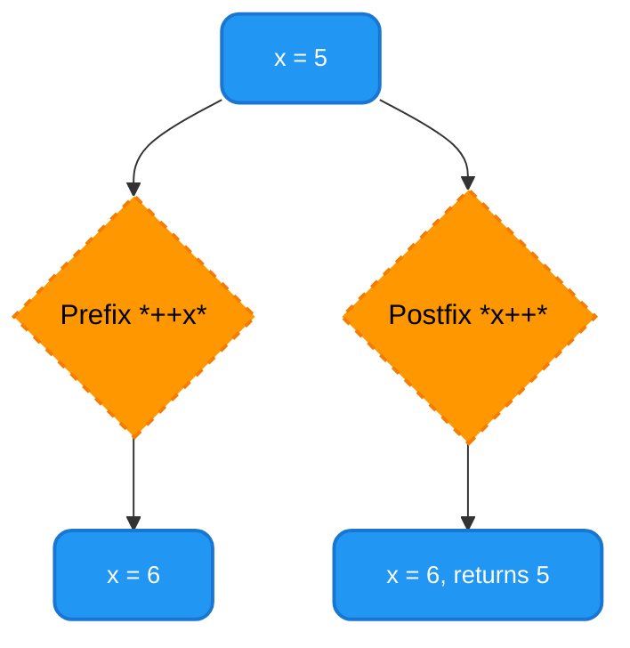
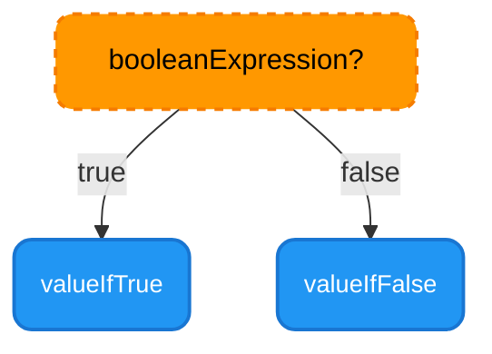

# <span style="color:#e67e22;">What we will learn in this post?</span>

<ul style='list-style-type: none; padding-left: 0;'>
<li><span style='color: #2980b9; font-size: 20px; font-weight: bold;'>👉</span> <span style='color: #2ecc71; font-size: 18px; font-weight: bold;'>Arithmetic Operator</span></li>
<li><span style='color: #2980b9; font-size: 20px; font-weight: bold;'>👉</span> <span style='color: #2ecc71; font-size: 18px; font-weight: bold;'>Unary Operator</span></li>
<li><span style='color: #2980b9; font-size: 20px; font-weight: bold;'>👉</span> <span style='color: #2ecc71; font-size: 18px; font-weight: bold;'>Assignment Operator</span></li>
<li><span style='color: #2980b9; font-size: 20px; font-weight: bold;'>👉</span> <span style='color: #2ecc71; font-size: 18px; font-weight: bold;'>Relational Operator</span></li>
<li><span style='color: #2980b9; font-size: 20px; font-weight: bold;'>👉</span> <span style='color: #2ecc71; font-size: 18px; font-weight: bold;'>Logical Operator</span></li>
<li><span style='color: #2980b9; font-size: 20px; font-weight: bold;'>👉</span> <span style='color: #2ecc71; font-size: 18px; font-weight: bold;'>Ternary Operator</span></li>
<li><span style='color: #2980b9; font-size: 20px; font-weight: bold;'>👉</span> <span style='color: #2ecc71; font-size: 18px; font-weight: bold;'>Bitwise Operator</span></li>
<li><span style='color: #2980b9; font-size: 20px; font-weight: bold;'>👉</span> <span style='color: #2ecc71; font-size: 18px; font-weight: bold;'>Conclusion!</span></li>
</ul>

# <span style="color:#e67e22">Java Arithmetic Operators ➕➖✖️➗%</span>

This guide explains the **basic operators in Java**, focusing on arithmetic operations. These are fundamental to any Java program.

## <span style="color:#2980b9">Basic Arithmetic Operators</span>

Java provides standard arithmetic operators for performing calculations. Let's explore each one with examples:

### <span style="color:#8e44ad">Addition (+)</span>

```java
int sum = 10 + 5; // Adds 10 and 5
System.out.println("Sum: " + sum); // Output: Sum: 15
```

### <span style="color:#8e44ad">Subtraction (-)</span>

```java
int difference = 20 - 8; // Subtracts 8 from 20
System.out.println("Difference: " + difference); // Output: Difference: 12
```

### <span style="color:#8e44ad">Multiplication (\*)</span>

```java
int product = 6 * 4; // Multiplies 6 by 4
System.out.println("Product: " + product); // Output: Product: 24
```

### <span style="color:#8e44ad">Division (/)</span>

```java
double quotient = 30.0 / 3; // Divides 30.0 by 3 (Note: using doubles for floating point precision)
System.out.println("Quotient: " + quotient); // Output: Quotient: 10.0
```

### <span style="color:#8e44ad">Modulus (%)</span>

```java
int remainder = 17 % 5; // Finds the remainder when 17 is divided by 5
System.out.println("Remainder: " + remainder); // Output: Remainder: 2
```

## <span style="color:#2980b9">Operator Precedence</span>

Remember that Java follows standard mathematical order of operations (PEMDAS/BODMAS). Multiplication and division are performed _before_ addition and subtraction. Use parentheses `()` to control the order of operations if needed.

_For more detailed information on Java operators and precedence, refer to the official Oracle Java documentation._ [Link to Oracle Java Docs](https://docs.oracle.com/javase/tutorial/java/nutsandbolts/operators.html) (Replace with actual link)

---

This structured approach, using headings, emojis, markdown formatting, and links makes the explanation clear and engaging. Remember to replace the placeholder link with a valid link to the Oracle Java documentation.

# <span style="color:#e67e22">Java Unary Operators: A Deep Dive</span> ➕➖

Unary operators in Java work on a single operand. Let's explore the most common ones: increment (`++`), decrement (`--`), unary plus (`+`), and unary minus (`-`). These are fundamental concepts in `Java unary operators` and understanding `increment and decrement in Java` is crucial for any Java programmer.

## <span style="color:#2980b9">Increment and Decrement Operators</span> ⬆️⬇️

These operators modify a variable's value by adding or subtracting 1. They come in _prefix_ and _postfix_ forms:

### <span style="color:#8e44ad">Prefix vs. Postfix</span>

- **Prefix:** `++x` or `--x` (Increment/decrement _before_ the value is used in the expression).
- **Postfix:** `x++` or `x--` (Increment/decrement _after_ the value is used in the expression).

```java
int x = 5;
int y = ++x; // x becomes 6, y becomes 6
System.out.println(x + ", " + y); // Output: 6, 6

int a = 5;
int b = a++; // a becomes 6, b becomes 5
System.out.println(a + ", " + b); // Output: 6, 5
```

## <span style="color:#2980b9">Unary Plus and Minus Operators</span> ➕➖

These operators change the sign of a numeric value.

```java
int p = 10;
int q = -p; // q becomes -10
System.out.println(q); // Output: -10

int r = -5;
int s = +r; // s becomes -5 (no change in sign)
System.out.println(s); //Output: -5
```

## <span style="color:#2980b9">Key Differences Illustrated</span>



For more in-depth information and advanced applications of unary operators, refer to the official Oracle Java documentation: [https://docs.oracle.com/javase/tutorial/java/nutsandbolts/operators.html](https://docs.oracle.com/javase/tutorial/java/nutsandbolts/operators.html) (replace with actual link if needed)

This explanation provides a clear and concise understanding of Java unary operators. Remember to pay close attention to the prefix and postfix variations of increment and decrement to avoid unexpected results in your code.

# <span style="color:#e67e22">Java Assignment Operators ✍️</span>

Java provides various operators to assign values to variables. Let's explore simple and compound assignment operators.

## <span style="color:#2980b9">Simple Assignment (=)</span>

This is the most basic operator. It assigns the value on the right-hand side to the variable on the left-hand side.

```java
int x = 10; // x now holds the value 10
System.out.println(x); // Output: 10
```

## <span style="color:#2980b9">Compound Assignment Operators</span>

Compound assignment operators combine a mathematical or bitwise operation with an assignment. They provide a shorthand for common operations.

### <span style="color:#8e44ad">Examples of Compound Assignment in Java</span>

- `+=` (Addition assignment): `x += 5;` is equivalent to `x = x + 5;`
- `-=` (Subtraction assignment): `x -= 3;` is equivalent to `x = x - 3;`
- `*=` (Multiplication assignment): `x *= 2;` is equivalent to `x = x * 2;`
- `/=` (Division assignment): `x /= 4;` is equivalent to `x = x / 4;`
- `%=` (Modulo assignment): `x %= 3;` is equivalent to `x = x % 3;`

```java
int y = 5;
y += 2; // y = y + 2;  y becomes 7
System.out.println(y); //Output: 7

y *= 3; //y = y * 3; y becomes 21
System.out.println(y); //Output: 21
```

**Benefits of using compound assignment:**

- More concise code.
- Improved readability.

**Note:** Always ensure the data type of the variable is compatible with the value being assigned.

## <span style="color:#2980b9">Further Learning 🚀</span>

For a deeper dive into Java operators, including more advanced operators, check out the official [Oracle Java Tutorials](https://docs.oracle.com/javase/tutorial/java/nutsandbolts/operators.html). Understanding operators is _fundamental_ to Java programming!

This comprehensive guide helps you grasp the core concepts of 'Java assignment operators' and 'compound assignment in Java'. Remember to practice consistently to solidify your understanding. 😊

# <span style="color:#e67e22">Java Relational Operators 🤝</span>

Java's relational operators, also known as **comparison operators in Java**, are used to compare two values. They return a _boolean_ value – `true` if the comparison is true, and `false` otherwise.

## <span style="color:#2980b9">Relational Operators in Action 🚀</span>

Here's a table summarizing the six main relational operators:

| Operator | Description           | Example    | Result |
| -------- | --------------------- | ---------- | ------ |
| `==`     | Equal to              | `5 == 5`   | `true` |
| `!=`     | Not equal to          | `5 != 10`  | `true` |
| `>`      | Greater than          | `10 > 5`   | `true` |
| `<`      | Less than             | `5 < 10`   | `true` |
| `>=`     | Greater than or equal | `10 >= 10` | `true` |
| `<=`     | Less than or equal to | `5 <= 10`  | `true` |

### <span style="color:#8e44ad">Code Examples 💻</span>

```java
int a = 10;
int b = 5;

boolean isEqual = (a == b); //false
boolean isGreater = (a > b); //true
boolean isLessOrEqual = (b <= a); //true

System.out.println("a == b: " + isEqual); // Output: a == b: false
System.out.println("a > b: " + isGreater); // Output: a > b: true
System.out.println("b <= a: " + isLessOrEqual); //Output: b <= a: true

```

## <span style="color:#2980b9">Important Considerations 🤔</span>

- Remember that `==` checks for _equality_, while `.equals()` is used for comparing the _content_ of objects (especially Strings).
- Relational operators are fundamental to conditional statements (`if`, `else if`, `else`) and loops.

For more in-depth information on Java operators, refer to:

- [Oracle's Java Tutorials on Operators](https://docs.oracle.com/javase/tutorial/java/nutsandbolts/operators.html)

This comprehensive guide helps you understand and effectively use Java relational operators in your programs. Remember to choose the right operator based on your comparison needs!

# <span style="color:#e67e22">Java Logical Operators 🤝</span>

Java provides logical operators to combine or modify boolean expressions within conditional statements. These "conditional operators in Java" are crucial for creating complex decision-making logic in your programs.

## <span style="color:#2980b9">AND, OR, and NOT Operators</span>

### <span style="color:#8e44ad">Logical AND (&&)</span>

The `&&` operator returns `true` only if _both_ operands are `true`.

```java
boolean a = true;
boolean b = false;
boolean result = a && b; // false
System.out.println(result); // Output: false
```

### <span style="color:#8e44ad">Logical OR (||)</span>

The `||` operator returns `true` if _at least one_ operand is `true`.

```java
boolean a = true;
boolean b = false;
boolean result = a || b; // true
System.out.println(result); // Output: true
```

### <span style="color:#8e44ad">Logical NOT (!)</span>

The `!` operator inverts the boolean value of its operand. `true` becomes `false`, and `false` becomes `true`.

```java
boolean a = true;
boolean result = !a; // false
System.out.println(result); // Output: false
```

## <span style="color:#2980b9">Usage in Conditional Statements</span>

Logical operators are frequently used inside `if`, `else if`, and `while` statements.

```java
int age = 20;
int score = 85;

if (age >= 18 && score >= 80) {
    System.out.println("Eligible for the award!"); // Output: Eligible for the award!
}
```

This example shows how `&&` combines two conditions: age must be 18 or older _and_ the score must be 80 or higher to be eligible.

## <span style="color:#2980b9">Truth Tables 📊</span>

Here's a visual representation of how these operators work:

```
| A     | B     | A && B | A || B | !A    |
|-------|-------|--------|--------|-------|
| true  | true  | true   | true   | false |
| true  | false | false  | true   | false |
| false | true  | false  | true   | true  |
| false | false | false  | false  | true  |
```

**For more information:**

- [Oracle Java Tutorials](https://docs.oracle.com/javase/tutorial/java/nutsandbolts/operators.html)

This detailed explanation, along with the examples and visual aids, should provide a comprehensive understanding of Java logical operators and their application in conditional statements. Remember to practice using them to master their functionality!

# <span style="color:#e67e22">Java Ternary Operator: A Concise Guide</span> ⭐️

The Java ternary operator, also known as the conditional operator, is a concise way to express a simple `if-else` statement in a single line of code. It's a powerful tool for making your Java code more readable and efficient. Think of it as a shorthand for decision-making!

## <span style="color:#2980b9">Syntax and Structure</span> 💡

The basic syntax is:

`booleanExpression ? valueIfTrue : valueIfFalse;`

- `booleanExpression`: A condition that evaluates to either `true` or `false`.
- `valueIfTrue`: The value returned if the `booleanExpression` is `true`.
- `valueIfFalse`: The value returned if the `booleanExpression` is `false`.

### <span style="color:#8e44ad">Example 1: Simple Comparison</span>

```java
int age = 25;
String status = (age >= 18) ? "Adult" : "Minor"; //Ternary Operator
System.out.println(status); // Output: Adult
```

This replaces:

```java
String status;
if (age >= 18) {
    status = "Adult";
} else {
    status = "Minor";
}
System.out.println(status); // Output: Adult
```

### <span style="color:#8e44ad">Example 2: Nested Ternary Operator (Advanced)</span>

```java
int score = 85;
String grade = (score >= 90) ? "A" : (score >= 80) ? "B" : "C";
System.out.println(grade); // Output: B
```

This example demonstrates nesting, allowing for multiple conditions within a single ternary expression. However, excessively nested ternaries can reduce readability. Use them judiciously!

## <span style="color:#2980b9">Advantages of Using the Ternary Operator</span> 🚀

- **Conciseness:** Reduces code length and improves readability for simple conditional assignments.
- **Efficiency:** Can be slightly more efficient than equivalent `if-else` statements in some cases (although the difference is often negligible).

**Note:** Avoid overusing the ternary operator, especially with complex logic. For readability, stick to simple conditional assignments.

## <span style="color:#2980b9">Flowchart Representation</span> 📊



For more information on the Java ternary operator, you can refer to the official [Oracle Java documentation](https://docs.oracle.com/javase/tutorial/java/nutsandbolts/operators.html). Remember to use this powerful feature responsibly for cleaner, more efficient code!

# <span style="color:#e67e22">Java Bitwise Operators ⚙️</span>

Bitwise operators in Java are used for manipulating individual bits within integers. This is powerful for tasks needing efficient low-level control. Let's explore the key operators:

## <span style="color:#2980b9">Core Bitwise Operators</span>

### <span style="color:#8e44ad">AND (&)</span>

The AND operator compares corresponding bits. If both are 1, the result is 1; otherwise, it's 0.

```java
int a = 5; // 0101
int b = 3; // 0011
int result = a & b; // 0001  (1)
System.out.println(result); // Output: 1
```

### <span style="color:#8e44ad">OR (|)</span>

The OR operator compares bits. If at least one bit is 1, the result is 1; otherwise, it's 0.

```java
int a = 5; // 0101
int b = 3; // 0011
int result = a | b; // 0111 (7)
System.out.println(result); // Output: 7
```

### <span style="color:#8e44ad">XOR (^)</span>

The XOR operator compares bits. If the bits are _different_, the result is 1; otherwise, it's 0.

```java
int a = 5; // 0101
int b = 3; // 0011
int result = a ^ b; // 0110 (6)
System.out.println(result); // Output: 6
```

### <span style="color:#8e44ad">NOT (~)</span>

The NOT operator inverts each bit (0 becomes 1, and 1 becomes 0).

```java
int a = 5; // 0101
int result = ~a; // 1010 (In 2's complement representation, this is -6)
System.out.println(result); // Output: -6
```

## <span style="color:#2980b9">Applications of Bit Manipulation in Java</span>

- **Setting/Clearing bits:** Use bitwise AND and OR to selectively modify bits.
- **Checking flags:** Determine if a specific bit is set using bitwise AND.
- **Efficient arithmetic:** Perform faster operations in certain cases (e.g., multiplication/division by powers of 2).
- **Cryptography:** Bitwise operations are fundamental in many cryptographic algorithms.

**Note:** Understanding 2's complement representation is crucial when working with negative numbers and the bitwise NOT operator.

Remember to always clearly comment your code for better understanding and maintenance! 🤓

<h1><span style='color:#e67e22'>Conclusion</span></h1>

And there you have it! We hope you enjoyed this post. 😊 We're always looking to improve, so we'd love to hear your thoughts! What did you think? Any feedback, suggestions, or burning questions? 🔥 Let us know in the comments below! 👇 We can't wait to read them! 😄
