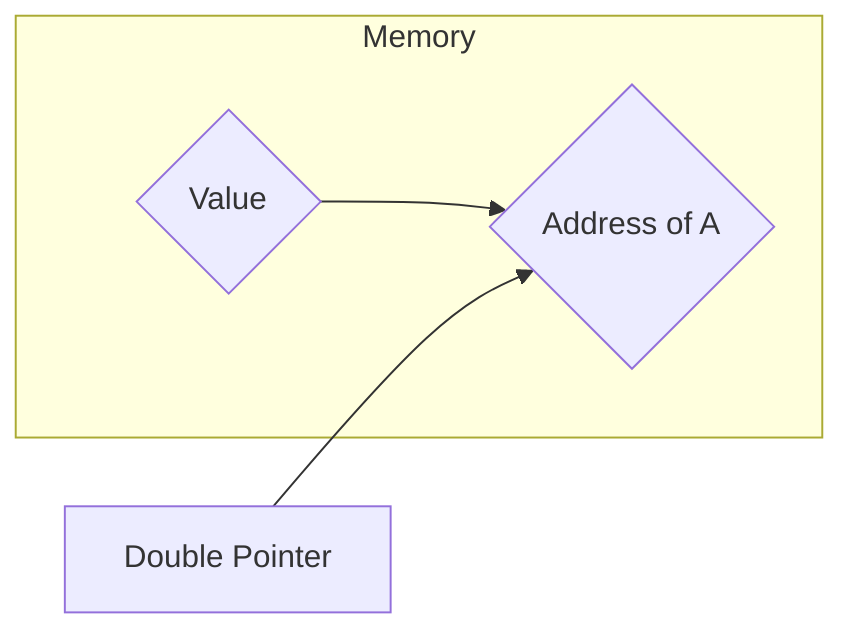
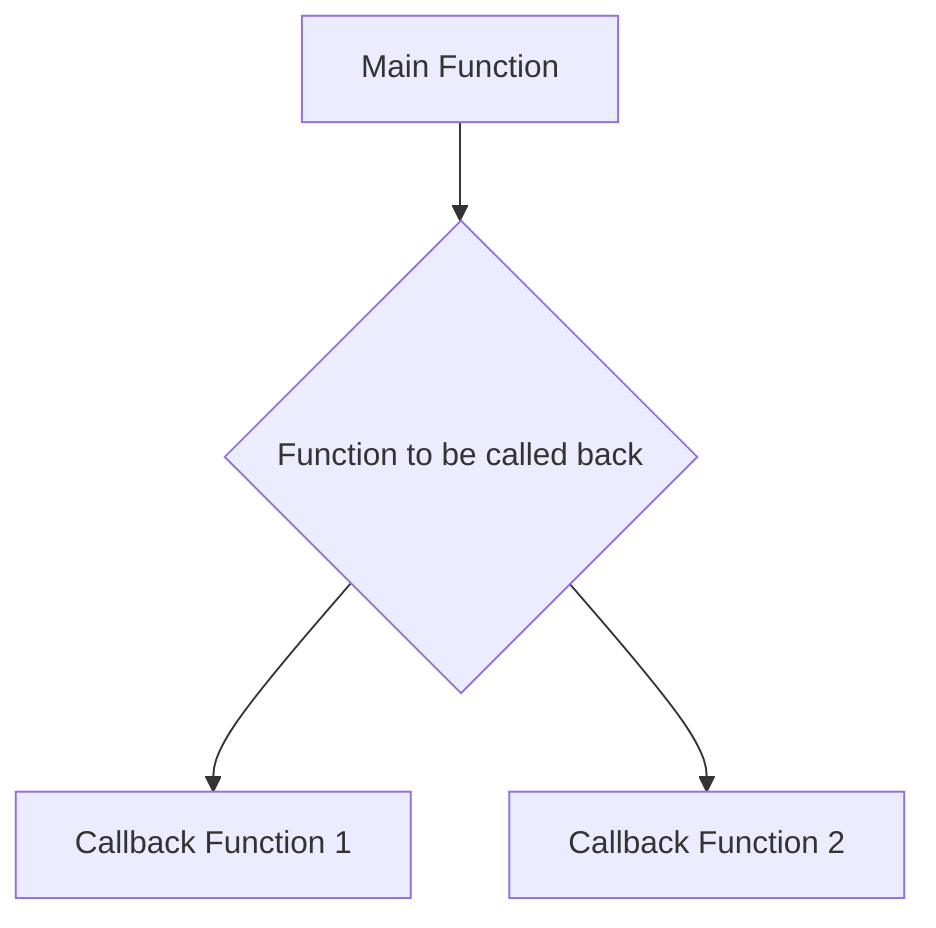
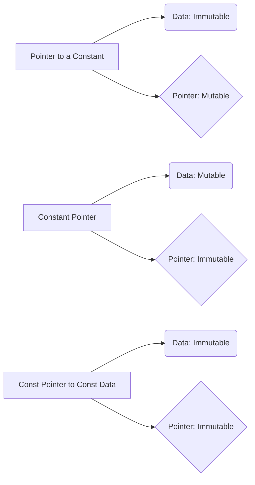
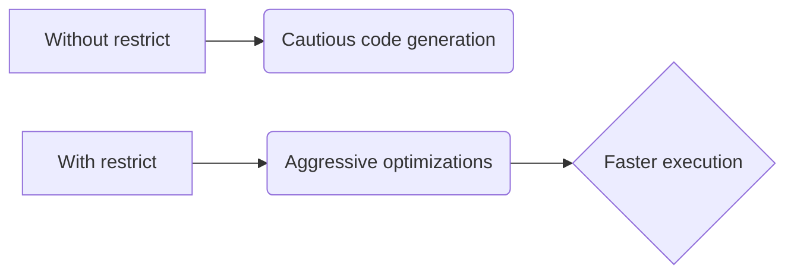

# <span style="color:#e67e22;">What we will learn in this post?</span>
<ul style='list-style-type: none; padding-left: 0;'>
<li><span style='color: #2980b9; font-size: 20px; font-weight: bold;'>👉</span> <span style='color: #2ecc71; font-size: 18px; font-weight: bold;'>C Pointers</span></li>
<li><span style='color: #2980b9; font-size: 20px; font-weight: bold;'>👉</span> <span style='color: #2ecc71; font-size: 18px; font-weight: bold;'>Pointer Arithmetics in C</span></li>
<li><span style='color: #2980b9; font-size: 20px; font-weight: bold;'>👉</span> <span style='color: #2ecc71; font-size: 18px; font-weight: bold;'>Pointer to Pointer (Double Pointer) in C</span></li>
<li><span style='color: #2980b9; font-size: 20px; font-weight: bold;'>👉</span> <span style='color: #2ecc71; font-size: 18px; font-weight: bold;'>Function Pointer in C</span></li>
<li><span style='color: #2980b9; font-size: 20px; font-weight: bold;'>👉</span> <span style='color: #2ecc71; font-size: 18px; font-weight: bold;'>Declare Function Pointer in C</span></li>
<li><span style='color: #2980b9; font-size: 20px; font-weight: bold;'>👉</span> <span style='color: #2ecc71; font-size: 18px; font-weight: bold;'>Pointer to an Array in C</span></li>
<li><span style='color: #2980b9; font-size: 20px; font-weight: bold;'>👉</span> <span style='color: #2ecc71; font-size: 18px; font-weight: bold;'>Constant Pointer in C</span></li>
<li><span style='color: #2980b9; font-size: 20px; font-weight: bold;'>👉</span> <span style='color: #2ecc71; font-size: 18px; font-weight: bold;'>Pointer vs Array in C</span></li>
<li><span style='color: #2980b9; font-size: 20px; font-weight: bold;'>👉</span> <span style='color: #2ecc71; font-size: 18px; font-weight: bold;'>Dangling, Void, Null and Wild Pointers</span></li>
<li><span style='color: #2980b9; font-size: 20px; font-weight: bold;'>👉</span> <span style='color: #2ecc71; font-size: 18px; font-weight: bold;'>Near, Far and Huge Pointers in C</span></li>
<li><span style='color: #2980b9; font-size: 20px; font-weight: bold;'>👉</span> <span style='color: #2ecc71; font-size: 18px; font-weight: bold;'>restrict Keyword in C</span></li>
<li><span style='color: #2980b9; font-size: 20px; font-weight: bold;'>👉</span> <span style='color: #2ecc71; font-size: 18px; font-weight: bold;'>Conclusion!</span></li>
</ul>

# <span style="color:#e67e22">Pointers in C: A Beginner's Guide 🚀</span>


Pointers are one of the most powerful (and sometimes confusing!) features of the C programming language.  They allow you to directly interact with the computer's memory, offering fine-grained control over data manipulation. Think of them as *memory addresses*.  Instead of directly accessing a variable's value, a pointer holds the *location* of that variable in memory.


## <span style="color:#2980b9">Understanding Memory Addresses 🏠</span>

Every variable you declare in your C program is stored in a specific location in your computer's RAM (Random Access Memory).  This location is identified by a unique address, much like a house has a unique address.  A pointer is a variable that stores this memory address.

### <span style="color:#8e44ad">Analogy:</span>

Imagine a mailbox (a variable) containing a letter (the variable's value). The pointer is like the mailbox's address; it tells you where to find the letter.


## <span style="color:#2980b9">Pointer Declaration and Initialization ✍️</span>

To declare a pointer, you use the asterisk (*) symbol before the variable name.  The type before the asterisk specifies the *data type* the pointer will point to.

```c
int *ptr; // Declares a pointer named 'ptr' that can point to an integer.
float *floatPtr; // Declares a pointer named 'floatPtr' that can point to a float.
char *charPtr; // Declares a pointer named 'charPtr' that can point to a character.
```

**Initialization:** You initialize a pointer by assigning it the address of a variable using the address-of operator (&).

```c
int num = 10;
int *ptr = &num; // ptr now holds the memory address of num.
```

### <span style="color:#8e44ad">Example:</span>

```mermaid
graph LR
A[num (integer variable) = 10] --> B(Memory Address: 0x1234);
C[ptr (integer pointer)] --> B;
```

In this example, `num` is stored at memory address `0x1234` (this is a symbolic representation; the actual address will be different).  `ptr` holds this address `0x1234`.


## <span style="color:#2980b9">Accessing Values Using Pointers 🔎</span>

To access the value stored at the memory location pointed to by a pointer, you use the dereference operator (*).

```c
int num = 10;
int *ptr = &num;
printf("Value of num: %d\n", num);       // Accessing directly
printf("Value pointed to by ptr: %d\n", *ptr); // Accessing indirectly through the pointer
```


## <span style="color:#2980b9">Pointers and Memory Management 💾</span>

Pointers play a crucial role in dynamic memory allocation using functions like `malloc()`, `calloc()`, and `realloc()`. These functions allocate memory during runtime and return a pointer to the allocated block. You then use this pointer to access and manipulate the data in that allocated memory.  Remember to always `free()` the dynamically allocated memory when you're done with it to prevent memory leaks!


* **`malloc()`:** Allocates a block of memory of a specified size.
* **`calloc()`:**  Similar to `malloc()`, but initializes the allocated memory to zero.
* **`realloc()`:**  Changes the size of a previously allocated memory block.
* **`free()`:** Releases the memory allocated by `malloc()`, `calloc()`, or `realloc()`.


## <span style="color:#2980b9">Example with Dynamic Memory Allocation</span>


```c
#include <stdio.h>
#include <stdlib.h>

int main() {
  int *dynamicArray;
  int size;

  printf("Enter the size of the array: ");
  scanf("%d", &size);

  dynamicArray = (int *)malloc(size * sizeof(int)); // Allocate memory for 'size' integers

  if (dynamicArray == NULL) {
    printf("Memory allocation failed!\n");
    return 1;
  }

  // ... use dynamicArray ...

  free(dynamicArray); // Free the allocated memory
  return 0;
}
```

## <span style="color:#2980b9">Important Considerations ⚠️</span>

* **Null Pointers:**  A pointer that doesn't point to any valid memory location. It's usually assigned the value `NULL`.  Always check for null pointers before dereferencing them to avoid crashes.
* **Dangling Pointers:** A pointer that points to a memory location that has been freed.  Using a dangling pointer leads to unpredictable behavior.
* **Memory Leaks:**  Failing to free dynamically allocated memory results in memory leaks, gradually consuming available memory.


## <span style="color:#2980b9">Further Resources 📚</span>

* [C Programming Tutorial (Pointers)](https://www.tutorialspoint.com/cprogramming/c_pointers.htm)
* [Pointers in C (GeeksforGeeks)](https://www.geeksforgeeks.org/pointers-in-c/)


Remember, pointers are a powerful tool, but they require careful handling. Understanding memory management is crucial to avoid errors and write efficient and robust C programs.  Practice makes perfect! 😊


# <span style="color:#e67e22">Pointer Arithmetic in C ➕➖</span>

Pointer arithmetic is a powerful feature in C that allows you to perform arithmetic operations directly on pointers. This is particularly useful when working with arrays.  It's crucial to understand that pointer arithmetic is *not* about adding or subtracting numbers to the memory address directly; instead, it involves adjusting the pointer to point to a different element within the same data structure (typically an array).

## <span style="color:#2980b9">Understanding Pointers and Arrays ➡️</span>

Before diving into arithmetic, let's refresh our understanding of pointers and arrays:

* **Pointers:**  Pointers are variables that hold the memory address of another variable.  We declare a pointer using an asterisk (`*`) before the variable name:  `int *ptr;` declares a pointer named `ptr` that can hold the address of an integer.

* **Arrays:** Arrays are contiguous blocks of memory that store elements of the same data type.  The name of an array acts as a pointer to its first element.

### <span style="color:#8e44ad">Example: Connecting Pointers and Arrays</span>

```c
int numbers[] = {10, 20, 30, 40, 50}; // An array of integers
int *ptr = numbers; // ptr now points to the first element (numbers[0])
```

In this example, `ptr` holds the memory address of `numbers[0]`.

## <span style="color:#2980b9">Incrementing and Decrementing Pointers ⬆️⬇️</span>

When you increment or decrement a pointer, the address it holds changes by the size of the data type it points to.  This is the key to pointer arithmetic's effectiveness.


### <span style="color:#8e44ad">Incrementing (++):</span>

```c
ptr++; // ptr now points to numbers[1] (moves forward by sizeof(int) bytes)
```

### <span style="color:#8e44ad">Decrementing (--):</span>

```c
ptr--; // ptr now points back to numbers[0] (moves backward by sizeof(int) bytes)
```

**Important Note:** The amount by which the pointer's value changes depends on the data type it points to. If `ptr` points to an `int` (4 bytes on many systems), `ptr++` will increase the address by 4 bytes. If `ptr` points to a `double` (8 bytes), `ptr++` will increase the address by 8 bytes.

## <span style="color:#2980b9">Pointer Arithmetic with Arrays ✨</span>

Let's see how pointer arithmetic interacts beautifully with arrays:

```c
#include <stdio.h>

int main() {
  int numbers[] = {10, 20, 30, 40, 50};
  int *ptr = numbers;

  printf("Value at ptr: %d\n", *ptr);       // Accessing numbers[0]
  ptr++;
  printf("Value at ptr + 1: %d\n", *ptr);    // Accessing numbers[1]
  ptr += 2;                               // ptr now points to numbers[3]
  printf("Value at ptr + 3: %d\n", *ptr);   // Accessing numbers[3]
  ptr -= 1;                                // ptr now points to numbers[2]
  printf("Value at ptr - 1: %d\n", *ptr); // Accessing numbers[2]


  return 0;
}
```


This code demonstrates accessing array elements using pointer arithmetic.  `*ptr` dereferences the pointer, giving you the value at the memory location.

## <span style="color:#2980b9">Visualizing Pointer Arithmetic 🗺️</span>

```mermaid
graph LR
    A[numbers[0] (10)] --> B(ptr);
    B --> C[numbers[1] (20)];
    C --> D[numbers[2] (30)];
    D --> E[numbers[3] (40)];
    E --> F[numbers[4] (50)];
    subgraph "Pointer Arithmetic"
        B --> G((ptr++));
        G --> C;
        C --> H((ptr += 2));
        H --> E;
        E --> I((ptr -= 1));
        I --> D;
    end
```

This diagram shows how the pointer `ptr` moves through the array `numbers` as a result of arithmetic operations.


## <span style="color:#2980b9">Key Considerations 🤔</span>

* **Pointer boundaries:**  Always be mindful of the array's boundaries.  Trying to access memory outside the array's allocated space leads to undefined behavior (crashes!).

* **Data type size:** Remember that the increment/decrement value depends on the pointer's data type.

* **Null pointers:**  A null pointer (`NULL`) doesn't point to any valid memory location.  Attempting arithmetic on a null pointer is dangerous.


## <span style="color:#2980b9">Further Resources 📚</span>

* [C Programming Tutorial on Pointers](https://www.tutorialspoint.com/cprogramming/c_pointers.htm)
* [Pointers and Arrays in C](https://www.geeksforgeeks.org/pointers-in-c-and-c/)


By understanding and mastering pointer arithmetic, you can write more efficient and elegant C code, particularly when working with arrays and other data structures. Remember to practice and experiment to solidify your understanding!


# <span style="color:#e67e22">Double Pointers in C: A Deep Dive Pointers 📌📌</span>

Double pointers, also known as pointers to pointers, are a powerful feature in C that allows you to indirectly manipulate the address of a pointer.  This might sound confusing at first, but it's actually quite useful for working with dynamic data structures and function arguments. Let's break it down!


## <span style="color:#2980b9">Understanding the Concept 🤔</span>

Imagine you have a treasure map (a pointer) that points to the location of a treasure chest (a variable). A double pointer is like having *another* map that points to the *first* map. It's a pointer to a pointer!

* **Pointer:** Holds the memory address of a variable.
* **Double Pointer:** Holds the memory address of a *pointer*.


### <span style="color:#8e44ad">Visual Representation 🗺️</span>



In this diagram:

* `A` represents a variable.
* `B` is a pointer holding the memory address of `A`.
* `C` is a double pointer holding the memory address of `B`.


## <span style="color:#2980b9">Declaration and Initialization ✍️</span>

Declaring a double pointer is straightforward:

```c
int x = 10;       // An integer variable
int *ptr = &x;    // A pointer to an integer
int **dptr = &ptr; // A double pointer to an integer
```

* `int x`:  Declares an integer variable `x`.
* `int *ptr`: Declares a pointer `ptr` that can hold the address of an integer.
* `int **dptr`: Declares a double pointer `dptr` that can hold the address of a pointer to an integer.


### <span style="color:#8e44ad">Example:  Manipulating Values Through Double Pointers ✨</span>

```c
#include <stdio.h>

int main() {
    int x = 10;
    int *ptr = &x;
    int **dptr = &ptr;

    printf("Value of x: %d\n", x);       // Output: 10
    printf("Value of x using ptr: %d\n", *ptr); // Output: 10
    printf("Value of x using dptr: %d\n", **dptr); // Output: 10

    **dptr = 20; // Modifying x through the double pointer

    printf("New value of x: %d\n", x);    // Output: 20
    return 0;
}
```

This example shows how changing the value pointed to by `dptr` actually changes the value of `x`.


## <span style="color:#2980b9">Use Cases of Double Pointers 🚀</span>

Double pointers are particularly useful in:

* **Dynamic Memory Allocation:**  Modifying pointers passed to functions.  You can change where a pointer is pointing to within the function.
* **Linked Lists and Trees:** Managing nodes and their connections.
* **Passing Pointers as Arguments:** Allows functions to modify the original pointer's value.


### <span style="color:#8e44ad">Example: Function Modifying a Pointer 🛠️</span>

```c
#include <stdio.h>
#include <stdlib.h>

void modifyPtr(int **ptr) {
    int *newPtr = (int *)malloc(sizeof(int)); // Allocate memory for a new int
    *newPtr = 100;
    *ptr = newPtr; // Make the original pointer point to the new memory location
}


int main() {
    int *ptr;
    modifyPtr(&ptr);
    printf("Value pointed to by ptr: %d\n", *ptr); // Output: 100
    free(*ptr); // Remember to free the allocated memory!
    return 0;
}
```

This example demonstrates how a function can change the address stored in a pointer using a double pointer.


## <span style="color:#2980b9">Important Considerations ⚠️</span>

* **Memory Management:** When dynamically allocating memory using double pointers, remember to `free()` the allocated memory to prevent memory leaks.
* **Null Pointers:** Always check for `NULL` pointers to avoid segmentation faults.


## <span style="color:#2980b9">Further Resources 📚</span>

* [C Programming Tutorial on Pointers](https://www.tutorialspoint.com/cprogramming/c_pointers.htm)
* [GeeksforGeeks on Double Pointers](https://www.geeksforgeeks.org/double-pointer-in-c/)


This comprehensive guide, with its visual aids and clear explanations, should help you master the intricacies of double pointers in C! Remember to practice to solidify your understanding.  Good luck! 👍


# <span style="color:#e67e22">Function Pointers in C: A Delightful Dive 🎯</span>

Function pointers, as the name suggests, are pointers that hold the memory address of a function.  Think of them as variables that can *point* to different functions at different times. This allows for powerful techniques like callbacks and dynamic function dispatch, making your C code more flexible and adaptable.


## <span style="color:#2980b9">Understanding the Basics 🧠</span>

### <span style="color:#8e44ad">Declaration</span>

Let's start with declaring a function pointer.  The syntax might look a bit intimidating at first, but it's actually quite logical:

```c
return_type (*pointer_name)(parameter_types); 
```

*   `return_type`:  The data type the function returns (e.g., `int`, `void`, `float`).
*   `*pointer_name`: The name you give to your function pointer (e.g., `myFuncPtr`). The asterisk (*) indicates it's a pointer.
*   `(parameter_types)`: The data types of the function's parameters (e.g., `(int, float)`, `(char*)`).


**Example:**

```c
int (*mathOperation)(int, int); // Declares a function pointer named 'mathOperation' that points to a function taking two ints and returning an int.
```


### <span style="color:#8e44ad">Assignment</span>

Once declared, you assign the address of a function to the function pointer:


```c
int add(int a, int b) { return a + b; }
int subtract(int a, int b) { return a - b; }

int main() {
  mathOperation = add; // Assign the address of the 'add' function
  int sum = mathOperation(5, 3); // Call 'add' indirectly through the pointer
  printf("Sum: %d\n", sum);

  mathOperation = subtract; // Now point to 'subtract'
  int diff = mathOperation(5, 3); // Call 'subtract' indirectly
  printf("Difference: %d\n", diff);
  return 0;
}
```

This code dynamically changes which function `mathOperation` points to, illustrating the power of function pointers.


## <span style="color:#2980b9">Callbacks: The Power of Dynamic Function Calls ✨</span>

Callbacks are functions passed as arguments to other functions.  The receiving function then *calls back* the passed function at a specific point in its execution. This is incredibly useful for creating flexible and extensible code.


**Example: A Simple Callback Scenario**



This shows that one function can use a function pointer to call several different callback functions at different times.

```c
#include <stdio.h>

// Callback function prototype
void callbackFunction(int data);

// Function that accepts a callback
void processData(int data, void (*callback)(int)) {
  printf("Processing data: %d\n", data);
  callback(data); // Call the callback function
}

// Example callback functions
void printData(int data) {
  printf("Data: %d\n", data);
}

void squareData(int data) {
  printf("Square: %d\n", data * data);
}


int main() {
  processData(5, printData);     // Call processData with printData as the callback
  processData(10, squareData);   // Call processData with squareData as the callback
  return 0;
}
```


## <span style="color:#2980b9">Advantages of Function Pointers 🚀</span>

*   **Flexibility:** Easily switch between different functions at runtime.
*   **Extensibility:**  Add new functionalities without modifying core code.
*   **Code Reusability:** Write generic functions that can operate on various specific functions.
*   **Dynamic Behavior:**  Create programs that adapt to changing conditions.


## <span style="color:#2980b9">Resources for Further Learning 📚</span>


*   [C Programming Tutorial on Function Pointers](https://www.tutorialspoint.com/cprogramming/c_function_pointers.htm)
*   [GeeksforGeeks: Function Pointers in C](https://www.geeksforgeeks.org/function-pointers-in-c/)


This comprehensive guide should give you a solid foundation in using function pointers effectively in your C programs. Remember, practice makes perfect!  Start experimenting with different examples and gradually build up your understanding.  Happy coding! 🎉


# <span style="color:#e67e22">Function Pointers in C: A Comprehensive Guide 🚀</span>

Function pointers, a powerful feature in C, allow you to store the address of a function in a variable. This enables dynamic function calls, making your code more flexible and reusable.  Let's explore how they work!


## <span style="color:#2980b9">Understanding the Syntax 📖</span>

The syntax for declaring a function pointer might seem a bit intimidating at first, but it's logical once broken down.  The general form is:

```c
return_type (*pointer_name)(parameter_types); 
```

Let's dissect this:

* `return_type`:  Specifies the data type the function returns (e.g., `int`, `void`, `float`).
* `*pointer_name`: This declares `pointer_name` as a pointer. The asterisk (*) is crucial!
* `(parameter_types)`:  Lists the data types of the function's parameters, enclosed in parentheses.  If the function takes no parameters, use `void`.


### <span style="color:#8e44ad">Example: A Simple Function Pointer</span>

Let's say we have a function that adds two integers:

```c
int add(int a, int b) {
  return a + b;
}
```

To declare a function pointer that can point to `add`, we'd use:

```c
int (*operation)(int, int); // Declares a function pointer named 'operation'
```

This line reads as:  " `operation` is a pointer to a function that takes two integers as input and returns an integer."


## <span style="color:#2980b9">Assigning and Using Function Pointers ✨</span>

After declaring a function pointer, you can assign the address of a function to it using the function's name (without parentheses):

```c
operation = add; // Assigns the address of the 'add' function to 'operation'
```

Now, you can call the function using the pointer:

```c
int sum = operation(5, 3); // Calls the 'add' function indirectly through 'operation'
printf("Sum: %d\n", sum); // Output: Sum: 8
```


## <span style="color:#2980b9">Different Function Pointer Types 🌈</span>

Function pointers aren't limited to simple functions. They can point to functions with various return types and parameter lists.

### <span style="color:#8e44ad">Void Return Type</span>

```c
void print_hello(void) {
  printf("Hello!\n");
}

void (*printer)(void);  // Function pointer with void return type
printer = print_hello;
printer(); // Calls print_hello
```

### <span style="color:#8e44ad">Multiple Parameters</span>

```c
float calculate_area(float length, float width) {
  return length * width;
}

float (*area_calculator)(float, float); // Function pointer with two float parameters
area_calculator = calculate_area;
float area = area_calculator(5.0, 10.0); // Calls calculate_area
```


## <span style="color:#2980b9">Visual Representation 📊</span>

```mermaid
graph LR
A[Function add(int, int)] --> B(int (*operation)(int, int));
B --> C[operation = add];
C --> D{Call operation(5,3)};
D --> E[Result: 8];
```

This diagram shows the flow of assigning a function to a pointer and calling it.


## <span style="color:#2980b9">Benefits of Using Function Pointers 💪</span>

* **Flexibility:**  Allows dynamic function selection at runtime.
* **Code Reusability:**  Facilitates creating generic functions that operate on different functions.
* **Callbacks:**  Essential for event handling and asynchronous programming.


## <span style="color:#2980b9">Further Resources 📚</span>

* **[C Programming Language (K&R)](https://en.wikipedia.org/wiki/The_C_Programming_Language):** A classic text on C programming.  Provides in-depth coverage of pointers in general, which is crucial to understanding function pointers.
* **[Online C tutorials](https://www.tutorialspoint.com/cprogramming/c_pointers.htm):** Numerous online resources offer tutorials and examples of function pointers.


By mastering function pointers, you significantly enhance your C programming skills, opening doors to more advanced and efficient code designs. Remember the key elements: return type, pointer declaration (*), and parameter types.  Happy coding! 🎉


# <span style="color:#e67e22">Pointers and Arrays in C: A Deep Dive 📌</span>

This guide explains how to create pointers to arrays in C, illustrating the syntax and access methods with examples. We'll use Markdown formatting for a visually appealing and easy-to-understand explanation.


## <span style="color:#2980b9">Understanding Pointers 🎯</span>

Before diving into pointers to arrays, let's quickly recap what pointers are.  In C, a pointer is a variable that holds the memory address of another variable.  Think of it like a street address that tells you where a house (variable) is located.

* **Declaration:** We declare a pointer using an asterisk (*) before the variable name.  For example, `int *ptr;` declares a pointer named `ptr` that can hold the address of an integer variable.

* **Assignment:**  We assign the address of a variable to a pointer using the address-of operator (&). For example, if `int num = 10;`, then `ptr = &num;` assigns the memory address of `num` to `ptr`.

* **Dereferencing:** To access the value stored at the memory address held by a pointer, we use the dereference operator (*).  `*ptr` would give us the value of `num` (which is 10).


## <span style="color:#2980b9">Pointers to Arrays ✨</span>

An array name itself acts as a pointer to the first element of the array.  This is a crucial concept!

### <span style="color:#8e44ad">Declaration and Initialization</span>

Let's declare an integer array and a pointer to it:

```c
int arr[] = {1, 2, 3, 4, 5};  // Array declaration and initialization
int *ptr = arr;              // Pointer to the array (ptr points to arr[0])
```

In this example:

* `arr` implicitly decays to a pointer to the first element of the array ( `&arr[0]` ).
* `ptr` now holds the memory address of the first element (`arr[0]`).


### <span style="color:#8e44ad">Accessing Array Elements Using Pointers</span>

We can access array elements using pointer arithmetic:

```c
printf("First element: %d\n", *ptr);       // Accessing arr[0] using *ptr
printf("Second element: %d\n", *(ptr + 1)); // Accessing arr[1] using *(ptr + 1)
printf("Third element: %d\n", ptr[2]);     // Equivalent to *(ptr + 2)  - array notation!
```

**Explanation:**

* `*ptr` dereferences the pointer, giving the value at the memory address it points to ( `arr[0]` ).
* `*(ptr + 1)` adds 1 to the memory address held by `ptr` (effectively moving to the next integer in memory), then dereferences it to get the value ( `arr[1]` ).
* `ptr[2]` is a convenient shorthand notation equivalent to `*(ptr + 2)`. This demonstrates that array indexing is essentially pointer arithmetic under the hood!


## <span style="color:#2980b9">Illustrative Example 💡</span>

Let's visualize the memory layout and pointer operations:

```mermaid
graph LR
    A[arr[0] = 1] --> B(arr[1] = 2);
    B --> C(arr[2] = 3);
    C --> D(arr[3] = 4);
    D --> E(arr[4] = 5);
    subgraph Memory Addresses
        arr[0] --> A;
        arr[1] --> B;
        arr[2] --> C;
        arr[3] --> D;
        arr[4] --> E;
    end
    ptr --> A;
    style ptr fill:#ccf,stroke:#333,stroke-width:2px
    style arr fill:#ccf,stroke:#333,stroke-width:2px
```

In this diagram:  `ptr` points to the beginning of the array.  `ptr + 1` points to the next element, and so on.


## <span style="color:#2980b9">Key Takeaways and Further Resources 📚</span>

* Array names decay to pointers to their first element.
* Pointer arithmetic allows traversal of arrays.
*  `*(ptr + i)` accesses the *i*-th element of the array pointed to by `ptr`.
* `ptr[i]` is an equivalent notation to `*(ptr + i)`.


For more in-depth information on pointers and arrays in C, please refer to these resources:

* [GeeksforGeeks C Pointers](https://www.geeksforgeeks.org/pointers-in-c/)
* [Learn C.org Pointers and Arrays](https://www.learn-c.org/en/Pointers_and_arrays)

Remember to compile and run these code examples to solidify your understanding.  Happy coding! 🎉


# <span style="color:#e67e22">Understanding Constant Pointers in C 📌</span>

C offers a powerful mechanism for working with pointers, and understanding constant pointers is crucial for writing robust and efficient code.  Let's clarify the difference between a *pointer to a constant* and a *constant pointer*.


## <span style="color:#2980b9">Pointer to a Constant ➡️</span>

This means the *data* pointed to by the pointer is constant; you cannot modify the value at the memory location the pointer points to.  However, the pointer itself can be changed to point to a different memory location.

### <span style="color:#8e44ad">Example:</span>

```c
#include <stdio.h>

int main() {
  const int num = 10; // num is a constant
  int *ptr = &num;   // ptr is a pointer to a constant integer


  printf("Value of num: %d\n", num);     // Output: 10
  printf("Value pointed to by ptr: %d\n", *ptr); // Output: 10

  //*ptr = 20;  // This will result in a compiler error!  We can't modify what ptr points to.

  int anotherNum = 25;
  ptr = &anotherNum; // This is allowed - We can change where ptr points.
  printf("New value pointed to by ptr: %d\n", *ptr); // Output: 25

  return 0;
}
```

**Key takeaway:** The `const` keyword before the data type (`int` in this case) indicates that the data pointed to is immutable.


## <span style="color:#2980b9">Constant Pointer 📍</span>


This means the pointer itself cannot be changed after it's initialized. It will always point to the same memory location.  The data at that memory location, however, *can* be modified (unless it's also declared as `const`).

### <span style="color:#8e44ad">Example:</span>

```c
#include <stdio.h>

int main() {
  int num = 10;
  int * const ptr = &num; // ptr is a constant pointer to an integer

  printf("Value of num: %d\n", num);     // Output: 10
  printf("Value pointed to by ptr: %d\n", *ptr); // Output: 10

  *ptr = 20;  // This is allowed - We can modify the value at the memory location.
  printf("Modified value pointed to by ptr: %d\n", *ptr); // Output: 20

  //ptr = &anotherNum; // This will result in a compiler error! We can't change where ptr points.

  return 0;
}
```

**Key takeaway:** The `const` keyword after the pointer declaration (`* ptr`) makes the pointer itself immutable.


## <span style="color:#2980b9">Combined: Pointer to a Constant and a Constant Pointer 🔗</span>

We can combine both concepts:  a `const` pointer to a `const` data type.  This means neither the pointer nor the data it points to can be changed.

### <span style="color:#8e44ad">Example:</span>

```c
#include <stdio.h>

int main() {
  const int num = 10;
  const int * const ptr = &num; // ptr is a constant pointer to a constant integer

  printf("Value pointed to by ptr: %d\n", *ptr); // Output: 10
  //*ptr = 20; // This will result in a compiler error!
  //ptr = &anotherNum; // This will also result in a compiler error!

  return 0;
}
```


## <span style="color:#2980b9">Visual Representation 📊</span>

Here's a simple visualization using a Mermaid diagram to illustrate the concepts:





## <span style="color:#2980b9">Key Differences Summarized 📝</span>

| Feature        | Pointer to a Constant | Constant Pointer | Constant Pointer to Constant Data |
|----------------|------------------------|-------------------|------------------------------------|
| Pointer        | Mutable                | Immutable         | Immutable                           |
| Data Pointed To | Immutable              | Mutable           | Immutable                           |


## <span style="color:#2980b9">Further Resources 📚</span>

* [C Programming Tutorial](https://www.tutorialspoint.com/cprogramming/c_pointers.htm): A comprehensive tutorial on C pointers.
* [GeeksforGeeks on Pointers](https://www.geeksforgeeks.org/pointers-in-c-and-cpp/): Another excellent resource for learning about pointers in C.


Remember to compile and run these examples to see the results firsthand.  Understanding these pointer variations is vital for writing safer and more efficient C code! 🎉


# <span style="color:#e67e22">Pointers vs. Arrays in C 🎯</span>

Pointers and arrays are fundamental concepts in C programming, often causing confusion for beginners.  While they seem similar at times, they have crucial differences.  This guide will clarify their similarities and differences with examples and visuals.


## <span style="color:#2980b9">Similarities 🤔</span>

Both pointers and arrays deal with memory locations:

*   They both provide a way to access elements in contiguous memory locations.
*   Array names decay to pointers in many contexts (explained below).
*   Both can be used to iterate through data structures.

### <span style="color:#8e44ad">Array Name Decay ➡️ Pointer</span>

In most expressions, an array name decays into a pointer to its first element.  This means that the name of the array effectively acts like a pointer, but it's important to remember they are *not* the same.

```c
int arr[5] = {1, 2, 3, 4, 5};
int *ptr = arr; // arr decays to a pointer to its first element

printf("%d %d\n", *arr, *ptr); //Both print 1 (the first element)
```

## <span style="color:#2980b9">Differences 💔</span>

Despite their similarities, crucial distinctions exist:


*   **Type:** An array is a contiguous block of memory holding elements of the *same* data type. A pointer is a variable that *holds the memory address* of another variable.  The pointer itself can point to any data type, but it needs to be declared accordingly (e.g., `int *ptr`, `char *ptr`, etc.).

*   **Size:**  The size of an array is fixed at compile time and is determined by the number of elements it contains. The size of a pointer is typically 4 bytes (32-bit systems) or 8 bytes (64-bit systems), irrespective of the data type it points to.

*   **Arithmetic:** You can perform pointer arithmetic (addition and subtraction) to move through memory,  but the increment/decrement is done according to the size of the data type the pointer points to. Array indexing is a syntactic sugar for pointer arithmetic.

*   **Modifiability:**  The address stored by a pointer can be changed during runtime. An array name, however,  cannot be changed; it always refers to the same memory location allocated at compile time.


### <span style="color:#8e44ad">Illustrative Example</span>

```c
#include <stdio.h>

int main() {
    int arr[5] = {10, 20, 30, 40, 50};
    int *ptr = arr; // ptr points to the first element of arr

    printf("Value of arr[0]: %d\n", arr[0]); // Accessing using array indexing
    printf("Value of *ptr: %d\n", *ptr); // Accessing using pointer dereferencing

    ptr++; // Incrementing the pointer (moves to the next integer)
    printf("Value of *ptr (after increment): %d\n", *ptr); // Accesses arr[1]


    //Attempting to change the array's location (this is illegal in most contexts)
    // arr = ptr + 2; // This would result in an error!


    return 0;
}
```

## <span style="color:#2980b9">Practical Usage 🛠️</span>

*   **Arrays:** Ideal for storing and manipulating collections of data of the same type, like lists of numbers or characters.  Used extensively in algorithms and data structures.

*   **Pointers:** Used for dynamic memory allocation using `malloc` and `calloc` (allocating memory at runtime), passing data to functions efficiently (avoiding copying large data structures), implementing data structures like linked lists and trees, and working with character strings.


## <span style="color:#2980b9">Memory Representation Diagram 🗺️</span>

```mermaid
graph LR
    A[Array arr] --> B(arr[0]: 10);
    A --> C(arr[1]: 20);
    A --> D(arr[2]: 30);
    A --> E(arr[3]: 40);
    A --> F(arr[4]: 50);
    subgraph " "
        P[Pointer ptr] --> B;
    end
```


## <span style="color:#2980b9">Further Resources 📚</span>

*   [C Programming Tutorial - Pointers](https://www.tutorialspoint.com/cprogramming/c_pointers.htm)
*   [Learn C - Arrays](https://www.learn-c.org/en/Arrays)


This guide aims to clarify the subtle yet crucial differences between pointers and arrays in C. Remember that mastering these concepts is vital for becoming a proficient C programmer.  Good luck! 👍


# <span style="color:#e67e22">Understanding Dangerous Pointers in C: Dangling, Void, Null, and Wild ⚠️</span>

Pointers are a powerful feature in C, allowing you to directly manipulate memory addresses.  However, this power comes with responsibility.  Misusing pointers can lead to unpredictable behavior, crashes, and security vulnerabilities. Let's explore four common pointer-related problems: dangling, void, null, and wild pointers.

## <span style="color:#2980b9">Dangling Pointers 👻</span>

A dangling pointer points to memory that has been freed or deallocated.  Think of it as a broken link – it's pointing somewhere that's no longer valid. Accessing a dangling pointer can lead to unpredictable results, including program crashes or corruption.

### <span style="color:#8e44ad">Example & Avoidance</span>

```c
#include <stdio.h>
#include <stdlib.h>

int main() {
    int *ptr;
    {
        int x = 10;
        ptr = &x; // ptr points to x
        printf("Value of x: %d\n", *ptr); // Accessing x through ptr
    } // x goes out of scope here! ptr becomes dangling
    printf("Value of x (attempting to access through dangling ptr): %d\n", *ptr); //DANGER!
    return 0;
}
```

In this example, `ptr` becomes a dangling pointer after `x` goes out of scope.  Accessing `*ptr` after this point is undefined behavior.

**Avoidance:**

*   **Careful scope management:** Ensure pointers don't outlive the memory they point to.
*   **Proper deallocation:**  If you dynamically allocate memory (using `malloc`, `calloc`, etc.), always free it using `free` when you're finished with it.  Set the pointer to `NULL` afterwards to clearly indicate it's no longer valid.

## <span style="color:#2980b9">Void Pointers ⚪</span>

A void pointer (`void *`) is a generic pointer that can point to any data type.  However, you *cannot* dereference a `void` pointer directly.  You must first cast it to a specific pointer type before accessing the data it points to.

### <span style="color:#8e44ad">Example & Avoidance</span>

```c
#include <stdio.h>
#include <stdlib.h>

int main() {
    int x = 10;
    void *ptr = &x; // ptr points to x, but we don't know the type yet!
    //This is illegal: printf("%d\n", *ptr); // Error: Cannot dereference void pointer
    int *intPtr = (int *)ptr; //Cast to int pointer before dereferencing
    printf("%d\n", *intPtr); //Now it's safe!
    return 0;
}
```

**Avoidance:**

*   Always cast `void` pointers to the appropriate type before dereferencing them.
*   Use `void` pointers carefully, primarily for generic functions that can handle different data types.


## <span style="color:#2980b9">Null Pointers ∅</span>

A null pointer doesn't point to any valid memory location. It's often used to represent the absence of a valid pointer.  Attempting to dereference a null pointer will lead to a segmentation fault (crash).

### <span style="color:#8e44ad">Example & Avoidance</span>

```c
#include <stdio.h>

int main() {
    int *ptr = NULL;
    //This is illegal! if (ptr != NULL) {
     *ptr = 20; // Dereferencing a NULL pointer leads to crash
    }
    return 0;
}

```

**Avoidance:**

*   Always check for `NULL` before dereferencing a pointer.
*   Initialize pointers to `NULL` when you declare them, especially if you haven't assigned them a valid address yet.


## <span style="color:#2980b9">Wild Pointers 💥</span>

A wild pointer is an uninitialized pointer. It points to a random memory location, which can lead to unpredictable and potentially dangerous consequences.  Accessing a wild pointer is similar to accessing a dangling pointer – it’s extremely risky.

### <span style="color:#8e44ad">Example & Avoidance</span>

```c
#include <stdio.h>

int main() {
    int *ptr; // ptr is uninitialized (wild)
    *ptr = 10; //DANGER!  Accessing uninitialized memory. This might crash or corrupt data.
    return 0;
}
```

**Avoidance:**

*   Always initialize pointers before using them.  Assign them a valid memory address or `NULL`.


## <span style="color:#2980b9">Pointer Handling Best Practices 👍</span>

*   **Initialization:** Always initialize pointers.
*   **Error Checking:** Always check for `NULL` before dereferencing.
*   **Memory Management:**  If using dynamic allocation (`malloc`, `calloc`), always `free` allocated memory when finished and set the pointer to `NULL`.
*   **Scope:** Pay close attention to pointer scope.


This guide provides a foundational understanding of pointer pitfalls in C. Remember, careful coding practices are key to avoiding these problems.  For more advanced information, you may find useful resources at:

* [Learn more about Pointers in C](https://www.tutorialspoint.com/cprogramming/c_pointers.htm)
* [Understanding Memory Management in C](https://www.geeksforgeeks.org/memory-management-in-c/)


Remember to always compile with warnings enabled (`-Wall` with GCC) to catch many of these errors during compilation.  Happy coding!


# <span style="color:#e67e22">Understanding Pointers in C: Near, Far, and Huge 📌</span>

C, being a powerful low-level language, offers different pointer types to manage memory effectively, especially when dealing with segmented memory architectures (though less relevant in modern systems).  Let's explore *near*, *far*, and *huge* pointers.  Note that these are primarily relevant for older, segmented memory models and might not be widely used in contemporary C programming for most operating systems and compilers.


## <span style="color:#2980b9">Near Pointers 📍</span>

### <span style="color:#8e44ad">What are they?</span>

Near pointers are used to address memory locations *within* the current segment.  Think of a segment as a block of memory.  In simpler terms, they only require a 16-bit offset to locate data within that segment. This makes them faster to access because the segment part is implicitly known.

### <span style="color:#8e44ad">When to use them?</span>

*   Ideal for accessing data within a limited memory space.
*   Faster access compared to far and huge pointers due to their smaller size.
*   Suitable for situations where the program doesn't need to access memory outside the current segment.

### <span style="color:#8e44ad">Example:</span>

```c
#include <stdio.h>

int main() {
  int near *ptr;  // Declare a near pointer to an integer
  int data = 10;
  ptr = &data;  // Assign the address of 'data' to 'ptr'
  printf("Value at near pointer: %d\n", *ptr);
  return 0;
}
```

(Note: The `near` keyword might need specific compiler options to be recognised in modern compilers. It's largely a legacy keyword. )


## <span style="color:#2980b9">Far Pointers 🗺️</span>

### <span style="color:#8e44ad">What are they?</span>

Far pointers explicitly specify both the *segment* and the *offset* within that segment to address a memory location. This allows them to access data anywhere in memory, even outside the current segment.  They typically use a 16-bit segment and a 16-bit offset, making them capable of addressing a larger memory space than near pointers.

### <span style="color:#8e44ad">When to use them?</span>

*   Necessary when accessing data in different memory segments.
*   Useful for interacting with hardware or memory-mapped I/O.


### <span style="color:#8e44ad">Example (Illustrative – May require specific compiler settings):</span>

```c
#include <stdio.h>

int main() {
    int far *ptr; // Declare a far pointer
    int data = 20;
    // Assign address (Requires segment:offset representation, compiler-specific)
    // This is highly compiler-dependent and often requires specific memory management techniques. 
    printf("Value at far pointer (Illustrative): \n"); // This will likely not compile without significant modifications and compiler flags.
    return 0;
}
```


## <span style="color:#2980b9">Huge Pointers 🌌</span>


### <span style="color:#8e44ad">What are they?</span>

Huge pointers provide a 32-bit address, directly addressing memory without segment/offset separation.  This simplifies memory addressing compared to far pointers.  However, they still operate within the context of the segmented memory model.

### <span style="color:#8e44ad">When to use them?</span>

*   To access larger memory spaces efficiently, overcoming the limitations of 16-bit addressing.
*   Useful in situations where addressing across segments is frequent.


### <span style="color:#8e44ad">Example (Illustrative – May require specific compiler settings):</span>

```c
#include <stdio.h>

int main() {
  int huge *ptr; // Declare a huge pointer
  // ... (Addressing requires specific compiler/environment support) ...
  printf("Value at huge pointer (Illustrative):\n"); //This would need a more concrete implementation
  return 0;
}

```


## <span style="color:#2980b9">Comparison Chart 📊</span>

| Pointer Type | Size (Bits) | Addressing | Usage |
|---|---|---|---|
| Near | 16 | Within current segment | Small, fast access within a segment |
| Far | 32 (16 segment + 16 offset) | Across segments | Accessing data outside the current segment |
| Huge | 32 |  Direct 32-bit address (in a segmented environment) | Larger memory access, simplifying addressing |


**Note:**  The actual implementation and behavior of these pointer types are highly compiler-specific and dependent on the underlying memory model.  They are largely considered legacy features in modern C programming for most systems.  Flat memory models prevalent in most contemporary operating systems render the explicit need for `near`, `far`, and `huge` pointers obsolete.


## <span style="color:#2980b9">Further Reading 📚</span>

* [Microsoft's documentation on memory models](https://docs.microsoft.com/en-us/cpp/build/memory-models-in-c-plus-plus?view=msvc-170)  (While focusing on C++, it provides context on memory models).
* [A deeper dive into segmented memory](https://en.wikipedia.org/wiki/Segmentation_(computer_architecture)) (Wikipedia article for more background).


This information should give you a good starting point. Remember to consult your specific compiler's documentation for accurate details regarding pointer types and their behavior.  Always prioritize using standard and modern C practices for improved portability and maintainability.


# <span style="color:#e67e22">Unlocking Performance with C's `restrict` Keyword 🚀</span>

The `restrict` keyword in C is a powerful tool for optimizing pointer usage, especially when dealing with functions that manipulate arrays or large data structures.  It's all about telling the compiler: *"Trust me, these pointers won't overlap!"* This allows the compiler to make aggressive optimizations that would otherwise be unsafe.


## <span style="color:#2980b9">Understanding the `restrict` Keyword 💡</span>

Imagine you have a function that takes two pointers as arguments.  Without `restrict`, the compiler has to assume that the pointers *might* point to overlapping memory locations. This forces it to generate more cautious (and slower) code to avoid accidentally overwriting data.

`restrict`, however, acts as a promise to the compiler.  By declaring a pointer as `restrict`, you're guaranteeing that the pointer will be the *only* way to access the data it points to within the function's scope.  This opens the door for significant performance enhancements.


### <span style="color:#8e44ad">The Promise of `restrict` 🤝</span>

*   **No Overlap:**  You're asserting that the memory regions pointed to by `restrict` pointers are completely separate and will not be accessed through any other pointer within the function.
*   **Compiler Freedom:** This allows the compiler to perform optimizations like:
    *   **Loop unrolling:** Expanding loops to reduce loop overhead.
    *   **Data prefetching:** Loading data into cache before it's needed.
    *   **Instruction-level parallelism:** Executing multiple instructions concurrently.

## <span style="color:#2980b9">Illustrative Examples 📊</span>

Let's compare a function with and without `restrict`:

**Without `restrict`:**

```c
void copy_data(int *dest, int *src, int n) {
  for (int i = 0; i < n; i++) {
    dest[i] = src[i];
  }
}
```

Here, the compiler must be cautious because `dest` and `src` *could* overlap.


**With `restrict`:**

```c
void copy_data_restrict(int * restrict dest, int * restrict src, int n) {
  for (int i = 0; i < n; i++) {
    dest[i] = src[i];
  }
}
```

Now, the compiler *knows* that `dest` and `src` are distinct and can optimize aggressively.  This might involve things like loading multiple elements at once or using more efficient memory instructions.


### <span style="color:#8e44ad">Performance Gains 🚀</span>

The performance improvement depends on the specific compiler, architecture, and the size of the data being copied. However,  you can often see substantial speedups, especially for large datasets,  with `restrict`.  Benchmarking is crucial to quantify these gains in your own applications.


## <span style="color:#2980b9">Caveats and Considerations ⚠️</span>

*   **Incorrect Usage:**  Using `restrict` incorrectly can lead to undefined behavior if the pointers *do* overlap.  The compiler will assume they don't and may generate incorrect code.  Double-check your logic carefully.
*   **Compiler Support:** Not all compilers fully optimize `restrict`. Older compilers might not provide any benefit.
*   **Debugging:**  Using `restrict` can complicate debugging because the compiler's optimizations can make it harder to trace the code's execution.

## <span style="color:#2980b9">Visualizing the Difference 🖼️</span>



## <span style="color:#2980b9">Further Resources 📚</span>

*   [C standard (n1570): 6.7.3.1 paragraph 1](https://www.open-std.org/jtc1/sc22/wg14/www/docs/n1570.pdf) (relevant section of the C standard)


Remember: The `restrict` keyword is a powerful tool, but it should be used responsibly and with a complete understanding of its implications. Using it incorrectly can be detrimental to the correctness of your program. Always prioritize code correctness over premature optimization!


Here are a few options for a blog conclusion, all under 150 words:

**Option 1:**

<h1><span style='color:#e67e22'>Conclusion</span></h1>

And there you have it!  I hope you enjoyed this post.  Let me know your thoughts – what did you think of [mention a specific element]?  Share your comments, feedback, and suggestions below! 👇  I'd love to hear from you! 😊


**Option 2:**

<h1><span style='color:#e67e22'>Conclusion</span></h1>

So, that's a wrap!  Thanks for reading.  What are your experiences with [topic]?  I'm really curious to see your comments and perspectives!  Don't be shy – leave a comment below!  💬  Let's chat! 🎉


**Option 3:**

<h1><span style='color:#e67e22'>Conclusion</span></h1>

Well, that's all for now!  I've really enjoyed sharing this with you.  Do you agree/disagree? What are your own thoughts?  Let's keep the conversation going in the comments section! 👇  Your input matters! 💖


**Option 4:**

<h1><span style='color:#e67e22'>Conclusion</span></h1>

And that brings us to the end!  I hope this was helpful.  Any questions, comments or amazing ideas?  Share them below!  I'm excited to read what you have to say! 🤗  Let's connect!  


Remember to replace "[mention a specific element]" or "[topic]" with something relevant to your blog post.


