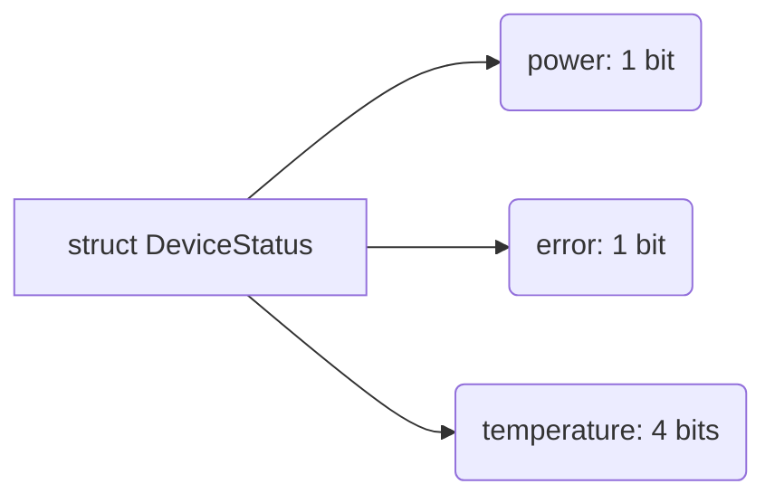
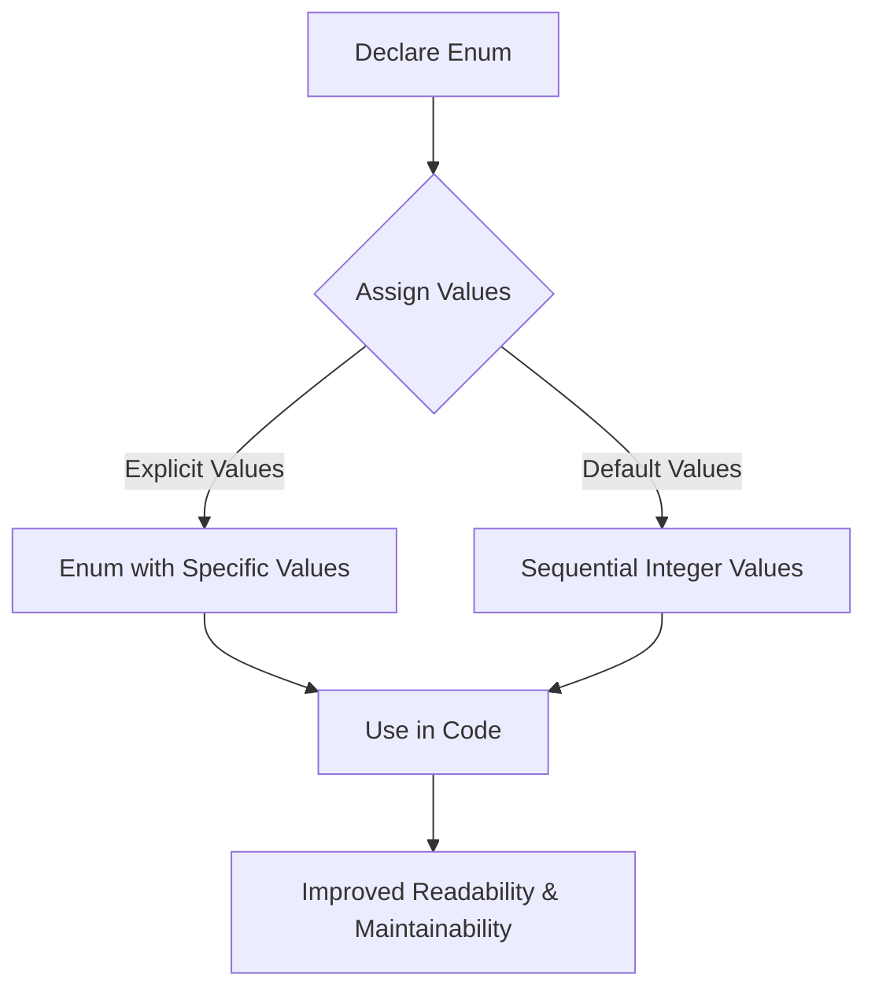

# <span style="color:#e67e22;">What we will learn in this post?</span>
<ul style='list-style-type: none; padding-left: 0;'>
<li><span style='color: #2980b9; font-size: 20px; font-weight: bold;'>👉</span> <span style='color: #2ecc71; font-size: 18px; font-weight: bold;'>C Structures</span></li>
<li><span style='color: #2980b9; font-size: 20px; font-weight: bold;'>👉</span> <span style='color: #2ecc71; font-size: 18px; font-weight: bold;'>dot (.) Operator in C</span></li>
<li><span style='color: #2980b9; font-size: 20px; font-weight: bold;'>👉</span> <span style='color: #2ecc71; font-size: 18px; font-weight: bold;'>C typedef</span></li>
<li><span style='color: #2980b9; font-size: 20px; font-weight: bold;'>👉</span> <span style='color: #2ecc71; font-size: 18px; font-weight: bold;'>Structure Member Alignment, Padding and Data Packing</span></li>
<li><span style='color: #2980b9; font-size: 20px; font-weight: bold;'>👉</span> <span style='color: #2ecc71; font-size: 18px; font-weight: bold;'>Flexible Array Members in a Structure in C</span></li>
<li><span style='color: #2980b9; font-size: 20px; font-weight: bold;'>👉</span> <span style='color: #2ecc71; font-size: 18px; font-weight: bold;'>C Unions</span></li>
<li><span style='color: #2980b9; font-size: 20px; font-weight: bold;'>👉</span> <span style='color: #2ecc71; font-size: 18px; font-weight: bold;'>Bit Fields in C</span></li>
<li><span style='color: #2980b9; font-size: 20px; font-weight: bold;'>👉</span> <span style='color: #2ecc71; font-size: 18px; font-weight: bold;'>Difference Between Structure and Union in C</span></li>
<li><span style='color: #2980b9; font-size: 20px; font-weight: bold;'>👉</span> <span style='color: #2ecc71; font-size: 18px; font-weight: bold;'>Anonymous Union and Structure in C</span></li>
<li><span style='color: #2980b9; font-size: 20px; font-weight: bold;'>👉</span> <span style='color: #2ecc71; font-size: 18px; font-weight: bold;'>Enumeration (or enum) in C</span></li>
<li><span style='color: #2980b9; font-size: 20px; font-weight: bold;'>👉</span> <span style='color: #2ecc71; font-size: 18px; font-weight: bold;'>Conclusion!</span></li>
</ul>

# <span style="color:#e67e22">Structures in C: Grouping Data Like a Pro 👨‍💻</span>

Imagine you're organizing a party. You need to keep track of each guest's name, age, and whether they're bringing a dish.  Instead of using separate variables for each guest's information, it's much more efficient to group them together. That's exactly what structures do in C!

## <span style="color:#2980b9">What are Structures? 🤔</span>

Structures, in C, are user-defined data types that allow you to combine different data types (like `int`, `float`, `char`, etc.) into a single unit. This grouping makes your code more organized, readable, and efficient, especially when dealing with complex data. Think of it as a blueprint for creating custom data containers.


### <span style="color:#8e44ad">Why Use Structures?</span>

*   **Organization:** Group related data together for better code readability.
*   **Efficiency:**  Avoids using multiple variables for related data.
*   **Modularity:** Creates reusable data structures.
*   **Data Integrity:** Enforces data relationships.


## <span style="color:#2980b9">Structure Syntax and Declaration ✍️</span>

The basic syntax for declaring a structure is:

```c
struct structure_name {
    data_type member1;
    data_type member2;
    data_type member3;
    // ... more members
};
```

Let's illustrate with an example:

```c
struct Guest {
    char name[50];  //Guest's name (character array)
    int age;        //Guest's age (integer)
    char bringingDish; // 'Y' or 'N' (character)
};
```

This declares a structure named `Guest` containing three members: `name`, `age`, and `bringingDish`.


## <span style="color:#2980b9">Creating and Using Structures ✨</span>

To use a structure, you first need to *declare a variable* of that structure type:

```c
struct Guest guest1; // Declares a variable 'guest1' of type 'Guest'
```

Now, you can access and assign values to the members using the dot (`.`) operator:

```c
strcpy(guest1.name, "Alice"); // Assigns "Alice" to guest1's name.
guest1.age = 30;               // Assigns 30 to guest1's age.
guest1.bringingDish = 'Y';     // Assigns 'Y' to guest1's bringingDish.
```


Here's a complete example showing structure declaration, variable creation, and member access:


```c
#include <stdio.h>
#include <string.h> // Needed for strcpy

struct Guest {
    char name[50];
    int age;
    char bringingDish;
};

int main() {
    struct Guest guest1;
    strcpy(guest1.name, "Bob");
    guest1.age = 25;
    guest1.bringingDish = 'N';

    printf("Guest Name: %s\n", guest1.name);
    printf("Guest Age: %d\n", guest1.age);
    printf("Bringing Dish: %c\n", guest1.bringingDish);
    return 0;
}
```


## <span style="color:#2980b9">Arrays of Structures ➕</span>

You can also create arrays of structures to manage multiple instances of the same structure type efficiently. For example, to store information about multiple guests:

```c
struct Guest guests[10]; // Array to hold information for 10 guests

for (int i = 0; i < 10; i++) {
    // Get guest information and assign it to guests[i]
}
```

## <span style="color:#2980b9">Structures and Functions 🤝</span>

You can pass structures to functions as arguments and return structures from functions. This further enhances code modularity and reusability.  Here's a simple example of passing a structure to a function:


```c
void printGuestInfo(struct Guest g) {
    printf("Guest Name: %s\n", g.name);
    printf("Guest Age: %d\n", g.age);
    printf("Bringing Dish: %c\n", g.bringingDish);
}
```


## <span style="color:#2980b9">Visual Representation 📊</span>

```mermaid
graph LR
A[struct Guest] --> B(name: char[50]);
A --> C(age: int);
A --> D(bringingDish: char);
```


## <span style="color:#2980b9">Further Learning 🚀</span>

*   **Learn more about C structures:** [GeeksforGeeks](https://www.geeksforgeeks.org/structures-in-c/)
*   **C Programming Tutorial:** [Cplusplus.com](https://www.cplusplus.com/doc/tutorial/structures/)


This comprehensive guide should give you a solid understanding of structures in C programming. Remember, practice is key!  Try creating your own structures to represent different real-world entities and experiment with their functionalities. Happy coding! 🎉


# <span style="color:#e67e22">Understanding the Dot (.) Operator in C</span> 📌

This guide explains the dot (`.`) operator in C, focusing on its use with structures. We'll use clear examples and visual aids to make learning fun and easy!


## <span style="color:#2980b9">What is a Structure in C?</span> 🏠

In C, a *structure* is a user-defined data type that groups together variables of different data types under a single name. Think of it like a container holding various items.  This allows you to organize related data efficiently.

**Example:**

```c
struct Student {
  char name[50];
  int rollNumber;
  float marks;
};
```

This code defines a structure named `Student` which contains a character array for the name, an integer for the roll number, and a float for the marks.


## <span style="color:#2980b9">The Dot (.) Operator: Accessing Structure Members</span> 🔑

The dot (`.`) operator is how you access the individual members (variables) within a structure. It's like a key that unlocks specific parts of your structure's "container."  You use it by writing the *structure variable name*, followed by a dot (`.`), and then the *member name*.

### <span style="color:#8e44ad">Example: Accessing Structure Members</span>

```c
#include <stdio.h>

struct Student {
  char name[50];
  int rollNumber;
  float marks;
};

int main() {
  struct Student student1;  // Declare a variable of type Student

  strcpy(student1.name, "Alice"); // Accessing name member using . operator
  student1.rollNumber = 101;     // Accessing rollNumber member
  student1.marks = 85.5;         // Accessing marks member

  printf("Name: %s\n", student1.name);
  printf("Roll Number: %d\n", student1.rollNumber);
  printf("Marks: %.1f\n", student1.marks);

  return 0;
}
```

In this example:

* `student1.name` accesses the `name` member of the `student1` structure.
* `student1.rollNumber` accesses the `rollNumber` member.
* `student1.marks` accesses the `marks` member.


## <span style="color:#2980b9">Visual Representation</span> 📊

Here's a simple Mermaid diagram to illustrate:

```mermaid
graph LR
    A[student1] --> B(name: "Alice");
    A --> C(rollNumber: 101);
    A --> D(marks: 85.5);
    style A fill:#f9f,stroke:#333,stroke-width:2px
```


## <span style="color:#2980b9">More Complex Example:  Structures within Structures</span> 📦

You can even have structures *inside* other structures!  The dot operator works the same way, chaining together to access nested members.

```c
struct Address {
  char street[100];
  char city[50];
};

struct Student {
  char name[50];
  struct Address address; // Nested structure
};

int main() {
  struct Student student2;
  strcpy(student2.name, "Bob");
  strcpy(student2.address.street, "123 Main St");
  strcpy(student2.address.city, "Anytown");
  printf("Student Name: %s, City: %s\n", student2.name, student2.address.city);
  return 0;
}
```

Here, `student2.address.city` accesses the `city` member of the `address` member within the `student2` structure.


## <span style="color:#2980b9">Key Points to Remember 💡</span>

* The dot (`.`) operator is essential for accessing individual members of a structure in C.
* It's used by writing `structure_variable.member_name`.
* You can nest structures, and the dot operator can be chained to access nested members.


## <span style="color:#2980b9">Further Resources 🚀</span>

* [C Structures Tutorial](https://www.tutorialspoint.com/cprogramming/c_structures.htm)
* [C Programming Language (Book)](https://www.amazon.com/Programming-Language-2nd-Brian-Kernighan/dp/0131103628)  (A classic!)


Remember to practice! The best way to master the dot operator is to experiment with creating and manipulating your own structures.  Good luck! 🎉


# <span style="color:#e67e22">Understanding `typedef` in C 🧡</span>


The `typedef` keyword in C is a powerful tool that lets you create **aliases** or **alternative names** for existing data types.  Think of it like giving a nickname to something already existing. It doesn't create a new data type itself, but it makes your code cleaner, more readable, and easier to maintain.


## <span style="color:#2980b9">Why Use `typedef`? 🤔</span>

* **Improved Readability:**  Using descriptive aliases can make your code much easier to understand, especially when dealing with complex data structures.  Instead of `unsigned long long int`, you could use `uint64_t` – much clearer!

* **Portability:**  `typedef` helps in making your code more portable across different systems. If you need to change the underlying data type later, you only need to modify the `typedef` declaration, not every instance of the old type in your code.

* **Abstraction:** It enhances code abstraction by hiding implementation details.  This makes your code less dependent on specific data types.


## <span style="color:#2980b9">How to Use `typedef` ✨</span>


The basic syntax is:


```c
typedef existing_type new_type_name;
```

Where:

* `existing_type` is the original data type (e.g., `int`, `float`, `struct my_struct`).
* `new_type_name` is the alias you're creating.


### <span style="color:#8e44ad">Examples 💡</span>


**1. Simple Type Aliases:**

```c
typedef int integer; // 'integer' is now an alias for 'int'
typedef unsigned char byte; // 'byte' is now an alias for 'unsigned char'
typedef float real; // 'real' is now an alias for 'float'

int main() {
  integer x = 10;
  byte y = 255;
  real z = 3.14;
  return 0;
}
```

**2. Aliasing Structures:**

```c
typedef struct {
  char name[50];
  int age;
  float salary;
} Employee;

int main() {
  Employee emp1; // Declare a variable of type 'Employee'
  strcpy(emp1.name, "Alice"); 
  emp1.age = 30;
  emp1.salary = 60000.0;
  return 0;
}
```

**3. Aliasing Pointers:**

```c
typedef char* string; // 'string' is now an alias for 'char*'

int main() {
  string message = "Hello, typedef!";
  printf("%s\n", message); //Prints "Hello, typedef!"
  return 0;
}
```


## <span style="color:#2980b9">Illustrative Mermaid Diagram 📊</span>


```mermaid
graph LR
A[Existing Data Type (e.g., int)] --> B{typedef keyword};
B --> C[New Type Alias (e.g., myInt)];
C --> D[Usage in Code];
```


This diagram shows how `typedef` maps an existing data type to a new alias.


## <span style="color:#2980b9">Advantages & Disadvantages ⚖️</span>


**Advantages:**

* Increased readability and maintainability.
* Enhanced code portability.
* Improved code abstraction.


**Disadvantages:**

* Can potentially make code harder to understand if aliases are not chosen carefully.
* Overuse can lead to a confusing naming scheme.


## <span style="color:#2980b9">Further Reading 🚀</span>


* [C Standard Library Reference](https://en.cppreference.com/w/c) – Find comprehensive information on C data types and standard library functions.
* [Learn C Programming](https://www.learn-c.org/) – A good resource for learning the basics of C programming.

Remember to choose meaningful and descriptive names for your type aliases to maximize the benefits of `typedef`! Using emojis and other visual elements throughout your code (though not directly in the C code itself!) can greatly improve the readability and memorability of concepts like this one.


# <span style="color:#e67e22">Understanding Structure Member Alignment, Padding, and Data Packing in C 📦</span>

C structures group different data types together.  However, how the compiler arranges these members in memory isn't always straightforward.  This involves *alignment*, *padding*, and *packing*, concepts crucial for understanding memory efficiency and program performance. Let's unpack them!


## <span style="color:#2980b9">Structure Member Alignment 📏</span>

Alignment refers to how each structure member is positioned in memory.  Compilers often align members to address boundaries that are multiples of their data type size.  This improves access speed, especially on certain architectures.

### <span style="color:#8e44ad">Why Alignment Matters 🤔</span>

* **Performance:**  Aligned data access is typically faster. Processors can fetch data more efficiently when it's located at memory addresses that are multiples of their word size (e.g., 4 bytes for 32-bit architectures, 8 bytes for 64-bit).

* **Hardware Restrictions:** Some hardware architectures might even *require* aligned access; unaligned access can lead to exceptions or slower performance.

### <span style="color:#8e44ad">Example 💡</span>

Let's say we have a structure:

```c
struct MyStruct {
  char a;       // 1 byte
  int b;        // 4 bytes
  short c;      // 2 bytes
};
```

On a system with 4-byte alignment, the compiler might arrange this in memory like so:


```mermaid
graph LR
    A[char a (1 byte)] --> B(Padding: 3 bytes);
    B --> C[int b (4 bytes)];
    C --> D[short c (2 bytes)];
    D --> E(Padding: 2 bytes);
```

Notice the padding bytes added to ensure that `int b` starts at a 4-byte boundary.  The total size of `struct MyStruct` is *12 bytes*, not 7 (1 + 4 + 2).


## <span style="color:#2980b9">Padding 填充</span>

Padding is the extra space added to a structure to ensure proper alignment.  It's essentially wasted space used to fulfill alignment requirements.  As shown in the example above, padding increased the size of the structure from 7 bytes to 12 bytes.


## <span style="color:#2980b9">Data Packing 📦</span>

Data packing aims to minimize the size of a structure by reducing or eliminating padding.  Some compilers provide options (like `#pragma pack`) to control the alignment of structure members.  However, forcefully packing data can sometimes lead to performance degradation due to unaligned access.

### <span style="color:#8e44ad">Example with Packing 🗜️</span>

Using a hypothetical `#pragma pack(1)` directive (the syntax varies across compilers), we could force 1-byte alignment:


```c
#pragma pack(1) 
struct MyPackedStruct {
  char a;
  int b;
  short c;
};
#pragma pack() // Reset packing
```

Now `struct MyPackedStruct` would likely only occupy 7 bytes, but accessing `int b` might be slower on some systems.


## <span style="color:#2980b9">Impact on Memory Usage 💾</span>

* **Larger Structures:** Unnecessary padding can significantly inflate the size of structures, especially when they contain many members of varying sizes.  This leads to increased memory consumption and potentially slower data transfer.

* **Arrays of Structures:**  The impact of padding is amplified when you have arrays of structures.  A small amount of padding per structure can accumulate to a substantial overhead in a large array.

* **Memory Fragmentation:** In dynamic memory allocation, excessive padding can contribute to memory fragmentation, making it harder to find contiguous blocks of memory for future allocations.


## <span style="color:#2980b9">Best Practices 🎯</span>

* **Understand your architecture:**  Know your compiler and target system's alignment rules.
* **Optimize carefully:**  Avoid excessive packing unless you're dealing with very strict memory constraints.  The performance hit of unaligned access can outweigh the memory savings.
* **Use appropriate data types:** Choose data types that fit your needs without unnecessarily increasing the structure's size.


**Resources for Further Learning:**

* [Compilers and Structure Padding](https://www.geeksforgeeks.org/structure-member-alignment-padding-and-data-packing/)
* [Understanding Structure Packing in C/C++](https://www.tutorialspoint.com/cprogramming/c_structures.htm)


Remember, balancing memory efficiency and performance is key!  Understanding structure alignment, padding, and packing allows you to make informed decisions about data structure design in C to achieve the best results for your specific application.


# <span style="color:#e67e22">Flexible Array Members 🤸 in C Structures</span>

Flexible array members (FAMs) are a powerful feature in C that allows you to create structures with dynamically sized arrays as their last member.  This enables you to build more efficient and flexible data structures without resorting to more complex techniques like separate heap allocations for the arrays. Let's dive in!


## <span style="color:#2980b9">Understanding Flexible Array Members 🤔</span>

A flexible array member is simply an array of unspecified size placed as the last member of a structure.  The compiler knows to allocate *no* space for the array itself within the structure; the array's size is determined dynamically when you allocate memory for the structure. Think of it as a placeholder for an array that will be filled later.

**Key Characteristics:**

*   **Last Member:**  The FAM *must* be the last member of the structure.
*   **Unspecified Size:**  The array's size is not specified during declaration.  It's represented as `type array[];`
*   **Dynamic Allocation:**  Memory for the structure *and* the array is allocated together using `malloc()` (or `calloc()`).
*   **Efficiency:** Avoids the overhead of separate memory allocations for the structure and the array.


### <span style="color:#8e44ad">Why Use Flexible Array Members?</span>

FAMs provide a concise and efficient way to handle variable-length data within structures. This is particularly useful when:

*   You don't know the size of the array at compile time.
*   You want to avoid the fragmentation and overhead associated with dynamically allocating separate memory blocks for the structure and the array.
*   You are working with data structures that need to resize based on runtime conditions.


## <span style="color:#2980b9">Declaration and Usage 📝</span>

Let's illustrate with an example:  Imagine you're creating a structure to store information about students, including a variable number of exam scores.

```c
#include <stdio.h>
#include <stdlib.h>

// Structure declaration with a flexible array member
typedef struct {
    char name[50];
    int id;
    int num_scores;
    int scores[]; // Flexible array member
} Student;

int main() {
    int num_scores = 5; // Number of exam scores

    // Allocate memory for the structure and the array
    Student *student = malloc(sizeof(Student) + num_scores * sizeof(int));

    if (student == NULL) {
        perror("Memory allocation failed");
        return 1;
    }

    strcpy(student->name, "Alice");
    student->id = 12345;
    student->num_scores = num_scores;

    // Assign scores
    for (int i = 0; i < num_scores; i++) {
        student->scores[i] = 85 + i; // Example scores
    }

    // Access and print scores
    printf("Student Name: %s\n", student->name);
    printf("Student ID: %d\n", student->id);
    printf("Exam Scores: ");
    for (int i = 0; i < student->num_scores; i++) {
        printf("%d ", student->scores[i]);
    }
    printf("\n");

    free(student); // Always free allocated memory
    return 0;
}
```

### <span style="color:#8e44ad">Memory Allocation Breakdown 🧱</span>

The crucial part is the memory allocation:

```c
Student *student = malloc(sizeof(Student) + num_scores * sizeof(int));
```

This allocates enough memory for:

1.  The `Student` structure itself (`sizeof(Student)`).  Note that this *does not* include the space for the `scores` array.
2.  An array of `num_scores` integers (`num_scores * sizeof(int)`). This is appended directly after the structure in memory.


## <span style="color:#2980b9">Illustrative Diagram 📊</span>

```mermaid
graph LR
    A[Student Structure] --> B(name[50]);
    A --> C(id);
    A --> D(num_scores);
    A --> E{scores[]};
    E --> F[int score1];
    E --> G[int score2];
    E --> H[int scoreN];
    subgraph "Memory Allocation"
        E -.-> F;
        E -.-> G;
        E -.-> H;
    end
```


## <span style="color:#2980b9">Advanced Usage and Considerations ⚠️</span>


*   **Error Handling:** Always check the return value of `malloc()` to handle potential memory allocation failures.
*   **`sizeof` Operator:**  `sizeof(student)` only gives the size of the structure itself, *not* including the flexible array member.
*   **Memory Management:**  Remember to `free()` the dynamically allocated memory when it's no longer needed to avoid memory leaks.


## <span style="color:#2980b9">Resources for Further Learning 📚</span>

*   [C Standard (ISO/IEC 9899:2018): Section 6.7.2.1 Structure and union specifiers](https://port70.net/c/c11/n1570.html#6.7.2.1) (Official standard, may be dense for beginners)
*   [Various C Tutorials on Structures and Dynamic Memory Allocation](Search on your preferred search engine for "C structures dynamic memory allocation")


By understanding and utilizing flexible array members, you can write more efficient and elegant C code for handling dynamic data structures. Remember to always handle memory carefully! 🎉


# <span style="color:#e67e22">Unions in C: Sharing Memory Space 🤝</span>

Imagine a single apartment that can be rented out to different tenants at different times.  That's essentially what a union in C does – it allows you to store different data types in the *same* memory location.  Only one member of the union can hold a value at any given time. This is different from a `struct`, which allocates separate memory for each member.

## <span style="color:#2980b9">Understanding Union Declaration 📝</span>

A union is declared using the `union` keyword, followed by the union name, and then a list of members enclosed in curly braces `{}`.  Each member has a data type and a name.  The size of a union is determined by the size of its *largest* member.

### <span style="color:#8e44ad">Example Union Declaration</span>

```c
union Data {
  int i;
  float f;
  char str[20];
};
```

This declares a union named `Data` that can hold an integer (`int`), a floating-point number (`float`), or a character array (`char str[20]`).  All three members share the same memory location.

---

## <span style="color:#2980b9">Union Usage and Accessing Members 🔑</span>

To use a union, you declare a variable of the union type and access its members using the dot operator (`.`).


### <span style="color:#8e44ad">Example Union Usage</span>

```c
#include <stdio.h>

union Data {
  int i;
  float f;
  char str[20];
};

int main() {
  union Data data;

  data.i = 10; // Store an integer
  printf("Integer: %d\n", data.i);

  data.f = 3.14f; // Store a float
  printf("Float: %f\n", data.f);

  strcpy(data.str, "Hello"); //Store a string
  printf("String: %s\n", data.str);


  return 0;
}
```

**Important Note:**  Only one member of the union can hold a valid value at a time. If you change the value of one member, the values of other members become undefined and accessing them can lead to unexpected results.  This is why unions need careful management.

---

## <span style="color:#2980b9">Memory Representation 📊</span>


```mermaid
graph LR
    A[Union Variable] --> B(int i);
    A --> C(float f);
    A --> D(char str[20]);
    subgraph Memory Location
        B;C;D;
    end
```

This diagram shows how the members of a union share the same memory location.  The size of the union will be the size of the largest member (in this case, likely `char str[20]`).


---

## <span style="color:#2980b9">When to Use Unions 🤔</span>

* **Saving memory:** When you need to store different types of data but don't need them all at the same time, unions can reduce memory consumption compared to using separate variables.
* **Representing data with different interpretations:**  Unions can be useful when you have data that can be interpreted in multiple ways.  For example, a memory location might hold either an integer or a floating-point number, depending on the context.
* **Bit-level manipulation:**  Unions can help in accessing and manipulating individual bits or bytes within a larger data structure.


## <span style="color:#2980b9">Caveats and Considerations ⚠️</span>

* **Undefined behavior:**  Accessing a union member after another member has been assigned a value can lead to undefined behavior if the types of members are different and of incompatible sizes.
* **Careful management:**  You must carefully track which member of the union currently holds a valid value to avoid errors.
* **Portability:**  The size and alignment of union members can be platform-dependent.


---

## <span style="color:#2980b9">Further Resources 📚</span>

* [C Standard (ISO/IEC 9899): Unions](https://port70.net/c/c99/n1256.html) *(This link might require some navigating to find relevant section on unions)*
* [Learn C.org Unions](https://www.learn-c.org/en/Structures_and_unions) *(A more beginner-friendly resource)*


This detailed explanation with visuals should give you a solid understanding of unions in C. Remember to always use them carefully and be mindful of their limitations!


# <span style="color:#e67e22">Bit Fields: Packing Data Efficiently in C 📦</span>


Bit fields in C are a powerful way to pack data structures tightly, saving memory and potentially improving performance.  They allow you to explicitly specify the number of bits used for each member of a structure. This is particularly useful when dealing with hardware registers, embedded systems, or situations where memory is a constraint.


## <span style="color:#2980b9">Understanding Bit Fields 💡</span>


Imagine you need to store information about a device's status:  a power status (on/off), an error flag (yes/no), and a temperature sensor reading (0-15).  Each of these could be represented by a full `int` (typically 32 bits), but that's wasteful!  With bit fields, you can assign each status only as many bits as it needs.


### <span style="color:#8e44ad">Defining Bit Fields</span>

Bit fields are declared within a `struct` definition using the colon `:` followed by the number of bits allocated.

```c
struct DeviceStatus {
  unsigned int power : 1; // 1 bit for power status (0=off, 1=on)
  unsigned int error : 1; // 1 bit for error flag (0=no error, 1=error)
  unsigned int temperature : 4; // 4 bits for temperature (0-15)
};
```

*   **`unsigned int`**:  We use an unsigned integer type as a base. You could also use `signed int` if you need negative values, but be mindful of the range of values based on the number of bits.
*   **`: 1` or `: 4`**: This specifies the number of bits allocated to each member.


## <span style="color:#2980b9">Example Usage 🚀</span>


```c
#include <stdio.h>

struct DeviceStatus {
  unsigned int power : 1;
  unsigned int error : 1;
  unsigned int temperature : 4;
};

int main() {
  struct DeviceStatus status;

  // Assign values
  status.power = 1;  // Power ON
  status.error = 0; // No error
  status.temperature = 10; // Temperature = 10

  // Print values
  printf("Power: %u\n", status.power);
  printf("Error: %u\n", status.error);
  printf("Temperature: %u\n", status.temperature);

  return 0;
}
```

This code shows how to define a `DeviceStatus` struct using bit fields and how to assign and access values.


## <span style="color:#2980b9">Memory Efficiency ✨</span>


Let's analyze the memory usage:


*   **Without bit fields:** Three separate `int` variables (32 bits each) would use 96 bits (12 bytes).
*   **With bit fields:**  The `DeviceStatus` struct uses only 6 bits (less than 1 byte)!  The compiler packs the members together efficiently.

This illustrates the significant memory savings achievable through bit fields.


## <span style="color:#2980b9">Important Considerations 🤔</span>


*   **Compiler-dependent packing:** The way the compiler packs bit fields might vary.  Generally, it packs them left-to-right within a word, but it's not guaranteed.  Explicit padding might be needed for certain alignment requirements.
*   **Portability:** Code using bit fields might not be perfectly portable across different compilers or architectures.
*   **Readability:** While efficient, overusing bit fields can reduce code readability. It's crucial to strike a balance between efficiency and maintainability.


## <span style="color:#2980b9">Visual Representation 📊</span>





This diagram shows how the members of the `DeviceStatus` struct are packed within memory.


## <span style="color:#2980b9">Further Resources 🔗</span>


*   [C Standard (ISO/IEC 9899:2018): 6.7.2.1 Structure and union specifiers](https://port70.net/c/c17/n1570.html#6.7.2.1) (Formal specification of bit fields)
*   [Learn more about C data structures](https://www.tutorialspoint.com/cprogramming/c_structures.htm)  (General C structure tutorial)


Remember, bit fields are powerful but require careful consideration of compiler behavior, portability, and code clarity.  Use them judiciously when memory optimization is paramount.


# <span style="color:#e67e22">Structures vs. Unions in C: A Deep Dive 🏠</span>


C offers two powerful ways to group different data types together: structures and unions. While both seem similar at first glance, they differ significantly in how they allocate memory and are used. Let's explore these differences with clear examples.

## <span style="color:#2980b9">Structures 📦</span>

### <span style="color:#8e44ad">Memory Allocation and Usage</span>

Structures, declared using the `struct` keyword, allocate memory for *each* member variable sequentially.  Think of it like a small apartment building where each member gets its own room.  The total size of the structure is the sum of the sizes of all its members.

**Example:**

```c
struct Person {
    char name[50];
    int age;
    float height;
};

int main() {
    struct Person person1;
    strcpy(person1.name, "Alice");
    person1.age = 30;
    person1.height = 5.8;
    return 0;
}
```

In this example, `person1` will occupy memory sufficient to store a 50-character array, an integer, and a floating-point number – all individually.

**Memory Diagram:**

```mermaid
graph LR
    A[name (50 bytes)] --> B{person1};
    C[age (4 bytes)] --> B;
    D[height (4 bytes)] --> B;
```

### <span style="color:#8e44ad">Key Characteristics</span>

*   **Individual Memory:** Each member gets its own dedicated memory space.
*   **Size:** Total size is the sum of member sizes (potentially padded for alignment).
*   **Access:** Members are accessed using the dot (`.`) operator (e.g., `person1.age`).


## <span style="color:#2980b9">Unions 🤝</span>

### <span style="color:#8e44ad">Memory Allocation and Usage</span>

Unions, declared using the `union` keyword, allocate memory only for the *largest* member. All members share the same memory location. Imagine a single room apartment where different furniture can be placed, but only one piece of furniture can fit at a time.

**Example:**

```c
union Data {
    int i;
    float f;
    char str[20];
};

int main() {
    union Data data;
    data.i = 10; // Occupies the entire memory space.
    printf("%d\n", data.i);
    data.f = 3.14; // Overwrites the integer value.
    printf("%f\n", data.f);
    return 0;
}
```

Here, `data` will only occupy the space needed for the `str[20]` member (20 bytes, or potentially more depending on padding).  Accessing `data.i`, `data.f`, or `data.str` will all point to this *same* memory location.

**Memory Diagram:**

```mermaid
graph LR
    A[Shared Memory (20 bytes)] --> B{data};
    B --> C[i (4 bytes) / f (4 bytes) / str (20 bytes)];
```

### <span style="color:#8e44ad">Key Characteristics</span>

*   **Shared Memory:** All members share the same memory location.
*   **Size:** Size is equal to the size of the largest member (potentially padded for alignment).
*   **Access:** Only one member can be meaningfully accessed at a time. Accessing a member after another member has been written to might lead to unexpected behavior.  Using the wrong member after setting another will cause data corruption.


## <span style="color:#2980b9">Key Differences Summarized 📝</span>


| Feature         | Structure                               | Union                                    |
|-----------------|-------------------------------------------|---------------------------------------------|
| Memory Allocation | Separate memory for each member          | Shared memory for all members             |
| Size            | Sum of member sizes (plus padding)       | Size of the largest member (plus padding)  |
| Access          | All members accessible simultaneously     | Only one member accessible at a time       |
| Usage           | Representing a collection of related data | Representing data that can have different types at different times |


## <span style="color:#2980b9">When to Use Which 🤔</span>


*   **Structures:** Ideal for grouping related data of different types where you need to access all members simultaneously.  For example, representing a `Person` with name, age, and height.
*   **Unions:** Useful when you need to store different types of data in the same memory location, but only one at a time.  For example, representing a `Value` that can be either an integer, a float, or a string.  (Note: This pattern is less common in modern C++ as variants provide a type-safe alternative).

## <span style="color:#2980b9">Further Reading 📚</span>

*   [C Programming Tutorial on Structures](https://www.tutorialspoint.com/cprogramming/c_structures.htm)
*   [C Programming Tutorial on Unions](https://www.tutorialspoint.com/cprogramming/c_unions.htm)
*   [Learn C the Hard Way](https://c.learncodethehardway.org/) (A great resource for learning C comprehensively)


Remember to always be mindful of memory management and potential data corruption when working with unions.  Structures are generally safer and easier to use for most scenarios. Using the correct data type is crucial to avoid any issues with memory management and data access.


# <span style="color:#e67e22">Anonymous Unions and Structures in C 🤝</span>

Anonymous structures and unions in C offer a powerful way to manage data, simplifying code and improving readability.  They allow you to define a structure or union without explicitly naming it, making them particularly useful in specific scenarios. Let's delve into their purpose and explore how they streamline code.

## <span style="color:#2980b9">What are Anonymous Structures and Unions? 🤔</span>

Essentially, anonymous structures and unions are structures and unions *without* a name.  This might sound strange, but it's incredibly useful when you only need the data they contain, and don't need to refer to them by name elsewhere in your code.

### <span style="color:#8e44ad">The Power of Anonymity ✨</span>

*   **Reduced Code Clutter:**  By eliminating the need for a separate declaration and name, you reduce the overall size and complexity of your code.
*   **Improved Readability:** The code becomes more focused on the data itself rather than on naming conventions.
*   **Efficient Data Embedding:** Anonymous structures are especially helpful for embedding data directly within another structure or union.


## <span style="color:#2980b9">Anonymous Structures in Action 🏗️</span>

Let's illustrate with an example. Suppose you have a structure to represent a point in 2D space:

```c
// Named structure
struct Point {
    float x;
    float y;
};

int main() {
    struct Point p = {10.0f, 20.0f}; // Requires the struct name
    return 0;
}
```

Now, let's see how to achieve the same using an *anonymous* structure:


```c
#include <stdio.h>

int main() {
    struct { // Anonymous structure
        float x;
        float y;
    } p = {10.0f, 20.0f}; // No struct name needed!
    printf("x: %f, y: %f\n", p.x, p.y); // Access members directly
    return 0;
}
```

Notice how we've defined the structure directly within `main()` without giving it a name. We can still access its members (`p.x` and `p.y`) directly.


## <span style="color:#2980b9">Anonymous Unions: A Different Perspective 🎭</span>

Anonymous unions are similar, but leverage the overlapping memory characteristic of unions.  Here's an example where we might want to represent a value that could be an integer or a floating-point number:

```c
#include <stdio.h>

int main() {
    union {
        int i;
        float f;
    } u;

    u.i = 10;
    printf("Integer value: %d\n", u.i);

    u.f = 3.14f;
    printf("Float value: %f\n", u.f);

    return 0;
}
```

Again, no name is given to the union.  Remember that in a union, only one member can hold a value at a time due to the shared memory space.

## <span style="color:#2980b9">When to Use Anonymous Structures/Unions? 🤔</span>

*   **Nested Structures:** Embedding simple structures within larger ones without the need for extra naming.
*   **Temporary Data:** When a structure or union is only needed within a specific function or block of code.
*   **Data Hiding:**  In some cases, this can lead to cleaner code by keeping the internal structure hidden from the rest of the program.


## <span style="color:#2980b9">Caveats and Considerations ⚠️</span>

*   **Scope:** Anonymous structures and unions are only accessible within the block of code where they are defined.
*   **Forward Declarations:** You can't use forward declarations with anonymous structures.
*   **Pointers:** It's generally *not* recommended to take pointers to anonymous structures unless you have a very specific and well-understood reason to do so (it can lead to code that's hard to maintain and debug).


## <span style="color:#2980b9">Further Resources 📚</span>

*   [C Standard (relevant sections on structures and unions):](https://port70.net/~nsz/c/c17draft/) *(You'll need to search for the relevant sections on structures and unions)*
*   [Online C Tutorials (Search for "C structures and unions"):](https://www.google.com/search?q=c+structures+and+unions+tutorial)  *(Many online resources cover this topic in detail)*


This guide provides a fundamental understanding of anonymous structures and unions in C.  Remember that while they are powerful tools, careful consideration of their limitations is necessary to prevent unexpected issues in your code.  Happy coding! 🎉


# <span style="color:#e67e22">Enumerations (Enums) in C 🥭</span>

Enums in C are a fantastic way to make your code more readable and maintainable.  They let you define a set of named integer constants, making your code easier to understand and less prone to errors. Think of them as giving meaningful names to numbers!

## <span style="color:#2980b9">What are Enums? 🤔</span>

Imagine you're writing a program that deals with the days of the week.  Instead of using magic numbers like `0` for Sunday, `1` for Monday, etc., you can use an enum to define these days with descriptive names:

```c
enum DayOfWeek {
  SUNDAY,
  MONDAY,
  TUESDAY,
  WEDNESDAY,
  THURSDAY,
  FRIDAY,
  SATURDAY
};
```

This declares an enumeration type called `DayOfWeek`. By default, `SUNDAY` is assigned the value `0`, `MONDAY` is `1`, and so on.  You can explicitly assign values if needed:

```c
enum DayOfWeek {
  SUNDAY = 0,
  MONDAY = 1,
  TUESDAY = 2,
  WEDNESDAY = 3,
  THURSDAY = 4,
  FRIDAY = 6, //Skip Friday deliberately.
  SATURDAY = 7
};
```

### <span style="color:#8e44ad">Advantages of Using Enums ✨</span>

*   **Improved Readability:**  Instead of `if (day == 2)` you can write `if (day == TUESDAY)`, making the code self-documenting.
*   **Reduced Errors:** Using names reduces the risk of typos and accidentally using incorrect numbers.
*   **Easier Maintenance:** If you need to change the underlying integer values, you only need to modify the enum declaration, not every instance where the numbers are used.


## <span style="color:#2980b9">Declaring and Using Enums 🛠️</span>

Here's a complete example demonstrating enum declaration and usage:

```c
#include <stdio.h>

enum Color {
  RED = 1,
  GREEN = 2,
  BLUE = 4
};

int main() {
  enum Color favColor = RED;

  if (favColor == RED) {
    printf("Your favorite color is Red!\n");
  } else if (favColor == GREEN) {
    printf("Your favorite color is Green!\n");
  } else if (favColor == BLUE){
    printf("Your favorite color is Blue!\n");
  }

  return 0;
}
```


## <span style="color:#2980b9">Enum with Explicit Values 🔢</span>

You can assign specific integer values to enum members:

```c
enum Status {
  INACTIVE = 0,
  PENDING = 1,
  ACTIVE = 2,
  ARCHIVED = -1 //Negative values are allowed!
};
```


## <span style="color:#2980b9">Underlying Integer Type ⚙️</span>

By default, enums in C are typically of `int` type.  However, you can specify a different underlying type if needed (e.g., `unsigned char`, `short int`, etc.):

```c
enum SmallEnum : unsigned char {
  VALUE1,
  VALUE2
};
```


## <span style="color:#2980b9">Visual Representation (Flowchart) 📊</span>




## <span style="color:#2980b9">Further Resources 📚</span>

*   [C Standard - Enums](https://en.cppreference.com/w/c/language/enum) (Official C documentation on enumerations)
*   [Learn C - Enumerations](https://www.learn-c.org/en/Enums) (A beginner-friendly tutorial)


Remember, enums are a powerful tool for enhancing code clarity and maintainability in C. Use them effectively to write better, more robust programs! 🎉


Here are a few options for a blog post conclusion, all under 150 words and using the specified formatting:


**Option 1:**

<h1><span style='color:#e67e22'>Conclusion</span></h1>

And there you have it!  I hope you enjoyed this post.  I'd love to hear your thoughts – what did you think?  Any questions or suggestions? Let me know in the comments below! 👇😊


**Option 2:**

<h1><span style='color:#e67e22'>Conclusion</span></h1>

So, that's a wrap!  Thanks for reading.  What are your experiences with this? Share your insights and stories in the comments!  I'm excited to hear from you!  💬🎉


**Option 3:**

<h1><span style='color:#e67e22'>Conclusion</span></h1>

Wrapping things up!  This topic is near and dear to my heart, so I really value your feedback.  Let's chat in the comments – what did you find most helpful?  Any ideas for future posts? 🤔👍


**Option 4:**

<h1><span style='color:#e67e22'>Conclusion</span></h1>

Well, that's all for now folks!  I hope you found this useful. Don't be shy – share your thoughts, questions, or even just a friendly "hello" in the comments section below!  👋


**Option 5:**

<h1><span style='color:#e67e22'>Conclusion</span></h1>

To summarise, [briefly summarise main point].  What are your thoughts?  Let's discuss it in the comments!  I can't wait to read what you have to say!  🗣️✨


