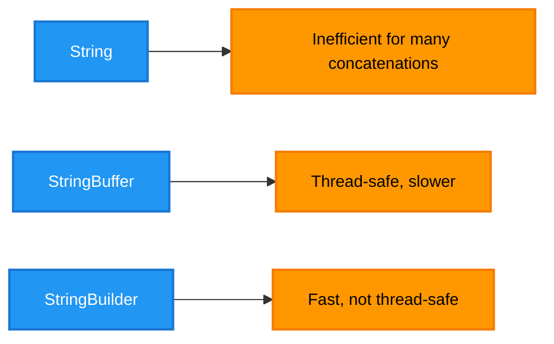
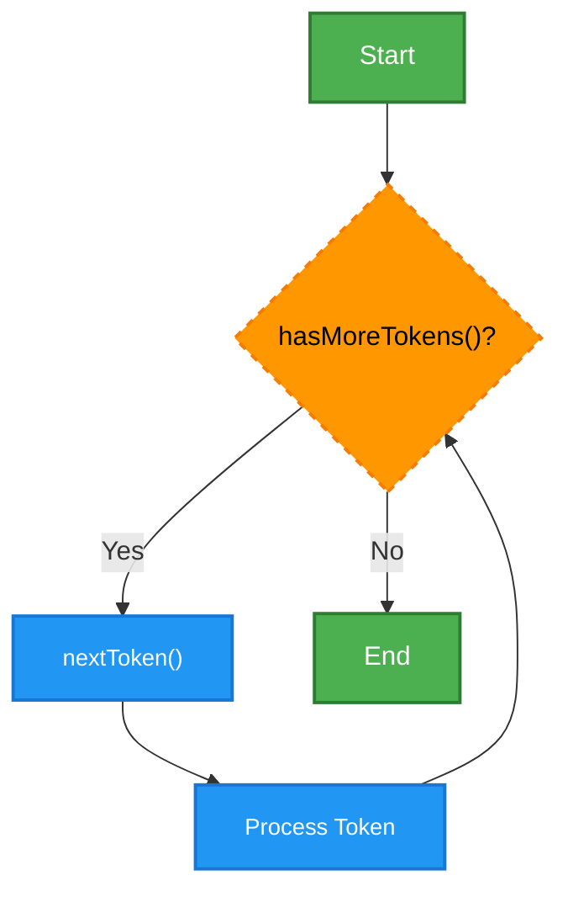

# <span style="color:#e67e22;">What we will learn in this post?</span>

<ul style='list-style-type: none; padding-left: 0;'>
<li><span style='color: #2980b9; font-size: 20px; font-weight: bold;'>👉</span> <span style='color: #2ecc71; font-size: 18px; font-weight: bold;'>Introduction of Strings in Java</span></li>
<li><span style='color: #2980b9; font-size: 20px; font-weight: bold;'>👉</span> <span style='color: #2ecc71; font-size: 18px; font-weight: bold;'>String Class in Java Set-1</span></li>
<li><span style='color: #2980b9; font-size: 20px; font-weight: bold;'>👉</span> <span style='color: #2ecc71; font-size: 18px; font-weight: bold;'>String Class in Java Set-2</span></li>
<li><span style='color: #2980b9; font-size: 20px; font-weight: bold;'>👉</span> <span style='color: #2ecc71; font-size: 18px; font-weight: bold;'>Why Strings are Immutable in Java?</span></li>
<li><span style='color: #2980b9; font-size: 20px; font-weight: bold;'>👉</span> <span style='color: #2ecc71; font-size: 18px; font-weight: bold;'>StringBuffer Class in Java</span></li>
<li><span style='color: #2980b9; font-size: 20px; font-weight: bold;'>👉</span> <span style='color: #2ecc71; font-size: 18px; font-weight: bold;'>StringBuilder Class in Java</span></li>
<li><span style='color: #2980b9; font-size: 20px; font-weight: bold;'>👉</span> <span style='color: #2ecc71; font-size: 18px; font-weight: bold;'>Strings vs StringBuffer vs StringBuilder in Java</span></li>
<li><span style='color: #2980b9; font-size: 20px; font-weight: bold;'>👉</span> <span style='color: #2ecc71; font-size: 18px; font-weight: bold;'>StringTokenizer Class in Java Set-1</span></li>
<li><span style='color: #2980b9; font-size: 20px; font-weight: bold;'>👉</span> <span style='color: #2ecc71; font-size: 18px; font-weight: bold;'>StringTokenizer Class in Java Set-2</span></li>
<li><span style='color: #2980b9; font-size: 20px; font-weight: bold;'>👉</span> <span style='color: #2ecc71; font-size: 18px; font-weight: bold;'>StringJoiner in Java</span></li>
<li><span style='color: #2980b9; font-size: 20px; font-weight: bold;'>👉</span> <span style='color: #2ecc71; font-size: 18px; font-weight: bold;'>Java String Programs</span></li>
<li><span style='color: #2980b9; font-size: 20px; font-weight: bold;'>👉</span> <span style='color: #2ecc71; font-size: 18px; font-weight: bold;'>Conclusion!</span></li>
</ul>

# <span style="color:#e67e22">Strings in Java 🧵</span>

Strings in Java are fundamental **data types** used to represent sequences of characters. Unlike primitive data types like `int`, `float`, or `boolean`, which store single values, strings hold multiple characters. They are objects, meaning they have methods associated with them for manipulation. This is a key difference; primitives hold data directly, while strings are references to objects containing the character data. Understanding this distinction is crucial when working with `Java data types`.

## <span style="color:#2980b9">String Initialization 👶</span>

### <span style="color:#8e44ad">Creating String Objects</span>

Strings can be initialized in several ways:

- **Direct assignment:** `String message = "Hello, world!";` This is the most common method. The string literal `"Hello, world!"` is assigned to the `message` variable.

- **Using the `new` keyword:** `String name = new String("Alice");` This creates a new String object in memory, although it's generally less efficient than direct assignment.

```java
public class StringExample {
    public static void main(String[] args) {
        String greeting = "Hello"; // Direct assignment
        String name = new String("Bob"); // Using new keyword
        System.out.println(greeting + ", " + name + "!");
    }
}
```

## <span style="color:#2980b9">Key Differences from other Data Types ⚖️</span>

- **Immutability:** Once a String object is created, its value cannot be changed. Any operation that appears to modify a string actually creates a _new_ string. This contrasts with mutable data types like arrays.

- **Object vs. Primitive:** Strings are objects, belonging to the `java.lang.String` class, and have associated methods (e.g., `length()`, `toUpperCase()`, `substring()`). Primitives are not objects.

- **Memory Management:** String objects are managed by Java's garbage collector, freeing up memory when no longer referenced, unlike manual memory management in some languages.

## <span style="color:#2980b9">Further Exploration 🚀</span>

For a deeper dive into Java strings and data types, consult the following resources:

- [Oracle Java Tutorials on Strings](https://docs.oracle.com/javase/tutorial/java/data/strings.html)
- [Oracle Java Tutorials on Data Types](https://docs.oracle.com/javase/tutorial/java/nutsandbolts/datatypes.html)

Remember to practice frequently to solidify your understanding! Happy coding! 😊

# <span style="color:#e67e22">The String Class in Java 🧵</span>

The `String` class in Java is fundamental for handling text. It's immutable, meaning once created, its value can't be changed (new Strings are created when modifications are needed). This ensures thread safety.

## <span style="color:#2980b9">Key Characteristics & Common Uses ✨</span>

- **Immutability:** A core feature impacting performance and thread safety.
- **Common Usage:** Storing and manipulating text data (e.g., names, addresses, sentences).

## <span style="color:#2980b9">Essential Java String Methods 🧰</span>

### <span style="color:#8e44ad">`length()`</span>

Returns the number of characters in a String.

```java
String str = "Hello";
int len = str.length(); // len will be 5
System.out.println("Length: " + len); // Output: Length: 5
```

### <span style="color:#8e44ad">`charAt()`</span>

Returns the character at a specific index (position).

```java
char ch = str.charAt(0); // ch will be 'H'
System.out.println("Character at index 0: " + ch); // Output: Character at index 0: H
```

### <span style="color:#8e44ad">`substring()`</span>

Extracts a portion of the String.

```java
String sub = str.substring(1, 4); // sub will be "ell"
System.out.println("Substring: " + sub); // Output: Substring: ell
```

Other important methods include `toLowerCase()`, `toUpperCase()`, `concat()`, `equals()`, `indexOf()`, and many more. For a complete list, refer to the [official Java documentation](https://docs.oracle.com/javase/7/docs/api/java/lang/String.html).

## <span style="color:#2980b9">Example Scenario: Name Manipulation 🧑‍💻</span>

Let's say we have a full name: `"John Doe"`. We can use `substring()` to get the first name and `length()` to check its length.

```java
String fullName = "John Doe";
String firstName = fullName.substring(0, fullName.indexOf(" "));
int firstNameLength = firstName.length();
System.out.println("First Name: " + firstName + ", Length: " + firstNameLength);
```

This example showcases basic String manipulation, but the `String` class offers much more for complex text processing. Explore the linked documentation to master the power of Java Strings!

# <span style="color:#e67e22">Advanced String Methods in Java 🧵</span>

This section dives into some powerful yet often overlooked _Java String features_ and _advanced String methods in Java_.

## <span style="color:#2980b9">Comparison and Case Conversion</span>

### <span style="color:#8e44ad">`equals()` and `compareTo()`</span>

The `equals()` method checks for content equality, ignoring case. `compareTo()` performs a lexicographical comparison, returning 0 if strings are equal, a negative value if the string comes before the other lexicographically, and a positive value otherwise.

```java
String str1 = "hello";
String str2 = "hello";
String str3 = "Hello";
String str4 = "world";

System.out.println(str1.equals(str2)); // true
System.out.println(str1.equals(str3)); // false
System.out.println(str1.compareTo(str4)); //negative value (hello comes before world)
```

### <span style="color:#8e44ad">`toUpperCase()` and `toLowerCase()`</span>

These methods convert a string to uppercase or lowercase, respectively.

```java
String str5 = "HeLlO";
System.out.println(str5.toUpperCase()); // HELLO
System.out.println(str5.toLowerCase()); // hello
```

## <span style="color:#2980b9">More Useful Methods</span>

- **`substring(beginIndex, endIndex)`:** Extracts a portion of a string. `str.substring(2,5)` extracts characters from index 2 (inclusive) to 5 (exclusive).
- **`trim()`:** Removes leading and trailing whitespace.
- **`replace(oldChar, newChar)`:** Replaces all occurrences of a character with another.
- **`split(regex)`:** Splits a string into an array of substrings based on a regular expression.

## <span style="color:#2980b9">Resources 📚</span>

- [Official Java String API Documentation](https://docs.oracle.com/javase/8/docs/api/java/lang/String.html)

---

This enhanced explanation, with code examples and links, provides a more comprehensive understanding of Java's String class functionalities. Remember to explore the official documentation for a complete list of methods and their detailed descriptions.

# <span style="color:#e67e22">String Immutability in Java 🧵</span>

## <span style="color:#2980b9">Understanding Immutability</span>

In Java, strings are _immutable_. This means that once a string object is created, its value cannot be changed. Any operation that appears to modify a string actually creates a _new_ string object. This has significant implications for **Java string memory management**.

### <span style="color:#8e44ad">Advantages of Immutability</span>

- **Thread safety:** Immutable strings are inherently thread-safe, eliminating the need for synchronization when multiple threads access the same string.
- **Security:** Immutability prevents unexpected modifications, enhancing the security and reliability of your code.
- **Caching:** Java's String pool optimizes memory usage by reusing immutable string literals.

## <span style="color:#2980b9">Memory Management Implications</span>

Because every modification creates a new string, excessive string manipulation can lead to increased memory consumption. Efficient coding practices are vital to mitigate this, such as using `StringBuilder` or `StringBuffer` for frequent modifications.

### <span style="color:#8e44ad">Example illustrating Immutability</span>

```java
public class StringImmutability {
    public static void main(String[] args) {
        String str1 = "Hello";  // str1 points to a string object in the String pool
        String str2 = str1 + " World"; // Creates a *new* string object "Hello World"
        System.out.println(str1); // Output: Hello
        System.out.println(str2); // Output: Hello World
    }
}
```

In this example, `str1` and `str2` point to different string objects in memory. Modifying `str1` (by concatenating) didn't change the original; it generated a new object.

## <span style="color:#2980b9">Visual Representation</span>


This diagram shows how `str1` remains unchanged, while a new string object `str2` is created.

## <span style="color:#2980b9">Further Reading 🚀</span>

For a deeper dive into Java's string handling and memory management, explore these resources:

- [Oracle's Java Documentation on String](https://docs.oracle.com/javase/7/docs/api/java/lang/String.html)
- [Effective Java by Joshua Bloch](https://www.amazon.com/Effective-Java-Joshua-Bloch/dp/0321356683) (Covers best practices for string usage)

Remember to use `StringBuilder` or `StringBuffer` for substantial string manipulations to optimize memory usage in your Java applications! This is crucial for efficient **Java string memory management**.

# <span style="color:#e67e22">StringBuffer in Java: Mastering Mutable Strings ✍️</span>

Java's `StringBuffer` class provides a way to work with _mutable strings_. Unlike the immutable `String` class, where each modification creates a new object, `StringBuffer` allows modification directly without creating new string objects. This makes it significantly more efficient for operations involving frequent string changes. This is especially important when dealing with large strings or loops that involve many concatenations.

## <span style="color:#2980b9">Key Characteristics of StringBuffer 🤔</span>

- **Mutability:** The core feature – you can change the content directly.
- **Synchronization:** `StringBuffer` is _synchronized_, meaning multiple threads can access and modify it safely (though this adds overhead). For single-threaded applications, consider using `StringBuilder` (a non-synchronized, faster alternative).
- **Methods:** Offers methods for appending, inserting, deleting, reversing, and more.

### <span style="color:#8e44ad">Example: Efficient String Concatenation 🚀</span>

```java
StringBuffer sb = new StringBuffer("Hello");
sb.append(" ");
sb.append("World!");
System.out.println(sb); // Output: Hello World!
```

In this example, we efficiently append strings to `StringBuffer` without the overhead of repeatedly creating new `String` objects.

## <span style="color:#2980b9">Common StringBuffer Methods 🧰</span>

- `append()`: Adds data to the end.
- `insert()`: Inserts data at a specified position.
- `delete()`: Removes characters within a range.
- `reverse()`: Reverses the string.
- `length()`: Returns the string's length.
- `toString()`: Converts the `StringBuffer` to a `String`.

## <span style="color:#2980b9">Use Cases for Mutable Strings 🎯</span>

`StringBuffer` (and `StringBuilder`) shine in scenarios like:

- **Frequent String Modifications:** Building strings within loops or during complex text processing.
- **Multithreaded Environments:** When thread safety is crucial. (Use `StringBuffer`; `StringBuilder` is not thread-safe).

### <span style="color:#8e44ad">Example: Building a String in a Loop 🔄</span>

```java
StringBuffer sb = new StringBuffer();
for (int i = 0; i < 5; i++) {
    sb.append(i + " ");
}
System.out.println(sb); // Output: 0 1 2 3 4
```

This loop efficiently builds the string using `StringBuffer`.

For more in-depth information:

[Oracle Java Documentation on StringBuffer](https://docs.oracle.com/javase/7/docs/api/java/lang/StringBuffer.html)

**Note:** For single-threaded applications prioritizing performance, consider using `StringBuilder` which offers the same functionality without the synchronization overhead. Remember to choose the appropriate class based on your needs!

# <span style="color:#e67e22">StringBuilder vs StringBuffer: A Java Performance Showdown ⚡</span>

In Java, both `StringBuilder` and `StringBuffer` are used to manipulate strings efficiently, avoiding the overhead of creating new String objects repeatedly. However, their performance characteristics differ significantly. This difference is crucial for understanding when to use each class.

## <span style="color:#2980b9">Key Differences: Thread Safety & Performance 🚀</span>

The primary difference lies in _thread safety_. `StringBuffer` is _synchronized_, meaning its methods are thread-safe. This ensures that multiple threads can access and modify the same `StringBuffer` object concurrently without data corruption. However, this synchronization adds significant overhead.

`StringBuilder`, on the other hand, is _not_ synchronized. This makes it significantly faster in single-threaded applications, as it avoids the locking mechanisms required for thread safety. In a multi-threaded environment, `StringBuffer` should be preferred for thread safety, but in single-threaded scenarios, `StringBuilder` reigns supreme.

### <span style="color:#8e44ad">Performance Comparison: StringBuilder's Advantage</span>

Let's illustrate `StringBuilder`'s superior performance in single-threaded contexts:

```java
long startTime = System.nanoTime();
StringBuilder sb = new StringBuilder();
for (int i = 0; i < 100000; i++) {
    sb.append("Hello");
}
long endTime = System.nanoTime();
long duration = (endTime - startTime);
System.out.println("StringBuilder time: " + duration); //Output: StringBuilder time:  [some time in nanoseconds]


startTime = System.nanoTime();
StringBuffer sbf = new StringBuffer();
for (int i = 0; i < 100000; i++) {
    sbf.append("Hello");
}
endTime = System.nanoTime();
duration = (endTime - startTime);
System.out.println("StringBuffer time: " + duration); //Output: StringBuffer time: [some time in nanoseconds, generally higher than StringBuilder]
```

You'll observe that `StringBuilder` consistently completes the task faster. The difference becomes more pronounced with larger string manipulations and more iterations.

## <span style="color:#2980b9">When to Use Which 🤔</span>

- **`StringBuilder`:** Use for single-threaded applications where performance is paramount. This is the most common use case.
- **`StringBuffer`:** Use in multi-threaded applications where thread safety is crucial, even if it means accepting a performance penalty.

[Learn more about Java String manipulation](https://docs.oracle.com/javase/tutorial/java/data/strings.html)

This comparison highlights the importance of choosing the right class based on your application's needs. For most everyday single-threaded tasks, _`StringBuilder` is the clear winner in terms of Java `StringBuilder` performance_. Remember to prioritize thread safety over performance only when necessary!

# <span style="color:#e67e22">Strings vs StringBuffer vs StringBuilder in Java 🧵</span>

This guide compares Java's core string handling classes: `String`, `StringBuffer`, and `StringBuilder`. Choosing the right one significantly impacts performance.

## <span style="color:#2980b9">Understanding the Differences 🤔</span>

- **String:** Immutable. Every operation creates a new `String` object. Good for short, infrequent modifications.

  - _Example:_ `String str = "hello"; str += " world";` (Inefficient for many concatenations)

- **StringBuffer:** Mutable and synchronized (thread-safe). Suitable for multi-threaded environments needing string manipulation. Slightly slower than `StringBuilder` due to synchronization overhead.

  - _Example:_ `StringBuffer sb = new StringBuffer("hello"); sb.append(" world");`

- **StringBuilder:** Mutable but _not_ synchronized. Faster than `StringBuffer` for single-threaded applications. Ideal for frequent string manipulations in non-concurrent contexts.

  - _Example:_ `StringBuilder sb = new StringBuilder("hello"); sb.append(" world");`

### <span style="color:#8e44ad">Best Use Cases 🚀</span>

| Class           | Mutability | Thread Safety | Use Case                                      |
| --------------- | ---------- | ------------- | --------------------------------------------- |
| `String`        | Immutable  | Yes           | Short strings, infrequent modifications       |
| `StringBuffer`  | Mutable    | Yes           | Multi-threaded string manipulation            |
| `StringBuilder` | Mutable    | No            | Single-threaded, frequent string manipulation |

## <span style="color:#2980b9">Performance Comparison ⚡</span>

For intensive string manipulation, `StringBuilder` generally outperforms `String` and `StringBuffer` in single-threaded scenarios. `StringBuffer`'s thread safety comes at a performance cost.



**Remember:** For simple string concatenation in single-threaded apps, use `String` unless performance becomes a bottleneck, then switch to `StringBuilder`. For concurrent environments, `StringBuffer` ensures thread safety.

[More information on String handling in Java](https://docs.oracle.com/javase/tutorial/java/data/strings.html)

This information helps you choose the _best string handling classes in Java_ for optimal performance based on your specific application needs. Remember to profile your code to confirm these general guidelines in your specific use case.

# <span style="color:#e67e22">StringTokenizer Class in Java ✂️</span>

The `StringTokenizer` class in Java is used for _splitting strings_ into smaller parts based on delimiters. Think of it as a tool to break a sentence into individual words. It's a legacy class; newer approaches like using `String.split()` are generally preferred for their flexibility and efficiency. However, understanding `StringTokenizer` provides insight into string manipulation techniques.

## <span style="color:#2980b9">Functionality and Usage</span>

The `StringTokenizer` constructor takes the string to be tokenized and optionally, a delimiter string. It then provides methods to access the individual tokens (parts of the string).

### <span style="color:#8e44ad">Example: Splitting a String</span>

```java
import java.util.StringTokenizer;

public class StringTokenizerExample {
    public static void main(String[] args) {
        String sentence = "This is a sample sentence.";
        StringTokenizer st = new StringTokenizer(sentence, " "); // Space as delimiter

        System.out.println("Tokens:");  //Output: Tokens:
        while (st.hasMoreTokens()) {
            System.out.println(st.nextToken()); //Prints each word on a new line
        }
    }
}

```

This code will output:

```
Tokens:
This
is
a
sample
sentence.
```

Another example using multiple delimiters:

```java
String str = "apple,banana;orange";
StringTokenizer st2 = new StringTokenizer(str, ",;"); //using comma and semicolon as delimiters
while (st2.hasMoreTokens()){
  System.out.println(st2.nextToken());
}
```

This will print:

```
apple
banana
orange
```

## <span style="color:#2980b9">Advantages and Disadvantages</span>

- **Advantages:** Simple for basic splitting.
- **Disadvantages:** Less flexible than `String.split()`, doesn't handle regular expressions.

## <span style="color:#2980b9">Modern Alternatives: `String.split()`</span>

For more powerful and flexible string splitting in Java, use `String.split()`. It supports regular expressions, offering greater control.

```java
String[] words = sentence.split("\\s+"); //splits string by one or more whitespace characters.
for (String word : words) {
    System.out.println(word);
}
```

This achieves the same result as the `StringTokenizer` example but with more concise syntax and enhanced capabilities.

For more information on string manipulation in Java:

- [Oracle Java Documentation](https://docs.oracle.com/javase/7/docs/api/java/util/StringTokenizer.html)
- [String.split() Documentation](https://docs.oracle.com/javase/8/docs/api/java/lang/String.html#split-java.lang.String-)

Remember to choose the best method based on your needs! For simple delimiter-based splitting, `StringTokenizer` might suffice. For more complex scenarios, `String.split()` provides superior functionality.

# <span style="color:#e67e22">Deep Dive into Java's `StringTokenizer` Class 🧮</span>

Let's explore more functionalities of the `StringTokenizer` class in Java. While previously we touched upon basic tokenization, this section focuses on additional _methods and features_. Understanding these will enhance your string manipulation skills in Java.

## <span style="color:#2980b9">Key `StringTokenizer` Methods 🔎</span>

### <span style="color:#8e44ad">`nextToken()` and `hasMoreTokens()`</span>

The `nextToken()` method retrieves the next token from the string. `hasMoreTokens()` checks if more tokens exist. Misusing these can lead to exceptions, so always check `hasMoreTokens()` before calling `nextToken()`.

```java
import java.util.StringTokenizer;

public class StringTokenizerDemo {
    public static void main(String[] args) {
        String str = "This is a sample string";
        StringTokenizer st = new StringTokenizer(str);

        while (st.hasMoreTokens()) { //Check before accessing
            System.out.println(st.nextToken()); //Retrieves and prints each token
        }
    }
}
//Output:
//This
//is
//a
//sample
//string
```

### <span style="color:#8e44ad">`countTokens()` Method</span>

The `countTokens()` method returns the number of tokens remaining in the string. This is helpful for pre-processing and loop iterations.

```java
StringTokenizer st = new StringTokenizer("Hello World!");
int tokenCount = st.countTokens(); //tokenCount will be 2
System.out.println("Number of tokens: " + tokenCount);
```

## <span style="color:#2980b9">Advanced Features and Considerations 🤔</span>

- **Delimiter Control:** You can specify delimiters beyond whitespace using the constructor `StringTokenizer(String str, String delim)`. For example, using `,` as a delimiter: `StringTokenizer st = new StringTokenizer("apple,banana,orange", ",");`

- **Return of Delimiters:** The default behavior is to _not_ return delimiters. If you need them, explore alternative solutions like `String.split()`.

- **Deprecated Status:** Note that `StringTokenizer` is considered legacy. `String.split()` offers more flexibility and is generally preferred for modern Java development.

## <span style="color:#2980b9">Visual Representation 📊</span>



This flowchart illustrates the typical usage pattern of `hasMoreTokens()` and `nextToken()`.

For more information on the `StringTokenizer` class and its alternatives:

- [Oracle Java Documentation](https://docs.oracle.com/javase/7/docs/api/java/util/StringTokenizer.html) (While deprecated, it's useful for understanding the class)

Remember to always consider using the more modern and flexible `String.split()` method in new code. The information above helps you understand `StringTokenizer` if you encounter it in legacy code.

# <span style="color:#e67e22">StringJoiner Class in Java: Efficiently Joining Strings 🧵</span>

The `StringJoiner` class in Java provides a convenient and efficient way to _join_ multiple strings together, offering better control and readability compared to traditional methods like `String.join()` or string concatenation. It's particularly useful when dealing with multiple strings and complex delimiters.

## <span style="color:#2980b9">Purpose and Usage 🚀</span>

The primary purpose of `StringJoiner` is to create a sequence of strings separated by a specified delimiter. You can also add a prefix and suffix to the entire joined string, giving you flexible formatting options. This improves code clarity, especially when handling many strings or custom separators.

### <span style="color:#8e44ad">Code Examples 💻</span>

Here's how to use `StringJoiner`:

```java
import java.util.StringJoiner;

public class StringJoinerExample {
    public static void main(String[] args) {
        StringJoiner joiner = new StringJoiner(",", "[", "]"); // delimiter, prefix, suffix

        joiner.add("apple");
        joiner.add("banana");
        joiner.add("cherry");

        String result = joiner.toString();
        System.out.println(result); // Output: [apple,banana,cherry]


        StringJoiner joiner2 = new StringJoiner(" - "); // Only delimiter
        joiner2.add("red");
        joiner2.add("green");
        System.out.println(joiner2); // Output: red - green
    }
}
```

## <span style="color:#2980b9">Advantages of Using StringJoiner 👍</span>

- **Readability:** `StringJoiner` makes your code easier to understand, especially for complex joining scenarios.
- **Flexibility:** Allows specifying prefixes and suffixes for enhanced control over the output format.
- **Efficiency:** For a large number of strings, it can be more efficient than repeated string concatenation.

## <span style="color:#2980b9">Further Resources 📚</span>

- [Oracle's Java Documentation on StringJoiner](https://docs.oracle.com/javase/8/docs/api/java/util/StringJoiner.html)

This class significantly improves the process of _joining strings in Java_, offering a cleaner and more manageable approach for various string manipulation tasks. Remember to consider using `StringJoiner` whenever you need to combine strings with delimiters, prefixes, or suffixes for a more structured and readable outcome.

# <span style="color:#e67e22">Java String Programs 🧵</span>

This guide explores common Java string programs, demonstrating string manipulation techniques in Java.

## <span style="color:#2980b9">String Reversal 🔄</span>

### <span style="color:#8e44ad">Program:</span>

```java
public class ReverseString {
    public static void main(String[] args) {
        String str = "hello";
        String reversedStr = new StringBuilder(str).reverse().toString();
        System.out.println(reversedStr); // olleh
    }
}
```

## <span style="color:#2980b9">Substring Search 🔎</span>

### <span style="color:#8e44ad">Program:</span>

```java
public class SubstringSearch {
    public static void main(String[] args) {
        String str = "This is a test string";
        int index = str.indexOf("test");
        System.out.println(index); // 10
    }
}
```

## <span style="color:#2980b9">String Formatting ✨</span>

### <span style="color:#8e44ad">Program:</span>

```java
public class StringFormatting {
    public static void main(String[] args) {
        String name = "Alice";
        int age = 30;
        String formattedString = String.format("Name: %s, Age: %d", name, age);
        System.out.println(formattedString); // Name: Alice, Age: 30
    }
}
```

**Key Points:**

- Use `StringBuilder` for efficient string manipulation (like reversal).
- `indexOf()` method helps locate substrings.
- `String.format()` provides powerful formatting options.

**Resources:**

- [Oracle Java Tutorials on Strings](https://docs.oracle.com/javase/tutorial/java/data/strings.html) (More details on Java strings)

**Note:** These are basic examples. More complex string manipulation often involves regular expressions and other advanced techniques. For more advanced topics search for 'Java regular expressions' and 'advanced string manipulation techniques in Java'.

<h1><span style='color:#e67e22'>Conclusion</span></h1>

And there you have it! We hope you enjoyed this post. 😊 We're always looking to improve, so we'd love to hear your thoughts! What did you think? Any questions or suggestions? Let us know in the comments below! 👇 We can't wait to read what you have to say! 🤗
