# <span style="color:#e67e22;">What we will learn in this post?</span>

<ul style='list-style-type: none; padding-left: 0;'>
<li><span style='color: #2980b9; font-size: 20px; font-weight: bold;'>👉</span> <span style='color: #2ecc71; font-size: 18px; font-weight: bold;'>Storage Classes in C</span></li>
<li><span style='color: #2980b9; font-size: 20px; font-weight: bold;'>👉</span> <span style='color: #2ecc71; font-size: 18px; font-weight: bold;'>extern Keyword in C</span></li>
<li><span style='color: #2980b9; font-size: 20px; font-weight: bold;'>👉</span> <span style='color: #2ecc71; font-size: 18px; font-weight: bold;'>Static Variables in C</span></li>
<li><span style='color: #2980b9; font-size: 20px; font-weight: bold;'>👉</span> <span style='color: #2ecc71; font-size: 18px; font-weight: bold;'>Initialization of Static Variables in C</span></li>
<li><span style='color: #2980b9; font-size: 20px; font-weight: bold;'>👉</span> <span style='color: #2ecc71; font-size: 18px; font-weight: bold;'>Static Functions in C</span></li>
<li><span style='color: #2980b9; font-size: 20px; font-weight: bold;'>👉</span> <span style='color: #2ecc71; font-size: 18px; font-weight: bold;'>Understanding “volatile” Qualifier in C</span></li>
<li><span style='color: #2980b9; font-size: 20px; font-weight: bold;'>👉</span> <span style='color: #2ecc71; font-size: 18px; font-weight: bold;'>Understanding the “register” Keyword in C</span></li>
<li><span style='color: #2980b9; font-size: 20px; font-weight: bold;'>👉</span> <span style='color: #2ecc71; font-size: 18px; font-weight: bold;'>Conclusion!</span></li>
</ul>

# <span style="color:#e67e22">Understanding C Storage Classes 💾</span>

Storage classes in C control three key aspects of a variable: its _lifetime_, _visibility_, and _storage duration_. Let's break them down!

## <span style="color:#2980b9">Variable Lifetime and Scope ⏱️</span>

A variable's lifetime refers to how long it exists in the program's memory. Its scope determines where in your code you can access it. These are intertwined with storage classes.

### <span style="color:#8e44ad">Lifetime & Scope Explained</span>

- **Lifetime:** The period during which a variable holds its value. A short-lived variable might disappear after a function call, while a long-lived one might persist throughout the program's execution.

- **Scope:** The region of the program where a variable is accessible. A variable might be accessible only within a specific function (local scope) or throughout the entire program (global scope).

## <span style="color:#2980b9">The Four Main Storage Classes 🗂️</span>

C offers four primary storage classes: `auto`, `register`, `static`, and `extern`.

### <span style="color:#8e44ad">1. `auto` (Automatic Storage Class) 🤖</span>

- **Default:** This is the _default_ storage class for local variables.
- **Lifetime:** Exists only while the block of code (function, loop, etc.) it's declared in is being executed.
- **Scope:** Limited to the block where it's declared.
- **Storage Duration:** Allocated on the stack when the block is entered and deallocated when the block is exited.

```c
void myFunction() {
  int x = 10; // x is an auto variable
  // ... use x ...
}
```

### <span style="color:#8e44ad">2. `register` (Register Storage Class) 🏎️</span>

- **Suggestion:** This is a _suggestion_ to the compiler to store the variable in a CPU register for faster access.
- **Lifetime:** Similar to `auto`, its lifetime is confined to the block it's declared within.
- **Scope:** Also limited to the block.
- **Storage Duration:** The compiler _might_ ignore this suggestion if registers are unavailable.

```c
void myFunction() {
  register int y = 5; // Suggestion to store in register
  // ... use y ...
}
```

### <span style="color:#8e44ad">3. `static` (Static Storage Class) 🧱</span>

- **Persistence:** A `static` variable retains its value between function calls (if declared inside a function). If declared outside a function, it's a global variable with limited scope.
- **Lifetime:** Exists for the entire duration of the program's execution.
- **Scope:**
  - **Inside a function:** Limited to that function.
  - **Outside a function:** File scope (accessible only within the same file).
- **Storage Duration:** Allocated in the data segment of memory.

```c
// Static global variable
static int globalCounter = 0;

void incrementCounter() {
    static int counter = 0; // Static local variable
    counter++;
    globalCounter++;
    printf("Local counter: %d, Global counter: %d\n", counter, globalCounter);
}
```

### <span style="color:#8e44ad">4. `extern` (Extern Storage Class) 🌍</span>

- **Declaration:** Used to declare a variable that's _defined_ in another source file. It doesn't allocate memory; it simply tells the compiler where to find the variable's definition.
- **Lifetime:** Exists for the entire program's execution.
- **Scope:** File scope (the file that declares it and other files that use the `extern` declaration).
- **Storage Duration:** The memory is allocated in the file where it is defined.

```c
// file1.c:
int myGlobalVar = 10; // Definition

// file2.c:
extern int myGlobalVar; // Declaration
// ... use myGlobalVar ...
```

## <span style="color:#2980b9">Visual Comparison: Storage Class Summary 📊</span>

| Storage Class | Lifetime       | Scope                                     | Storage Duration                        |
| ------------- | -------------- | ----------------------------------------- | --------------------------------------- |
| `auto`        | Block of code  | Block                                     | Stack                                   |
| `register`    | Block of code  | Block                                     | Register (if possible), otherwise stack |
| `static`      | Entire program | Function (if inside) or file (if outside) | Data segment                            |
| `extern`      | Entire program | File                                      | Data segment (in defining file)         |

## <span style="color:#2980b9">Further Resources 📚</span>

- [C Programming Language (Kernighan and Ritchie)](https://en.wikipedia.org/wiki/The_C_Programming_Language) - A classic text on C.
- [Learn C](https://www.learn-c.org/) - A great online resource for learning C.

Remember that understanding storage classes is crucial for writing efficient and bug-free C programs! Choosing the right storage class ensures that your variables have the appropriate lifespan, accessibility, and memory management.

# <span style="color:#e67e22">The `extern` Keyword in C: Sharing Global Variables ✨</span>

Imagine you're building a LEGO castle with multiple instruction manuals (files). Some bricks (global variables) need to be used in multiple manuals. The `extern` keyword is like telling one manual that a specific brick, defined in another manual, exists and is ready to be used.

## <span style="color:#2980b9">Understanding Global Variables and File Scope 🌎</span>

- **Global Variables:** Variables declared outside any function have _global scope_. This means they can be accessed from _any_ function within the _same_ source file.

- **File Scope Limitation:** However, by default, a global variable's scope is limited to the single `.c` file where it's declared. This is where `extern` comes in handy!

### <span style="color:#8e44ad">Example: A Single File</span>

```c
// file1.c
int global_counter = 0; // Global variable declaration AND definition

void increment_counter() {
  global_counter++;
}

int main() {
  increment_counter();
  return 0;
}
```

In this case, `global_counter` is accessible throughout `file1.c`.

## <span style="color:#2980b9">Introducing `extern` for Multi-File Access 🤝</span>

The `extern` keyword _declares_ a variable without defining it. It essentially tells the compiler, "Hey, there's a global variable with this name and type; I'll find its definition elsewhere." The actual definition (where the memory is allocated) must exist in _exactly one_ `.c` file.

### <span style="color:#8e44ad">Example: Multiple Files</span>

Let's split our counter example into two files:

**file1.c (Definition):**

```c
// file1.c
int global_counter = 0; // Definition: Memory is allocated here

void increment_counter() {
  global_counter++;
}
```

**file2.c (Declaration):**

```c
// file2.c
extern int global_counter; // Declaration: No memory allocation here

void print_counter() {
  printf("Counter: %d\n", global_counter);
}

int main() {
  increment_counter(); //Defined in file1.c
  print_counter();
  return 0;
}
```

Here, `file2.c` uses `extern int global_counter;` to tell the compiler that `global_counter` is defined elsewhere (in `file1.c`). The compiler links the two files together, ensuring `file2.c` can access the memory location assigned to `global_counter` in `file1.c`.

## <span style="color:#2980b9">Visualizing the Process 📊</span>


This diagram shows how the compiler and linker work together to connect the declaration in `file2.c` to the definition in `file1.c`.

## <span style="color:#2980b9">Important Considerations ⚠️</span>

- **Unique Definitions:** A global variable can only be _defined_ once. Multiple `extern` declarations are allowed, but only a single definition is needed.
- **Header Files (.h):** It's best practice to put `extern` declarations in header files (e.g., `myvars.h`). This improves code organization and avoids repetitive declarations.

**Example using Header File:**

**myvars.h:**

```c
// myvars.h
extern int global_counter;
```

**file1.c:**

```c
#include "myvars.h"
int global_counter = 0;
// ... rest of file1.c ...
```

**file2.c:**

```c
#include "myvars.h"
// ... rest of file2.c ...
```

This approach makes your code much cleaner and easier to maintain.

## <span style="color:#2980b9">Further Resources 📚</span>

- [C Programming Language (K&R):](https://en.wikipedia.org/wiki/The_C_Programming_Language) A classic resource for learning C.
- [Online C Tutorials:](https://www.tutorialspoint.com/cprogramming/index.htm) Many online resources provide detailed explanations and examples.

By understanding and using the `extern` keyword effectively, you can manage global variables across multiple files in your C programs, enhancing code organization and reusability. Remember the key difference between _declaration_ (using `extern`) and _definition_ (allocating memory) to avoid common errors!

# <span style="color:#e67e22">Static Variables in C: A Deep Dive 🔬</span>

Let's explore static variables in C, understanding their unique characteristics compared to regular (automatic) variables.

## <span style="color:#2980b9">Lifetime and Scope ✨</span>

Static variables in C have a special behavior regarding their _lifetime_ and _scope_. Let's break it down:

### <span style="color:#8e44ad">Lifetime 🕰️</span>

- **Automatic Variables:** These variables, declared without the `static` keyword, exist only within the function's execution. They are created when the function starts and destroyed when it ends. Think of them as temporary workers.
- **Static Variables:** Declared with the `static` keyword, these variables have a lifetime that extends throughout the entire program's execution. They are created once, when the program starts, and remain in memory until the program terminates. Imagine them as permanent employees.

### <span style="color:#8e44ad">Scope 🌐</span>

- **Scope:** This refers to the part of the code where a variable is accessible.
- **Automatic Variables:** Typically have _local scope_, meaning they are accessible only within the function where they are declared.
- **Static Variables:** Also typically have _local scope_ within the function they are declared in. _However_, their value persists between function calls.

## <span style="color:#2980b9">Examples illustrating Static Variable Behavior 💡</span>

Let's see static variables in action:

```c
#include <stdio.h>

void myFunction() {
  int automaticVar = 0; // Automatic variable, initialized every time
  static int staticVar = 0; // Static variable, initialized only once

  automaticVar++;
  staticVar++;

  printf("Automatic variable: %d\n", automaticVar);
  printf("Static variable: %d\n", staticVar);
}

int main() {
  myFunction();
  myFunction();
  myFunction();
  return 0;
}
```

**Output:**

```
Automatic variable: 1
Static variable: 1
Automatic variable: 1
Static variable: 2
Automatic variable: 1
Static variable: 3
```

**Explanation:**

- Notice how `automaticVar` is reset to `0` each time `myFunction` is called.
- `staticVar`, however, retains its value across function calls, incrementing with each call.

```mermaid
graph TD
    style A fill:#4CAF50,stroke:#2E7D32,stroke-width:2px,color:#FFFFFF,font-size:16px,stroke-dasharray:0,radius:10px
    style B fill:#FF9800,stroke:#F57C00,stroke-width:2px,color:#000000,font-size:16px,stroke-dasharray:5,5,radius:5px
    style C fill:#2196F3,stroke:#1976D2,stroke-width:2px,color:#FFFFFF,font-size:14px,stroke-dasharray:0,radius:5px
    style D fill:#2196F3,stroke:#1976D2,stroke-width:2px,color:#FFFFFF,font-size:14px,stroke-dasharray:0,radius:5px
    style E fill:#2196F3,stroke:#1976D2,stroke-width:2px,color:#FFFFFF,font-size:14px,stroke-dasharray:0,radius:5px
    style F fill:#FF9800,stroke:#F57C00,stroke-width:2px,color:#000000,font-size:16px,stroke-dasharray:5,5,radius:5px
    style G fill:#4CAF50,stroke:#2E7D32,stroke-width:2px,color:#FFFFFF,font-size:16px,stroke-dasharray:0,radius:10px

    A[🟢 Program Starts] --> B{❓ myFunction called?};
    B -- Yes --> C[⚙️ Increment staticVar];
    C --> D[⚙️ Increment automaticVar];
    D --> E[📋 Print values];
    E --> F{🔄 myFunction called again?};
    F -- Yes --> C;
    F -- No --> G[⏹️ Program Ends];
    B -- No --> G;

```

## <span style="color:#2980b9">Illustrative Flowchart 📊</span>



## <span style="color:#2980b9">Static Variables in Different Contexts 📚</span>

Static variables aren't limited to local scope within functions. They can also be used at file scope:

- **File Scope Static Variables:** Declared outside any function but with the `static` keyword. These variables are accessible only within the same file where they are declared. This helps in _information hiding_ and prevents naming conflicts across different source files.

```c
// file1.c
static int fileScopeVar = 10; // Accessible only within file1.c

// file2.c  Cannot access fileScopeVar from here!
```

## <span style="color:#2980b9">Key Takeaways 🎯</span>

- **Lifetime:** Static variables live for the entire program's duration.
- **Scope:** They usually have local scope, but their value persists across function calls.
- **File Scope:** Using `static` at file scope limits the variable's accessibility to that specific file.

This detailed explanation, combined with the code examples and flowchart, should provide a comprehensive understanding of static variables in C. For further reading and exploration, consider these resources:

- [Learn C - Static Variables](https://www.learn-c.org/en/Static_variables)
- [GeeksforGeeks - Static Variables in C](https://www.geeksforgeeks.org/static-variables-in-c/)

Remember to always experiment and practice coding to solidify your understanding! Happy coding! 🎉

# <span style="color:#e67e22">Static Variable Initialization in C ⚙️</span>

Static variables in C are a bit special. They stick around for the entire duration of your program's run, unlike regular variables that disappear when the function they're in finishes. Let's explore how they get their starting values.

## <span style="color:#2980b9">Default Initialization 🤔</span>

If you don't explicitly give a static variable a starting value, C will give it a default one:

- **Numeric types (int, float, double, etc.):** These are initialized to zero. Think of it as a clean slate!
- **Pointers:** These are initialized to `NULL`. This means they don't point to anything yet.
- **Characters:** Initialized to '\0' (the null character).

### <span style="color:#8e44ad">Example: Default Initialization</span>

```c
#include <stdio.h>

void myFunction() {
    static int myStaticInt; // No explicit initialization
    static float myStaticFloat;
    static char myStaticChar;
    static int *myStaticPointer;

    printf("myStaticInt: %d\n", myStaticInt); // Output: 0
    printf("myStaticFloat: %f\n", myStaticFloat); // Output: 0.000000
    printf("myStaticChar: %c\n", myStaticChar); // Output: (empty or null character)
    printf("myStaticPointer: %p\n", myStaticPointer); // Output: 0x0 (NULL)
}

int main() {
    myFunction();
    myFunction(); //Even the second call shows the same values because of static variables.
    return 0;
}
```

**Note:** The output will show the default values (0, 0.000000, '\0', and NULL) even if you call `myFunction()` multiple times. This is because static variables retain their values between function calls.

## <span style="color:#2980b9">Explicit Initialization ✨</span>

You can also give your static variables specific starting values. This is generally a good practice for clarity and to avoid unexpected behavior.

### <span style="color:#8e44ad">Example: Explicit Initialization</span>

```c
#include <stdio.h>

void myFunction() {
    static int myStaticInt = 10;
    static float myStaticFloat = 3.14f;
    static char myStaticChar = 'A';
    static int *myStaticPointer = NULL; // Explicitly setting to NULL

    printf("myStaticInt: %d\n", myStaticInt); // Output: 10
    printf("myStaticFloat: %f\n", myStaticFloat); // Output: 3.140000
    printf("myStaticChar: %c\n", myStaticChar); // Output: A
    printf("myStaticPointer: %p\n", myStaticPointer); // Output: 0x0 (NULL)
}

int main() {
    myFunction();
    myFunction(); // Even the second call will show the same initialized values.
    return 0;
}
```

Here, we explicitly set the initial values. The output will reflect these assigned values, even on subsequent function calls.

```mermaid
graph TD
    style A fill:#4CAF50,stroke:#2E7D32,stroke-width:2px,color:#FFFFFF,font-size:16px,stroke-dasharray:0,radius:10px
    style B fill:#FF9800,stroke:#F57C00,stroke-width:2px,color:#000000,font-size:16px,stroke-dasharray:5,5,radius:5px
    style C fill:#2196F3,stroke:#1976D2,stroke-width:2px,color:#FFFFFF,font-size:14px,stroke-dasharray:0,radius:5px
    style D fill:#FF9800,stroke:#F57C00,stroke-width:2px,color:#000000,font-size:16px,stroke-dasharray:5,5,radius:5px
    style E fill:#2196F3,stroke:#1976D2,stroke-width:2px,color:#FFFFFF,font-size:14px,stroke-dasharray:0,radius:5px
    style F fill:#2196F3,stroke:#1976D2,stroke-width:2px,color:#FFFFFF,font-size:14px,stroke-dasharray:0,radius:5px
    style G fill:#2196F3,stroke:#1976D2,stroke-width:2px,color:#FFFFFF,font-size:14px,stroke-dasharray:0,radius:5px
    style H fill:#4CAF50,stroke:#2E7D32,stroke-width:2px,color:#FFFFFF,font-size:16px,stroke-dasharray:0,radius:10px

    A[🟢 Variable Declaration] --> B{❓ Is Initialization Explicit?};
    B -- Yes --> C[⚙️ Use Explicit Value];
    B -- No --> D{🔄 What is the Variable Type?};
    D -- Numeric Type --> E[➕ Initialize to 0];
    D -- Pointer Type --> F[➰ Initialize to NULL];
    D -- Character Type --> G[🅰️ Initialize to '\0'];
    C --> H[✅ Variable Ready];
    E --> H;
    F --> H;
    G --> H;

```

## <span style="color:#2980b9">Static Variable Initialization Flowchart 📊</span>



## <span style="color:#2980b9">Key Differences: Static vs. Automatic Variables</span>

| Feature             | Static Variable                                     | Automatic Variable                               |
| ------------------- | --------------------------------------------------- | ------------------------------------------------ |
| **Storage**         | Static memory (exists throughout program execution) | Stack memory (exists only within function scope) |
| **Initialization**  | Zero/NULL by default; can be explicitly initialized | Initialized only when the function is called     |
| **Lifetime**        | Entire program lifetime                             | Function's lifetime                              |
| **Value Retention** | Retains value between function calls                | Value lost between function calls                |

## <span style="color:#2980b9">Further Reading 📚</span>

For a deeper dive into static variables and other C language intricacies, you might find these resources helpful:

- [C Programming Tutorial](https://www.tutorialspoint.com/cprogramming/): A comprehensive tutorial covering various aspects of C.
- [The C Programming Language (K&R)](https://en.wikipedia.org/wiki/The_C_Programming_Language): The classic textbook on C programming. (Might be more advanced)

Remember, understanding static variables is crucial for writing efficient and robust C programs! They offer a powerful way to manage data persistence across function calls.

# <span style="color:#e67e22">Static Functions in C: Limiting Scope 🔒</span>

In C programming, `static` is a powerful keyword that modifies the behavior of functions and variables. When applied to a function, it drastically limits its visibility—making it accessible only within the same source code file where it's declared. This is in contrast to regular functions, which can be accessed from other files (with proper header inclusion). Think of it as creating a function that's _private_ to its own file.

## <span style="color:#2980b9">Understanding Static Function Scope 🗂️</span>

A crucial aspect of static functions is their _file scope_. This means:

- They are invisible and inaccessible from other `.c` files.
- Even if you include the header file containing the declaration of a static function in another file, you won't be able to call it from that other file.
- Multiple `.c` files can each have their own static functions with the same name without creating conflicts.

This feature enhances code organization and modularity. It prevents accidental access or modification from other parts of your program, which helps reduce errors and improves maintainability.

### <span style="color:#8e44ad">Benefits of Using Static Functions</span>

- **Encapsulation:** Hide implementation details and reduce complexity. Only the code within the same file interacts with the function.
- **Namespace Management:** Prevents naming collisions, even if you're reusing the same function name across different files.
- **Improved Code Organization:** Encourages breaking down large programs into more manageable, self-contained modules.

## <span style="color:#2980b9">Examples Illustrating Static Functions ✨</span>

Let's illustrate with some examples:

**Example 1: Simple Static Function**

```c
// my_functions.c
static int add(int a, int b) {
  return a + b;
}

int main() {
  int sum = add(5, 3); // This works because main() is in the same file
  printf("Sum: %d\n", sum);
  return 0;
}
```

**Example 2: Static Function in a Separate File**

```c
// utils.c
static void printMessage(const char *message) {
  printf("Message: %s\n", message);
}

// main.c
#include <stdio.h>
//Even if you include utils.c's header(if there was one) here, you can't call printMessage
int main() {
    //printMessage("Hello from main!");  This would result in a compiler error.
    return 0;
}
```

In Example 2, attempting to call `printMessage` from `main.c` would result in a compiler error because it's declared as `static` and therefore only visible within `utils.c`.

```mermaid
graph LR
    style A fill:#4CAF50,stroke:#2E7D32,stroke-width:2px,color:#FFFFFF,font-size:16px,stroke-dasharray:0,radius:10px
    style B fill:#2196F3,stroke:#1976D2,stroke-width:2px,color:#FFFFFF,font-size:14px,stroke-dasharray:0,radius:10px
    style C fill:#FF9800,stroke:#F57C00,stroke-width:2px,color:#000000,font-size:14px,stroke-dasharray:5,5,radius:5px
    style D fill:#F44336,stroke:#D32F2F,stroke-width:2px,color:#FFFFFF,font-size:14px,stroke-dasharray:0,radius:10px

    A[📂 main.c] --> B[📂 utils.c];
    subgraph "📄 utils.c"
        C[🔒 static *printMessage*]
    end
    A -. Attempt to call .-> D[❌ *Compiler Error: printMessage* is static];
    B --> C[🔒 *printMessage* can only be accessed here];


```

## <span style="color:#2980b9">Visual Representation 📊</span>



This diagram shows that `main.c` can't directly access the `static printMessage()` function located inside `utils.c`.

## <span style="color:#2980b9">Further Reading 📚</span>

For a deeper dive into static functions and other C language intricacies, you might find these resources helpful:

- [The C Programming Language (K&R)](https://en.wikipedia.org/wiki/The_C_Programming_Language) - The definitive guide to C.
- [Online C Tutorials](https://www.tutorialspoint.com/cprogramming/index.htm) - Numerous tutorials available online.

Remember, mastering the `static` keyword significantly improves your ability to write organized, robust, and maintainable C code. By carefully controlling the visibility of functions, you improve the overall structure and clarity of your projects.

# <span style="color:#e67e22">Understanding the `volatile` Qualifier in C ⚠️</span>

The `volatile` keyword in C is a crucial tool for managing memory access, especially in situations involving concurrent programming, hardware interaction, and signal handling. It essentially tells the compiler: _"Hey, don't be too clever with this variable; I know what I'm doing!"_ This is because the compiler usually performs optimizations to improve code efficiency. However, these optimizations can sometimes lead to unexpected behavior if they interfere with external factors that change a variable's value outside of the program's direct control.

## <span style="color:#2980b9">Why We Need `volatile` 🤔</span>

Compiler optimizations often involve caching variable values in registers or reordering instructions for better performance. This is generally fine, but it can become problematic when:

- **Shared Memory:** Multiple threads or processes access the same memory location. The compiler's optimization might read the value once and keep it in a register, missing updates from other threads.
- **Hardware Interaction:** A variable reflects the state of a hardware register (e.g., a memory-mapped I/O device). The compiler's optimization could ignore changes made by the hardware.
- **Signal Handlers:** A signal handler might modify a variable. Optimizations might prevent the main program from seeing these changes.

### <span style="color:#8e44ad">Example: Shared Memory Scenario</span>

Imagine two threads accessing a shared counter variable:

```c
#include <stdio.h>
#include <pthread.h>

int counter = 0; //Without volatile

void *increment_counter(void *arg) {
  for (int i = 0; i < 10000; i++) {
    counter++;
  }
  return NULL;
}

int main() {
  pthread_t thread1, thread2;
  pthread_create(&thread1, NULL, increment_counter, NULL);
  pthread_create(&thread2, NULL, increment_counter, NULL);
  pthread_join(thread1, NULL);
  pthread_join(thread2, NULL);
  printf("Final counter value: %d\n", counter); //Might not be 20000!
  return 0;
}
```

Without `volatile`, the compiler might optimize the `counter++` operation, leading to an incorrect final value. Each thread might be using a cached copy of `counter` in a register, resulting in lost updates.

## <span style="color:#2980b9">The `volatile` Solution ✨</span>

Adding the `volatile` keyword forces the compiler to access the variable's memory location _every time_ it's used, preventing such optimizations:

```c
#include <stdio.h>
#include <pthread.h>

volatile int counter = 0; //Now with volatile

void *increment_counter(void *arg) {
  for (int i = 0; i < 10000; i++) {
    counter++;
  }
  return NULL;
}

int main() {
  pthread_t thread1, thread2;
  pthread_create(&thread1, NULL, increment_counter, NULL);
  pthread_create(&thread2, NULL, increment_counter, NULL);
  pthread_join(thread1, NULL);
  pthread_join(thread2, NULL);
  printf("Final counter value: %d\n", counter); //More likely to be 20000
  return 0;
}
```

## <span style="color:#2980b9">Visualizing the Difference 📊</span>



## <span style="color:#2980b9">Key Considerations 🤔</span>

```mermaid
graph TD
    style A fill:#4CAF50,stroke:#2E7D32,stroke-width:2px,color:#FFFFFF,font-size:16px,stroke-dasharray:0,radius:10px
    style B fill:#FF9800,stroke:#F57C00,stroke-width:2px,color:#000000,font-size:16px,stroke-dasharray:5,5,radius:5px
    style C fill:#F44336,stroke:#D32F2F,stroke-width:2px,color:#FFFFFF,font-size:14px,stroke-dasharray:0,radius:10px
    style D fill:#2196F3,stroke:#1976D2,stroke-width:2px,color:#FFFFFF,font-size:14px,stroke-dasharray:0,radius:10px
    style E fill:#FF9800,stroke:#F57C00,stroke-width:2px,color:#000000,font-size:14px,stroke-dasharray:5,5,radius:5px
    style F fill:#4CAF50,stroke:#2E7D32,stroke-width:2px,color:#FFFFFF,font-size:16px,stroke-dasharray:0,radius:10px

    A[⚙️ Compiler without volatile] --> B{⚡ Optimizes: Caches value};
    B --> C[❌ Potential data loss];
    D[🖥️ Compiler with volatile] --> E{🚫 No optimization};
    E --> F[✅ Correct data consistency];

```

- `volatile` doesn't guarantee atomicity. Multiple threads accessing a `volatile` variable concurrently might still lead to race conditions. Synchronization primitives (like mutexes) are usually needed for thread safety.
- Overuse of `volatile` can negatively impact performance because it prevents many beneficial optimizations. Use it only when absolutely necessary.

## <span style="color:#2980b9">Further Reading 📚</span>

- [C Standard (regarding volatile):](https://port70.net/~nsz/c/c11/n1570.html#6.7.3p6) (This is a reference to the standard, might be challenging for beginners)
- [A more beginner-friendly explanation of volatile](https://www.geeksforgeeks.org/volatile-qualifier-in-c/)

Remember, `volatile` is a powerful tool but requires careful understanding. Use it judiciously to avoid performance penalties and ensure correct program behavior in situations where external factors modify variables. Always consider safer alternatives like atomic operations and mutexes for concurrent access whenever feasible.

# <span style="color:#e67e22">Understanding the `register` Keyword in C 💾</span>

The `register` keyword in C is a relic from older compiler technologies. It's a suggestion, not a command, to the compiler. It _hints_ that a variable should be stored in a CPU register for faster access. Think of registers as the CPU's super-fast scratchpad memory – much quicker than regular RAM.

## <span style="color:#2980b9">How `register` Works (or Doesn't) 🤔</span>

The compiler is free to ignore the `register` keyword. Modern optimizing compilers are often _better_ at deciding where to store variables than a programmer. They use sophisticated analysis to determine which variables would benefit most from register storage. Therefore, using `register` might not actually improve performance and could even hinder it in some cases.

### <span style="color:#8e44ad">Why it Might Not Work as Expected</span>

- **Compiler's Choice:** The compiler ultimately decides. It might choose not to store the variable in a register due to limitations (not enough registers, variable's lifetime etc.).
- **Limited Registers:** CPUs have a limited number of registers. If you declare too many variables as `register`, the compiler will likely ignore some of them.
- **Address-of Operator (&):** You _cannot_ use the address-of operator (`&`) with a `register` variable. This is because register variables don't have a memory address in the traditional sense.

## <span style="color:#2980b9">Example: Illustrating `register` 💡</span>

Here's a simple example to demonstrate the intended use of `register`:

```c
#include <stdio.h>

int main() {
  register int counter = 0; // Hint: Store 'counter' in a register
  for (int i = 0; i < 1000000; i++) {
    counter++;
  }
  printf("Counter: %d\n", counter);
  return 0;
}
```

In this example, we're hinting to the compiler that `counter` should be stored in a register because it's heavily used within the loop.

**Note:** The impact of `register` is highly dependent on the compiler, optimization level, and the architecture of the CPU. You'll likely see _no noticeable difference_ in modern compilers with strong optimization.

## <span style="color:#2980b9">When (Not) to Use `register` 🚫</span>

- **Avoid Overuse:** Don't overuse `register`. It's a micro-optimization that's often unnecessary and can even be counterproductive.
- **Modern Compilers:** Rely on the compiler's optimization capabilities. Modern compilers are generally very good at optimizing code.
- **Focus on Algorithms:** Spend your time optimizing algorithms and data structures, not individual variable storage locations.

```mermaid
graph LR
    style A fill:#4CAF50,stroke:#2E7D32,stroke-width:2px,color:#FFFFFF,font-size:16px,stroke-dasharray:0,radius:10px
    style B fill:#FF9800,stroke:#F57C00,stroke-width:2px,color:#000000,font-size:16px,stroke-dasharray:5,5,radius:5px
    style C fill:#2196F3,stroke:#1976D2,stroke-width:2px,color:#FFFFFF,font-size:14px,stroke-dasharray:0,radius:10px
    style D fill:#FF9800,stroke:#F57C00,stroke-width:2px,color:#000000,font-size:14px,stroke-dasharray:5,5,radius:5px
    style E fill:#4CAF50,stroke:#2E7D32,stroke-width:2px,color:#FFFFFF,font-size:14px,stroke-dasharray:0,radius:10px
    style F fill:#2196F3,stroke:#1976D2,stroke-width:2px,color:#FFFFFF,font-size:14px,stroke-dasharray:0,radius:10px

    A[💾 CPU Register] --> B{⚡ Fast Access};
    C[🔑 RAM] --> D{🐢 Slower Access};
    E[int x = 5;] --> A;
    F[int y = 5;] --> C;

```

## <span style="color:#2980b9">Visual Representation of Register vs. Memory Access 📊</span>



This diagram shows the conceptual difference in access speed between variables stored in registers and those stored in RAM.

## <span style="color:#2980b9">Conclusion 🏁</span>

While the `register` keyword offers a glimpse into low-level optimization, it's generally best avoided in modern C programming. Trust your compiler's optimizer to make the best decisions about variable placement. Concentrate on writing efficient algorithms and choosing appropriate data structures for significant performance gains.

**Resources:**

- [Learn more about C compilers](https://en.wikipedia.org/wiki/C_compiler)
- [Explore CPU architecture basics](https://en.wikipedia.org/wiki/Central_processing_unit)

Remember, clean, readable code is almost always better than micro-optimizations that might not even improve performance!

<h1><span style='color:#e67e22'>Conclusion</span></h1>

So there you have it! I hope you enjoyed this post. Let me know your thoughts – what did you think? Any questions or suggestions? I'd love to hear them! 👇 Let's chat in the comments! 😊
