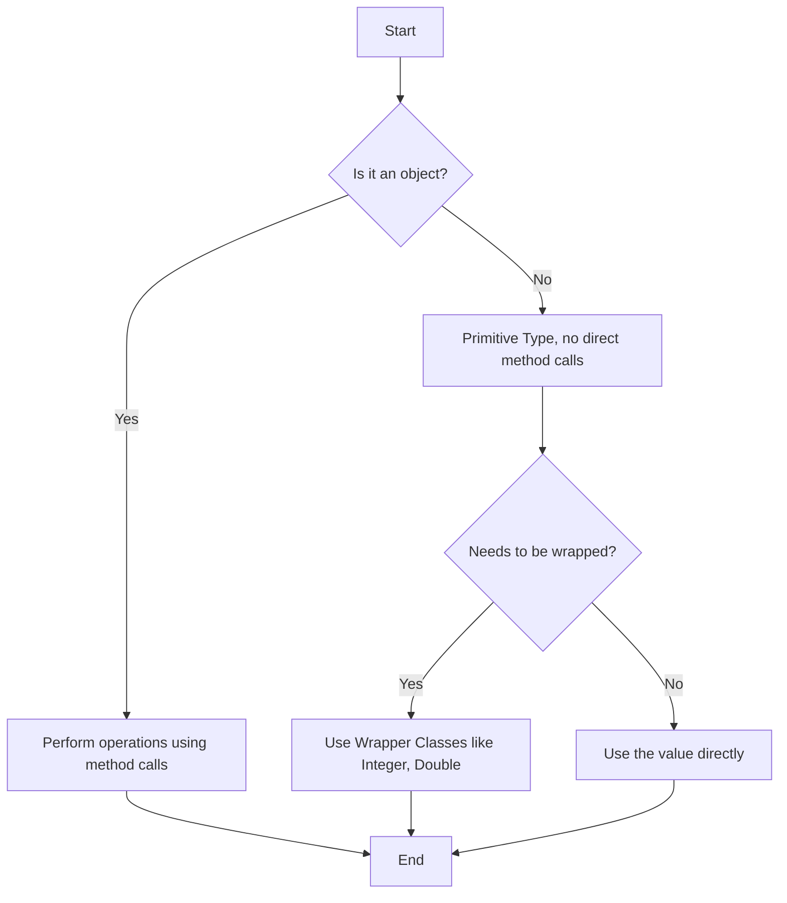
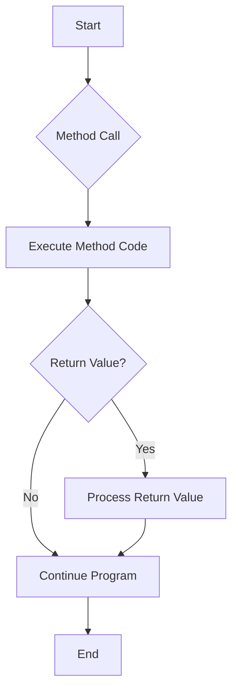
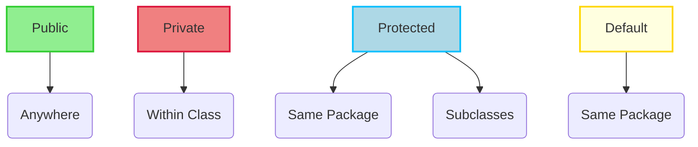
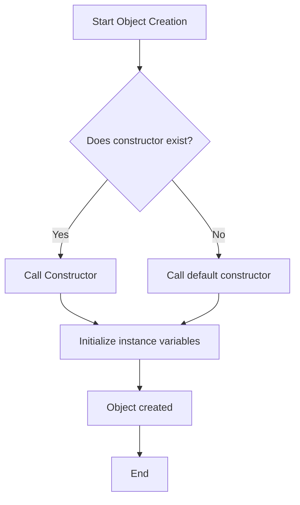
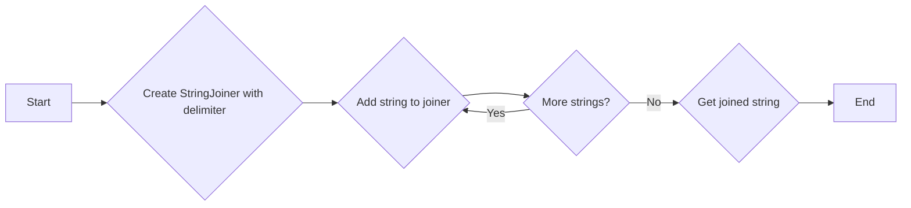

# <span style="color:#e67e22;">What we will learn in this post?</span>
<ul style='list-style-type: none; padding-left: 0;'>
<li><span style='color: #2980b9; font-size: 20px; font-weight: bold;'>👉</span> <span style='color: #2ecc71; font-size: 18px; font-weight: bold;'>OOPS Concept in Java</span></li>
<li><span style='color: #2980b9; font-size: 20px; font-weight: bold;'>👉</span> <span style='color: #2ecc71; font-size: 18px; font-weight: bold;'>Why Java is not a purely Object-Oriented Language?</span></li>
<li><span style='color: #2980b9; font-size: 20px; font-weight: bold;'>👉</span> <span style='color: #2ecc71; font-size: 18px; font-weight: bold;'>Classes and Objects in Java</span></li>
<li><span style='color: #2980b9; font-size: 20px; font-weight: bold;'>👉</span> <span style='color: #2ecc71; font-size: 18px; font-weight: bold;'>Naming Conventions in Java</span></li>
<li><span style='color: #2980b9; font-size: 20px; font-weight: bold;'>👉</span> <span style='color: #2ecc71; font-size: 18px; font-weight: bold;'>Methods in Java</span></li>
<li><span style='color: #2980b9; font-size: 20px; font-weight: bold;'>👉</span> <span style='color: #2ecc71; font-size: 18px; font-weight: bold;'>Access Modifiers in Java</span></li>
<li><span style='color: #2980b9; font-size: 20px; font-weight: bold;'>👉</span> <span style='color: #2ecc71; font-size: 18px; font-weight: bold;'>Constructors in Java</span></li>
<li><span style='color: #2980b9; font-size: 20px; font-weight: bold;'>👉</span> <span style='color: #2ecc71; font-size: 18px; font-weight: bold;'>Four Pillars of OOP in Java</span></li>
<li><span style='color: #2980b9; font-size: 20px; font-weight: bold;'>👉</span> <span style='color: #2ecc71; font-size: 18px; font-weight: bold;'>StringJoiner in Java</span></li>
<li><span style='color: #2980b9; font-size: 20px; font-weight: bold;'>👉</span> <span style='color: #2ecc71; font-size: 18px; font-weight: bold;'>Conclusion!</span></li>
</ul>

# <span style="color:#e67e22">🌟 Diving into OOP in Java: A Beginner's Guide 🌟</span>

Let's explore the foundational concepts of **Object-Oriented Programming (OOP) in Java**, which makes code more organized and reusable. We'll cover encapsulation, inheritance, and polymorphism with easy-to-understand examples. These are key concepts when you are learning 'Object-Oriented Programming concepts'!

## <span style="color:#2980b9">📦 Encapsulation: Bundling Data and Methods</span>

Encapsulation is like putting related data and the functions that operate on that data inside a box (an *object*).  It hides the internal workings of an object and exposes only what's necessary. This *protects data* from accidental modification. For example, a `BankAccount` class would *encapsulate* the balance and methods like `deposit()` and `withdraw()`.

```java
class BankAccount {
    private double balance; // Data hidden

    public void deposit(double amount) {
        balance += amount;
    }

    public double getBalance() { // Controlled access
        return balance;
    }
}
```
*   **Key Benefit**: Data security and controlled access.
*   **Analogy:** Like a capsule holding medicine, protecting its contents.

## <span style="color:#2980b9"> 👪 Inheritance: Building on Existing Classes</span>

Inheritance in **Java inheritance and polymorphism** allows you to create new classes (*subclasses*) based on existing ones (*superclasses*), inheriting their properties and methods. This promotes code reuse. For instance, a `Dog` class and `Cat` class can both *inherit* from an `Animal` class and have their own unique behaviors while having common attributes.

```java
class Animal {
    String name;
    void eat() { System.out.println("Animal is eating"); }
}

class Dog extends Animal {
   void bark() { System.out.println("Woof!");}
}

class Cat extends Animal {
  void meow() { System.out.println("Meow!"); }
}
```

*   **Key Benefit:** Code reusability and establishing relationships between classes.
*   **Analogy:** A child inheriting traits from their parents.
*  More about inheritance: [GeeksForGeeks](https://www.geeksforgeeks.org/inheritance-in-java/)

## <span style="color:#2980b9"> 🎭 Polymorphism: Many Forms</span>

Polymorphism, another core concept in **Java inheritance and polymorphism**, allows objects of different classes to respond to the same method call in different ways. This means, a single action can be performed in multiple ways. There are two main ways: method overriding (runtime polymorphism) and method overloading (compile-time polymorphism). For example the `Animal` class can have a `makeSound()` method, and each subclass can override it to produce the correct sound.

```java
class Animal {
  void makeSound() {System.out.println("Generic animal sound");}
}

class Dog extends Animal {
  @Override
  void makeSound() {System.out.println("Woof!");}
}

class Cat extends Animal {
  @Override
  void makeSound() {System.out.println("Meow!");}
}

//Example usage
Animal myAnimal = new Dog();
myAnimal.makeSound(); // Output will be "Woof!" because of overriding
```
*  **Key Benefit:** Flexibility and code extensibility.
*   **Analogy:** Like a single button press having different effects in various contexts.

### <span style="color:#8e44ad">  Summary of OOP in Java</span>

*   **Encapsulation**: Data hiding and security.
*   **Inheritance**: Code reuse and class hierarchies.
*   **Polymorphism**: Flexibility and ability to handle different objects uniformly.
*  **Resource for more details**: [Oracle Docs](https://docs.oracle.com/javase/tutorial/java/concepts/index.html)
These principles together make OOP in Java a very powerful paradigm for software development.  


# <span style="color:#e67e22">Why Java Isn't *Purely* Object-Oriented 🧐</span>

Java, while widely known for its object-oriented features, isn't considered a *purely* object-oriented language. This primarily stems from its reliance on **Java primitive types**, which are not objects. This creates a dichotomy, hindering complete object orientation. Here's why:

## <span style="color:#2980b9">The Role of Java Primitive Types</span>

*   **What are they?** Java uses primitive types like `int`, `char`, `boolean`, `float`, `double`, `long`, `short`, and `byte` to represent basic data values directly. These are *not* objects; they don't have methods or belong to a class hierarchy.

    ```java
    int age = 30;
    double price = 19.99;
    boolean isAdult = true;
    ```

    In these examples, `age`, `price`, and `isAdult` are variables holding primitive values, not objects.
*   **Why it matters:** In a *pure* object-oriented language, *everything* should be an object. The lack of object nature in primitive types represents a key **Java object-oriented limitations**. They prevent you from directly calling methods on these values. For example you cannot directly write `age.toString()`. Instead, you need to wrap them in wrapper classes such as `Integer`, `Double`, or `Boolean` to use them as objects.
*   **Wrapper classes:** While Java provides wrapper classes (e.g., `Integer` for `int`, `Double` for `double`) to treat primitives as objects, the existence of the primitives themselves signals a deviation from pure object orientation. These need to be created like:

    ```java
     Integer ageObject = Integer.valueOf(30);
     String ageString = ageObject.toString();
    ```

## <span style="color:#2980b9">Contrast with Pure Object Orientation</span>

*   In a truly object-oriented language, even numbers and booleans would be objects, allowing operations to be performed through methods associated with the object itself.
*   This lack of uniformity in Java breaks the consistency expected from a pure object-oriented language. It is a practical design decision taken to improve performance. Java's approach is considered a hybrid, aiming to balance object-oriented principles with efficiency.

## <span style="color:#8e44ad">Summary of Limitations</span>

Here’s a quick overview:
*  Java uses primitive data types which are not objects.
*  This introduces inconsistency in design as not everything is an object.
*  Although wrapper classes exist to treat primitives as objects, Java still is not purely object oriented.

### <span style="color:#8e44ad">Visual Representation</span>



## <span style="color:#2980b9">Further Resources</span>

*   [Oracle Java Documentation on Primitive Data Types](https://docs.oracle.com/javase/tutorial/java/nutsandbolts/datatypes.html)
*  [GeeksforGeeks Article on Java Primitive Types vs Wrapper Types](https://www.geeksforgeeks.org/wrapper-classes-in-java/)
*  [Baeldung Article on Primitives in Java](https://www.baeldung.com/java-primitives)


# <span style="color:#e67e22"> 🚀 Classes and Objects in Java: A Friendly Guide</span>

Hey there! Let's explore the fundamental concepts of *classes* and *objects* in Java, cornerstones of **Java OOP** (Object-Oriented Programming). Understanding these is crucial to writing efficient and well-organized code.

## <span style="color:#2980b9"> 🧩 What are Classes in Java?</span>

*   Think of a class as a blueprint or a template. It defines the *structure* and *behavior* of objects.
*   It specifies what data (attributes/fields) an object will hold and what actions (methods) it can perform.
*   In Java, `classes` are declared using the `class` keyword, followed by the class name.

### <span style="color:#8e44ad"> ✍️ Example of a Class</span>

```java
class Dog {
    String name;  // Attribute
    String breed; // Attribute

    // Method
    void bark() {
        System.out.println("Woof!");
    }
}
```

Here, `Dog` is a `class in Java`, defining that every dog object will have a `name`, `breed`, and the ability to `bark`.
<br>
<br>

## <span style="color:#2980b9"> 📦 What are Objects in Java?</span>

*   An object is a *concrete instance* of a class. It's the actual entity you work with in your program.
*   You create `objects in Java` using the `new` keyword, which allocates memory for the object and calls the class's constructor.
*   Each object has its own distinct set of values for the attributes defined in its class.

### <span style="color:#8e44ad"> 🛠️ Example of Creating and Using Objects</span>

```java
public class Main {
    public static void main(String[] args) {
        Dog myDog = new Dog(); // Creates an object of the Dog class
        myDog.name = "Buddy";   // Setting attribute values
        myDog.breed = "Golden Retriever";
        System.out.println(myDog.name);  // Output: Buddy
        myDog.bark(); // Calls the bark method
    }
}

```
<br>
<br>
*   In this example, `myDog` is an object of the `Dog` class. We assign values to its attributes (name, breed) and invoke its `bark()` method.
 <br>
<br>
## <span style="color:#2980b9"> 🤝 How Classes and Objects Interact</span>

*   Classes define the *type* of an object, and objects are *instances* of that type.
*   A single class can create many different objects, each with its own unique data.
*   Objects interact by calling each other's methods, forming a collaborative network of operations in your program. This is a fundamental aspect of **Java OOP**.

```mermaid
graph LR
    A[Class (Dog)] --> B(Object 1 - myDog);
    A --> C(Object 2 - yourDog);
    B -->|has attributes: name, breed| A;
    C -->|has attributes: name, breed| A;
	B -->|calls methods: bark()| A;
	C -->|calls methods: bark()| A;
```

**Key Takeaways:**

*   **Classes** are blueprints, while **objects** are real-world entities.
*   **Objects** are instances of **classes**.
*   **Java OOP** relies heavily on this interaction to structure programs effectively.
*   Classes define the type of data and functionality an object can have.

**Resources for More Info:**

*   [Oracle's Java Tutorials on Classes and Objects](https://docs.oracle.com/javase/tutorial/java/javaOO/index.html)
*   [GeeksforGeeks on Java Classes and Objects](https://www.geeksforgeeks.org/java-classes-and-objects/)

By understanding how `classes` and `objects` work together, you can leverage the full power of Java's object-oriented approach. Happy coding! 🎉


# <span style="color:#e67e22">🚀 Java Naming Conventions: Making Code Readable</span>

## <span style="color:#2980b9"> Why Java Naming Matters 🧐</span>

Following good *Java naming conventions* is vital for achieving excellent *Java code readability*.  Consistent and clear naming practices make your code easier to understand, maintain, and collaborate on.  It's a core part of *Java best practices* that greatly reduces confusion and bugs. Think of it like writing clear, understandable sentences - we don't just throw words around randomly!

## <span style="color:#2980b9"> Key Naming Rules in Java 🚦</span>

Here's a breakdown of the key rules:

*   **Classes:**
    *   Use `PascalCase` (also known as UpperCamelCase).
    *   Nouns or noun phrases representing a thing (e.g., `BankAccount`, `CustomerDetails`).
    *   Avoid abbreviations.
     ```java
     // Good:
     class UserProfile {}

     // Bad:
     class UserProf {}
     ```
*   **Methods:**
    *   Use `camelCase`.
    *   Verbs or verb phrases representing actions (e.g., `calculateSalary()`, `getUserName()`).
      ```java
      // Good:
      public void printMessage() {}

      // Bad:
      public void Printmessage() {}
       ```
*   **Variables:**
    *   Use `camelCase`.
    *   Use descriptive names (e.g., `firstName`, `totalAmount`).
    *   Avoid single-letter names (except for loop counters, such as `i`, `j`).
      ```java
      // Good:
      int userAge;

      // Bad:
      int a;
      ```
*   **Constants:**
    *   Use `UPPER_SNAKE_CASE`.
    *   Make them static and final (e.g., `MAX_SIZE`, `DEFAULT_COLOR`).
      ```java
      // Good:
      public static final int MAX_LENGTH = 100;

      // Bad:
      public final int max_Length = 100;
      ```
## <span style="color:#2980b9"> Examples 📝</span>

### <span style="color:#8e44ad">Class Example</span>
```java
// Good:
public class StudentRegistration {
    // ...
}
```
### <span style="color:#8e44ad">Method Example</span>
```java
// Good:
public String getStudentName() {
    // ...
}

```
### <span style="color:#8e44ad">Variable Example</span>
```java
// Good:
int studentId;

```
### <span style="color:#8e44ad">Constant Example</span>
```java
// Good:
public static final double PI = 3.14159;
```
## <span style="color:#2980b9">Why These Practices? 💡</span>

*   **Clarity:** Naming conventions create consistency which makes the code more clear and easier to read.
*   **Maintainability:** Properly named elements makes it easier to understand the purpose and function of code, hence maintenance is easier.
*   **Collaboration:** Everyone can quickly understand the code, which simplifies teamwork.

## <span style="color:#2980b9">More Resources 📚</span>
*   [Oracle's Java Code Conventions](https://www.oracle.com/java/technologies/javase/codeconventions-contents.html)
*   [GeeksforGeeks: Java Naming Conventions](https://www.geeksforgeeks.org/java-naming-conventions/)

By adhering to these simple but crucial *Java naming conventions*, you'll significantly improve the overall *Java code readability* of your projects and make them more maintainable, ultimately leading to better software.


# <span style="color:#e67e22">🚀 Understanding Methods in Java 🚀</span>

Methods in Java are like mini-programs within a bigger program. They're blocks of code that perform specific tasks.  Think of them as actions your objects can take.  They're fundamental for organizing and reusing code, crucial aspects of *encapsulation*.  Instead of writing the same logic repeatedly, you can define a method and call it whenever needed. This makes your code cleaner, easier to understand, and less prone to errors. Let's explore how to define and use *methods in Java*.

## <span style="color:#2980b9">Defining a Method (Java Function Definition) 🛠️</span>

A *Java method definition* typically includes:

*   **Access Modifier:** Determines the method's visibility (e.g., `public`, `private`, `protected`).
*   **Return Type:** Specifies the type of data the method will return (e.g., `int`, `String`, `void` if it doesn't return anything).
*   **Method Name:** The identifier used to call the method.
*   **Parameters (Optional):** Values passed into the method enclosed in parentheses, e.g., `(int x, String y)`.
*   **Method Body:** Code block enclosed in curly braces `{}` that contains the instructions the method executes.

```java
    public int add(int a, int b) { // Example method definition
        int sum = a + b;
        return sum;
    }
```

## <span style="color:#2980b9">Invoking a Method (Java Method Examples) 📞</span>

To use a method, you need to "call" or invoke it.  This involves using the method name followed by parentheses, and any necessary arguments if required.

```java
    public class Main {
        public static void main(String[] args) {
          Calculator calc = new Calculator();
          int result = calc.add(5, 3);  // Example method invocation
          System.out.println("The sum is: " + result); // Output: The sum is: 8
        }
    }
    class Calculator{
         public int add(int a, int b) { // Example method definition
            int sum = a + b;
            return sum;
        }
    }
```

### <span style="color:#8e44ad">Significance of Methods</span>

*   **Code Reusability:** Write once, use many times.
*   **Modularity:** Breaks complex tasks into smaller manageable parts.
*   **Organization:** Improves code readability and maintainability.
*   **Abstraction:** Hides complex implementations from the user, focusing on functionality.

Here's a simple Mermaid flowchart for understanding method invocation:



For a deeper dive into methods, you might find these resources helpful:

*   [Oracle's Java Tutorials - Defining Methods](https://docs.oracle.com/javase/tutorial/java/javaOO/methods.html)
*  [GeeksforGeeks - Java Methods](https://www.geeksforgeeks.org/java-methods/)


# <span style="color:#e67e22">🔐 Understanding Java Access Modifiers: A Friendly Guide</span>

Let's dive into the world of **Java access modifiers** and how they play a vital role in **Java encapsulation**. These modifiers control the visibility and accessibility of class members (variables, methods, constructors). Think of them as gatekeepers for your code, managing who can see and use what. We'll explore the four types: `public`, `private`, `protected`, and default (no keyword).

## <span style="color:#2980b9">🔍 Public Access Modifier</span>

*   The `public` modifier makes a member accessible from *anywhere*. This is the least restrictive access level. 
*   It's like opening the door wide! 🚪

```java
public class PublicExample {
    public String message = "Hello from Public!";

    public void greet() {
        System.out.println(message);
    }
}
```

*   **Code example**:  The `message` variable and `greet` method in `PublicExample` can be accessed from any other class.

## <span style="color:#2980b9">🔒 Private Access Modifier</span>

*  The `private` modifier is the most restrictive. Members declared as `private` are only accessible within the class they are defined in. 
*  It's like keeping a secret! 🤫

```java
class PrivateExample {
    private int secretCode = 1234;

    private void showSecret() {
        System.out.println("The secret code is: " + secretCode);
    }

    public void revealSecret() { // Public method to access the private secretCode
        showSecret();
    }
}
```

*   **Code example**:  `secretCode` and `showSecret` in `PrivateExample` cannot be directly accessed from outside. We use `revealSecret()` (a public method) as a gateway. This upholds **Java encapsulation** by hiding internal details and providing controlled access.

## <span style="color:#2980b9">🛡️ Protected Access Modifier</span>

* The `protected` modifier allows access within the same package, as well as access by subclasses (even in a different package).
*  Think of it as being accessible within the family and trusted friends. 👨‍👩‍👧‍👦

```java
package package1;

public class ProtectedExample {
    protected String name = "Protected Name";
}

package package2;
import package1.ProtectedExample;

class SubProtected extends ProtectedExample {
    public void printName(){
    System.out.println(this.name);
}
}
```
*   **Code example**: `name` is accessible within `package1` and also by subclass `SubProtected` in `package2`.

## <span style="color:#2980b9">📦 Default (Package-Private) Access Modifier</span>

*  When no modifier is specified, it's considered default access. Default access allows access within the same package only.
* It's like neighborhood access! 🏘️

```java
package mypackage;

class DefaultExample {
    String message = "Hello from default!";
    void showMessage(){
        System.out.println(message);
    }
}
```

*   **Code example**: `message` and `showMessage`  are only accessible by other classes in the `mypackage`.

## <span style="color:#8e44ad">💡 Key Takeaways & Impact on Encapsulation</span>

*   **Java access modifiers** help you implement **Java encapsulation** effectively. They enable you to bundle data with methods and hide the internal implementation details from the outside world.
*   **`public`**:  Widest access.
*   **`private`**: Most restricted access, used for data hiding.
*   **`protected`**:  Allows inheritance-based access and is open within the same package.
*   **Default**: Package-level access.


*Using these modifiers allows you to control the level of interaction with your classes, improving code maintainability and reducing accidental bugs. By making internal data `private`, for example, you prevent external code from directly manipulating it, thus preventing unforeseen errors.*

## <span style="color:#8e44ad">📚 Resources</span>
- [Oracle Java Tutorials on Access Control](https://docs.oracle.com/javase/tutorial/java/javaOO/accesscontrol.html)
- [GeeksforGeeks Java Access Modifiers](https://www.geeksforgeeks.org/access-modifiers-java/)

I hope this was helpful in understanding **Java access modifiers** and **Java encapsulation**! Happy coding! 🎉


# <span style="color:#e67e22">🛠️ Understanding Java Constructors 🚀</span>

Let's dive into the world of **Java constructors**! They're special methods that play a crucial role in creating and setting up new objects. Think of them as the object's "birth certificate," making sure everything's in place from the get-go.

## <span style="color:#2980b9">The Role of Java Constructors</span>
*   **Object Initialization:** When you create a new object in Java, you need a way to set its initial state – its starting values for variables. That's where constructors come in! They're automatically called when you use the `new` keyword to make a new instance of a class.

*   **Setting up Instance Variables:** Constructors ensure that your object's instance variables are given meaningful starting values, instead of the default ones Java gives if we don't initialize them ourselves.

## <span style="color:#2980b9">Default vs. Parameterized Constructors</span>
We have two types of constructors:

### <span style="color:#8e44ad">Default Constructor in Java</span>

*   This is a special constructor that Java creates automatically if *you don't define any* constructors in your class.
*   It takes no arguments (no parameters) and performs a basic initialization – typically setting instance variables to their default values (e.g., `0` for `int`, `null` for objects).

```java
//Example of class with default constructor
class Dog {
    String breed; // Instance variable, will be 'null' initially
}

public class Main {
  public static void main(String[] args) {
    Dog myDog = new Dog(); // Default constructor is called implicitly
    System.out.println("Breed of dog is "+myDog.breed); // Output: null
  }
}

```

### <span style="color:#8e44ad">Parameterized Constructor Java</span>
*   These are constructors that *you* define, which take one or more arguments (parameters).
*   They allow you to set the object's instance variables to specific values when you create the object.
*   This gives you flexibility and allows you to tailor the object's initial state precisely to your needs.

```java
//Example of a class with parameterized constructor
class Cat {
    String name;
    int age;
    // Parameterized constructor
    public Cat(String catName, int catAge) {
        name = catName;
        age = catAge;
    }
}

public class Main {
  public static void main(String[] args) {
     Cat myCat = new Cat("Whiskers", 3); // Parameterized constructor call
    System.out.println("Name: " + myCat.name + ", Age: " + myCat.age); // Output: Name: Whiskers, Age: 3
  }
}
```

## <span style="color:#2980b9">Constructor Flow </span>



## <span style="color:#2980b9">Key Takeaways</span>
*   **No Return Type:** Constructors don't have a return type, not even `void`.
*   **Same Name:** They have the same name as the class itself.
*   **Overloading:** You can have multiple constructors with different parameter lists (constructor overloading).

For more in-depth information, you can check out these resources:

*   [Oracle's Java Tutorials on Constructors](https://docs.oracle.com/javase/tutorial/java/javaOO/constructors.html)
*   [GeeksforGeeks on Constructors in Java](https://www.geeksforgeeks.org/constructors-in-java/)

By understanding *Java constructors*, you gain better control over object creation, making your programs more robust and easier to maintain!


# <span style="color:#e67e22">The Four Pillars of OOP in Java 🚀</span>

Understanding the **four pillars of OOP** is crucial for writing effective code. Let's explore how **encapsulation inheritance polymorphism abstraction in Java** are implemented. These are the cornerstones of **Java OOP implementation**, making code reusable, maintainable, and scalable.

## <span style="color:#2980b9">Encapsulation 📦</span>

*   **What it is:**  Bundling data (attributes) and methods that operate on the data within a class. It also restricts direct access to some components, protecting data integrity. We use *access modifiers* like `private`, `public`, and `protected` in Java.

*   **Example:**

    ```java
    class BankAccount {
        private double balance; // Encapsulated data
        public double getBalance() { return balance; } // Getter
        public void deposit(double amount) { balance += amount; } // Setter
    }
    ```

*   Here, `balance` is `private`, preventing direct modification, while methods allow controlled interaction.

## <span style="color:#2980b9">Inheritance 👪</span>

*   **What it is:** A mechanism where a class *inherits* properties and methods from another class (parent class). It promotes code reusability. In Java, we use the `extends` keyword.

*   **Example:**

    ```java
    class Animal {
        void eat() { System.out.println("Animal is eating"); }
    }

    class Dog extends Animal {
        void bark() { System.out.println("Woof!");}
    }
    ```

*   `Dog` inherits `eat()` from `Animal` and has its own `bark()` method.

*   **Mermaid Diagram:**
    ```mermaid
    classDiagram
        class Animal{
            +eat()
        }
        class Dog{
            +bark()
        }
        Dog --|> Animal : inherits
    ```

## <span style="color:#2980b9">Polymorphism 🎭</span>

*   **What it is:**  The ability of an object to take on many forms. In Java, achieved through *method overriding* and *method overloading*.

*   **Example:**

    ```java
    class Shape {
      void draw() {System.out.println("Drawing a shape");}
    }
    class Circle extends Shape{
      @Override
        void draw() {System.out.println("Drawing a circle");}
    }
    ```

*  The `draw()` method is polymorphic since `Shape` class' `draw()` method is overriden in `Circle`.

* **Further Reading :** [Polymorphism in Java](https://www.geeksforgeeks.org/polymorphism-in-java/)

## <span style="color:#2980b9">Abstraction 💡</span>

*   **What it is:** Showing only essential information and hiding complex details. Abstract classes and interfaces achieve this in Java.

*   **Example:**

    ```java
    abstract class Shape {
      abstract void draw();
    }

    class Rectangle extends Shape{
        @Override
        void draw(){ System.out.println("Drawing Rectangle"); }
    }
    ```

*   `Shape` is abstract, and concrete classes like `Rectangle` must provide their implementation of `draw()`. It provides a generalized view while hiding underlying complexities.

*   **Further Reading :** [Abstract Class and Abstract Methods](https://www.geeksforgeeks.org/abstract-classes-and-methods-in-java/)

By mastering these **four pillars of OOP**, you'll write more flexible and robust Java programs. These principles are fundamental to successful **Java OOP implementation**.


# <span style="color:#e67e22">The Mighty `StringJoiner` in Java: Joining Strings Made Easy 🚀</span>

Let's explore the *StringJoiner class in Java*, a handy tool for efficiently **joining strings in Java**. It simplifies the process of combining strings with a specified delimiter, prefix, and suffix. Forget clunky concatenation, `StringJoiner` brings structure and readability to your string-building tasks.

## <span style="color:#2980b9">Why Use `StringJoiner`? 🤔</span>

*   **Clarity:** Makes your code cleaner and easier to understand compared to using `+` repeatedly.
*   **Efficiency:**  `StringJoiner` is more efficient for joining multiple strings than using the `+` operator in loops, as `+` creates new String objects in each iteration.
*   **Customizable:** Allows adding prefixes, suffixes, and specific delimiters.
*   **Less Error-Prone:**  Reduces the risk of missing a delimiter or adding an extra space in the process of string concatenation.

## <span style="color:#2980b9">How to Use `StringJoiner` 🛠️</span>

Here's how it works, using our previous example and adding some new tricks:

### <span style="color:#8e44ad">Basic String Joining</span>

```java
import java.util.StringJoiner;

public class StringJoinerExample {
    public static void main(String[] args) {
        StringJoiner joiner = new StringJoiner(", ");
        joiner.add("Apple").add("Banana").add("Cherry");
        System.out.println(joiner.toString()); // Output: Apple, Banana, Cherry
    }
}
```

### <span style="color:#8e44ad">Adding Prefix and Suffix</span>

```java
import java.util.StringJoiner;

public class StringJoinerExample {
    public static void main(String[] args) {
        StringJoiner joinerWithPrefixSuffix = new StringJoiner(", ", "[", "]");
        joinerWithPrefixSuffix.add("Red").add("Green").add("Blue");
        System.out.println(joinerWithPrefixSuffix.toString()); // Output: [Red, Green, Blue]
    }
}
```

### <span style="color:#8e44ad">Joining Numbers</span>

```java
import java.util.StringJoiner;

public class StringJoinerExample {
    public static void main(String[] args) {
        StringJoiner numberJoiner = new StringJoiner("-", "(", ")");
        for(int i = 1; i<=5; i++){
          numberJoiner.add(String.valueOf(i));
        }
        System.out.println(numberJoiner.toString()); // Output: (1-2-3-4-5)
    }
}
```

*   We create a `StringJoiner` instance by passing the delimiter to the constructor.
*   We add the strings we want to combine by using the `.add()` method.
*   The `toString()` method returns the joined string.
*  You can also add a prefix and suffix using the `StringJoiner`'s constructor with the respective parameters.

## <span style="color:#2980b9">Advantages Summary 🌟</span>

*   **Simplicity:** Provides an easy-to-use API for **joining strings in Java**.
*   **Flexibility:** Allows custom delimiters, prefixes, and suffixes.
*   **Performance:** More efficient than using the `+` operator repeatedly for string concatenation.
*   **Readability:** Makes code cleaner and easier to maintain.

## <span style="color:#2980b9">Mermaid Diagram </span>


**Resources:**

*   [Oracle Java StringJoiner Documentation](https://docs.oracle.com/en/java/javase/17/docs/api/java.base/java/util/StringJoiner.html)
* [Baeldung on StringJoiner](https://www.baeldung.com/java-stringjoiner)

Let's start using `StringJoiner` and see how it transforms your string-joining experience! 🎉


<h1><span style='color:#e67e22'>Conclusion</span></h1>

Well, that's a wrap! 🎉 I hope you enjoyed reading this and found it helpful! Now it's your turn. What are your thoughts? 🤔 Do you have any tips or ideas to share? I'd love to hear from you! Please drop your comments, feedback, or suggestions down below. 👇 Let's chat and learn together! 😊 Your input is super appreciated! 🙏


