# <span style="color:#e67e22;">What we will learn in this post?</span>

<ul style='list-style-type: none; padding-left: 0;'>
<li><span style='color: #2980b9; font-size: 20px; font-weight: bold;'>👉</span> <span style='color: #2ecc71; font-size: 18px; font-weight: bold;'>Memory Layout of C Programs</span></li>
<li><span style='color: #2980b9; font-size: 20px; font-weight: bold;'>👉</span> <span style='color: #2ecc71; font-size: 18px; font-weight: bold;'>Dynamic Memory Allocation in C</span></li>
<li><span style='color: #2980b9; font-size: 20px; font-weight: bold;'>👉</span> <span style='color: #2ecc71; font-size: 18px; font-weight: bold;'>Difference Between malloc() and calloc()</span></li>
<li><span style='color: #2980b9; font-size: 20px; font-weight: bold;'>👉</span> <span style='color: #2ecc71; font-size: 18px; font-weight: bold;'>What is a Memory Leak?</span></li>
<li><span style='color: #2980b9; font-size: 20px; font-weight: bold;'>👉</span> <span style='color: #2ecc71; font-size: 18px; font-weight: bold;'>Dynamic Array in C</span></li>
<li><span style='color: #2980b9; font-size: 20px; font-weight: bold;'>👉</span> <span style='color: #2ecc71; font-size: 18px; font-weight: bold;'>Dynamically Allocate a 2D Array in C</span></li>
<li><span style='color: #2980b9; font-size: 20px; font-weight: bold;'>👉</span> <span style='color: #2ecc71; font-size: 18px; font-weight: bold;'>Dynamically Growing Array in C</span></li>
<li><span style='color: #2980b9; font-size: 20px; font-weight: bold;'>👉</span> <span style='color: #2ecc71; font-size: 18px; font-weight: bold;'>Conclusion!</span></li>
</ul>

Okay, let's dive into the fascinating world of how C programs organize their memory! It might sound technical, but we'll break it down in an easy-to-understand way. 🚀

# <span style="color:#e67e22">Understanding C Program Memory Layout 🧠</span>

Imagine your computer's memory as a big house with different rooms. Each room has a specific purpose for storing different kinds of data for your C program. When a C program runs, the operating system allocates different areas in memory for it. These areas are essential for how your program functions.

## <span style="color:#2980b9">The Main Memory Sections</span>

Let's explore the key 'rooms' in this memory house:

- **Text Segment (Code Segment) 📖**

  - This is where the _executable code_ of your program resides – the instructions that the computer actually executes. It's typically read-only to prevent accidental modification. Think of it as the program's instruction manual.
  - _Example:_ Function definitions, loops, and conditional statements are stored here.

- **Data Segment 💾**

  - This section stores _global and static variables_.
  - It's further divided into two sub-sections:
    - _Initialized Data:_ Variables that have a starting value assigned when declared.
      - _Example:_ `int x = 10;` (x is stored here with the initial value of 10).
    - _Uninitialized Data (BSS):_ Variables that are declared but not initialized with a value.
      - _Example:_ `int y;` (y is stored here, initially having a default value, often zero).
  - This segment persists throughout the program's execution.

- **Stack ⏫**

  - The stack is a _LIFO_ (Last-In, First-Out) memory region. It manages temporary data related to function calls.
  - _Local variables_ declared inside functions are stored here.
  - _Function call_ information is also placed on the stack, which is used for returning to the correct location after a function call completes. Think of it like a stack of plates; you add (push) new plates on top and remove (pop) them in reverse order.
  - When a function exits, its stack frame is popped, reclaiming the space.
  - The stack is very fast for allocating and deallocating memory, but has a limited size.

- **Heap ⛰️**
  - The heap is the dynamically allocated memory region. It's used when you want memory that will last beyond the scope of a single function call.
  - Memory is explicitly allocated by using functions like `malloc()` and `calloc()` and it is deallocated by using `free()`
  - This region is large, but also slower compared to the stack, it needs to be carefully managed.
  - _Example_: Dynamically allocated arrays or structures created with malloc.
  - The programmer is responsible for managing memory in heap, including freeing it to avoid _memory leaks_.

<br>

Here's a simple illustration:

```mermaid
graph LR
    %% Node Styles
    style A fill:#4CAF50,stroke:#2E7D32,stroke-width:2,color:#FFFFFF,font-size:14px,stroke-linejoin:round
    style B fill:#2196F3,stroke:#1976D2,stroke-width:2,color:#FFFFFF,font-size:14px,stroke-linejoin:round
    style C fill:#4CAF50,stroke:#2E7D32,stroke-width:2,color:#FFFFFF,font-size:14px,stroke-linejoin:round
    style D fill:#FF9800,stroke:#F57C00,stroke-width:2,stroke-dasharray:5 5,color:#000000,font-size:14px,stroke-linejoin:round
    style E fill:#FF9800,stroke:#F57C00,stroke-width:2,stroke-dasharray:5 5,color:#000000,font-size:14px,stroke-linejoin:round
    style F fill:#4CAF50,stroke:#2E7D32,stroke-width:2,color:#FFFFFF,font-size:14px,stroke-linejoin:round
    style G fill:#2196F3,stroke:#1976D2,stroke-width:2,color:#FFFFFF,font-size:14px,stroke-linejoin:round
    style H fill:#2196F3,stroke:#1976D2,stroke-width:2,color:#FFFFFF,font-size:14px,stroke-linejoin:round

    %% Node Definitions
    A[Text Segment 📝] --> B(Executable Code 💻);
    C[Data Segment 📊] --> D{Initialized Data ✅};
    C --> E{Uninitialized Data *BSS* ❌};
    F[Stack 🗂️] --> G(Local Variables 📂);
    F --> H(Function Call Info 📞);
```



<br>

## <span style="color:#2980b9">Visualizing the Memory Layout</span>

Here's a more conceptual diagram, showing how these different segments are typically laid out in memory:


- Generally, the text segment is at a low memory address and the stack grows from a high address downwards. The heap expands from low to high addresses between Data and Stack, using unused memory as needed.

## <span style="color:#2980b9">Key Differences and Implications</span>

- **Allocation:** Stack allocation is automatic and fast, while heap allocation is manual and slower.
- **Size:** The stack has a limited size, while the heap is typically much larger.
- **Lifespan:** Stack variables are tied to the function's lifetime, while heap memory can persist across function calls.
- **Management:** Stack memory is automatically managed by the program (the compiler does the job), while you must manage heap memory yourself. Failure to `free` the dynamically allocated memory on the heap can lead to memory leaks, which can cause performance problems or even crashes.

## <span style="color:#2980b9">Practical Importance</span>

Understanding the memory layout is crucial for:

- Debugging: Identifying stack overflows, heap corruption, and memory leaks.
- Performance: Optimizing memory usage for faster program execution.
- Security: Writing safe code by avoiding buffer overflows and dangling pointers.

## <span style="color:#2980b9">Summary Table</span>

| Feature        | Stack                           | Heap                              | Data Segment              |
| -------------- | ------------------------------- | --------------------------------- | ------------------------- |
| **Allocation** | Automatic, fast                 | Manual, slower                    | Static allocation         |
| **Lifespan**   | Function's scope                | Controlled by program             | Program's lifetime        |
| **Size**       | Limited                         | Large                             | Fixed at compile time     |
| **Management** | Automatic                       | Manual, programmer responsibility | Automatic                 |
| **Use Cases**  | Local variables, function calls | Dynamic memory allocation         | Global & static variables |

## <span style="color:#2980b9">Resources</span>

- [GeeksforGeeks - Memory Layout of C Programs](https://www.geeksforgeeks.org/memory-layout-of-c-program/)
- [TutorialsPoint - C - Memory Management](https://www.tutorialspoint.com/cprogramming/c_memory_management.htm)
- [Wikipedia - Memory Management](https://en.wikipedia.org/wiki/Memory_management)

<br>

That’s a lot of information! But hopefully, this gives you a clear picture of how memory is structured in a C program. It's essential knowledge for any C programmer! Keep exploring! Happy coding! 💻🌟

# <span style="color:#e67e22">Dynamic Memory Allocation in C 🚀</span>

Hey there! 👋 Let's dive into the world of dynamic memory allocation in C. Imagine you're building something, and you don't know exactly how much space you'll need until runtime. That's where dynamic memory allocation comes to the rescue! It allows your program to request memory as it needs it, instead of having a fixed amount from the start.

## <span style="color:#2980b9">Why Dynamic Allocation? 🤔</span>

- **Flexibility**: You can adjust memory usage based on user input or varying data sizes.
- **Efficiency**: You use only as much memory as needed, avoiding wastage.
- **Dynamic Structures**: Create data structures like linked lists, trees, and graphs whose size can change during the program's execution.
- **No fixed arrays**: You do not need to know the size of the array in advance of using it.

## <span style="color:#2980b9">Key Players: `malloc()`, `calloc()`, and `realloc()` 🎭</span>

These functions, part of the `stdlib.h` library, are your main tools for handling dynamic memory. Let's break them down:

### <span style="color:#8e44ad">`malloc()` - The Memory Grabber 🤲</span>

- **What it does**: `malloc()` (_memory allocation_) grabs a block of memory of a specified size (in bytes) from the heap. It returns a pointer to the beginning of that memory block.
- **Syntax**: `void* malloc(size_t size);`
  - `size`: The size of the memory block you want, in bytes.
  - `void*`: Returns a `void` pointer, which you need to _typecast_ to the appropriate data type pointer.
- **Important**: The allocated memory is _uninitialized_ meaning it can contain garbage values.

**Example:**

```c
#include <stdio.h>
#include <stdlib.h>

int main() {
    int *arr;
    int n = 5;

    // Allocate memory for 5 integers
    arr = (int *)malloc(n * sizeof(int));

    if (arr == NULL) { // Always check for allocation failure
        printf("Memory allocation failed!\n");
        return 1;
    }

    // Use the allocated memory (fill it with values in our example)
    for(int i = 0; i < n; i++)
        arr[i] = i*i;

    // Print the values
    for(int i = 0; i < n; i++)
        printf("arr[%d] = %d\n", i, arr[i]);

    // Free the allocated memory to prevent memory leaks
    free(arr);

    return 0;
}
```

**Flowchart:**

```mermaid
graph TD
    %% Node Styles
    style A fill:#4CAF50,stroke:#2E7D32,stroke-width:2,color:#FFFFFF,font-size:16px,stroke-linejoin:round
    style B fill:#FF9800,stroke:#F57C00,stroke-width:2,stroke-dasharray:5 5,color:#000000,font-size:14px,stroke-linejoin:round
    style C fill:#FF9800,stroke:#F57C00,stroke-width:2,stroke-dasharray:5 5,color:#000000,font-size:14px,stroke-linejoin:round
    style D fill:#2196F3,stroke:#1976D2,stroke-width:2,color:#FFFFFF,font-size:14px,stroke-linejoin:round
    style E fill:#2196F3,stroke:#1976D2,stroke-width:2,color:#FFFFFF,font-size:14px,stroke-linejoin:round
    style F fill:#FF5252,stroke:#D32F2F,stroke-width:2,color:#FFFFFF,font-size:14px,stroke-linejoin:round
    style G fill:#4CAF50,stroke:#2E7D32,stroke-width:2,color:#FFFFFF,font-size:16px,stroke-linejoin:round

    %% Node Definitions and Flow
    A[Start 🚀] --> B{Allocate memory using malloc?};
    B -- Yes --> C{Check if allocation is successful?};
    C -- Yes --> D[Use allocated memory 💾];
    D --> E[Free allocated memory using free ♻️];
    E --> G[End ✅];
    C -- No --> F[Print *Allocation Failed! ❌*];
    F --> G;
    B -- No --> G;
    G[End ✅];

```



### <span style="color:#8e44ad">`calloc()` - The Memory Cleaner 🧹</span>

- **What it does**: `calloc()` (_contiguous allocation_) does the same as malloc but also initializes all bytes of the allocated block to _zero_. It's handy when you need a clean slate.
- **Syntax**: `void* calloc(size_t num, size_t size);`
  - `num`: The number of elements you want to allocate.
  - `size`: The size of _each_ element in bytes.
- **Important**: Like `malloc()`, it returns `NULL` if allocation fails.

**Example:**

```c
#include <stdio.h>
#include <stdlib.h>

int main() {
    int *arr;
    int n = 5;

    // Allocate and zero-initialize memory for 5 integers
    arr = (int *)calloc(n, sizeof(int));

    if (arr == NULL) {
        printf("Memory allocation failed!\n");
        return 1;
    }

    // Use the allocated (zero initialized) memory
    for(int i = 0; i < n; i++)
        printf("arr[%d] = %d\n", i, arr[i]);

    // Free the memory
    free(arr);

    return 0;
}

```

**Output:**

```
arr[0] = 0
arr[1] = 0
arr[2] = 0
arr[3] = 0
arr[4] = 0
```

### <span style="color:#8e44ad">`realloc()` - The Memory Resizer 📐</span>

- **What it does**: `realloc()` (_reallocation_) allows you to change the size of a previously allocated memory block.
- **Syntax**: `void* realloc(void* ptr, size_t new_size);`
  - `ptr`: A pointer to the memory block you want to resize.
  - `new_size`: The _new_ size of the memory block (in bytes).
- **Important**:
  - If `ptr` is `NULL`, behaves the same as `malloc(new_size)`.
  - If `new_size` is 0, behaves the same as `free(ptr)`.
  - If the reallocation is successful, returns a pointer to the resized block (which might be in a different location).
  - It might copy the contents to a new location if necessary.
  - Returns `NULL` on failure.

**Example:**

```c
#include <stdio.h>
#include <stdlib.h>

int main() {
    int *arr;
    int n = 3;
    int new_n = 5;

    // Allocate memory for 3 integers
    arr = (int *)malloc(n * sizeof(int));

    if (arr == NULL) {
        printf("Memory allocation failed!\n");
        return 1;
    }
    for(int i = 0; i < n; i++)
        arr[i] = i;

    printf("Before reallocation:\n");
    for(int i = 0; i < n; i++)
        printf("arr[%d] = %d\n", i, arr[i]);
    // Reallocate to hold 5 integers
    arr = (int *)realloc(arr, new_n * sizeof(int));

    if (arr == NULL) {
        printf("Memory reallocation failed!\n");
        free(arr);
        return 1;
    }

    printf("After reallocation:\n");
    for(int i = 0; i < new_n; i++)
        printf("arr[%d] = %d\n", i, arr[i]);


    // Free the reallocated memory
    free(arr);

    return 0;
}
```

**Output:**

```
Before reallocation:
arr[0] = 0
arr[1] = 1
arr[2] = 2
After reallocation:
arr[0] = 0
arr[1] = 1
arr[2] = 2
arr[3] = 0
arr[4] = 0
```

## <span style="color:#2980b9">The `free()` Function: Keeping it Clean 🧹</span>

- **What it does**: `free()` releases the dynamically allocated memory back to the heap, so it can be reused. _Always_ call `free()` when you are done with the memory.
- **Syntax**: `void free(void* ptr);`
  - `ptr`: A pointer to the memory block previously allocated using `malloc`, `calloc`, or `realloc`.
- **Important**:
  - Do _not_ call `free()` on memory that was not allocated dynamically.
  - Do _not_ call `free()` multiple times on the same pointer, as it leads to _undefined behavior_.

## <span style="color:#2980b9">Common Pitfalls to Avoid ⚠️</span>

- **Memory Leaks**: Forgetting to `free()` allocated memory.
- **Dangling Pointers**: Accessing memory after it has been freed.
- **Double Free**: Calling `free()` on the same memory more than once.
- **Segmentation Faults**: Trying to access memory outside the allocated space.

## <span style="color:#2980b9">Key Takeaways 📝</span>

- Dynamic memory allocation is essential for flexibility in C programs.
- Use `malloc()`, `calloc()`, and `realloc()` to manage memory on the heap.
- Always check for allocation failures by validating the pointer returned.
- Free the allocated memory with `free()` when you’re done with it to avoid memory leaks.
- Be mindful of the common pitfalls associated with dynamic memory allocation.

## <span style="color:#2980b9">Resources 📚</span>

- [GeeksforGeeks - Dynamic Memory Allocation in C](https://www.geeksforgeeks.org/dynamic-memory-allocation-in-c/)
- [Tutorialspoint - C Dynamic Memory Allocation](https://www.tutorialspoint.com/cprogramming/c_dynamic_memory_allocation.htm)
- [C Programming - Dynamic Memory Allocation](https://www.programiz.com/c-programming/dynamic-memory-allocation)

That's it! You're now equipped with the basics of dynamic memory allocation in C. Happy coding! 🎉

# <span style="color:#e67e22">Memory Allocation: `malloc()` vs `calloc()` 🤔</span>

Let's dive into the world of dynamic memory allocation in C and understand the differences between two fundamental functions: `malloc()` and `calloc()`. Both are used to request blocks of memory from the heap during program execution, but they differ in how they initialize the memory they allocate. Let’s break it down!

## <span style="color:#2980b9">`malloc()` - The Raw Allocator 📦</span>

### <span style="color:#8e44ad">What it Does</span>

`malloc()` (memory allocation) is a function that asks the system for a specific block of memory of a given size.

- It takes **one** argument: the size of the memory block you need (in bytes).
- It returns a _void pointer_ (`void*`) which points to the beginning of the allocated memory.
- **Important:** The allocated memory is not initialized. It contains _garbage values_—whatever was previously stored in that memory location.

### <span style="color:#8e44ad">Example in Action 🎬</span>

```c
#include <stdio.h>
#include <stdlib.h>

int main() {
    int *ptr;
    int n = 5; // let's allocate space for 5 integers

    ptr = (int*) malloc(n * sizeof(int)); //request memory

    if (ptr == NULL) {
      printf("Memory allocation failed!\n");
      return 1; // indicates an error
    }

    printf("Memory allocated successfully using malloc! \n");
    printf("Values at the location initially : ");

      // Printing values of the allocated memory
      for(int i = 0; i < n; i++) {
          printf("%d ", ptr[i]); // Expect garbage value initially
      }
        printf("\n");


     // Always free the memory to prevent memory leaks
    free(ptr);

    return 0;
}
```

**Explanation**

1. We are allocating memory for 5 integers, by calculating `n * sizeof(int)`, where `sizeof(int)` gives us the size of a single integer in bytes and `n` is the total number of integers.
2. we are using `(int*)` to type cast it to a _int_ pointer
3. The allocated memory is accessed via `ptr[i]` inside the loop.
4. The values printed are random because `malloc` doesn't initialize.

### <span style="color:#8e44ad">Key takeaway for `malloc()`</span>

- You have to initialize the memory yourself if you need specific values.
- It’s faster than `calloc()` because it skips the initialization step.
- Always remember to use `free()` to release allocated memory once you’re done to prevent memory leaks.

## <span style="color:#2980b9">`calloc()` - The Initializing Allocator ✨</span>

### <span style="color:#8e44ad">What it Does</span>

`calloc()` (contiguous allocation) is similar to `malloc()`, but with one key difference: it initializes the allocated memory to **zero**.

- It takes **two** arguments: the number of elements and the size of each element (in bytes).
- It returns a _void pointer_ (`void*`) pointing to the beginning of the allocated (and zero-initialized) memory.
- Every byte of the allocated block is set to 0.

### <span style="color:#8e44ad">Example in Action 🎬</span>

```c
#include <stdio.h>
#include <stdlib.h>

int main() {
    int *ptr;
    int n = 5;

    ptr = (int*) calloc(n, sizeof(int)); // request and initialize memory

    if (ptr == NULL) {
      printf("Memory allocation failed!\n");
      return 1; // indicates an error
    }

    printf("Memory allocated successfully using calloc!\n");
    printf("Values at the location initially : ");

      // Printing values of the allocated memory
      for(int i = 0; i < n; i++) {
          printf("%d ", ptr[i]); // Expect 0
      }
      printf("\n");


    // Always free the memory to prevent memory leaks
    free(ptr);
    return 0;
}
```

**Explanation:**

1. We allocate memory for 5 integers and also initialize each block to zero, using `n` number of blocks of size `sizeof(int)`.
2. We have used `(int*)` to type cast it to an _int_ pointer
3. The allocated memory is accessed via `ptr[i]` inside the loop.
4. The values printed are _0_ because `calloc` initializes all bits to zero.

### <span style="color:#8e44ad">Key takeaway for `calloc()`</span>

- Initializes memory to zeros, which is convenient if you need a clean slate.
- Slightly slower than `malloc()` due to the initialization overhead.
- Use `free()` when done to avoid memory leaks.

## <span style="color:#2980b9">Side-by-Side Comparison 📊</span>

| Feature            | `malloc()`                                 | `calloc()`                                              |
| ------------------ | ------------------------------------------ | ------------------------------------------------------- |
| **Arguments**      | Size in bytes (one argument)               | Number of elements and size per element (two arguments) |
| **Initialization** | No initialization, contains garbage values | Initializes all bits to zero                            |
| **Speed**          | Generally faster                           | Slightly slower due to initialization                   |
| **Use Case**       | When you want raw, uninitialized memory    | When you need initialized memory (usually to zero)      |

## <span style="color:#2980b9">When to Choose Which? 🤔</span>

- **Use `malloc()`** when:

  - You don't need the memory to be initialized to zero, and you are okay with setting values later by yourself.
  - Speed is a primary concern, and you are comfortable handling initial values.

- **Use `calloc()`** when:
  - You need the memory to be initialized to zero, like when working with arrays you are going to use as counter arrays or matrices
  - You want the safety net of initialized memory.

```mermaid
graph LR
    %% Node Styles
    style A fill:#4CAF50,stroke:#2E7D32,stroke-width:2,color:#FFFFFF,font-size:16px,stroke-linejoin:round
    style B fill:#FF9800,stroke:#F57C00,stroke-width:2,stroke-dasharray:5 5,color:#000000,font-size:14px,stroke-linejoin:round
    style C fill:#FF9800,stroke:#F57C00,stroke-width:2,stroke-dasharray:5 5,color:#000000,font-size:14px,stroke-linejoin:round
    style D fill:#2196F3,stroke:#1976D2,stroke-width:2,color:#FFFFFF,font-size:14px,stroke-linejoin:round
    style E fill:#2196F3,stroke:#1976D2,stroke-width:2,color:#FFFFFF,font-size:14px,stroke-linejoin:round
    style F fill:#BBDEFB,stroke:#64B5F6,stroke-width:2,color:#000000,font-size:14px,stroke-linejoin:round
    style G fill:#FF5252,stroke:#D32F2F,stroke-width:2,color:#FFFFFF,font-size:14px,stroke-linejoin:round
    style H fill:#4CAF50,stroke:#2E7D32,stroke-width:2,color:#FFFFFF,font-size:16px,stroke-linejoin:round

    %% Node Definitions and Flow
    A[Start 🚀] --> B{Allocate memory?};
    B -- Yes --> C{*malloc* or *calloc*?};
    C -- malloc() --> D[Allocate uninitialized memory 🛠️];
    C -- calloc() --> E[Allocate initialized to zero memory ♻️];
    D --> F{Use allocated memory 📊};
    E --> F;
    F --> G{*free* memory ♻️};
    G --> H[End ✅];
    B -- No --> H;


```

## <span style="color:#2980b9">Visual Summary 🖼️</span>



## <span style="color:#2980b9"> Resources 📚</span>

- [GeeksforGeeks - malloc vs calloc](https://www.geeksforgeeks.org/difference-between-malloc-and-calloc-function-in-c/)
- [Tutorialspoint - C - Dynamic Memory Allocation](https://www.tutorialspoint.com/cprogramming/c_dynamic_memory_allocation.htm)
- [cplusplus.com - malloc](https://cplusplus.com/reference/cstdlib/malloc/)
- [cplusplus.com - calloc](https://cplusplus.com/reference/cstdlib/calloc/)

Let me know if you'd like more clarification or examples! Happy coding! 🚀

# <span style="color:#e67e22">Memory Leaks in C: A Friendly Guide 🛠️</span>

Hey there, fellow coder! Let's talk about something that can be a real headache: **memory leaks** in C. Think of them as tiny gremlins quietly hoarding resources in your program, eventually causing chaos. Don't worry, we'll explore what they are, why they happen, and how to avoid them!

## <span style="color:#2980b9">What Exactly is a Memory Leak? 🤔</span>

Imagine you're borrowing books from the library. You get a few, read them, and then... forget to return them! The library has fewer books, and nobody else can use them. That's kinda what a memory leak is.

In C, when you dynamically allocate memory (using functions like `malloc`, `calloc`, or `realloc`), you're asking the computer for some space to store data. If you don't `free` that space when you're done with it, the memory is still reserved for your program but is no longer usable. This unused, but still-reserved, memory is a _memory leak_.

### <span style="color:#8e44ad">Key Concepts:</span>

- **Dynamic Memory Allocation:** Requesting memory during the program's runtime.
- **Deallocation:** Giving back the memory to the system after use (using `free()`).
- **Memory Leak:** Failure to deallocate memory that's no longer needed, resulting in wasted memory.

Here’s a simple diagram to visualise it:

```mermaid
graph LR
    %% Node Styles
    style A fill:#4CAF50,stroke:#2E7D32,stroke-width:2,color:#FFFFFF,font-size:16px,stroke-linejoin:round
    style B fill:#2196F3,stroke:#1976D2,stroke-width:2,color:#FFFFFF,font-size:14px,stroke-linejoin:round
    style C fill:#BBDEFB,stroke:#64B5F6,stroke-width:2,color:#000000,font-size:14px,stroke-linejoin:round
    style D fill:#FF9800,stroke:#F57C00,stroke-width:2,stroke-dasharray:5 5,color:#000000,font-size:14px,stroke-linejoin:round
    style E fill:#FF5252,stroke:#D32F2F,stroke-width:2,color:#FFFFFF,font-size:14px,stroke-linejoin:round
    style F fill:#4CAF50,stroke:#2E7D32,stroke-width:2,color:#FFFFFF,font-size:14px,stroke-linejoin:round
    style G fill:#FF5252,stroke:#D32F2F,stroke-width:2,color:#FFFFFF,font-size:14px,stroke-linejoin:round

    %% Node Definitions and Flow
    A[Program Requests Memory 🚀] --> B(Memory Allocated 💾);
    B --> C{Program Uses Memory 📊};
    C --> D{Is Memory Still Needed? 🤔};
    D -- Yes --> C;
    D -- No --> E[Memory Should be Freed ♻️];
    E --> F(Memory Freed ✅);
    D -- No, but forget to free --> G(Memory Leak ❌);
```



## <span style="color:#2980b9">Causes of Memory Leaks 😩</span>

Memory leaks usually happen because of coding mistakes, like:

- **Forgetting to `free()`:** This is the most common cause. You allocate memory but forget to deallocate it with `free()` when you’re done.

  ```c
  // Example: Memory Leak
  int *ptr;
  ptr = (int *)malloc(sizeof(int) * 10); // Allocate memory
  // ... use the memory ...
  // Oops, forgot to free(ptr);
  ```

- **Losing the pointer:** If you reassign the pointer used to store the allocated memory address before freeing, you can no longer deallocate it.

  ```c
  // Example: Losing the pointer
  int *ptr;
  ptr = (int *)malloc(sizeof(int));
  int *newPtr = (int *)malloc(sizeof(int)); // Allocated new memory
  ptr = newPtr; // Now the original memory location is not accessible through ptr.
  //Oops , the initial memory is now leaked because ptr holds the address to the new allocation.
  free(newPtr)
  ```

- **Looping Without Freeing:** Allocating memory in a loop without freeing it inside the loop, can cause a big memory leak .

  ```c
  // Example: Loop Leak
  for(int i = 0; i < 1000; i++){
      int *ptr = (int*) malloc(sizeof(int));
      // ... use the memory ...
      //Oops, forgot to free in every loop cycle.
  }
  ```

- **Exceptions and early returns:** When you exit a function prematurely (due to an error, or another reason), it is important to properly free up allocated memory before return.

  ```c
  // Example: Early Exit Leak
  int* allocateAndUse(int n)
  {
      int *ptr = (int*) malloc(sizeof(int)*n);
      if(!ptr) {
          return NULL;  //Oops, forgot to free if memory cannot be allocated.
      }

      // ... use the memory ...
      if(n < 10){
          return ptr; // Oops, forgot to free memory before return
      }
      free(ptr);
      return ptr;

  }
  ```

## <span style="color:#2980b9">Consequences of Memory Leaks 💥</span>

A single small leak may seem harmless, but over time or in long-running programs:

- **Slowdown:** As more memory is leaked, the system has less available RAM. The computer has to work harder to find memory, slowing down performance.

- **System Instability:** Eventually, the system can run out of memory. This can cause your program to crash, or even worse, freeze the entire system.

- **Resource Depletion:** Memory leaks contribute to unnecessary resource consumption, potentially impacting other applications running on the same machine.

## <span style="color:#2980b9">How to Avoid Memory Leaks: Tips and Tricks 😎</span>

Here are some strategies to prevent memory leaks in your C programs:

- **Pair `malloc()` with `free()`:** For every `malloc()`, `calloc()`, or `realloc()`, make sure you have a corresponding `free()` when the memory is no longer needed. It's good practice to `free()` memory as soon as it's no longer being used.

- **Use a good memory management strategy:** A good strategy is to free the allocated memory in the same scope as it was allocated or in the caller function, so that it does not go out of scope.

- **Be Careful with Pointers:** Avoid reassigning pointers without freeing the previously pointed memory.

- **Error Handling:** Make sure you are freeing allocated memory on error handling paths.

- **Use Smart Pointers (When Appropriate):** In C++, smart pointers (like `std::unique_ptr` and `std::shared_ptr`) can automatically manage memory allocation and deallocation, reducing the risk of leaks. While not a direct solution for C, understanding this concept might influence how you approach memory management even in C.

- **Tools:** Use tools like _Valgrind_ (a powerful memory debugging tool) or address sanitizers to detect memory leaks during development. This is a powerful approach to find memory leaks that you may not have picked up manually.

- **Code Reviews**: Getting your code reviewed by fellow developers, is a very good way of catching memory leaks.

- **Double check Loops:** Carefully check all loops that allocate dynamic memory, to ensure they free memory.

- **Defensive Programming**: When writing code, be defensive with your code and assume any call that allocates memory, might fail. Add checks to handle this type of errors.

  ```c
      int *ptr = (int*) malloc(sizeof(int));
      if (ptr == NULL){
          // Allocation failed, handle the error
          return -1; // or equivalent error return.
      }
      // ... Use ptr
  ```

- **Document:** Document all memory allocated through `malloc`, `calloc` or `realloc`. It makes it easier to find the places where memory is not freed.

## <span style="color:#2980b9">Example of Correct Memory Management ✅</span>

```c
#include <stdio.h>
#include <stdlib.h>

int main() {
    int *arr;
    int size = 5;

    arr = (int *)malloc(size * sizeof(int)); // Allocate memory for 5 integers

    if (arr == NULL) { // Check for allocation errors.
        fprintf(stderr, "Memory allocation failed.\n");
        return 1; // Indicate error
    }

    // Use the allocated memory
    for (int i = 0; i < size; i++) {
        arr[i] = i * 2;
        printf("Value at Index %d: %d\n",i, arr[i]);
    }
     free(arr); // Free allocated memory
     arr = NULL; // Set the pointer to null to prevent dangling pointer issues.
    return 0;
}

```

## <span style="color:#2980b9">Resources for Further Learning 📚</span>

Want to dive deeper? Check out these resources:

- **Valgrind:** [https://valgrind.org/](https://valgrind.org/)
- **AddressSanitizer:** [https://github.com/google/sanitizers/wiki/AddressSanitizer](https://github.com/google/sanitizers/wiki/AddressSanitizer)
- **C Dynamic Memory Allocation:** [https://www.geeksforgeeks.org/dynamic-memory-allocation-in-c/](https://www.geeksforgeeks.org/dynamic-memory-allocation-in-c/)
- **Freeing Memory in C:** [https://www.tutorialspoint.com/cprogramming/c_dynamic_memory_allocation.htm](https://www.tutorialspoint.com/cprogramming/c_dynamic_memory_allocation.htm)

## <span style="color:#2980b9">Final Thoughts 💭</span>

Memory leaks can be tricky, but by understanding what causes them and practicing good memory management, you can write cleaner, more reliable, and faster C programs! Happy coding, and remember to `free()` your memory! 🚀

Okay, let's dive into the world of dynamic arrays in C! 🚀

# <span style="color:#e67e22">Dynamic Arrays in C: The Power of `malloc()` and `realloc()`</span>

Imagine you're building something with LEGOs. Sometimes you know exactly how many bricks you need, and sometimes you need more as you go. That's kind of like static and dynamic arrays. Static arrays are like knowing exactly how many bricks you'll need upfront - you declare their size, and that's that. Dynamic arrays, on the other hand, are like having an expandable box of bricks - you start with some space, and you can make it bigger whenever you need to! 🛠️

## <span style="color:#2980b9">Why Dynamic Arrays?</span>

- **Flexibility**: 🧘‍♀️ Unlike static arrays, which have a fixed size declared at compile time, dynamic arrays can grow or shrink as your program runs. This is super handy when you don't know how much data you'll have ahead of time.
- **Memory Efficiency**: 🧠 You're not wasting memory by allocating huge arrays that you might not need. You only allocate what you need, and you can add more later.
- **Handling Variable Data**: 🧮 Think of a program that reads lines from a file. You don't know in advance how many lines there are! Dynamic arrays help you store them gracefully.

## <span style="color:#2980b9">The Stars of the Show: `malloc()` and `realloc()`</span>

### <span style="color:#8e44ad">`malloc()` - The Memory Allocator</span>

`malloc()` is like your initial Lego box. It helps you allocate a chunk of memory for your array.

- **What it does**: `malloc()` takes one argument: the size of the memory block you want (in bytes).
- **What it returns**: It gives you a _pointer_ to the beginning of that memory block. If it can't allocate memory (e.g., not enough available RAM), it returns `NULL`.
- **How to use**:

  ```c
  #include <stdio.h>
  #include <stdlib.h>

  int main() {
      int *myArray; // Declare a pointer to an integer array
      int initialSize = 5; // Starting size

      myArray = (int *)malloc(initialSize * sizeof(int)); // Allocate space for 5 integers

      if (myArray == NULL) {
        printf("Memory allocation failed!\n");
        return 1; // Exit if allocation failed
      }

      // Rest of your code
      free(myArray); // Don't forget to free the memory when done
      return 0;
  }
  ```

  **Explanation:**

  - `int *myArray;` - We declare `myArray` as a _pointer to an integer_.
  - `(int *)malloc(...)` - We use `malloc()` to request memory, and then cast the returned void pointer to an _int pointer_.
  - `initialSize * sizeof(int)` - We calculate the total number of bytes needed for the array. `sizeof(int)` gives us the size of one integer in bytes.
  - `if (myArray == NULL)` - Check if `malloc` failed to allocate memory.

### <span style="color:#8e44ad">`realloc()` - The Memory Resizer</span>

`realloc()` is like adding more compartments to your existing Lego box. It helps you resize a memory block you've already allocated.

- **What it does**: `realloc()` takes two arguments: a pointer to the existing memory block and the _new_ size of the memory block (in bytes).
- **What it returns**: It returns a pointer to the beginning of the resized memory block (which might be at a different memory location than the original). It can also return `NULL` if resizing fails.
- **How to use**:

  ```c
  #include <stdio.h>
  #include <stdlib.h>

  int main() {
     int *myArray;
      int initialSize = 5;
      int newSize = 10;

      myArray = (int *)malloc(initialSize * sizeof(int));

      if(myArray == NULL) {
          printf("Memory allocation failed!\n");
          return 1;
      }

      // ... your code that uses the array...

      myArray = (int *)realloc(myArray, newSize * sizeof(int)); // Resize to hold 10 integers

      if (myArray == NULL) {
        printf("Memory reallocation failed!\n");
        // IMPORTANT: Handle cleanup if realloc fails to prevent a memory leak!
         free(myArray); //This free isn't going to work! because `myArray` is NULL
         return 1;
      }

      // ...continue using the resized array...
      free(myArray);
      return 0;
  }

  ```

  **Explanation:**

  - `myArray = (int *)realloc(myArray, newSize * sizeof(int));` We use `realloc` to ask for more space or less space, the old data is copied over to the new memory location if available.
  - `if (myArray == NULL)` - Always check if `realloc` failed, if it fails you should free the original memory if it still available. In this case it is already `NULL`, so it will not work and cause a crash.

- **Important Note:** If `realloc` can't find enough space to resize, it will return `NULL` and _the original memory remains unchanged_. You _must_ check for `NULL` before proceeding.

## <span style="color:#2980b9">Dynamic Array Usage Examples</span>

### <span style="color:#8e44ad">Example 1: Reading Numbers From User Input</span>

Let's say you want to take numbers from the user until they enter `-1`. You don't know how many numbers they'll enter beforehand, so let's use a dynamic array!

```c
#include <stdio.h>
#include <stdlib.h>

int main() {
    int *numbers; // Pointer to our dynamic array
    int size = 0; // Initial size of array
    int capacity = 1; // Initial capacity (start with a small size)
    int input;

    numbers = (int *)malloc(capacity * sizeof(int)); // Initial allocation

    if (numbers == NULL) {
        printf("Memory allocation failed!\n");
        return 1;
    }

    printf("Enter numbers (-1 to end):\n");

    while (1) {
        scanf("%d", &input);
        if (input == -1) break; // Stop taking input

        if (size == capacity) {
            capacity *= 2;  // Double capacity when full
            numbers = (int *)realloc(numbers, capacity * sizeof(int));

            if (numbers == NULL) {
               printf("Memory reallocation failed!\n");
               // IMPORTANT: You'd want to handle cleanup here! like `free(numbers)` and exit gracefully
                return 1;
            }
        }
        numbers[size++] = input; // Add to array and increase index

    }
    printf("You entered these numbers: ");
    for(int i = 0; i < size; i++){
        printf("%d ", numbers[i]);
    }
    printf("\n");
    free(numbers); // Free memory
    return 0;
}
```

**How it works:**

1. Start with an initial capacity of 1.
2. Keep reading input and add to the array.
3. If the array is full, double its capacity using `realloc`.
4. Repeat until the user enters `-1`.

### <span style="color:#8e44ad">Example 2: Storing strings from a file</span>

Let's say you want to read each line from a file and store it dynamically:

```c
#include <stdio.h>
#include <stdlib.h>
#include <string.h>

#define INITIAL_CAPACITY 2
#define LINE_LENGTH 100

int main() {
    FILE *fp;
    char *line;
    char **lines; // Array of string pointers

    int capacity = INITIAL_CAPACITY;
    int num_lines = 0;

    lines = malloc(capacity * sizeof(char*)); // Allocate initial space for string pointers
    if (lines == NULL) {
      printf("Memory Allocation failed!\n");
      return 1;
    }

    fp = fopen("text_file.txt", "r"); // Open the file, text_file.txt should exist.
    if(fp == NULL){
      printf("Failed to open the file.\n");
      free(lines);
      return 1;
    }

    line = malloc(LINE_LENGTH); // Allocate space to store each line temporarly
    if (line == NULL){
      printf("Memory Allocation failed!\n");
      free(lines);
      fclose(fp);
      return 1;
    }


    while (fgets(line, LINE_LENGTH, fp)) { // Read line by line
        if(num_lines >= capacity) {
          capacity *= 2;
          lines = realloc(lines, capacity * sizeof(char*));
          if(lines == NULL) {
            printf("Memory reallocation failed!\n");
            free(line);
            for(int i = 0; i < num_lines; i++){
                free(lines[i]);
            }
            free(lines);
            fclose(fp);
            return 1;
          }
        }
        lines[num_lines] = strdup(line); // Copy line, allocate memory for copy.
        if(lines[num_lines] == NULL) {
            printf("Memory allocation failed to copy line.\n");
           free(line);
            for(int i = 0; i < num_lines; i++){
                free(lines[i]);
            }
            free(lines);
            fclose(fp);
           return 1;
        }
        num_lines++;
    }

    printf("Lines read from file:\n");
    for (int i = 0; i < num_lines; i++) {
        printf("%s", lines[i]);
        free(lines[i]);
    }
    free(line);
    free(lines);
    fclose(fp);

    return 0;
}

```

**How it works:**

1. Initialize the array to store strings and initial capacity.
2. Read each line, if the array to store string pointers is full, double the capacity.
3. For each line, allocate memory and copy the content of the line to the array using strdup.
4. Print the stored lines to the console.
5. Free all allocated memory.

## <span style="color:#2980b9">Important Things to Remember</span>

- **Always check for `NULL`**: `malloc` and `realloc` can fail and return `NULL`. Handle those cases to prevent crashes!
- **Free the Memory**: Always use `free()` to release memory allocated with `malloc()` and `realloc()` when you're done with it. Failing to do so results in a memory leak.
- **Avoid Dangling Pointers**: Be careful when reallocating because `realloc` may move the memory location, if you have pointers to that memory they might become invalid.
- **Error Handling**: `realloc` might fail! Handle that gracefully by cleaning up and exiting the application if necessary.

```mermaid
graph LR
    %% Node Styles
    style A fill:#4CAF50,stroke:#2E7D32,stroke-width:2,color:#FFFFFF,font-size:16px,stroke-linejoin:round
    style B fill:#FF9800,stroke:#F57C00,stroke-width:2,color:#000000,font-size:14px,stroke-dasharray:5 5
    style C fill:#2196F3,stroke:#1976D2,stroke-width:2,color:#FFFFFF,font-size:14px
    style D fill:#FF9800,stroke:#F57C00,stroke-width:2,color:#000000,font-size:14px,stroke-dasharray:5 5
    style E fill:#FF5252,stroke:#D32F2F,stroke-width:2,color:#FFFFFF,font-size:14px
    style F fill:#2196F3,stroke:#1976D2,stroke-width:2,color:#FFFFFF,font-size:14px
    style G fill:#BBDEFB,stroke:#64B5F6,stroke-width:2,color:#000000,font-size:14px
    style H fill:#FF9800,stroke:#F57C00,stroke-width:2,color:#000000,font-size:14px,stroke-dasharray:5 5
    style I fill:#FF5252,stroke:#D32F2F,stroke-width:2,color:#FFFFFF,font-size:14px
    style J fill:#FF9800,stroke:#F57C00,stroke-width:2,color:#000000,font-size:14px,stroke-dasharray:5 5
    style K fill:#4CAF50,stroke:#2E7D32,stroke-width:2,color:#FFFFFF,font-size:14px
    style L fill:#4CAF50,stroke:#2E7D32,stroke-width:2,color:#FFFFFF,font-size:16px,stroke-linejoin:round

    %% Node Definitions and Flow
    A[Start 🚀] --> B{Initial Allocation using malloc? 🤔};
    B -- Yes --> C[Allocate Memory 💾];
    C --> D{Need to resize the array? 🔄};
    B -- No --> E[Handle Allocation Failure ❌];
    D -- Yes --> F[Resize using realloc 🔄];
    D -- No --> G{Continue processing with the array 📊};
    F --> H{Reallocation successful? ✅};
    H -- Yes --> G;
    H -- No --> I[Handle Reallocation Failure ❌];
    G --> J{Finished with the array? 🛑};
    J -- Yes --> K[Free the memory using free ♻️];
    K --> L[End 🏁];
    E --> L;
    I --> K;

```

## <span style="color:#2980b9">Visualizing the Process</span>



## <span style="color:#2980b9">Resources</span>

- [GeeksforGeeks: Dynamic Memory Allocation](https://www.geeksforgeeks.org/dynamic-memory-allocation-in-c-using-malloc-calloc-free-and-realloc/)
- [TutorialsPoint: Dynamic Memory Allocation](https://www.tutorialspoint.com/cprogramming/c_dynamic_memory_allocation.htm)
- [C Programming: `malloc` and `realloc` functions](https://www.programiz.com/c-programming/library/stdlib/malloc)

That's it! You now have a good understanding of how dynamic arrays work in C. Keep practicing, and soon you'll be using them like a pro! 💪

Alright, let's dive into the world of dynamically allocating 2D arrays in C! It might sound a bit complex, but we'll break it down into easy steps with clear explanations and code examples. 🚀

# <span style="color:#e67e22">Dynamic 2D Arrays in C: A Friendly Guide</span> 🧮

We all know how handy arrays are, right? But sometimes, we don't know the exact size of our array until our program is running. That's where dynamic allocation comes to the rescue! Let's explore how we can create 2D arrays whose dimensions aren't fixed at compile time.

## <span style="color:#2980b9">Why Dynamic Allocation?</span> 🤔

Imagine you're writing a program to store image data or a matrix of numbers. You might not know the dimensions until the user inputs them. _That's the beauty of dynamic allocation_!

- **Flexibility:** It allows us to create arrays of sizes determined at runtime.
- **Memory Efficiency:** We only use as much memory as we need, avoiding wasted space.
- **Handling Variable Data:** Perfect for situations where data dimensions are not known in advance.

## <span style="color:#2980b9">The Core Idea: Memory Allocation & Pointers</span> 💡

In C, a 2D array is essentially an 'array of arrays'. To dynamically create one, we'll use `malloc()` (memory allocation) and pointers:

1. **Allocate an array of pointers:** Each pointer will point to a row of our 2D array.
2. **Allocate memory for each row:** Each pointer will point to a dynamically allocated array of elements.

Here's a simple diagram to visualize the concept:


### <span style="color:#8e44ad">Step-by-Step Code Examples</span>

Let's see the actual C code in action!

1. **Allocating Memory for the Array of Pointers:**

    ```c
    #include <stdio.h>
    #include <stdlib.h>

    int main() {
        int rows = 3;
        int cols = 4;

        // Allocate memory for an array of pointers (each for a row)
        int** matrix = (int**)malloc(rows * sizeof(int*));

        if (matrix == NULL) {
            printf("Memory allocation failed!\n");
            return 1;  // Indicate an error
        }
    ```

    - Here, `int** matrix` is a pointer to a pointer (Think of it as 'matrix' holding addresses of rows).
    - We use `malloc()` to allocate enough memory for the number of row pointers.
    - Always check if `malloc()` returns `NULL`, which signals a memory allocation failure.

2. **Allocate Memory for Each Row:**

    ```c
       for (int i = 0; i < rows; i++) {
           matrix[i] = (int*)malloc(cols * sizeof(int));
           if (matrix[i] == NULL) {
               printf("Memory allocation failed for row %d!\n", i);
               // Free previously allocated memory before exiting
               for (int j = 0; j < i; j++) {
                   free(matrix[j]);
               }
               free(matrix);
               return 1; // Indicate an error
           }
       }
    ```

    - We iterate through each row.
    - For each row, we use `malloc()` to allocate memory for `cols` integers.
    - If memory allocation fails, we clean up previously allocated rows to avoid memory leak and exit.

3. **Using the Dynamically Allocated 2D Array:**

    ```c
        // Now you can use matrix just like a normal 2D array!
        for (int i = 0; i < rows; i++) {
            for (int j = 0; j < cols; j++) {
                matrix[i][j] = (i * cols) + j + 1; // Example: Fill with values
                 printf("%d ", matrix[i][j]);
            }
             printf("\n");
         }
    ```

- After allocating memory, we can access the 2D array using standard syntax, such as `matrix[i][j]`.

4. **Freeing the Memory:**

    ```c
       // Free memory when you're done!
       for (int i = 0; i < rows; i++) {
           free(matrix[i]); // Free each row
       }
       free(matrix);       // Free the array of pointers
        return 0; // Program success
     }
    ```

- **Important**: Always free the allocated memory with `free()` to prevent memory leaks.
- First, free the memory allocated to each row, and finally, free the memory allocated to the array of pointers.

## <span style="color:#2980b9">Putting It All Together: The Complete Code</span> 🧩

```c
#include <stdio.h>
#include <stdlib.h>

int main() {
    int rows = 3;
    int cols = 4;

    // Allocate memory for the array of pointers
    int** matrix = (int**)malloc(rows * sizeof(int*));

    if (matrix == NULL) {
        printf("Memory allocation failed!\n");
        return 1;
    }

    // Allocate memory for each row
    for (int i = 0; i < rows; i++) {
        matrix[i] = (int*)malloc(cols * sizeof(int));
        if (matrix[i] == NULL) {
            printf("Memory allocation failed for row %d!\n", i);
            for (int j = 0; j < i; j++) {
                   free(matrix[j]);
            }
            free(matrix);
            return 1;
        }
    }
    // Use matrix
    for (int i = 0; i < rows; i++) {
        for (int j = 0; j < cols; j++) {
             matrix[i][j] = (i * cols) + j + 1;
             printf("%d ", matrix[i][j]);
           }
        printf("\n");
    }


    // Free memory
    for (int i = 0; i < rows; i++) {
       free(matrix[i]);
    }
    free(matrix);

    return 0;
}
```

## <span style="color:#2980b9">Important Considerations</span> ⚠️

- **Error Handling:** Always check the return value of `malloc()` to ensure successful allocation.
- **Memory Leaks:** Remember to `free()` the memory when you're done with it to prevent memory leaks. This is very important for long running programs or programs handling huge amount of data.
- **Flexibility:** This dynamic allocation approach makes it easy to create arrays of any dimension determined at runtime, making your code more flexible and adaptable.

## <span style="color:#2980b9">Resources for Further Learning</span> 📚

- **Dynamic Memory Allocation in C:** [GeeksforGeeks](https://www.geeksforgeeks.org/dynamic-memory-allocation-in-c-using-malloc-calloc-free-and-realloc/)
- **Pointers in C:** [Tutorialspoint](https://www.tutorialspoint.com/cprogramming/c_pointers.htm)

I hope this makes dynamically allocating 2D arrays in C a bit clearer! Let me know if you have any other questions or want to explore further! 😄

Okay, let's dive into the world of dynamically growing arrays in C! 🚀

# <span style="color:#e67e22">Dynamic Arrays in C: Growing as Needed 🪴</span>

Imagine you have a box 📦 to store toys. Initially, it's a small box, but as you get more toys, you need a bigger box! That's essentially what a dynamic array is – an array that can change its size during runtime. Unlike regular arrays in C that have a fixed size declared at compile time, dynamic arrays can grow or shrink as you need them. This is incredibly useful when you don't know beforehand how much data you'll be storing.

## <span style="color:#2980b9">Why use Dynamic Arrays? 🤔</span>

- **Flexibility:** You don't have to guess the maximum size upfront. This is super helpful when dealing with user input or data of unknown size.
- **Memory Efficiency:** You're not allocating a huge block of memory if you don't need it. You start small and grow only when needed, saving precious memory.
- **Avoid Buffer Overflows:** With fixed-size arrays, if you try to add more data than it can hold, you get a nasty "buffer overflow" error. Dynamic arrays prevent that.

## <span style="color:#2980b9">How to Implement a Dynamic Array in C 🛠️</span>

The magic behind dynamic arrays in C lies in using dynamic memory allocation functions like `malloc()`, `realloc()`, and `free()`:

1. **Initial Allocation (`malloc()`):** You start by using `malloc()` to allocate a small chunk of memory on the heap to store your data (array elements).
2. **Adding Elements:** As you add more elements, you check if the current array is full.
3. **Resizing (`realloc()`):** If full, you use `realloc()` to allocate a larger block of memory, copy existing data over, and then add the new element. The old memory block is automatically freed and we only refer to the new memory.
4. **Cleaning up (`free()`):** When you're done with the array, you must use `free()` to return the memory allocated for the array to the heap. Otherwise, you'll have a "memory leak".

### <span style="color:#8e44ad">Code Example: A Simple Integer Dynamic Array</span>

```c
#include <stdio.h>
#include <stdlib.h>

typedef struct {
  int *data;    // Pointer to the array of integers
  int size;     // Current number of elements
  int capacity; // Max number of elements it can hold
} DynamicArray;

DynamicArray createDynamicArray(int initialCapacity) {
  DynamicArray arr;
  arr.data = (int *)malloc(initialCapacity * sizeof(int));
    if (arr.data == NULL) {
        fprintf(stderr, "Memory allocation failed!\n");
        exit(EXIT_FAILURE);
    }
  arr.size = 0;
  arr.capacity = initialCapacity;
  return arr;
}

void append(DynamicArray *arr, int value) {
  if (arr->size == arr->capacity) {
    // Resize!
    arr->capacity *= 2; // Double the capacity
    arr->data = (int *)realloc(arr->data, arr->capacity * sizeof(int));
        if (arr->data == NULL) {
        fprintf(stderr, "Memory reallocation failed!\n");
        exit(EXIT_FAILURE);
    }
  }
  arr->data[arr->size] = value;
  arr->size++;
}

void printDynamicArray(DynamicArray arr){
    printf("[");
    for (int i = 0; i < arr.size; i++)
    {
        printf("%d", arr.data[i]);
        if(i < arr.size -1){
           printf(", ");
        }
    }
    printf("]\n");
}

void freeDynamicArray(DynamicArray arr) {
  free(arr.data); // Free the allocated memory
}

int main() {
  DynamicArray myArray = createDynamicArray(2); // Start with capacity 2
  append(&myArray, 10);
  append(&myArray, 20);
  append(&myArray, 30); // This will cause a resize.

    printDynamicArray(myArray); // output: [10, 20, 30]

  freeDynamicArray(myArray); // Clean up

  return 0;
}

```

**Explanation:**

- We define a `DynamicArray` struct with `data`, `size`, and `capacity` to manage the array.
- `createDynamicArray` initializes the struct and allocates initial memory using `malloc`.
- `append` adds an element, resizes using `realloc` if needed, and increments `size`.
- `freeDynamicArray` releases the allocated memory.
- The `main` function shows how to create, use and finally clean up a dynamic array.

```mermaid
flowchart TD
    %% Node Styles
    style A fill:#4CAF50,stroke:#2E7D32,stroke-width:2,color:#FFFFFF,font-size:16px,stroke-linejoin:round
    style B fill:#FF9800,stroke:#F57C00,stroke-width:2,color:#000000,font-size:16px,stroke-dasharray:5,5
    style C fill:#2196F3,stroke:#1976D2,stroke-width:2,color:#FFFFFF,font-size:14px,stroke-linejoin:round
    style D fill:#2196F3,stroke:#1976D2,stroke-width:2,color:#FFFFFF,font-size:14px,stroke-linejoin:round
    style E fill:#4CAF50,stroke:#2E7D32,stroke-width:2,color:#FFFFFF,font-size:16px,stroke-linejoin:round

    %% Node Definitions and Connections
    A[Start 🟢] --> B{Is array full? 🤔};
    B -- Yes ✅ --> C[Resize array 🛠️];
    B -- No ❌ --> D[Add new element ➕];
    C --> D;
    D --> E[End 🟢];

```

### <span style="color:#8e44ad">Flowchart of Adding an Element</span>



## <span style="color:#2980b9">Key Points to Remember 💡</span>

- **Error Handling:** Always check if `malloc` or `realloc` returns `NULL` (memory allocation failed).
- **Memory Leaks:** Always `free` memory allocated with `malloc` or `realloc` to avoid memory leaks.
- **Efficiency of resizing:** When resizing, copying the data is time-consuming. Doubling the capacity is a common strategy for efficiency. You can choose different strategies like increasing by a fixed value.
- **Abstraction:** You can create functions like `append`, `remove`, etc., to encapsulate and hide the details of resizing.

## <span style="color:#2980b9">Further Exploration 📚</span>

- **More Operations:** Try implementing more operations like removing elements, inserting at a specific index, etc.
- **Different Growth Strategies:** Experiment with different capacity growth strategies.
- **Generic Dynamic Arrays:** Research how to create generic dynamic arrays in C using `void*` pointers.

**Resources:**

- [GeeksforGeeks - Dynamic Array](https://www.geeksforgeeks.org/dynamic-array/)
- [TutorialsPoint - Dynamic Memory Allocation](https://www.tutorialspoint.com/cprogramming/c_dynamic_memory_allocation.htm)
- [YouTube - Dynamic Arrays in C](https://www.youtube.com/watch?v=t961z85pZzQ)

Dynamic arrays are a fundamental data structure in programming. Understanding how to implement them in C will be very useful for your programming journey! Happy coding! 🥳

<h1><span style='color:#e67e22'>Conclusion</span></h1>

We hope you enjoyed reading this post! 😄 We're always looking for ways to improve and love hearing from you. So, please share your thoughts, comments, or any suggestions you might have in the comments section below. Your feedback is super valuable to us and helps us create content you'll love. Let's chat! 💬 What did you think? 🤔 We can't wait to see what you have to say! 👇
