# <span style="color:#e67e22;">What we will learn in this post?</span>

<ul style='list-style-type: none; padding-left: 0;'>
<li><span style='color: #2980b9; font-size: 20px; font-weight: bold;'>👉</span> <span style='color: #2ecc71; font-size: 18px; font-weight: bold;'>Understanding Classes and Objects in Java</span></li>
<li><span style='color: #2980b9; font-size: 20px; font-weight: bold;'>👉</span> <span style='color: #2ecc71; font-size: 18px; font-weight: bold;'>Class vs Interface</span></li>
<li><span style='color: #2980b9; font-size: 20px; font-weight: bold;'>👉</span> <span style='color: #2ecc71; font-size: 18px; font-weight: bold;'>Singleton Class in Java</span></li>
<li><span style='color: #2980b9; font-size: 20px; font-weight: bold;'>👉</span> <span style='color: #2ecc71; font-size: 18px; font-weight: bold;'>Object Class in Java</span></li>
<li><span style='color: #2980b9; font-size: 20px; font-weight: bold;'>👉</span> <span style='color: #2ecc71; font-size: 18px; font-weight: bold;'>Inner Class in Java</span></li>
<li><span style='color: #2980b9; font-size: 20px; font-weight: bold;'>👉</span> <span style='color: #2ecc71; font-size: 18px; font-weight: bold;'>Abstract Classes in Java</span></li>
<li><span style='color: #2980b9; font-size: 20px; font-weight: bold;'>👉</span> <span style='color: #2ecc71; font-size: 18px; font-weight: bold;'>Throwable Class in Java</span></li>
<li><span style='color: #2980b9; font-size: 20px; font-weight: bold;'>👉</span> <span style='color: #2ecc71; font-size: 18px; font-weight: bold;'>Conclusion!</span></li>
</ul>

# <span style="color:#e67e22">Classes and Objects in Java: A Friendly Guide 🚀</span>

Let's explore the core concepts of **object-oriented programming in Java**: classes and objects. Think of a class as a blueprint, like an architect's plan for a house. It defines the _structure_ and _behavior_ of something but isn't the actual thing. An object, on the other hand, is the actual house built using that blueprint. It's a real instance, with its own unique data. Understanding this **Java class-object relationship** is fundamental to writing good Java code.

## <span style="color:#2980b9">Classes: The Blueprint 📐</span>

- Classes are templates that define the characteristics (data or _attributes_) and actions (methods or _behaviors_) of objects.
- They don't exist physically; they're abstract descriptions of things.
- For example, a `Dog` class could have attributes like `breed`, `name`, and `age`, and methods like `bark()`, `eat()`, and `sleep()`.
- Here is a simple class code:

```java
class Dog {
  String breed;
  String name;
  int age;

  void bark() {
    System.out.println("Woof!");
  }
}
```

## <span style="color:#2980b9">Objects: The Real Deal 🐕</span>

- Objects are instances of a class; they are the _real_ things created from a blueprint.
- Each object has its own set of values for the attributes defined in its class.
- For example, you can have several `Dog` objects, each with its own breed, name, and age.
- This is how we create an object of the `Dog` class:

  ```java
  Dog myDog = new Dog(); //Instantiation
  myDog.breed = "Golden Retriever";
  myDog.name = "Buddy";
  myDog.age = 3;
  myDog.bark(); // Output: Woof!
  ```

- Another `Dog` object:

  ```java
  Dog anotherDog = new Dog();
  anotherDog.breed = "Pug";
  anotherDog.name = "Max";
  anotherDog.age = 5;
  anotherDog.bark(); // Output: Woof!
  ```

## <span style="color:#8e44ad">The Java Class-Object Relationship 🔗</span>

The core of the **Java class-object relationship** lies in the fact that:

- A class is a _type_ or category, while an object is a _specific_ thing belonging to that type.
- You can create multiple objects from the same class, each with its own unique state.
- Think of a cookie cutter (class) and the cookies made (objects). The shape is the same but each cookie can have its own sprinkles, frostings etc.

```mermaid
flowchart TD
    %% Node Styles
    classDef classNode fill:#4CAF50,stroke:#2E7D32,color:#FFFFFF,font-size:16px,stroke-width:2,rounded
    classDef objectNode fill:#2196F3,stroke:#1976D2,color:#FFFFFF,font-size:14px,stroke-width:2,rounded
    classDef attributeNode fill:#FF9800,stroke:#F57C00,color:#000000,font-size:16px,stroke-dasharray:5 5,rounded

    %% Nodes
    A[Class: Dog 🐾]:::classNode
    B[Object: myDog 🐶]:::objectNode
    C[Object: anotherDog 🐕]:::objectNode
    D{breed: Golden Retriever<br>name: Buddy<br>age: 3}:::attributeNode
    E{breed: Pug<br>name: Max<br>age: 5}:::attributeNode

    %% Connections
    A --> B
    A --> C
    B --> D
    C --> E

```



## <span style="color:#8e44ad">Key Takeaways</span>

- The class defines the blueprint, object represents the actual instance.
- Classes serve as a template for creating multiple objects.
- Each object can have its own set of values for the attributes/properties.
- It's the most important concept of **object-oriented programming in Java**.

By understanding this relationship, you'll be well on your way to mastering Java and writing structured and maintainable code.

For more information, check out these resources:

- [Oracle Java Tutorials on Classes](https://docs.oracle.com/javase/tutorial/java/javaOO/classes.html)
- [GeeksforGeeks on Java Classes and Objects](https://www.geeksforgeeks.org/java-classes-and-objects/)

# <span style="color:#e67e22">Class vs Interface in Java: Understanding the Difference 🧐</span>

Understanding the differences between classes and interfaces is crucial for solid _Java OOP_ design. Let's break it down in simple terms.

## <span style="color:#2980b9">What's the Deal? 🤷‍♀️</span>

- **Classes:** Think of a class as a blueprint for creating objects. It's a complete package that defines the _state_ (data/variables) and _behavior_ (methods) an object will have.

  - **Implementation:** Classes provide _actual implementation_ of methods. For example, a `Dog` class could have a `bark()` method with concrete code.
  - **Use Cases:** Use classes when you need to create concrete objects with specific states and actions.
  - Example:

    ```java
      class Dog {
       String breed;
       public void bark() {
         System.out.println("Woof!");
      }
     }
    ```

- **Interfaces:** An interface is more like a contract. It defines _what_ methods an implementing class must have, but it doesn't provide _how_ those methods should work.

  - **Implementation:** Interfaces only declare methods without implementation. Classes that use an interface must provide the actual code for those methods. This is 'Java class interface differences'.
  - **Use Cases:** Use interfaces to enforce certain behaviors across different classes or to achieve polymorphism (treating objects of different classes as objects of a common type).

    - Example:

      ```java
      interface Animal {
          void makeSound();
       }
      ```

### <span style="color:#8e44ad">Key Differences - Class vs Interface in Java 🤔</span>

- **Implementation:**
  - _Classes_ can contain both abstract and implemented methods.
  - _Interfaces_ can only have abstract methods or default and static implemented methods.
- **Instantiation:**
  - You can create objects (instances) of a _class_.
  - You _cannot_ directly create objects of an _interface_.
- **Inheritance:**
  - A _class_ can only inherit from one other class (single inheritance).
  - A _class_ can implement multiple interfaces.
  - An _interface_ can extend multiple interfaces.
- **Purpose:**
  - _Classes_ are for creating specific object types with defined data and actions.
  - _Interfaces_ are for defining contracts and ensuring that classes adhere to specific behaviours ('Java OOP interfaces').

## <span style="color:#2980b9">When to Use What? 🤔</span>

- **Use a Class when:**
  - You have a concrete concept that needs to have a specific state and behaviour (like a `Car`, `Book`, or `User`).
- **Use an Interface when:**
  - You want to establish a set of methods that various unrelated classes should implement.
  - You want to achieve decoupling and flexibility in your code.
  - You want to support polymorphism.

For instance, a `Car` class could implement an `Engine` interface which might have a `start()` and `stop()` method. Different car models (`SportsCar`, `Truck`) could implement the same interface but use their own custom way for starting the engine.

```mermaid
graph LR
    %% Node Styles
    classDef classNode fill:#4CAF50,stroke:#2E7D32,color:#FFFFFF,font-size:16px,stroke-width:2,rounded
    classDef interfaceNode fill:#FF9800,stroke:#F57C00,color:#000000,font-size:16px,stroke-dasharray:5 5,rounded
    classDef methodNode fill:#2196F3,stroke:#1976D2,color:#FFFFFF,font-size:14px,stroke-width:2,rounded

    %% Nodes
    A[Car 🚗]:::classNode
    C[SportsCar 🏎️]:::classNode
    D[Truck 🚚]:::classNode
    B[implements<br>Engine 🛠️]:::interfaceNode
    E[start]:::methodNode
    F[stop]:::methodNode

    %% Connections
    A --> B
    C --> B
    D --> B
    B --> E
    B --> F
```



**Resources:**

- [Oracle's Java Documentation on Interfaces](https://docs.oracle.com/javase/tutorial/java/concepts/interface.html)
- [GeeksforGeeks - Class vs Interface in Java](https://www.geeksforgeeks.org/difference-between-class-and-interface-in-java/)
- [Baeldung - Java Interfaces](https://www.baeldung.com/java-interface)

Hopefully, this breakdown makes the distinction between classes and interfaces clearer! 😊

# <span style="color:#e67e22">The Singleton Design Pattern in Java 🧐</span>

Let's explore the _singleton design pattern in Java_, a clever technique that ensures a class has only _one_ instance throughout your application. Think of it like having a single commander-in-chief – you wouldn't want multiple leaders giving conflicting orders, right? This pattern restricts the creation of multiple objects, making it a _single instance class in Java_.

## <span style="color:#2980b9">Why Use a Singleton? 🤔</span>

- **Resource Management:** Ideal for managing resources like database connections or thread pools, preventing multiple instances from competing.
- **Global Access Point:** Provides a single, easily accessible point for accessing data or functionalities.
- **Configuration Settings:** Perfect for centralizing application settings, ensuring all parts of the code use the same settings.

## <span style="color:#2980b9">Implementing a Java Singleton Example 🛠️</span>

Here's a straightforward example of how to create a Singleton class in Java:

```java
public class Singleton {

    private static Singleton instance; // Static instance

    private Singleton() { // Private constructor to prevent instantiation
        // Initialization logic (if any)
    }

    public static Singleton getInstance() { // Static method to get the instance
        if (instance == null) {
            instance = new Singleton();
        }
        return instance;
    }

    public void showMessage() {
        System.out.println("Hello from Singleton!");
    }
}

```

### <span style="color:#8e44ad">Explanation:</span>

- **Private Constructor:** The `private Singleton()` constructor prevents other classes from creating `Singleton` objects directly.
- **Static Instance Variable:** The `private static Singleton instance;` variable holds the single instance of the class.
- **Static `getInstance()` Method:** The `public static Singleton getInstance()` method is the access point for obtaining the single instance. It checks if an instance exists and creates it only if needed (lazy initialization).

## <span style="color:#2980b9">How to Use the Singleton</span>

```java
public class Main {
    public static void main(String[] args) {
        Singleton singleton1 = Singleton.getInstance();
        Singleton singleton2 = Singleton.getInstance();

        // Both variables will point to the same instance
        System.out.println(singleton1 == singleton2); // Output: true

        singleton1.showMessage(); // Output: Hello from Singleton!
        singleton2.showMessage(); // Output: Hello from Singleton!
    }
}
```

_This shows that both `singleton1` and `singleton2` reference the same Singleton instance._

<br>

**Diagram of Singleton:**


<br>

## <span style="color:#2980b9">Key Takeaways 🎯</span>

- **Uniqueness:** Ensures that only one instance of a class exists.
- **Global Access:** Provides a single access point.
- **Controlled Instantiation:** The constructor is private and prevents direct creation.
- **Lazy Loading:** Instance created only when needed via `getInstance()`.

**Resources:**

- [Singleton Pattern on Refactoring Guru](https://refactoring.guru/design-patterns/singleton)
- [Singleton Pattern in Java - GeeksforGeeks](https://www.geeksforgeeks.org/singleton-design-pattern/)

By using the _singleton design pattern in Java_, you can manage your resources efficiently and ensure a well-structured application. This makes it an important tool for any Java developer looking to create robust and maintainable code. Remember the _Java singleton example_ provided when building your own systems.

# <span style="color:#e67e22">The Mighty Java Object Class 👑</span>

Let's dive into the heart of Java – the `Object` class! It's the _ultimate_ ancestor, sitting at the very top of the **Java class hierarchy**. Every single class you create, either directly or indirectly, inherits from this `Object` class. This means that all Java objects have access to the methods defined within the `Object` class. Think of it as the foundational DNA for all Java creations. These methods, though basic, provide essential functionalities for every object.

## <span style="color:#2980b9">Significance of the Object Class</span>

- It ensures consistency among all objects in the Java world.
- It provides fundamental behaviors common to all objects, such as comparison, string representation and more.
- Being the root, any class can be treated as an `Object`, enabling polymorphism.

<br>

## <span style="color:#2980b9"> Key `Object` Class Methods</span>

Here are some key **Object class methods** and how you might see them in action:

- `public boolean equals(Object obj)`: Compares if two objects are equal. By default, it checks for reference equality (are they the _same_ object?). You often override it to check for logical equality (do they represent the _same_ value?).

  ```java
  String str1 = new String("hello");
  String str2 = new String("hello");
  System.out.println(str1.equals(str2)); // true (String overrides equals)
  ```

- `public int hashCode()`: Generates a hash code, an integer representing the object. It's critical for hash-based collections like `HashMap`.

  ```java
   String str = "example";
   System.out.println(str.hashCode()); // Output: A hash code value (not fixed).
  ```

- `public String toString()`: Returns a string representation of the object. Often used for debugging.

  ```java
  Object obj = new Object();
  System.out.println(obj.toString()); // Output: something like "java.lang.Object@7344699f"
  ```

- `protected void finalize() throws Throwable`: Called by the garbage collector before an object is reclaimed. Be careful with `finalize()`, as its timing is unpredictable. (Rarely used directly)
- `public final Class<?> getClass()`: Returns the runtime class of the object.

  ```java
    String text = "Hello";
    System.out.println(text.getClass()); // Output: class java.lang.String
  ```

- `protected Object clone() throws CloneNotSupportedException` - Creates and returns a copy of the object. You have to implement the `Cloneable` interface for your classes to use this.

```mermaid
graph LR
    A[Object 🟢]:::startNode --> B[Class 1 🔧]:::processNode
    A --> C[Class 2 🔧]:::processNode
    B --> D[SubClass 1 of Class 1 🔄]:::processNode
    C --> E[SubClass 1 of Class 2 🔄]:::processNode

    classDef startNode fill:#4CAF50,stroke:#2E7D32,color:#FFFFFF,fontsize:16px,rx:10,ry:10
    classDef processNode fill:#2196F3,stroke:#1976D2,color:#FFFFFF,fontsize:14px,rx:10,ry:10
    classDef decisionNode fill:#FF9800,stroke:#F57C00,color:#000000,fontsize:16px,border-style:dashed
    linkStyle default stroke-width:2px,fill:none


    style A fill:#f9f,stroke:#333,stroke-width:2px
```

## <span style="color:#2980b9">Java Object Class Hierarchy Diagram</span>



_The above diagram shows that `Object` is the root of every java class_

<br>

### <span style="color:#8e44ad">Further Exploration 🧐</span>

To learn more, check out these resources:

- [Oracle's Java Documentation on the Object Class](https://docs.oracle.com/en/java/javase/17/docs/api/java.base/java/lang/Object.html)
- [GeeksforGeeks article on Object Class](https://www.geeksforgeeks.org/object-class-in-java/)

Understanding the `Object` class is key to mastering Java. It's the silent foundation that empowers all our objects with shared basic abilities!

# <span style="color:#e67e22">Inner Classes in Java: A Nested World 🏠</span>

Inner classes, also called **Java nested classes**, are classes defined inside another class. They're like a secret club within a building! This concept helps organize code and enhance encapsulation. Let's explore their types and why they're useful.

## <span style="color:#2980b9">Types of Inner Classes 🤔</span>

There are four main _types of inner classes_ in Java:

- **Member Inner Class:**

  - Declared inside a class (but not within a method).
  - Has access to all members (including private ones) of the outer class.

  ```java
  class Outer {
      private int outerVar = 10;
      class MemberInner {
          void display() {
              System.out.println("Outer variable: " + outerVar);
          }
       }
  }
  ```

- **Static Nested Class:**

  - Declared with the `static` keyword inside a class.
  - Doesn't require an instance of the outer class to be created.
  - Only has access to static members of the outer class.

  ```java
  class Outer {
    static int outerVar = 10;
    static class StaticInner {
       void display() {
           System.out.println("Outer static variable: " + outerVar);
       }
    }
  }
  ```

- **Local Inner Class:**

  - Declared within a method.
  - Visible only within that method.

  ```java
  class Outer {
    void method() {
        class LocalInner {
            void display() {
                System.out.println("Local Inner class");
            }
        }
        LocalInner inner = new LocalInner();
        inner.display();
    }
  }
  ```

- **Anonymous Inner Class:**

  - An inner class without a name.
  - Often used for implementing interfaces or extending classes.

  ```java
   interface MyInterface {
    void display();
   }
   class Outer {
     void method(){
      MyInterface anonymousInner = new MyInterface() {
        @Override
        public void display() {
          System.out.println("Anonymous Inner class");
         }
       };
        anonymousInner.display();
     }
   }
  ```

## <span style="color:#8e44ad">Benefits of Inner Classes ✨</span>

- **Encapsulation:** Hides implementation details, keeping code clean and organized.
- **Code Readability:** Groups related classes together.
- **Access to Private Members:** Member inner classes can access private members of the outer class.
- **Specific Functionality:** Useful for callbacks and event handling, as seen with anonymous inner classes.

```mermaid
graph LR
    A[🏁 Outer Class] -->|Solid| B(⚙️ Member_Inner_Class)
    A -->|Solid| C(⚙️ Static_Nested_Class)
    A -->|Solid| D{❓ Method}
    D -->|Dotted| E(🔒 Local_Inner_Class)
    A -->|Dotted| F(💬 Anonymous_Inner_Class)

    class A start_end;
    class B,C process;
    class D decision;
    class E,F return_end;

    classDef start_end fill:#4CAF50,stroke:#2E7D32,color:#FFFFFF,font-size:16px,rx:15px;
    classDef process fill:#2196F3,stroke:#1976D2,color:#FFFFFF,font-size:14px,rx:15px;
    classDef decision fill:#FF9800,stroke:#F57C00,color:#000000,font-size:16px,stroke-dasharray:5 5;
    classDef return_end fill:#4CAF50,stroke:#2E7D32,color:#FFFFFF,font-size:16px,rx:15px;

```



For more information:

- [Oracle's Java Tutorials - Nested Classes](https://docs.oracle.com/javase/tutorial/java/javaOO/nested.html)
- [GeeksforGeeks - Inner Classes in Java](https://www.geeksforgeeks.org/inner-classes-java/)

# <span style="color:#e67e22">Understanding Abstract Classes in Java 🎭</span>

Abstract classes in Java are like blueprints that cannot be used to create objects directly. Think of them as incomplete templates that provide a common structure and shared functionality for their subclasses.

## <span style="color:#2980b9">Abstract Class vs Interface 🤔</span>

A key point when discussing **abstract classes in Java** is how they compare to interfaces. Both define a contract, but they differ. An interface can only declare methods (all abstract) while an abstract class can contain both abstract _and_ concrete (implemented) methods, as well as fields. Unlike interfaces, classes can _only_ inherit from one abstract class (single inheritance). This means you should use an **abstract class vs interface** when you have common implementation logic shared across several classes.

### <span style="color:#8e44ad">Java Abstract Class Usage 🧭</span>

So, when should you consider using an abstract class? When you want to:

- Provide a basic structure for a family of classes.
- Share common methods implementation but also have some abstract methods that subclasses _must_ implement.
- Avoid redundant code in multiple subclasses that should behave similarly

In summary, you'd use abstract classes when you have common implementations while needing some specific details to be filled in by the inheriting classes.

Let's see how to implement one!

```mermaid
graph TD
    A[🏁 Abstract Class] -->|Solid| B(⚙️ Subclass_1)
    A -->|Solid| C(⚙️ Subclass_2)

    %% Use an interface node to demonstrate the difference
    D[❓ Interface] -->|Dotted| E(⚙️ Implementer_1)
    D -->|Dotted| F(⚙️ Implementer_2)

    class A start_end;
    class B,C process;
    class D decision;
    class E,F process;

    classDef start_end fill:#4CAF50,stroke:#2E7D32,color:#FFFFFF,font-size:16px,rx:15px;
    classDef process fill:#2196F3,stroke:#1976D2,color:#FFFFFF,font-size:14px,rx:15px;
    classDef decision fill:#FF9800,stroke:#F57C00,color:#000000,font-size:16px,stroke-dasharray:5 5;

    %% Abstract Class (with additional details)
    class A fill:#66BB6A,stroke:#388E3C,color:#FFFFFF,font-size:16px,rx:15px;
    %% Interface node style (with different color)
    class D fill:#FFEB3B,stroke:#FBC02D,color:#000000,font-size:16px,rx:15px;

    %% Add arrow and descriptive labels to illustrate differences
    A -->|Defines both abstract and concrete methods| D
    D -->|Can only declare abstract methods| A
    A -->|Single Inheritance| B
    D -->|Multiple Implementations *can be implemented by multiple classes*| E
    B -->|Can inherit concrete methods| C

```



**Example Implementation:**

```java
// Abstract class example
abstract class Shape {
    // Abstract method (must be implemented by subclasses)
    abstract double calculateArea();

    // Concrete method (shared by subclasses)
    public void displayDetails() {
        System.out.println("This is a shape.");
    }
}

// Subclass extending the abstract class
class Circle extends Shape {
    private double radius;

    public Circle(double radius) {
        this.radius = radius;
    }

    @Override
    double calculateArea() {
        return Math.PI * radius * radius;
    }
}

class Rectangle extends Shape{
    private double width;
    private double height;
    public Rectangle(double width, double height) {
        this.width=width;
        this.height= height;

    }
    @Override
    double calculateArea() {
        return width * height;
    }
}

public class Main {
    public static void main(String[] args) {
        Circle circle = new Circle(5);
        circle.displayDetails(); // Calling the shared method
        System.out.println("Area of the circle: " + circle.calculateArea()); // Calling the implemented abstract method
        Rectangle rectangle = new Rectangle(4,6);
        rectangle.displayDetails();
        System.out.println("Area of the rectangle : " + rectangle.calculateArea());
    }
}
```

- `Shape` is an **abstract class**. It defines a method `calculateArea` that has to be implemented by concrete subclasses. `displayDetails` is a concrete method, shared by subclasses.
- `Circle` and `Rectangle` are concrete classes that extend Shape, they must define an implementation for the abstract method `calculateArea()`.

Abstract classes give structure with flexibility, providing the common base while allowing for specialization. Knowing how to use an **abstract class in Java** can significantly improve your design and avoid redundancy. You can learn more here: [Oracle's Java Documentation](https://docs.oracle.com/javase/tutorial/java/IandI/abstract.html) and [GeeksforGeeks Abstract Class](https://www.geeksforgeeks.org/abstract-classes-in-java/)

Error: Invalid response structure for 'Throwable Class in Java'.

<h1><span style='color:#e67e22'>Conclusion</span></h1>

And that's a wrap! 🎉 We hope you enjoyed diving into this topic with us. Your thoughts are super important, so don't be shy! What did you think? Any questions or ideas popping up? 🤔 We'd absolutely love to hear them all! Please drop your comments, feedback, or suggestions in the section below. Let's chat and keep the conversation going! 💬😊
