# <span style="color:#e67e22;">What we will learn in this post?</span>

<ul style='list-style-type: none; padding-left: 0;'>
<li><span style='color: #2980b9; font-size: 20px; font-weight: bold;'>👉</span> <span style='color: #2ecc71; font-size: 18px; font-weight: bold;'>C Preprocessors</span></li>
<li><span style='color: #2980b9; font-size: 20px; font-weight: bold;'>👉</span> <span style='color: #2ecc71; font-size: 18px; font-weight: bold;'>C Preprocessor Directives</span></li>
<li><span style='color: #2980b9; font-size: 20px; font-weight: bold;'>👉</span> <span style='color: #2ecc71; font-size: 18px; font-weight: bold;'>How a Preprocessor Works in C?</span></li>
<li><span style='color: #2980b9; font-size: 20px; font-weight: bold;'>👉</span> <span style='color: #2ecc71; font-size: 18px; font-weight: bold;'>Header Files in C</span></li>
<li><span style='color: #2980b9; font-size: 20px; font-weight: bold;'>👉</span> <span style='color: #2ecc71; font-size: 18px; font-weight: bold;'>Difference Between Header Files “stdio.h” and “stdlib.h”</span></li>
<li><span style='color: #2980b9; font-size: 20px; font-weight: bold;'>👉</span> <span style='color: #2ecc71; font-size: 18px; font-weight: bold;'>Write Your Own Header File in C</span></li>
<li><span style='color: #2980b9; font-size: 20px; font-weight: bold;'>👉</span> <span style='color: #2ecc71; font-size: 18px; font-weight: bold;'>Macros and their Types in C</span></li>
<li><span style='color: #2980b9; font-size: 20px; font-weight: bold;'>👉</span> <span style='color: #2ecc71; font-size: 18px; font-weight: bold;'>Interesting Facts About Macros and Preprocessors in C</span></li>
<li><span style='color: #2980b9; font-size: 20px; font-weight: bold;'>👉</span> <span style='color: #2ecc71; font-size: 18px; font-weight: bold;'># and ## Operators in C</span></li>
<li><span style='color: #2980b9; font-size: 20px; font-weight: bold;'>👉</span> <span style='color: #2ecc71; font-size: 18px; font-weight: bold;'>Print a Variable Name in C</span></li>
<li><span style='color: #2980b9; font-size: 20px; font-weight: bold;'>👉</span> <span style='color: #2ecc71; font-size: 18px; font-weight: bold;'>Multiline Macros in C</span></li>
<li><span style='color: #2980b9; font-size: 20px; font-weight: bold;'>👉</span> <span style='color: #2ecc71; font-size: 18px; font-weight: bold;'>Variable Length Arguments for Macros</span></li>
<li><span style='color: #2980b9; font-size: 20px; font-weight: bold;'>👉</span> <span style='color: #2ecc71; font-size: 18px; font-weight: bold;'>Branch Prediction Macros in GCC</span></li>
<li><span style='color: #2980b9; font-size: 20px; font-weight: bold;'>👉</span> <span style='color: #2ecc71; font-size: 18px; font-weight: bold;'>typedef versus #define in C</span></li>
<li><span style='color: #2980b9; font-size: 20px; font-weight: bold;'>👉</span> <span style='color: #2ecc71; font-size: 18px; font-weight: bold;'>Difference Between #define and const in C</span></li>
<li><span style='color: #2980b9; font-size: 20px; font-weight: bold;'>👉</span> <span style='color: #2ecc71; font-size: 18px; font-weight: bold;'>Conclusion!</span></li>
</ul>

# <span style="color:#e67e22">C Preprocessor: Your Code's Secret Helper 🪄</span>

_C preprocessor_. Think of it as a _magician_ that transforms your code before it's even compiled! It's a vital part of the C development process, and understanding it is super helpful.

## <span style="color:#2980b9">What's the Deal with the Preprocessor? 🧐</span>

The C preprocessor isn't part of the compiler itself, but a separate program that runs _before_ the actual compilation. Its job is to manipulate the source code, making changes based on special instructions you give it. These instructions, called _preprocessing directives_, start with a `#` symbol.

Here's a simple analogy: Imagine you're writing a recipe. The preprocessor is like someone who goes through your recipe beforehand and:

- **Replaces ingredients:** If you have instructions like "Use _Special Sauce_" it might replace that with the actual recipe for _Special Sauce_.
- **Removes parts:** If you have instructions like "If you don't have milk, skip this step," the preprocessor might remove that step if you don't have milk.
- **Adds ingredients:** If you wrote the ingredients for single person and you need it for multiple people it might multiply them.

In essence, the preprocessor prepares the code, which is like refining the recipe, ready for compilation.

<br>


<br>

### <span style="color:#8e44ad">Key Preprocessor Tasks 🛠️</span>

Let's look at some specific things the preprocessor does:

- **File Inclusion (`#include`)**: This is probably the most common directive. It tells the preprocessor to copy the contents of a specified file into your source code.
  - `#include <stdio.h>` – Includes standard input/output functions.
  - `#include "my_header.h"` – Includes your own custom header file.
- **Macro Definitions (`#define`)**: This allows you to define symbolic constants or code snippets.
  - `#define PI 3.14159` – Replaces every `PI` with `3.14159` in your code.
  - `#define SQUARE(x) ((x) * (x))` – Creates a macro to calculate the square of a number.
- **Conditional Compilation (`#ifdef`, `#ifndef`, `#else`, `#endif`)**: These directives allow you to include or exclude code based on certain conditions.
  - Great for debugging, enabling/disabling features and platform specific codes.

  ```c
  #ifdef DEBUG
  printf("Debug message here.\n");
  #endif
  ```

- **Line Control (`#line`)**: Used to change the line number and filename seen by the compiler, useful for debugging tools.
- **Error Generation (`#error`)**: Used to force the preprocessor to generate a diagnostic message, stopping compilation if certain conditions are not met.
  - `#if SOME_CONDITION != 123 #error "SOME_CONDITION needs to be equal to 123." #endif`

## <span style="color:#2980b9">Why is it Important? 🤔</span>

The C preprocessor is essential for several reasons:

- **Code Reusability:** Header files (`.h`) allow you to reuse code across multiple source files. You write function declarations and definitions once and include them everywhere.
- **Code Organization:** Header files help break down complex programs into smaller, more manageable modules.
- **Abstraction:** Macros can simplify complex operations and make code easier to read and maintain.
- **Platform Flexibility:** Conditional compilation lets you write code that behaves differently on different operating systems or hardware architectures.
- **Configuration:** You can control program behavior and compilation process through macros.

## <span style="color:#2980b9">Benefits of Using the C Preprocessor ⭐️</span>

- **Speed:** Simple text replacement is faster than function calls. This makes programs slightly faster.
- **Flexibility:** You can customize your code in various ways using the directives.
- **Readability:** Defining constants and macros makes code more readable and less prone to error.

## <span style="color:#2980b9">Be Mindful!⚠️</span>

While powerful, the preprocessor should be used with care. Overuse or misuse of macros, for example, can lead to code that's:

- **Hard to Debug:** Complex macro substitutions can sometimes be difficult to track.
- **Unreadable:** If not carefully named or if it becomes too long, macros can lead to unreadable code.
- **Error-Prone:** Unintended macro expansions can lead to errors.

## <span style="color:#2980b9">In summary 🎯</span>

The C preprocessor is a _powerful tool_ that transforms your code before compilation. It allows you to include files, define constants, use conditional compilation, and more. While it's a helpful ally, you should use it wisely and follow best practices. Mastering the C preprocessor will empower you to write more efficient, flexible, and maintainable C code.

<br>

**Want to dive deeper?** Check out these resources:

- [GeeksforGeeks - C Preprocessors](https://www.geeksforgeeks.org/c-preprocessors/)
- [Tutorialspoint - C Preprocessors](https://www.tutorialspoint.com/cprogramming/c_preprocessors.htm)
- [Wikipedia - C Preprocessor](https://en.wikipedia.org/wiki/C_preprocessor)

Happy coding! 🚀

# <span style="color:#e67e22">C Preprocessor Directives: A Friendly Guide 🛠️</span>

C preprocessor directives. Think of them as instructions you give to the C compiler _before_ your actual code gets compiled. They help you manage your code, include external libraries, and make your code more versatile. Let's explore some common ones!

## <span style="color:#2980b9">`#define`: Your Code's Little Helpers 🏷️</span>

The `#define` directive is like creating a nickname for something. You can define constants or macros (small code snippets).

### <span style="color:#8e44ad">Defining Constants</span>

- You can use `#define` to create symbolic names for values. This makes your code more readable and maintainable.
- **Example:**

  ```c
  #define PI 3.14159
  #define MAX_SIZE 100

  int main() {
    float radius = 5.0;
    float area = PI * radius * radius;
    int arr[MAX_SIZE];
    // ...
  }
  ```

- In this example, every time the compiler encounters `PI`, it replaces it with `3.14159`, and `MAX_SIZE` with `100` before the code is actually compiled.
- **Benefit:** Instead of hardcoding values, you have named constants, which you can change in one place and it'll update everywhere. This saves you time and prevents errors.

### <span style="color:#8e44ad">Defining Macros</span>

- You can also define code snippets as macros, which are similar to mini-functions but are textually substituted before compilation.
- **Example:**

  ```c
  #define SQUARE(x) ((x) * (x))
  #define MAX(a, b) ((a) > (b) ? (a) : (b))

  int main() {
      int num = 5;
      int sq = SQUARE(num); // becomes sq = ((5) * (5))
      int maxVal = MAX(10, 20); // becomes maxVal = ((10) > (20) ? (10) : (20))

  }
  ```

- **Important Note:** When using macros, use parentheses around arguments to prevent unexpected behavior because macros do a simple _text replacement_

## <span style="color:#2980b9">`#include`: Bringing in External Code 📚</span>

The `#include` directive lets you include external header files into your current file. These header files usually contain function declarations, type definitions, and other useful stuff.

- **Types of `#include`:**
  - `<file.h>`: Use angle brackets (`<>`) for standard library header files. The compiler looks for these in its standard include directories.
    - **Example:**

      ```c
      #include <stdio.h>  // Standard input/output functions
      #include <stdlib.h> // General purpose functions
      ```

  - `"file.h"`: Use double quotes (`""`) for your own project header files. The compiler looks in the current directory first.
    - **Example:**

      ```c
      #include "my_header.h" // Your project's custom header
      ```

- **Why `#include` is crucial:**
  - It avoids code duplication. You don't have to rewrite function prototypes or structure definitions.
  - It makes your code easier to manage and more modular. You can reuse code across multiple files.
- **Process:**

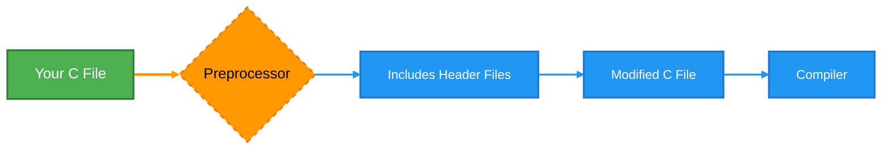

## <span style="color:#2980b9">`#ifdef`, `#ifndef`, `#else`, `#endif`: Conditional Compilation 🤔</span>

These directives are about conditional compilation. They allow you to include or exclude sections of your code based on whether a certain symbol is defined.

### <span style="color:#8e44ad">`#ifdef`: If Defined</span>

    *   The `#ifdef` directive checks if a symbol (usually defined by `#define`) is defined. If so, it includes the code block.
       *   **Example:**
           ```c
           #define DEBUG_MODE

           #ifdef DEBUG_MODE
             printf("Debug mode is enabled!\n");
             // other debug-specific code
           #endif

           int main() {
             printf("Hello, world!\n");
           }
           ```
      * If `DEBUG_MODE` is defined, the debug message will be printed. If you comment out `#define DEBUG_MODE`, it won't appear.

### <span style="color:#8e44ad">`#ifndef`: If Not Defined</span>

    *   The `#ifndef` directive does the opposite – it checks if a symbol is *not* defined.
        * **Example:**
          ```c
           #ifndef RELEASE_MODE
              printf("Running in development mode\n");
           #else
              printf("Running in release mode\n")
          #endif

          int main(){
            printf("Execution Starts\n");
          }
          ```
    * If `RELEASE_MODE` is *not* defined, the code inside `#ifndef` will be included.

### <span style="color:#8e44ad">`#else` and `#endif`</span>

- `#else` provides an alternate code block, while `#endif` closes the `#ifdef` or `#ifndef` block.
- **Example:**

  ```c
  #define OS_WINDOWS

  #ifdef OS_WINDOWS
    printf("Running on Windows.\n");
  #elif defined OS_LINUX
    printf("Running on Linux.\n");
  #else
    printf("Unknown operating system.\n");
  #endif
  ```

- `#elif` checks another condition if previous `#ifdef` is false, You can have multiple `#elif`s.

### <span style="color:#8e44ad">Why Use Conditional Compilation?</span>

    *   It’s useful for platform-specific code, enabling/disabling debugging features, or customising your code for different configurations.
    * It makes code more flexible and adaptable, as you can modify build configurations easily.

## <span style="color:#2980b9">Other Useful Directives 🛠️</span>

There are other preprocessor directives too, but these are less commonly used. Here are two examples:

- **`#undef`**: This directive removes a previously defined macro.
  - **Example:**

    ```c
    #define DEBUG_MODE
    #undef DEBUG_MODE
    // After this, DEBUG_MODE is no longer defined
    ```

- **`#pragma`**: Compiler-specific directives which can have varied functionality across different compilers.
  - **Example:**

    ```c
    #pragma once // Used to ensure a header file is included only once
    ```

- **Line Control**: The `#line` directive controls line numbering in error messages during compile time.
  - **Example**:

    ```c
    #line 100 "new_file.c"
     // The next error or line will be shown as line 100 of "new_file.c"
    ```

## <span style="color:#2980b9">Quick Recap & Further Learning 🚀</span>

- `#define` - For creating symbolic constants and macros.
- `#include` - For including header files.
- `#ifdef`, `#ifndef`, `#else`, `#endif` - For conditional compilation.
- `#undef` - To remove macro definitions.
- `#pragma` - For compiler-specific instructions
- `#line` - For controlling line numbering

These preprocessor directives are an important part of writing effective C code. They offer features to make your code adaptable and maintainable. To learn more, check out these resources:

- [CPP Reference on Preprocessor](https://en.cppreference.com/w/c/preprocessor)
- [GeeksForGeeks: C Preprocessors](https://www.geeksforgeeks.org/c-preprocessors/)

I hope this made understanding C preprocessor directives a little easier! If you have any questions, feel free to ask. Happy coding! 🎉

Okay, let's dive into the fascinating world of the C preprocessor! Think of it as the code's personal chef, preparing it perfectly before it goes into the compiler's oven. 🧑‍🍳

# <span style="color:#e67e22">The C Preprocessor: Preparing Code for Compilation</span> ⚙️

The C preprocessor is a separate program that runs _before_ the actual C compiler. Its main job is to manipulate the source code based on special instructions called _preprocessor directives_. These directives start with a `#` symbol. It's like giving the chef a recipe with specific instructions to follow before cooking begins.

## <span style="color:#2980b9">The Preprocessing Workflow: Step by Step</span> 👣

Here's how the preprocessor works, like a well-oiled machine:

1. **Scanning:** The preprocessor first scans the entire C source file character by character. It's like the chef reading through all the ingredients in the recipe.
2. **Removing Comments:** All comments (both `/* ... */` and `// ...` ) are removed. The chef doesn't need those side notes while preparing the dish.
3. **Processing Directives:** This is where the real action happens! The preprocessor goes through each line, looking for directives (`#` symbols).
   - **Include Files:** Directives like `#include <stdio.h>` and `#include "my_header.h"` tell the preprocessor to find and insert the content of other files into the current file. It's like the chef gathering extra ingredients from their pantry or neighbors.

   ```c
   #include <stdio.h>  // Brings in standard input/output functions
   #include "my_header.h" // Brings in user-defined definitions
   ```

   - **Macro Definitions:** Directives like `#define PI 3.14159` create macros. When the preprocessor sees `PI` later in the code, it replaces it with `3.14159`. It's like the chef using a shorthand for commonly used ingredients or steps.

   ```c
   #define PI 3.14159   // Replace PI with 3.14159
   #define MAX(a, b) ((a) > (b) ? (a) : (b)) // Macro to find the maximum of two values.
   ```

   - **Conditional Compilation:** Directives like `#ifdef`, `#ifndef`, `#if`, `#else`, `#elif` and `#endif` enable parts of the code to be included or excluded based on certain conditions. It's like the chef adapting the recipe based on the availability of ingredients or dietry restrictions.

   ```c
   #ifdef DEBUG
   printf("Debug information: x = %d\n", x);
   #endif

   #if defined(__linux__)
   // Code specific to Linux
   #elif defined(__APPLE__)
   // Code specific to macOS
   #else
   // Code for other systems
   #endif
   ```

4. **Line Numbering:** The preprocessor adds information about line numbers to the code to help compiler generate accurate error messages. It's like the chef keeping track of which instruction in the recipe they're following.

5. **Output:** Finally, the preprocessor generates a new source code file (that has been preprocessed) and passes that output to the compiler. This is like the chef delivering the prepped ingredients to the kitchen where they can be cooked.

```mermaid
flowchart TD
    A[📄 Source Code *.c file*]:::start --> B(⚙️ Preprocessor):::process
    B --> C{📝 Scan & Remove Comments}:::decision
    C --> D{🔧 Process Directives}:::decision
    D --> E[📂 Include Files]:::process
    D --> F[🔨 Macro Definitions]:::process
    D --> G[📜 Conditional Compilation]:::process
    G --> H[🔢 Line Numbers]:::process
    H --> I[🗂️ Preprocessed Code]:::process
    I --> J(💻 Compiler):::process
    J --> K[📀 Object Code *.o file*]:::process

    classDef start fill:#4CAF50,stroke:#388E3C,stroke-width:2px,color:#FFFFFF,font-size:16px,corner-radius:10px;
    classDef process fill:#2196F3,stroke:#1976D2,stroke-width:2px,color:#FFFFFF,font-size:14px,corner-radius:10px;
    classDef decision fill:#FFEB3B,stroke:#FBC02D,stroke-width:2px,color:#000000,font-size:16px,corner-radius:10px;


    linkStyle 0 stroke:#2196F3,stroke-width:2px;
    linkStyle 1 stroke:#2196F3,stroke-width:2px;
    linkStyle 2 stroke:#2196F3,stroke-width:2px;
    linkStyle 3 stroke:#2196F3,stroke-width:2px;
    linkStyle 4 stroke:#2196F3,stroke-width:2px;
    linkStyle 5 stroke:#2196F3,stroke-width:2px;
    linkStyle 6 stroke:#2196F3,stroke-width:2px;
    linkStyle 7 stroke:#2196F3,stroke-width:2px;
    linkStyle 8 stroke:#2196F3,stroke-width:2px;
    linkStyle 9 stroke:#2196F3,stroke-width:2px;

```

## <span style="color:#8e44ad">Why Use the Preprocessor?</span> 🤔

The C preprocessor is quite powerful! Here are some key reasons we use it:

- **Code Reusability:** Sharing common declarations and code using `#include`.
- **Readability:** Using symbolic constants for numbers using `#define`.
- **Platform Independence:** Using conditional compilation for cross-platform software.
- **Debugging:** Adding debug information selectively using conditional compilation.
- **Code Flexibility:** Using macros for some simple "inline functions".

## <span style="color:#8e44ad">Example</span> 💻

Let's look at a simple code example:

```c
#include <stdio.h>

#define GREETING "Hello, World!"
#define PI 3.14159

int main() {
  float radius = 5.0;
  float area = PI * radius * radius;
  printf("%s\n", GREETING);
  printf("Area of a circle: %f\n", area);
  return 0;
}
```

_After preprocessing, the code will look something like:_

```c
# 1 "example.c"
# 1 "<built-in>"
# 1 "<command-line>"
# 1 "/usr/include/stdio.h" 1 3 4
# 27 "/usr/include/stdio.h" 3 4
# 1 "/usr/include/features.h" 1 3 4
# 375 "/usr/include/features.h" 3 4
# 1 "/usr/include/stdc-predef.h" 1 3 4
# 376 "/usr/include/features.h" 2 3 4
# 397 "/usr/include/features.h" 3 4
# 1 "/usr/include/sys/cdefs.h" 1 3 4
# 400 "/usr/include/features.h" 2 3 4
# 424 "/usr/include/features.h" 3 4
# 1 "/usr/include/gnu/stubs.h" 1 3 4
# 7 "/usr/include/gnu/stubs.h" 3 4
# 1 "/usr/include/gnu/stubs-64.h" 1 3 4
# 8 "/usr/include/gnu/stubs.h" 2 3 4
# 425 "/usr/include/features.h" 2 3 4
# 28 "/usr/include/stdio.h" 2 3 4
# 1 "/usr/include/bits/types.h" 1 3 4
# 27 "/usr/include/bits/types.h" 3 4
# 1 "/usr/include/bits/wordsize.h" 1 3 4
# 28 "/usr/include/bits/types.h" 2 3 4
# 1 "/usr/include/bits/timesize.h" 1 3 4
# 29 "/usr/include/bits/types.h" 2 3 4
# 1 "/usr/include/bits/typesizes.h" 1 3 4
# 30 "/usr/include/bits/types.h" 2 3 4
# 1 "/usr/include/bits/time64.h" 1 3 4
# 31 "/usr/include/bits/types.h" 2 3 4
# 29 "/usr/include/stdio.h" 2 3 4
# 1 "/usr/include/bits/stdio_lim.h" 1 3 4
# 30 "/usr/include/stdio.h" 2 3 4
# 1 "/usr/include/bits/floatn.h" 1 3 4
# 123 "/usr/include/bits/floatn.h" 3 4
# 1 "/usr/include/bits/floatn-common.h" 1 3 4
# 24 "/usr/include/bits/floatn-common.h" 3 4
# 1 "/usr/include/bits/long-double.h" 1 3 4
# 124 "/usr/include/bits/floatn.h" 2 3 4
# 31 "/usr/include/stdio.h" 2 3 4
# 717 "/usr/include/stdio.h" 3 4
# 1 "example.c" 2

int main() {
  float radius = 5.0;
  float area = 3.14159 * radius * radius;
  printf("%s\n", "Hello, World!");
  printf("Area of a circle: %f\n", area);
  return 0;
}

```

The `#include <stdio.h>` directive includes content from `stdio.h`. The `#define` macros are substituted for their values, making the actual code sent to the compiler look different from the original. All of the header files have been recursively included at the top of the file.

## <span style="color:#8e44ad">Resources for further learning</span> 📚

- **GCC Preprocessor Documentation:** [https://gcc.gnu.org/onlinedocs/cpp/](https://gcc.gnu.org/onlinedocs/cpp/) - The official documentation for the GNU C preprocessor.
- **Tutorials Point C Preprocessor:** [https://www.tutorialspoint.com/cprogramming/c_preprocessors.htm](https://www.tutorialspoint.com/cprogramming/c_preprocessors.htm) - A good overview for beginners.
- **GeeksforGeeks C Preprocessor:** [https://www.geeksforgeeks.org/c-preprocessors/](https://www.geeksforgeeks.org/c-preprocessors/) - A more detailed explanation with examples.

Let me know if you have any more questions! 😊

# <span style="color:#e67e22">Header Files in C: Your Code's Blueprint 📜</span>

Let's see header files in C. Think of them as the unsung heroes of well-organized and reusable code. They're like blueprints that help your program understand the different parts of its own structure. Let's break it down!

## <span style="color:#2980b9">What are Header Files? 🤔</span>

Header files in C, also known as "include files", have file names with the extension `.h` (like `stdio.h`). They're not meant to contain actual code that _does_ things. Instead, they hold _declarations_. These declarations tell the compiler about:

- **Function prototypes**: The blueprints for functions – what they're named, what they expect as input (arguments), and what they return.
- **Data types**: Definitions of new data types, like `struct` or `enum`.
- **Constants**: Macros defined using `#define` that represent values (e.g., `#define PI 3.14159`).
- **External variables**: Declarations of variables defined in other source files.

### <span style="color:#8e44ad">Why Use Header Files? 🧩</span>

- **Organization:** Header files help keep your code tidy by separating declarations from the actual implementation. Think of it as keeping your ingredients separate from your recipe – everything's organized!
- **Reusability:** You can include the same header file in multiple C source files. This way, you don't have to write the same declarations over and over again! Imagine having a single instruction manual for several different devices.
- **Modularity:** Header files enable you to divide your program into modules or components. This makes it easier to develop, test, and maintain your code. It's like building with Lego blocks – each component fits neatly together.
- **Faster Compilation:** By providing declarations in advance, the compiler doesn't have to re-parse the same declarations in each file, leading to faster compilation times.
- **Abstraction:** Header files hide the implementation details and show the usage of the functions or data structures, promoting abstraction and code clarity.

Here's a simple analogy, Imagine you’re building a house 🏡.

- Header files are like the architectural blueprints 📐: They provide a plan for the structure (functions, variables) without actually building it.
- Source files are like the construction crew 👷: They use the blueprints to assemble the actual building.

## <span style="color:#2980b9">How to Use Header Files? 🛠️</span>

You include header files in your C source files using the `#include` preprocessor directive. Here are the two common ways:

- **System Header Files:** These are built-in header files provided by the compiler. You include them using angle brackets `<>`.

  ```c
   #include <stdio.h> // Standard input/output library
   #include <stdlib.h> // General utilities
   #include <string.h> // String manipulation
  ```

- **User-defined Header Files:** These are header files you create yourself, and you include them using double quotes `""`.
  `c
 #include "my_header.h" // Example of a custom header file
`
  The difference is primarily where the compiler looks for the file. Angle brackets tell the compiler to search in the system's standard include directories, while double quotes tell it to start searching in the current project directory.

## <span style="color:#2980b9">Commonly Used Header Files 📚</span>

Let's explore some super handy header files:

- `stdio.h`: **Standard Input/Output**. Contains functions for standard input and output operations, like `printf()` for printing to the console and `scanf()` for reading input.

  ```c
  #include <stdio.h>
  int main() {
      printf("Hello, world!\n");
      return 0;
  }
  ```

- `stdlib.h`: **Standard Library**. Contains functions for general utilities like memory allocation (e.g., `malloc()`, `free()`), converting data types (`atoi()`, `atof()`), and generating random numbers.

  ```c
  #include <stdlib.h>
  int main(){
    int* ptr = malloc(sizeof(int));
    *ptr = 10;
    free(ptr);
    return 0;
  }
  ```

- `string.h`: **String Manipulation**. Contains functions for working with character strings, such as `strcpy()` for copying strings, `strlen()` for finding the length of a string, and `strcmp()` for comparing strings.

  ```c
   #include <string.h>
   int main(){
    char str1[20] = "Hello";
    char str2[20];
    strcpy(str2,str1);
     return 0;
   }
  ```

- `math.h`: **Mathematical Functions**. Provides functions for common mathematical operations, like `sqrt()` for square root, `sin()` for sine, and `cos()` for cosine.

  ```c
   #include <math.h>
   int main(){
      double result = sqrt(25.0);
      return 0;
  }
  ```

- `time.h`: **Time and Date**. Contains functions for getting the current time and manipulating time-related data.

  ```c
   #include <time.h>
   int main(){
      time_t now = time(NULL);
       return 0;
   }
  ```

## <span style="color:#2980b9">Creating Your Own Header File ✍️</span>

Let's make our own header file!  
**`my_math.h`**

```c
 // my_math.h
#ifndef MY_MATH_H
#define MY_MATH_H

int add(int a, int b);
int subtract(int a, int b);

#endif
```

**`my_math.c`**

```c
 // my_math.c
#include "my_math.h"

int add(int a, int b) {
    return a + b;
}

int subtract(int a, int b) {
    return a - b;
}
```

**`main.c`**

```c
 // main.c
#include <stdio.h>
#include "my_math.h"

int main() {
    int x = 10;
    int y = 5;
    printf("Sum: %d\n", add(x, y));
    printf("Difference: %d\n", subtract(x, y));
    return 0;
}
```

Here's a breakdown:

- **`my_math.h`** declares function prototypes for `add` and `subtract`. The `#ifndef`, `#define` , and `#endif` statements are to ensure header files are only included once in your project, preventing conflicts when the same header file is included multiple times in different source files .
- **`my_math.c`** provides the actual implementation of those functions.
- **`main.c`** includes the `my_math.h` header file to use the functions declared in it.

**Important:**

- **Header guards** (_#ifndef_, _#define_, _#endif_) are _essential_ to prevent the compiler from processing the same header file multiple times, which can cause errors.

## <span style="color:#2980b9">Flowchart of Compilation with Header Files ⚙️</span>

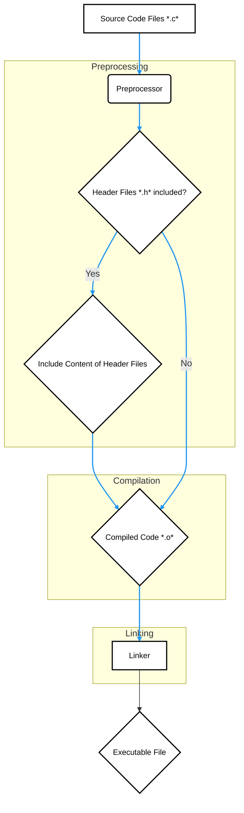

## <span style="color:#2980b9">Resources for Further Learning 📚</span>

- [GeeksforGeeks - Header Files in C](https://www.geeksforgeeks.org/header-files-in-c/)
- [Tutorialspoint - C Header Files](https://www.tutorialspoint.com/cprogramming/c_header_files.htm)
- [Programiz - C Header Files](https://www.programiz.com/c-programming/header-files)

## <span style="color:#2980b9">Wrapping Up 🎉</span>

Header files are a fundamental part of writing well-structured C programs. They promote reusability, organization, and modularity. With a little practice, you’ll be using them like a pro, creating more robust and maintainable code. Happy coding! 🚀✨

# <span style="color:#e67e22">`stdio.h` vs `stdlib.h`: A Friendly Guide 📚</span>

Hey there! Let's dive into two very important header files in C programming: `stdio.h` and `stdlib.h`. Think of them as toolboxes filled with helpful functions and macros that make your coding life much easier. We'll explore what each one offers and see some examples along the way. Let's get started! 🚀

## <span style="color:#2980b9">`stdio.h`: The Input/Output Hub 🖨️</span>

### <span style="color:#8e44ad">What is it?</span>

- `stdio.h` stands for **Standard Input/Output**. It's your go-to place for functions that handle communication between your program and the outside world. This mostly means getting input from the keyboard or files, and displaying output on the screen or writing to files.
- Essentially, it lets your program _talk_ to users and storage.

### <span style="color:#8e44ad">Key Functions & Macros:</span>

- **Input Functions:**
  - `printf()`: _Formats_ and prints output to the console.

    ```c
    #include <stdio.h>
    int main() {
        int age = 30;
        printf("I am %d years old.\n", age); // Output: I am 30 years old.
        return 0;
    }
    ```

  - `scanf()`: Reads formatted input from the console.

    ```c
    #include <stdio.h>
    int main() {
       int num;
       printf("Enter a number: ");
       scanf("%d", &num);
       printf("You entered: %d\n", num);
       return 0;
    }
    ```

  - `getchar()`: Reads a single character from the input stream.

    ```c
    #include <stdio.h>
    int main() {
       char ch;
       printf("Enter a character: ");
       ch = getchar();
       printf("You entered: %c\n", ch);
       return 0;
    }
    ```

  ````
  *   `gets()`: Reads a line of text from the standard input (though it's generally _not_ recommended due to security issues).
    ```c
   #include <stdio.h>
   int main() {
       char str[100];
       printf("Enter a string: ");
       gets(str);
       printf("You entered: %s\n", str);
       return 0;
   }
   ```
  *    `fgets()`: Reads a line of text from a specified file stream (more secure alternative to gets)
      ```c
      #include <stdio.h>
      int main() {
      char str[100];
      printf("Enter a string: ");
      fgets(str, sizeof(str), stdin); // Read from standard input
      printf("You entered: %s", str);
      return 0;
      }
       ```
  ````

- **Output Functions:**
  - `putchar()`: Writes a single character to the console.

    ```c
     #include <stdio.h>
    int main() {
        putchar('A'); // Output: A
        putchar('\n');
       return 0;
    }
    ```

    ```

    ```

  - `puts()`: Writes a string followed by a newline to the standard output

    ```c
     #include <stdio.h>
     int main() {
     puts("Hello there!"); // Output: Hello there! (with a newline)
     return 0;
     }
    ```

- **File Handling:**
  - `fopen()`: Opens a file for reading or writing.

    ```c
    #include <stdio.h>
    int main() {
       FILE *file;
       file = fopen("my_file.txt", "w"); // Opens a file in write mode
       if (file == NULL) {
       printf("Error opening file!\n");
       return 1;
       }
       fprintf(file, "Hello, file!\n");
       fclose(file);
        return 0;
     }
    ```

  - `fclose()`: Closes an opened file.
  - `fprintf()`: Formatted output to a file.
  - `fscanf()`: Formatted input from a file.
  - `fread()`: Reads raw bytes from a file.
  - `fwrite()`: Writes raw bytes to a file.

- **Other Useful Functions:**
  - `sprintf()`: Writes formatted output to a string buffer.

  ```c
   #include <stdio.h>
    int main() {
     char buffer[100];
     int num = 42;
     sprintf(buffer, "The answer is %d", num);
     printf("%s\n", buffer); // Output: The answer is 42
     return 0;
    }
  ```

  - `sscanf()`: Reads formatted input from a string.

    ```c
    #include <stdio.h>
    int main() {
      char str[] = "123 456";
      int num1, num2;
      sscanf(str, "%d %d", &num1, &num2);
      printf("Num1: %d, Num2: %d\n", num1, num2); // Output: Num1: 123, Num2: 456
      return 0;
    }
    ```

  ```

  ```

- **Macros:**
  - `NULL`: Represents a null pointer, often used to signal an invalid memory address.
  - `EOF`: End-of-file marker. Typically -1.

### <span style="color:#8e44ad">A Simple Flowchart for File Operations with `stdio.h`</span>

```mermaid
flowchart TD
    A[🟢 Start] --> B{📂 Open File?};
    B -- ✅ Yes --> C[🔄 File Operation *Read/Write*];
    B -- ❌ No --> D[⚠️ Handle Error];
    C --> E{🔒 Close File?};
    E -- ✅ Yes --> F[🏁 End];
    E -- ❌ No --> C;
    D --> F;

    classDef default fill:#FFFFFF,stroke:#000000,stroke-width:2px,color:#000000,font-size:14px,corner-radius:10px;
    classDef decision fill:#FFEB3B,stroke:#FBC02D,stroke-width:2px,color:#000000,font-size:16px,corner-radius:10px;
    classDef process fill:#2196F3,stroke:#1976D2,stroke-width:2px,color:#FFFFFF,font-size:14px,corner-radius:10px;


    class A,B,C,D,E,F decision;
    class C,D process;


    linkStyle 0 stroke:#2196F3,stroke-width:2px;
    linkStyle 1 stroke:#2196F3,stroke-width:2px;
    linkStyle 2 stroke:#2196F3,stroke-width:2px;
    linkStyle 3 stroke:#2196F3,stroke-width:2px;
    linkStyle 4 stroke:#2196F3,stroke-width:2px;

```

## <span style="color:#2980b9">`stdlib.h`: General Utilities 🛠️</span>

### <span style="color:#8e44ad">What is it?</span>

- `stdlib.h` stands for **Standard Library**. This header file is a mixed bag, containing various useful utilities that don't fit neatly into input/output.
- It provides general-purpose functions for memory management, number conversions, random number generation, and more.

### <span style="color:#8e44ad">Key Functions & Macros:</span>

- **Memory Management:**
  - `malloc()`: Dynamically allocates a block of memory.

    ```c
    #include <stdio.h>
    #include <stdlib.h>
    int main() {
      int *ptr;
      ptr = (int *)malloc(sizeof(int) * 5); // Allocate space for 5 integers
       if (ptr == NULL) {
           printf("Memory allocation failed!\n");
           return 1;
      }
      for(int i =0; i<5; i++){
         ptr[i] = i+1;
      }
      for(int i=0; i<5; i++){
         printf("%d ", ptr[i]); // Output: 1 2 3 4 5
      }
      free(ptr); // Remember to release the memory
      return 0;
    }
    ```

  - `calloc()`: Dynamically allocates memory and initializes it to zero.

    ```c
       #include <stdio.h>
        #include <stdlib.h>
       int main() {
           int *ptr;
           ptr = (int *)calloc(5, sizeof(int)); // Allocates space for 5 int, initialized to 0
           if (ptr == NULL) {
               printf("Memory allocation failed!\n");
               return 1;
             }
             for(int i =0; i<5; i++){
                 printf("%d ", ptr[i]); // Output: 0 0 0 0 0
              }
           free(ptr);
           return 0;
       }
    ```

  - `realloc()`: Resizes an already allocated block of memory.

  ```c
  #include <stdio.h>
  #include <stdlib.h>
  int main(){
    int *ptr;
     ptr = (int*)malloc(sizeof(int) * 2);
     if (ptr == NULL){
       printf("Memory allocation failed!");
       return 1;
      }
       ptr[0] = 1;
       ptr[1] = 2;
      ptr = realloc(ptr, sizeof(int)* 4); // resize to a size of 4
     if(ptr == NULL) {
      printf("Memory re-allocation failed!");
      free(ptr);
      return 1;
      }
      ptr[2] = 3;
      ptr[3] = 4;
     for(int i=0; i<4; i++){
          printf("%d ", ptr[i]);  // Output: 1 2 3 4
     }
     free(ptr);
    return 0;
  }
  ```

  - `free()`: Deallocates dynamically allocated memory (important to avoid memory leaks!).

- **Number Conversions:**
  - `atoi()`: Converts a string to an integer.

    ```c
    #include <stdio.h>
    #include <stdlib.h>
    int main() {
     char str[] = "123";
     int num = atoi(str);
     printf("Converted number: %d\n", num); // Output: Converted number: 123
      return 0;
     }
    ```

  - `atof()`: Converts a string to a floating-point number.

  ```c
  #include <stdio.h>
  #include <stdlib.h>
  int main() {
    char str[] = "3.14";
    double num = atof(str);
    printf("Converted number: %f\n", num); // Output: Converted number: 3.140000
   return 0;
  }
  ```

  - `atol()`: Converts a string to a long integer.

  ```c
   #include <stdio.h>
  #include <stdlib.h>
  int main() {
      char str[] = "123456789";
     long num = atol(str);
     printf("Converted number: %ld\n", num); // Output: Converted number: 123456789
      return 0;
  }
  ```

- **Random Number Generation:**
  - `rand()`: Generates a pseudo-random integer.

    ```c
    #include <stdio.h>
    #include <stdlib.h>
    #include <time.h>

    int main() {
        srand(time(NULL)); // Seed the random number generator
        for (int i = 0; i < 5; i++) {
            printf("%d ", rand()); // Output: 5 random numbers
        }
       printf("\n");
       return 0;
    }
    ```

  - `srand()`: Seeds the random number generator (often used with `time(NULL)` for different sequences).

- **Program Control:**
  - `exit()`: Terminates the program execution.

    ```c
    #include <stdio.h>
    #include <stdlib.h>
    int main(){
      printf("Start\n");
     exit(0);
     printf("End"); // not get executed
    return 0;
    }
    ```

  - `abort()`: Causes abnormal program termination

  ```c
  #include <stdio.h>
  #include <stdlib.h>

   int main() {
    printf("Program starting...\n");
    abort();
   printf("This will not be printed.\n");
   return 0;
   }
  ```

- **Environment Interaction:**
  - `getenv()`: Gets the value of an environment variable.

    ```c
    #include <stdio.h>
    #include <stdlib.h>
    int main() {
     char *path = getenv("PATH"); // Get the value of the PATH environment variable
     if (path != NULL) {
     printf("PATH: %s\n", path);
     } else {
     printf("PATH environment variable not found.\n");
     }
    return 0;
    }
    ```

  - `system()`: Executes a shell command.

- **Searching and Sorting:**
  - `qsort()`: Sorts an array using a provided comparison function.

  ```c
  #include <stdio.h>
  #include <stdlib.h>
  int compare(const void *a, const void *b){
  return (*(int*)a - *(int*)b);
  }
  int main(){
  int arr[] = {4,2,1,5,3};
  int n = sizeof(arr) / sizeof(arr[0]);
  qsort(arr, n, sizeof(int), compare);
  for(int i=0; i<n; i++){
     printf("%d ", arr[i]); // Output: 1 2 3 4 5
   }
  printf("\n");
  return 0;
  }
  ```

  - `bsearch()`: Performs a binary search on a sorted array.

- **Macros:**
  - `EXIT_SUCCESS`: Used as a status code for a successful exit.
  - `EXIT_FAILURE`: Used as a status code for an unsuccessful exit.
  - `NULL`: Represents a null pointer.
  - `RAND_MAX`: Maximum value that can be returned by `rand()`

## <span style="color:#2980b9">Key Differences Summarized 📝</span>

| Feature           | `stdio.h`                                         | `stdlib.h`                                                  |
| ----------------- | ------------------------------------------------- | ----------------------------------------------------------- |
| **Primary Focus** | Input/Output operations                           | General utilities                                           |
| **Functions**     | `printf()`, `scanf()`, `fopen()`, `fclose()` etc. | `malloc()`, `free()`, `atoi()`, `rand()`, `exit()` etc.     |
| **Use Cases**     | Reading/writing data to console/files             | Memory management, number conversions, random numbers, etc. |
| **Scope**         | Focuses on communication with external sources.   | Focuses on internal processes.                              |

## <span style="color:#2980b9">When to Use Which? 🤔</span>

- Use `stdio.h` when you need to read from the keyboard, display output on the screen, or handle files. Think of it as your communication interface. 🗣️
- Use `stdlib.h` when you need to allocate memory dynamically, convert data types, generate random numbers, or perform other general-purpose tasks. It's your utility belt. 🧰

## <span style="color:#2980b9">Additional Resources 🔗</span>

- **`stdio.h` on cplusplus.com:** [https://cplusplus.com/reference/cstdio/](https://cplusplus.com/reference/cstdio/)
- **`stdlib.h` on cplusplus.com:** [https://cplusplus.com/reference/cstdlib/](https://cplusplus.com/reference/cstdlib/)
- **GeeksforGeeks Article on `stdlib.h`:** [https://www.geeksforgeeks.org/stdlib-h-header-file-in-c/](https://www.geeksforgeeks.org/stdlib-h-header-file-in-c/)
- **GeeksforGeeks Article on `stdio.h`:** [https://www.geeksforgeeks.org/stdio-h-header-file-in-c/](https://www.geeksforgeeks.org/stdio-h-header-file-in-c/)

## <span style="color:#2980b9">Conclusion 🎉</span>

`stdio.h` and `stdlib.h` are essential parts of any C programmer's toolkit. Understanding what they offer and when to use them will make your code much more efficient and readable. So, keep exploring, experimenting, and happy coding! 👨‍💻👩‍💻

# <span style="color:#e67e22">Crafting Your Own C Header Files 🛠️</span>

Creating your own header files is a key skill for any C programmer. It helps with modularity, code reusability, and keeps things much more organized. Here, we'll break down exactly how to do it with some easy-to-follow steps and best practices.

## <span style="color:#2980b9">Why Use Header Files? 🤔</span>

Before we jump into _how_, let's explore _why_. Header files (usually ending in `.h`) serve several important purposes:

- **Declaring functions:** You tell your program what functions exist, their names, what they accept, and what they return, without actually providing the function's code.
- **Declaring variables:** Similar to functions, you can declare global variables that can be accessed from multiple source files.
- **Defining constants:** Use `#define` or `const` to define values that are used throughout your code.
- **Defining structures and unions:** Define custom data types, making your code much more readable and maintainable.
- **Type Definitions**: Using `typedef` to create more descriptive aliases for existing data types.

Here’s a simple flowchart to illustrate the use of header files:

```mermaid
graph LR
    A[📄 Source File *.c*] --> B[📄 Header File *.h*]
    C[📄 Source File 2 *.c*] --> B
    B -->|📜 Declarations| D[💻 Compiler]
    D -->|⚙️ Compilation| E[💾 Executable File]

    class A,C processStart
    class B processHeader
    class D processCompiler
    class E processExecutable

    classDef processStart fill:#FFEB3B,stroke:#FBC02D,stroke-width:2px,color:#000000,font-size:14px,corner-radius:10px;
    classDef processHeader fill:#4CAF50,stroke:#388E3C,stroke-width:2px,color:#FFFFFF,font-size:14px,corner-radius:10px;
    classDef processCompiler fill:#2196F3,stroke:#1976D2,stroke-width:2px,color:#FFFFFF,font-size:14px,corner-radius:10px;
    classDef processExecutable fill:#FF9800,stroke:#F57C00,stroke-width:2px,color:#FFFFFF,font-size:14px,corner-radius:10px;

    linkStyle 0 stroke:#2196F3,stroke-width:2px
    linkStyle 1 stroke:#2196F3,stroke-width:2px
    linkStyle 2 stroke:#2196F3,stroke-width:2px
    linkStyle 3 stroke:#2196F3,stroke-width:2px

```

<br>

## <span style="color:#2980b9">How to Create a Header File 📝</span>

Here’s a simple process:

1. **Create a new file:** Name your file with a `.h` extension. For example, `my_math.h`.

2. **Add your declarations:** Inside the header file, you'll declare your functions, variables, and anything else you want to share between source files.

3. **Include guards:** To prevent multiple inclusions of the same header file, use include guards. These are preprocessor directives that ensure a header file's content is only processed once per compilation unit.

4. **Save:** Save your header file!

### <span style="color:#8e44ad">Example Header File: `my_math.h`</span>

```c
// my_math.h
#ifndef MY_MATH_H  // Check if MY_MATH_H is not defined
#define MY_MATH_H  // If not, define it to prevent duplicate inclusions

// Function declarations
int add(int a, int b);
int subtract(int a, int b);

// Constant definition
#define PI 3.14159

// Structure definition
typedef struct {
    int x;
    int y;
} Point;

#endif // MY_MATH_H
```

- The `#ifndef MY_MATH_H` line checks if the symbol `MY_MATH_H` is not defined. If it isn't, the code proceeds; otherwise, it skips to the `#endif`.
- The `#define MY_MATH_H` line defines `MY_MATH_H`, which will prevent further inclusions of this header during the same compilation process.
- **Function Declarations:** `int add(int a, int b);` and `int subtract(int a, int b);` declare the add and subtract functions. These functions are defined in a separate `.c` file but are available for use in any other `.c` file that includes this header.
- **Constant Definition:** `#define PI 3.14159` Defines `PI` to be a constant value.
- **Structure Definition:** `typedef struct {int x; int y;} Point;` defines a new type called Point using a structure with two integer members.

## <span style="color:#2980b9">Using Your Header File ⚙️</span>

Now that you have a header file, let's see how to use it in a C source file:

1. **Include the header:** Use `#include "your_header.h"` in your `.c` file where you want to use the declarations from your header.

2. **Implement the functions:** Write function definitions in a `.c` file to match the declarations in your header file.

3. **Compile and run:** Compile your code and watch the magic happen!

### <span style="color:#8e44ad">Example Source File: `main.c`</span>

```c
// main.c
#include <stdio.h>
#include "my_math.h" // Include our custom header file

int main() {
    int num1 = 10;
    int num2 = 5;

    int sum = add(num1, num2);    // Use the functions from my_math.h
    int diff = subtract(num1, num2);

    printf("Sum: %d\n", sum);
    printf("Difference: %d\n", diff);
    printf("PI: %f\n", PI);   // Use the defined constant
    Point p = {3,4};
    printf("Point: (%d,%d)\n",p.x,p.y);

    return 0;
}
```

### <span style="color:#8e44ad">Example Source File: `my_math.c`</span>

```c
// my_math.c
#include "my_math.h"

int add(int a, int b) {
    return a + b;
}

int subtract(int a, int b) {
    return a - b;
}
```

_In `main.c`, we include "my_math.h" to be able to use all of the declarations inside `my_math.h`, and in `my_math.c`, we include `my_math.h` to make sure that function definitions match the declarations in `my_math.h`._

## <span style="color:#2980b9">Best Practices 🏆</span>

- **Include Guards:** Always use include guards to prevent multiple inclusions.
- **Descriptive Names:** Choose descriptive names for your header files.
- **One Header Per Module:** Try to put related declarations in a single header file for better organization.
- **Documentation:** Use comments to explain what’s inside the header.
- **Keep it Minimal:** Include only essential declarations in your header files, Avoid complex logic or global variable definitions in header files.
- **Use of `const`:** Prefer `const` over `#define` for defining constants whenever possible, especially for variables.
- **Declare, Don't Define:** Only declare functions and variables, don't define them in header files.
- **Organize logically:** Organize your declarations in a logical manner, group related functions, constants and types together

## <span style="color:#2980b9">Resources 📚</span>

- **GeeksforGeeks:** [C Header Files](https://www.geeksforgeeks.org/header-files-in-c-cpp/)
- **TutorialsPoint:** [C Header Files](https://www.tutorialspoint.com/cprogramming/c_header_files.htm)

And there you have it! You’ve now learned how to create and use your own header files in C. This will significantly help you write cleaner, more maintainable, and organized code. Happy coding! 🥳

# <span style="color:#e67e22">🚀 Diving into C Macros: Your Code Shortcuts 🛠️</span>

Hey there, fellow coders! 👋 Today, we're going to explore the fascinating world of **C macros**. Think of them as your personal code shortcuts – little snippets that the C preprocessor replaces _before_ your code is actually compiled. They can make your code more readable, reusable, and sometimes, a little bit magical! ✨

## <span style="color:#2980b9">What are C Macros?</span>

Macros in C are essentially text substitutions. Before the compiler even gets to work, the _preprocessor_ goes through your code, finding those macros and replacing them with their defined values or expressions. It's like having a find-and-replace function for your code, but on steroids! 🦸‍♂️

- **Preprocessing:** The preprocessor is like a first pass on your code, it doesn't compile it, just prepares it for the compiler.
- **`#define` Directive:** You create macros using the `#define` directive.
- **Textual Replacement:** Macros perform _textual_ substitution, not type checking or evaluation. This is a _key distinction_!

## <span style="color:#2980b9">Types of C Macros</span>

There are two main types of macros:

### <span style="color:#8e44ad">Object-like Macros</span>

These macros are similar to constants. You use them to represent a fixed value.

- **Syntax:** `#define MACRO_NAME value`
- **Usage:** When the preprocessor finds `MACRO_NAME`, it replaces it with `value`.
- **Example:**

  ```c
  #include <stdio.h>

  #define PI 3.14159
  #define MY_NAME "Alice"

  int main() {
    float radius = 5.0;
    float area = PI * radius * radius;
    printf("The area is: %f\n", area);
    printf("My name is: %s\n", MY_NAME);
    return 0;
  }
  ```

  In the example above, wherever `PI` is used it will be replaced with the float value 3.14159 and wherever `MY_NAME` is used it will be replaced with the string "Alice".

- **Benefits:**
  - Improve code readability.
  - Centralize values (easier to update).

### <span style="color:#8e44ad">Function-like Macros</span>

These macros act like mini-functions but without the overhead of a function call. They take arguments and perform textual substitution based on them.

- **Syntax:** `#define MACRO_NAME(arg1, arg2, ...) expression`
- **Usage:** When the preprocessor finds `MACRO_NAME(actual_arg1, actual_arg2, ...)`, it replaces it with the `expression` after substituting the arguments.
- **Example:**

  ```c
  #include <stdio.h>

  #define SQUARE(x) ((x) * (x))
  #define MAX(a, b) ((a) > (b) ? (a) : (b))

  int main() {
    int num = 5;
    int square = SQUARE(num);
    int max_val = MAX(10, 20);
    printf("The square of %d is: %d\n", num, square);
    printf("The maximum is: %d\n", max_val);
    return 0;
  }
  ```

  In this example, wherever `SQUARE(x)` is called in the code it will be replaced by `((x) * (x))` and the variable `x` will be the value passed. Similarly for MAX.

- **Key Points:**
  - **Parentheses are crucial!** They prevent operator precedence issues.
  - **Avoid side effects in arguments:** As macros do simple text replacement, `SQUARE(num++)` can produce unexpected results. For Example, if you call `SQUARE(num++)` when `num = 5`, it will become `((num++) * (num++))`, this first multiplies the existing value of 5 by 5 and then increments, so result is 25, and after it gets incremented twice so the value of num is 7.
  - **No Type Checking:** Macros don't know about types. Be mindful of this, type related problems won't show up at compile time.
  - **Faster than Function calls:** Less overhead than calling a function.

## <span style="color:#2980b9">When to Use Macros?</span>

Macros can be powerful, but they should be used wisely. Here are some good use cases:

- **Defining Constants:** Like `PI` or maximum array sizes.
- **Conditional Compilation:** Including code based on compilation flags (`#ifdef`, `#ifndef`).
- **Simple Inline Operations:** Like `SQUARE()` or `MAX()`.

### <span style="color:#8e44ad">Flowchart: How Macros Work</span>

```mermaid
flowchart TD
    A[📄 C Source Code] --> B{⚙️ Preprocessor};
    B -- 🔍 Finds #define statements --> C[🔄 Text Substitution];
    C --> D[📝 Modified C Source Code];
    D --> E{💻 Compiler};
    E --> F[💾 Executable Code];

    class A processA;
    class B processB;
    class C processC;
    class D processD;
    class E processE;
    class F processF;

    classDef processA fill:#FFEB3B,stroke:#FBC02D,stroke-width:2px,color:#000000,font-size:14px,corner-radius:10px;
    classDef processB fill:#4CAF50,stroke:#388E3C,stroke-width:2px,color:#FFFFFF,font-size:14px,corner-radius:10px;
    classDef processC fill:#2196F3,stroke:#1976D2,stroke-width:2px,color:#FFFFFF,font-size:14px,corner-radius:10px;
    classDef processD fill:#FF9800,stroke:#F57C00,stroke-width:2px,color:#FFFFFF,font-size:14px,corner-radius:10px;
    classDef processE fill:#9C27B0,stroke:#7B1FA2,stroke-width:2px,color:#FFFFFF,font-size:14px,corner-radius:10px;
    classDef processF fill:#009688,stroke:#00796B,stroke-width:2px,color:#FFFFFF,font-size:14px,corner-radius:10px;

    linkStyle 0 stroke:#2196F3,stroke-width:2px;
    linkStyle 1 stroke:#2196F3,stroke-width:2px;
    linkStyle 2 stroke:#2196F3,stroke-width:2px;
    linkStyle 3 stroke:#2196F3,stroke-width:2px;


```

## <span style="color:#2980b9">Things to be aware of when using Macros</span>

Although macros are handy, you should be careful about them.

- **Debugging issues:** since the preprocessor modifies the code before compiling, if an error occurs due to macros its hard to debug because the debugger will show you the modified code not the code with the macros.
- **Side Effects:** As shown earlier passing an argument that has a side effect to a macro can cause unexpected and hard to debug behaviours.
- **No Type Safety:** Macros don't care about types. Which can lead to type mismatch errors which are hard to track.
- **Readability** overuse of macros can make the code very hard to read.

## <span style="color:#2980b9">Alternatives to Macros</span>

- **`const` variables:** For constants, `const` is often a better choice because it offers type safety.
- **`inline` functions:** For function-like operations, `inline` functions can be better as they provide type safety and don't have the side effect issues.

## <span style="color:#2980b9">Conclusion</span>

Macros in C are a powerful preprocessor feature that can help make your code concise and efficient. But it's important to understand how they work and when to use them. Like any tool, when used wisely they can make coding easier. Remember to avoid side effects, use parentheses, and consider alternatives when appropriate. Happy coding! 🚀

### <span style="color:#8e44ad">Resources</span>

Here are some resources if you would like to explore further:

1. **GeeksforGeeks - C Preprocessors:** [https://www.geeksforgeeks.org/c-preprocessors/](https://www.geeksforgeeks.org/c-preprocessors/)
2. **TutorialsPoint - C Preprocessors:** [https://www.tutorialspoint.com/cprogramming/c_preprocessors.htm](https://www.tutorialspoint.com/cprogramming/c_preprocessors.htm)
3. **CPPReference - C Preprocessor:** [https://en.cppreference.com/w/c/preprocessor](https://en.cppreference.com/w/c/preprocessor)

Okay, let's dive into the fascinating world of C macros and the preprocessor! Buckle up, it's gonna be a fun ride! 🚀

# <span style="color:#e67e22">Macros & The C Preprocessor: A Deep Dive</span> ⚙️

The C preprocessor is like a diligent assistant that works _before_ your actual code gets compiled. It handles directives, one of the most common ones being macros, which are essentially text replacements. Think of it as a super-powered find-and-replace tool. Let's explore this magical land!

## <span style="color:#2980b9">What are Macros?</span> 🤔

- Macros are defined using the `#define` directive.
- They allow you to give a name to a piece of code, which can be a constant value, an expression, or even a code snippet.
- The preprocessor then substitutes all occurrences of the macro's name with its definition before compilation.
- This makes them useful for things like defining constants, and simplifying complex code.

```c
 #define PI 3.14159
 #define GREET "Hello, world!"

 int main() {
     float area = PI * 5 * 5; // PI gets replaced with 3.14159
     printf("%s Area: %f\n", GREET, area); // GREET replaced with "Hello, world!"
     return 0;
 }
```

    *   Here, `PI` and `GREET` are macros. The preprocessor substitutes them before the actual compilation happens.

## <span style="color:#2980b9">Function-like Macros</span> 🪄

Macros can also mimic functions, taking arguments. These are called **function-like macros**.

```c
#define SQUARE(x) ((x) * (x))

 int main() {
     int result = SQUARE(5); // becomes ((5) * (5))
     printf("Square: %d\n", result);
     return 0;
 }
```

    *   `SQUARE(x)` is a macro that calculates the square of `x`.
    *   The parentheses around the parameters and the whole expression are crucial. Why? Read on!

### <span style="color:#8e44ad">Gotchas and Quirks!</span> ⚠️

- **No Type Checking**: Macros don't care about types. This can lead to unexpected results if you're not careful.
- **Substitution, Not Evaluation**: Macros do a _textual substitution_, not a true evaluation. For example:

  ```c
  #define DOUBLE(x) x + x
  int main() {
      int result = DOUBLE(5 * 2); // becomes 5 * 2 + 5 * 2 , evaluates to 20 not 10 * 2 = 20
  }

  // Here's a fix:
  #define DOUBLE(x) ((x) + (x)) // becomes ((5*2) + (5*2)), evaluates to 20
  ```

- **Side Effects**: Avoid using macros that cause side effects when used as parameters since they might be evaluated multiple times. Check the example:

  ```c
   #define SQUARE(x) ((x) * (x))
  int main() {
       int a = 5;
      int result = SQUARE(a++); // becomes ((a++) * (a++)), 'a' increases twice
       printf("Result: %d , a :%d \n", result,a); // output -> Result: 30 , a:7
      return 0;
  }
  ```

- **Debugging**: Macros can be tricky to debug as errors happen _after_ preprocessing. Your debugger will not see macro names.
  - Consider using inline functions in most cases if possible to avoid issues.

### <span style="color:#8e44ad">When to use macros?</span> ✨

Despite the quirks, macros still have their place:

- **Conditional Compilation**: They are useful for enabling or disabling code sections based on specific conditions.

  ```c
  #ifdef DEBUG
      printf("Debugging: Value of x is %d\n", x);
  #endif
  ```

- **Platform-Specific Code**: Macros can help you write code that compiles differently on various platforms.
- **Short, Simple Operations**: Small, commonly used operations can be defined as macros, to give the function call benefits without overhead.

## <span style="color:#2980b9">Other Preprocessor Directives</span> 📃

Beyond `#define`, the preprocessor has other powerful directives:

- `#include`: Used to include header files in your code, it literally pastes the content of the mentioned file in your source code.
- `#ifdef`, `#ifndef`, `#else`, `#endif`: These directives allow for conditional compilation based on defined macros.
- `#pragma`: Used for compiler-specific actions.

<br>

## <span style="color:#2980b9">The Preprocessing Workflow</span> ⚙️

Let's see how it all fits together.

```mermaid
graph LR
    A[📄 Source Code] --> B(⚙️ Preprocessor);
    B --> C{📝 Modified Code};
    C --> D(💻 Compiler);
    D --> E(📀 Object Code);
    E --> F(🔗 Linker);
    F --> G(💻 Executable);

    class A processA;
    class B processB;
    class C processC;
    class D processD;
    class E processE;
    class F processF;
    class G processG;

    classDef processA fill:#FFEB3B,stroke:#FBC02D,stroke-width:2px,color:#000000,font-size:14px,corner-radius:10px;
    classDef processB fill:#4CAF50,stroke:#388E3C,stroke-width:2px,color:#FFFFFF,font-size:14px,corner-radius:10px;
    classDef processC fill:#2196F3,stroke:#1976D2,stroke-width:2px,color:#FFFFFF,font-size:14px,corner-radius:10px;
    classDef processD fill:#FF9800,stroke:#F57C00,stroke-width:2px,color:#FFFFFF,font-size:14px,corner-radius:10px;
    classDef processE fill:#9C27B0,stroke:#7B1FA2,stroke-width:2px,color:#FFFFFF,font-size:14px,corner-radius:10px;
    classDef processF fill:#009688,stroke:#00796B,stroke-width:2px,color:#FFFFFF,font-size:14px,corner-radius:10px;
    classDef processG fill:#3F51B5,stroke:#303F9F,stroke-width:2px,color:#FFFFFF,font-size:14px,corner-radius:10px;

    linkStyle 0 stroke:#2196F3,stroke-width:2px;
    linkStyle 1 stroke:#2196F3,stroke-width:2px;
    linkStyle 2 stroke:#2196F3,stroke-width:2px;
    linkStyle 3 stroke:#2196F3,stroke-width:2px;
    linkStyle 4 stroke:#2196F3,stroke-width:2px;
    linkStyle 5 stroke:#2196F3,stroke-width:2px;

```

- The preprocessor takes your original `.c` file, performs its directives, substitutes macros, and outputs a modified code.
- This modified code is then given to the compiler for compilation into an object file.

## <span style="color:#2980b9"> Anecdotes and Examples </span> 💡

- **The Infamous Semicolon**: One common mistake is adding a semicolon at the end of a macro definition. For example, this code:

  ```c
  #define SQUARE(x) ((x) * (x));

   int main() {
      int result = SQUARE(5); //becomes ((5) * (5));;
      return 0;
  }
  ```

  will result in the dreaded double semicolon `;;` when used, which the compiler might not accept or treat as a null statement.

- **Debugging nightmares**: If your macro has complex definitions, debugging is going to be a nightmare because the debugging tools will not show any of your macro definitions and will only show the output from the preprocessor, hence if you have trouble with finding some errors in your code, check your preprocessor definitions and expand your macros to find the problem
- **Readability Challenges**: Overuse of complex macros can make your code very difficult to understand and maintain for yourself or other team members.

## <span style="color:#2980b9">Summary</span> 📝

Macros and the preprocessor are powerful tools, but they need to be handled with care. It is really handy and useful, if you know the pitfall.

- Macros are great for defining constants and simple operations, and doing conditional compilation.
- Function-like macros must be used carefully because there is no type check or evaluation before substitution.
- Be mindful of the potential gotchas and side effects.
- Use them sparingly and prefer `inline` functions when you can.

## <span style="color:#2980b9">Further Exploration</span> 📚

- [C Preprocessor - GeeksforGeeks](https://www.geeksforgeeks.org/c-preprocessors/)
- [The C Preprocessor - cppreference.com](https://en.cppreference.com/w/c/preprocessor)

Hope this helps you navigate the magical world of the C preprocessor and its quirks! Happy coding! 👨‍💻

# <span style="color:#e67e22">C Macros: Unleashing the Power of `#` and `##`</span> ✨

Hey there, coding enthusiasts! Let's dive into the fascinating world of C macros, specifically focusing on two incredibly useful operators: `#` (the **stringizing operator**) and `##` (the **token pasting operator**). These little guys can make your code more expressive, flexible, and let's face it, just plain cool! 😎

## <span style="color:#2980b9">The `#` Operator: Turning Code into Strings 🧵</span>

### <span style="color:#8e44ad">Stringizing Explained</span>

Imagine you want to convert a piece of your code (like a variable name or an expression) into a string literal. That's where the `#` operator shines! It's like magic: when used within a macro definition, it takes whatever follows it and turns it into a string.

- **How it works:**
  - The `#` operator is placed before a macro parameter.
  - During macro expansion, the macro argument is converted into a string literal.
  - Leading and trailing whitespace in the argument is ignored.

- **Example 1: Logging with Strings**

  ```c
  #include <stdio.h>

  #define LOG_VAR(var) printf("The variable "#var" has value: %d\n", var);

  int main() {
      int count = 42;
      LOG_VAR(count);  // This will expand to printf("The variable \"count\" has value: %d\n", count);
      return 0;
  }

  ```

  - **Output:** The variable "count" has value: 42

  - **Explanation:**
    - The `LOG_VAR` macro takes `var` as an argument.
    - `#var` turns the argument `count` into the string `"count"`.
    - The macro expands into a `printf` statement, displaying both the name and the value of the variable.

- **Example 2: Error Messages**

  ```c
  #include <stdio.h>

  #define ERROR_MESSAGE(msg) printf("Error: %s at line %d\n", #msg , __LINE__);

  int main() {
      int errorCode = 1;
      if (errorCode != 0) {
          ERROR_MESSAGE(File Not Found);
      }
  return 0;

  }

  ```

  - **Output:** Error: File Not Found at line 8

  - **Explanation:**
    - The `ERROR_MESSAGE` macro takes `msg` as an argument and converts it into a string.
    - `__LINE__` is a predefined macro in C which gives the current line number
    - The error message is printed using a `printf` statement, with the given error message and line number where this macro is called.

## <span style="color:#2980b9">The `##` Operator: Pasting Tokens Together 🧩</span>

### <span style="color:#8e44ad">Token Pasting Explained</span>

The `##` operator is all about joining or combining tokens in your code to create a new one. It's particularly handy when you want to generate identifiers or variable names programmatically using macros.

- **How it works:**
  - The `##` operator is placed between two macro parameters.
  - During macro expansion, the arguments adjacent to `##` are concatenated without any spaces in between.
  - The resulting sequence is then treated as a single token.

- **Example 1: Generating Variable Names**

  ```c
  #include <stdio.h>

  #define CREATE_VAR(type, name, num) type var##num = 10;

  int main() {
      CREATE_VAR(int, count, 1);
      CREATE_VAR(float, myValue, 2);

      printf("var1: %d\n", var1);
      printf("myValue2: %f\n", myValue2);

      return 0;
  }

  ```

  - **Output:** var1: 10 <br> myValue2: 10.000000

  - **Explanation:**
    - The `CREATE_VAR` macro takes the variable type, a base name, and a number.
    - `var##num` concatenates `var` with the provided number, creating variables like `var1` and `myValue2`.
    - The macro then declares and initializes each variable with the value 10.

- **Example 2: Structure Member Access**

  ```c
  #include <stdio.h>
  #define STRUCT_MEMBER_ACCESS(struct_name, member_name)  struct_name.member_name

  typedef struct Point {
      int x;
      int y;
  } Point;

  int main()
  {
  Point p = {10, 20};
  printf("X : %d\n", STRUCT_MEMBER_ACCESS(p,x));
   printf("Y : %d\n", STRUCT_MEMBER_ACCESS(p,y));
  return 0;
  }

  ```

  - **Output:** X : 10 <br> Y : 20

  - **Explanation:**
    - The `STRUCT_MEMBER_ACCESS` macro takes the struct_name and member_name as an argument.
    - `struct_name.member_name` concatenates the `struct_name` and `member_name` with `.` operator using the token pasting to get the struct member access.

## <span style="color:#2980b9">Key Takeaways & Usage Tips 💡</span>

- **`#` for Stringizing:** Converts macro arguments into strings, useful for logging, debugging, and creating human-readable output.
- **`##` for Token Pasting:** Combines tokens to create new identifiers, enabling dynamic generation of variable names or code components.
- **Careful Usage:** Be mindful that macro expansions happen during preprocessing, not at runtime. Overuse or complicated macros can make your code harder to read and debug.
- **Alternatives:** Consider using functions where appropriate for more type-safe operations, especially if the logic is complex. Macros are best suited for simple, repetitive tasks.
- **Debugging Macros:** When debugging macro expansions, use the `-E` flag with your compiler to see the preprocessed output and understand how your macros are actually transformed.

## <span style="color:#2980b9">Resources 📚</span>

- **GNU CPP Documentation:** [https://gcc.gnu.org/onlinedocs/cpp/Stringizing.html](https://gcc.gnu.org/onlinedocs/cpp/Stringizing.html)
- **GNU CPP Documentation:** [https://gcc.gnu.org/onlinedocs/cpp/Token-Pasting.html](https://gcc.gnu.org/onlinedocs/cpp/Token-Pasting.html)
- **GeeksforGeeks:** [https://www.geeksforgeeks.org/macros-and-its-types-in-c-cpp/](https://www.geeksforgeeks.org/macros-and-its-types-in-c-cpp/)

I hope this explanation of `#` and `##` operators in C macros has been helpful and insightful. Now you have the tools to create some powerful and expressive macros in your projects. Happy coding! 🚀

# <span style="color:#e67e22">Multiline Macros in C: A Friendly Guide 📝</span>

Macros in C are powerful tools for code substitution, but they can get a bit tricky when you need them to span multiple lines. Let's explore how to create and use them effectively.

## <span style="color:#2980b9">Understanding the Basics 🧐</span>

A regular macro in C is typically defined using the `#define` preprocessor directive. For example:

```c
#define SQUARE(x) ((x) * (x))
```

This simple macro `SQUARE(x)` replaces `x` with whatever you provide as an argument and computes its square. But what if you need a macro to do more, perhaps involve several statements? That's where multiline macros come in handy!

## <span style="color:#2980b9">Creating Multiline Macros 🛠️</span>

Multiline macros are created using the backslash character `\` at the end of each line to indicate that the macro definition continues on the next line. Here's a general form:

```c
#define MACRO_NAME(args) \
    statement1;        \
    statement2;        \
    statement3;
```

- The backslash `\` is crucial; it tells the preprocessor to treat the next line as a continuation of the same macro definition.
- Each `statement` is a separate operation you want your macro to perform.

Let's illustrate with an example of a macro that swaps two numbers:

```c
#define SWAP(a, b)   \
    do {           \
        int temp = a; \
        a = b;        \
        b = temp;     \
    } while(0)
```

- Notice the use of `do { ... } while(0)`. This is a common technique. It creates a block, so it can be treated as single statement in C context, ensuring that the macro behave correctly in `if` `else` conditions.
- **Important:** Use `do-while` block to ensure correct operation in `if-else` constructs

## <span style="color:#2980b9">Using Multiline Macros 🚀</span>

Now, let's see how we would actually use that `SWAP` macro:

```c
#include <stdio.h>

int main() {
    int x = 10, y = 20;

    printf("Before swap: x = %d, y = %d\n", x, y);
    SWAP(x, y); // Macro expansion happens here
    printf("After swap: x = %d, y = %d\n", x, y);

    return 0;
}
```

The preprocessor will replace `SWAP(x, y)` with the code block you defined, resulting in the swap.

### <span style="color:#8e44ad">Why do we use `do { ... } while(0)`?</span>

Let’s consider a case when you use an `if-else` block with the previous swap macro.

```c
#define SWAP_BAD(a, b)   \
        int temp = a; \
        a = b;        \
        b = temp;
```

If you use above `SWAP_BAD` in `if-else` statement like this:

```c
 if(x > 10)
    SWAP_BAD(x, y);
 else
     z = 0;
```

The above snippet will expand to

```c
 if(x > 10)
     int temp = x;
     x = y;
     y = temp;
 else
     z= 0;
```

The else will not be attached to the if as we have three statements without block. This is where do while (0) helps us to bundle the multiple statements as one block and handle this error.

## <span style="color:#2980b9">Advantages of Multiline Macros 👍</span>

- **Code Reusability:** You can encapsulate complex sequences of code into a single macro, promoting reusability.
- **Readability:** Macros can make code more readable by abstracting away repetitive tasks.
- **Performance:** Code inlined, reducing overhead of function calls.

## <span style="color:#2980b9">Things to Watch Out For ⚠️</span>

- **Debugging:** Macros are expanded during preprocessing, which can make debugging complex issues challenging. It is recommended to review expanded code during debugging.
- **Side Effects:** Since macros directly substitute text, be cautious about side effects (like modifying variables more than once). For example, if we used `SQUARE(x++)`, it would modify `x` multiple times, which is often not the desired behaviour. Always use parenthesis when working with parameters.
- **Overuse:** Overusing macros can make code harder to understand and debug. Use them judiciously.

## <span style="color:#2980b9">More Complex Example: Logging Macro 🪵</span>

Let's create a multiline logging macro:

```c
#include <stdio.h>
#include <time.h>

#define LOG(message)                                \
    do {                                            \
        time_t now;                                  \
        time(&now);                                  \
        printf("[%s] %s\n", ctime(&now), message); \
    } while(0)
```

This `LOG` macro prints a timestamped message. Let's see it in action:

```c
int main() {
    LOG("Starting the program...");
    int a = 5;
    LOG("The value of a is now 5");
    // ... more code ...
     LOG("Ending the program...");
    return 0;
}
```

This will print log messages with the time, making debugging simpler.

## <span style="color:#2980b9">Visualizing Macro Expansion 💡</span>

It might be helpful to visualize what the preprocessor does. Here's a simple illustration:

```mermaid
graph LR
    A[📄 Source Code] --> B{⚙️ Preprocessing};
    B --> C[📜 Expanded Code];
    C --> D{💻 Compilation};

    class A processA;
    class B processB;
    class C processC;
    class D processD;

    classDef processA fill:#FFEB3B,stroke:#FBC02D,stroke-width:2px,color:#000000,font-size:14px,corner-radius:10px;
    classDef processB fill:#4CAF50,stroke:#388E3C,stroke-width:2px,color:#FFFFFF,font-size:14px,corner-radius:10px;
    classDef processC fill:#2196F3,stroke:#1976D2,stroke-width:2px,color:#FFFFFF,font-size:14px,corner-radius:10px;
    classDef processD fill:#FF9800,stroke:#F57C00,stroke-width:2px,color:#FFFFFF,font-size:14px,corner-radius:10px;

    linkStyle 0 stroke:#2196F3,stroke-width:2px;
    linkStyle 1 stroke:#2196F3,stroke-width:2px;
    linkStyle 2 stroke:#2196F3,stroke-width:2px;

```

- **Source Code:** The original C code with macros.
- **Preprocessing:** The preprocessor expands macros and includes headers.
- **Expanded Code:** The code after macro substitution and header inclusion.
- **Compilation:** The compiler translates the expanded code into machine code.

## <span style="color:#2980b9">Alternatives to Macros 🔄</span>

While macros are powerful, sometimes functions or inline functions might be better alternatives for certain operations (due to debugging concerns). Consider your options based on readability, debugging effort, and performance requirements.

## <span style="color:#2980b9">Summary 📝</span>

- Multiline macros use backslashes `\` to span multiple lines.
- The `do { ... } while(0)` pattern is useful to avoid issues in conditional structures.
- Macros offer code reusability and can make code more readable.
- Be mindful of side effects and overuse of macros.
- There are also other alternatives that might be suitable such as functions.

## <span style="color:#2980b9">Further Reading 📚</span>

- [GCC documentation on macros](https://gcc.gnu.org/onlinedocs/cpp/Macros.html)
- [Tutorialspoint's C Macros Tutorial](https://www.tutorialspoint.com/cprogramming/c_preprocessors.htm)
- [GeeksforGeeks on C Preprocessors](https://www.geeksforgeeks.org/c-preprocessors/)

Hopefully, this explanation has made multiline macros clearer and more approachable. Happy coding! 😊

# <span style="color:#e67e22">Macros with Variable Arguments in C: Unleash the Power! 🚀</span>

Hey there! 👋 Let's dive into the fascinating world of C macros, specifically those that can handle a _variable_ number of arguments. These are super useful for making your code more flexible and readable. Think of them as adaptable shortcuts!

## <span style="color:#2980b9">What are Variable Argument Macros? 🤔</span>

Imagine you want to create a macro that can print messages to the console, but sometimes you want to print just one thing, and other times you want to print several things. That's where variable argument macros come in handy. They allow you to define a macro that can accept a different number of arguments each time you use it.

### <span style="color:#8e44ad">The `...` and `__VA_ARGS__` Magic ✨</span>

C uses two special tools for making these macros work:

- **`...` (ellipsis):** This symbol in the macro definition tells the compiler that the macro can accept a variable number of arguments. Think of it as saying _"and whatever else you might throw in there!"_
- **`__VA_ARGS__`:** This is a _predefined identifier_ that represents the variable arguments passed to the macro. It collects everything that comes after the mandatory arguments. Consider it like a _bucket_ holding all the extra bits!

## <span style="color:#2980b9">How to Define a Variable Argument Macro? 📝</span>

Let's look at an example:

```c
#include <stdio.h>

#define LOG(format, ...) printf("LOG: " format, __VA_ARGS__)

int main() {
  LOG("Hello, world!\n");
  LOG("The answer is %d\n", 42);
  LOG("Coordinates: x=%d, y=%d\n", 10, 20);
  return 0;
}
```

Here's the breakdown:

- `#define LOG(format, ...)`:
  - We are defining a macro named `LOG`.
  - `format` is the first (mandatory) argument which is usually a format string like `"Hello %d"`.
  - `...` indicates that the macro can receive additional arguments.
- `printf("LOG: " format, __VA_ARGS__)`:
  - Inside the macro, `__VA_ARGS__` will get replaced by all the extra arguments (if any) that are passed to `LOG`.
  - The code effectively becomes `printf("LOG: " "Hello %d", 42)` in the second call.

**Output:**

```
LOG: Hello, world!
LOG: The answer is 42
LOG: Coordinates: x=10, y=20
```

## <span style="color:#2980b9">Examples of Variable Argument Macros 🛠️</span>

Let's explore some more practical examples.

### <span style="color:#8e44ad">Debugging Macros</span>

This one enhances the logging example by adding timestamp:

```c
#include <stdio.h>
#include <time.h>

#define DEBUG(format, ...) { \
  time_t timer; \
  time(&timer); \
  struct tm *timeinfo = localtime(&timer); \
  printf("[%02d:%02d:%02d] DEBUG: " format, timeinfo->tm_hour, timeinfo->tm_min, timeinfo->tm_sec, __VA_ARGS__); \
}

int main() {
  DEBUG("Starting the process\n");
  int value = 100;
  DEBUG("The value is %d\n", value);
  return 0;
}
```

**Output**

```
[HH:MM:SS] DEBUG: Starting the process
[HH:MM:SS] DEBUG: The value is 100
```

Here, we include timestamp information and use curly braces `{}` to create a compound statement, allowing us to perform multiple operations within the macro.

### <span style="color:#8e44ad">A Simple Assert Macro</span>

```c
#include <stdio.h>
#include <stdlib.h>

#define ASSERT(condition, message, ...) \
  if (!(condition)) { \
    fprintf(stderr, "Assertion failed: %s, ", message); \
    fprintf(stderr, __VA_ARGS__); \
    fprintf(stderr, "\n"); \
    abort(); \
  }

int main() {
  int x = 5;
  ASSERT(x > 0, "x should be greater than 0", "x = %d", x);
  ASSERT(x < 2, "x should be less than 2", "x = %d", x); // This will fail and abort.
  return 0;
}
```

This example demonstrates how to create a basic assertion mechanism, where the program will halt if the condition fails, and the `__VA_ARGS__` can print extra diagnostic info.

**Output:**

```
Assertion failed: x should be less than 2, x = 5
```

This would also trigger an `abort()`.

## <span style="color:#2980b9">Important Considerations ⚠️</span>

- **Parentheses Around `__VA_ARGS__`**: It's a good practice to use parentheses when using `__VA_ARGS__` (e.g. `printf("...", (__VA_ARGS__))`). This prevents potential issues if no extra arguments are given which can lead to compile-time errors in older versions of C.
- **Comma Problems**: If the macro uses `__VA_ARGS__` without any optional args, a trailing comma may appear. Some compilers may show warnings. You can solve this using GNU `##` preprocessor token concatenation operator to remove the trailing comma when `__VA_ARGS__` is empty:

```c
#define LOG(format, ...) printf("LOG: " format, ##__VA_ARGS__)
```

- **Type Safety**: Macros are not type-safe. They perform a simple text substitution, so be careful about the types of arguments you pass to your macros, particularly format specifiers in `printf` and `scanf`.
- **Readability and Debugging**: Overuse of complex macros can make your code hard to read and debug, so use them judiciously. Prefer functions in most cases.

## <span style="color:#2980b9">When to Use Variable Argument Macros? 🤔</span>

Variable argument macros are helpful in:

- **Logging and debugging**: Print statements with varying levels of details.
- **Generating code**: Creating repetitive code structures with slight variations.
- **Simplifying repetitive tasks**: Reducing the boilerplate of repetitive actions.

## <span style="color:#2980b9">Resources for More Learning 📚</span>

- [GCC documentation on Variadic Macros](https://gcc.gnu.org/onlinedocs/cpp/Variadic-Macros.html)
- [GeeksforGeeks - Variable Arguments in Macros](https://www.geeksforgeeks.org/variable-arguments-in-macros-c/)

I hope this comprehensive guide helped you understand how to define and use variable argument macros in C! Remember to experiment and have fun! 🎉

Okay, let's dive into the fascinating world of branch prediction macros in GCC! 🚀

# <span style="color:#e67e22">Branch Prediction Macros in GCC: Making Your Code Faster! 🏎️</span>

Branch prediction macros are like little hints you give to your computer's processor. They help it anticipate which way your code will go next, particularly when dealing with `if` statements or loops. This speeds things up because the processor can get a head start on executing the likely path. Without these hints, the processor might have to wait until the last moment to figure things out, which slows down your program.

## <span style="color:#2980b9">Why Do We Need Branch Prediction? 🤔</span>

Processors have something called a _pipeline_. Imagine a factory assembly line where different parts of an instruction are processed simultaneously. When the processor encounters a branch (like an `if` statement), it needs to decide which path to take. If it has to wait until the condition is fully evaluated, the pipeline stalls, meaning some parts of the processor just sit idle. Branch prediction tries to guess the outcome beforehand to keep the pipeline running smoothly and efficiently.

- **The Problem:** Without branch prediction, every conditional branch could introduce significant delays.
- **The Solution:** Branch prediction helps by guessing which branch will be taken, reducing pipeline stalls.
- **The Impact:** Faster, more efficient code execution!

### <span style="color:#8e44ad">How GCC's Macros Help 🧑‍🏫</span>

GCC provides several macros that allow us to give hints about the likelihood of a branch being taken. These macros don't change how the code _works_, but how it _executes_, making it run more efficiently. They act as instructions to the compiler, which in turn generates code that informs the processor.

The most common macros are:

- `__builtin_expect(exp, c)`
- `likely(x)`
- `unlikely(x)`

Let’s break them down:

- **`__builtin_expect(exp, c)`:**
  - This is the most general macro. It tells the compiler that the expression `exp` is _expected_ to be equal to the constant `c`.

- **`likely(x)`:**
  - This is a convenience macro that's equivalent to `__builtin_expect(!!(x), 1)`. It tells the compiler that `x` is _likely_ to be true (non-zero).
- **`unlikely(x)`:**
  - This is another convenience macro equivalent to `__builtin_expect(!!(x), 0)`. It tells the compiler that `x` is _unlikely_ to be true.

<br>

## <span style="color:#2980b9">Examples in Action! 🎬</span>

Let's see some practical examples of how to use these macros:

```c
#include <stdio.h>

int main() {
  int x = 5;

    // Using __builtin_expect
  if (__builtin_expect(x > 3, 1)) {
    printf("x is likely greater than 3.\n");
  } else {
    printf("x is unlikely to be greater than 3.\n");
  }

   //Using likely
  if (likely(x < 10)) {
    printf("x is likely less than 10.\n");
  } else {
    printf("x is not likely less than 10.\n");
  }

    //Using unlikely
  if (unlikely(x == 0)) {
        printf("x is unlikely to be 0.\n");
  } else {
        printf("x is likely not 0.\n");
  }

    // Example in a loop
  for (int i = 0; i < 1000; i++) {
    if (unlikely(i % 100 == 0)) {
        //This is unlikely to happen
        printf("Multiple of 100 found: %d\n", i);
    } else {
        //This is likely to happen, the loop will repeat often.
        //do something
    }
  }
  return 0;
}
```

**Explanation:**

- **`__builtin_expect(x > 3, 1)`**: We are telling the compiler that we expect `x > 3` to be true (1) most of the time. The compiler might arrange the code so that the "true" branch is faster to access.
- **`likely(x < 10)`**: This says that it’s likely that `x` is less than 10.
- **`unlikely(x == 0)`**: This indicates that `x` being equal to 0 is not very probable.
- **Loop Example:** In a loop, if a particular condition (like `i % 100 == 0`) is _rare_, we should use `unlikely`. This guides the compiler to optimize the loop for the common case where this condition is false.

## <span style="color:#2980b9">When to Use These Macros? 🤔</span>

- **Common Paths:** Use `likely` or `__builtin_expect` with a non-zero expected value when a condition is usually true.
- **Rare Paths:** Use `unlikely` or `__builtin_expect` with a zero expected value for error conditions or rare cases.
- **Loops:** When you know a branch inside a loop is rarely taken, use `unlikely` to speed up the common execution path.

## <span style="color:#2980b9">Flowchart: How Branch Prediction Works 🗺️</span>

```mermaid
graph LR
    A[▶️ Start Instruction] --> B{🔄 Branch Condition};
    B -- ✅ Predicted True --> C[🟢 Execute True Path];
    B -- ❌ Predicted False --> D[🔴 Execute False Path];
    C --> E[➡️ Continue Execution];
    D --> E;
    B -- ✔️ Correct Prediction --> F[⏩ Pipeline Continues];
    B -- ❌ Incorrect Prediction --> G[🛑 Flush Pipeline];
    G --> B
    F --> E

    class A start;
    class B decision;
    class C,D process;
    class E,F,G process;

    classDef start fill:#FFEB3B,stroke:#FBC02D,stroke-width:2px,color:#000000,font-size:14px,corner-radius:10px;
    classDef decision fill:#4CAF50,stroke:#388E3C,stroke-width:2px,color:#FFFFFF,font-size:14px,corner-radius:10px;
    classDef process fill:#2196F3,stroke:#1976D2,stroke-width:2px,color:#FFFFFF,font-size:14px,corner-radius:10px;
    classDef enprocessd fill:#FF9800,stroke:#F57C00,stroke-width:2px,color:#FFFFFF,font-size:14px,corner-radius:10px;

    linkStyle 0 stroke:#2196F3,stroke-width:2px;
    linkStyle 1 stroke:#2196F3,stroke-width:2px;
    linkStyle 2 stroke:#2196F3,stroke-width:2px;
    linkStyle 3 stroke:#2196F3,stroke-width:2px;
    linkStyle 4 stroke:#2196F3,stroke-width:2px;
    linkStyle 5 stroke:#2196F3,stroke-width:2px;
    linkStyle 6 stroke:#2196F3,stroke-width:2px;

```

## <span style="color:#2980b9">Key Takeaways 📝</span>

- Branch prediction macros are hints to the compiler and processor to optimize conditional execution.
- `likely()` and `unlikely()` are convenience macros making it easier to use `__builtin_expect()`.
- Use `likely()` for paths that are usually taken and `unlikely()` for paths that are rare.
- Using these correctly can make a _noticeable difference_ in performance, especially in loops and frequently executed code.
- These macros DO NOT change functionality, only execution speed.
- Overuse or misuse of branch prediction can hinder the performance as well, therefore proper understanding is essential.

## <span style="color:#2980b9">Resources for further information 🔗</span>

- **GCC Documentation on Builtins:** [GCC Built-in Function Documentation](https://gcc.gnu.org/onlinedocs/gcc/Builtins.html)
- **Wikipedia Branch Prediction:** [Wikipedia: Branch Prediction](https://en.wikipedia.org/wiki/Branch_predictor)
- **Stack Overflow:** [Stack Overflow Topic Discussion](https://stackoverflow.com/questions/12626438/gcc-builtin-expect-what-is-it-used-for)
- **Example Code with explanation:** [GeeksforGeeks: Branch prediction](https://www.geeksforgeeks.org/branch-prediction-in-computer-architecture/)

By incorporating branch prediction macros carefully, you can squeeze even more performance out of your code! Remember, it's all about giving the processor a helpful heads-up. Happy coding! 🧑‍💻

# <span style="color:#e67e22">`typedef` vs `#define`: A Friendly Face-Off 🥊</span>

Cool tools: `typedef` and `#define`. Both help us make our code more readable and manageable, but they do it in different ways. Think of them as two different types of chefs, both aiming to create a delicious meal, but with different cooking styles. Let's see how they stack up!

## <span style="color:#2980b9">`typedef`: The Type Alias Master 🧑‍🏫</span>

### <span style="color:#8e44ad">What is `typedef`? 🤔</span>

`typedef` is like giving a nickname to a data type. Instead of using a long, cumbersome type name repeatedly, you can create a shorter, more descriptive alias. It's all about making your code easier to read and understand.

- **How it works:** It essentially creates a new name for an existing data type.
- **Example:** Let's say you're dealing with lots of integer values representing distances in meters. Instead of typing `int` everywhere, you can do this:

  ```c
  typedef int distance_in_meters;

  distance_in_meters my_distance = 100; // Now you can use distance_in_meters as if it's a type.
  ```

  See how much clearer it is? 😍

- **Key feature:** `typedef` works at compile time, meaning it's handled by the compiler during the process of translating your human-readable code to machine code.
- **Use cases:**
  - Simplifying complex data types like structures and pointers.

    ```c
    typedef struct {
        int x;
        int y;
    } Point;

    Point my_point = {5, 10}; // Much easier than struct { int x; int y; } my_point
    ```

  - Creating portable code by abstracting away platform-specific types.
  - Improving code readability.

## <span style="color:#2980b9">`#define`: The Text Replacer 📝</span>

### <span style="color:#8e44ad">What is `#define`? 🤔</span>

`#define` is a preprocessor directive, meaning it's handled by the preprocessor _before_ your code is compiled. It essentially replaces a text string with another text string. Think of it as a "find and replace" function but for your code.

- **How it works:** It replaces all instances of a specific identifier with a given value or expression.
- **Example:** Let's say you need a constant for the value of pi. You can do this:

  ```c
  #define PI 3.14159

  float area = PI * 5 * 5; // Before compilation, PI will be replaced with 3.14159
  ```

  Pretty straightforward, right? 😎

- **Key feature:** `#define` is a text substitution mechanism. It doesn't do any type checking.
- **Use cases:**
  - Defining constants (like `PI`).
  - Creating simple macros (short snippets of code that perform a specific task).

    ```c
    #define SQUARE(x) ((x) * (x))
    int result = SQUARE(5); //Before compilation result = ((5) * (5))

    ```

  - Conditional compilation based on certain conditions.

## <span style="color:#2980b9">The Main Differences: `typedef` vs `#define` ⚔️</span>

Here’s a quick table summarizing their key differences:

| Feature         | `typedef`                                   | `#define`                                   |
| --------------- | ------------------------------------------- | ------------------------------------------- |
| **Type**        | Creates type aliases                        | Performs text substitutions                 |
| **Timing**      | During compilation                          | Before compilation (preprocessor)           |
| **Type Safety** | Type-safe                                   | Not type-safe                               |
| **Debugging**   | Easier to debug as type information remains | Can be harder to debug due to substitutions |
| **Complexity**  | Handles more complex type definitions       | Handles constants, simple macros            |

Let's put this in a diagram to make it visually clear 📊:

```mermaid
flowchart LR
    A[📄 Source Code] --> B(⚙️ Preprocessor);
    B --> C{🔄 `#define` Substitutions};
    C --> D[📝 Modified Source Code];
    D --> E(💻 Compiler);
    E --> F{🔧 `typedef` Handling};
    F --> G[💾 Object Code];
    G --> H[📀 Executable];

    class A processStart;
    class B processPreprocessor;
    class C processSubstitutions;
    class D processModifiedCode;
    class E processCompiler;
    class F processTypedef;
    class G processObjectCode;
    class H processExecutable;

    classDef processStart fill:#FF9800,stroke:#F57C00,stroke-width:2px,color:#FFFFFF,font-size:14px,corner-radius:10px;
    classDef processPreprocessor fill:#2196F3,stroke:#1976D2,stroke-width:2px,color:#FFFFFF,font-size:14px,corner-radius:10px;
    classDef processSubstitutions fill:#4CAF50,stroke:#388E3C,stroke-width:2px,color:#FFFFFF,font-size:14px,corner-radius:10px;
    classDef processModifiedCode fill:#FFEB3B,stroke:#FBC02D,stroke-width:2px,color:#000000,font-size:14px,corner-radius:10px;
    classDef processCompiler fill:#9C27B0,stroke:#7B1FA2,stroke-width:2px,color:#FFFFFF,font-size:14px,corner-radius:10px;
    classDef processTypedef fill:#FFC107,stroke:#FFA000,stroke-width:2px,color:#000000,font-size:14px,corner-radius:10px;
    classDef processObjectCode fill:#3F51B5,stroke:#303F9F,stroke-width:2px,color:#FFFFFF,font-size:14px,corner-radius:10px;
    classDef processExecutable fill:#607D8B,stroke:#455A64,stroke-width:2px,color:#FFFFFF,font-size:14px,corner-radius:10px;

    linkStyle 0 stroke:#2196F3,stroke-width:2px;
    linkStyle 1 stroke:#2196F3,stroke-width:2px;
    linkStyle 2 stroke:#2196F3,stroke-width:2px;
    linkStyle 3 stroke:#2196F3,stroke-width:2px;
    linkStyle 4 stroke:#2196F3,stroke-width:2px;
    linkStyle 5 stroke:#2196F3,stroke-width:2px;

```

## <span style="color:#2980b9">When to Use What 🤔</span>

- **Use `typedef` when:**
  - You want to create a new name for an existing data type.
  - You need type safety.
  - You want to improve code readability.
  - You're working with complex data structures.

- **Use `#define` when:**
  - You need to define constants.
  - You need simple macros.
  - You want conditional compilation.
  - You're just doing simple text substitution.

## <span style="color:#2980b9">Real-World Examples 🌎</span>

Let's see some more examples to solidify our understanding:

1. **`typedef` for function pointers:**

   ```c
   typedef int (*Operation)(int, int); //Operation can now represent a pointer to any function that returns an int, and accepts two integers.

   int add(int a, int b) { return a + b; }
   int subtract(int a, int b) { return a - b; }

   Operation my_op = add;
   int result = my_op(5, 3); // result will be 8
   my_op = subtract;
   result = my_op(5,3); // result will be 2
   ```

2. **`#define` for conditional compilation:**

   ```c
   #define DEBUG_MODE

   #ifdef DEBUG_MODE
   // Code that will only be compiled if DEBUG_MODE is defined
   printf("Debug information: Values of variables X and Y.");
   #endif
   ```

## <span style="color:#2980b9">Things to Keep in Mind ⚠️</span>

- **`#define` can lead to unexpected results** due to lack of type checking and can be hard to debug, for this reason be careful while writing macros and prefer inline functions instead.
- **`typedef` introduces a new name for a type, not a new type itself**. The underlying type and behaviour will still be the same.
- **It's generally considered good practice to use `typedef` for type aliasing** and to be careful with usage of `#define` for complicated text substitutions.

## <span style="color:#2980b9">Wrapping Up! 🎉</span>

So, there you have it! `typedef` and `#define` are powerful tools in C, but they have different purposes and behaviors. Now you know when to reach for each one. 🚀 Happy coding!

For further reading check out these links:

- [typedef in C - GeeksforGeeks](https://www.geeksforgeeks.org/typedef-in-c/)
- [#define Directive in C - GeeksforGeeks](https://www.geeksforgeeks.org/define-directive-in-c-cpp/)

Remember to always think about what is the best tool for the job and keep improving. Cheers! 🥂

# <span style="color:#e67e22">`#define` vs `const` in C: A Friendly Showdown 🥊</span>

Lets explore two common ways to handle constants: the `#define` preprocessor directive and the `const` keyword. They both help you create values that don't change during program execution, but they operate in fundamentally different ways. Let's break it down!

## <span style="color:#2980b9">The Mighty `#define`: A Preprocessor Powerhouse ⚙️</span>

### <span style="color:#8e44ad">What is `#define`?</span>

`#define` is a _preprocessor directive_. Think of the preprocessor as a text editor that runs _before_ your C code gets compiled. It's basically a search-and-replace tool. When you use `#define`, you're telling the preprocessor: "Every time I see this symbol, replace it with this value or expression".

```c
#define PI 3.14159
#define GREETING "Hello, World!"
```

- **How it works:** Before the code is compiled, the preprocessor goes through your code and replaces every instance of `PI` with `3.14159` and every instance of `GREETING` with `"Hello, World!"`.
- **No type checking:** `#define` doesn't care about data types. It's a purely textual substitution.
- **Not a variable:** `PI` or `GREETING` defined with `#define` are _not variables_. They're symbolic names for values.
- **Debugging can be harder**: Debugging is not easy when the defined name is replaced with its value and variable doesn't exist.

### <span style="color:#8e44ad">Example of `#define` in action</span>

```c
#include <stdio.h>
#define MAX_SIZE 100

int main() {
  int myArray[MAX_SIZE];
  printf("The maximum size of the array is: %d\n", MAX_SIZE); // Preprocessor replaces MAX_SIZE with 100
  return 0;
}
```

<details>
<summary> Click here to see the code after preprocessor</summary>
```c
#include <stdio.h>

int main() {
int myArray[100];
printf("The maximum size of the array is: %d\n", 100);
return 0;
}

````
</details>

*   In this case, before compilation, `MAX_SIZE` will be replaced with 100.

## <span style="color:#2980b9">The Sturdy `const`: A Type-Conscious Keyword 🛡️</span>

### <span style="color:#8e44ad">What is `const`?</span>

The `const` keyword is a type qualifier, meaning it works with variables. It tells the compiler: "This variable's value should not be changed after it's initialized".

```c
const float PI = 3.14159;
const char* GREETING = "Hello, World!";
````

- **How it works:** `const` variables are actual variables that have a memory location and a type. The compiler enforces the "don't change" rule.
- **Type checking:** `const` enforces type checking. You have to declare the data type of const variable.
- **Is a variable:** A `const` is an actual variable with a data type.
- **Debugging friendly**: Debugging is easy as the variable exists.

### <span style="color:#8e44ad">Example of `const` in action</span>

```c
#include <stdio.h>

int main() {
  const int MAX_SIZE = 100;
  int myArray[MAX_SIZE];
  printf("The maximum size of the array is: %d\n", MAX_SIZE);
  // MAX_SIZE = 200; // This will cause a compiler error because MAX_SIZE is const
  return 0;
}
```

- Here, `MAX_SIZE` is a constant variable, and any attempt to modify it will result in a compiler error.

## <span style="color:#2980b9">Key Differences Summarized 📝</span>

Here's a quick comparison table to highlight their differences:

| Feature         | `#define`                                     | `const`                                                             |
| --------------- | --------------------------------------------- | ------------------------------------------------------------------- |
| **Nature**      | Preprocessor directive (textual substitution) | Keyword (variable with type and memory)                             |
| **Type**        | No type information                           | Enforces type checking                                              |
| **Scope**       | Scope of the pre-processing                   | Respects code block scope                                           |
| **Memory**      | Doesn't allocate memory                       | Allocates memory                                                    |
| **Debugging**   | Harder                                        | Easier                                                              |
| **Flexibility** | Flexible in text substitution                 | Limited to declaring constants and some modification using pointer. |
| **Use cases**   | Basic constants, macro functions              | Constants variables and memory safety                               |

## <span style="color:#2980b9">When to use which? 🤔</span>

- **`#define`**:
  - Use for basic symbolic constants like sizes, flags, or simple expressions that don't require type checking.
  - Good for simple macros (though prefer inline functions in modern C where possible).
- Should be avoided for defining constants.
- **`const`**:
  - Use for declaring variables that should not change after initialization.
  - Use when you want the compiler to enforce type safety and have proper debugging experience.
  - Prefer over `#define` for defining constants.

## <span style="color:#2980b9">Flowchart: `#define` vs `const`</span>

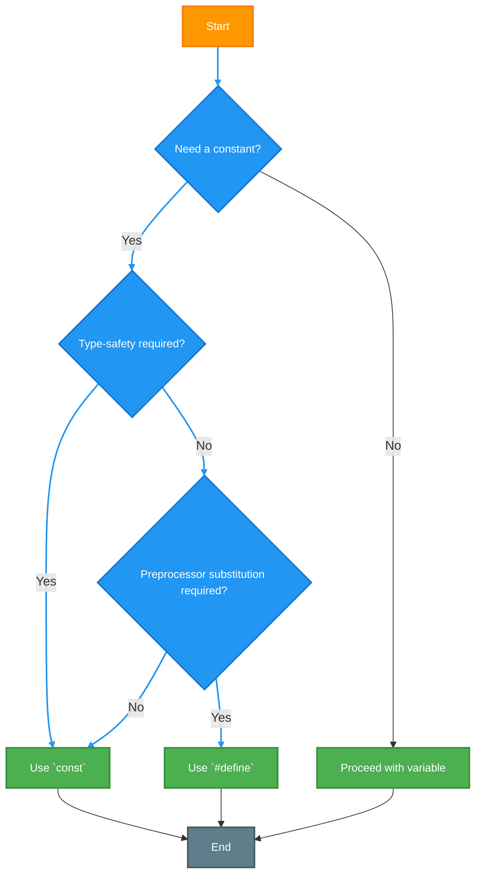

## <span style="color:#2980b9">Resources for more info 📚</span>

- **`#define` documentation**: [GeeksforGeeks - #define](https://www.geeksforgeeks.org/cc-define/)
- **`const` documentation**: [GeeksforGeeks - Const](https://www.geeksforgeeks.org/const-qualifier-in-c/)

Both `#define` and `const` have their place in C programming. Understanding how they operate behind the scenes will help you write better, safer, and more maintainable code! Choose the right tool for the job, and you'll be well on your way to C mastery! Happy coding! 🚀

<h1><span style='color:#e67e22'>Conclusion</span></h1>

And that's a wrap! 🎉 We hope you found this helpful and interesting. We're always looking to improve and hear from you, our awesome readers! So, don't be shy, please share your thoughts, comments, or any suggestions you have in the section below. What did you like? What could be better? We're all ears!👂 Let's keep the conversation going! 👇💬
