# <span style="color:#e67e22;">What we will learn in this post?</span>

<ul style='list-style-type: none; padding-left: 0;'>
<li><span style='color: #2980b9; font-size: 20px; font-weight: bold;'>👉</span> <span style='color: #2ecc71; font-size: 18px; font-weight: bold;'>Basics of File Handling in C</span></li>
<li><span style='color: #2980b9; font-size: 20px; font-weight: bold;'>👉</span> <span style='color: #2ecc71; font-size: 18px; font-weight: bold;'>C fopen() Function</span></li>
<li><span style='color: #2980b9; font-size: 20px; font-weight: bold;'>👉</span> <span style='color: #2ecc71; font-size: 18px; font-weight: bold;'>EOF, getc() and feof() in C</span></li>
<li><span style='color: #2980b9; font-size: 20px; font-weight: bold;'>👉</span> <span style='color: #2ecc71; font-size: 18px; font-weight: bold;'>fgets() and gets() in C</span></li>
<li><span style='color: #2980b9; font-size: 20px; font-weight: bold;'>👉</span> <span style='color: #2ecc71; font-size: 18px; font-weight: bold;'>fseek() vs rewind() in C</span></li>
<li><span style='color: #2980b9; font-size: 20px; font-weight: bold;'>👉</span> <span style='color: #2ecc71; font-size: 18px; font-weight: bold;'>Return Type of getchar(), fgetc() and getc()</span></li>
<li><span style='color: #2980b9; font-size: 20px; font-weight: bold;'>👉</span> <span style='color: #2ecc71; font-size: 18px; font-weight: bold;'>Read/Write Structure From/to a File in C</span></li>
<li><span style='color: #2980b9; font-size: 20px; font-weight: bold;'>👉</span> <span style='color: #2ecc71; font-size: 18px; font-weight: bold;'>C Program to Print Contents of File</span></li>
<li><span style='color: #2980b9; font-size: 20px; font-weight: bold;'>👉</span> <span style='color: #2ecc71; font-size: 18px; font-weight: bold;'>C Program to Delete a File</span></li>
<li><span style='color: #2980b9; font-size: 20px; font-weight: bold;'>👉</span> <span style='color: #2ecc71; font-size: 18px; font-weight: bold;'>C Program to Merge Contents of Two Files into a Third File</span></li>
<li><span style='color: #2980b9; font-size: 20px; font-weight: bold;'>👉</span> <span style='color: #2ecc71; font-size: 18px; font-weight: bold;'>Difference Between printf, sprintf and fprintf</span></li>
<li><span style='color: #2980b9; font-size: 20px; font-weight: bold;'>👉</span> <span style='color: #2ecc71; font-size: 18px; font-weight: bold;'>Difference Between getc(), getchar(), getch() and getche()</span></li>
<li><span style='color: #2980b9; font-size: 20px; font-weight: bold;'>👉</span> <span style='color: #2ecc71; font-size: 18px; font-weight: bold;'>Conclusion!</span></li>
</ul>

# <span style="color:#e67e22">File Handling in C: A Beginner's Guide 📖</span>

Welcome! This guide will help you understand the basics of how to read and write data to files using this powerful language. Think of files as persistent storage – a way to save your program's data even after the program finishes running.

## <span style="color:#2980b9">Why Read and Write Files? 🤔</span>

Reading and writing files is crucial for almost any non-trivial C program. Why? Because:

- **Persistence:** Imagine you built an amazing game, but all the player's progress disappears when the game closes. Files solve this! You can save game data (scores, levels, etc.) to a file and reload it later.
- **Data Management:** Large datasets (like customer records, sensor readings, or scientific data) are often stored in files. Your C program can efficiently process this data.
- **Configuration:** Many programs need configuration settings. Storing these in a file makes it easy to change them without recompiling the program.
- **Input/Output Flexibility:** Allows programs to interact with data outside of the program's immediate memory space.

## <span style="color:#2980b9">Basic File Operations 🛠️</span>

Before diving into code, let's cover the essential file operations:

### <span style="color:#8e44ad">Opening a File</span>

This is the first step. You use the `fopen()` function to open a file, specifying the filename and the mode (e.g., "r" for reading, "w" for writing, "a" for appending).

```c
FILE *fp = fopen("my_file.txt", "r"); // Opens my_file.txt for reading
```

If the file doesn't exist and you try to open it in read mode ("r"), `fopen()` returns `NULL`. If you try to open it in write ("w") or append ("a") mode, a new file will be created. Always check for errors!

### <span style="color:#8e44ad">Reading from a File</span>

Several functions can read data from a file:

- `fgetc()` reads a single character.
- `fgets()` reads a line of text.
- `fscanf()` reads formatted data (like numbers or strings).

```c
char ch = fgetc(fp); // Reads a single character
char line[255];
fgets(line, 255, fp); // Reads a line into the 'line' array

```

### <span style="color:#8e44ad">Writing to a File</span>

Similarly, several functions write data:

- `fputc()` writes a single character.
- `fputs()` writes a string.
- `fprintf()` writes formatted data.

```c
fputc('A', fp); // Writes the character 'A'
fputs("Hello, world!", fp); // Writes the string "Hello, world!"

```

### <span style="color:#8e44ad">Closing a File</span>

Crucially, always close your file using `fclose()`. This frees up resources and ensures that all data is written to the file.

```c
fclose(fp); // Closes the file
```

## <span style="color:#2980b9">File Handling Flowchart 📊</span>

```mermaid
graph TD
    A[🚀 Start]:::start --> B{📂 Open File fopen}:::decision;
    B -- Success --> C[✍️ Read or Write Data]:::process;
    B -- Failure --> D[⚠️ Error Handling]:::error;
    C --> E[📁 Close File fclose]:::process;
    D --> E;
    E --> F[🏁 End]:::process;

    %% Node styles
    classDef start fill:#6A1B9A,stroke:#4A148C,color:#FFFFFF,font-size:16px,stroke-width:2px,rx:10,ry:10;
    classDef process fill:#0277BD,stroke:#01579B,color:#FFFFFF,font-size:14px,stroke-width:2px,rx:10,ry:10;
    classDef decision fill:#F57F17,stroke:#E65100,color:#000000,font-size:16px,stroke-dasharray:5 5,stroke-width:2px,rx:10,ry:10;
    classDef error fill:#D32F2F,stroke:#B71C1C,color:#FFFFFF,font-size:14px,stroke-width:2px,rx:10,ry:10;

    %% Link styles
    linkStyle 0 stroke:#673AB7,stroke-width:2px;
    linkStyle 1 stroke:#388E3C,stroke-width:2px;
    linkStyle 2 stroke:#D32F2F,stroke-width:2px,stroke-dasharray:5 5;
    linkStyle 3 stroke:#0288D1,stroke-width:2px;
    linkStyle 4 stroke:#0288D1,stroke-width:2px;
```

## <span style="color:#2980b9">Example: Reading a File and Printing its Contents ✨</span>

```c
#include <stdio.h>

int main() {
    FILE *fp;
    char ch;
    fp = fopen("my_file.txt", "r"); // Open file for reading.  Make sure my_file.txt exists!
    if (fp == NULL) {
        perror("Error opening file");
        return 1; // Indicate an error
    }
    while ((ch = fgetc(fp)) != EOF) { // Read until the end of file (EOF)
        printf("%c", ch);
    }
    fclose(fp); // Close the file
    return 0;
}
```

Remember to create a file named `my_file.txt` in the same directory as your C program before running this code.

## <span style="color:#2980b9">Further Learning 🚀</span>

- **Online C Tutorials:** Search for "C file handling tutorial" on your favorite search engine. Many excellent resources are available!
- **C Standard Library Documentation:** Look up the `stdio.h` header file documentation for detailed information on file I/O functions.

This guide provides a foundational understanding of file handling in C. Remember to practice, experiment, and consult additional resources to deepen your knowledge. Happy coding! 😊

# <span style="color:#e67e22">Understanding `fopen()` in C: Your Friendly Guide</span> 📖

Let's explore the `fopen()` function in C, a crucial tool for working with files. Think of it as the key that unlocks the door to your files! This guide will explain it in simple terms with examples.

## <span style="color:#2980b9">What is `fopen()`?</span> 🔑

The `fopen()` function is a standard C library function used to open files. It establishes a connection between your program and a file on your computer's storage. This connection is represented by a _file pointer_, which you'll use to interact with the file (reading from it or writing to it).

### <span style="color:#8e44ad">Parameters of `fopen()`</span>

`fopen()` takes two main arguments:

- **`filename` (string):** This is the _path_ to the file you want to open. It can be a simple filename if the file is in the same directory as your program, or a full path if it's elsewhere. For example: `"my_data.txt"`, `/home/user/documents/myfile.txt`.
- **`mode` (string):** This specifies _how_ you want to open the file. This is crucial! Common modes include:
  - `"r"`: Open for reading (the file must already exist).
  - `"w"`: Open for writing. If the file exists, its contents are overwritten. If it doesn't exist, a new file is created.
  - `"a"`: Open for appending. New data is added to the end of the file. If the file doesn't exist, a new one is created.
  - `"r+"`: Open for both reading and writing. The file must already exist.
  - `"w+"`: Open for both reading and writing. If the file exists, its contents are overwritten; otherwise, a new file is created.
  - `"a+"`: Open for both reading and appending. If the file doesn't exist, a new one is created.

  _"b"_ can be added to any of these modes (e.g., `"rb"`, `"wb+"`) to open the file in _binary_ mode, which is important when working with non-text files (like images or executables).

## <span style="color:#2980b9">Return Value of `fopen()`</span> 📦

`fopen()` returns a _file pointer_ (a `FILE *` type in C).

- **Success:** If the file opens successfully, `fopen()` returns a pointer to the opened file. You can then use this pointer to perform operations on the file.
- **Failure:** If there's an error (e.g., the file doesn't exist and you're trying to open it in read mode, or you don't have permission to access the file), `fopen()` returns `NULL`. **Always check for `NULL` after calling `fopen()` to ensure the file opened correctly!**

## <span style="color:#2980b9">Examples</span> 💻

Let's see some code examples to illustrate how to use `fopen()`.

```c
#include <stdio.h>

int main() {
    FILE *fp;

    // Open a file for writing
    fp = fopen("my_file.txt", "w");
    if (fp == NULL) {
        perror("Error opening file"); // Print an error message
        return 1; // Indicate an error
    }

    fprintf(fp, "Hello, world!\n"); // Write to the file
    fclose(fp); // Close the file

    // Open a file for reading
    fp = fopen("my_file.txt", "r");
    if (fp == NULL) {
        perror("Error opening file");
        return 1;
    }

    char buffer[255];
    fgets(buffer, 255, fp); // Read from the file
    printf("Read from file: %s", buffer);
    fclose(fp); // Close the file

    return 0;
}
```

This code first opens `my_file.txt` for writing, writes "Hello, world!" to it, and then closes it. Afterwards, it opens the same file for reading, reads the content into a buffer, prints it to the console, and closes the file again. Remember to always close files using `fclose()` to release resources.

## <span style="color:#2980b9">Flowchart</span> 📊

```mermaid
graph TD
    A[🚀 Call fopen]:::start --> B{📂 File opened successfully?}:::decision;
    B -- Yes --> C[✅ Use file pointer]:::process;
    B -- No --> D[⚠️ Handle error, e.g., print error message]:::error;
    C --> E[📝 Perform file operations: read, write]:::process;
    E --> F[📁 Call fclose]:::process;
    F --> G[🏁 End]:::process;

    %% Node styles
    classDef start fill:#6A1B9A,stroke:#4A148C,color:#FFFFFF,font-size:16px,stroke-width:2px,rx:10,ry:10;

    classDef process fill:#0277BD,stroke:#01579B,color:#FFFFFF,font-size:14px,stroke-width:2px,rx:10,ry:10;
    classDef decision fill:#F57F17,stroke:#E65100,color:#000000,font-size:16px,stroke-dasharray:5 5,stroke-width:2px,rx:10,ry:10;
    classDef error fill:#D32F2F,stroke:#B71C1C,color:#FFFFFF,font-size:14px,stroke-width:2px,rx:10,ry:10;

    %% Link styles
    linkStyle 0 stroke:#673AB7,stroke-width:2px;
    linkStyle 1 stroke:#388E3C,stroke-width:2px;
    linkStyle 2 stroke:#D32F2F,stroke-width:2px,stroke-dasharray:5 5;
    linkStyle 3 stroke:#0288D1,stroke-width:2px;
    linkStyle 4 stroke:#0288D1,stroke-width:2px;
    linkStyle 5 stroke:#388E3C,stroke-width:2px;


```

## <span style="color:#2980b9">Key Points to Remember</span> 📌

- **Error Handling:** _Always_ check the return value of `fopen()` for `NULL` to detect errors.
- **File Closing:** Always close files using `fclose()` when you're finished with them to avoid resource leaks and data corruption.
- **File Modes:** Understand the different file modes and choose the appropriate one for your task.

## <span style="color:#2980b9">Further Resources</span> 🔗

For more in-depth information on file I/O in C, you can refer to these resources:

- [C Standard Library Documentation (fopen)](https://en.cppreference.com/w/c/io/fopen)
- [A good tutorial on file handling in C](https://www.tutorialspoint.com/cprogramming/c_file_io.htm)

Remember to compile your C code using a compiler like GCC or Clang before running it. Happy coding! 🎉

# <span style="color:#e67e22">Understanding EOF, `getc()`, and `feof()` in C File Handling 😄</span>

Let's explore how to gracefully handle the end of a file in C programming. We'll cover three key concepts: **EOF**, the `getc()` function, and the `feof()` function. Think of it as learning to politely say "goodbye" to your file after you've read everything!

## <span style="color:#2980b9">What is EOF? 🤔</span>

EOF (End Of File) is a special marker that indicates you've reached the end of a file. It's not a character you see in the file itself; it's a signal the system provides. In C, EOF is typically represented by the symbolic constant `EOF`, which usually has a value of -1. This is how your program knows it has no more data to read from the file.

## <span style="color:#2980b9">Introducing `getc()` 📖</span>

The `getc()` function is your primary tool for reading characters from a file one by one. It's like carefully picking up each letter or symbol from a book.

### <span style="color:#8e44ad">How `getc()` Works</span>

`getc()` takes a file pointer (a variable that points to your file, obtained using `fopen()`) as its argument and returns the next character from the file as an `int`. Crucially, when it reaches the end of the file, it returns `EOF`.

**Example:**

```c
#include <stdio.h>

int main() {
  FILE *fp = fopen("my_file.txt", "r"); // Open file for reading

  if (fp == NULL) {
    perror("Error opening file");
    return 1;
  }

  int ch;
  while ((ch = getc(fp)) != EOF) {
    putchar(ch); // Print the character to the console
  }

  fclose(fp); // Close the file
  return 0;
}
```

This code snippet opens a file named "my_file.txt", reads each character using `getc()`, and prints it to the console. The loop continues until `getc()` returns `EOF`, indicating the end of the file.

## <span style="color:#2980b9">Using `feof()` to Check for EOF 🔎</span>

The `feof()` function allows you to explicitly check if you've reached the end of the file. It takes a file pointer as an argument and returns a non-zero value (true) if the end of the file has been reached, and zero (false) otherwise.

### <span style="color:#8e44ad">When to Use `feof()`</span>

While the `getc()` approach in the previous example is generally preferred for its simplicity, `feof()` can be helpful in more complex scenarios where you might need to handle potential errors separately from the end-of-file condition.

**Example:**

```c
#include <stdio.h>

int main() {
  FILE *fp = fopen("my_file.txt", "r");

  if (fp == NULL) {
    perror("Error opening file");
    return 1;
  }

  int ch;
  while (!feof(fp)) { //Check for EOF using feof()
    ch = getc(fp);
    if (ch != EOF) {
        putchar(ch);
    }
    else{
        printf("\nEnd of file reached!\n");
    }
  }

  fclose(fp);
  return 0;
}

```

## <span style="color:#2980b9">Flowchart: Reading a File with `getc()` 🌊</span>

```mermaid
graph TD
    A[📂 Open File]:::startNode --> B{📖 Is `getc` == EOF?}:::decisionNode;
    B -- No --> C[✍️ Process Character]:::processNode;
    C --> B;
    B -- Yes --> D[📁 Close File]:::closeNode;

    %% Node styles
    classDef startNode fill:#4CAF50,stroke:#2E7D32,color:#FFFFFF,font-size:16px,stroke-width:2px,rx:10,ry:10;
    classDef closeNode fill:#004D40,stroke:#00251A,color:#FFFFFF,font-size:16px,stroke-width:2px,rx:10,ry:10;
    classDef processNode fill:#2196F3,stroke:#1976D2,color:#FFFFFF,font-size:14px,stroke-width:2px,rx:10,ry:10;
    classDef decisionNode fill:#FF9800,stroke:#F57C00,color:#000000,font-size:16px,stroke-dasharray:5 5,stroke-width:2px,rx:10,ry:10;

    %% Link styles
    linkStyle 0 stroke:#673AB7,stroke-width:2px;
    linkStyle 1 stroke:#388E3C,stroke-width:2px;
    linkStyle 2 stroke:#388E3C,stroke-width:2px;
    linkStyle 3 stroke:#673AB7,stroke-width:2px;

```

## <span style="color:#2980b9">Key Differences & Best Practices 🌟</span>

- **`getc()` vs. `feof()`:** While both deal with EOF, `getc()` _actively_ reads and returns the next character, returning `EOF` only _after_ reading the last character. `feof()` _passively_ checks if the EOF has already been reached. Using `getc()` within a loop is the more common and generally more robust approach.

- **Error Handling:** Always check if `fopen()` was successful (`fp != NULL`) before proceeding to avoid crashes.

- **File Closing:** Remember to close your file using `fclose(fp)` after you're done reading to release resources!

## <span style="color:#2980b9">Further Resources 📚</span>

- [C Standard Library: `getc()`](https://www.cplusplus.com/reference/cstdio/getc/)
- [C Standard Library: `feof()`](https://www.cplusplus.com/reference/cstdio/feof/)
- [Learn C Programming](https://www.learncpp.com/) (A comprehensive tutorial site)

Remember, careful file handling is crucial to writing robust and reliable C programs. By understanding EOF, `getc()`, and `feof()`, you'll be equipped to work confidently with files in your C projects!

# <span style="color:#e67e22">fgets() vs. gets(): A Friendly Comparison 🤝</span>

Both `fgets()` and `gets()` are C functions used to read input from the standard input (usually the keyboard), but they have crucial differences that make one far safer than the other. Let's explore!

## <span style="color:#2980b9">Understanding fgets() 🤔</span>

`fgets()` is the _recommended_ and _safer_ function for reading strings from input. It's designed to prevent buffer overflow vulnerabilities, a serious security risk.

### <span style="color:#8e44ad">How fgets() Works</span>

`fgets()` reads a line from the specified input stream (usually `stdin` for keyboard input) and stores it into a buffer. It's crucial to understand its parameters:

- `char *fgets(char *str, int num, FILE *stream)`
  - `str`: A pointer to the buffer where the input will be stored.
  - `num`: The maximum number of characters to read (including the null terminator). This is _critical_ for safety.
  - `stream`: The input stream (usually `stdin`).

`fgets()` reads characters until it encounters a newline character (`\n`) or `num-1` characters have been read, whichever comes first. It then adds a null terminator (`\0`) to the end of the string, making it a proper C string.

### <span style="color:#8e44ad">Example of fgets()</span>

```c
#include <stdio.h>

int main() {
  char name[50]; // Buffer to store the name (max 49 characters + null terminator)

  printf("Enter your name: ");
  fgets(name, sizeof(name), stdin); // Safe!  sizeof(name) gives the buffer size

  printf("Hello, %s", name); // Note: fgets() might include the newline

  return 0;
}
```

### <span style="color:#8e44ad">Advantages of fgets()</span>

- **Security:** Prevents buffer overflow vulnerabilities by limiting the number of characters read.
- **Flexibility:** Works with any input stream (files, network sockets, etc.).
- **Newline Handling:** Preserves the newline character, which can be useful in some cases.

## <span style="color:#2980b9">Understanding gets() ⚠️</span>

`gets()` is a _deprecated_ and _extremely dangerous_ function. It's been removed from the C standard entirely due to its inherent security flaw.

### <span style="color:#8e44ad">How gets() Works (and Why It's Bad)</span>

`gets()` reads a line from the standard input (`stdin`) and stores it in a buffer. The critical problem is that it has _no mechanism to limit the number of characters read_. This means that if the user enters more characters than the buffer can hold, it will cause a buffer overflow, potentially crashing the program or allowing malicious code execution.

### <span style="color:#8e44ad">Example of gets() (Avoid This!)</span>

```c
#include <stdio.h> //This example is for illustrative purposes only. NEVER use gets() in production code.

int main() {
  char name[50];
  printf("Enter your name: ");
  gets(name); // DANGEROUS! No size limit – prone to buffer overflow
  printf("Hello, %s", name);
  return 0;
}
```

### <span style="color:#8e44ad">Disadvantages of gets()</span>

- **Severe Security Risk:** Highly vulnerable to buffer overflow attacks.
- **No Size Limit:** Reads unlimited input, making it inherently unsafe.
- **Deprecated:** Removed from the C standard.

## <span style="color:#2980b9">Comparison Summary 📊</span>

| Feature          | `fgets()`   | `gets()`            |
| ---------------- | ----------- | ------------------- |
| Safety           | Safe        | Extremely Dangerous |
| Buffer Overflow  | Protected   | Vulnerable          |
| Newline Handling | Preserves   | Discards            |
| Input Stream     | Any         | `stdin` only        |
| Status           | Recommended | Deprecated          |

## <span style="color:#2980b9">Choosing the Right Function 👍</span>

The choice is simple: **Always use `fgets()`**. There's no legitimate reason to use `gets()` in any modern C program. Its removal from the standard library highlights its inherent dangers. Prioritize security best practices.

## <span style="color:#2980b9">Further Reading 📚</span>

- [C Standard Library Documentation (fgets)](https://en.cppreference.com/w/c/io/fgets)
- [Buffer Overflow Explanation](https://owasp.org/www-project-top-ten/2017/A10_2017-A10-Unvalidated_Redirects_and_Forwards) (more general security information)

---

**Note:** The example using `gets()` is purely for illustrative purposes to demonstrate the dangers of using it. _Never use `gets()` in actual code._ Always prioritize `fgets()` for safe and reliable string input.

# <span style="color:#e67e22">fseek() vs. rewind() in C: File Positioning Made Easy 🗺️</span>

Both `fseek()` and `rewind()` are C functions used to change the current position within a file, but they differ in their flexibility and how they achieve this. Let's explore their functionalities with friendly explanations and visual aids.

## <span style="color:#2980b9">Understanding `fseek()` ➡️</span>

`fseek()` is the _workhorse_ of file positioning. It lets you jump to _any_ specific location within a file, offering precise control. Think of it as a highly customizable "go-to" function for your file.

### <span style="color:#8e44ad">Syntax and Parameters</span>

The syntax is:

```c
int fseek(FILE *stream, long offset, int whence);
```

- `stream`: A pointer to the file you want to manipulate (obtained using `fopen()`).
- `offset`: The number of bytes to move from the `whence` point. It can be positive (forward) or negative (backward).
- `whence`: Specifies the starting point for the `offset`. It can be:
  - `SEEK_SET`: Beginning of the file.
  - `SEEK_CUR`: Current position.
  - `SEEK_END`: End of the file.

### <span style="color:#8e44ad">Example: Using `fseek()`</span>

Let's say you have a file and want to read the data starting from the 10th byte:

```c
#include <stdio.h>

int main() {
    FILE *fp = fopen("myfile.txt", "r");
    if (fp == NULL) {
        perror("Error opening file");
        return 1;
    }

    // Move the file pointer to the 10th byte from the beginning
    fseek(fp, 10, SEEK_SET);

    // Now read from this new position
    char ch;
    while ((ch = fgetc(fp)) != EOF) {
        printf("%c", ch);
    }

    fclose(fp);
    return 0;
}
```

### <span style="color:#8e44ad">Flowchart for `fseek()`</span>

```mermaid
graph TD
    A[🚀 Start]:::startNode --> B{📂 Open File}:::decisionNode;
    B -- Success --> C[📍 Specify offset and whence]:::processNode;
    C --> D[🧮 Calculate new position]:::processNode;
    D --> E[🔄 Move file pointer]:::processNode;
    E -- Success --> F[✍️ Read/Write from new position]:::processNode;
    E -- Failure --> G[⚠️ Error handling]:::errorNode;
    F --> H[📁 Close File]:::processNode;
    G --> H;
    H[🏁 End]:::endNode;

    %% Node styles
    classDef startNode fill:#4CAF50,stroke:#2E7D32,color:#FFFFFF,font-size:16px,stroke-width:2px,rx:10,ry:10;
    classDef endNode fill:#004D40,stroke:#00251A,color:#FFFFFF,font-size:16px,stroke-width:2px,rx:10,ry:10;
    classDef processNode fill:#2196F3,stroke:#1976D2,color:#FFFFFF,font-size:14px,stroke-width:2px,rx:10,ry:10;
    classDef decisionNode fill:#FF9800,stroke:#F57C00,color:#000000,font-size:16px,stroke-dasharray:5 5,stroke-width:2px,rx:10,ry:10;
    classDef errorNode fill:#D32F2F,stroke:#B71C1C,color:#FFFFFF,font-size:14px,stroke-width:2px,rx:10,ry:10;

    %% Link styles
    linkStyle 0 stroke:#673AB7,stroke-width:2px;
    linkStyle 1 stroke:#388E3C,stroke-width:2px;
    linkStyle 2 stroke:#388E3C,stroke-width:2px;
    linkStyle 3 stroke:#673AB7,stroke-width:2px;
    linkStyle 4 stroke:#F44336,stroke-width:2px;
    linkStyle 5 stroke:#388E3C,stroke-width:2px;

```

## <span style="color:#2980b9">Understanding `rewind()` ⏪</span>

`rewind()` is a _simpler_ function. It essentially sets the file pointer back to the _very beginning_ of the file. Think of it as a "reset" button for your file's position.

### <span style="color:#8e44ad">Syntax</span>

The syntax is straightforward:

```c
void rewind(FILE *stream);
```

It only takes the file pointer as an argument.

### <span style="color:#8e44ad">Example: Using `rewind()`</span>

```c
#include <stdio.h>

int main() {
    FILE *fp = fopen("myfile.txt", "r");
    if (fp == NULL) {
        perror("Error opening file");
        return 1;
    }

    // Read some data...

    rewind(fp); // Reset file pointer to the beginning

    // Read the file again from the start
    char ch;
    while ((ch = fgetc(fp)) != EOF) {
        printf("%c", ch);
    }

    fclose(fp);
    return 0;
}
```

### <span style="color:#8e44ad">Flowchart for `rewind()`</span>

```mermaid
graph TD
    A[🚀 Start]:::startNode --> B{📂 Open File}:::decisionNode;
    B -- Success --> C[✍️ Read/Write]:::processNode;
    C --> D[🔄 Call `rewind`]:::processNode;
    D --> E[📍 File pointer at beginning]:::infoNode;
    E --> F[✍️ Read/Write from beginning]:::processNode;
    F --> G[📁 Close File]:::processNode;
    G --> H[🏁 End]:::endNode;

    %% Node styles
    classDef startNode fill:#4CAF50,stroke:#2E7D32,color:#FFFFFF,font-size:16px,stroke-width:2px,rx:10,ry:10;
    classDef endNode fill:#004D40,stroke:#00251A,color:#FFFFFF,font-size:16px,stroke-width:2px,rx:10,ry:10;
    classDef processNode fill:#2196F3,stroke:#1976D2,color:#FFFFFF,font-size:14px,stroke-width:2px,rx:10,ry:10;
    classDef decisionNode fill:#FF9800,stroke:#F57C00,color:#000000,font-size:16px,stroke-dasharray:5 5,stroke-width:2px,rx:10,ry:10;
    classDef infoNode fill:#FFC107,stroke:#FFA000,color:#000000,font-size:14px,stroke-width:2px,rx:10,ry:10;

    %% Link styles
    linkStyle 0 stroke:#388E3C,stroke-width:2px;
    linkStyle 1 stroke:#673AB7,stroke-width:2px;
    linkStyle 2 stroke:#673AB7,stroke-width:2px;
    linkStyle 3 stroke:#673AB7,stroke-width:2px;
    linkStyle 4 stroke:#673AB7,stroke-width:2px;
    linkStyle 5 stroke:#388E3C,stroke-width:2px;

```

## <span style="color:#2980b9">Key Differences Summarized 📌</span>

| Feature         | `fseek()`                                  | `rewind()`                           |
| --------------- | ------------------------------------------ | ------------------------------------ |
| **Flexibility** | High – allows arbitrary positioning        | Low – resets to the beginning only   |
| **Complexity**  | More complex, requires three arguments     | Simpler, only one argument           |
| **Use Cases**   | Precise jumps within a file, random access | Resetting to the start for rereading |

## <span style="color:#2980b9">Further Reading 📚</span>

For more detailed information and examples, refer to these resources:

- [C Standard Library Reference - `fseek()`](https://en.cppreference.com/w/c/io/fseek)
- [C Standard Library Reference - `rewind()`](https://en.cppreference.com/w/c/io/rewind)

Remember to always handle potential errors (like `fopen()` failures) using proper error checking in your C programs! Happy coding! 🎉

# <span style="color:#e67e22">Understanding `getchar()`, `fgetc()`, and `getc()` in C</span> 📖

These three functions are all used to read characters from an input stream in C, but they have subtle differences in how they work and what they return. Let's explore them!

## <span style="color:#2980b9">Return Types and Error Handling 🤔</span>

All three functions, `getchar()`, `fgetc()`, and `getc()`, return an `int`. This might seem odd since they're reading _characters_. However, using `int` is crucial for handling _end-of-file_ (EOF) conditions.

- **Why `int`?** Characters are represented by integer values (ASCII or Unicode). EOF is a special value _not_ representable by a regular `char`. Using `int` allows these functions to return a wider range of values, accommodating both character codes and EOF.

- **EOF:** When the end of the input stream is reached (e.g., the end of a file or the user presses Ctrl+D), the function returns a special value, `EOF`. This value is usually defined as -1. It's vital to check for `EOF` to prevent errors and ensure your program handles the end of input gracefully.

### <span style="color:#8e44ad">Illustrative Example</span>

```c
#include <stdio.h>

int main() {
  int ch;

  printf("Enter some text (Ctrl+D to finish):\n");

  while ((ch = getchar()) != EOF) {
    printf("Character read: %c\n", ch);
  }

  printf("End of file reached!\n");
  return 0;
}
```

## <span style="color:#2980b9">The Trio: `getchar()`, `fgetc()`, and `getc()` 🤝</span>

Let's delve into the individual functions:

### <span style="color:#8e44ad">`getchar()`</span>

- Reads a single character from the standard input stream (`stdin`).
- It's a macro, often implemented as a simplified version of `getc(stdin)`.
- **Example:** `int c = getchar();`

### <span style="color:#8e44ad">`fgetc()`</span>

- Reads a single character from a specified file stream.
- It's a function, providing a bit more control than `getchar()`.
- **Example:** `FILE *fp = fopen("my_file.txt", "r"); int c = fgetc(fp);`

### <span style="color:#8e44ad">`getc()`</span>

- Reads a single character from any file stream.
- It's often a macro or an inline function that might be implemented using `fgetc()` internally for better performance.
- **Example:** `int c = getc(fp);` (where `fp` is a file pointer)

## <span style="color:#2980b9">Flowchart Illustrating `getchar()`</span> 📊

```mermaid
graph TD
    A[🚀 Start]:::startNode --> B{📥 Is there input available?}:::decisionNode;
    B -- Yes --> C[📜 Read character]:::processNode;
    C --> D[🔢 Return character code]:::processNode;
    B -- No --> E[❌ Return EOF]:::errorNode;
    D --> F[🏁 End]:::endNode;
    E --> F;

    %% Node styles
    classDef startNode fill:#4CAF50,stroke:#2E7D32,color:#FFFFFF,font-size:16px,stroke-width:2px,rx:10,ry:10;
    classDef endNode fill:#004D40,stroke:#00251A,color:#FFFFFF,font-size:16px,stroke-width:2px,rx:10,ry:10;
    classDef processNode fill:#2196F3,stroke:#1976D2,color:#FFFFFF,font-size:14px,stroke-width:2px,rx:10,ry:10;
    classDef decisionNode fill:#FF9800,stroke:#F57C00,color:#000000,font-size:16px,stroke-dasharray:5 5,stroke-width:2px,rx:10,ry:10;
    classDef errorNode fill:#D32F2F,stroke:#B71C1C,color:#FFFFFF,font-size:14px,stroke-width:2px,rx:10,ry:10;

    %% Link styles
    linkStyle 0 stroke:#388E3C,stroke-width:2px;
    linkStyle 1 stroke:#673AB7,stroke-width:2px;
    linkStyle 2 stroke:#673AB7,stroke-width:2px;
    linkStyle 3 stroke:#F44336,stroke-width:2px;
    linkStyle 4 stroke:#388E3C,stroke-width:2px;

```

## <span style="color:#2980b9">Key Differences Summarized 📝</span>

| Function    | Input Stream             | Implementation            |
| ----------- | ------------------------ | ------------------------- |
| `getchar()` | Standard input (`stdin`) | Macro/Simplified `getc()` |
| `fgetc()`   | File stream              | Function                  |
| `getc()`    | Any stream               | Macro/Function            |

## <span style="color:#2980b9">Further Reading 🚀</span>

- [C Standard Library - `getchar()`](https://en.cppreference.com/w/c/io/getchar)
- [C Standard Library - `fgetc()`](https://en.cppreference.com/w/c/io/fgetc)
- [C Standard Library - `getc()`](https://en.cppreference.com/w/c/io/getc)

Remember to always check for `EOF` to handle potential errors gracefully and to ensure your programs function correctly with various input scenarios. Happy coding! 😄

# <span style="color:#e67e22">Reading and Writing Structures in C: A Friendly Guide 📖</span>

This guide will walk you through reading and writing structures to files in C. We'll use simple examples and clear explanations to make the process easy to understand. Let's dive in!

## <span style="color:#2980b9">What is a Structure? 🤔</span>

In C, a _structure_ is a user-defined data type that groups together variables of different data types under a single name. Think of it as a container to hold related information. For example, you might have a structure to represent a student:

```c
// Defining a structure
struct Student {
    char name[50];
    int id;
    float gpa;
};
```

This creates a blueprint for `Student` structures. Each structure will contain a `name` (string), an `id` (integer), and a `gpa` (floating-point number).

## <span style="color:#2980b9">Writing Structures to a File 💾</span>

To write a structure to a file, we'll use the `fwrite()` function. This function takes the structure's memory address, its size, the number of structures to write, and a file pointer as arguments.

### <span style="color:#8e44ad">Example: Writing Student Data</span>

```c
#include <stdio.h>

int main() {
    FILE *fp;
    struct Student student = {"Alice", 12345, 3.8}; //Creating a student structure

    fp = fopen("students.dat", "wb"); // Open file for writing in binary mode

    if (fp == NULL) {
        perror("Error opening file");
        return 1;
    }

    fwrite(&student, sizeof(student), 1, fp); // Write the structure to the file

    fclose(fp); // Close the file
    return 0;
}
```

This code snippet creates a `Student` structure, opens a file named `"students.dat"` in binary write mode (`"wb"`), writes the structure to the file using `fwrite()`, and then closes the file. **Important:** We use `"wb"` to write the data in binary format, preserving the structure's layout in memory.

## <span style="color:#2980b9">Reading Structures from a File 📄</span>

Reading a structure from a file involves using the `fread()` function. It's the counterpart to `fwrite()`.

### <span style="color:#8e44ad">Example: Reading Student Data</span>

```c
#include <stdio.h>

int main() {
    FILE *fp;
    struct Student student;

    fp = fopen("students.dat", "rb"); // Open file for reading in binary mode

    if (fp == NULL) {
        perror("Error opening file");
        return 1;
    }

    fread(&student, sizeof(student), 1, fp); // Read the structure from the file

    printf("Name: %s\n", student.name);
    printf("ID: %d\n", student.id);
    printf("GPA: %.2f\n", student.gpa);

    fclose(fp);
    return 0;
}
```

This code opens the `"students.dat"` file in binary read mode (`"rb"`), reads a `Student` structure using `fread()`, and then prints the student's information. Again, using `"rb"` ensures the data is read correctly in its binary form.

## <span style="color:#2980b9">Workflow Diagram 📊</span>

```mermaid
graph TD
    A[🔧 Create Structure] --> B{📂 Open File *wb*};
    B -- Success --> C[📝 Write Structure *fwrite*];
    B -- Failure --> D[⚠️ Error Handling];
    C --> E[🔒 Close File];

    F[🔧 Create Structure Variable] --> G{📂 Open File *rb*};
    G -- Success --> H[📖 Read Structure *fread*];
    G -- Failure --> I[⚠️ Error Handling];
    H --> J[🔄 Process Data];
    J --> K[🔒 Close File];

    %% Node styles
    classDef processNode fill:#2196F3,stroke:#1976D2,color:#FFFFFF,font-size:14px,stroke-width:2px,rx:10,ry:10;
    classDef decisionNode fill:#FF9800,stroke:#F57C00,color:#000000,font-size:16px,stroke-dasharray:5 5,stroke-width:2px,rx:10,ry:10;
    classDef errorNode fill:#D32F2F,stroke:#B71C1C,color:#FFFFFF,font-size:14px,stroke-width:2px,rx:10,ry:10;

    %% Apply styles to nodes
    class A,F,C,E,H,J,K processNode;
    class B,G decisionNode;
    class D,I errorNode;

    %% Link styles
    linkStyle 0 stroke:#388E3C,stroke-width:2px;
    linkStyle 1 stroke:#F44336,stroke-width:2px;
    linkStyle 2 stroke:#388E3C,stroke-width:2px;
    linkStyle 3 stroke:#F44336,stroke-width:2px;
    linkStyle 4 stroke:#388E3C,stroke-width:2px;

```

## <span style="color:#2980b9">Key Considerations ⚠️</span>

- **Binary vs. Text Mode:** Always use binary mode (`"wb"` and `"rb"`) when working with structures to avoid potential issues with data interpretation.
- **Error Handling:** Always check the return values of `fopen()`, `fwrite()`, and `fread()` to handle potential errors gracefully.
- **Data Portability:** Binary files are not always portable across different systems (due to variations in data representation). Consider using a more portable format like JSON if cross-platform compatibility is crucial.

## <span style="color:#2980b9">Further Reading 📚</span>

- [C Standard Library Reference (fread):](https://en.cppreference.com/w/c/io/fread)
- [C Standard Library Reference (fwrite):](https://en.cppreference.com/w/c/io/fwrite)
- [C Standard Library Reference (fopen):](https://en.cppreference.com/w/c/io/fopen)

This guide provides a fundamental understanding of reading and writing structures to files in C. Remember to practice and explore further to master this essential skill! Happy coding! 🎉

# <span style="color:#e67e22">Reading a File and Printing its Contents in C</span> 📖

This program demonstrates how to read a file and display its contents on the console using C. We'll break down the code step-by-step, making it easy to understand.

## <span style="color:#2980b9">Understanding the Code</span> 💡

Here's the C code:

```c
#include <stdio.h>
#include <stdlib.h>

int main() {
  FILE *filePointer;
  char ch;

  // 1. Open the file
  filePointer = fopen("my_file.txt", "r");

  // 2. Check if the file opened successfully
  if (filePointer == NULL) {
    printf("Error opening file!\n");
    return 1; // Indicate an error
  }

  // 3. Read and print the file contents character by character
  printf("File contents:\n");
  while ((ch = fgetc(filePointer)) != EOF) {
    printf("%c", ch);
  }

  // 4. Close the file
  fclose(filePointer);

  return 0; // Indicate successful execution
}
```

### <span style="color:#8e44ad">Step-by-Step Explanation</span> 🚶

1. **`#include <stdio.h>` and `#include <stdlib.h>`:** These lines include necessary header files. `stdio.h` provides standard input/output functions like `fopen`, `fgetc`, `printf`, and `fclose`. `stdlib.h` provides general utility functions, including error handling.

2. **`FILE *filePointer;`:** This declares a pointer named `filePointer` of type `FILE`. A `FILE` pointer is used to interact with files in C.

3. **`char ch;`:** This declares a character variable `ch` to store each character read from the file.

4. **`filePointer = fopen("my_file.txt", "r");`:** This attempts to open the file named "my_file.txt" in read mode (`"r"`). If the file exists and can be opened, the function returns a pointer to the file; otherwise, it returns `NULL`. **Remember to create a file named `my_file.txt` in the same directory as your C code before running the program!**

5. **`if (filePointer == NULL) { ... }`:** This checks if the file opened successfully. If `filePointer` is `NULL`, it means the file couldn't be opened (perhaps it doesn't exist or you don't have permission to read it). An error message is printed, and the program exits with a return code of 1 (indicating an error).

6. **`while ((ch = fgetc(filePointer)) != EOF) { ... }`:** This is the core of the file reading. `fgetc(filePointer)` reads one character from the file pointed to by `filePointer` and assigns it to `ch`. The loop continues until the end-of-file (EOF) is reached. `EOF` is a special constant indicating the end of the file.

7. **`printf("%c", ch);`:** This prints the character `ch` to the console.

8. **`fclose(filePointer);`:** This closes the file. Closing files is crucial to release system resources and prevent data loss or corruption. It's good practice to always close files after you're done with them.

9. **`return 0;`:** This indicates that the program executed successfully.

## <span style="color:#2980b9">Flowchart</span> flowchart

```mermaid
graph TD
    A[🔧 Start] --> B{📂 Open file *my_file.txt*};
    B -- Success --> C[📖 Read character];
    B -- Failure --> D[⚠️ Print error, exit];
    C -- EOF? --> E[🔒 Close file, exit];
    C -- No --> F[🔤 Print character];
    F --> C;

    %% Node styles
    classDef processNode fill:#2196F3,stroke:#1976D2,color:#FFFFFF,font-size:14px,stroke-width:2px,rx:10,ry:10;
    classDef decisionNode fill:#FF9800,stroke:#F57C00,color:#000000,font-size:16px,stroke-dasharray:5 5,stroke-width:2px,rx:10,ry:10;
    classDef errorNode fill:#D32F2F,stroke:#B71C1C,color:#FFFFFF,font-size:14px,stroke-width:2px,rx:10,ry:10;

    %% Apply styles to nodes
    class A,C,F processNode;
    class B decisionNode;
    class D errorNode;

    %% Link styles
    linkStyle 0 stroke:#388E3C,stroke-width:2px;
    linkStyle 1 stroke:#F44336,stroke-width:2px;
    linkStyle 2 stroke:#388E3C,stroke-width:2px;
    linkStyle 3 stroke:#388E3C,stroke-width:2px;

```

## <span style="color:#2980b9">Key Points to Remember</span> 📌

- **Error Handling:** Always check for errors when working with files. The `fopen` function can fail for various reasons.
- **File Closing:** Remember to close files using `fclose` to prevent resource leaks.
- **File Path:** Ensure the file path in `fopen` is correct. If the file is not in the same directory as your C code, you'll need to provide the full path.
- **File Modes:** `"r"` is read mode. Other modes include `"w"` (write), `"a"` (append), and `"r+"` (read and write). Learn more about file modes [here](https://www.tutorialspoint.com/cprogramming/c_file_handling.htm).

This comprehensive guide provides a foundational understanding of file I/O in C. Happy coding! 😄

# <span style="color:#e67e22">Deleting Files in C with `remove()` ✨</span>

This program shows you how to easily delete files in C using the `remove()` function. We'll explain everything in simple terms, with helpful examples and visuals.

## <span style="color:#2980b9">Understanding the `remove()` Function 📖</span>

The `remove()` function is a powerful tool for deleting files. It's part of the standard C library (`stdlib.h`). Think of it as the C equivalent of pressing the "delete" key on your computer!

### <span style="color:#8e44ad">Parameters Explained</span>

The `remove()` function takes only _one_ parameter:

- `const char *filename`: This is a _string_ that specifies the _path_ to the file you want to delete. It should be a null-terminated string (meaning it ends with a special `\0` character). This parameter accepts both relative and absolute paths.

### <span style="color:#8e44ad">Return Value</span>

- **0:** The file was successfully deleted. 🎉
- **-1:** An error occurred (e.g., the file doesn't exist, you don't have permission to delete it). 🚫

## <span style="color:#2980b9">Code Example: Deleting a File 💻</span>

Here's a simple C program that demonstrates how to use `remove()`:

```c
#include <stdio.h>
#include <stdlib.h>

int main() {
  char filename[] = "my_file.txt"; // Name of the file to delete

  if (remove(filename) == 0) {
    printf("File '%s' deleted successfully!\n", filename);
  } else {
    perror("Error deleting file"); //perror prints a descriptive error message
  }

  return 0;
}
```

**Before running this code:**

1. Make sure you have a file named `my_file.txt` in the same directory as your C program. You can create a simple text file using a text editor.
2. Compile and run the code using a C compiler (like GCC).

## <span style="color:#2980b9">Flowchart 📊</span>

```mermaid
graph TD
    A[🔧 Start] --> B{📂 File Exists?};
    B -- Yes --> C[🗑️ Call remove *filename*];
    C -- Success (0) --> D[✅ Print Success Message];
    C -- Failure (-1) --> E[⚠️ Print Error Message];
    B -- No --> E;
    D --> F[🔚 End];
    E --> F;

    %% Node styles
    classDef processNode fill:#2196F3,stroke:#1976D2,color:#FFFFFF,font-size:14px,stroke-width:2px,rx:10,ry:10;
    classDef decisionNode fill:#FF9800,stroke:#F57C00,color:#000000,font-size:16px,stroke-dasharray:5 5,stroke-width:2px,rx:10,ry:10;
    classDef errorNode fill:#D32F2F,stroke:#B71C1C,color:#FFFFFF,font-size:14px,stroke-width:2px,rx:10,ry:10;

    %% Apply styles to nodes
    class A,C,D,F processNode;
    class B decisionNode;
    class E errorNode;

    %% Link styles
    linkStyle 0 stroke:#388E3C,stroke-width:2px;
    linkStyle 1 stroke:#F44336,stroke-width:2px;
    linkStyle 2 stroke:#388E3C,stroke-width:2px;
    linkStyle 3 stroke:#F44336,stroke-width:2px;

```

## <span style="color:#2980b9">Important Considerations 🤔</span>

- **Error Handling:** Always check the return value of `remove()` to handle potential errors gracefully. The `perror()` function is a convenient way to get more details about the error.
- **File Permissions:** Ensure your program has the necessary permissions to delete the file. You might encounter errors if the file is in a protected directory or you don't have sufficient access rights.
- **Security:** Be cautious when deleting files, especially if you're handling user-supplied filenames. Validate inputs carefully to prevent accidental deletion of important files.

## <span style="color:#2980b9">Further Resources 🔗</span>

- **`remove()` function documentation:** Check your C compiler's documentation or online resources (like cppreference.com) for more detailed information about the `remove()` function and its behavior. Search for "C remove function"

This guide should help you understand and use the `remove()` function effectively. Remember to always be mindful of file permissions and error handling for robust and safe file management in your C programs.

# <span style="color:#e67e22">Merging Files in C: A Friendly Guide 🤝</span>

This guide will walk you through merging the contents of two files into a third file using C. We'll break down the process step-by-step, making it easy to understand even if you're new to C programming.

## <span style="color:#2980b9">Understanding the Process 💡</span>

The basic idea is to open all three files (two source files and one destination file), read the contents of the source files character by character or line by line, and write those contents to the destination file. We'll use standard C file I/O functions to achieve this.

### <span style="color:#8e44ad">Key Steps Involved</span>

- **Opening Files:** We'll use `fopen()` to open the source and destination files. Important to specify the correct modes ("r" for reading, "w" for writing).
- **Reading Data:** We'll use `fgetc()` to read characters one at a time, or `fgets()` to read lines at a time, from the source files.
- **Writing Data:** We'll use `fputc()` to write characters one at a time, or `fputs()` to write lines at a time, to the destination file.
- **Error Handling:** We need to check for errors at each step (e.g., files not found, writing failures).
- **Closing Files:** Crucial to use `fclose()` to close all files after completing the operation to release system resources.

## <span style="color:#2980b9">Code Example 💪</span>

Here's a C program that merges two files:

```c
#include <stdio.h>
#include <stdlib.h>

int main() {
    FILE *file1, *file2, *mergedFile;
    char ch;

    // Open files - remember to handle potential errors!
    file1 = fopen("file1.txt", "r");
    file2 = fopen("file2.txt", "r");
    mergedFile = fopen("merged_file.txt", "w");

    //Check if files opened successfully
    if (file1 == NULL || file2 == NULL || mergedFile == NULL){
        perror("Error opening files"); //prints error message and exits
        return 1; //indicates error
    }


    // Copy contents of file1
    while ((ch = fgetc(file1)) != EOF) {
        fputc(ch, mergedFile);
    }

    // Copy contents of file2
    while ((ch = fgetc(file2)) != EOF) {
        fputc(ch, mergedFile);
    }

    // Close files
    fclose(file1);
    fclose(file2);
    fclose(mergedFile);

    printf("Files merged successfully!\n");
    return 0;
}
```

This code reads and writes character by character. For larger files, line-by-line reading using `fgets()` might be more efficient.

## <span style="color:#2980b9">Flowchart 📊</span>

```mermaid
graph TD
    A[🔧 Start] --> B{📂 Open files *file1, file2, mergedFile*};
    B -- Success --> C[📖 Read from file1];
    B -- Failure --> D[⚠️ Error Handling];
    C --> E{✏️ Write to mergedFile};
    E --> F{📄 EOF file1?};
    F -- No --> C;
    F -- Yes --> G[📖 Read from file2];
    G --> H{✏️ Write to mergedFile};
    H --> I{📄 EOF file2?};
    I -- No --> G;
    I -- Yes --> J[🔒 Close files];
    J --> K[✅ Success];
    D --> L[❌ Exit with error];
    K --> M[🔚 End];

    %% Node styles
    classDef processNode fill:#2196F3,stroke:#1976D2,color:#FFFFFF,font-size:14px,stroke-width:2px,rx:10,ry:10;
    classDef decisionNode fill:#FF9800,stroke:#F57C00,color:#000000,font-size:16px,stroke-dasharray:5 5,stroke-width:2px,rx:10,ry:10;
    classDef errorNode fill:#D32F2F,stroke:#B71C1C,color:#FFFFFF,font-size:14px,stroke-width:2px,rx:10,ry:10;

    %% Apply styles to nodes
    class A,C,E,F,G,H,J,K,M processNode;
    class B,I decisionNode;
    class D,L errorNode;

    %% Link styles
    linkStyle 0 stroke:#388E3C,stroke-width:2px;
    linkStyle 1 stroke:#F44336,stroke-width:2px;
    linkStyle 2 stroke:#388E3C,stroke-width:2px;
    linkStyle 3 stroke:#F44336,stroke-width:2px;

```

## <span style="color:#2980b9">Error Handling & Best Practices 🛡️</span>

- **Always check the return values of `fopen()`, `fgetc()`, `fputc()`, and `fclose()`.** These functions can return error indicators.
- **Use `perror()` to print informative error messages.** This helps in debugging.
- **Consider using `fgets()` and `fputs()` for line-by-line processing,** especially for large files, as it's generally safer.
- **Add more robust error handling**, perhaps using a more sophisticated error handling mechanism, rather than simple return statements. For instance, you could use `errno` to get a more specific error code.

## <span style="color:#2980b9">Further Learning 🚀</span>

- **C File I/O:** [C File Input/Output](https://www.tutorialspoint.com/cprogramming/c_file_io.htm) - A comprehensive tutorial on C file I/O operations.
- **Error Handling in C:** [Error Handling in C](https://www.geeksforgeeks.org/error-handling-c/) - Learn more about effective error handling techniques in C.

Remember to compile the code using a C compiler (like GCC) before running it. Make sure you have `file1.txt` and `file2.txt` in the same directory as your C code. The merged content will be saved in `merged_file.txt`. Happy coding! 😄

# <span style="color:#e67e22">C's Printing Trio: `printf()`, `sprintf()`, and `fprintf()` 👨‍💻</span>

Let's explore three important C functions for printing output: `printf()`, `sprintf()`, and `fprintf()`. They're all related, but each has its unique strength. Think of them as three different tools in your toolbox for handling text output.

## <span style="color:#2980b9">`printf()` - Your Everyday Printer 🖨️</span>

`printf()` is the workhorse. It sends formatted output directly to your console (your screen). It's the simplest to use and perfect for displaying information to the user.

### <span style="color:#8e44ad">Example:</span>

```c
#include <stdio.h>

int main() {
  int age = 30;
  char name[] = "Alice";
  printf("My name is %s and I am %d years old.\n", name, age); //Output to console
  return 0;
}
```

- `%s` is a placeholder for a string (like `name`).
- `%d` is a placeholder for a decimal integer (like `age`).
- `\n` adds a newline character, moving the cursor to the next line.

## <span style="color:#2980b9">`sprintf()` - Printing to a String ✍️</span>

Unlike `printf()`, `sprintf()` doesn't print to the console. Instead, it writes formatted output to a _string_. This is incredibly useful when you need to create a string dynamically, perhaps before writing it to a file or sending it over a network.

### <span style="color:#8e44ad">Example:</span>

```c
#include <stdio.h>
#include <string.h>

int main() {
  char message[100];
  int score = 95;
  sprintf(message, "Your score is: %d", score);
  printf("The message is: %s\n", message); //Printing the string created by sprintf
  return 0;
}
```

- The formatted output ("Your score is: 95") is stored in the `message` array.
- Be cautious about buffer overflows! Make sure your string array (`message`) is large enough to hold the formatted output to prevent crashes.

## <span style="color:#2980b9">`fprintf()` - Printing to Files 📁</span>

`fprintf()` is the versatile sibling. It lets you send formatted output to any file, giving you fine-grained control over where your data ends up.

### <span style="color:#8e44ad">Example:</span>

```c
#include <stdio.h>

int main() {
  FILE *fp;
  fp = fopen("my_file.txt", "w"); //Opens a file for writing
  if (fp == NULL) {
    perror("Error opening file"); //Error Handling
    return 1;
  }
  fprintf(fp, "This text goes into the file.\n");
  fclose(fp); //Remember to close the file!
  return 0;
}
```

- `fopen()` opens the file "my_file.txt" in write mode ("w").
- `fprintf()` writes the text to the opened file.
- `fclose()` closes the file, saving your changes. **Always close your files!**

## <span style="color:#2980b9">Comparison Table 📊</span>

| Function    | Output Destination | Use Case                           |
| ----------- | ------------------ | ---------------------------------- |
| `printf()`  | Console            | Displaying information to the user |
| `sprintf()` | String             | Creating strings dynamically       |
| `fprintf()` | File               | Writing formatted data to a file   |

## <span style="color:#2980b9">Flowchart ➡️</span>


## <span style="color:#2980b9">Key Differences Summarized 💡</span>

- **Destination:** `printf()` targets the console, `sprintf()` a string, and `fprintf()` a file.
- **Error Handling:** `fprintf()` and `sprintf()` require careful error handling (checking return values and buffer sizes) to avoid crashes, while `printf()` is generally less prone to these issues.
- **Flexibility:** `fprintf()` offers the greatest flexibility due to its ability to direct output to arbitrary files.

## <span style="color:#2980b9">Further Reading 📚</span>

- [Learn more about `printf()`](https://www.tutorialspoint.com/c_standard_library/c_function_printf.htm)
- [Learn more about `sprintf()`](https://www.tutorialspoint.com/c_standard_library/c_function_sprintf.htm)
- [Learn more about `fprintf()`](https://www.tutorialspoint.com/c_standard_library/c_function_fprintf.htm)

Remember to always compile and run your C code using a suitable compiler (like GCC) to see the output. Happy coding! 🎉

# <span style="color:#e67e22">Understanding C's Character Input Functions: `getc()`, `getchar()`, `getch()`, and `getche()` 🎉</span>

This guide will help you understand the differences between four common C functions used to read single characters from the keyboard: `getc()`, `getchar()`, `getch()`, and `getche()`. We'll explain their functionalities and when to use each one.

## <span style="color:#2980b9">The Core Four: A Quick Comparison 🤔</span>

| Function    | Description                                                                 | Echo to Console? | Buffering? | Standard Library? |
| ----------- | --------------------------------------------------------------------------- | ---------------- | ---------- | ----------------- |
| `getc(fp)`  | Reads a character from a _file stream_.                                     | No               | Yes        | Yes               |
| `getchar()` | Reads a character from the _standard input stream (stdin)_.                 | No               | Yes        | Yes               |
| `getch()`   | Reads a character from the _standard input_ without echoing to the console. | No               | No         | No (Conio.h)      |
| `getche()`  | Reads a character from the _standard input_ and echoes it to the console.   | Yes              | No         | No (Conio.h)      |

_Note:_ `getch()` and `getche()` are _non-standard_ functions typically found in the `conio.h` header file (primarily used in DOS and older Windows environments). They are not part of the standard C library and may not be portable across different systems.

## <span style="color:#2980b9">Detailed Explanation of Each Function 📖</span>

### <span style="color:#8e44ad">`getc(fp)`: File Stream Character Input 📁</span>

`getc(fp)` is a general-purpose function that reads a single character from any file stream. The `fp` argument is a file pointer, obtained using functions like `fopen()`.

```c
#include <stdio.h>

int main() {
  FILE *fp = fopen("my_file.txt", "r"); // Open a file for reading
  if (fp == NULL) {
    return 1; // Handle file opening errors
  }
  int c = getc(fp); // Read a character from the file
  printf("Character read: %c\n", c);
  fclose(fp); // Close the file
  return 0;
}
```

**Use Case:** Reading characters from files.

### <span style="color:#8e44ad">`getchar()`: Standard Input Character Input ⌨️</span>

`getchar()` reads a single character from the standard input stream (`stdin`), which is typically the keyboard. It buffers input, meaning it waits for you to press Enter before returning the character.

```c
#include <stdio.h>

int main() {
  int c = getchar();
  printf("Character entered: %c\n", c);
  return 0;
}
```

**Use Case:** Reading single characters from the keyboard with buffering (waiting for Enter).

### <span style="color:#8e44ad">`getch()` and `getche()`: Non-Standard, Unbuffered Input ⚡️</span>

These functions, found in `conio.h`, read a single character without waiting for Enter.

- `getch()` does _not_ display the character on the screen.
- `getche()` _does_ display the character on the screen.

```c
#include <conio.h> // Remember: conio.h is non-standard!
#include <stdio.h>

int main() {
    char ch = getch(); //Reads a character without displaying it
    printf("You pressed: %c\n",ch);
    char ch2 = getche(); //Reads and displays the character
    printf("You pressed: %c\n",ch2);
    return 0;
}
```

**Use Case:** Simple menu navigation, games, or situations needing immediate character response without buffering. However, remember that their non-standard nature limits portability.

## <span style="color:#2980b9">Choosing the Right Function 🤔</span>

- For reading from files: Use `getc()`.
- For buffered keyboard input: Use `getchar()`.
- For non-buffered keyboard input (with caveats due to non-standard nature): Consider `getch()` or `getche()` if you're working on a system that supports `conio.h`. Otherwise, stick with `getchar()` with careful consideration for your specific use case.

## <span style="color:#2980b9">Flowchart Illustrating `getchar()`</span>

```mermaid
graph TD
    A[🟢 Start: User input begins] --> B{📝 User inputs character};
    B -- ↩️ Enter key pressed --> C[🔡 getchar returns character];
    B -- ❌ No Enter key --> B;
    C --> D[🔚 End: Process complete];

    %% Node styles
    classDef processNode fill:#4CAF50,stroke:#2E7D32,color:#FFFFFF,font-size:16px,stroke-width:2px,rx:10,ry:10;
    classDef decisionNode fill:#FF9800,stroke:#F57C00,color:#000000,font-size:16px,stroke-dasharray:5 5,stroke-width:2px,rx:10,ry:10;

    %% Apply styles to nodes
    class A,C,D processNode;
    class B decisionNode;

    %% Link styles
    linkStyle 0 stroke:#388E3C,stroke-width:2px;
    linkStyle 1 stroke:#F44336,stroke-width:2px;

```

Remember to always handle potential errors (like failed file opening) when working with file input functions!

**Resources:**

- [Learn more about `stdio.h`](https://www.tutorialspoint.com/cprogramming/c_stdio_h.htm)
- [More on file handling in C](https://www.geeksforgeeks.org/file-handling-c/) (Note: `conio.h` information is less readily available due to its non-standard nature.)

This guide provides a comprehensive overview of the functions. Remember to consult the C standard library documentation for the most accurate and up-to-date information.

<h1><span style='color:#e67e22'>Conclusion</span></h1>

And there you have it! We hope you enjoyed this post. 😊 We'd love to hear your thoughts! What did you think of [mention a key point or topic from the blog]? Share your comments, feedback, and suggestions below – we're all ears! 👇 Let's keep the conversation going! 🗣️
