# <span style="color:#e67e22;">What we will learn in this post?</span>

<ul style='list-style-type: none; padding-left: 0;'>
<li><span style='color: #2980b9; font-size: 20px; font-weight: bold;'>👉</span> <span style='color: #2ecc71; font-size: 18px; font-weight: bold;'>Introduction to Methods in Java</span></li>
<li><span style='color: #2980b9; font-size: 20px; font-weight: bold;'>👉</span> <span style='color: #2ecc71; font-size: 18px; font-weight: bold;'>Different Method Calls in Java</span></li>
<li><span style='color: #2980b9; font-size: 20px; font-weight: bold;'>👉</span> <span style='color: #2ecc71; font-size: 18px; font-weight: bold;'>Static Methods vs Instance Methods in Java</span></li>
<li><span style='color: #2980b9; font-size: 20px; font-weight: bold;'>👉</span> <span style='color: #2ecc71; font-size: 18px; font-weight: bold;'>Abstract Methods in Java</span></li>
<li><span style='color: #2980b9; font-size: 20px; font-weight: bold;'>👉</span> <span style='color: #2ecc71; font-size: 18px; font-weight: bold;'>Method Overriding in Java</span></li>
<li><span style='color: #2980b9; font-size: 20px; font-weight: bold;'>👉</span> <span style='color: #2ecc71; font-size: 18px; font-weight: bold;'>Method Overloading in Java</span></li>
<li><span style='color: #2980b9; font-size: 20px; font-weight: bold;'>👉</span> <span style='color: #2ecc71; font-size: 18px; font-weight: bold;'>Method Overloading vs Method Overriding</span></li>
<li><span style='color: #2980b9; font-size: 20px; font-weight: bold;'>👉</span> <span style='color: #2ecc71; font-size: 18px; font-weight: bold;'>Conclusion!</span></li>
</ul>

# <span style="color:#e67e22">Understanding Methods in Java 🚀</span>

Methods in Java are like mini-programs within your main program. They're used to perform specific tasks, making your code cleaner, more organized, and reusable. Think of them as actions your program can take.

## <span style="color:#2980b9">Why Use Methods? 🧐</span>

- **Code Reusability (Java method reusability):** Instead of writing the same code multiple times, you can put it in a method and call that method whenever needed.
- **Organization:** Methods break down complex tasks into smaller, manageable pieces.
- **Readability:** Makes your code easier to understand and maintain.

## <span style="color:#2980b9">Java Method Syntax ✍️</span>

The basic structure for a _Java method syntax_ is as follows:

```java
accessModifier returnType methodName(parameter1, parameter2, ...) {
  // method body - the code to be executed
  return value; // if returnType is not void
}
```

### <span style="color:#8e44ad">Example of Defining and Calling a method</span>

Here's an example of a simple method that adds two numbers and how to use it:

```java
public class Example {
   // Method definition
    public static int addNumbers(int num1, int num2) {
        int sum = num1 + num2;
        return sum;
    }

    public static void main(String[] args) {
        int result = addNumbers(5, 3); // Calling the method
        System.out.println("The sum is: " + result);  // Output: The sum is: 8
    }
}
```

- `public static int addNumbers(int num1, int num2)`: This _defines_ a method named `addNumbers` that takes two integers as input (`num1`, `num2`) and _returns_ an integer (their sum).
- `addNumbers(5, 3)`: This _calls_ the method with the numbers 5 and 3. The method's code runs and returns the result.

## <span style="color:#2980b9">Enhancing Your Code 🎨</span>

Methods significantly improve code structure. Without them, your main program could become a jumbled mess of code lines! _Methods in Java_ allow you to write modular code, where different sections can be handled by their own methods. This makes your code easier to read, debug, and extend.

- Imagine a program that calculates the area of different shapes. You can have separate methods for calculating the area of a circle, a square, and a triangle.

**Resource for further learning:**

- [Oracle's Official Java Tutorial on Methods](https://docs.oracle.com/javase/tutorial/java/javaOO/methods.html)

- Methods are essential for any Java programmer, so take some time to familiarize yourself with this basic concept!

# <span style="color:#e67e22">Understanding Method Calls in Java 📞</span>

Let's explore how we get Java methods to do their thing! `Method calls in Java` are fundamental. We can think of them like sending messages to specific parts of our code, telling them to execute. There are a few ways we can do this.

## <span style="color:#2980b9">Direct Method Calls & `Static` Methods</span>

### <span style="color:#8e44ad">Calling Static Methods ⚙️</span>

- These methods belong to the _class_ itself, not any specific object.
- We call them using the class name followed by a dot (.) and the method name: `ClassName.methodName()`.
- Example: `Math.sqrt(16)` (using Java's built-in `Math` class).
- **Implication:** We can use static methods without creating an object of the class. Useful for utility functions.

```java
   public class MyUtils {
       public static int add(int a, int b) {
          return a + b;
        }
    }
    //Calling static method
   int sum = MyUtils.add(5,3); // Output: 8
```

<br>

- Resource: [Oracle Docs on Static Methods](https://docs.oracle.com/javase/tutorial/java/javaOO/classvars.html)
  <br>

## <span style="color:#2980b9">Object Method Calls in Java</span>

### <span style="color:#8e44ad">Through Objects 📦</span>

- Most methods in Java are associated with objects (instances of a class).
- To call these, you first need to create an object using the `new` keyword.
- Then, use the object's name, a dot, and the method name: `objectName.methodName()`.
- Example:

```java
  public class Dog {
     String name;
      public Dog(String name) {
        this.name = name;
     }
     public void bark() {
         System.out.println("Woof!");
     }
   }
   //Calling object method

    Dog myDog = new Dog("Buddy");
    myDog.bark();  // Output: Woof!
```

- **Implication:** This allows you to interact with specific instances and operate on their data.

### <span style="color:#8e44ad">Direct Calls?🤔</span>

- You can have methods that call other methods within the same class _without_ using the `this.` keyword.
- You can directly call method within the same class example

```java
  public class Calculator {
    public int add(int a, int b) {
     return a+b;
  }
  public void printSum(int a, int b){
     int sum = add(a,b);
     System.out.println("Sum is: " + sum);
    }
  }
  //Calling printSum method
  Calculator calculator = new Calculator();
  calculator.printSum(5,6); // Output: Sum is: 11
```

- **Implication:** Clean and reusable code within class scope.

- **Flow Chart of Method Calls**

```mermaid
graph TD
    A[🔹 Class] --> B(⚙️ Static Method Call)
    C[🧑‍💻 Object] --> D(🔄 Object Method Call)
    E[🔧 Method] --> F(📞 Direct Method Call)

    class A startNode
    class B processNode
    class D processNode
    class F processNode
    class C decisionNode
    class E returnNode

    classDef startNode fill:#4CAF50,stroke:#2E7D32,color:#FFFFFF,font-size:16px,stroke-width:2px,rx:10px;
    classDef processNode fill:#2196F3,stroke:#1976D2,color:#FFFFFF,font-size:14px,stroke-width:2px,rx:10px;
    classDef decisionNode fill:#FF9800,stroke:#F57C00,color:#000000,font-size:16px,stroke-dasharray: 5,5;
    classDef returnNode fill:#4CAF50,stroke:#2E7D32,color:#FFFFFF,font-size:16px,stroke-width:2px,rx:10px;


```



In summary, understanding the nuances between calling static methods and methods via objects is key to leveraging the full power of `method calls in Java`. Choosing the correct method call depends on whether you need a class-level function or an action on a specific object.

# <span style="color:#e67e22">Static vs. Instance Methods in Java: 🛠️A Friendly Guide</span>

Hey there, Java coders! 👋 Let's explore the difference between _static methods_ and _instance methods_ – two essential types of methods that you'll use all the time. Understanding when to use each can make your code cleaner and more efficient. Let's dive in!

## <span style="color:#2980b9">What are Static Methods? 🧐</span>

- **Definition**: `Static methods in Java` belong to the class itself, not to any specific object (instance) of the class. You call them using the class name, like `ClassName.methodName()`.
- **Key Characteristic**: They can't access non-static (instance) variables or methods directly within the class. They only have access to static variables and other static methods.
- **Use Cases**:
  - Utility functions: Things like mathematical calculations (`Math.sqrt()`), helper methods for data manipulation.
  - Factory methods: Methods that create instances of the class.
  - Methods that don't need object state to function, like print statements or logger methods
- **Example**:

  ```java
  class MathUtils {
      public static int add(int a, int b) {
          return a + b;
      }
  }
  // How to use:
  int sum = MathUtils.add(5, 3);
  ```

## <span style="color:#2980b9">What are Instance Methods? 💡</span>

- **Definition**: `Instance methods in Java` are associated with a specific object (instance) of the class. You call them using an object, like `objectName.methodName()`.
- **Key Characteristic**: They _can_ access both static and non-static (instance) variables and methods of the class.
- **Use Cases**:
  - Methods that operate on the state (data) of an object.
  - Methods that change the data within the object.
  - Any behavior that's specific to an instance of the class.
- **Example**:

  ```java
  class Dog {
      String name;
      public void bark() {
          System.out.println(name + " says Woof!");
      }
  }
  // How to use:
  Dog myDog = new Dog();
  myDog.name = "Buddy";
  myDog.bark();
  ```

### <span style="color:#8e44ad">Choosing Between Static and Instance Methods 🤔</span>

- When should you choose one over the other? Here are some simple guidelines:

  - **Static**: Use static methods when the method's behavior doesn't depend on the state of a specific object. Think of them as generic helpers.
  - **Instance**: Use instance methods when the method needs to access or modify the object's properties or state.

- **Simplified Decision Flow:**

  ```mermaid
  graph LR
      A[🔹 Method Needed?] --> B{🧑‍💻 Needs Object State?}
      B -- Yes --> C[⚙️ Instance Method]
      B -- No --> D[📞 Static Method]
      C --> E(✅ End)
      D --> E

      class A startNode
      class B decisionNode
      class C processNode
      class D processNode
      class E returnNode

      classDef startNode fill:#4CAF50,stroke:#2E7D32,color:#FFFFFF,font-size:16px,stroke-width:2px,rx:10px;
      classDef processNode fill:#2196F3,stroke:#1976D2,color:#FFFFFF,font-size:14px,stroke-width:2px,rx:10px;
      classDef decisionNode fill:#FF9800,stroke:#F57C00,color:#000000,font-size:16px,stroke-dasharray: 5,5;
      classDef returnNode fill:#4CAF50,stroke:#2E7D32,color:#FFFFFF,font-size:16px,stroke-width:2px,rx:10px;

  ```

- **In simple terms**:

  - If a method needs info about a _particular object_, choose an _instance method_.
  - If a method can do its job without an object, go with a _static method_.

- **Key Takeaway**: When `choosing between static and instance methods`, consider if the functionality relies on object-specific data.

## Resources

- [Oracle's Java Tutorials on Static Members](https://docs.oracle.com/javase/tutorial/java/javaOO/classvars.html)
- [GeeksforGeeks: Static vs Instance Methods](https://www.geeksforgeeks.org/static-vs-instance-methods-java/)

That's the breakdown! Knowing the differences between static and instance methods will help you write much cleaner and better Java code. Happy coding! 🎉

# <span style="color:#e67e22">Abstract Methods in Java: Defining the Blueprint 📝</span>

Hey there, Java enthusiasts! Let's dive into the fascinating world of abstract methods and how they shape the behavior of classes in Java.

## <span style="color:#2980b9">Understanding Abstract Methods</span>

**Abstract methods in Java** are like promises made by a parent class to its children. They are declared using the `abstract` keyword and **do not have an implementation** (no curly braces `{}`) . They are merely signatures, outlining _what_ a method should do, not _how_ it should do it.

- They are found within **abstract classes in Java**, classes that cannot be directly instantiated.
- Think of an abstract class as a template, and abstract methods as the required sections that must be filled out by its subclasses. This enforces a **Java abstract method contract**.
- This contract ensures that all concrete (non-abstract) subclasses of an abstract class provide their unique implementation of the declared abstract methods.

## <span style="color:#2980b9">How Abstract Methods Enforce a Contract</span>

When a class extends an abstract class, it inherits all of its methods. However, if the abstract class has any abstract methods, the subclass _must_ provide concrete implementations for them unless that subclass is also declared as abstract. This is how abstract methods enforce a contract. It guarantees that all subclasses share a common set of behaviours defined by the abstract methods, but each provides its own way of doing them. This concept is crucial for achieving polymorphism in object oriented programing.

- It essentially forces subclasses to adhere to a particular structure and behavior.
- It encourages code reusability and maintainability by providing a structured base for other classes

<br>

### <span style="color:#8e44ad">A Concrete Example 🚀</span>

Let's say we have an abstract class called `Shape`:

```java
abstract class Shape {
    // Abstract method for area calculation
    abstract double calculateArea();
    // Abstract method for perimeter calculation
    abstract double calculatePerimeter();

    // A concrete method can still be there, and can be inherited as is
    void displayShape(){
        System.out.println("This is a shape")
    }
}
```

Here, `calculateArea()` and `calculatePerimeter()` are _abstract methods_. Any concrete subclass of `Shape`, such as `Circle` or `Rectangle`, _must_ provide specific implementations for these methods. For example:

```java
class Circle extends Shape {
    private double radius;

    public Circle(double radius) {
        this.radius = radius;
    }
    @Override
    double calculateArea() {
        return Math.PI * radius * radius;
    }
      @Override
    double calculatePerimeter() {
        return 2 * Math.PI * radius;
    }

}
```

```java
class Rectangle extends Shape {
    private double width;
    private double height;

    public Rectangle(double width, double height) {
        this.width = width;
        this.height = height;
    }

    @Override
    double calculateArea() {
        return width * height;
    }
     @Override
    double calculatePerimeter() {
        return 2*(width + height);
    }

}
```

- `Circle` and `Rectangle` provides their specific logic for area and perimeter calculations, fulfilling the contract set by the `Shape` abstract class.

<br>

### <span style="color:#8e44ad"> Key Benefits of Abstract Methods</span>

- **Blueprint for Subclasses**: Abstract classes with abstract methods provide a clear template for subclasses.
- **Polymorphism**: By implementing abstract methods, different subclasses can perform the same action in their own unique ways, enabling polymorphism.
- **Code Reusability**: Abstract classes allow you to share common properties and methods among their subclasses.

<br>

## <span style="color:#2980b9"> Resources for Further Exploration</span>

- [Oracle's Java Documentation on Abstract Methods and Classes](https://docs.oracle.com/javase/tutorial/java/IandI/abstract.html)
- [GeeksforGeeks Article on Abstract Classes](https://www.geeksforgeeks.org/abstract-classes-in-java/)
- [Baeldung's Guide on Abstract Methods](https://www.baeldung.com/java-abstract-methods)

<br>

I hope this explanation clears up any confusion about abstract methods! Happy coding! 👨‍💻

# <span style="color:#e67e22">Method Overriding in Java 🚀</span>

## <span style="color:#2980b9">Understanding Method Overriding and Polymorphism</span>

Method overriding in Java is a powerful technique where a subclass provides a _specific_ implementation of a method that is already defined in its superclass. This allows you to customize how a method behaves in a subclass. It's a crucial aspect of achieving _polymorphism in Java_, where objects of different classes can respond to the same method call in their own unique ways. Essentially, **overriding methods in Java** allows for flexibility and reusability of code.

Here's the core idea: Imagine a superclass has a method called `calculateArea()`. A subclass, like `Circle`, could _override_ this method to calculate the area specific to a circle, rather than using a generic calculation.

### <span style="color:#8e44ad">Rules of Method Overriding</span>

- The method in the subclass must have the same name, parameters (number and type), and return type as the method in the superclass.
- The access modifier of the overriding method cannot be more restrictive than the method it overrides. For instance, if a superclass method is `protected`, the overriding method can be `protected` or `public`, but not `private`.
- Only inherited methods can be overridden.
- `final` methods cannot be overridden.


## <span style="color:#2980b9">Example of Method Overriding</span>

Let's look at a simple example:

```java
class Shape {
    public void calculateArea() {
        System.out.println("Calculating area of a shape.");
    }
}

class Circle extends Shape {
    @Override
    public void calculateArea() {
        System.out.println("Calculating area of a circle.");
    }
}
public class Main {
   public static void main(String[] args) {
        Shape shape = new Shape();
        Circle circle = new Circle();
        shape.calculateArea();  // Output: Calculating area of a shape.
        circle.calculateArea(); // Output: Calculating area of a circle.
    }
}

```

In this example:

- `Shape` is the superclass with the generic `calculateArea()` method.
- `Circle` is a subclass that _overrides_ the `calculateArea()` method, providing its own specific implementation.
- The `@Override` annotation is optional, but it's considered good practice as it signals that you are intentionally overriding a method, and it helps the compiler catch errors.

## <span style="color:#2980b9">Polymorphism Through Overriding</span>

This capability of having different implementations for the same method within different subclasses is a key feature of _polymorphism in Java_. Polymorphism, meaning "many forms," allows you to treat objects of subclasses as objects of their superclass, while the appropriate overridden method is still called based on the actual object type at runtime.

- This helps you build more flexible and maintainable software.
- It promotes loose coupling, where your code becomes less dependent on specific class implementations.
- More on polymorphism [Polymorphism in Java](https://www.geeksforgeeks.org/polymorphism-in-java/)

## <span style="color:#2980b9">Key Takeaways</span>

- Method overriding allows subclasses to provide a specific implementation of a superclass method.
- It's a vital aspect of _polymorphism in Java_.
- Overridden methods must have the same signature and a less restrictive access modifier.
- Using `@Override` is a best practice.

By understanding and using **method overriding in Java**, you can leverage polymorphism to create more powerful and flexible applications.

# <span style="color:#e67e22"> 🛠️ Method Overloading in Java</span>

## <span style="color:#2980b9"> Understanding the Concept of Method Overloading</span>

**Method overloading in Java** is a powerful feature that allows you to define multiple methods within the same class that share the _same name_, but have different _parameter lists_. These different parameters can be:

- Different in _number_ of parameters
- Different in _data types_ of parameters
- Different in _order_ of parameters

This makes your code more readable and flexible, as you can perform similar operations with different types of inputs under the same method name. The compiler is smart enough to figure out which method to call based on the arguments you provide when calling the method. It enhances code _reusability_ and reduces redundancy.

## <span style="color:#2980b9"> How Method Overloading Works </span>

The key to **overloading methods in Java** lies in the signature of each method, which includes the method name and its parameter list. The _return type_ of a method is _not_ part of the signature and does _not_ contribute to method overloading. When you call an overloaded method, Java picks the one that best matches the arguments given. If no matching method is found, the Java compiler throws an error.

### <span style="color:#8e44ad">Benefits of Method Overloading</span>

- **Improved Readability**: Using the same name for similar actions with different inputs makes your code easier to understand.
- **Code Reusability**: You don't need to create entirely different method names for similar actions.
- **Increased Flexibility**: Your methods can handle a variety of input types and scenarios.

## <span style="color:#2980b9"> Example of Method Overloading in Java </span>

Let's illustrate **method overloading in Java** with a simple example:

```java
public class Calculator {

    // Method to add two integers
    public int add(int a, int b) {
        return a + b;
    }

    // Method to add three integers
    public int add(int a, int b, int c) {
        return a + b + c;
    }

     //Method to add two doubles
    public double add(double a, double b) {
        return a + b;
    }

    public static void main(String[] args) {
         Calculator calc = new Calculator();
         System.out.println("Sum of 2 integers: " + calc.add(5, 10)); // Calls the first add method
         System.out.println("Sum of 3 integers: " + calc.add(5, 10, 15)); // Calls the second add method
        System.out.println("Sum of 2 doubles: " + calc.add(5.5, 10.5)); // Calls the third add method
    }
}
```

In this example, the `add` method is overloaded. The first `add` takes two integers, the second `add` takes three integers and the third `add` method takes two double values. The compiler figures out which one to use based on the arguments passed during the method call. You can see different **Java method parameters** being used for different versions of the same method `add`.

## <span style="color:#2980b9"> Additional Resources</span>

- [Oracle Java Documentation](https://docs.oracle.com/javase/tutorial/java/javaOO/methods.html): Learn more from the official source.
- [GeeksforGeeks](https://www.geeksforgeeks.org/method-overloading-in-java/): A helpful article on the same topic.

This feature is really helpful in making Java programs easier to write and understand! Remember, method _overloading_ happens in the same class, while method _overriding_ happens in different classes that are related through inheritance.

# <span style="color:#e67e22">Method Overloading vs Method Overriding in Java 🧐</span>

Let's explore two important concepts in Java: method overloading and method overriding. They sound similar, but they are used for different purposes and have distinct implementation rules.

## <span style="color:#2980b9">Java Method Overloading 🤹‍♀️</span>

- **What it is:** Method overloading allows you to have multiple methods within the same class that have the _same name_ but _different parameters_. This means the methods must have a different number or type of arguments.

- **Usage:** It's used to provide multiple ways to call a method, handling various input scenarios. It improves readability and convenience.

- **Implementation:** Methods are differentiated based on their _method signature_ (name + parameter types and order). The return type doesn’t matter.

  - Example:

  ```java
      class Calculator {
          int add(int a, int b) { return a + b; }
          double add(double a, double b) { return a + b; }
          int add(int a, int b, int c) { return a+b+c; }
      }
  ```

  Here, `add` method is overloaded.

- **Outcome:** Method overloading happens during _compile-time_ which enables the selection of the right method depending on the method call.
- **Flowchart:**



## <span style="color:#2980b9">Java Method Overriding 🦸‍♀️</span>

```mermaid
    graph LR
        A[🔹 Method Call] --> B{🧑‍💻 Does Method Signature Match?}
        B -- Yes --> C[⚙️ Execute Overloaded Method]
        B -- No --> D[❌ Error]
        C --> E[✅ Return Value]

        class A startNode
        class B decisionNode
        class C processNode
        class D returnNode
        class E returnNode

        classDef startNode fill:#4CAF50,stroke:#2E7D32,color:#FFFFFF,font-size:16px,stroke-width:2px,rx:10px;
        classDef processNode fill:#2196F3,stroke:#1976D2,color:#FFFFFF,font-size:14px,stroke-width:2px,rx:10px;
        classDef decisionNode fill:#FF9800,stroke:#F57C00,color:#000000,font-size:16px,stroke-dasharray: 5,5;
        classDef returnNode fill:#4CAF50,stroke:#2E7D32,color:#FFFFFF,font-size:16px,stroke-width:2px,rx:10px;
```

- **What it is:** Method overriding occurs when a subclass (child class) provides a specific implementation for a method that is already defined in its superclass (parent class).

- **Usage:** It's primarily used to achieve _runtime polymorphism_. Subclasses can modify behavior inherited from the parent, allowing for customization.

- **Implementation:** The child class's method must have the _same name_, _same parameters_, and _same return type_ as the parent class method. The method in the parent class to be overridden should not be private.

  - Example:

  ```java
      class Animal {
        void makeSound() {
           System.out.println("Generic animal sound");
        }
      }

     class Dog extends Animal {
         @Override
         void makeSound() {
            System.out.println("Woof!");
        }
      }
  ```

  Here, `makeSound` method is overridden in the `Dog` class.

- **Outcome:** Method overriding is _runtime polymorphism_ where the specific method to execute is resolved during run-time, depending on the object type. If we create an object of type Dog and call the makeSound method then the overridden method will be called.
- **Flowchart:**



### <span style="color:#8e44ad">Key Differences Summarized</span>

```mermaid
    graph LR
        A[🔹 Object Created] --> B{🧑‍💻 Is Object of Parent or Child Class?}
        B -- Parent --> C[⚙️ Execute Parent's Method]
        B -- Child --> D[⚙️ Execute Child's Overridden Method]
        C --> E[✅ Return Value]
        D --> E

        class A startNode
        class B decisionNode
        class C processNode
        class D processNode
        class E returnNode

        classDef startNode fill:#4CAF50,stroke:#2E7D32,color:#FFFFFF,font-size:16px,stroke-width:2px,rx:10px;
        classDef processNode fill:#2196F3,stroke:#1976D2,color:#FFFFFF,font-size:14px,stroke-width:2px,rx:10px;
        classDef decisionNode fill:#FF9800,stroke:#F57C00,color:#000000,font-size:16px,stroke-dasharray: 5,5;
        classDef returnNode fill:#4CAF50,stroke:#2E7D32,color:#FFFFFF,font-size:16px,stroke-width:2px,rx:10px;

```

- **Scope:** Overloading is within the same class. Overriding involves a parent and child class.

- **Parameters:** Overloading requires different method signatures (different number or types of parameters). Overriding needs the same method signature.

- **Resolution:** Overloading is compile-time. Overriding is runtime.

- **Purpose:** Overloading adds more variations of method behavior, overriding customizes and extends inherited behaviors.

In conclusion, method overloading and method overriding are very useful tools in Java which allow developers to write more flexible and reusable code. Understanding them enables effective object-oriented programming.

**Resources:**

- [Oracle's Java Documentation on Overloading](https://docs.oracle.com/javase/tutorial/java/javaOO/methods.html)
- [Oracle's Java Documentation on Overriding](https://docs.oracle.com/javase/tutorial/java/IandI/override.html)

<h1><span style='color:#e67e22'>Conclusion</span></h1>

Well, that's a wrap for today! 🎉 We hope you enjoyed this post and maybe even learned something new. We're always trying to make things better, so we'd love to hear from you. What did you think? 🤔 Any comments, feedback, or suggestions? Drop them down below in the comments section! We're all ears and excited to see what you have to say. 😊 Let's chat! 💬
