# <span style="color:#e67e22;">What we will learn in this post?</span>

<ul style='list-style-type: none; padding-left: 0;'>
<li><span style='color: #2980b9; font-size: 20px; font-weight: bold;'>👉</span> <span style='color: #2ecc71; font-size: 18px; font-weight: bold;'>Java Packages</span></li>
<li><span style='color: #2980b9; font-size: 20px; font-weight: bold;'>👉</span> <span style='color: #2ecc71; font-size: 18px; font-weight: bold;'>How to Create a Package in Java</span></li>
<li><span style='color: #2980b9; font-size: 20px; font-weight: bold;'>👉</span> <span style='color: #2ecc71; font-size: 18px; font-weight: bold;'>java.util Package</span></li>
<li><span style='color: #2980b9; font-size: 20px; font-weight: bold;'>👉</span> <span style='color: #2ecc71; font-size: 18px; font-weight: bold;'>java.lang Package</span></li>
<li><span style='color: #2980b9; font-size: 20px; font-weight: bold;'>👉</span> <span style='color: #2ecc71; font-size: 18px; font-weight: bold;'>java.io Package</span></li>
<li><span style='color: #2980b9; font-size: 20px; font-weight: bold;'>👉</span> <span style='color: #2ecc71; font-size: 18px; font-weight: bold;'>Conclusion!</span></li>
</ul>

# <span style="color:#e67e22">📦 Java Packages: Keeping Your Code in Order!</span>

Let's dive into the wonderful world of _Java Packages_! Think of them as folders for your code, but way more powerful. They're crucial for _organizing classes in Java_ and making your projects clean and manageable.

## <span style="color:#2980b9">The What and Why of Java Packages</span>

- **What are they?** Java packages are namespaces or directories that group related classes and interfaces. Imagine you're building a house - you'd want to keep the kitchen tools separate from the bathroom supplies, right? Packages do the same thing for your Java code.

- **Why use them?** Packages are essential for _modular programming in Java_. They help you break down large, complex projects into smaller, more manageable pieces (modules). This modularity has several benefits:

  - **Organized Code:** No more chaos! Packages keep your classes logically grouped by functionality.
  - **Namespace Management:** Avoid naming conflicts. You can have classes with the same name in different packages without problems.
  - **Code Reusability:** You can easily reuse classes within and across different projects, creating a library of sorts.
  - **Improved Maintainability:** It's much easier to find, update, and fix code when it's nicely organized into packages.
  - **Access Control:** Packages also let you control which classes or methods are visible outside of the package, providing security.

### <span style="color:#8e44ad">How They Improve Code Management</span>

Java packages are like the backbone of a well-structured project. They boost overall productivity:

- **Simplified Navigation**: Easily find the class you need based on its functional group/package.
- **Easier Collaboration**: Multiple developers can work on different packages simultaneously without stepping on each other's toes.
- **Reduced Complexity**: A well-packaged application is inherently easier to understand, debug, and scale.
- **Enhanced Maintainability**: Making changes or adding new features is much more straightforward when your code is organized.

## <span style="color:#2980b9">Understanding Package Structure</span>

Packages follow a hierarchical structure. Think of it like a file system: `com.example.myproject.utilities`. Here:

- `com` is a top-level domain.
- `example` is a company or organization name.
- `myproject` is the project name.
- `utilities` is a specific functionality area within the project.

This naming convention helps guarantee uniqueness and avoids naming clashes.

Here's a visual way of thinking about it using a simple diagram:

```mermaid
graph TD
    A[📂 Root Directory *src*] --> B[📁 com]
    B --> C[📁 example]
    C --> D[📁 myproject]
    D --> E[📁 utilities]
    D --> F[📁 model]
    D --> G[📁 controllers]
    E --> H[⚙️ Utility Classes]
    F --> I[🏗️ Model Classes]
    G --> J[🔧 Controller Classes]

    class A startNode
    class B folderNode1
    class C folderNode2
    class D folderNode3
    class E folderNode4
    class F folderNode5
    class G folderNode6
    class H classNode1
    class I classNode2
    class J classNode3

    classDef startNode fill:#00BFAE,stroke:#00796B,color:#FFFFFF,font-size:16px,stroke-width:2px,rx:10px;
    classDef folderNode1 fill:#4CAF50,stroke:#388E3C,color:#FFFFFF,font-size:14px,stroke-width:2px,rx:10px;
    classDef folderNode2 fill:#2196F3,stroke:#1976D2,color:#FFFFFF,font-size:14px,stroke-width:2px,rx:10px;
    classDef folderNode3 fill:#FF9800,stroke:#F57C00,color:#FFFFFF,font-size:14px,stroke-width:2px,rx:10px;
    classDef folderNode4 fill:#9C27B0,stroke:#8E24AA,color:#FFFFFF,font-size:14px,stroke-width:2px,rx:10px;
    classDef folderNode5 fill:#FF5722,stroke:#D32F2F,color:#FFFFFF,font-size:14px,stroke-width:2px,rx:10px;
    classDef folderNode6 fill:#8BC34A,stroke:#7CB342,color:#FFFFFF,font-size:14px,stroke-width:2px,rx:10px;
    classDef classNode1 fill:#FFEB3B,stroke:#FBC02D,color:#000000,font-size:14px,stroke-width:2px,rx:10px;
    classDef classNode2 fill:#CDDC39,stroke:#AFB42B,color:#000000,font-size:14px,stroke-width:2px,rx:10px;
    classDef classNode3 fill:#FFC107,stroke:#FFA000,color:#000000,font-size:14px,stroke-width:2px,rx:10px;

```



## <span style="color:#2980b9">Putting It All Together</span>

In essence, _Java Packages_ are vital for creating well-structured, maintainable, and scalable Java applications. By mastering packages, you level up your ability to write effective, robust code. They're a foundational element in any serious Java development project!

**Resources for Further Learning:**

- [Oracle's Java Packages Documentation](https://docs.oracle.com/javase/tutorial/java/package/index.html)
- [GeeksforGeeks - Java Packages](https://www.geeksforgeeks.org/packages-in-java/)
- [Baeldung - Java Packages](https://www.baeldung.com/java-package)

# <span style="color:#e67e22">📦 Creating Packages in Java: A Step-by-Step Guide</span>

Creating packages in Java is like organizing your kitchen—it helps you keep things tidy and easy to find! Packages are a way to group related classes and interfaces together, preventing naming conflicts and making your code more modular. Let's see how to _create a package in Java_.

## <span style="color:#2980b9">🔑 Java Package Syntax & Structure</span>

The `package` statement is the key to creating packages. It’s always placed at the very **top of your Java source file**, before any `import` statements or class definitions. Here's a simple example of the _Java package syntax_:

```java
package com.mycompany.myapp; // Declaring package name

public class MyClass {
    // Class content
}
```

### <span style="color:#8e44ad">Package Declaration and Usage</span>

- **Declaration:** You use the `package` keyword followed by the package name (e.g., `com.mycompany.myapp;`). This line tells the compiler that the classes and interfaces in this file belong to that specific package.

- **Naming Convention:** Package names are typically written in lowercase, using dots (`.`) to separate hierarchical levels (e.g., `com.example.util`). This convention helps avoid naming conflicts and keeps the project structured. It often corresponds to your domain name in reverse (e.g., `com.yourcompany.yourproject`).

- **Using Packages:** To use classes from another package, you need to either:
  1. **Import the Specific Class:** Use the `import` statement at the beginning of your file: `import com.mycompany.myapp.MyClass;`
  2. **Refer with Fully Qualified Name:** If you don't want to import, you can use the full name of the class: `com.mycompany.myapp.MyClass myObject = new com.mycompany.myapp.MyClass();`

## <span style="color:#2980b9"> 🧱 Steps to Create a Package</span>

Here’s the practical guide to _organizing code in Java_ effectively with packages:

1. **Choose a Package Name:** Decide on a descriptive name following the convention mentioned above. For example: `com.myproject.data`.

2. **Create the Directory Structure:** Make a folder structure mirroring your package name. So, for `com.myproject.data`, you'd create:

   - A folder called `com`
   - Inside `com`, create a folder named `myproject`
   - Inside `myproject`, create a folder named `data`
   - Your source code files would reside inside the `data` folder.

3. **Add the Package Statement:** In your Java source file (e.g., `MyDataClass.java`), include the `package` statement at the top:

```java
package com.myproject.data;

public class MyDataClass {
    // Class definition
}
```

4. **Compile and Run:** When compiling, ensure the compiler understands the package structure. Typically, use `javac -d . MyDataClass.java` from the `com` directory so the files get output into the correct hierarchy. You should run your Java files from within your root directory using the fully qualified name e.g `java com.myproject.data.MyDataClass`.

## <span style="color:#2980b9">Benefits of Using Packages</span>

- **Namespace Management:** Prevents naming conflicts between classes with the same name but in different contexts.
- **Code Organization:** Provides a clear structure, making large projects easier to manage and understand.
- **Access Control:** Packages can help with managing the visibility of the classes, methods, and fields using access modifiers like `public`, `protected`, and default.
- **Reusability:** Promotes reusability of code by grouping classes into logical units.
  <br>

<details>
  <summary>Additional Resources</summary>
  <ul>
    <li><a href="https://docs.oracle.com/javase/tutorial/java/package/index.html">Oracle's Java Tutorial on Packages</a></li>
    <li><a href="https://www.geeksforgeeks.org/packages-in-java/">GeeksforGeeks: Packages in Java</a></li>
    <li><a href="https://www.javatpoint.com/package-in-java">Javatpoint: Packages in Java</a></li>
    </ul>
</details>

By using packages, you'll keep your Java projects clean, organized, and easily maintainable. Happy coding! 🚀

# <span style="color:#e67e22">Exploring the `java.util` Package 🛠️ in Java</span>

The `java.util` package is like the toolbox of Java, filled with essential classes for common programming tasks, especially when dealing with collections and data manipulation in Java. It's a foundational part of the Java ecosystem. This package provides fundamental utilities and is used by almost every Java developer on a daily basis. Let's explore some of its most vital components.

## <span style="color:#2980b9">The Heart of Collections: Java Collection Framework</span>

The _Java Collection Framework_, a significant portion of `java.util`, provides pre-built data structures to efficiently store and manage data. Instead of having to write your own data structures, you can leverage these robust and well-tested options. This dramatically simplifies development, making our lives much easier!

### <span style="color:#8e44ad">Key Players in `java.util`</span>

- **`ArrayList`:** Think of an `ArrayList` as a dynamic list, which means it can grow or shrink as needed. It is perfect when you need to store an ordered sequence of elements, and it's very user-friendly for common operations like adding and removing elements.

  ```java
  ArrayList<String> names = new ArrayList<>();
  names.add("Alice");
  names.add("Bob");
  System.out.println(names); // Output: [Alice, Bob]
  ```

- **`HashMap`:** A `HashMap` is used for storing data in key-value pairs. Imagine a real dictionary where you lookup the definition of word(key) by using the word as an input. This data structure excels at fast lookups, insertions, and deletions based on a unique key.

  ```java
  HashMap<String, Integer> ages = new HashMap<>();
  ages.put("Alice", 30);
  ages.put("Bob", 25);
  System.out.println(ages.get("Alice")); // Output: 30
  ```

- **`Date`:** The `Date` class represents a specific moment in time, which is useful for time tracking, timestamps, and scheduling tasks. _Note: the `java.time` package provides enhanced date and time functionalities and should be preferred for new projects_

  ```java
  Date now = new Date();
  System.out.println(now); // Output: Current date and time
  ```

- **`Scanner`** - A utility for parsing primitive types and Strings using regular expressions

  ```java
  Scanner scanner = new Scanner(System.in);
  System.out.println("Enter your age:");
  int age = scanner.nextInt();
  System.out.println("You are " + age + " years old.");
  scanner.close();
  ```

- **Other Utilities** The `java.util` package also encompasses classes like:
  - `Random` for generating random numbers
  - `Collections` that contains static methods that operate on or return Collections.
  - `Set`, `LinkedList`, `Queue`, `Stack` to address various programming needs.

**Significance in Data Manipulation:** The classes within `java.util` are at the core of almost any data-related task in Java. Whether you are storing, sorting, searching, or processing data, these utilities provide a solid foundation for effective data manipulation in Java.

Here is a simple flow chart of how data flows through `java.util` :

```mermaid
graph LR
    A[📥 Input Data] --> B[📚 Data Structures in java.util]
    B --> C{🔧 Manipulation}
    C --> D[📤 Output Data]

    class A inputNode
    class B structureNode
    class C manipulationNode
    class D outputNode

    classDef inputNode fill:#00BFAE,stroke:#00796B,color:#FFFFFF,font-size:16px,stroke-width:2px,rx:10px;
    classDef structureNode fill:#4CAF50,stroke:#388E3C,color:#FFFFFF,font-size:14px,stroke-width:2px,rx:10px;
    classDef manipulationNode fill:#FF9800,stroke:#F57C00,color:#FFFFFF,font-size:14px,stroke-width:2px,rx:10px;
    classDef outputNode fill:#FF5722,stroke:#D32F2F,color:#FFFFFF,font-size:14px,stroke-width:2px,rx:10px;

```



By leveraging the tools within the `java.util` package, Java developers can achieve more with less code. They help ensure your applications are efficient and robust.

For more in-depth information, you can refer to these official resources:

- [Oracle's `java.util` documentation](https://docs.oracle.com/javase/8/docs/api/java/util/package-summary.html)
- [Tutorials Point - Java `util` Package](https://www.tutorialspoint.com/java/java_util_package.htm)

# <span style="color:#e67e22">The Mighty `java.lang` Package: Java's Foundation 🚀</span>

The `java.lang` package is the bedrock of _Java programming fundamentals_. It's automatically imported into every Java program, meaning you don't need to explicitly include it! Think of it as the toolbox every Java developer has, filled with _core classes in Java_ that are essential for pretty much anything you do. Let's take a peek inside:

## <span style="color:#2980b9">Key Players in `java.lang`</span>

This package contains fundamental classes that underpin the entire Java ecosystem. Here are some of the shining stars:

### <span style="color:#8e44ad">The All-Knowing `Object`</span>

- Every single class in Java, directly or indirectly, inherits from the `Object` class. It's the ultimate superclass!
- It provides basic methods like `toString()`, `equals()`, and `hashCode()` that all objects inherit and can override.
- Think of it as the blueprint from which all other objects are created.

### <span style="color:#8e44ad">The Ever-Present `String`</span>

- The `String` class represents sequences of characters – text, basically.
- It's immutable, meaning once a `String` is created, its value can't be changed.
- Common operations include getting the length (`length()`), comparing (`equals()`, `compareTo()`), and manipulating the string (`substring()`, `concat()`).
- Example: `String message = "Hello, World!";`

### <span style="color:#8e44ad">The Mathematical Mind of `Math`</span>

- The `Math` class is a utility class that offers mathematical functions.
- It's full of static methods for performing operations like square root (`sqrt()`), power (`pow()`), and trigonometric functions (`sin()`, `cos()`).
- Example: `double result = Math.sqrt(16);`

## <span style="color:#2980b9">Why is `java.lang` Important?</span>

- These classes form the _core classes in Java_ and are crucial for everyday Java programming.
- Without them, you wouldn't be able to handle text, perform calculations, or even create basic objects.
- Understanding these fundamentals helps in mastering Java programming fundamentals and build robust applications.


For more details, here are some helpful resources:

- [Official Java Documentation for `java.lang`](https://docs.oracle.com/en/java/javase/17/docs/api/java.base/java/lang/package-summary.html)
- [GeeksforGeeks on `java.lang` Package](https://www.geeksforgeeks.org/java-lang-package-in-java/)

In essence, the `java.lang` package provides the _Java programming fundamentals_ necessary to operate in the Java environment. It's the starting point for every Java developer!

# <span style="color:#e67e22">Let's Dive into the `java.io` Package in Java 🚀</span>

The `java.io` package is a cornerstone of **input and output in Java**, handling everything from reading data from a keyboard to writing information to a file. Essentially, it lets your Java programs interact with the outside world. It's all about moving _data_ – whether it's bringing data _in_ (input) or sending data _out_ (output).

## <span style="color:#2980b9">The Heart of Java File Handling 🗂️</span>

The primary role of the `java.io` package is to enable **Java file handling**. Think of it as the toolbox that provides all the necessary instruments for managing files, reading from them, and writing to them.

- **Key Purpose:** To manage streams of data, which are like channels for transferring information. These streams can connect to various sources (like files, network connections, etc.)

## <span style="color:#8e44ad">Core Classes for File Operations 🛠️</span>

Here are some essential classes within the `java.io` package that you will frequently use:

- **`File`:** Represents a file or directory path. This class is used to create, delete, rename, and check the existence of files. You don't read or write data _directly_ with a `File` object. It simply describes the file's location and properties.

  - Example: `File myFile = new File("mydata.txt");`

- **`FileReader`:** Used to read character data from files. Think of it as a conduit for getting text _into_ your program. It's typically used with another class for more efficient reading.

  - Example: `FileReader fileReader = new FileReader(myFile);`

- **`FileWriter`:** Used to write character data _to_ files. This is how your program can save information. It's the counterpart to `FileReader`.

  - Example: `FileWriter fileWriter = new FileWriter(myFile);`

- **`BufferedReader`:** This class is a _wrapper_ that adds buffering capabilities to `FileReader`. Buffering significantly improves reading performance, especially when dealing with large files. It reads a chunk of data at a time rather than character-by-character.
  - Example: `BufferedReader bufferedReader = new BufferedReader(fileReader);`

<br>
<details>
    <summary> Flowchart of a basic Java File Reading Process</summary>
    <p>
        <pre>
        <code>
        graph LR
            A[Start] --> B{Create File Object};
            B --> C{Create FileReader Object};
            C --> D{Wrap with BufferedReader};
            D --> E{Read Line by Line or char};
            E --> F{Process the data};
            F --> G[Close Resources];
            G --> H[End];
        </code>
        </pre>
   </p>
</details>
<br>

### <span style="color:#8e44ad">Simple Example in Code</span>

```java
import java.io.*;

public class FileExample {
    public static void main(String[] args) {
        File myFile = new File("output.txt");

        try (FileWriter fileWriter = new FileWriter(myFile);
             BufferedWriter bufferedWriter = new BufferedWriter(fileWriter)) {
            bufferedWriter.write("Hello, file handling in Java!");
            bufferedWriter.newLine();
            bufferedWriter.write("This is a second line");

           System.out.println("Data written to the file.");
        } catch (IOException e) {
           System.err.println("An error occurred: " + e.getMessage());
        }


         try (FileReader fileReader = new FileReader(myFile);
              BufferedReader bufferedReader = new BufferedReader(fileReader)){

              String line;
              while((line = bufferedReader.readLine())!= null){
                  System.out.println("Read from file: " + line);
              }
         } catch(IOException e) {
            System.err.println("An error reading file: " + e.getMessage());
         }
    }
}

```

### <span style="color:#8e44ad">Why This is Important</span>

The `java.io` package is fundamental for many applications, allowing you to:

- Read user-saved configurations.
- Persist data across program executions.
- Handle various file formats.
- Process log files.

By using these classes effectively you will be able to manage file interaction in your Java applications efficiently.

**Additional Resources:**

- [Oracle Documentation on java.io package](https://docs.oracle.com/en/java/javase/17/docs/api/java.base/java/io/package-summary.html)
- [GeeksforGeeks - Java IO Tutorial](https://www.geeksforgeeks.org/java-io-tutorial/)

Hope this helps in understanding how java.io works!

<h1><span style='color:#e67e22'>Conclusion</span></h1>

Well, that's a wrap! 🎉 I hope you enjoyed reading this as much as I enjoyed creating it. Now it's your turn! I'd absolutely love to hear what you think. Got any comments, feedback, or awesome suggestions? 🤔 Please don't be shy – drop them in the comments below! 👇 Your thoughts really help me out and let’s keep the conversation going! Let’s connect! 😊
