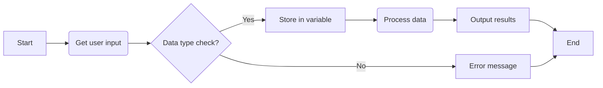
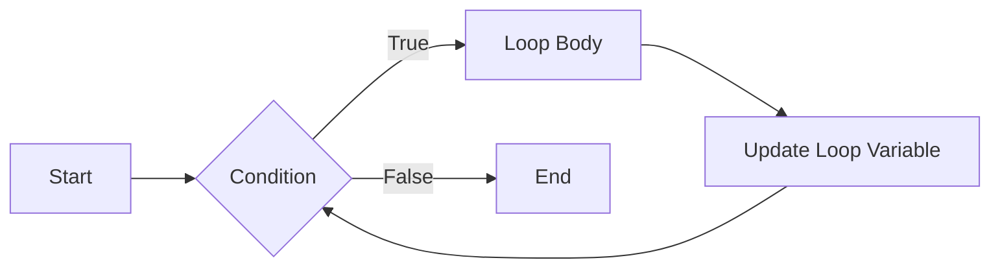
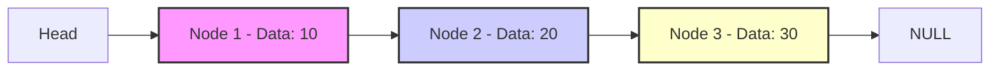

# <span style="color:#e67e22;">What we will learn in this post?</span>
<ul style='list-style-type: none; padding-left: 0;'>
<li><span style='color: #2980b9; font-size: 20px; font-weight: bold;'>👉</span> <span style='color: #2ecc71; font-size: 18px; font-weight: bold;'>Basic C Programs</span></li>
<li><span style='color: #2980b9; font-size: 20px; font-weight: bold;'>👉</span> <span style='color: #2ecc71; font-size: 18px; font-weight: bold;'>Control Flow Programs</span></li>
<li><span style='color: #2980b9; font-size: 20px; font-weight: bold;'>👉</span> <span style='color: #2ecc71; font-size: 18px; font-weight: bold;'>Pattern Printing Programs</span></li>
<li><span style='color: #2980b9; font-size: 20px; font-weight: bold;'>👉</span> <span style='color: #2ecc71; font-size: 18px; font-weight: bold;'>Functions Programs</span></li>
<li><span style='color: #2980b9; font-size: 20px; font-weight: bold;'>👉</span> <span style='color: #2ecc71; font-size: 18px; font-weight: bold;'>Arrays Programs</span></li>
<li><span style='color: #2980b9; font-size: 20px; font-weight: bold;'>👉</span> <span style='color: #2ecc71; font-size: 18px; font-weight: bold;'>Strings Programs</span></li>
<li><span style='color: #2980b9; font-size: 20px; font-weight: bold;'>👉</span> <span style='color: #2ecc71; font-size: 18px; font-weight: bold;'>Conversions Programs</span></li>
<li><span style='color: #2980b9; font-size: 20px; font-weight: bold;'>👉</span> <span style='color: #2ecc71; font-size: 18px; font-weight: bold;'>Pointers Programs</span></li>
<li><span style='color: #2980b9; font-size: 20px; font-weight: bold;'>👉</span> <span style='color: #2ecc71; font-size: 18px; font-weight: bold;'>Structures and Unions Programs</span></li>
<li><span style='color: #2980b9; font-size: 20px; font-weight: bold;'>👉</span> <span style='color: #2ecc71; font-size: 18px; font-weight: bold;'>File I/O Programs</span></li>
<li><span style='color: #2980b9; font-size: 20px; font-weight: bold;'>👉</span> <span style='color: #2ecc71; font-size: 18px; font-weight: bold;'>Date and Time Programs</span></li>
<li><span style='color: #2980b9; font-size: 20px; font-weight: bold;'>👉</span> <span style='color: #2ecc71; font-size: 18px; font-weight: bold;'>More C Programs</span></li>
<li><span style='color: #2980b9; font-size: 20px; font-weight: bold;'>👉</span> <span style='color: #2ecc71; font-size: 18px; font-weight: bold;'>Conclusion!</span></li>
</ul>

Okay, let's dive into some basic C programming with a friendly and visually appealing approach! We'll go through a few examples, explaining each one step-by-step. 🚀

# <span style="color:#e67e22">Hello, C World! 🌍</span>

Let's start with the classic "Hello, World!" program. This is the first program most people write when learning a new language, and it helps us understand the basic structure of a C program.

```c
#include <stdio.h>

int main() {
  printf("Hello, World!\n");
  return 0;
}
```

**Explanation:**

*   `#include <stdio.h>`: This line includes the standard input/output library. It gives us access to functions like `printf` which allows us to print to the screen. Think of it as a toolbox, and this line is telling the program we need that particular tool.
*   `int main() { ... }`: This is the main function where the program's execution begins. Every C program must have a `main` function. `int` means that the function will return an integer value and the curly braces `{}` hold the code that belongs to the function.
*   `printf("Hello, World!\n");`: This line uses the `printf` function to display the text "Hello, World!" on the screen. The `\n` is a special character that represents a newline, so it moves the cursor to the next line after printing the text.
*   `return 0;`:  This line signals that the program has finished successfully. A return value of `0` is conventionally used to indicate success.

**Expected Output:**

```
Hello, World!
```

---

## <span style="color:#2980b9">Input and Output ⌨️</span>

Let's learn how to take input from the user and print it back out.

```c
#include <stdio.h>

int main() {
    int age;
    printf("Please enter your age: ");
    scanf("%d", &age); // Read an integer and store it in the variable age
    printf("Your age is: %d\n", age);
    return 0;
}
```

**Explanation:**

*   `int age;`: This line declares a variable named `age` of type `int` (integer), which is used to store whole numbers. Variables act like containers in your program, storing data for later use.
*   `printf("Please enter your age: ");`: This prompts the user to enter their age.
*   `scanf("%d", &age);`: This line is really important for getting input from the keyboard!
    *   `scanf` is the function for reading input.
    *   `"%d"` means we expect the user to enter an integer.
    *   `&age` means we're giving `scanf` the memory location of the `age` variable so it knows where to store the number it reads.
*   `printf("Your age is: %d\n", age);`: This line prints the entered age to the console. `"%d"` acts as a placeholder for the integer value of the `age` variable.

**Expected Output (Example User Input: 25):**

```
Please enter your age: 25
Your age is: 25
```

---

## <span style="color:#2980b9">Data Types 📊</span>

Let's explore some basic data types in C. Data types tell the computer how much memory to allocate for the variable and what type of values it will hold.

### <span style="color:#8e44ad">Integer Data Type</span>
Integers are whole numbers (without a fractional component).

```c
#include <stdio.h>

int main() {
  int myInt = 10;
  printf("Integer value: %d\n", myInt);
  return 0;
}
```

**Explanation:**
* `int myInt = 10;`: This declares an integer variable named `myInt` and initializes it with the value `10`.

**Expected Output:**

```
Integer value: 10
```

### <span style="color:#8e44ad">Floating-Point Data Type</span>
Floating-point numbers represent real numbers (numbers with decimal points).

```c
#include <stdio.h>

int main() {
    float myFloat = 3.14;
    printf("Float value: %f\n", myFloat);
    return 0;
}
```

**Explanation:**
*   `float myFloat = 3.14;`: This declares a floating-point variable named `myFloat` and initializes it with the value `3.14`. `%f` is the placeholder for float data type

**Expected Output:**
```
Float value: 3.140000
```

### <span style="color:#8e44ad">Character Data Type</span>
Characters represent single letters, numbers, symbols, etc.

```c
#include <stdio.h>

int main() {
  char myChar = 'A';
  printf("Character value: %c\n", myChar);
  return 0;
}
```

**Explanation:**
*   `char myChar = 'A';`: This declares a character variable named `myChar` and initializes it with the character `'A'`. `%c` is the placeholder for a character

**Expected Output:**

```
Character value: A
```

### <span style="color:#8e44ad">Data Type Usage Example</span>
Here's an example demonstrating using multiple data types together:

```c
#include <stdio.h>

int main() {
  int age = 30;
  float height = 5.8;
  char initial = 'J';
  printf("Age: %d\n", age);
  printf("Height: %.2f\n", height); //prints only two digits after the decimal point
  printf("Initial: %c\n", initial);
  return 0;
}
```

**Explanation:**

*   This program demonstrates how we declare multiple types of variables and use different format specifiers in `printf` to display them correctly:
    *   `%d` for integer.
    *   `%.2f` for float, which is formatted to show 2 digits after the decimal point.
    *   `%c` for character.

**Expected Output:**

```
Age: 30
Height: 5.80
Initial: J
```
---
## <span style="color:#2980b9">Flow Control (Basic) 🚦</span>

Here's a simple example of how to use an `if` statement for conditional logic.

```c
#include <stdio.h>

int main() {
  int number;
  printf("Enter a number: ");
  scanf("%d", &number);

  if (number > 0) {
    printf("The number is positive\n");
  }
   else if (number == 0){
        printf("The number is zero\n");
  }
   else {
    printf("The number is negative\n");
  }
  return 0;
}
```
**Explanation:**
*   The program takes a number as input
*   The `if` statement checks if number is greater than `0`. If true it will print "The number is positive"
*   If the condition in `if` statement is false, the `else if` statement is executed. Here it check if the number is zero.
*   If both conditions are false the `else` block is executed.

**Expected Output (Example User Input: -5):**
```
Enter a number: -5
The number is negative
```
---

## <span style="color:#2980b9">Basic Math ➕➖✖️➗</span>

Here's a program performing basic arithmetic calculations:

```c
#include <stdio.h>

int main() {
  int num1, num2;
  printf("Enter two numbers: ");
  scanf("%d %d", &num1, &num2); // read two integers at once

  int sum = num1 + num2;
  int difference = num1 - num2;
  int product = num1 * num2;
  float quotient = (float)num1 / num2; // Cast to float for division with decimal result

  printf("Sum: %d\n", sum);
  printf("Difference: %d\n", difference);
  printf("Product: %d\n", product);
  printf("Quotient: %.2f\n", quotient);

  return 0;
}
```

**Explanation:**

* The program gets two numbers from the user.
* It then adds, subtracts, multiplies and divides them, storing the result of each operation in a variable.
*   Notice the `(float)num1` before dividing. This is called a *type cast*, and it's necessary to make sure that the division operation will produce a floating-point result (i.e., with decimals) instead of integer result if we do division. We cast num1 to float before division operation, so the C compiler will perform division on float types and not integer type.
*   `%.2f` in the printf statement will print the quotient with two decimal places.

**Expected Output (Example User Input: 10 3):**
```
Enter two numbers: 10 3
Sum: 13
Difference: 7
Product: 30
Quotient: 3.33
```

---
## <span style="color:#2980b9">Mermaid Diagram: Input and Output Flow</span>


**Explanation:**

This diagram shows the basic steps involved when we get input and provide output in our programs.

1.  **Start:**  The program begins.
2.  **Get user input:**  The program takes some input from the user (e.g., using `scanf`).
3.  **Data type check?**: A check on what kind of data is received.
4.  **Store in variable:**  The data is stored in a variable of appropriate type.
5.  **Error message**: If there are errors in user input (for example user input an alphabet instead of a number) an error message will be displayed and the program will end.
6.  **Process data:** The program may do some calculations or other operations with the data.
7.  **Output results:**  The program displays results to the user (e.g., using `printf`).
8.  **End:** The program finishes.

---

**Resources:**

*   [C Programming Tutorial](https://www.tutorialspoint.com/cprogramming/)
*   [Learn C Programming](https://www.programiz.com/c-programming)
*   [C Data Types](https://www.geeksforgeeks.org/data-types-in-c/)
*   [C Input and Output](https://www.geeksforgeeks.org/input-output-in-c/)

I hope this helps you start your C programming journey! Feel free to ask any other questions. Happy coding! 🎉


Okay, let's dive into the wonderful world of control flow in C! 🚀 We'll explore how `if`, `switch`, and loops help us create dynamic and intelligent programs. Let's get started!

# <span style="color:#e67e22">Controlling the Flow: If, Switch, and Loops in C</span> 🚦

We use control flow structures in programming to decide which parts of our code get executed and in what order. This allows our programs to react to different situations and perform different tasks based on the conditions they encounter. It's the key to making our programs do what we want!

## <span style="color:#2980b9">The Power of `if` Statements 💡</span>

`if` statements allow us to execute code *conditionally*. If a condition is true, we do one thing, otherwise, we might do something else.

### <span style="color:#8e44ad">Simple `if` example</span>
```c
#include <stdio.h>

int main() {
  int age = 20;

  if (age >= 18) {
    printf("You are an adult! 🎉\n");
  }

  return 0;
}
```

**Expected Output:**
```
You are an adult! 🎉
```

**Explanation:**

*   We declare an integer variable called `age` and give it the value `20`.
*   The `if (age >= 18)` statement checks if the value of `age` is greater than or equal to 18.
*   Since 20 is greater than or equal to 18, the condition is *true*, and the code within the curly braces `{}` is executed, printing the message to the console.

### <span style="color:#8e44ad">`if...else` example</span>
```c
#include <stdio.h>

int main() {
  int number = -5;

  if (number > 0) {
    printf("The number is positive. 😊\n");
  } else {
    printf("The number is not positive. 😔\n");
  }

  return 0;
}
```

**Expected Output:**
```
The number is not positive. 😔
```

**Explanation:**

*   We declare an integer variable `number` and give it the value `-5`.
*   The `if (number > 0)` checks if the number is greater than 0.
*   Since -5 is not greater than 0 (it's *false*), the code inside the `else` block is executed.

### <span style="color:#8e44ad">`if...else if...else` example</span>

```c
#include <stdio.h>

int main() {
  int score = 75;

  if (score >= 90) {
    printf("Grade: A 🥇\n");
  } else if (score >= 80) {
    printf("Grade: B 🥈\n");
  } else if (score >= 70) {
    printf("Grade: C 🥉\n");
  } else {
      printf("Grade: D 😔\n");
  }

  return 0;
}
```

**Expected Output:**
```
Grade: C 🥉
```

**Explanation:**

*  We check multiple conditions in order.
*  First `if (score >= 90)` is false since 75 is less than 90.
*  Then `else if (score >= 80)` is also false.
*  The next `else if (score >= 70)` is true, so the program prints "Grade: C 🥉" and skips rest of the checks.

**More on `if` statements:**
*   You can have many `else if` blocks to check multiple conditions.
*   The `else` block is optional and is executed only if none of the `if` or `else if` conditions are true.

**Further Reading:**

*   [Tutorialspoint - If...else statement in C](https://www.tutorialspoint.com/cprogramming/if_else_statement_in_c.htm)
*   [GeeksforGeeks - If, If-else, Nested-If](https://www.geeksforgeeks.org/c-if-else-statement-with-examples/)

## <span style="color:#2980b9">Using `switch` Statements 🔀</span>

The `switch` statement is handy when you need to compare a variable against multiple possible values, especially when dealing with multiple distinct options.

### <span style="color:#8e44ad">`switch` statement example</span>

```c
#include <stdio.h>

int main() {
  char grade = 'B';

  switch (grade) {
    case 'A':
      printf("Excellent! 💯\n");
      break;
    case 'B':
      printf("Good job! 👍\n");
      break;
    case 'C':
      printf("Keep trying! 💪\n");
      break;
    default:
      printf("Invalid grade. 🧐\n");
  }

  return 0;
}
```

**Expected Output:**
```
Good job! 👍
```

**Explanation:**

*   The `switch (grade)` statement evaluates the value of the `grade` variable which is 'B'.
*   The `case 'B':` matches the `grade` value, and therefore prints "Good job! 👍".
*   The `break;` statement is used to exit the `switch` statement, ensuring that only the matching case is executed.
*   The `default:` case is executed only if no other cases match the expression inside the switch statement.

**Key points about `switch` statements:**
*   The `switch` statement is very useful when dealing with enumerated types or when you are comparing against a set of named constants.
*   The `break;` is super important, as without it, execution will continue into the next case statement!
*   The `default` case is like a catch-all, similar to the `else` in `if-else` statements.
*   `switch` statements can only compare against a single value, it can not handle ranges like `if` can.

**Further Reading:**

*   [Tutorialspoint - Switch Statement in C](https://www.tutorialspoint.com/cprogramming/switch_statement_in_c.htm)
*   [GeeksforGeeks - Switch Statement in C](https://www.geeksforgeeks.org/switch-statement-in-c/)

## <span style="color:#2980b9">Looping with `for`, `while`, and `do...while` 🔄</span>

Loops are used to execute a block of code repeatedly. C offers several types of loops to fit different situations.

### <span style="color:#8e44ad">`for` Loop Example</span>

```c
#include <stdio.h>

int main() {
  for (int i = 1; i <= 5; i++) {
    printf("Counting: %d\n", i);
  }

  return 0;
}
```

**Expected Output:**
```
Counting: 1
Counting: 2
Counting: 3
Counting: 4
Counting: 5
```

**Explanation:**

*   The `for` loop has three parts inside its parentheses: initialization (`int i = 1`), condition (`i <= 5`), and increment (`i++`).
*   The loop starts with `i = 1`. It then checks if `i <= 5`. If it is, it executes the loop body and then increments `i`. This process repeats until the condition `i <= 5` is no longer true.

### <span style="color:#8e44ad">`while` Loop Example</span>

```c
#include <stdio.h>

int main() {
    int count = 0;

    while (count < 3) {
        printf("While count: %d\n", count);
        count++;
    }

  return 0;
}
```

**Expected Output:**

```
While count: 0
While count: 1
While count: 2
```

**Explanation:**
*   The `while` loop continues as long as the condition `count < 3` is true.
*   Inside the loop, the current value of `count` is printed and then `count` is incremented.

### <span style="color:#8e44ad">`do...while` Loop Example</span>

```c
#include <stdio.h>

int main() {
  int num = 10;

  do {
    printf("Do-while number: %d\n", num);
    num++;
  } while (num < 12);

  return 0;
}
```

**Expected Output:**

```
Do-while number: 10
Do-while number: 11
```

**Explanation:**

*   The `do...while` loop *always* executes the code inside its block *at least once*, regardless of the condition.
*   Then, it checks the condition `num < 12`. If the condition is true, the loop continues.
*   This loop is ideal when you want to perform an action at least once and then conditionally repeat it.

**Key difference between `while` and `do...while` loops:**
*   `while`: Checks condition *before* execution.
*   `do...while`: Checks condition *after* execution (guarantees at least one execution).

**Flowchart of a Loop:**



**Further Reading:**
*   [Tutorialspoint - Loop Control Statements in C](https://www.tutorialspoint.com/cprogramming/loop_control_statements_in_c.htm)
*   [GeeksforGeeks - Loops in C](https://www.geeksforgeeks.org/loops-in-c/)

## <span style="color:#2980b9">Conclusion 🏁</span>

Control flow is the backbone of any non-trivial program, allowing it to make decisions, repeat actions, and dynamically adapt to its environment. Mastering the `if`, `switch`, and loop statements will unlock powerful possibilities in your C programming journey. Keep practicing and experimenting, and you'll become a control flow master! 💪


# <span style="color:#e67e22">✨ Let's Print Some Patterns in C! ✨</span>

Hello there, coding friends! 👋 Today, we're diving into the fascinating world of pattern printing using C. We'll explore how to create various shapes and designs using nested loops. Get ready for some visual coding fun!

## <span style="color:#2980b9">Understanding the Basics</span>

Before we jump into specific patterns, let's quickly review the fundamental concepts we'll be using:

*   **Nested Loops:** We'll primarily use nested `for` loops. The outer loop controls the rows, and the inner loop controls the columns (or elements) within each row.
*   **`printf`:** The `printf` function will be our tool for displaying characters (like `*`, numbers, or spaces) to build our patterns.
*   **Logic:** We'll need to think carefully about how the loop variables and conditions relate to the pattern we want to print.

### <span style="color:#8e44ad">Let's Begin with a Simple Square</span>

Alright, let's kick things off with a classic square pattern. Here's the code and an explanation:

```c
#include <stdio.h>

int main() {
  int rows = 5; // Adjust this to change the square's size
  int cols = 5;

  for (int i = 0; i < rows; i++) {
    for (int j = 0; j < cols; j++) {
      printf("* "); // Print a star and a space
    }
    printf("\n"); // Move to the next line after each row
  }
  return 0;
}
```

**Output:**

```
* * * * * 
* * * * * 
* * * * * 
* * * * * 
* * * * * 
```

**Explanation:**

*   The outer loop (`for (int i = 0; i < rows; i++)`) iterates `rows` times, creating the rows of our square.
*   The inner loop (`for (int j = 0; j < cols; j++)`) iterates `cols` times for each row, printing a `* ` (star and a space) in that row.
*   After the inner loop finishes, `printf("\n")` is used to go to the next line, starting a new row.

<br>

## <span style="color:#2980b9">Right-Angled Triangle Patterns 📐</span>

Now, let's move on to some triangle patterns. We'll start with a right-angled triangle:

### <span style="color:#8e44ad">Right-Angled Triangle (Increasing)</span>

```c
#include <stdio.h>

int main() {
  int rows = 5;
  for (int i = 1; i <= rows; i++) {
    for (int j = 1; j <= i; j++) {
      printf("* ");
    }
    printf("\n");
  }
  return 0;
}
```

**Output:**

```
* 
* * 
* * * 
* * * * 
* * * * * 
```

**Explanation:**

*   The outer loop controls the rows.
*   The inner loop now runs from `j = 1` to `j <= i`. This means that in the first row `(i=1)`, one `*` will be printed; in the second row `(i=2)`, two `*`s will be printed, and so on, creating the increasing triangle shape.

<br>

### <span style="color:#8e44ad">Right-Angled Triangle (Decreasing)</span>

```c
#include <stdio.h>

int main() {
    int rows = 5;

    for (int i = rows; i >= 1; i--) {
        for (int j = 1; j <= i; j++) {
            printf("* ");
        }
        printf("\n");
    }
    return 0;
}
```

**Output:**

```
* * * * * 
* * * * 
* * * 
* * 
* 
```

**Explanation:**

*   The outer loop starts at the number of rows and decreases by 1 until it reaches 1.
*   The inner loop prints stars equal to the current row number `i` and hence, the number of `*` decreases in each subsequent row

<br>

## <span style="color:#2980b9">Pyramid Patterns ⛰️</span>

Next up, let's create a pyramid! This requires a bit more thinking about spaces and asterisks.

### <span style="color:#8e44ad">Pyramid Pattern</span>

```c
#include <stdio.h>

int main() {
    int rows = 5;

    for (int i = 1; i <= rows; i++) {
        // Print leading spaces
        for (int space = 1; space <= rows - i; space++) {
            printf("  ");
        }
        // Print stars
        for (int j = 1; j <= 2 * i - 1; j++) {
            printf("* ");
        }
        printf("\n");
    }
    return 0;
}
```

**Output:**

```
        * 
      * * * 
    * * * * * 
  * * * * * * * 
* * * * * * * * * 
```

**Explanation:**

*   We have three nested loops here:
    *   The first nested loop prints the spaces before the stars in each row. Number of spaces decreases with the increase in row number.
    *   The second nested loop prints the stars. The number of stars printed is `2 * i - 1`, where `i` is the row number. The number of `*` increases with the row number.

<br>

## <span style="color:#2980b9">Number Patterns 🔢</span>

Let's not limit ourselves to just stars; we can use numbers too!

### <span style="color:#8e44ad">Number Triangle Pattern</span>

```c
#include <stdio.h>

int main() {
    int rows = 5;

    for (int i = 1; i <= rows; i++) {
        for (int j = 1; j <= i; j++) {
           printf("%d ", j); // Print numbers instead of stars
        }
        printf("\n");
    }
    return 0;
}
```

**Output:**

```
1 
1 2 
1 2 3 
1 2 3 4 
1 2 3 4 5 
```

**Explanation:**

*   This pattern is similar to the increasing right-angled triangle. However, instead of printing `*`, we are printing the current column value `j` in each row.

<br>

### <span style="color:#8e44ad">Numbered Pyramid Pattern</span>

```c
#include <stdio.h>

int main() {
    int rows = 5;

    for (int i = 1; i <= rows; i++) {
      // Print spaces
      for(int space = 1; space <= rows - i; space++){
        printf("  ");
      }
      // Print numbers
        for(int j = 1; j <= i; j++) {
          printf("%d ", j);
        }
        for(int k = i - 1; k >= 1; k--){
          printf("%d ", k);
        }
        printf("\n");
    }
    return 0;
}
```

**Output:**
```
        1 
      1 2 1 
    1 2 3 2 1 
  1 2 3 4 3 2 1 
1 2 3 4 5 4 3 2 1 
```

**Explanation:**

*   This program first prints the spaces.
*   Then in the second nested `for` loop, the program prints the numbers from 1 up to the current row number.
*   After that, in the third loop, the program prints the numbers in decreasing order from one less than the current row number to 1.
*   The pattern is achieved by printing the spaces, increasing numbers and decreasing numbers in each row.

<br>

## <span style="color:#2980b9">Additional Resources 📚</span>

If you want to dive deeper into these concepts, here are some helpful links:

*   **C Programming Tutorial on Loops:** [GeeksforGeeks Loops in C](https://www.geeksforgeeks.org/loops-in-c/)
*   **More Pattern Examples:** [Programiz Pattern Printing](https://www.programiz.com/c-programming/examples/print-pyramid-patterns)
*  **Mermaid Documentation:** [Mermaid JS Documentation](https://mermaid-js.github.io/mermaid/#/)

<br>

## <span style="color:#2980b9">Flowchart for a Generic Pattern</span>

Here's a simple Mermaid flowchart illustrating the general logic for a pattern printing program:

```mermaid
graph LR
    A[Start] --> B{Initialize variables (rows, cols)};
    B --> C{Outer loop (row control)};
    C --> D{Inner loop (column/element control)};
    D --> E{Print element (star, number, etc.)};
    E --> F{Check inner loop condition};
    F -- Yes --> D;
    F -- No --> G{Move to next line};
    G --> H{Check outer loop condition};
     H -- Yes --> C;
    H -- No --> I[End];
```

**Explanation:**

* The flowchart explains how a program iterates through nested loops, printing the characters and moving to a new line after each row to create the pattern.

<br>

That's it for today's pattern printing journey in C! I hope you had fun and learned something new. Remember, practice makes perfect, so keep experimenting with different loop conditions and characters. Happy coding! 🎉


Okay, let's dive into the wonderful world of functions in C! 🎉 We'll explore how to create, use, and love functions with lots of examples and friendly explanations.

# <span style="color:#e67e22">C Functions: Your Coding Helpers! 🛠️</span>

Functions are the building blocks of well-structured C programs. Think of them as mini-programs within your main program. They help you break down complex tasks into smaller, manageable, and reusable pieces of code. This makes your code easier to read, understand, and debug.

## <span style="color:#2980b9">Why Use Functions? 🤔</span>

Before we jump into the code, let’s quickly touch on why functions are so crucial:

*   **Organization:** Functions help to keep your code neat and organized.
*   **Reusability:** You can write a function once and use it multiple times in your program, and even in other programs!
*   **Readability:**  Well-named functions make your code easier to read and understand.
*   **Modularity:** Functions allow you to break down complex problems into smaller, manageable parts.
*   **Debugging:** It is easier to test and debug when you have small pieces of code.

## <span style="color:#2980b9">Anatomy of a Function 🦴</span>

A function in C has a few key components:

*   **Return Type:** The data type of the value the function returns (e.g., `int`, `float`, `void`). If a function doesn't return a value, you use `void`.
*   **Function Name:**  A unique name that identifies the function (e.g., `addNumbers`, `calculateArea`).
*   **Parameters:**  Inputs the function takes, specified with their data types and names, enclosed in parentheses `()`. These are optional, and a function can have zero or more parameters (e.g., `int a, int b`).
*   **Function Body:**  The block of code that performs the function's task, enclosed in curly braces `{}`.

Here's a general structure:

```c
return_type function_name(parameter1_type parameter1_name, parameter2_type parameter2_name, ...) {
    // function body (code)
    return value; // if the return type is not void
}
```

## <span style="color:#2980b9">Defining and Calling Functions 📞</span>

Let's see how to define and use functions with examples:

### <span style="color:#8e44ad">Example 1: A Simple Addition Function ➕</span>

```c
#include <stdio.h>

// Function definition: adds two integers and returns the sum
int addNumbers(int num1, int num2) {
    int sum = num1 + num2;
    return sum;
}


int main() {
    int a = 10;
    int b = 20;
    int result;

    // Function call: invoking addNumbers and storing the result
    result = addNumbers(a, b);

    printf("The sum of %d and %d is: %d\n", a, b, result); // Output: The sum of 10 and 20 is: 30

    return 0;
}
```

**Explanation:**

*   The function `addNumbers` is defined to take two integers (`num1` and `num2`) as input and returns their sum as an integer.
*   In `main`, we declare variables `a` and `b`, then call `addNumbers` to calculate their sum.
*   The value returned by `addNumbers` is stored in the variable `result`.
*   Finally, we print the `result`.

**Output:**

```
The sum of 10 and 20 is: 30
```

### <span style="color:#8e44ad">Example 2:  A Function with No Return Value (void) 🗣️</span>

```c
#include <stdio.h>

// Function definition: prints a greeting message
void greet(char name[]) {
    printf("Hello, %s! Welcome!\n", name);
}


int main() {
    char myName[] = "Alice";

    // Function call: no return value to store
    greet(myName); // Output: Hello, Alice! Welcome!

    return 0;
}
```

**Explanation:**

*   The `greet` function has a `void` return type. This means it does not return any value; it simply performs an action (prints a message).
*   It takes a character array (`char name[]`) as an input.
*   In `main`, we call `greet` with the string `myName`.

**Output:**

```
Hello, Alice! Welcome!
```

### <span style="color:#8e44ad">Example 3: Function to Find the Maximum of Two Numbers 📈</span>

```c
#include <stdio.h>

// Function definition: returns the maximum of two integers
int findMax(int num1, int num2) {
    if (num1 > num2) {
        return num1;
    } else {
        return num2;
    }
}


int main() {
    int num1 = 45;
    int num2 = 22;
    int max;

    // Function call
    max = findMax(num1, num2);

    printf("The maximum of %d and %d is: %d\n", num1, num2, max);  // Output: The maximum of 45 and 22 is: 45

    return 0;
}
```

**Explanation:**

*   The `findMax` function compares two integers and returns the larger one.
*   It uses an `if-else` statement to determine the maximum.

**Output:**

```
The maximum of 45 and 22 is: 45
```

### <span style="color:#8e44ad">Example 4: A Function Using local variable 🏘️</span>

```c
#include <stdio.h>

// Function definition: local variable to calculate factorial
int calculateFactorial(int number) {
    int factorial = 1;
    for (int i = 1; i <= number; i++){
      factorial *= i;
    }
    return factorial;

}


int main() {
    int num = 5;
    int fact;

    // Function call
    fact = calculateFactorial(num);

    printf("The factorial of %d is: %d\n", num, fact);  // Output: The factorial of 5 is: 120

    return 0;
}
```

**Explanation:**

* The function `calculateFactorial` has a local variable `factorial` whose scope is limited to the function.
* The `factorial` is calculated for an input number and returned.

**Output:**

```
The factorial of 5 is: 120
```

### <span style="color:#8e44ad">Example 5: Function with Multiple return statements ↔️</span>

```c
#include <stdio.h>
#include <stdbool.h>

// Function definition: Check if a number is positive or negative or zero
bool isPositive(int number) {
    if (number > 0) {
        return true;
    } else if (number < 0) {
      return false;
    } else {
       return false;
    }
}


int main() {
    int num = 5;
    bool isPos;

    // Function call
    isPos = isPositive(num);
    if(isPos) {
       printf("The number %d is positive\n", num); // Output: The number 5 is positive
    }
    else {
      printf("The number %d is not positive\n", num);
    }

    return 0;
}
```

**Explanation:**

* The function `isPositive` has multiple return statements.
* If the given number is positive it will return true, else it will return false.

**Output:**

```
The number 5 is positive
```

## <span style="color:#2980b9">Flowchart of a Function call ⚙️</span>

Here's a simple flowchart to illustrate the flow of execution when a function is called:

```mermaid
flowchart TD
    A[Start Main] --> B{Call Function}
    B --> C[Execute Function Code]
    C --> D{Return Value (if any)}
    D --> E[Continue in Main]
    E --> F[End Main]
```

**Explanation:**

1.  The main program starts.
2.  A function call is encountered.
3.  The execution jumps to the function code.
4.  The function's code is executed.
5.  The function returns a value (or completes execution).
6.  The execution returns to the point where the function was called.
7.  The main program continues execution.

## <span style="color:#2980b9">Key Takeaways 💡</span>

*   Functions are reusable blocks of code that make your programs organized.
*   They have a return type, a name, parameters (optional), and a body of code.
*   Functions are defined and then called from other parts of the program.
*   The return type is specified with the data type, and `void` if a function doesn't return a value.
*   Functions with `void` return type perform some action and do not return a value.
*   Local variables are defined and their scope is limited to the function
*   Functions can have multiple return statements.

## <span style="color:#2980b9">Further Exploration 🚀</span>

*   **Function Prototypes:** You can learn about function declarations (prototypes) if your function call is before the function definition. [Function Prototypes in C](https://www.geeksforgeeks.org/function-prototype-in-c/)
*   **Scope of Variables:**  Explore the difference between local and global variables. [Scope of Variables in C](https://www.geeksforgeeks.org/scope-of-variables-in-c/)
*   **Recursion:** Functions can call themselves, which is called recursion. [Recursive Function in C](https://www.geeksforgeeks.org/recursion-in-c/)

I hope this explanation made functions in C a bit clearer and more approachable! Happy coding! 😊


Error: An error occurred while processing your request. Please try again later.

Okay, let's dive into the world of string manipulation in C! It might sound a bit technical, but we'll make it easy and fun.  Think of strings like sentences—they're just a bunch of characters put together. C lets us do all sorts of cool things with them, like changing them, comparing them, and more! 📝

# <span style="color:#e67e22">String Manipulation in C: A Friendly Guide 🔤</span>

Strings in C are essentially arrays of characters, and C provides many built-in functions to handle them.  Let's explore some of these!

## <span style="color:#2980b9">What Are Strings in C? 🤔</span>

In C, a string is represented as an array of characters, terminated by a null character (`\0`). The null character acts like a "stop" sign, telling the computer where the string ends.

*   **Key Concept:** The null terminator is *crucial*. Without it, C would keep reading memory until it found a null character by chance (leading to bugs!).

*   **How to declare a string:**

    ```c
    char myString[] = "Hello"; // C automatically adds the null terminator
    char anotherString[6] = {'H', 'e', 'l', 'l', 'o', '\0'}; // Explicitly adding the null terminator
    ```

    *Note: In C, you can't directly modify string literals, so using char arrays is preferred for manipulation.*

## <span style="color:#2980b9">Common String Functions 🛠️</span>

C provides a header file, `string.h`, packed with functions to work with strings. Let's explore some of them:

### <span style="color:#8e44ad">`strlen()` - Finding the Length 📏</span>

The `strlen()` function calculates the length of a string (excluding the null terminator).

```c
#include <stdio.h>
#include <string.h>

int main() {
    char str[] = "Programming";
    int length = strlen(str);
    printf("The length of the string is: %d\n", length);
    return 0;
}
```

**Output:**

```
The length of the string is: 11
```

*   **Explanation:** `strlen("Programming")` correctly calculates the length of the word "Programming" as 11 characters.

### <span style="color:#8e44ad">`strcpy()` - Copying Strings 📝</span>

The `strcpy()` function copies one string to another.

```c
#include <stdio.h>
#include <string.h>

int main() {
    char source[] = "Hello";
    char destination[10]; // Make sure the destination is large enough
    strcpy(destination, source);
    printf("The copied string is: %s\n", destination);
    return 0;
}
```

**Output:**

```
The copied string is: Hello
```

*   **Important Note:** Be *very careful* when using `strcpy()`. If the destination isn't large enough, it can cause a buffer overflow, a serious security risk.

### <span style="color:#8e44ad">`strcat()` - Joining Strings 🔗</span>

The `strcat()` function concatenates (joins) two strings.

```c
#include <stdio.h>
#include <string.h>

int main() {
    char str1[20] = "Hello, ";
    char str2[] = "World!";
    strcat(str1, str2);
    printf("The concatenated string is: %s\n", str1);
    return 0;
}
```

**Output:**

```
The concatenated string is: Hello, World!
```

*   **Caution:** Similar to `strcpy()`, be sure that the destination string has enough space to accommodate the concatenated string. `strcat` can lead to buffer overflow

### <span style="color:#8e44ad">`strcmp()` - Comparing Strings 🧐</span>

The `strcmp()` function compares two strings lexicographically (dictionary order). It returns:

    *   0 if the strings are equal.
    *   A negative value if the first string comes before the second string.
    *   A positive value if the first string comes after the second string.

```c
#include <stdio.h>
#include <string.h>

int main() {
    char strA[] = "apple";
    char strB[] = "banana";
    char strC[] = "apple";

    printf("strcmp(strA, strB): %d\n", strcmp(strA, strB)); // strA < strB
    printf("strcmp(strA, strC): %d\n", strcmp(strA, strC)); // strA == strC
    printf("strcmp(strB, strA): %d\n", strcmp(strB, strA)); // strB > strA
    return 0;
}
```

**Output:**

```
strcmp(strA, strB): -1
strcmp(strA, strC): 0
strcmp(strB, strA): 1
```

*   **Understanding:** Since 'a' comes before 'b' in the alphabet `strcmp("apple", "banana")` returns a negative number, `strcmp("apple","apple")` returns 0 because both strings are the same and `strcmp("banana","apple")` returns a positive number as 'b' comes after 'a'.

## <span style="color:#2980b9">More Advanced Techniques 🚀</span>

###  <span style="color:#8e44ad">String Input and Output ⌨️</span>

*   **`scanf` for simple string input**: You can use `scanf` to read a string, but be cautious as it stops reading when it encounters a space.

```c
#include <stdio.h>
int main() {
    char name[20];
    printf("Enter your name: ");
    scanf("%s", name); // Note: No & for arrays
    printf("Hello, %s!\n", name);
    return 0;
}
```

**Output (User enters "John Doe"):**

```
Enter your name: John Doe
Hello, John!
```

**Explanation:** The output of the code, when user provides an input as 'John Doe' using `scanf("%s", name)`, will only read characters until it encounters a space ' '. Thus, the output printed is 'Hello, John!'.

*   **`fgets` for safer string input**: `fgets` reads an entire line (including spaces) and is generally safer than `scanf` for reading strings, also including new line character in input if enough space is available.

```c
#include <stdio.h>
int main() {
    char line[50];
    printf("Enter a line: ");
    fgets(line, sizeof(line), stdin);
    printf("You entered: %s", line);
    return 0;
}
```

**Output (User enters "This is a line"):**

```
Enter a line: This is a line
You entered: This is a line
```

**Explanation:** The output of the code will print the input provided by the user 'This is a line'. `fgets` includes new line character in output if buffer size is greater than input string, unless input string size is equal to buffer - 1 in that case it will not include new line character.

*   **`printf` for outputting strings**: You already saw `printf` in action in the previous examples. The format specifier `%s` is used to print strings.

### <span style="color:#8e44ad">Example: Reversing a String 🔄</span>

Here's a program to reverse a string:

```c
#include <stdio.h>
#include <string.h>

void reverseString(char str[]) {
    int length = strlen(str);
    for (int i = 0; i < length / 2; i++) {
        char temp = str[i];
        str[i] = str[length - 1 - i];
        str[length - 1 - i] = temp;
    }
}

int main() {
    char myString[] = "C is Fun";
    printf("Original string: %s\n", myString);
    reverseString(myString);
    printf("Reversed string: %s\n", myString);
    return 0;
}
```

**Output:**

```
Original string: C is Fun
Reversed string: nuF si C
```

*   **How it works:** We loop through half the string and swap characters from the start with corresponding characters from the end.

##  <span style="color:#2980b9">Diagrams and Resources 🗺️</span>

Here’s a basic flowchart showing how string manipulation functions work generally:

```mermaid
graph LR
    A[Start] --> B(Input String);
    B --> C{Function};
    C -->|strlen()| D[Calculate Length];
    C -->|strcpy()| E[Copy String];
     C -->|strcat()| F[Concatenate String];
     C -->|strcmp()| G[Compare String];
    D --> H[Result];
    E --> H;
    F --> H;
    G --> H;
    H --> I[Output];
    I --> J[End];
```

**Resources for more information:**

*   **Tutorialspoint:** [C - Strings](https://www.tutorialspoint.com/cprogramming/c_strings.htm)
*   **GeeksforGeeks:** [Strings in C](https://www.geeksforgeeks.org/strings-in-c/)
*   **W3Schools:** [C Strings](https://www.w3schools.com/c/c_strings.php)

## <span style="color:#2980b9">Conclusion 🎉</span>

String manipulation is a cornerstone of C programming.  Understanding how to use functions like `strlen()`, `strcpy()`, `strcat()`, `strcmp()`, and proper input/output with `fgets` or `scanf` are essential.  Remember to be cautious about buffer overflows and always double-check the size of your buffers. Happy coding!  🚀


# <span style="color:#e67e22">🚀 C Conversion Programs: A Friendly Guide</span>

Hey there, code explorers! 👋 This guide will walk you through some nifty C programs that perform common conversions, like switching between number bases and units. We'll keep it simple and fun, so no worries if you're just starting out! Let's dive in!

## <span style="color:#2980b9">Number Base Conversions 🔢</span>

### <span style="color:#8e44ad">Decimal to Binary</span>

*   **What it does:**  Converts a decimal (base-10) number to its binary (base-2) representation.
*   **How it works:** We repeatedly divide the decimal number by 2 and keep track of the remainders. The remainders, read in reverse order, give us the binary equivalent.

```c
#include <stdio.h>

void decimalToBinary(int n) {
    int binary[32]; // Assuming 32-bit integer
    int i = 0;
    if (n == 0) {
        printf("Binary: 0\n");
        return;
    }

    while (n > 0) {
        binary[i] = n % 2;
        n = n / 2;
        i++;
    }

    printf("Binary: ");
    for (int j = i - 1; j >= 0; j--) {
        printf("%d", binary[j]);
    }
    printf("\n");
}

int main() {
    int decimalNum = 25;
    printf("Decimal: %d\n", decimalNum);
    decimalToBinary(decimalNum);

    decimalNum = 0;
    printf("Decimal: %d\n", decimalNum);
    decimalToBinary(decimalNum);
        
    decimalNum = 123;
    printf("Decimal: %d\n", decimalNum);
    decimalToBinary(decimalNum);
    return 0;
}
```
*   **Expected Output:**
    ```
    Decimal: 25
    Binary: 11001
    Decimal: 0
    Binary: 0
    Decimal: 123
    Binary: 1111011
    ```
*   **Explanation:**
    *   The `decimalToBinary` function takes a decimal number `n`.
    *   An array `binary` stores the remainders (0 or 1) of the divisions by 2.
    *   The remainders are printed in reverse order.
    *   The `main` function tests the converter with `25`, `0` and `123`.
*   **Resource:** [Decimal to Binary Conversion](https://www.geeksforgeeks.org/program-decimal-binary-conversion/)

<br>

### <span style="color:#8e44ad">Binary to Decimal</span>

*   **What it does:** Converts a binary (base-2) number to its decimal (base-10) representation.
*   **How it works:** We go through the binary digits from right to left, multiplying each by the corresponding power of 2 and sum them up.

```c
#include <stdio.h>
#include <math.h>
#include <string.h>

int binaryToDecimal(const char *binary) {
    int decimal = 0;
    int len = strlen(binary);
    int power = 0;

    for (int i = len - 1; i >= 0; i--) {
        if (binary[i] == '1') {
            decimal += pow(2, power);
        }
        power++;
    }

    return decimal;
}

int main() {
    char binaryNum[] = "11001";
    printf("Binary: %s\n", binaryNum);
    printf("Decimal: %d\n", binaryToDecimal(binaryNum));
    
    char binaryNum2[] = "1000";
    printf("Binary: %s\n", binaryNum2);
     printf("Decimal: %d\n", binaryToDecimal(binaryNum2));

     char binaryNum3[] = "0";
    printf("Binary: %s\n", binaryNum3);
     printf("Decimal: %d\n", binaryToDecimal(binaryNum3));


    return 0;
}
```

*   **Expected Output:**

    ```
    Binary: 11001
    Decimal: 25
    Binary: 1000
    Decimal: 8
    Binary: 0
    Decimal: 0
    ```

*   **Explanation:**
    *   The `binaryToDecimal` function takes the binary number as a string (`const char *binary`).
    *   It iterates through the binary string, using `strlen` to find the length.
    *   If a digit is '1', it adds 2 raised to the power of its position to the `decimal` variable.
    *   The `main` function tests the converter with `"11001"`, `"1000"` and `"0"`
*   **Resource:** [Binary to Decimal Conversion](https://www.geeksforgeeks.org/binary-decimal-conversion/)

<br>

## <span style="color:#2980b9">Unit Conversions 📏</span>

### <span style="color:#8e44ad">Celsius to Fahrenheit</span>

*   **What it does:** Converts temperature from Celsius to Fahrenheit.
*   **How it works:**  Applies the formula: Fahrenheit = (Celsius * 9/5) + 32.

```c
#include <stdio.h>

float celsiusToFahrenheit(float celsius) {
    return (celsius * 9 / 5) + 32;
}

int main() {
    float celsiusTemp = 25.0;
    printf("Celsius: %.2f\n", celsiusTemp);
    printf("Fahrenheit: %.2f\n", celsiusToFahrenheit(celsiusTemp));
    
    celsiusTemp = 0.0;
    printf("Celsius: %.2f\n", celsiusTemp);
    printf("Fahrenheit: %.2f\n", celsiusToFahrenheit(celsiusTemp));

    celsiusTemp = 100.0;
    printf("Celsius: %.2f\n", celsiusTemp);
    printf("Fahrenheit: %.2f\n", celsiusToFahrenheit(celsiusTemp));

    return 0;
}
```

*   **Expected Output:**
    ```
    Celsius: 25.00
    Fahrenheit: 77.00
    Celsius: 0.00
    Fahrenheit: 32.00
    Celsius: 100.00
    Fahrenheit: 212.00
    ```
*   **Explanation:**
    *   The `celsiusToFahrenheit` function directly implements the conversion formula.
    *   The `main` function shows how to use the function.
*   **Resource:** [Celsius to Fahrenheit Conversion](https://www.rapidtables.com/convert/temperature/celsius-to-fahrenheit.html)
    
<br>

### <span style="color:#8e44ad">Kilograms to Pounds</span>

*   **What it does:** Converts weight from kilograms to pounds.
*   **How it works:** Applies the conversion factor: 1 kg = 2.20462 lbs (approximately).

```c
#include <stdio.h>

float kilogramsToPounds(float kilograms) {
    return kilograms * 2.20462;
}

int main() {
    float kgWeight = 10.0;
    printf("Kilograms: %.2f\n", kgWeight);
    printf("Pounds: %.2f\n", kilogramsToPounds(kgWeight));

    kgWeight = 0.0;
    printf("Kilograms: %.2f\n", kgWeight);
    printf("Pounds: %.2f\n", kilogramsToPounds(kgWeight));

    kgWeight = 100.0;
    printf("Kilograms: %.2f\n", kgWeight);
    printf("Pounds: %.2f\n", kilogramsToPounds(kgWeight));
    
    return 0;
}
```

*   **Expected Output:**
    ```
    Kilograms: 10.00
    Pounds: 22.05
    Kilograms: 0.00
    Pounds: 0.00
    Kilograms: 100.00
    Pounds: 220.46
    ```
*   **Explanation:**
    *   The `kilogramsToPounds` function multiplies kilograms by the conversion factor.
    *   The `main` function tests the converter with 10, 0 and 100 kg inputs.
*   **Resource:** [Kilograms to Pounds Conversion](https://www.metric-conversions.org/weight/kilograms-to-pounds.htm)

<br>

## <span style="color:#2980b9">General Notes 📝</span>

*   **Data Types:** We use `int` for integers, `char *` for strings and `float` for floating-point numbers. Make sure the data types match your needs.
*   **Input:**  These examples directly use variables for input. For real applications you might need `scanf` or other input methods to take input from the user
*   **Output:** `printf` is used to print the result.
*   **Error Handling:** These are very basic example, no error handling is included.
*   **Flexibility:** You can adapt these examples for other units or base conversions following similar principles.

<br>

That's it! These are just some examples to get you going. Feel free to try them out, experiment and have fun coding in C! Happy coding! 🎉


# <span style="color:#e67e22">Pointers in C: A Friendly Guide 🧭</span>

Hey there! Let's dive into the world of *pointers* in C, a powerful tool that might seem a bit tricky at first, but we'll break it down together in an easy-to-understand way. Think of pointers as special variables that hold the *memory addresses* of other variables. It's like having a treasure map 🗺️ that leads you to the actual treasure!

## <span style="color:#2980b9">What are Pointers? 📍</span>

Essentially, a pointer is a variable that stores a memory address. In C, every variable resides at a specific location in the computer's memory. A pointer "points" to that location.

*   **Why use pointers?**
    *   **Direct memory access:** Pointers allow you to directly manipulate the data stored in memory, which can be very efficient.
    *   **Dynamic memory allocation:** You can allocate memory during runtime, which is crucial for creating flexible data structures.
    *   **Passing arguments by reference:** Pointers enable functions to modify variables in the calling scope.
    *   **Building data structures:** Linked lists, trees, and other advanced data structures heavily rely on pointers.

## <span style="color:#2980b9">Pointer Basics: The Code 💻</span>

Let's look at some basic code to grasp the concept.

```c
#include <stdio.h>

int main() {
    int num = 10;
    int *ptr; // Declaring a pointer to an integer
    ptr = &num; // ptr now holds the address of num
    
    printf("Value of num: %d\n", num); // Output: 10
    printf("Address of num: %p\n", &num); // Output: A memory address
    printf("Value of ptr: %p\n", ptr); // Output: Same memory address as above
    printf("Value at the address ptr is pointing to: %d\n", *ptr); // Output: 10
    
    return 0;
}
```

*   **Explanation:**
    *   `int *ptr;`: We declare a pointer variable `ptr` that can store the address of an integer.
    *   `ptr = &num;`: The `&` operator retrieves the memory address of the `num` variable. We assign this address to the `ptr` variable.
    *   `*ptr`: The `*` operator is called the *dereference operator*. It fetches the value at the memory address held by `ptr`. So, `*ptr` is equivalent to `num`.

## <span style="color:#2980b9">Pointer Arithmetic: Moving Through Memory 🧮</span>

Pointers can be manipulated using arithmetic operations. However, it's different from regular integer arithmetic, and it depends on the data type the pointer is pointing to. Let's explore this with an example:

```c
#include <stdio.h>

int main() {
    int arr[5] = {10, 20, 30, 40, 50};
    int *ptr = arr; // ptr points to the first element of arr

    printf("Value at ptr: %d\n", *ptr); // Output: 10
    ptr++; // Move pointer to the next integer element

    printf("Value at ptr after increment: %d\n", *ptr); // Output: 20
    
    ptr = arr + 3; // point to the 4th element
    printf("Value at ptr now: %d\n",*ptr); //output: 40
    return 0;
}
```

*   **Explanation:**
    *   `int *ptr = arr;`: `arr` by itself gives us the address of the first element in the array.
    *   `ptr++`: Moves `ptr` to the next integer in the memory, not by just adding `1` to the address value. It increments by the size of the integer, which is usually 4 bytes on most systems. If it was char then it would just increment by 1 byte.
     *   `ptr = arr + 3;`: It directly sets the pointer to the 4th element by adding `3 * size_of(int)` to the starting address of the array.

### <span style="color:#8e44ad">Visualizing Pointer Arithmetic</span>

```mermaid
graph LR
    A[arr[0] - Address 1000] --> B(10)
    B --> C[arr[1] - Address 1004]
    C --> D(20)
    D --> E[arr[2] - Address 1008]
    E --> F(30)
     F --> G[arr[3] - Address 1012]
     G --> H(40)
     H --> I[arr[4] - Address 1016]
     I --> J(50)

    K[ptr - initially Address 1000] --> A
    L[After ptr++] --> C
    M[ptr = arr + 3] --> G
    
    style A fill:#f9f,stroke:#333,stroke-width:2px
    style C fill:#ccf,stroke:#333,stroke-width:2px
    style G fill:#ffc,stroke:#333,stroke-width:2px
    
```

## <span style="color:#2980b9">Pointer-Based Data Structures: Building Blocks 🧱</span>

Pointers are essential for creating dynamic data structures, allowing you to add or remove elements efficiently at runtime.

### <span style="color:#8e44ad">Linked List Example</span>

Let's create a simple linked list, where each node contains data and a pointer to the next node.

```c
#include <stdio.h>
#include <stdlib.h>

// Structure for a node in the linked list
struct Node {
    int data;
    struct Node *next;
};

// Function to create a new node
struct Node* createNode(int data) {
    struct Node *newNode = (struct Node*)malloc(sizeof(struct Node)); //allocate memory
    if(newNode == NULL){ //if memory allocation failed
        printf("Memory allocation failed.");
        return NULL;
    }
    newNode->data = data;
    newNode->next = NULL;
    return newNode;
}
//Function to add node to front of the linked list
void addNodeFront(struct Node** head, int data) {
    struct Node* newNode = createNode(data);
    if (newNode != NULL) {
        newNode->next = *head;
        *head = newNode;
    }
}


//Function to print the list
void printList(struct Node* head) {
    struct Node* current = head;
    while (current != NULL) {
        printf("%d -> ", current->data);
        current = current->next;
    }
    printf("NULL\n");
}

int main() {
    struct Node* head = NULL; // Initialize the list
    
    addNodeFront(&head, 30); // Add nodes to the front
    addNodeFront(&head, 20);
    addNodeFront(&head, 10);
    
    printf("Linked List: ");
    printList(head);  // Output: 10 -> 20 -> 30 -> NULL
    
    return 0;
}
```
*   **Explanation:**

    *   `struct Node`: Defines a node structure, consisting of an `int data` and a pointer to the next `Node` (`struct Node *next`).
    *   `createNode(int data)`: Allocates memory for a new node, assigns `data` to it and sets the `next` pointer to `NULL`. This function also checks if the memory allocation was successful. If not it returns a NULL pointer.
    *   `addNodeFront(struct Node** head, int data)`: Adds a new node to the beginning of the list. The `head` parameter is a double pointer because we will modify it when adding a new node.
    *   `printList(struct Node* head)`: Traverses and prints the linked list. It stops printing when it reaches `NULL`.

#### <span style="color:#8e44ad">Visualizing Linked List</span>



## <span style="color:#2980b9">Important Notes and Common Pitfalls ⚠️</span>

*   **Null Pointers:** Always initialize pointers to `NULL` if they don't immediately point to valid memory.
*   **Memory Leaks:** If using `malloc` or `calloc`, remember to free memory using `free` when it's no longer needed to avoid memory leaks.
*   **Dangling Pointers:** Avoid using a pointer that points to deallocated memory.
*   **Segmentation Faults:** If you try to access a memory location outside of the allowed range, it can lead to a segmentation fault. This is typically caused by trying to read or write in an invalid memory location.
*   **Type Compatibility:** Ensure that the pointer type matches the data type it's pointing to. For example, you cannot directly assign an `int*` to a `char*`.
*   **Read the documentation carefully** and always check the memory allocation process, as it can easily fail and lead to undefined behavior.

## <span style="color:#2980b9">Resources 📚</span>

For more information, check out these resources:

*   [GeeksforGeeks - Pointers in C](https://www.geeksforgeeks.org/pointers-in-c-2/)
*   [Tutorialspoint - C Pointers](https://www.tutorialspoint.com/cprogramming/c_pointers.htm)
*   [Learn-C.org - Pointers](https://www.learn-c.org/en/Pointers)
*  [C Programming - Pointers](https://www.programiz.com/c-programming/pointers)

## <span style="color:#2980b9">Conclusion 🏁</span>

Pointers are fundamental in C programming, providing the flexibility to manipulate memory directly and create advanced data structures. Although they can be tricky to master, understanding pointers will drastically enhance your coding abilities. Keep practicing, and you'll become a pointer pro in no time! Happy coding! 🎉


# <span style="color:#e67e22">Structures and Unions in C: A Friendly Guide 🤝</span>

Welcome, coding buddies! Let's dive into the world of Structures and Unions in C. These are cool tools that help us organize and manage data in clever ways. Think of them as containers for your variables, but with some key differences. Let's explore them together! 🚀

## <span style="color:#2980b9">Structures: Your Custom Data Container 📦</span>

Imagine you have a lot of information about a book - its title, author, and number of pages. Instead of storing these in separate variables, you can use a *structure* to group them together. A structure lets you bundle related data of different types under one name.

### <span style="color:#8e44ad">How to Define a Structure</span>

Here's how we declare a structure in C:

```c
struct Book {
    char title[50];
    char author[50];
    int pages;
};
```

*   `struct Book`: We're creating a new type called `Book`. Think of it as creating a new custom 'box'.
*   `char title[50]`:  A character array (string) to store the book's title, up to 50 characters.
*   `char author[50]`: Another string to hold the author's name.
*   `int pages`: An integer to store the number of pages.

**Note:** This declaration just defines the structure; it doesn't create actual variables.

### <span style="color:#8e44ad">Creating and Using Structure Variables</span>

Now, let's create some actual `Book` variables:

```c
#include <stdio.h>
#include <string.h>

int main() {
    struct Book book1;
    struct Book book2;

    // Accessing members using the dot operator (.)
    strcpy(book1.title, "The Hitchhiker's Guide to the Galaxy");
    strcpy(book1.author, "Douglas Adams");
    book1.pages = 224;

    strcpy(book2.title, "Pride and Prejudice");
    strcpy(book2.author, "Jane Austen");
    book2.pages = 432;

    printf("Book 1: %s by %s, %d pages\n", book1.title, book1.author, book1.pages);
    printf("Book 2: %s by %s, %d pages\n", book2.title, book2.author, book2.pages);

    return 0;
}
```

**Output:**

```
Book 1: The Hitchhiker's Guide to the Galaxy by Douglas Adams, 224 pages
Book 2: Pride and Prejudice by Jane Austen, 432 pages
```

**Explanation:**
* We create two `Book` variables: `book1` and `book2`.
* We access each member of the structure using the dot (`.`) operator (e.g., `book1.title`).
* `strcpy()` is used to copy the string literals to the character arrays within the struct.
* Then we print out the values.

### <span style="color:#8e44ad">Memory Layout of a Structure</span>
In a structure, each member occupies its own memory space. The total size of the structure is the sum of the sizes of all its members.  It is stored contiguously in memory, one after the other.
```mermaid
graph LR
    A[Start of struct Book] --> B(title: char[50]);
    B --> C(author: char[50]);
    C --> D(pages: int);
    D --> E[End of struct Book];
```

* **Key Point:** Structures allow you to group data in a way that makes sense for your program. Each member gets its own spot in memory, like individual compartments in a box. 🗄️

## <span style="color:#2980b9">Unions: Sharing the Space 🫂</span>

Now, let's talk about *unions*. Unlike structures where each member has its own space in memory, in a union, all members share the same memory location. This means at any given time, only one member of a union can hold a value. Think of it like having different labels for the same container. 📦➡️🏷️

### <span style="color:#8e44ad">Defining a Union</span>

Here's how you declare a union:

```c
union Data {
    int i;
    float f;
    char str[20];
};
```

*   `union Data`:  We're creating a type called `Data`.
*   `int i`: An integer variable.
*   `float f`: A floating-point variable.
*   `char str[20]`: A string variable.

**Key Point:** The union's size is equal to the size of its *largest* member. In this case, if an integer takes 4 bytes, a float takes 4 bytes, and a string is 20 bytes, the `Data` union will have a size of 20 bytes, same as the largest member of the union.

### <span style="color:#8e44ad">Using Union Variables</span>

Here’s how to use the union we just defined. Remember, that only one member is valid at a given time.

```c
#include <stdio.h>
#include <string.h>

int main() {
    union Data data;

    data.i = 10;
    printf("Data.i: %d\n", data.i);

    data.f = 22.5;
    printf("Data.f: %f\n", data.f); // note that data.i is now invalid

    strcpy(data.str, "Hello");
    printf("Data.str: %s\n", data.str); // note that data.i and data.f is now invalid

    // Trying to access other members after string is assigned will result in junk values
    printf("Data.i after str: %d\n", data.i);
    printf("Data.f after str: %f\n", data.f);

    return 0;
}
```

**Output:**

```
Data.i: 10
Data.f: 22.500000
Data.str: Hello
Data.i after str: 1819043144
Data.f after str: 0.000000
```

**Explanation:**

* When we assign a value to `data.i`, the union's memory is filled with the integer.
* When we assign a value to `data.f`, the same memory is overwritten with the float. The old value of `data.i` becomes invalid as it has been overwritten.
* The same is true when we copy to `data.str` - it overwrites the previous values.
* In the end, the last member we use (string), is the one that shows its correct value, while `data.i` and `data.f` show junk values after the string has been assigned.
* **Key Point:** Unions are perfect for situations where you need to store different kinds of data in the *same* memory location at *different* times. 🔄

### <span style="color:#8e44ad">Memory Layout of a Union</span>
All members of a union share the same memory space. The size of the union is equal to the size of its largest member.
```mermaid
graph LR
    A[Start of union Data] -- shared memory --> B(i: int);
    A -- shared memory --> C(f: float);
    A -- shared memory --> D(str: char[20]);
    D --> E[End of union Data];
```

## <span style="color:#2980b9">Structures vs. Unions: Key Differences 🧐</span>

Let's break down the key differences between structures and unions:

*   **Memory:**
    *   **Structures**: Each member has its own unique memory location, members are stored one after the other contiguously. The total size is the sum of all members.
    *   **Unions**: All members share the same memory location. The total size is the size of the largest member.
*   **Usage:**
    *   **Structures**: To group related data items of potentially different types. All members are accessible.
    *   **Unions**: To save memory when only one member needs to be used at a time and at different times. Only one member is valid at a given time.
*   **Purpose:**
    *   **Structures**: To create complex data types.
    *   **Unions**: To store different types of data in the same memory space for different purposes.

## <span style="color:#2980b9">Real World Use Cases 🌎</span>

*   **Structures:**
    *   Representing complex objects, such as database records, graphical objects, or configuration settings.
    *   Organizing data in files or network packets.
    *   Creating custom data types like linked lists.

*   **Unions:**
    *   Saving memory in situations where only one piece of information is needed at a time.
    *   Representing data in different formats for various tasks (e.g., bit manipulation).
    *   Working with hardware registers where different parts of the same memory location have different meanings.

## <span style="color:#2980b9">Resources for Further Learning 📚</span>

Want to dive deeper? Here are some helpful resources:

*   [GeeksforGeeks Structures in C](https://www.geeksforgeeks.org/structures-in-c/)
*   [GeeksforGeeks Unions in C](https://www.geeksforgeeks.org/union-in-c/)
*   [TutorialsPoint Structures in C](https://www.tutorialspoint.com/cprogramming/c_structures.htm)
*   [TutorialsPoint Unions in C](https://www.tutorialspoint.com/cprogramming/c_unions.htm)

## <span style="color:#2980b9">Wrapping Up 🎉</span>

Structures and Unions are powerful tools in C that offer different ways to handle data. Structures help you organize related information, while unions let you share the same memory space for various data types. Understanding the differences between them will enable you to write more efficient and effective C programs.

Happy coding, and until next time, keep exploring! 🌟


# <span style="color:#e67e22">Let's Talk File I/O in C 💾</span>

Hello everyone! 👋 Today, we're going to dive into the world of file input/output (I/O) in C. File I/O is simply how your C programs interact with files on your computer. We'll learn how to read data from files and how to write data into them. It's easier than you might think!

## <span style="color:#2980b9">What is File I/O? 🤔</span>

Essentially, file I/O lets your program do two main things:

*   **Read from files:** This means getting data *from* a file and using it in your program. Think of it like reading a recipe from a cookbook.
*   **Write to files:** This means sending data *to* a file, like saving your progress in a game. It's like writing a new recipe in your cookbook.

### <span style="color:#8e44ad">Why is it important?</span>

*   **Data Persistence:** Without file I/O, your program's data would disappear when it closes. Files let you save and retrieve information.
*   **Data Sharing:** You can use files to share data between programs or with other people.
*   **Configuration:** Programs often store settings in files, allowing them to be customized.

## <span style="color:#2980b9">Basic File Operations ⚙️</span>

In C, we use a special data type called `FILE*` to work with files. Here's a simplified overview of the common steps:

1.  **Open a File:** We use the `fopen()` function to open a file. We tell `fopen()` the file's name and what we want to do with it (read, write, etc.)
2.  **Perform File Operations:**  Here we use functions like `fprintf()` and `fscanf()` to write to or read from a file.
3.  **Close the File:** We use `fclose()` to close the file. This releases the file resources and makes sure all data is written to the file.

Here's a simple flowchart to help illustrate these steps:

```mermaid
flowchart TD
    A[Start] --> B{Open File (fopen)};
    B -- Success --> C{Read/Write Operations (fprintf, fscanf, etc.)};
    B -- Failure --> D[Handle Error];
    C --> E{Close File (fclose)};
    E --> F[End];
    D --> F;
```

## <span style="color:#2980b9">Example 1: Writing to a File ✍️</span>

Let's create a program that writes some names into a file called `"names.txt"`.

```c
#include <stdio.h>
#include <stdlib.h> // Needed for EXIT_FAILURE

int main() {
    FILE *fptr;

    // Open "names.txt" in write mode ("w")
    fptr = fopen("names.txt", "w");

    // Check if file opened successfully
    if (fptr == NULL) {
        printf("Error opening file!\n");
        return EXIT_FAILURE; // Use EXIT_FAILURE for error
    }

    // Write names to the file
    fprintf(fptr, "Alice\n");
    fprintf(fptr, "Bob\n");
    fprintf(fptr, "Charlie\n");

    // Close the file
    fclose(fptr);
    printf("Names written to file successfully!\n");
    return 0;
}
```

**Expected Output:**

*   A file named `"names.txt"` will be created (or overwritten if it already exists).
*   The file will contain:
    ```
    Alice
    Bob
    Charlie
    ```
*   The program will print:
    ```
    Names written to file successfully!
    ```
**Explanation:**

*   We open `names.txt` in write mode (`"w"`).
*   `fprintf()` works like `printf()`, but it writes to the file instead of the console.
*   The `\n` characters create new lines in the file.
*   We close the file using `fclose()`.
*   **Important:** When writing in "w" mode if the file is not present then it creates the file, if a file is present then it overrides the file.

## <span style="color:#2980b9">Example 2: Reading from a File 📖</span>

Now, let's read the names from the `"names.txt"` file we just created.

```c
#include <stdio.h>
#include <stdlib.h> // Needed for EXIT_FAILURE

int main() {
    FILE *fptr;
    char name[50]; // Array to hold the name

    // Open "names.txt" in read mode ("r")
    fptr = fopen("names.txt", "r");

    // Check if file opened successfully
    if (fptr == NULL) {
       printf("Error opening file!\n");
       return EXIT_FAILURE;
    }

    // Read names from the file until end of file (EOF)
    while (fscanf(fptr, "%s", name) != EOF) {
        printf("Read name: %s\n", name);
    }

    // Close the file
    fclose(fptr);
     printf("Names read successfully from file!\n");
    return 0;
}
```

**Expected Output:**

*   The program will print:
    ```
    Read name: Alice
    Read name: Bob
    Read name: Charlie
    Names read successfully from file!
    ```

**Explanation:**

*   We open `names.txt` in read mode (`"r"`).
*   `fscanf()` reads data from the file, similar to how `scanf()` reads from the console.
*   `"%s"` tells `fscanf()` to read a string of characters.
*   The loop continues reading names until `fscanf()` returns `EOF` (end-of-file).
*   We close the file using `fclose()`.

## <span style="color:#2980b9">Example 3: Appending to a File ➕</span>

Sometimes we want to add more information to a file without deleting what's already there. We can use append mode (`"a"`).

```c
#include <stdio.h>
#include <stdlib.h> // Needed for EXIT_FAILURE

int main() {
  FILE *fptr;

  // Open "names.txt" in append mode ("a")
  fptr = fopen("names.txt", "a");

  // Check if file opened successfully
    if (fptr == NULL) {
        printf("Error opening file!\n");
        return EXIT_FAILURE;
    }


  // Append names to the file
  fprintf(fptr, "David\n");
  fprintf(fptr, "Eve\n");

  // Close the file
  fclose(fptr);
  printf("Names appended to file successfully!\n");
  return 0;
}
```

**Expected Output:**

*   The program adds "David" and "Eve" to the end of `"names.txt"`

*   The file will now contain:
    ```
    Alice
    Bob
    Charlie
    David
    Eve
    ```
* The program will print:
    ```
    Names appended to file successfully!
    ```
**Explanation:**

*   We open `"names.txt"` in append mode `"a"`
*   New Names are added to the end of the existing names.

## <span style="color:#2980b9">Error Handling 🚨</span>

It's crucial to handle potential errors, such as the file not existing or not having permission to access it. Check the return value of `fopen()`. If it returns `NULL`, it means an error occurred.

```c
 FILE *fptr = fopen("myfile.txt", "r");
 if(fptr == NULL){
    perror("Error opening file"); // Using perror for better error message
    return EXIT_FAILURE;
 }
 // Rest of the code
 fclose(fptr);
```
## <span style="color:#2980b9">Key takeaways</span>
*   **File Modes:**
    *   `"r"`: Read mode. Opens a file for reading. If the file doesn't exist or cannot be opened, `fopen()` will return `NULL`.
    *   `"w"`: Write mode. Opens a file for writing. If the file exists, its contents are overwritten; otherwise, a new file is created.
    *   `"a"`: Append mode. Opens a file for writing, appending new data to the end of the existing content.
    *   `"r+"`: Read and write mode. Opens a file for both reading and writing. The file must exist.
    *   `"w+"`: Read and write mode. Opens a file for both reading and writing, creating a file if it doesn't exist, or overwriting if it does.
    *   `"a+"`: Read and append mode. Opens a file for both reading and appending. If the file doesn't exist it creates the file.
*   **Always close the files.**
*   **Error handling is important.**
*   Functions like `fprintf()` and `fscanf()` are useful for formatted I/O, there are other functions available like `fputs()` `fgets()` `fread()` `fwrite()`.

## <span style="color:#2980b9">Resources</span>

For more in-depth information, check out these resources:

*   [GeeksforGeeks - File Handling in C](https://www.geeksforgeeks.org/file-handling-in-c/)
*   [Tutorialspoint - C File I/O](https://www.tutorialspoint.com/cprogramming/c_file_io.htm)
*   [Programiz - C File Handling](https://www.programiz.com/c-programming/c-file-input-output)
*   [C Documentation - `<stdio.h>`](https://en.cppreference.com/w/c/header/stdio)

I hope this gives you a clear understanding of file I/O in C! Feel free to ask any questions. Happy coding! 🚀


# <span style="color:#e67e22">🕰️ Working with Date and Time in C: A Friendly Guide 📅</span>

Hey there! Let's dive into the world of dates and times in C programming. It might sound a bit technical, but it's actually quite handy, and we'll keep it nice and simple. We'll explore how to use C's built-in functions to get the current time, format it, and even calculate time differences. Ready? Let's go!

## <span style="color:#2980b9">Getting Started with Time in C</span>

C provides a set of functions, mainly within the `<time.h>` header file, to handle date and time. Here are some key players:

*  `time_t`: This is an arithmetic type representing calendar time. It's basically the number of seconds that have passed since the Epoch (January 1, 1970, 00:00:00 UTC).
*   `time(time_t *timer)`: Gets the current calendar time, and if a non-NULL pointer is provided, stores it in the location pointed to.
*  `struct tm`: A structure that holds the different components of a calendar time (like year, month, day, hour, etc.).
*  `localtime(const time_t *timer)`: Converts a `time_t` value to a `struct tm` representing local time.
*   `strftime(char *s, size_t max, const char *format, const struct tm *tm)`: Formats the time according to the given format string.

### <span style="color:#8e44ad">Example 1: Displaying the Current Date and Time</span>

```c
#include <stdio.h>
#include <time.h>

int main() {
  time_t timer; // Declare a variable to store the time value
  struct tm *currentTime; // Declare a pointer to struct tm

  time(&timer); // Get the current time in seconds since the Epoch.
  currentTime = localtime(&timer); // Convert the time to local time

  char timeStr[100]; // String to store the formatted time
  strftime(timeStr, sizeof(timeStr), "%Y-%m-%d %H:%M:%S", currentTime); // Format the time

  printf("Current date and time: %s\n", timeStr); // Print the formatted time

  return 0;
}
```

**Output:**

```
Current date and time: 2023-10-27 14:35:42
```

**Explanation:**

1.  We include `<stdio.h>` for `printf` and `<time.h>` for time-related functions.
2.  `time(&timer)` fetches the current time and stores it in the variable *timer*.
3.  `localtime(&timer)` converts this *timer* (which is in UTC) to local time and returns a pointer to a `struct tm`.
4.  `strftime(...)` is used to format the data in `struct tm` according to the format string given (e.g.,`%Y` for year, `%m` for month, `%d` for day, and so on).
5. The formatted time string is then printed to the console.

### <span style="color:#8e44ad">Example 2: Calculating Time Differences</span>

```c
#include <stdio.h>
#include <time.h>
#include <math.h>

int main() {
    time_t start, end;
    double diff_t;

    printf("Please wait, let's measure some time...\n");

    time(&start);
    // Simulate some operation, let's wait some time...
    for (int i = 0; i < 100000000; i++);
    time(&end);

    diff_t = difftime(end, start); // Calculate the difference

    printf("Time taken : %.2lf seconds\n", diff_t);
    return 0;
}
```

**Output (may vary slightly):**

```
Please wait, let's measure some time...
Time taken : 0.25 seconds
```

**Explanation:**

1.  We capture the time before and after performing a task.
2.  The `difftime(end, start)` function calculates the difference between the two `time_t` values.
3.  The result is then printed.

### <span style="color:#8e44ad">Example 3:  Extracting Specific Time Components</span>

```c
#include <stdio.h>
#include <time.h>

int main() {
    time_t timer;
    struct tm *currentTime;

    time(&timer);
    currentTime = localtime(&timer);

    printf("Year: %d\n", currentTime->tm_year + 1900); // Years since 1900
    printf("Month: %d\n", currentTime->tm_mon + 1);    // Month (0-11)
    printf("Day: %d\n", currentTime->tm_mday);      // Day of the month (1-31)
    printf("Hour: %d\n", currentTime->tm_hour);      // Hour (0-23)
    printf("Minute: %d\n", currentTime->tm_min);     // Minute (0-59)
    printf("Second: %d\n", currentTime->tm_sec);     // Second (0-59)
    return 0;
}
```

**Output (example output):**
```
Year: 2023
Month: 10
Day: 27
Hour: 14
Minute: 40
Second: 12
```

**Explanation:**

1.  After fetching the current time and converting to local time, we can access the individual members of the `struct tm`.
2.  `tm_year` represents the year since 1900, so we add 1900 to get the actual year. Similarly, `tm_mon` goes from 0-11 for the months of the year and we add 1 to have a real month (1-12)
3.   We are then printing the individual members of `struct tm`.

## <span style="color:#2980b9">Key Concepts and Tips</span>

*   **Time Zones:**  Be aware that the initial time obtained by `time()` and converted by `localtime()` is based on the local timezone set on the system where the code is being executed. You need specific libraries if you need to handle time zones with precision.
*   **Format Specifiers:** `strftime()` uses a formatting string similar to the `printf` functions. Refer to documentation for the different specifiers you can use to format dates and times.
*  **Error Handling**: Always remember to check for errors when using the C time functions. Most return a value that allows you to check for success or failure.
*   **Epoch:**  Remember that the `time_t` value is the number of seconds since the Epoch. This can be useful when you need to compare time values or for storing times in a file or database.

## <span style="color:#2980b9">Flowchart: A General Overview of Time Handling</span>

```mermaid
graph TD
    A[Start] --> B(Get current time using time());
    B --> C{Is time() successful?};
    C -- Yes --> D(Convert time to local time using localtime());
    C -- No --> E[Error: Unable to retrieve time];
    D --> F{Is localtime() successful?};
    F -- Yes --> G(Format the time using strftime());
    F -- No --> H[Error: Unable to format time];
    G --> I(Print formatted time or perform actions);
    I --> J[End];
    E --> J;
    H --> J;
```

## <span style="color:#2980b9">Further Learning Resources</span>

*   [cppreference.com - `<ctime>`](https://en.cppreference.com/w/c/header/time)
*   [Tutorialspoint - C Date and Time](https://www.tutorialspoint.com/cprogramming/c_date_time.htm)

## <span style="color:#2980b9">Wrapping Up 🎉</span>

Working with dates and times in C doesn't have to be intimidating. By understanding the basic functions and structures provided by `<time.h>`, you can easily manage and manipulate time data in your C programs. Keep practicing, explore more formats with `strftime`, and soon you'll be a pro at handling time! Happy coding!


Error: An error occurred while processing your request. Please try again later.

<h1><span style='color:#e67e22'>Conclusion</span></h1>

That's a wrap for today's topic! 👋 We hope you enjoyed reading and found it helpful. Now it's your turn! We'd absolutely love to hear your thoughts, comments, or any suggestions you might have. What did you like? What could be better? 🤔 Your feedback helps us create even more awesome content for you. So, don't be shy, drop us a comment below! 👇 We're excited to hear from you! 😄


