# <span style="color:#e67e22;">What we will learn in this post?</span>

<ul style='list-style-type: none; padding-left: 0;'>
<li><span style='color: #2980b9; font-size: 20px; font-weight: bold;'>👉</span> <span style='color: #2ecc71; font-size: 18px; font-weight: bold;'>Java Collection Framework</span></li>
<li><span style='color: #2980b9; font-size: 20px; font-weight: bold;'>👉</span> <span style='color: #2ecc71; font-size: 18px; font-weight: bold;'>Collections Class in Java</span></li>
<li><span style='color: #2980b9; font-size: 20px; font-weight: bold;'>👉</span> <span style='color: #2ecc71; font-size: 18px; font-weight: bold;'>Collection Interface in Java</span></li>
<li><span style='color: #2980b9; font-size: 20px; font-weight: bold;'>👉</span> <span style='color: #2ecc71; font-size: 18px; font-weight: bold;'>List Interface in Java</span></li>
<li><span style='color: #2980b9; font-size: 20px; font-weight: bold;'>👉</span> <span style='color: #2ecc71; font-size: 18px; font-weight: bold;'>Queue Interface in Java</span></li>
<li><span style='color: #2980b9; font-size: 20px; font-weight: bold;'>👉</span> <span style='color: #2ecc71; font-size: 18px; font-weight: bold;'>Map Interface in Java</span></li>
<li><span style='color: #2980b9; font-size: 20px; font-weight: bold;'>👉</span> <span style='color: #2ecc71; font-size: 18px; font-weight: bold;'>Set Interface in Java</span></li>
<li><span style='color: #2980b9; font-size: 20px; font-weight: bold;'>👉</span> <span style='color: #2ecc71; font-size: 18px; font-weight: bold;'>SortedSet Interface in Java</span></li>
<li><span style='color: #2980b9; font-size: 20px; font-weight: bold;'>👉</span> <span style='color: #2ecc71; font-size: 18px; font-weight: bold;'>Deque Interface in Java</span></li>
<li><span style='color: #2980b9; font-size: 20px; font-weight: bold;'>👉</span> <span style='color: #2ecc71; font-size: 18px; font-weight: bold;'>Comparator in Java</span></li>
<li><span style='color: #2980b9; font-size: 20px; font-weight: bold;'>👉</span> <span style='color: #2ecc71; font-size: 18px; font-weight: bold;'>Comparator vs Comparable in Java</span></li>
<li><span style='color: #2980b9; font-size: 20px; font-weight: bold;'>👉</span> <span style='color: #2ecc71; font-size: 18px; font-weight: bold;'>Iterator in Java</span></li>
<li><span style='color: #2980b9; font-size: 20px; font-weight: bold;'>👉</span> <span style='color: #2ecc71; font-size: 18px; font-weight: bold;'>Conclusion!</span></li>
</ul>

# <span style="color:#e67e22">📦 Java Collection Framework: Your Data Management Toolkit </span>

The **Java Collection Framework** is a powerful and flexible set of classes and interfaces in Java, designed for effective _data management in Java_. Think of it as a toolbox providing ready-to-use solutions for storing and manipulating groups of objects. It simplifies working with **collections in Java** by offering various data structures. The architecture is based on interfaces like `List`, `Set`, `Queue`, and `Map`, which define contracts for how collections should behave. Implementing classes like `ArrayList`, `HashSet`, `LinkedList`, and `HashMap` provide the actual implementations.

## <span style="color:#2980b9">🧩 Core Components and Their Roles</span>

Here’s a glimpse at some key interfaces:

- `List`: Maintains an ordered collection, allowing duplicates (e.g., `ArrayList`, `LinkedList`). Think of it like an organized list.
- `Set`: Stores only unique elements, no duplicates allowed (e.g., `HashSet`, `TreeSet`). Think of it like a group of unique items.
- `Queue`: Designed for FIFO (First-In, First-Out) processing (e.g., `LinkedList`, `PriorityQueue`). Imagine a waiting line.
- `Map`: Holds key-value pairs where each key is unique (e.g., `HashMap`, `TreeMap`). Picture a dictionary.

These collections help streamline complex tasks and make your code cleaner and more efficient by providing a standardized way to work with groups of objects. The framework not only enhances code reusability but also boosts performance by offering optimized data structures for various use cases.

## <span style="color:#2980b9">✨ Benefits of Using the Collection Framework</span>

- **Reusability:** Provides pre-built data structures.
- **Efficiency:** Offers optimized implementations for different tasks.
- **Standardization:** Makes code easier to understand and maintain.
- **Flexibility:** Supports various data management needs.

```mermaid
graph LR
    A[📦 Collection Framework] --> B[🔗 Interfaces: List, Set, Queue, Map]
    B --> C[📋 List: ArrayList, LinkedList]
    B --> D[🔒 Set: HashSet, TreeSet]
    B --> E[🔄 Queue: LinkedList, PriorityQueue]
    B --> F[📂 Map: HashMap, TreeMap]

    class A frameworkNode
    class B interfaceNode
    class C listNode
    class D setNode
    class E queueNode
    class F mapNode

    classDef frameworkNode fill:#3F51B5,stroke:#283593,color:#FFFFFF,font-size:16px,stroke-width:2px,rx:10px;
    classDef interfaceNode fill:#00BFAE,stroke:#00796B,color:#FFFFFF,font-size:14px,stroke-width:2px,rx:10px;
    classDef listNode fill:#FF6F61,stroke:#D32F2F,color:#FFFFFF,font-size:14px,stroke-width:2px,rx:10px;
    classDef setNode fill:#FFC107,stroke:#FFA000,color:#FFFFFF,font-size:14px,stroke-width:2px,rx:10px;
    classDef queueNode fill:#9C27B0,stroke:#7B1FA2,color:#FFFFFF,font-size:14px,stroke-width:2px,rx:10px;
    classDef mapNode fill:#4CAF50,stroke:#388E3C,color:#FFFFFF,font-size:14px,stroke-width:2px,rx:10px;

```

### <span style="color:#8e44ad">🎨 Visual Representation</span>



**Further Learning:**

For more in-depth understanding, please visit the official [Oracle Java Collections](https://docs.oracle.com/javase/tutorial/collections/index.html) documentation.

# <span style="color:#e67e22">The Wonderful World of the Collections Class in Java ✨</span>

The `Collections` class in Java is like a super toolkit for working with your collections (think Lists, Sets, and Maps!). It's packed with static utility methods that make _manipulating collections in Java_ super easy and efficient. Instead of writing complex code from scratch, you can use these handy tools for common operations. This significantly enhances how we deal with collections in Java. It’s a core part of _Java collection utilities_, streamlining many tasks.

## <span style="color:#2980b9">Key Helpers for Collections 🛠️</span>

- **Sorting:** Need to put your list in order? `Collections.sort()` makes it a breeze! You can sort numerical or string lists effortlessly.

  ```java
  List<Integer> numbers = Arrays.asList(5, 2, 8, 1);
  Collections.sort(numbers); // numbers is now [1, 2, 5, 8]
  ```

- **Reversing:** `Collections.reverse()` flips the order of elements in a list. Perfect for going from last to first.

  ```java
  List<String> names = Arrays.asList("Alice", "Bob", "Charlie");
  Collections.reverse(names); // names is now ["Charlie", "Bob", "Alice"]
  ```

- **Shuffling:** Want a random mix? `Collections.shuffle()` mixes the order of list elements. Great for games or random selections.

  ```java
  List<String> cards = Arrays.asList("Ace", "King", "Queen", "Jack");
  Collections.shuffle(cards); // cards are now randomly ordered
  ```

- **Other useful methods:** Besides these main methods, the `Collections` class has a bunch of others for finding the min/max, filling lists with values, performing binary search, creating synchronized collections, and more.

- `min()` and `max()`: Get the smallest or largest element in a collection.
- `fill()`: Replace all elements in a list with a given value.
- `binarySearch()`: Quickly search for elements in a _sorted_ list.
- `synchronizedList()`, `synchronizedSet()`, `synchronizedMap()`: Create thread-safe versions of collections.

## <span style="color:#2980b9">Why This Matters? 💡</span>

Using `Collections` makes your code cleaner and easier to read. It avoids writing redundant loops and logic. It’s all about efficiency! Instead of spending time reinventing the wheel, you can focus on the important parts of your application. It’s a cornerstone of _manipulating collections in Java_ effectively. These are just some ways how this class can be used to enhance collection operation, making it much easier.

### <span style="color:#8e44ad">More Resources 📚</span>

- **Oracle Java Docs:** [Collections Class Documentation](https://docs.oracle.com/javase/8/docs/api/java/util/Collections.html)
- **GeeksforGeeks:** [Java Collections Class](https://www.geeksforgeeks.org/collections-in-java/)

Here’s a visual summary of how some of the key methods work,

```mermaid
graph LR
    A[📋 Original List] --> B[🔼 sort]
    B --> C[✔️ Sorted List]
    D[📋 Original List] --> E[🔄 reverse]
    E --> F[⬅️ Reversed List]
    G[📋 Original List] --> H[🎲 shuffle]
    H --> I[🔀 Shuffled List]

    class A originalNode
    class D originalNode
    class G originalNode
    class B sortNode
    class E reverseNode
    class H shuffleNode
    class C sortedNode
    class F reversedNode
    class I shuffledNode

    classDef originalNode fill:#FFC107,stroke:#FFA000,color:#FFFFFF,font-size:14px,stroke-width:2px,rx:10px;
    classDef sortNode fill:#4CAF50,stroke:#388E3C,color:#FFFFFF,font-size:14px,stroke-width:2px,rx:10px;
    classDef reverseNode fill:#3F51B5,stroke:#283593,color:#FFFFFF,font-size:14px,stroke-width:2px,rx:10px;
    classDef shuffleNode fill:#9C27B0,stroke:#7B1FA2,color:#FFFFFF,font-size:14px,stroke-width:2px,rx:10px;
    classDef sortedNode fill:#00BFAE,stroke:#00796B,color:#FFFFFF,font-size:14px,stroke-width:2px,rx:10px;
    classDef reversedNode fill:#FF6F61,stroke:#D32F2F,color:#FFFFFF,font-size:14px,stroke-width:2px,rx:10px;
    classDef shuffledNode fill:#FF9800,stroke:#F57C00,color:#FFFFFF,font-size:14px,stroke-width:2px,rx:10px;

```



Using the `Collections` class effectively simplifies your code and allows you to focus on your program's logic rather than writing complex algorithms for simple collection tasks.

# <span style="color:#e67e22">The Core of Java Collections: The Collection Interface 📦</span>

The **Collection interface in Java** acts as the foundational piece of the entire **Java collection hierarchy**. Think of it as the ultimate blueprint for all types of collections, like lists, sets, and queues. It defines the most basic operations that any group of objects should support. It’s an _interface_, so it doesn't provide actual implementations but sets the rules that implementations must follow. This promotes uniformity and ease of use across different data structures.

## <span style="color:#2980b9">Key Methods of the Collection Interface 🗝️</span>

The `Collection` interface declares several crucial methods that form the base for managing collections:

- `add(E element)`: Adds a specific _element_ to the collection. Returns _true_ if successful, else _false_. This method is the foundation of populating any collection.
- `remove(Object element)`: Removes a single instance of the specified _element_ from the collection, if present. Returns _true_ if the element was removed; otherwise, returns _false_.
- `size()`: Returns the total number of elements currently in the collection. Knowing the size is vital for many algorithms and processes.
- `contains(Object element)`: Checks if the collection contains the specified _element_. Returns _true_ if the element exists, else _false_.
- `isEmpty()`: Checks if the collection is empty, returning _true_ if so, _false_ if not.
- `clear()`: Removes all elements from the collection, making it empty.
- `iterator()`: Returns an iterator over the elements in the collection, which allows looping through collection in a sequential manner.

These **methods in Collection interface** are fundamental for interacting with any collection, regardless of its specific type. They provide the means to add, remove, and inspect the contents of collections and are vital to the whole idea of Java collections.

## <span style="color:#2980b9">Why is the Collection Interface Important? 🤔</span>

- **Root of Hierarchy**: It's the parent interface for all collection types, ensuring consistency in basic operations.
- **Polymorphism**: You can write code that works with any `Collection` type because they all share the same fundamental methods.
- **Abstraction**: It hides the internal workings of each specific collection, letting you interact with them at a higher level.

```mermaid
graph TD
    A[📂 Collection Interface] --> B[📋 List Interface]
    A --> C[🔗 Set Interface]
    A --> D[⏳ Queue Interface]
    B --> E[📑 ArrayList]
    B --> F[🗂️ LinkedList]
    C --> G[🏷️ HashSet]
    C --> H[🌲 TreeSet]
    D --> I[🏆 PriorityQueue]

    class A collectionInterface
    class B listInterface
    class C setInterface
    class D queueInterface
    class E arrayList
    class F linkedList
    class G hashSet
    class H treeSet
    class I priorityQueue

    classDef collectionInterface fill:#FFC107,stroke:#FFA000,color:#FFFFFF,font-size:14px,stroke-width:2px,rx:10px;
    classDef listInterface fill:#4CAF50,stroke:#388E3C,color:#FFFFFF,font-size:14px,stroke-width:2px,rx:10px;
    classDef setInterface fill:#2196F3,stroke:#1976D2,color:#FFFFFF,font-size:14px,stroke-width:2px,rx:10px;
    classDef queueInterface fill:#9C27B0,stroke:#7B1FA2,color:#FFFFFF,font-size:14px,stroke-width:2px,rx:10px;
    classDef arrayList fill:#FF6F61,stroke:#D32F2F,color:#FFFFFF,font-size:14px,stroke-width:2px,rx:10px;
    classDef linkedList fill:#FF9800,stroke:#F57C00,color:#FFFFFF,font-size:14px,stroke-width:2px,rx:10px;
    classDef hashSet fill:#00BFAE,stroke:#00796B,color:#FFFFFF,font-size:14px,stroke-width:2px,rx:10px;
    classDef treeSet fill:#3F51B5,stroke:#283593,color:#FFFFFF,font-size:14px,stroke-width:2px,rx:10px;
    classDef priorityQueue fill:#795548,stroke:#5D4037,color:#FFFFFF,font-size:14px,stroke-width:2px,rx:10px;

```

### <span style="color:#8e44ad">Visualizing the Hierarchy 📊</span>



As shown above in the diagram, the `Collection` Interface lies at the top and is inherited by `List`, `Set` and `Queue`, which are then implemented by concrete data structures like `ArrayList`, `LinkedList` and others. This shows the importance of `Collection` as a base for the entire framework.

## <span style="color:#2980b9">Example in Code 💻</span>

```java
import java.util.ArrayList;
import java.util.Collection;

public class CollectionExample {
    public static void main(String[] args) {
        Collection<String> names = new ArrayList<>();

        names.add("Alice");
        names.add("Bob");
        names.add("Charlie");

        System.out.println("Collection size: " + names.size()); // Output: 3
        System.out.println("Contains Alice? " + names.contains("Alice")); // Output: true

        names.remove("Bob");
        System.out.println("Collection size after removal: " + names.size()); // Output: 2

       for(String name : names){
          System.out.println(name); //Output: Alice and Charlie
        }
    }
}
```

This code showcases the use of several key methods of the `Collection` interface – add, remove, size, and contains and iterator.

**Resources:**

- [Java Collection Framework](https://docs.oracle.com/javase/tutorial/collections/index.html)
- [Collection Interface Documentation](https://docs.oracle.com/javase/8/docs/api/java/util/Collection.html)

# <span style="color:#e67e22">Understanding the List Interface in Java 📝</span>

The **List interface in Java** is a fundamental part of the Java Collections Framework. It represents an ordered collection, allowing you to store elements in a sequence and access them using their numerical _index_. This means you can easily retrieve the first, fifth, or last item in your collection. **Java list characteristics** include the ability to store duplicate elements, and you maintain the order in which elements are added. It offers methods for adding, removing, and manipulating elements, making it a versatile tool for data management.

## <span style="color:#2980b9">Common List Implementations in Java 🛠️</span>

Here are some **common List implementations in Java**:

- **ArrayList:** It uses a dynamic array internally. It provides fast access to elements via index and is generally a good choice for most use cases. It's less efficient when adding or deleting elements from the middle of the list, as it might require shifting other elements.

- **LinkedList:** This implementation uses a doubly-linked list. It's efficient when adding or removing elements from any position, but accessing elements by index is slower compared to `ArrayList`.

- **Vector:** Similar to `ArrayList`, but it's _synchronized_, meaning it's thread-safe. However, this makes it less performant than `ArrayList` in single-threaded scenarios. It's mostly considered a legacy class nowadays.

```mermaid
graph LR
   A[📋 List Interface] --> B[📑 ArrayList]
   A --> C[🗂️ LinkedList]
   A --> D[📦 Vector]

   class A listInterface
   class B arrayList
   class C linkedList
   class D vector

   classDef listInterface fill:#4CAF50,stroke:#388E3C,color:#FFFFFF,font-size:14px,stroke-width:2px,rx:10px;
   classDef arrayList fill:#FF9800,stroke:#F57C00,color:#FFFFFF,font-size:14px,stroke-width:2px,rx:10px;
   classDef linkedList fill:#00BFAE,stroke:#00796B,color:#FFFFFF,font-size:14px,stroke-width:2px,rx:10px;
   classDef vector fill:#3F51B5,stroke:#283593,color:#FFFFFF,font-size:14px,stroke-width:2px,rx:10px;

```



## <span style="color:#2980b9">When to Choose a List? 💡</span>

Lists are preferred in scenarios where:

- You need to maintain the order of elements.
- You need to access elements by their numerical position.
- Duplicates are allowed in your collection.
- You need to perform operations on elements based on their position (like inserting or deleting at a specific point).

For example, a list of tasks in a to-do app would be a great use case for a List, as the order is important, and you might need to edit or remove tasks based on their position. A shopping cart is another instance where maintaining order and allowing duplicates is crucial.

### <span style="color:#8e44ad">Indexed Access</span>

One of the major features of `List` is its ability to provide **indexed access**. You can use methods like `get(index)` to retrieve elements at specific positions within the list. This makes it easy to iterate through the elements using a loop or by directly accessing the item you're interested in. This direct access is a major advantage compared to other types of collections.

For more information, check out the [Java Documentation for List Interface](https://docs.oracle.com/javase/8/docs/api/java/util/List.html).

# <span style="color:#e67e22">Understanding the Queue Interface in Java ⏳</span>

The _Queue interface in Java_ is your go-to tool for managing collections of elements in a _first-in-first-out (FIFO)_ manner, just like a real-world queue! Think of it as a line where the first person in line is the first to be served. This makes queues perfect for tasks where order matters, like processing requests or handling jobs.

## <span style="color:#2980b9">FIFO Collections in Java</span>

_FIFO_ means that elements are added (enqueued) at the _rear_ and removed (dequeued) from the _front_. This ensures that the oldest element is always the first to be processed. The _Queue_ interface defines methods like `add()`, `offer()`, `remove()`, `poll()`, `element()`, and `peek()` to manage the queue.

### <span style="color:#8e44ad">Common Queue Implementations in Java 🛠️</span>

Here are some commonly used _Queue implementations in Java_:

- **`LinkedList`**: A versatile choice, `LinkedList` is a doubly-linked list implementation of the `Queue` interface. It's efficient for adding and removing elements at both ends, which suits FIFO behavior. Think of each item linking to the next, creating a chain.

```mermaid
graph LR
    A[🔗 Head] --> B[📦 Element 1]
    B --> C[📦 Element 2]
    C --> D[🔚 Tail]

    class A headNode
    class B elementNode
    class C elementNode
    class D tailNode

    classDef headNode fill:#4CAF50,stroke:#388E3C,color:#FFFFFF,font-size:14px,stroke-width:2px,rx:10px;
    classDef elementNode fill:#FFC107,stroke:#FFA000,color:#FFFFFF,font-size:14px,stroke-width:2px,rx:10px;
    classDef tailNode fill:#F44336,stroke:#D32F2F,color:#FFFFFF,font-size:14px,stroke-width:2px,rx:10px;

```



- **`PriorityQueue`**: This isn't strictly FIFO, but it's a specialized queue where elements are ordered based on their natural ordering (or a custom comparator). While not behaving strictly FIFO, it’s still a `Queue` and very useful where elements need to be processed based on priority rather than arrival time. Think of it like a hospital emergency room – the most urgent cases go first.

  ```mermaid
  graph TD
      A[🔥 Highest Priority] --> B[⚡ Next Highest]
      B --> C[🐢 Lowest Priority]

      class A highPriority
      class B midPriority
      class C lowPriority

      classDef highPriority fill:#FF5722,stroke:#E64A19,color:#FFFFFF,font-size:14px,stroke-width:2px,rx:10px;
      classDef midPriority fill:#FFC107,stroke:#FFA000,color:#FFFFFF,font-size:14px,stroke-width:2px,rx:10px;
      classDef lowPriority fill:#8BC34A,stroke:#689F38,color:#FFFFFF,font-size:14px,stroke-width:2px,rx:10px;

  ```

These implementations offer different performance characteristics: `LinkedList` shines in general queue operations, while `PriorityQueue` is optimized for priority-based operations. They provide concrete ways to manage _queues of elements_ according to your needs.

For More Info Check these resources:

- [Java Queue Interface Documentation](https://docs.oracle.com/javase/8/docs/api/java/util/Queue.html)
- [Java LinkedList Documentation](https://docs.oracle.com/javase/8/docs/api/java/util/LinkedList.html)
- [Java PriorityQueue Documentation](https://docs.oracle.com/javase/8/docs/api/java/util/PriorityQueue.html)

Using the correct queue implementation is crucial for efficient and well-performing applications. Choose wisely!

# <span style="color:#e67e22">Exploring the Map Interface in Java 🗺️</span>

The `Map` interface in Java is your go-to for storing data as **key-value pairs**. Think of it like a dictionary where each word (the _key_) has a corresponding definition (the _value_). This structure is super handy when you need to quickly find a value using its associated key. It's a powerful concept for efficient data management in many Java applications! 🚀

## <span style="color:#2980b9">Key-Value Storage in Java 🔑 ➡️ 📦</span>

Maps are essential for data where each piece of information has a unique identifier. Unlike `List` or `Set`, where you store elements individually, a `Map` associates _keys_ with specific _values_. This allows you to fetch information by its key much faster than searching through a `List`. The key must be unique within a `Map`, ensuring that each key points to just one value, like having a unique ID for each item in a catalog.

## <span style="color:#2980b9">Java Map Implementations 🛠️</span>

Java offers several implementations of the `Map` interface, each with its own characteristics and use cases:

- **`HashMap`**: The most commonly used. It provides quick access to values but doesn't guarantee any specific order of elements. It’s like a randomly organized filing cabinet - you can find things quickly if you know the identifier but you dont have control over the order. 📁
- **`TreeMap`**: Keeps keys sorted in natural order or according to a custom comparator, perfect for sorted lists of data. It's like a well organized phone book based on last name alphabetically. 📖
- **`LinkedHashMap`**: Maintains the insertion order of the keys, useful when you need to retain the order in which elements were added. This is like a diary, recording entries in chronological order. 📅

```mermaid
graph LR
    A[🗺️ Map Interface] --> B[⚡ HashMap]
    A --> C[🌲 TreeMap]
    A --> D[🔗 LinkedHashMap]
    B --> E[🚀 Fast lookups, No ordering]
    C --> F[📋 Sorted keys]
    D --> G[📐 Insertion order]

    class A interfaceNode
    class B hashMapNode
    class C treeMapNode
    class D linkedHashMapNode
    class E fastLookupsNode
    class F sortedKeysNode
    class G insertionOrderNode

    classDef interfaceNode fill:#2196F3,stroke:#1976D2,color:#FFFFFF,font-size:14px,stroke-width:2px,rx:10px;
    classDef hashMapNode fill:#4CAF50,stroke:#388E3C,color:#FFFFFF,font-size:14px,stroke-width:2px,rx:10px;
    classDef treeMapNode fill:#FFEB3B,stroke:#FBC02D,color:#FFFFFF,font-size:14px,stroke-width:2px,rx:10px;
    classDef linkedHashMapNode fill:#FF9800,stroke:#F57C00,color:#FFFFFF,font-size:14px,stroke-width:2px,rx:10px;
    classDef fastLookupsNode fill:#9C27B0,stroke:#7B1FA2,color:#FFFFFF,font-size:12px,stroke-width:2px,rx:10px;
    classDef sortedKeysNode fill:#E91E63,stroke:#C2185B,color:#FFFFFF,font-size:12px,stroke-width:2px,rx:10px;
    classDef insertionOrderNode fill:#00BCD4,stroke:#0097A7,color:#FFFFFF,font-size:12px,stroke-width:2px,rx:10px;

```



### <span style="color:#8e44ad">Maps vs. Other Collections 🤔</span>

Here's the crucial difference: `List` and `Set` are collections of individual _elements_, whereas `Map` deals with _pairs_ of _keys_ and _values_.

- `List` is an ordered sequence of elements (like a shopping list), where elements can be accessed by their index. 🛒
- `Set` is a collection of unique elements (like a collection of unique stickers). 🧮
- `Map` has unique _keys_ that are mapped to _values_ - it's all about _relationships_ rather than isolated items. 🤝

Think of it this way: a _List_ is like a numbered list, a _Set_ is a bag of unique items, and a _Map_ is an address book with names(keys) mapped to phone numbers(values).

**Resources for more info:**

- [Oracle Docs on Map Interface](https://docs.oracle.com/javase/8/docs/api/java/util/Map.html)
- [Baeldung on Maps](https://www.baeldung.com/java-map)

This visual and structured approach should make understanding the `Map` interface and its different implementations in Java easier and more engaging! Feel free to ask if you have any more questions.😊

# <span style="color:#e67e22">Unlocking the Power of Sets in Java 🧩</span>

The **Set interface in Java** is a fundamental part of the Collections Framework, designed to handle _unique collections in Java_. Its defining characteristic is that it doesn't allow duplicate elements. Unlike lists, where you can have multiple occurrences of the same value, a Set ensures every element is different. This uniqueness is a core aspect of **Java Set characteristics**.

## <span style="color:#2980b9">How Sets Prevent Duplicates 🚫</span>

Sets use the `equals()` and `hashCode()` methods of the objects being stored to determine if an element already exists. When you try to add an element, the Set checks:

- If an element with the same `hashCode()` and `equals()` value already exists, it's considered a duplicate and not added.
- If the element is unique, it's successfully added to the Set.

This mechanism makes Sets ideal for scenarios where you need to maintain a collection of distinct items, ensuring no repetition.

## <span style="color:#2980b9">Popular Set Implementations ⚙️</span>

Here are some common implementations of the `Set` interface:

- **HashSet**: This is the most commonly used implementation. It doesn't guarantee any specific order of elements. It uses a hash table for storing and retrieving elements, providing very good performance for most operations (adding, removing, checking for existence).
- **LinkedHashSet**: This maintains the insertion order of elements. It's similar to `HashSet` in terms of performance but adds the extra feature of preserving the order in which elements were added to the set.
- **TreeSet**: This stores elements in a sorted order based on their natural ordering or a provided `Comparator`. It's useful when you need to keep your elements sorted.

These implementations are all about maintaining a collection of unique elements, each providing slightly different characteristics to match varied application needs.

## <span style="color:#2980b9">Visualizing the Set Behavior 📉</span>

Here's a simple diagram showcasing how Sets work:

```mermaid
graph LR
    A[➕ Add Element] --> B{❓ Is Element Unique?}
    B -- Yes --> C[✅ Add Element to Set]
    B -- No --> D[🚫 Ignore Element]
    C --> E[🔄 Set Updated]
    D --> E

    class A addNode
    class B decisionNode
    class C addToSetNode
    class D ignoreNode
    class E updatedSetNode

    classDef addNode fill:#42A5F5,stroke:#1E88E5,color:#FFFFFF,font-size:14px,stroke-width:2px,rx:10px;
    classDef decisionNode fill:#FFD54F,stroke:#FFB300,color:#000000,font-size:14px,stroke-width:2px,rx:10px;
    classDef addToSetNode fill:#4CAF50,stroke:#388E3C,color:#FFFFFF,font-size:14px,stroke-width:2px,rx:10px;
    classDef ignoreNode fill:#F44336,stroke:#D32F2F,color:#FFFFFF,font-size:14px,stroke-width:2px,rx:10px;
    classDef updatedSetNode fill:#9C27B0,stroke:#7B1FA2,color:#FFFFFF,font-size:14px,stroke-width:2px,rx:10px;

```



## <span style="color:#2980b9">Key Takeaways 🎯</span>

- The `Set` interface in Java enforces **uniqueness** among its elements.
- It uses `equals()` and `hashCode()` to detect duplicates.
- Common implementations include `HashSet`, `LinkedHashSet`, and `TreeSet`, each with specific ordering and performance characteristics.
- Sets are ideal for maintaining collections of distinct items.

### <span style="color:#8e44ad">Resources</span>

For more information, please refer to the official Java documentation on the `Set` interface and its implementations:

- [Set Interface](https://docs.oracle.com/javase/8/docs/api/java/util/Set.html)
- [HashSet Class](https://docs.oracle.com/javase/8/docs/api/java/util/HashSet.html)
- [LinkedHashSet Class](https://docs.oracle.com/javase/8/docs/api/java/util/LinkedHashSet.html)
- [TreeSet Class](https://docs.oracle.com/javase/8/docs/api/java/util/TreeSet.html)

In short, understanding the Set interface and its implementations is crucial for writing efficient and well-structured Java applications.

# <span style="color:#e67e22">The Magic of Sorted Sets in Java 🪄</span>

Have you ever needed a collection that keeps its elements automatically sorted? That's where the `SortedSet` interface in Java shines! It's a special kind of collection designed to maintain its elements in a sorted order, unlike regular sets that don't guarantee any particular arrangement. This makes it perfect when you need your data to be in a specific sequence. This is all about creating and working with _sorted collections in Java_.

## <span style="color:#2980b9">Understanding the SortedSet Interface</span>

The `SortedSet` interface builds upon the basic `Set` interface, adding the crucial feature of maintaining elements in ascending order. This can be the natural order of the elements (like alphabetical for strings or numerical for numbers), or a custom order you define.

- **Key Feature:** Automatic sorting of elements.
- **Ordering:** Can be based on the natural ordering (elements must implement `Comparable`) or a custom `Comparator`.

## <span style="color:#2980b9">Java TreeSet Implementation 🌳</span>

One of the most commonly used implementations of `SortedSet` is `TreeSet`. The `Java TreeSet implementation` uses a tree-like structure to store its elements, enabling efficient sorting and retrieval.

Here's how it works:

- **Tree-Based:** `TreeSet` internally uses a `TreeMap`, which is a Red-Black tree, to keep its data sorted.
- **Efficient Operations:** Adds, removes, and searches for elements are generally faster than with other types of `Set` when dealing with large datasets.
- **Ordering:** By default `TreeSet` maintains the natural ordering but you can provide a custom `Comparator` to sort elements based on the ordering logic you want.

```mermaid
graph LR
    A[📚 SortedSet Interface] --> B[🌲 TreeSet Implementation]
    B --> C[🔴⚫ Red-Black Tree]
    C --> D[✅ Elements Sorted]

    class A interfaceNode
    class B implementationNode
    class C structureNode
    class D resultNode

    classDef interfaceNode fill:#FFB74D,stroke:#F57C00,color:#000000,font-size:14px,stroke-width:2px,rx:10px;
    classDef implementationNode fill:#4DB6AC,stroke:#00796B,color:#FFFFFF,font-size:14px,stroke-width:2px,rx:10px;
    classDef structureNode fill:#64B5F6,stroke:#1E88E5,color:#FFFFFF,font-size:14px,stroke-width:2px,rx:10px;
    classDef resultNode fill:#81C784,stroke:#388E3C,color:#FFFFFF,font-size:14px,stroke-width:2px,rx:10px;


```



### <span style="color:#8e44ad">Natural Ordering vs. Custom Sorting</span>

- **Natural Ordering:** Elements stored in `TreeSet` without a custom comparator are sorted based on the `compareTo()` method, implemented by the elements. For example, integers will be sorted in increasing order, and strings will be sorted lexicographically.

  ```java
  // Example with natural ordering
   SortedSet<Integer> numbers = new TreeSet<>();
   numbers.add(5);
   numbers.add(1);
   numbers.add(3);
   System.out.println(numbers); // Output: [1, 3, 5]
  ```

- **Custom Comparator:** For complex objects, you can provide a `Comparator` to tell `TreeSet` how to order the elements.

  ```java
  // Example with custom Comparator
  SortedSet<String> names = new TreeSet<>(Comparator.reverseOrder());
   names.add("Alice");
   names.add("Bob");
   names.add("Charlie");
   System.out.println(names);  // Output: [Charlie, Bob, Alice]

  ```

**Key Benefits of `SortedSet`**

- **Ordered Data:** Elements are always in a sorted state.
- **Efficient Retrieval:** Finding the first or last element is straightforward.
- **Range Operations:** It supports methods to get a portion of a set.

**Summary**

The `SortedSet` interface and its `TreeSet` implementation are powerful tools in Java for managing sorted data. Whether you need natural ordering or a specific custom sort, these classes provide an efficient and clear way to work with sorted collections in Java.

For more detailed info check out the links below:

- [Oracle's Java documentation on SortedSet](https://docs.oracle.com/javase/8/docs/api/java/util/SortedSet.html)
- [Oracle's Java documentation on TreeSet](https://docs.oracle.com/javase/8/docs/api/java/util/TreeSet.html)

# <span style="color:#e67e22">Let's Explore the Deque Interface in Java 🗂️</span>

The **Deque interface in Java**, standing for "double-ended queue," is a powerful tool for managing data. It acts like a supercharged queue that lets you add and remove elements from _both_ ends—unlike a regular queue that only operates at the rear. This functionality makes it very flexible and useful in various situations. In essence, a **double-ended queue in Java** allows you to treat it as either a queue (FIFO) or a stack (LIFO) depending on your needs.

## <span style="color:#2980b9">Understanding Deque Functionality 🛠️</span>

Deque has several implementations that fulfill this contract. Some popular **Java deque implementations** are:

- `ArrayDeque`: A _resizable array_ implementation, usually faster for most operations and doesn't allow null elements.
- `LinkedList`: A _doubly linked list_ implementation, offers flexibility in adding and removing at any point, can contain null elements.

These implementations let you add (`addFirst()`, `addLast()`) and remove (`removeFirst()`, `removeLast()`) from either side. This versatility is why Deque is more than just a basic queue. You can manage elements like a stack or a normal queue or some mix of both, making it a key player in complex data structure tasks.

```mermaid
graph LR
    A[🚀 Start] --> B[🔹 Add at Front - addFirst]
    B --> C{❓ Is Deque Empty?}
    C -- Yes --> D[🔸 Add at Rear - addLast]
    C -- No --> E[🧹 Remove from Front - removeFirst]
    E --> F{🔄 Any elements remain?}
    F -- Yes --> G[🔻 Remove from Rear - removeLast]
    G --> H[🏁 End]
    F -- No --> H[🏁 End]

    class A startNode
    class B operationNode
    class C decisionNode
    class D operationNode
    class E operationNode
    class F decisionNode
    class G operationNode
    class H endNode

    classDef startNode fill:#FFEB3B,stroke:#F57C00,color:#000000,font-size:14px,stroke-width:2px,rx:10px;
    classDef operationNode fill:#4CAF50,stroke:#388E3C,color:#FFFFFF,font-size:14px,stroke-width:2px,rx:10px;
    classDef decisionNode fill:#FFC107,stroke:#FF9800,color:#000000,font-size:14px,stroke-width:2px,rx:10px;
    classDef endNode fill:#64B5F6,stroke:#1E88E5,color:#FFFFFF,font-size:14px,stroke-width:2px,rx:10px;


```



### <span style="color:#8e44ad">Use Cases of Deque 🚀</span>

Here are few common use cases for the Deque:

- **Implementing Stacks**: You can implement a stack by always adding and removing from one end, similar to `push()` and `pop()` operations.
- **Implementing Queues**: A classic use by using `addLast()` and `removeFirst()`, in a FIFO (First In, First Out) manner.
- **Task Scheduling**: When different kinds of tasks need to be processed based on priority, you can use the Deque to maintain the order dynamically.
- **Undo/Redo operations**: Deque's ability to add and remove from both ends is useful to manage the history of operations.

For further insights and specific method details, please check out the official Java Documentation: [Java Deque Interface](https://docs.oracle.com/javase/8/docs/api/java/util/Deque.html) and [ArrayDeque Implementation](https://docs.oracle.com/javase/8/docs/api/java/util/ArrayDeque.html) and [LinkedList Implementation](https://docs.oracle.com/javase/8/docs/api/java/util/LinkedList.html).

# <span style="color:#e67e22">Sorting with Style 🗂️: Understanding Java's Comparator Interface</span>

Let's dive into how you can bring custom sorting magic to your Java collections! We often need to sort lists of things, but not always in the way Java does it automatically. That’s where the `Comparator` interface comes in handy. Think of it as a rulebook you define, telling Java how to compare two items. It lets you sort your list based on _any_ criteria you want - maybe by name, price, or even how funky they are!

## <span style="color:#2980b9">Comparator vs. Comparable 🤔</span>

The `Comparator` and `Comparable` interfaces both deal with sorting, but they play different roles. `Comparable` is a _natural order_ kind of deal: it’s implemented by the _objects themselves_ to say how they should generally be sorted (like numbers increasing). `Comparator`, on the other hand, is an _external tool_ – a separate class that provides a specific sorting rule.

- **`Comparable`**:
  - _Object dictates its own default sorting._
  - Like a student comparing themselves by their marks (default way).
  - Usually implemented once by the class.
- **`Comparator`**:
  - _External object defines specific sorting._
  - Like a teacher ranking students by attendance instead of marks.
  - You can have multiple comparators to sort in different ways.

Think of `Comparable` as a 'built-in' rule, and `Comparator` as a 'flexible add-on'.

### <span style="color:#8e44ad">How Comparator Works ⚙️</span>

A `Comparator` has one key method: `int compare(T o1, T o2)`. This method takes two objects as input and returns:

- A negative number if `o1` should come before `o2`.
- Zero if they are equal for sorting purposes.
- A positive number if `o1` should come after `o2`.

Here’s a very simple flowchart of how it does it:


**Example**

```java
  import java.util.Comparator;

  class  Dog {
    String name;
    int age;
    Dog(String name, int age){
        this.name = name;
        this.age = age;
      }
  }
 // Custom Comparator to sort dogs by age in ascending order
 class AgeComparator implements Comparator<Dog> {

  @Override
  public int compare(Dog dog1, Dog dog2) {
      return dog1.age - dog2.age;
  }
 }
```

## <span style="color:#2980b9">Why Use Comparator? 💡</span>

- **Flexibility**: Sort on different attributes (name, size, date, etc.).
- **Multiple Sorts**: Apply different rules to the same list (sort by price, then by rating, for example).
- **External Control**: Don't need to change the objects if they don't have a natural ordering or if you want a different one from the one implemented via the `Comparable` Interface.
- **Lambda Expressions:** Easily create comparators with lambda for concise code:

```java
  Comparator<Dog> nameComparator = (dog1,dog2) -> dog1.name.compareTo(dog2.name);
```

**In a Nutshell:** The `Comparator` interface lets you be the boss of sorting in your Java programs, providing flexibility and control that `Comparable` can't.

- **Further Reading:**

  - [Java Comparator Tutorial](https://www.geeksforgeeks.org/java-comparator-interface-with-examples/)
  - [Oracle Documentation](https://docs.oracle.com/javase/8/docs/api/java/util/Comparator.html)

Let me know if you have more questions! 😊

# <span style="color:#e67e22">⚖️ Comparing Comparable & Comparator in Java</span>

Let's dive into the world of sorting in Java! We often need to arrange objects in a specific order, and that's where `Comparable` and `Comparator` come in. They're both tools for defining how objects should be compared, but they work in slightly different ways.

## <span style="color:#2980b9">🤖 Comparable: Natural Ordering</span>

- `Comparable` lets an object define its _own_ natural order. Think of it like saying, "By default, a `Person` should be sorted by their name."
- It's implemented **directly** within the class you want to sort by having the class implement `Comparable<T>`.
- You have to override the `compareTo(T o)` method in the class implementation. This method returns a negative value if `this` object is less than `o`, zero if they're equal, and a positive value if `this` is greater than `o`.
- **Use Case:** When you have a single, standard way to sort objects of a class.

  ```mermaid
  graph LR
      A[🔧 Class implements Comparable] --> B[⚙️ Override compareTo method]
      B --> C{📏 Defines natural order}

      class A startNode
      class B operationNode
      class C decisionNode

      classDef startNode fill:#FFEB3B,stroke:#F57C00,color:#000000,font-size:14px,stroke-width:2px,rx:10px;
      classDef operationNode fill:#4CAF50,stroke:#388E3C,color:#FFFFFF,font-size:14px,stroke-width:2px,rx:10px;
      classDef decisionNode fill:#FFC107,stroke:#FF9800,color:#000000,font-size:14px,stroke-width:2px,rx:10px;

  ```

## <span style="color:#2980b9">🛠️ Comparator: Flexible Ordering</span>

- `Comparator` is like an external sorting tool. It lets you define _multiple_ ways to sort objects, without changing the object's original class.
- It is implemented as a separate class that implement `Comparator<T>` and you override the method `compare(T o1, T o2)`.
- This method works exactly like the `compareTo()` method.
- **Use Case:** When you need different sorting criteria for the same class (e.g., sort `Person` by name _or_ by age), or when you can't modify the class being sorted.

  ```mermaid
  graph LR
      A[🔧 Separate Class implements Comparator] --> B[⚙️ Override compare method]
      B --> C{📏 Defines external order}

      class A startNode
      class B operationNode
      class C decisionNode

      classDef startNode fill:#FFEB3B,stroke:#F57C00,color:#000000,font-size:14px,stroke-width:2px,rx:10px;
      classDef operationNode fill:#4CAF50,stroke:#388E3C,color:#FFFFFF,font-size:14px,stroke-width:2px,rx:10px;
      classDef decisionNode fill:#FFC107,stroke:#FF9800,color:#000000,font-size:14px,stroke-width:2px,rx:10px;

  ```

### <span style="color:#8e44ad">🔑 Key Differences</span>

- **Location:** `Comparable` is implemented _inside_ the class being sorted, `Comparator` is implemented as an external class.
- **Flexibility:** `Comparator` is more flexible, allowing for multiple sorting strategies. `Comparable` only provides one way of ordering.
- **Modification:** `Comparable` requires modifying the class itself. `Comparator` doesn't, so it's useful for sorting objects from libraries or other code that you can't directly change.

In short, _`Comparable` is for "this is how I am naturally ordered,"_ and _`Comparator` is for "here are other ways to order me."_

🔗 **Resources:**

- [Oracle Java Documentation - Comparable](https://docs.oracle.com/javase/8/docs/api/java/lang/Comparable.html)
- [Oracle Java Documentation - Comparator](https://docs.oracle.com/javase/8/docs/api/java/util/Comparator.html)
- [Baeldung: Java Comparable vs Comparator](https://www.baeldung.com/java-comparator-comparable)

# <span style="color:#e67e22">Let's Explore the Java Iterator! 🚶‍♀️</span>

Hey there, tech explorer! Today, we're diving into the world of the Java `Iterator` interface. Think of it as a friendly guide that helps you stroll through collections of data, like a tour guide leading you through a museum.

## <span style="color:#2980b9">What's the Big Deal? 🤔</span>

The `Iterator` is all about safely and efficiently accessing elements in Java collections. Imagine having a list of names, or a set of numbers. You want to see each one, one by one, right? That's where the `Iterator` shines! It provides a _standardized_ way to traverse different kinds of collections (like lists, sets, and maps) without exposing their internal structure. This makes your code cleaner, more readable, and easier to maintain.

### <span style="color:#8e44ad">Key Methods of the Iterator 🔑</span>

The `Iterator` interface in Java provides a few very useful methods:

- `hasNext()`: This method asks, "Is there another element waiting for us?". It returns `true` if there is, and `false` if we've reached the end of the collection.
- `next()`: This is like saying, "Okay, show me the next element!". It returns the next element in the collection and advances the iterator's position.
- `remove()`: This is a bonus! It removes the last element returned by `next()`. Note that it's optional and might not be supported by all iterators.

```java
    // Example of using an Iterator:
    List<String> names = new ArrayList<>();
    names.add("Alice");
    names.add("Bob");

    Iterator<String> iterator = names.iterator();
    while(iterator.hasNext()){
        String name = iterator.next();
        System.out.println(name); // Will print "Alice" then "Bob"
    }

```

## <span style="color:#2980b9">Why is it Useful? 💡</span>

- **Safety:** The `Iterator` helps to prevent `ConcurrentModificationException` errors by ensuring the collection is not structurally modified (add/remove elements) during iteration unless `remove()` from the iterator is used.
- **Abstraction:** You don't need to know how the collection is internally organized. You just use the `hasNext()` and `next()` methods, making your code more general.
- **Flexibility:** It works with different collection types without you needing to write different loops.

## <span style="color:#2980b9">How does it work? ⚙️</span>

Here's a simple view of how it flows:

```mermaid
graph LR
    A[🚦 Start] --> B{🔄 Has Next Element?};
    B -- Yes --> C[➡️ Get Next Element];
    C --> D[⚙️ Process Element];
    D --> B;
    B -- No --> E[🏁 End];

    class A startNode
    class B decisionNode
    class C operationNode
    class D operationNode
    class E endNode

    classDef startNode fill:#00BFAE,stroke:#00796B,color:#FFFFFF,font-size:16px,stroke-width:2px,rx:10px;
    classDef decisionNode fill:#FF6F61,stroke:#D32F2F,color:#FFFFFF,font-size:14px,stroke-width:2px,rx:10px;
    classDef operationNode fill:#FFEB3B,stroke:#F57C00,color:#000000,font-size:14px,stroke-width:2px,rx:10px;
    classDef endNode fill:#4CAF50,stroke:#388E3C,color:#FFFFFF,font-size:14px,stroke-width:2px,rx:10px;

```



## <span style="color:#2980b9">Resources to Learn More 📚</span>

- [Oracle's Java Documentation on Iterator](https://docs.oracle.com/javase/8/docs/api/java/util/Iterator.html): This is where to find the definitive info!
- [GeeksforGeeks on Iterator](https://www.geeksforgeeks.org/iterator-in-java/): A helpful guide with explanations and examples.
- [Baeldung tutorial on iterators](https://www.baeldung.com/java-iterator): Learn more with examples and usage.

In summary, the Java `Iterator` interface is a powerful tool for traversing collections safely and efficiently. It provides a simple way to access each element of your collection. It provides safety, abstraction, and flexibility. So, next time you need to loop through elements, don't forget about this friendly helper! Happy coding! 🎉

<h1><span style='color:#e67e22'>Conclusion</span></h1>

Well, that's a wrap! 🎉 We hope you enjoyed reading and found this helpful! We're always looking to improve and hear what you think. So, please, don't be shy! 😊 Drop your thoughts, comments, or any suggestions you might have in the comment section below. We're super excited to hear from you and learn from your perspective. Let's chat! 👇💬
