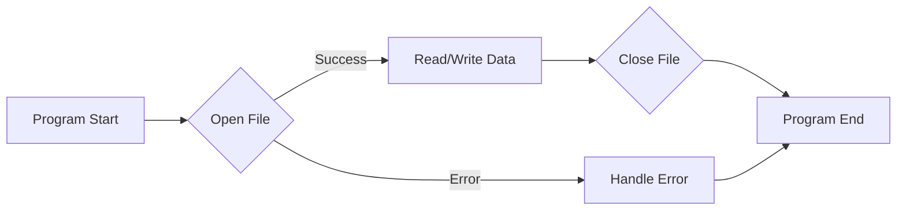
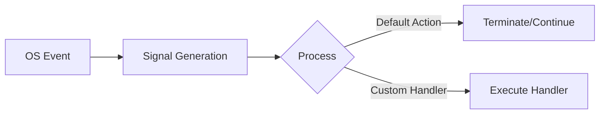
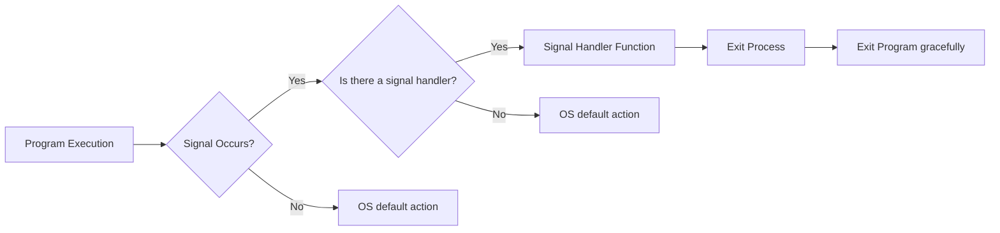
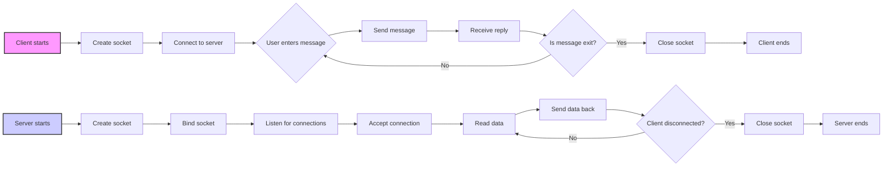
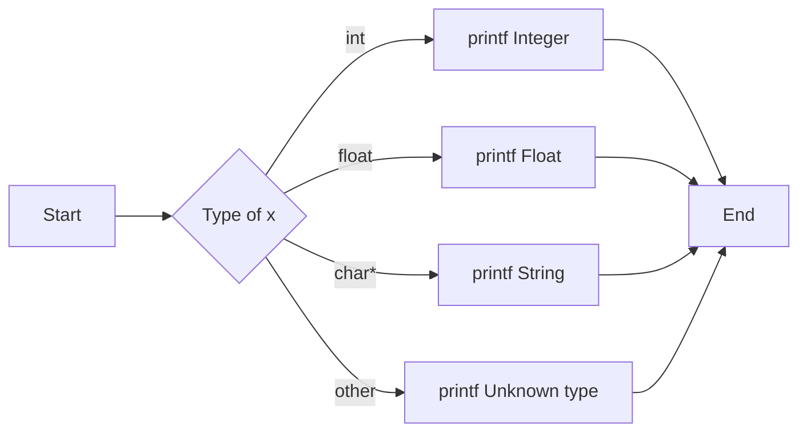
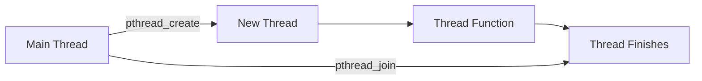
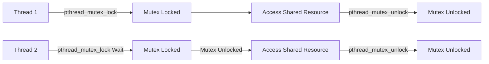
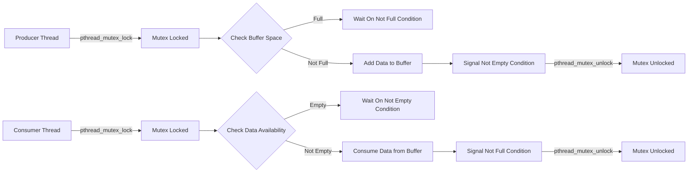

# <span style="color:#e67e22;">What we will learn in this post?</span>

<ul style='list-style-type: none; padding-left: 0;'>
<li><span style='color: #2980b9; font-size: 20px; font-weight: bold;'>👉</span> <span style='color: #2ecc71; font-size: 18px; font-weight: bold;'>Date and Time in C</span></li>
<li><span style='color: #2980b9; font-size: 20px; font-weight: bold;'>👉</span> <span style='color: #2ecc71; font-size: 18px; font-weight: bold;'>Input-Output System Calls in C</span></li>
<li><span style='color: #2980b9; font-size: 20px; font-weight: bold;'>👉</span> <span style='color: #2ecc71; font-size: 18px; font-weight: bold;'>Signals in C</span></li>
<li><span style='color: #2980b9; font-size: 20px; font-weight: bold;'>👉</span> <span style='color: #2ecc71; font-size: 18px; font-weight: bold;'>Program Error Signals in C</span></li>
<li><span style='color: #2980b9; font-size: 20px; font-weight: bold;'>👉</span> <span style='color: #2ecc71; font-size: 18px; font-weight: bold;'>Socket Programming in C</span></li>
<li><span style='color: #2980b9; font-size: 20px; font-weight: bold;'>👉</span> <span style='color: #2ecc71; font-size: 18px; font-weight: bold;'>_Generics Keyword in C</span></li>
<li><span style='color: #2980b9; font-size: 20px; font-weight: bold;'>👉</span> <span style='color: #2ecc71; font-size: 18px; font-weight: bold;'>Multithreading in C</span></li>
<li><span style='color: #2980b9; font-size: 20px; font-weight: bold;'>👉</span> <span style='color: #2ecc71; font-size: 18px; font-weight: bold;'>Conclusion!</span></li>
</ul>

# <span style="color:#e67e22">Let's Play With Time in C! 🕰️ 📅</span>

Hello there! This guide will show you how to handle dates and times in C using the wonderful `time.h` library. We'll go through examples with code, explanations, and even some expected outputs. Let's get started!

## <span style="color:#2980b9">Getting Started with `time.h`</span>

The `time.h` library is your go-to place for all things time-related in C. It provides functions to:

- Get the current time.
- Convert time to various formats.
- Work with date and time components.
- Perform time calculations.

### <span style="color:#8e44ad">Basic Time Retrieval</span>

First, let's see how to get the current time.

```c
#include <stdio.h>
#include <time.h>

int main() {
  time_t now;
  time(&now); // Gets the current time, stored as seconds since the Epoch (usually Jan 1, 1970 UTC)

  printf("Current time (seconds since Epoch): %ld\n", now);
  return 0;
}
```

**Explanation:**

- `time_t now;`: This declares a variable `now` of type `time_t`, which is an integer type used to represent time.
- `time(&now);`: This calls the `time()` function, passing the address of `now` as an argument. It gets the current time and stores it in the `now` variable.
- `printf(...)`: Displays the current time as an integer which represents seconds passed since the epoch (Jan 1, 1970 00:00:00 UTC).

**Expected output:**

```
Current time (seconds since Epoch): 1700570880
```

_Note that the exact number will vary based on when you run the code._

## <span style="color:#2980b9">Breaking Down Time with `localtime()`</span>

Raw seconds since the Epoch is not very human-friendly. Let's use `localtime()` to break that down into usable date and time components.

```c
#include <stdio.h>
#include <time.h>

int main() {
  time_t now;
  time(&now);

  struct tm *local_time = localtime(&now); // Converts time_t to a local time structure

  printf("Year: %d\n", local_time->tm_year + 1900); // Years since 1900
  printf("Month: %d\n", local_time->tm_mon + 1); // Month (0-11)
  printf("Day: %d\n", local_time->tm_mday); // Day of month (1-31)
  printf("Hour: %d\n", local_time->tm_hour); // Hour (0-23)
  printf("Minute: %d\n", local_time->tm_min); // Minute (0-59)
  printf("Second: %d\n", local_time->tm_sec); // Second (0-59)
  return 0;
}
```

**Explanation:**

- `struct tm *local_time = localtime(&now);`: The `localtime()` function takes a pointer to a `time_t` value and returns a pointer to a `struct tm`. This structure holds all the time and date components.
- `local_time->tm_year + 1900`: The `tm_year` member stores the number of years since 1900, so we add 1900 to get the actual year.
- `local_time->tm_mon + 1`: The `tm_mon` member stores the month as a number from 0 to 11, we add 1 to get the actual month.
- The other components (`tm_mday`, `tm_hour`, `tm_min`, `tm_sec`) represent the day, hour, minute, and second, respectively.

**Expected output:**

```
Year: 2023
Month: 11
Day: 21
Hour: 17
Minute: 28
Second: 21
```

_This will vary based on when you run this code._

## <span style="color:#2980b9">Formatting Time with `strftime()`</span>

Now that we have the time components, let's format it in different ways using `strftime()`.

```c
#include <stdio.h>
#include <time.h>
#include <string.h>

int main() {
  time_t now;
  time(&now);
  struct tm *local_time = localtime(&now);

  char buffer[100];

  //Format: YYYY-MM-DD
  strftime(buffer, sizeof(buffer), "%Y-%m-%d", local_time);
  printf("Date (YYYY-MM-DD): %s\n", buffer);

  //Format: HH:MM:SS
  strftime(buffer, sizeof(buffer), "%H:%M:%S", local_time);
  printf("Time (HH:MM:SS): %s\n", buffer);

  //Format: Day, Month Day, Year
   strftime(buffer, sizeof(buffer), "%A, %B %d, %Y", local_time);
   printf("Full date format: %s\n", buffer);

  return 0;
}
```

**Explanation:**

- `char buffer[100];`: We create a character array to store the formatted time.
- `strftime(buffer, sizeof(buffer), "%Y-%m-%d", local_time);`: The `strftime()` function takes the destination buffer, the buffer size, a format string, and the `struct tm` pointer. It formats the time as a string based on the format string.
  - `%Y`: Year with century (e.g., 2023).
  - `%m`: Month as a decimal number (01-12).
  - `%d`: Day of the month (01-31).
  - `%H`: Hour in 24-hour format (00-23).
  - `%M`: Minute (00-59).
  - `%S`: Second (00-59).
    - `%A`: Full weekday name.
    - `%B`: Full month name.

- We use `printf()` to display the formatted time.

**Expected output:**

```
Date (YYYY-MM-DD): 2023-11-21
Time (HH:MM:SS): 17:28:21
Full date format: Tuesday, November 21, 2023
```

_Output time will vary when running this code_

## <span style="color:#2980b9">Time Calculation</span>

Let's see a simple time calculation by adding 2 days to current time.

```c
#include <stdio.h>
#include <time.h>

int main() {
  time_t now;
  time(&now);

  // Add 2 days (2 * 24 * 60 * 60 seconds)
  time_t two_days_later = now + (2 * 24 * 60 * 60);

  struct tm *future_time = localtime(&two_days_later);

    char buffer[100];

    strftime(buffer,sizeof(buffer), "%A, %B %d, %Y at %H:%M:%S", future_time);
    printf("Two days from now it would be: %s\n", buffer);


  return 0;
}
```

**Explanation:**

- We add the amount in seconds we want to our current time which has type `time_t`.
- We get the formatted time using `strftime`

**Expected output:**

```
Two days from now it would be: Thursday, November 23, 2023 at 17:28:21
```

_Output time will vary when running this code_

## <span style="color:#2980b9">Resources</span>

- [C `time.h` library documentation](https://en.cppreference.com/w/c/chrono)
- [Tutorials Point - C Time](https://www.tutorialspoint.com/cprogramming/c_date_time.htm)
- [GeeksforGeeks - Time and Date in C](https://www.geeksforgeeks.org/time-and-date-in-c/)

## <span style="color:#2980b9">Conclusion</span>

That's it! You've now learned the basics of working with dates and times in C using the `time.h` library. You know how to get the current time, convert it to different formats, and do basic time calculations. Remember to explore the documentation for more advanced functionalities. Have fun exploring the world of time in C! 🎉

# <span style="color:#e67e22">Diving into C Input/Output System Calls ⚙️</span>

Hey there, fellow coders! 👋 Let's explore the fascinating world of input/output (I/O) system calls in C. These calls are your direct line to the operating system, allowing your programs to interact with files, devices, and even other programs. Think of them as the essential plumbing for data to flow in and out of your application.

## <span style="color:#2980b9">What Are System Calls Anyway? 🤔</span>

System calls are special functions that allow user-level programs to request services from the operating system kernel. They're necessary because user programs aren't allowed to directly access hardware or manipulate critical system resources. Think of the kernel as a gatekeeper and system calls as the formal requests.

- **Why not directly access hardware?** Imagine if every program could directly control the hard drive or network card. It would be chaos! The kernel ensures everything is controlled and safe.
- **How do they work?** When a user program makes a system call, it transitions to kernel mode, where the kernel executes the requested operation, and then control returns to the user program.

## <span style="color:#2980b9">Essential I/O System Calls 📚</span>

Here are some key I/O system calls you'll use frequently in C:

### <span style="color:#8e44ad">`read()` - Getting Data In 📥</span>

The `read()` system call allows you to read data from an input source, such as a file, keyboard (standard input), or network socket.

- **Function signature:**

  ```c
  #include <unistd.h>
  ssize_t read(int fd, void *buf, size_t count);
  ```

  - `fd`: The file descriptor (an integer identifier for the open input source).
  - `buf`: A pointer to the buffer where read data will be stored.
  - `count`: The maximum number of bytes to read.
  - Return value: Number of bytes actually read (or -1 on error).

- **Example:** Reading from standard input.

  ```c
  #include <stdio.h>
  #include <unistd.h>
  #include <string.h>

  int main() {
      char buffer[128];
      ssize_t bytesRead;

      printf("Enter some text: ");
      bytesRead = read(0, buffer, sizeof(buffer) - 1); // 0 is stdin

      if (bytesRead == -1) {
          perror("Error reading from stdin");
          return 1;
      }

      buffer[bytesRead] = '\0'; // Null-terminate the string
      printf("You entered: %s\n", buffer);
      return 0;
  }

  ```

  **Output:**

  ```text
  Enter some text: Hello World!
  You entered: Hello World!
  ```

  **Explanation:**
  _We include necessary header files for the functions like `read`, `printf` and error handling
  _ We declare a buffer `buffer` to store input and the return value `bytesRead` of read method
  - `read(0, buffer, sizeof(buffer) - 1);` reads up to _sizeof(buffer) - 1_ bytes from \*stdin(0)_into the `buffer` variable. The size is reduced by 1 to have space for the null terminator (`\0`).
    _ The input `buffer` is null-terminated using `buffer[bytesRead] = '\0';` to be able to treat the input as a C-style string.

### <span style="color:#8e44ad">`write()` - Sending Data Out 📤</span>

The `write()` system call is used to write data to an output source (file, terminal, network socket).

- **Function signature:**

  ```c
  #include <unistd.h>
  ssize_t write(int fd, const void *buf, size_t count);
  ```

  - `fd`: File descriptor for the open output source.
  - `buf`: Pointer to the data to write.
  - `count`: Number of bytes to write.
  - Return value: Number of bytes actually written (or -1 on error).

- **Example:** Writing to standard output.

  ```c
  #include <unistd.h>
  #include <stdio.h>
  #include <string.h>
  int main() {
      char message[] = "Hello from write!\n";
      ssize_t bytesWritten;

      bytesWritten = write(1, message, strlen(message)); // 1 is stdout

      if (bytesWritten == -1) {
          perror("Error writing to stdout");
          return 1;
      }

      return 0;
  }
  ```

  **Output:**

  ```text
  Hello from write!
  ```

  **Explanation:**
  _We include necessary header files for the functions like `write` and `perror`.
  _ We declare `message` to be a string to output and the return value `bytesWritten` of the write method.
  - `write(1, message, strlen(message));` writes `strlen(message)` number of bytes from the message variable to stdout with \*file descriptor 1\*.

### <span style="color:#8e44ad">`open()` - Getting Access to Resources 🔓</span>

The `open()` system call is essential for opening files. It returns a file descriptor that can be used for reading or writing operations.

- **Function signature:**

  ```c
  #include <fcntl.h>
  int open(const char *pathname, int flags, ... /* mode_t mode */);
  ```

  - `pathname`: The path to the file you want to open.
  - `flags`: Defines how the file should be opened (read-only, write-only, create if it doesn't exist, etc.).
  - `mode`: (Optional) Defines file permissions if creating the file.
  - Return value: A file descriptor (or -1 on error).

- **Common flags:**
  - `O_RDONLY`: Open for reading only.
  - `O_WRONLY`: Open for writing only.
  - `O_RDWR`: Open for reading and writing.
  - `O_CREAT`: Create the file if it doesn't exist.
  - `O_TRUNC`: If the file exists, truncate its length to zero.
- **Example:** Creating a new file.

  ```c
  #include <stdio.h>
  #include <fcntl.h>
  #include <unistd.h>
  #include <errno.h>

  int main() {
      int fd;
      const char* filename = "my_new_file.txt";

      fd = open(filename, O_WRONLY | O_CREAT | O_TRUNC, 0644); //Create if it doesn't exist, and read and write permissions.

      if (fd == -1) {
          perror("Error opening file");
           if(errno == EACCES) {
              printf("Access error\n");
          }
          return 1;
      }

      printf("File '%s' opened successfully. File descriptor: %d\n", filename, fd);
      close(fd); // Close the file
      return 0;
  }
  ```

  **Output**

  ```text
      File 'my_new_file.txt' opened successfully. File descriptor: 3
  ```

  **Explanation:**

        * We include the necessary header files `stdio.h`, `fcntl.h`, `unistd.h` and `errno.h` for the required functions and error handling.
        * `int fd;`: Declares a variable fd to store the returned file descriptor.
        * `const char* filename = "my_new_file.txt";`:  Declares and initializes the filename for the file to be opened.
        * `fd = open(filename, O_WRONLY | O_CREAT | O_TRUNC, 0644);`: opens the file with the name `filename`, if it does not exists it creates a new file `O_CREAT` with write only access using `O_WRONLY`, if the file exists it truncates it `O_TRUNC`. The permissions for the file are given as 0644 (read and write for user, read only for group and others).
        * Error handling for `open` failure and prints the file descriptor once success.
        * `close(fd);` Closes the file descriptor once the task is done.

### <span style="color:#8e44ad">`close()` - Freeing Up Resources 🚪</span>

After you're done working with a file, it's crucial to close it using `close()`. This frees up resources held by the operating system.

- **Function signature:**

  ```c
  #include <unistd.h>
  int close(int fd);
  ```

- `fd`: The file descriptor of the file to close.
- Return value: 0 on success, -1 on error.
- **Example**: The example is provided in the previous example of `open`.

## <span style="color:#2980b9">Flowchart of System Calls in Action 🗺️</span>



## <span style="color:#2980b9">Key Takeaways 📝</span>

- System calls are your program's way to interact with the OS kernel for privileged operations.
- `read()`, `write()`, `open()`, and `close()` are essential for file I/O.
- Always check for errors (return value of -1) and handle them gracefully (with `perror`).
- Remember to `close()` files when done to avoid resource leaks.

## <span style="color:#2980b9">Further Exploration 🚀</span>

- **File Descriptors:** Learn more about how the OS tracks open files.
- **Error Handling:** Dive deeper into `errno` and handling different types of errors.
- **Advanced I/O:** Explore more complex system calls like `select()` and `poll()` for asynchronous I/O.

  **Resource Links:**

- [Linux System Call Table](https://syscalls.w3challs.com/)
- [Man Pages](https://man7.org/linux/man-pages/man2/) for system calls (`man 2 read`, `man 2 write`, etc)

I hope this comprehensive guide helps you grasp the fundamentals of I/O system calls in C. Happy coding! 🚀

Okay, let's dive into the world of signals in C! 🚦💻

# <span style="color:#e67e22">Understanding Signals in C: A Friendly Guide</span>

Signals in C are like notifications that the operating system sends to your program to tell it about certain events. These events can be anything from a user pressing `Ctrl+C` to a program encountering a division-by-zero error. Think of them as a way for your program to react to unexpected or important occurrences.

## <span style="color:#2980b9">What are Signals?</span>

- **Events that trigger a reaction**: Signals are asynchronous notifications sent to a process to inform it of an event.
- **Predefined IDs**: Each signal is identified by a unique integer (e.g., `SIGINT`, `SIGSEGV`, `SIGALRM`). These are typically defined in `<signal.h>`.
- **Default Actions**: Each signal has a default action associated with it. For example, `SIGINT` (interrupt signal, often from `Ctrl+C`) typically causes a program to terminate.
- **Custom Handling**: You can override the default actions by setting up your own signal handlers. This allows you to gracefully respond to events instead of crashing.
- **Communication:** Signals act as a form of inter-process communication.

Let's visualize it with a simple Mermaid diagram:



## <span style="color:#2980b9">How to Handle Signals</span>

C provides two main ways to handle signals: `signal()` and `sigaction()`. Let's explore both with examples!

### <span style="color:#8e44ad">Using `signal()`</span>

The `signal()` function is a simpler, albeit less flexible, way to set up a signal handler.

**Syntax:**

```c
#include <signal.h>

void (*signal(int signum, void (*handler)(int)))(int);
```

- `signum`: The signal number you want to handle (e.g., `SIGINT`).
- `handler`: A function pointer to your custom signal handler function. This function takes an `int` argument, which is the signal number.

**Example 1: Handling `SIGINT` (Ctrl+C)**

```c
#include <stdio.h>
#include <signal.h>
#include <unistd.h>
#include <stdlib.h>


void sigint_handler(int signum) {
    printf("\nReceived signal %d, exiting gracefully.\n", signum);
    exit(0); // Exit the program gracefully.
}


int main() {
    if (signal(SIGINT, sigint_handler) == SIG_ERR) {
        perror("signal");
        return 1;
    }
    printf("Press Ctrl+C to exit.\n");
    while(1) {
        sleep(1);
    }
    return 0;
}
```

**Expected output:**

```
Press Ctrl+C to exit.
^C
Received signal 2, exiting gracefully.
```

**Explanation:**

- We define `sigint_handler`, which prints a message and then exits the program.
- `signal(SIGINT, sigint_handler)` sets our custom handler to handle the `SIGINT` signal.
- The `while(1)` loop keeps the program running until interrupted.

**Example 2: Ignoring `SIGTSTP` (Ctrl+Z) - temporarily**

```c
#include <stdio.h>
#include <signal.h>
#include <unistd.h>

void ignore_tstp() {
    printf("Received SIGTSTP. Ignoring. Use Ctrl+C to exit.\n");
}

int main() {
   if (signal(SIGTSTP, ignore_tstp) == SIG_ERR) {
       perror("signal");
       return 1;
   }

   printf("Press Ctrl+Z (SIGTSTP) to see that the signal is ignored (but handler is run)\n");

   while(1){
       sleep(1);
   }
   return 0;
}
```

**Expected Output:**

```
Press Ctrl+Z (SIGTSTP) to see that the signal is ignored (but handler is run)
^ZReceived SIGTSTP. Ignoring. Use Ctrl+C to exit.

Received SIGTSTP. Ignoring. Use Ctrl+C to exit.
```

**Explanation:**

- When you press `Ctrl+Z` in the terminal, the OS will send `SIGTSTP` to the foreground process.
- Usually, it will be suspended using the default behavior, but in the example code, we are capturing it and printing the message.
- When the message is printed, the program is not suspended, and it is running again (not in the background)
- The `while(1)` loop keeps the program running until interrupted by `Ctrl+C`.

**Limitations of `signal()`:**

- **Non-portable**: Behavior can vary across operating systems.
- **Race Conditions**: It can suffer from race conditions if another signal arrives while a handler is executing.

### <span style="color:#8e44ad">Using `sigaction()`</span>

The `sigaction()` function offers more flexibility and control over signal handling. It's the preferred method for more robust applications.

**Syntax:**

```c
#include <signal.h>

int sigaction(int signum, const struct sigaction *act, struct sigaction *oldact);
```

- `signum`: The signal to handle (e.g., `SIGINT`).
- `act`: A pointer to a `struct sigaction` structure, which defines how to handle the signal.
- `oldact`: A pointer to a `struct sigaction` structure where the old signal action is stored (can be NULL).

**The `struct sigaction`:**

```c
struct sigaction {
   void     (*sa_handler)(int); // Signal handler function pointer
   void     (*sa_sigaction)(int, siginfo_t *, void *); // Alternate signal handler
   sigset_t sa_mask; // Mask of signals to block during handler execution
   int      sa_flags; // Flags for controlling signal behavior
   void     (*sa_restorer)(void); // Deprecated
};
```

**Example 3: Handling `SIGUSR1` (User-defined signal) with `sigaction()`**

```c
#include <stdio.h>
#include <signal.h>
#include <unistd.h>
#include <stdlib.h>


void sigusr1_handler(int signum, siginfo_t *info, void *context) {
  printf("\nReceived signal %d from process %d.\n", signum, info->si_pid);
}

int main() {
    struct sigaction sa;
    sa.sa_sigaction = sigusr1_handler;
    sa.sa_flags = SA_SIGINFO;  // Use sa_sigaction instead of sa_handler
    sigemptyset(&sa.sa_mask);

    if (sigaction(SIGUSR1, &sa, NULL) == -1) {
        perror("sigaction");
        return 1;
    }

    printf("Send SIGUSR1 using 'kill -USR1 %d'\n", getpid());
    while (1) {
      sleep(1);
    }
    return 0;
}
```

**Expected Output (after sending `SIGUSR1` using `kill`):**

```
Send SIGUSR1 using 'kill -USR1 <pid>'
^C
Received signal 10 from process <PID of the process sending signal>.
```

**Explanation:**

- We use `sa_sigaction` instead of `sa_handler` and specify the flag `SA_SIGINFO`. This lets us access information on the signal sender (such as the PID, see `info->si_pid`).
- `sigemptyset(&sa.sa_mask)` initializes the signal mask to be empty (so that no other signals are blocked).
- The `while(1)` loop continues the program until terminated manually.
- To send the signal use `kill -USR1 <pid>` replacing `<pid>` with the process id.

**Example 4: Blocking `SIGINT` while a handler is running with `sigaction()`**

```c
#include <stdio.h>
#include <signal.h>
#include <unistd.h>
#include <stdlib.h>

void my_handler(int signum) {
    printf("Starting handler for signal %d\n", signum);
    sleep(5); // Simulate some work
    printf("Finishing handler for signal %d\n", signum);
}

int main() {
    struct sigaction sa;

    sa.sa_handler = my_handler;
    sigemptyset(&sa.sa_mask);
    sigaddset(&sa.sa_mask, SIGINT); // Block SIGINT while in the handler
    sa.sa_flags = 0;


    if(sigaction(SIGUSR1, &sa, NULL) == -1) {
        perror("sigaction");
        return 1;
    }

    printf("Send SIGUSR1 using 'kill -USR1 %d'\n", getpid());
    while(1) {
        sleep(1);
    }
    return 0;
}
```

**Expected Output (after sending `SIGUSR1` and `SIGINT` signals):**

```
Send SIGUSR1 using 'kill -USR1 <pid>'
Starting handler for signal 10
^C
Finishing handler for signal 10
^C
```

**Explanation:**

- We set `sa_handler` to our custom function that sleeps for a few seconds.
- `sigemptyset(&sa.sa_mask);` initializes the set
- `sigaddset(&sa.sa_mask, SIGINT);` adds `SIGINT` to the mask, meaning `SIGINT` is blocked while the handler is running.
- After the handler finishes execution, `SIGINT` is not masked anymore and the next `Ctrl+C` will terminate the program.

## <span style="color:#2980b9">Key Differences: `signal()` vs. `sigaction()`</span>

| Feature            | `signal()`               | `sigaction()`                              |
| ------------------ | ------------------------ | ------------------------------------------ |
| Portability        | Less portable            | More portable                              |
| Signal Masking     | Limited                  | Full control using `sa_mask`               |
| Signal Information | Only the signal number   | Access to more detailed info (`siginfo_t`) |
| Flags              | No Flags                 | Control signal behavior with flags         |
| Reentrancy Issues  | Prone to race conditions | More secure, solves reentrancy             |
| **Complexity**     | Easier to use            | More flexible and robust                   |

## <span style="color:#2980b9">Best Practices</span>

- **Use `sigaction()` for New Code**: It's more robust and portable for new applications.
- **Minimize Handler Logic**: Keep your handlers short and avoid calling non-reentrant functions (like `printf`) directly unless it is safe to do so, in general, using a flag to signal should be preferred.
- **Use `sigset_t`**: Manipulate signal masks using the provided functions (`sigemptyset`, `sigfillset`, `sigaddset`, `sigdelset`) to avoid common errors.
- **Understand `SA_RESTART`**: This flag will try to restart a syscall if it was interrupted by a signal.
- **Avoid Global Variables**: Minimize the use of global variables in signal handlers as they can cause race conditions and lead to unpredictable behavior.

## <span style="color:#2980b9">Resources</span>

- **GNU C Library Documentation on Signal Handling**: [https://www.gnu.org/software/libc/manual/html_node/Signal-Handling.html](https://www.gnu.org/software/libc/manual/html_node/Signal-Handling.html)
- **`man signal`**: Use `man signal` in your terminal for details about the `signal()` function.
- **`man sigaction`**: Use `man sigaction` in your terminal for details about the `sigaction()` function.

That's a solid overview of signals in C! Remember to practice these concepts, and don't be afraid to experiment. Happy coding! 🚀✨

# <span style="color:#e67e22">Understanding Program Error Signals in C 🚨</span>

Hey there, code explorers! Let's dive into the world of error signals in C. These signals are like the emergency flares your program sends out when something unexpected happens. We'll learn what they are, how to recognize them, and, most importantly, how to handle them gracefully. No one likes a program crashing and burning, right? 😉

## <span style="color:#2980b9">What Are Program Error Signals? 🚦</span>

- In C (and other Unix-like systems), signals are a way for the operating system to notify your program about **exceptional events**. These events can range from simple issues like dividing by zero to more serious problems like accessing invalid memory.
- Think of signals as **software interrupts**. They temporarily halt the normal flow of your program, allowing you (or the OS, if you don't handle them) to take action.
- Signals are identified by numbers or symbolic names (defined in `<signal.h>`). For example, `SIGSEGV` is the signal for segmentation faults, and `SIGFPE` is for floating-point errors.

## <span style="color:#2980b9">Common Error Signals and Their Causes 💥</span>

Let's look at some of the most frequent signals you might encounter:

- **`SIGSEGV` (Segmentation Fault):**
  - **Cause:** This usually happens when you try to access memory you're not supposed to. This could be a null pointer dereference, writing beyond the bounds of an array, or any other kind of invalid memory access.
  - **Example:**

    ```c
    #include <stdio.h>

    int main() {
        int *ptr = NULL;
        *ptr = 10;  // Attempting to write to a null pointer
        return 0;
    }
    ```

    **Output:** (May vary based on the system)

    ```
    Segmentation fault (core dumped)
    ```

- **`SIGFPE` (Floating-Point Exception):**
  - **Cause:** This occurs during math operations that have no defined result (like dividing by zero) or other floating-point errors.
  - **Example:**

    ````c
    #include <stdio.h>

        int main() {
            int x = 10;
            int y = 0;
            int z = x / y; // Division by zero, which generates SIGFPE signal
            printf("Result: %d\n", z);
            return 0;
         }
        ```

    **Output:** (May vary based on the system)
    `       Floating point exception (core dumped)
    `
    ````

- **`SIGILL` (Illegal Instruction):**
  - **Cause:** This happens when the CPU encounters an instruction that it doesn't know how to execute. This often indicates a problem with your compiled code or memory corruption.

- **`SIGABRT` (Abort Signal):**
  - **Cause:** This signal is usually sent when you explicitly call the `abort()` function, or when the program crashes in other ways and the system terminates it.
- **`SIGINT` (Interrupt):**
  - **Cause:** This signal is generated when the user presses Ctrl + C or sends an interrupt to terminate a running program from the terminal. This helps to terminate the process and end it cleanly.
- **`SIGTERM` (Termination):**
  - **Cause:** This signal is used to request the program to stop, but allows the program to stop gracefully ( unlike `SIGKILL`).

## <span style="color:#2980b9">How to Handle Signals Gracefully 🛡️</span>

The key to robust programs is to handle signals instead of letting the program terminate abruptly. Here's how:

1. **Signal Handling with `signal()`:**
   - The `signal()` function (from `<signal.h>`) allows you to specify a function (called a **signal handler**) that gets called when a specific signal occurs.
   - **Syntax:**

     ```c
     #include <signal.h>
     void (*signal(int signum, void (*handler)(int)))(int);
     ```

     - `signum`: The signal number (like `SIGSEGV`).
     - `handler`: A function pointer that points to your signal handler function or one of `SIG_IGN` to ignore a signal, or `SIG_DFL` to allow the default signal handling behavior of the OS.

2. **The Signal Handler Function:**
   - Your signal handler function takes an integer (the signal number) as input and doesn't return anything.
   - **Important:** Keep your signal handler as short and safe as possible. Avoid doing things that might cause other issues, like calling library functions that are not signal-safe.

> **⚠️ Signal Safety Warning:**  
> Functions like `printf()` and `fprintf()` are **NOT signal-safe**. Using them in signal handlers can cause undefined behavior (deadlocks, crashes, data corruption).
>
> **For production code**, use signal-safe functions like `write()` instead:
>
> ```c
> void signal_handler(int signal_num) {
>     const char msg[] = "Error: Segmentation Fault!\n";
>     write(STDERR_FILENO, msg, sizeof(msg) - 1);  // Signal-safe
>     _exit(EXIT_FAILURE);  // Use _exit, not exit
> }
> ```
>
> For a complete list of signal-safe functions, see: `man 7 signal-safety`

3. **Example: Handling `SIGSEGV` and `SIGFPE`:**

```c
#include <stdio.h>
#include <signal.h>
#include <stdlib.h>

// Note: Using fprintf() for educational purposes
// In production code, use write() instead (see warning above)
void signal_handler(int signal_num) {
    if (signal_num == SIGSEGV) {
        fprintf(stderr, "Error: Segmentation Fault!\n");
    } else if (signal_num == SIGFPE) {
      fprintf(stderr, "Error: Floating Point Exception!\n");
    }
    exit(EXIT_FAILURE);  // Exit after handling the signal
}

int main() {
    // Set up signal handler for SIGSEGV and SIGFPE
    signal(SIGSEGV, signal_handler);
    signal(SIGFPE, signal_handler);

    int *ptr = NULL;
    *ptr = 10;  // This will now trigger our handler

     int x = 10;
     int y = 0;
     int z = x / y;
     printf("Result: %d\n", z);

    return 0;
}
```

**Output:**

```
Error: Segmentation Fault!
```

or

```
Error: Floating Point Exception!
```

**Explanation:**

- We include `<stdio.h>`, `<signal.h>` and `<stdlib.h>` headers.
- We have created a `signal_handler` function, it takes the signal number that caused the function to trigger, and then checks which signal it is using a series of if statements, and the output a message to the terminal and then calls the `exit()` function to safely close the program with an error code.
- In the `main` function, we use the `signal()` function to attach our `signal_handler` function to the `SIGSEGV` and `SIGFPE` signals.
- Now, instead of a program crash, the `signal_handler` is executed, which will show our custom error message and properly terminate the program.

## <span style="color:#8e44ad">Flowchart of Signal Handling 📉</span>



- The program runs normally until a signal occurs.
- If there's a signal handler registered, it's executed.
- Otherwise, the OS takes the default action (which might be to terminate the program).

## <span style="color:#8e44ad">Best Practices for Signal Handling ✅</span>

- **Keep handlers short and efficient:** Avoid performing time-consuming operations in signal handlers to keep the system responsive.
- **Avoid signal unsafe functions in handlers:** Some standard library functions are not safe to call in signal handlers. `printf()` is generally not considered signal-safe. Instead, use functions like `write()` for simple I/O.
- **Set global flags for more complex cases:** If you need to perform a lot of operations in response to a signal, set a global flag in the handler, and handle the flag in the main loop.
- **Restore the signal handler:** When a signal handler is called, the OS might revert the handler to the default handler. So, consider setting the handler again if you want to handle the signal multiple times.

## <span style="color:#8e44ad">Resources for Further Learning 📚</span>

- **Linux Programmer's Manual:** `man 7 signal` for a detailed explanation of signals.
- **GNU C Library:** [https://www.gnu.org/software/libc/manual/html_node/Signal-Handling.html](https://www.gnu.org/software/libc/manual/html_node/Signal-Handling.html)
- **Beej's Guide to Network Programming:** This guide has a section on signal handling which is great to learn about some common signals.
  [https://beej.us/guide/bgnet/html/#signals](https://beej.us/guide/bgnet/html/#signals)
- **Tutorialspoint on signal handling:** [https://www.tutorialspoint.com/cprogramming/c_signal_handling.htm](https://www.tutorialspoint.com/cprogramming/c_signal_handling.htm)

## <span style="color:#2980b9">Wrapping Up 🎁</span>

Understanding and handling program error signals is a crucial skill for any C programmer. It allows you to write more robust, user-friendly programs that don't abruptly crash when unexpected things happen. With the `signal()` function and a bit of care, you can build apps that handle unexpected situations with grace. Happy coding, and may your programs always handle signals with finesse! 😎

Okay, let's dive into the world of socket programming in C! We'll build some simple client-server examples, and I'll make sure to explain everything in a clear and friendly way.

# <span style="color:#e67e22">Socket Programming in C: Let's Connect! 🔌</span>

We're going to explore how to make two programs talk to each other over a network using sockets. Think of sockets as the endpoints of a communication channel. One program, the server, listens for incoming connections, and the other, the client, initiates the connection.

## <span style="color:#2980b9">Basic Concepts</span>

Before we get into the code, let's quickly go over a few key ideas:

- **Sockets:** These are the fundamental building blocks for network communication. They act like doors that allow data to flow between processes, potentially on different machines.
- **IP Addresses:** Like postal addresses for computers on a network.
- **Ports:** Think of these as specific "rooms" within a computer. They help direct incoming data to the correct application.
- **Client-Server Model:** A common structure where one program (the _server_) provides a service and another (the _client_) requests it.
- **Protocols:** Rules for data exchange (e.g., TCP for reliable connections, UDP for fast but potentially unreliable ones).

We will be using **TCP protocol** in these examples.

## <span style="color:#2980b9">First Example: Simple Echo Server and Client</span>

### <span style="color:#8e44ad">The Server (echo_server.c)</span>

Here's how we can create a basic server that echoes back whatever it receives:

```c
#include <stdio.h>
#include <stdlib.h>
#include <string.h>
#include <unistd.h>
#include <arpa/inet.h>
#include <sys/socket.h>

#define PORT 8080
#define BUFFER_SIZE 1024

int main() {
    int server_fd, new_socket;
    struct sockaddr_in address;
    int addrlen = sizeof(address);
    char buffer[BUFFER_SIZE] = {0};
    int valread;

    // 1. Create a socket
    if ((server_fd = socket(AF_INET, SOCK_STREAM, 0)) == 0) {
        perror("socket failed");
        exit(EXIT_FAILURE);
    }

    address.sin_family = AF_INET;
    address.sin_addr.s_addr = INADDR_ANY;
    address.sin_port = htons(PORT);

    // 2. Bind the socket to the address and port
    if (bind(server_fd, (struct sockaddr *)&address, sizeof(address)) < 0) {
        perror("bind failed");
        exit(EXIT_FAILURE);
    }

    // 3. Start listening for connections
    if (listen(server_fd, 3) < 0) {
        perror("listen failed");
        exit(EXIT_FAILURE);
    }

    printf("Server listening on port %d...\n", PORT);

    // 4. Accept incoming connection
    if ((new_socket = accept(server_fd, (struct sockaddr *)&address, (socklen_t *)&addrlen)) < 0) {
        perror("accept failed");
        exit(EXIT_FAILURE);
    }

    printf("Connection accepted from a client.\n");

    // 5. Read data from the socket and send it back
    while ((valread = read(new_socket, buffer, BUFFER_SIZE)) > 0) {
        printf("Client sent: %s", buffer);
        send(new_socket, buffer, strlen(buffer), 0);
        memset(buffer, 0, BUFFER_SIZE); // clear buffer for next read
    }
     if (valread == 0) {
        printf("Client disconnected.\n");
    } else if(valread < 0) {
        perror("Read failed");
    }

    // 6. Close the socket
    close(new_socket);
    close(server_fd);

    return 0;
}

```

**Explanation:**

1. **Socket Creation:** `socket(AF_INET, SOCK_STREAM, 0)` creates a socket for Internet (AF_INET) using TCP (`SOCK_STREAM`).
2. **Binding:** `bind()` connects the socket to a specific IP address (INADDR_ANY means any interface) and port (8080).
3. **Listening:** `listen()` makes the server socket listen for incoming connection requests.
4. **Accepting:** `accept()` creates a new socket for a new incoming connection.
5. **Reading and Sending:** The server reads the data from client via `read()`, prints the content, and sends it back via `send()`.
6. **Close:** `close()` closes the socket.

### <span style="color:#8e44ad">The Client (echo_client.c)</span>

```c
#include <stdio.h>
#include <stdlib.h>
#include <string.h>
#include <unistd.h>
#include <arpa/inet.h>
#include <sys/socket.h>

#define PORT 8080
#define BUFFER_SIZE 1024

int main() {
    int sock = 0;
    struct sockaddr_in serv_addr;
    char buffer[BUFFER_SIZE] = {0};
    char message[BUFFER_SIZE];

    // 1. Create socket
    if ((sock = socket(AF_INET, SOCK_STREAM, 0)) < 0) {
        perror("socket failed");
        return -1;
    }

    serv_addr.sin_family = AF_INET;
    serv_addr.sin_port = htons(PORT);

    // Convert IPv4 and IPv6 addresses from text to binary form
    if (inet_pton(AF_INET, "127.0.0.1", &serv_addr.sin_addr) <= 0) {
        printf("\nInvalid address/ Address not supported \n");
        return -1;
    }

    // 2. Connect to the server
    if (connect(sock, (struct sockaddr *)&serv_addr, sizeof(serv_addr)) < 0) {
        perror("connect failed");
        return -1;
    }
    printf("Connected to the server.\n");
    while (1) {
            printf("Enter message: ");
            fgets(message, BUFFER_SIZE, stdin);
            send(sock, message, strlen(message), 0); // send the message to the server

            if (strcmp(message, "exit\n") == 0) { // close connection if client sends "exit"
                printf("Exiting...\n");
                break;
            }

            int valread = read(sock, buffer, BUFFER_SIZE); // read the server's response
             if (valread > 0 ) {
                printf("Server echoed: %s", buffer); // print what the server sent
                memset(buffer, 0, BUFFER_SIZE);
            }
    }
    // 3. Close the socket
    close(sock);
    return 0;
}
```

**Explanation:**

1. **Socket Creation:** Just like in the server, we create a socket for communication.
2. **Connecting:** `connect()` establishes a connection to the server at the specified address and port.
3. **Sending and Receiving:** the client takes input from the user, sends it to the server and waits for a reply, if the input is `exit` then it breaks the loop and exits.
4. **Closing:** the connection closes after the client exits the program.

**How to Compile and Run:**

1. Save the server code as `echo_server.c` and the client code as `echo_client.c`.
2. Compile them:

   ```bash
   gcc echo_server.c -o echo_server
   gcc echo_client.c -o echo_client
   ```

3. Run the server:

   ```bash
   ./echo_server
   ```

4. In another terminal, run the client:
   `bash
./echo_client
`
   **Expected Output:**

- **Server:**

  ```
  Server listening on port 8080...
  Connection accepted from a client.
  Client sent: Hello there!
  Client sent: How are you?
  Client sent: exit
  Client disconnected.
  ```

- **Client:**

  ```
  Connected to the server.
  Enter message: Hello there!
  Server echoed: Hello there!
  Enter message: How are you?
  Server echoed: How are you?
  Enter message: exit
  Server echoed: exit
  Exiting...
  ```

### <span style="color:#8e44ad">Flowchart of Basic Communication</span>



<br>

## <span style="color:#2980b9">Second Example: Sending Data Structures 📦</span>

Let's move on to something a bit more complex – sending data structures over the network.

### <span style="color:#8e44ad">The Server (struct_server.c)</span>

```c
#include <stdio.h>
#include <stdlib.h>
#include <string.h>
#include <unistd.h>
#include <arpa/inet.h>
#include <sys/socket.h>

#define PORT 8080

typedef struct {
    int id;
    char name[50];
    float value;
} DataItem;

int main() {
    int server_fd, new_socket, valread;
    struct sockaddr_in address;
    int addrlen = sizeof(address);
    DataItem item;

     // 1. Create socket
    if ((server_fd = socket(AF_INET, SOCK_STREAM, 0)) == 0) {
        perror("socket failed");
        exit(EXIT_FAILURE);
    }

    address.sin_family = AF_INET;
    address.sin_addr.s_addr = INADDR_ANY;
    address.sin_port = htons(PORT);

    // 2. Bind the socket to the address and port
    if (bind(server_fd, (struct sockaddr *)&address, sizeof(address)) < 0) {
        perror("bind failed");
        exit(EXIT_FAILURE);
    }

    // 3. Start listening for connections
    if (listen(server_fd, 3) < 0) {
        perror("listen failed");
        exit(EXIT_FAILURE);
    }

    printf("Server listening on port %d...\n", PORT);

    // 4. Accept incoming connection
    if ((new_socket = accept(server_fd, (struct sockaddr *)&address, (socklen_t *)&addrlen)) < 0) {
        perror("accept failed");
        exit(EXIT_FAILURE);
    }
        printf("Connection accepted from a client.\n");
    // 5. Receive the structure
    while((valread = read(new_socket, &item, sizeof(DataItem))) > 0){
        printf("Received data:\n");
        printf("ID: %d\n", item.id);
        printf("Name: %s\n", item.name);
        printf("Value: %.2f\n", item.value);
    }
    if (valread == 0) {
        printf("Client disconnected.\n");
    } else if (valread < 0) {
        perror("Read failed");
    }

   // 6. Close the socket
    close(new_socket);
    close(server_fd);
    return 0;
}
```

### <span style="color:#8e44ad">The Client (struct_client.c)</span>

```c
#include <stdio.h>
#include <stdlib.h>
#include <string.h>
#include <unistd.h>
#include <arpa/inet.h>
#include <sys/socket.h>

#define PORT 8080
#define BUFFER_SIZE 1024
typedef struct {
    int id;
    char name[50];
    float value;
} DataItem;

int main() {
    int sock = 0;
    struct sockaddr_in serv_addr;
    DataItem item;

    // 1. Create socket
    if ((sock = socket(AF_INET, SOCK_STREAM, 0)) < 0) {
        perror("socket failed");
        return -1;
    }

    serv_addr.sin_family = AF_INET;
    serv_addr.sin_port = htons(PORT);

    // Convert IPv4 and IPv6 addresses from text to binary form
    if (inet_pton(AF_INET, "127.0.0.1", &serv_addr.sin_addr) <= 0) {
        printf("\nInvalid address/ Address not supported \n");
        return -1;
    }

    // 2. Connect to the server
    if (connect(sock, (struct sockaddr *)&serv_addr, sizeof(serv_addr)) < 0) {
        perror("connect failed");
        return -1;
    }
       printf("Connected to the server.\n");

    // 3. Prepare data structure
    item.id = 123;
    strcpy(item.name, "Test Item");
    item.value = 99.99;

    // 4. Send the structure
    send(sock, &item, sizeof(DataItem), 0);
    printf("Data structure sent to the server.\n");

    // 5. Close the socket
    close(sock);

    return 0;
}
```

**Explanation:**

- Both the client and the server are using a struct named `DataItem`.
- The client creates a `DataItem`, populates it with data, and then sends it to the server using `send()`.
- The server receives the entire structure using `read()` into the `DataItem` variable and then proceeds to print out the content of the received structure.

**How to Compile and Run:**
Follow the same process as in the first example by using `gcc struct_server.c -o struct_server` and `gcc struct_client.c -o struct_client`, then run `./struct_server` and `./struct_client` in separate terminals.
**Expected Output:**

- **Server:**

  ```
  Server listening on port 8080...
  Connection accepted from a client.
  Received data:
  ID: 123
  Name: Test Item
  Value: 99.99
  Client disconnected.
  ```

- **Client:**

  ```
  Connected to the server.
  Data structure sent to the server.
  ```

## <span style="color:#2980b9">Important Considerations and Best Practices</span>

- **Error Handling:** Always check return values from functions like `socket()`, `bind()`, `connect()`, `send()`, and `read()`.
- **Buffer Overflow:** Be careful when reading data, ensure you don't write past the end of your buffers.
- **Endianness:** When sending structures between different systems, be mindful of byte order differences (use `htonl()`, `ntohl()`, etc. for networking).
- **Blocking vs. Non-blocking:** The examples above use blocking sockets. For more complex applications, look into non-blocking I/O.
- **Multi-threading/Multi-processing:** If you need your server to handle multiple connections simultaneously, explore threading or multiprocessing.
- **Security:** Be aware of security implications such as man-in-the-middle attacks and implement security measures if required.

## <span style="color:#2980b9">More Resources</span>

- **Beej's Guide to Network Programming:** [https://beej.us/guide/bgnet/](https://beej.us/guide/bgnet/) (A classic, highly recommended guide!)
- **Linux man pages:** Look up the manuals for functions such as `socket`, `bind`, `connect`, etc. for detailed explanations. Use the command `man socket` for the `socket` function manual
- **TutorialsPoint:** [https://www.tutorialspoint.com/unix_sockets/index.htm](https://www.tutorialspoint.com/unix_sockets/index.htm)

<br>
We've covered the basics of socket programming with some simple examples.  This is just the tip of the iceberg, but you now have a foundation to build more complex networking applications. Let me know if you have more questions!

# <span style="color:#e67e22">Unlocking Generics in C with `_Generic` 🗝️</span>

Hey there, code explorer! Today, we're diving into the world of generic programming in C using the `_Generic` keyword. While C isn't inherently known for its generics (like you might find in Java or C++), `_Generic` provides a powerful way to create functions that can handle multiple types without resorting to messy void pointers and manual type casting. Let's get started!

## <span style="color:#2980b9">What's the Buzz About `_Generic`? 🤔</span>

Before we jump into code, let's understand what `_Generic` is all about. In a nutshell, `_Generic` is a _selection expression_ that allows you to choose a different expression based on the _type_ of an argument. It's like a smart switchboard for your code!

- **Type-Based Dispatch:** Instead of using if-else chains to check types, `_Generic` simplifies this process, allowing you to write more concise and readable code.
- **Compile-Time Check:** The selection happens at compile time. This means there's no performance hit at runtime.
- **Increased Type Safety:** By working with specific types, it reduces the risk of errors related to incorrect type conversions that are common when using void pointers.
- **More Readable Code:** It makes it much easier to read and understand the intentions of your code when dealing with functions designed to handle a variety of data types.

## <span style="color:#2980b9">How Does `_Generic` Actually Work? 🛠️</span>

The syntax of `_Generic` looks like this:

```c
_Generic(control_expression, association_list)
```

Let's break it down:

1. `control_expression`: This is the expression whose type determines which expression from the `association_list` will be returned.
2. `association_list`: This is a comma-separated list of type-expression pairs. Each pair is defined as `type: expression`.

- The `_Generic` expression evaluates to the `expression` associated with the `type` of `control_expression`.

Let's illustrate this with an example. Imagine we want to create a macro to print different types.

```c
#include <stdio.h>

#define printType(x) _Generic((x), \
                            int:  printf("Integer: %d\n", x), \
                            float: printf("Float: %f\n", x),   \
                            char*: printf("String: %s\n", x),   \
                            default: printf("Unknown type\n")    \
                           )

int main() {
  int num = 42;
  float pi = 3.14;
  char* message = "Hello, _Generic!";

  printType(num);   // Output: Integer: 42
  printType(pi);   // Output: Float: 3.140000
  printType(message);  // Output: String: Hello, _Generic!
  printType(10.2L); // Output: Unknown type

  return 0;
}

```

### <span style="color:#8e44ad">Explanation</span>

- We defined a macro called `printType` that uses `_Generic`.
- We pass the argument `x` as the _control_expression_ inside the `_Generic` expression.
- Depending on the _type_ of x, different `printf` statements will be executed.
- The _default_ case covers all the data types not explicitly defined in the association list.

## <span style="color:#2980b9">Crafting Generic Functions with `_Generic` 🎨</span>

Now, let's create a few generic functions using `_Generic` to show its capabilities.

### <span style="color:#8e44ad">Example 1: A Generic Max Function</span>

Let's create a `max` function that returns the larger of two values, no matter the type.

```c
#include <stdio.h>
#include <stdbool.h>

#define MAX(a,b) _Generic((a),      \
                        int:   ( (a) > (b) ? (a) : (b)),    \
                        float: ( (a) > (b) ? (a) : (b)),    \
                        double:  ( (a) > (b) ? (a) : (b)),  \
                        default: ( (a) > (b) ? (a) : (b))   \
                       )

int main() {
  int intMax = MAX(10, 5);
  float floatMax = MAX(2.5f, 7.8f);
  double doubleMax = MAX(5.0, 10.0);

  printf("Max int: %d\n", intMax);   // Output: Max int: 10
  printf("Max float: %f\n", floatMax);  // Output: Max float: 7.800000
  printf("Max double: %lf\n", doubleMax); // Output: Max double: 10.000000
   char charMax = MAX('a','z');
    printf("Max Char: %c\n", charMax); // Output: Max Char: z

  return 0;
}
```

### <span style="color:#8e44ad">Explanation</span>

- We use `_Generic` within the `MAX` macro.
- The `_Generic` expression selects the appropriate conditional expression based on the type of `a`
- We provide cases for `int`, `float`, and `double`.
- The default case has been introduced to ensure other numeric types are compatible for comparision.
- `char` can also be handled using default implementation.

### <span style="color:#8e44ad">Example 2: A Generic Swap Function</span>

Let's implement a swap function.

> **⚠️ Important Note:** This example uses **GNU C extensions** (statement expressions `({ ... })`). To compile this code, you need to use `-std=gnu11` or `-std=gnu99` flag:
>
> ```bash
> gcc -std=gnu11 swap_example.c -o swap_example
> ```



```c
#include <stdio.h>

#define SWAP(a, b, type)         \
    _Generic((a),               \
        int:  _Generic((b),    \
                int: ({ type temp = a; a = b; b = temp; }),  \
                default: ({  })  \
              ),                    \
        float: _Generic((b),   \
               float: ({ type temp = a; a = b; b = temp; }),   \
                default: ({ }) \
                ),\
    char*: _Generic((b), \
                char*: ({ type *temp = a; a = b; b = temp; }), \
                default: ({}) \
            ),\
        default: ({ })              \
    )


int main() {
    int num1 = 5, num2 = 10;
    float float1 = 2.5, float2 = 7.8;
     char* str1 = "Hello", *str2 = "World";

    printf("Before Swap: num1 = %d, num2 = %d\n", num1, num2);
    SWAP(num1, num2, int);
    printf("After Swap: num1 = %d, num2 = %d\n", num1, num2);


    printf("Before Swap: float1 = %f, float2 = %f\n", float1, float2);
    SWAP(float1, float2, float);
    printf("After Swap: float1 = %f, float2 = %f\n", float1, float2);

    printf("Before Swap: str1 = %s, str2 = %s\n", str1, str2);
    SWAP(str1,str2,char*);
    printf("After Swap: str1 = %s, str2 = %s\n", str1, str2);

   // This will not be swapped. Type mismatch.
    SWAP(num1, float2, int);
    printf("num1 = %d, float2 = %f\n",num1, float2 );

    return 0;
}

```



### <span style="color:#8e44ad">Explanation</span>

- We define a macro `SWAP` that uses nested `_Generic` expressions.
- We explicitly check the types of both `a` and `b` to confirm both have compatible types before swapping. If not a default case is executed that does nothing.
- `({ ... })` is a compound literal (a GNU extension). This helps us use `temp` variable, and make it local to just the swapping logic
- By using `type` in the macro, we ensure the swap is performed correctly with any type passed

## <span style="color:#2980b9">Type Safety and `_Generic` 🛡️</span>

One of the most significant advantages of using `_Generic` is that it increases type safety. Because type dispatching is done at compile time, type mismatches are caught early. When you have `default` case defined, you can decide whether a case should be handled implicitly or explicitly.

### <span style="color:#8e44ad">Type Safety Example</span>

In the swap example above if we pass int and float to the swap function, the generic will detect a type mismatch and will not swap. This type safety mechanism prevents run time errors in our program.

## <span style="color:#2980b9">Flow of Execution 🌊</span>

Let's illustrate the flow of execution using a Mermaid flowchart for the `printType` macro:



## <span style="color:#2980b9">Points To Note 📝</span>

- **C11 Standard:** `_Generic` is a feature introduced in the C11 standard. So, make sure your compiler supports C11 or higher.
- **Macro Limitations:** When using `_Generic` inside macros, be mindful of macro side effects. Avoid passing expressions that have side effects as `control_expression`.
- **Compile-Time:** Remember, the selection of which expression to evaluate is determined during _compile-time_, not run-time.

## <span style="color:#2980b9">Resources for Further Reading 📚</span>

- [C11 Standard](http://www.open-std.org/jtc1/sc22/wg14/www/docs/n1570.pdf): The official C11 standard document.
- [GCC Documentation on `_Generic`](https://gcc.gnu.org/onlinedocs/gcc/Type-Generic.html): GCC documentation for `_Generic`.
- [Modern C](https://modernc.gforge.inria.fr/) By Jens Gustedt: Highly recommended book to understand modern C programming.

## <span style="color:#2980b9">Wrapping Up 🎁</span>

That's it! We've seen how to harness the power of `_Generic` to create type-safe and readable generic functions in C. While it might not be as straightforward as generics in some other languages, `_Generic` offers a clean way to achieve similar functionality. Happy coding! 🎉

Okay, let's dive into the world of multithreading in C using the `pthread` library! 🧵 This will be your friendly guide, packed with explanations, examples, and some cool visuals. Let's get started!

# <span style="color:#e67e22">Multithreading in C: A Friendly Introduction 🚀</span>

Multithreading allows your program to do multiple things at the same time, kind of like having multiple workers in a factory. Each worker (or thread) can handle a different task, making your program faster and more efficient. In C, we often use the `pthread` library to work with threads. Let's see how!

## <span style="color:#2980b9">Understanding Threads 💡</span>

- **What is a thread?** Think of a thread as a lightweight process. It's a small execution unit within a program that runs independently.
- **Why use threads?**
  - **Improved Performance:** Do multiple things simultaneously.
  - **Responsiveness:** Keep your program running smoothly, even if one task takes a while.
  - **Resource Sharing:** Threads within the same process share memory, making communication easier.

## <span style="color:#2980b9">Setting Up Your Environment 🛠️</span>

Before we write any code, ensure you have the `pthread` library. Usually, it's part of the standard C library, but you might need to link it explicitly when you compile.

- **Compiling:** When compiling, add `-pthread` flag: `gcc your_code.c -o your_program -pthread`

## <span style="color:#2980b9">Creating Threads 🧵</span>

Let's start with a basic example of creating and starting threads.

### <span style="color:#8e44ad">Example 1: Basic Thread Creation</span>

```c
#include <stdio.h>
#include <pthread.h>

// Function that will be executed by the thread
void *thread_function(void *arg) {
    printf("Hello from a thread! 👋\n");
    return NULL;
}

int main() {
    pthread_t thread_id; // Thread ID variable

    // Create a new thread
    pthread_create(&thread_id, NULL, thread_function, NULL);
    printf("Main Thread is running!\n");

    // Wait for the thread to finish (optional, but good practice)
    pthread_join(thread_id, NULL);

    printf("Main thread finished after joined with thread\n");
    return 0;
}
```

**Expected Output:**

```
Main Thread is running!
Hello from a thread! 👋
Main thread finished after joined with thread
```

**Explanation:**

- `pthread_t thread_id;`: Declares a variable to hold the thread's identifier.
- `pthread_create()`: Creates a new thread.
  - `&thread_id`: Pointer to the variable that will store the new thread's ID.
  - `NULL`: Default thread attributes.
  - `thread_function`: The function that the new thread will execute.
  - `NULL`: Argument to pass to the thread function (can be NULL if not needed).
- `pthread_join()`: The main thread waits for the new thread to finish. It makes sure that the child thread completes before the main thread terminates.

### <span style="color:#8e44ad">Example 2: Passing Data to Threads</span>

```c
#include <stdio.h>
#include <stdlib.h>
#include <pthread.h>

typedef struct {
    int id;
    char* message;
} thread_data_t;

// Function that will be executed by the thread
void *thread_function_with_data(void *arg) {
    thread_data_t *data = (thread_data_t*) arg;
    printf("Thread %d: %s\n", data->id, data->message);
    free(data); // Free the allocated memory
    return NULL;
}

int main() {
    pthread_t thread_id1, thread_id2;

    // Prepare data for threads
    thread_data_t *data1 = (thread_data_t*)malloc(sizeof(thread_data_t));
    data1->id = 1;
    data1->message = "I am Thread 1!";

    thread_data_t *data2 = (thread_data_t*)malloc(sizeof(thread_data_t));
    data2->id = 2;
    data2->message = "And I am Thread 2!";

    // Create new threads
    pthread_create(&thread_id1, NULL, thread_function_with_data, (void *)data1);
    pthread_create(&thread_id2, NULL, thread_function_with_data, (void *)data2);

    // Wait for the threads to finish
    pthread_join(thread_id1, NULL);
    pthread_join(thread_id2, NULL);


    printf("Main thread finished\n");
    return 0;
}
```

**Expected Output (order might vary due to thread scheduling):**

```
Thread 1: I am Thread 1!
Thread 2: And I am Thread 2!
Main thread finished
```

**Explanation:**

- We created a `struct` (`thread_data_t`) to pass multiple arguments to the thread function.
- We dynamically allocated memory to pass data to each thread.
- We passed this data as an argument using `(void *)data1` during thread creation.
- It's crucial to free the allocated memory after it is used by thread using `free(data);` inside the thread's function to avoid memory leaks.

## <span style="color:#2980b9">Thread Synchronization 🤝</span>

When multiple threads access the same data, it can lead to race conditions and unpredictable behavior. We use synchronization mechanisms to avoid this.

### <span style="color:#8e44ad">Example 3: Mutex Locks</span>

Mutex (Mutual Exclusion) locks ensure that only one thread can access a shared resource at a time.

```c
#include <stdio.h>
#include <stdlib.h>
#include <pthread.h>

int counter = 0;
pthread_mutex_t counter_mutex;

void *increment_counter(void *arg) {
    for (int i = 0; i < 100000; i++) {
        pthread_mutex_lock(&counter_mutex); // Acquire the lock
        counter++; // critical section of code
        pthread_mutex_unlock(&counter_mutex); // Release the lock
    }
    return NULL;
}

int main() {
    pthread_t thread_id1, thread_id2;

    pthread_mutex_init(&counter_mutex, NULL);

    pthread_create(&thread_id1, NULL, increment_counter, NULL);
    pthread_create(&thread_id2, NULL, increment_counter, NULL);

    pthread_join(thread_id1, NULL);
    pthread_join(thread_id2, NULL);

    printf("Final counter value: %d\n", counter);

    pthread_mutex_destroy(&counter_mutex);

    return 0;
}
```

**Expected Output:**

```
Final counter value: 200000
```

**Explanation:**

- `pthread_mutex_t counter_mutex;`: Declares a mutex lock variable.
- `pthread_mutex_init()`: Initializes the mutex lock.
- `pthread_mutex_lock()`: Acquires the lock. If another thread holds the lock, this thread will wait.
- `pthread_mutex_unlock()`: Releases the lock. Other threads waiting on the lock can now acquire it.
- `pthread_mutex_destroy()`: Destroys the mutex after use and releases resources.

Without the mutex lock, the final value of the counter would be unpredictable due to race conditions.

## <span style="color:#2980b9">Communication Between Threads 📢</span>

Threads can communicate using shared memory, but they need to be synchronized. Another method is using Condition Variables along with Mutex locks.

### <span style="color:#8e44ad">Example 4: Producer Consumer with Condition Variables</span>

```c
#include <stdio.h>
#include <stdlib.h>
#include <pthread.h>

#define BUFFER_SIZE 5
int buffer[BUFFER_SIZE];
int buffer_count = 0;
int buffer_in = 0;
int buffer_out = 0;
pthread_mutex_t buffer_mutex;
pthread_cond_t buffer_not_full;
pthread_cond_t buffer_not_empty;

// Producer
void *producer(void *arg) {
    int item = 1;
    for (int i = 0; i < 10; i++) {
        pthread_mutex_lock(&buffer_mutex);
        while (buffer_count == BUFFER_SIZE)
            pthread_cond_wait(&buffer_not_full, &buffer_mutex);

        buffer[buffer_in] = item++;
        buffer_in = (buffer_in + 1) % BUFFER_SIZE;
        buffer_count++;
        printf("Producer produced: %d, buffer_count %d\n", item - 1, buffer_count);
        pthread_cond_signal(&buffer_not_empty);
        pthread_mutex_unlock(&buffer_mutex);
    }
    return NULL;
}

// Consumer
void *consumer(void *arg) {
    for (int i = 0; i < 10; i++) {
        pthread_mutex_lock(&buffer_mutex);
        while (buffer_count == 0)
            pthread_cond_wait(&buffer_not_empty, &buffer_mutex);

        int item = buffer[buffer_out];
        buffer_out = (buffer_out + 1) % BUFFER_SIZE;
        buffer_count--;
        printf("Consumer consumed: %d, buffer_count %d\n", item, buffer_count);
         pthread_cond_signal(&buffer_not_full);
        pthread_mutex_unlock(&buffer_mutex);
    }
    return NULL;
}

int main() {
    pthread_t producer_thread, consumer_thread;
     pthread_mutex_init(&buffer_mutex, NULL);
     pthread_cond_init(&buffer_not_full, NULL);
     pthread_cond_init(&buffer_not_empty, NULL);

    pthread_create(&producer_thread, NULL, producer, NULL);
    pthread_create(&consumer_thread, NULL, consumer, NULL);

    pthread_join(producer_thread, NULL);
    pthread_join(consumer_thread, NULL);

    pthread_mutex_destroy(&buffer_mutex);
    pthread_cond_destroy(&buffer_not_full);
    pthread_cond_destroy(&buffer_not_empty);

    return 0;
}
```

**Expected Output (order might vary but you'll see producer and consumer interplay):**

```
Producer produced: 1, buffer_count 1
Consumer consumed: 1, buffer_count 0
Producer produced: 2, buffer_count 1
Consumer consumed: 2, buffer_count 0
Producer produced: 3, buffer_count 1
Consumer consumed: 3, buffer_count 0
Producer produced: 4, buffer_count 1
Consumer consumed: 4, buffer_count 0
Producer produced: 5, buffer_count 1
Consumer consumed: 5, buffer_count 0
Producer produced: 6, buffer_count 1
Consumer consumed: 6, buffer_count 0
Producer produced: 7, buffer_count 1
Consumer consumed: 7, buffer_count 0
Producer produced: 8, buffer_count 1
Consumer consumed: 8, buffer_count 0
Producer produced: 9, buffer_count 1
Consumer consumed: 9, buffer_count 0
Producer produced: 10, buffer_count 1
Consumer consumed: 10, buffer_count 0
```

**Explanation:**

- **Condition Variables:** `pthread_cond_t`: Used to signal a thread that it can proceed after some condition has become true.
- **`pthread_cond_wait(&cond, &mutex)`:** Atomically unlocks the mutex and waits on the condition variable. When woken up, it reacquires the mutex lock
- **`pthread_cond_signal(&cond)`:** Wakes up one of the threads that is waiting on the condition variable.
- The producer adds data to a buffer and signals the consumer to consume. The consumer consumes the data and signals producer when buffer has space.
- **Important:** The mutex ensures exclusive access to the shared buffer, and the condition variables coordinate the producer and consumer threads when the buffer is either full or empty, respectively.

## <span style="color:#2980b9">Diagrams 🎨</span>

### **Thread Creation**



### **Mutex Lock**



### **Producer-Consumer**



## <span style="color:#2980b9">Further Reading 📚</span>

- **Pthreads Tutorial:** [https://computing.llnl.gov/tutorials/pthreads/](https://computing.llnl.gov/tutorials/pthreads/)
- **GNU Pthreads:** [https://www.gnu.org/software/libc/manual/html_node/Pthreads.html](https://www.gnu.org/software/libc/manual/html_node/Pthreads.html)
- **Condition Variables:** [https://www.geeksforgeeks.org/condition-variables-in-c-cpp/](https://www.geeksforgeeks.org/condition-variables-in-c-cpp/)

I hope this guide was helpful! Multithreading can be tricky, but with practice, you'll become a pro. Happy coding! 🎉

---

# <span style="color:#e67e22">Compilation Guide 🔨</span>

Here's a quick reference for compiling the examples in this tutorial:

## <span style="color:#2980b9">Basic C Programs (Date/Time)</span>

```bash
# Standard compilation
gcc time_example.c -o time_example
./time_example
```

## <span style="color:#2980b9">System Calls and File I/O</span>

```bash
# No special flags needed
gcc io_example.c -o io_example
./io_example
```

## <span style="color:#2980b9">Signal Handling</span>

```bash
# Standard compilation
gcc signal_example.c -o signal_example
./signal_example

# Send signals to test (replace PID with actual process ID)
kill -SIGUSR1 <PID>
kill -SIGINT <PID>
```

## <span style="color:#2980b9">Socket Programming</span>

```bash
# Compile server and client separately
gcc echo_server.c -o echo_server
gcc echo_client.c -o echo_client

# Run in separate terminals
# Terminal 1:
./echo_server

# Terminal 2:
./echo_client
```

## <span style="color:#2980b9">\_Generic Examples</span>

```bash
# Standard C11 for most examples
gcc -std=c11 generic_example.c -o generic_example

# SWAP macro requires GNU extensions
gcc -std=gnu11 swap_example.c -o swap_example
```

## <span style="color:#2980b9">Multithreading</span>

```bash
# Must link pthread library with -pthread flag
gcc thread_example.c -o thread_example -pthread
./thread_example

# Alternative (older systems)
gcc thread_example.c -o thread_example -lpthread
```

## <span style="color:#2980b9">Common Compiler Flags</span>

```bash
# Enable all warnings (recommended)
gcc -Wall -Wextra your_code.c -o your_program

# Debug information
gcc -g your_code.c -o your_program

# Optimization
gcc -O2 your_code.c -o your_program

# Complete example with multiple flags
gcc -std=c11 -Wall -Wextra -O2 -pthread your_code.c -o your_program
```

---

<h1><span style='color:#e67e22'>Conclusion</span></h1>

And that's a wrap! 🎉 We hope you found this helpful and maybe even a little fun. We're always looking to improve and love hearing from you. Got any thoughts, questions, or suggestions? 🤔 Please share them in the comments below! Your feedback is super valuable to us. Let's chat! 💬😊
