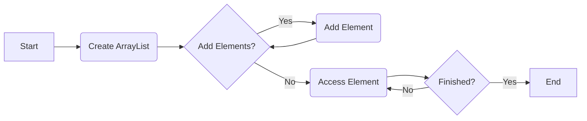
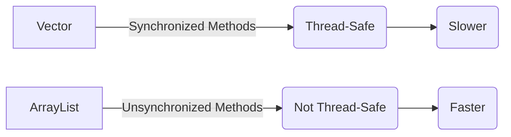
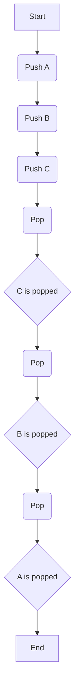
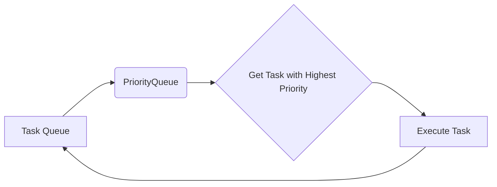
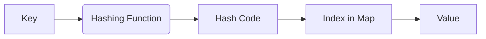
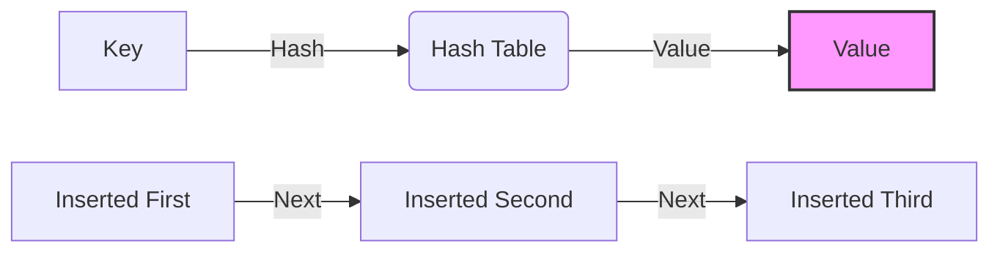
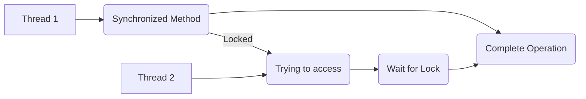
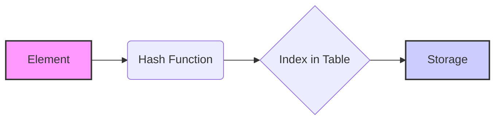
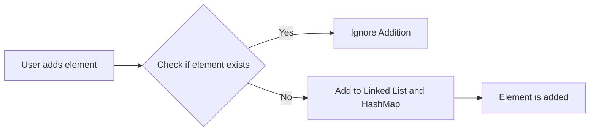

# <span style="color:#e67e22;">What we will learn in this post?</span>
<ul style='list-style-type: none; padding-left: 0;'>
<li><span style='color: #2980b9; font-size: 20px; font-weight: bold;'>👉</span> <span style='color: #2ecc71; font-size: 18px; font-weight: bold;'>ArrayList in Java</span></li>
<li><span style='color: #2980b9; font-size: 20px; font-weight: bold;'>👉</span> <span style='color: #2ecc71; font-size: 18px; font-weight: bold;'>Vector Class in Java</span></li>
<li><span style='color: #2980b9; font-size: 20px; font-weight: bold;'>👉</span> <span style='color: #2ecc71; font-size: 18px; font-weight: bold;'>Stack Class in Java</span></li>
<li><span style='color: #2980b9; font-size: 20px; font-weight: bold;'>👉</span> <span style='color: #2ecc71; font-size: 18px; font-weight: bold;'>LinkedList in Java</span></li>
<li><span style='color: #2980b9; font-size: 20px; font-weight: bold;'>👉</span> <span style='color: #2ecc71; font-size: 18px; font-weight: bold;'>Priority Queue in Java</span></li>
<li><span style='color: #2980b9; font-size: 20px; font-weight: bold;'>👉</span> <span style='color: #2ecc71; font-size: 18px; font-weight: bold;'>HashMap in Java</span></li>
<li><span style='color: #2980b9; font-size: 20px; font-weight: bold;'>👉</span> <span style='color: #2ecc71; font-size: 18px; font-weight: bold;'>LinkedHashMap in Java</span></li>
<li><span style='color: #2980b9; font-size: 20px; font-weight: bold;'>👉</span> <span style='color: #2ecc71; font-size: 18px; font-weight: bold;'>Dictionary in Java</span></li>
<li><span style='color: #2980b9; font-size: 20px; font-weight: bold;'>👉</span> <span style='color: #2ecc71; font-size: 18px; font-weight: bold;'>Hashtable in Java</span></li>
<li><span style='color: #2980b9; font-size: 20px; font-weight: bold;'>👉</span> <span style='color: #2ecc71; font-size: 18px; font-weight: bold;'>HashSet in Java</span></li>
<li><span style='color: #2980b9; font-size: 20px; font-weight: bold;'>👉</span> <span style='color: #2ecc71; font-size: 18px; font-weight: bold;'>TreeSet in Java</span></li>
<li><span style='color: #2980b9; font-size: 20px; font-weight: bold;'>👉</span> <span style='color: #2ecc71; font-size: 18px; font-weight: bold;'>LinkedHashSet in Java</span></li>
<li><span style='color: #2980b9; font-size: 20px; font-weight: bold;'>👉</span> <span style='color: #2ecc71; font-size: 18px; font-weight: bold;'>Conclusion!</span></li>
</ul>

# <span style="color:#e67e22">The Wonderful World of ArrayList in Java 🚀</span>

The `ArrayList class in Java` is your go-to when you need a dynamic, resizeable array. Unlike regular arrays, which have a fixed size, `ArrayList` can grow or shrink as you add or remove elements. Think of it as a super flexible container for your data! It's one of the most commonly used collections in Java, especially when you're dealing with a variable number of items.

## <span style="color:#2980b9">What Makes ArrayList Special? 🤔</span>

### <span style="color:#8e44ad">Key Features and ArrayList Advantages</span>

*   **Resizable:** The most significant advantage is that `ArrayList` automatically handles resizing for you. No more worrying about `ArrayIndexOutOfBoundsException` when adding new items! This flexibility is crucial when dealing with `dynamic arrays in Java`.
*   **Efficient Indexing:** Accessing elements by their index is super fast and efficient because `ArrayList` uses a continuous memory block for storage, just like a normal array.
*   **Ordered Collection:** `ArrayList` maintains the insertion order of elements, which means elements are stored based on how you have added them into the arraylist.
*   **Can Store Duplicates:** `ArrayList` can store duplicate elements.

   ```java
   // Example ArrayList in Java
   import java.util.ArrayList;

   public class ExampleArrayList {
      public static void main(String[] args) {
           ArrayList<String> names = new ArrayList<>();
           names.add("Alice");
           names.add("Bob");
           names.add("Alice"); // Duplicate allowed
           System.out.println(names);  // Output: [Alice, Bob, Alice]

      }
   }
   ```

### <span style="color:#8e44ad">When to Use ArrayList? 🎯</span>

*   **Frequently Access by Index:** Use an `ArrayList` when you often need to access elements using their position in the list because it's optimized for such access.
*   **Dynamic Collections:** When the number of items you need to store changes frequently, the resizing nature of `ArrayList` is invaluable.
*   **Simple List Operations:** Operations like adding, removing, and iterating through elements are easy and straightforward with `ArrayList`.

## <span style="color:#2980b9">Simple Use Cases of ArrayList 🧑‍💻</span>

Let's take a simple example, managing a list of student names, where the number of student can increase during the year:
* Maintaining a list of user names in a social media application.
* Storing scores for a game where players can be added or removed.
* A list of items in a shopping cart, where items can be added or removed as user buys or removes things.



Here are some resources for learning more about the `ArrayList class in Java`:

*   [Oracle Java Docs on ArrayList](https://docs.oracle.com/javase/8/docs/api/java/util/ArrayList.html)
*   [GeeksforGeeks ArrayList](https://www.geeksforgeeks.org/arraylist-in-java/)
*   [TutorialsPoint ArrayList](https://www.tutorialspoint.com/java/java_arraylist_class.htm)

In conclusion, the `ArrayList class in Java` is incredibly versatile and powerful for handling dynamic collections of items, especially when indexing is frequently required. The `ArrayList advantages` in a nutshell is the flexible resizing nature and quick indexing capabilities. It's a must-know tool for any Java developer!


# <span style="color:#e67e22">Understanding Java's `Vector` Class 🚀</span>

Let's dive into the world of Java collections and explore the `Vector` class! It's like an older sibling to `ArrayList`, with its own unique story and purpose.

## <span style="color:#2980b9">`Vector` vs. `ArrayList`: A Quick Comparison 🤔</span>

Think of both `Vector` and `ArrayList` as dynamic arrays - they can grow or shrink as you add or remove elements. However, they differ in some crucial aspects.

*   **`ArrayList`:** It's the go-to dynamic array in most modern Java applications. It's designed for single-threaded use and is faster in such scenarios because it does not need to worry about thread safety.

*   **`Vector`:** It's a bit more *old-school*, dating back to Java's initial releases. The biggest difference is that it's _**synchronized**_, meaning its methods are designed to be used in a multithreaded environment to prevent data corruption.

### <span style="color:#8e44ad">The Synchronization Magic 🪄</span>

The 'synchronized' nature of `Vector` means that only one thread can access a `Vector`'s method at any given time. Think of it like a single lane bridge: only one car (thread) can pass at a time, preventing collisions (data corruption). This can be useful but also leads to slower performance compared to `ArrayList`.

```java
//Example: How Vector methods are synchronized

public synchronized void addElement(Object obj) {
 // ... implementation ...
}
```

* **Key Difference**:
   *   `ArrayList` is **not synchronized** and hence, is **not thread-safe**.
   *   `Vector` is **synchronized** and therefore, it is **thread-safe**.
  
## <span style="color:#2980b9">`Vector`'s Historical Role in the Java Collection Framework 📜</span>

*   `Vector` was one of the *original* data structure classes in Java. Before the introduction of `ArrayList`, it was a common choice for dynamic arrays.
*   It helped set the foundation for the Java Collection Framework. As Java evolved, the need for high performance and more flexible data structures led to the development of `ArrayList`, `LinkedList`, and other unsynchronized collections.
*   `Vector` remains a part of the core API for backward compatibility.
*    **Legacy Systems**: You're most likely to find `Vector` in legacy Java applications, where its thread-safe nature was a common requirement in older architectures.

## <span style="color:#2980b9">When to use `Vector` vs. `ArrayList` 🚦</span>

*   **Use `ArrayList`** in most scenarios, especially where thread safety isn't needed or you handle thread-safety explicitly using external synchronization techniques. It is usually faster due to lack of synchronization overhead.
*   **Use `Vector`** only when you need automatic thread-safety and are working with a legacy codebase that uses it already, or where you specifically need to enforce method level synchronization.

## <span style="color:#2980b9">Thread Safety Considerations 🧵</span>

*   While `Vector` offers method-level thread safety, this doesn't guarantee atomic operations when you're dealing with sequences of operations. For complex multi-threading, consider using `java.util.concurrent` package classes.
*   **Drawbacks**: The overhead of synchronization in `Vector` often leads to performance bottlenecks, especially in single-threaded scenarios or when the number of threads is low.

## <span style="color:#2980b9">Key Takeaways 📝</span>

*   `Vector` is a synchronized, dynamic array, suitable for thread-safe operations at the method level.
*   `ArrayList` is a faster, non-synchronized dynamic array, suitable for most single-threaded applications.
*   `Vector` is mostly seen in legacy code due to its initial role in Java.



## <span style="color:#2980b9">Further Resources 📚</span>
* [Java Vector Documentation](https://docs.oracle.com/javase/8/docs/api/java/util/Vector.html)
* [Java ArrayList Documentation](https://docs.oracle.com/javase/8/docs/api/java/util/ArrayList.html)
* [Java Collections Framework Overview](https://docs.oracle.com/javase/tutorial/collections/index.html)

Let me know if you would like to explore any other Java data structures or concepts!


# <span style="color:#e67e22">Understanding the Stack Class in Java 📚</span>

The `Stack` class in Java is like a stack of plates – you add new plates on top (`push()`), and you always take the top plate off first (`pop()`). This **LIFO (Last In, First Out)** behavior is fundamental to how a stack works. Think of it as the opposite of a queue.

*   **Key Methods:**
    *   `push(item)`: Adds an item to the top of the stack.
    *   `pop()`: Removes and returns the item at the top of the stack. If the stack is empty, it throws an `EmptyStackException`.
    *   `peek()`: Returns the item at the top of the stack without removing it.
    *   `empty()`: Checks if the stack is empty or not. Returns a boolean.
    *   `search(item)`: Searches for the given item in the stack and returns its position from the top (1 based)

## <span style="color:#2980b9">LIFO Behavior & Stack Operations 🔄</span>

The LIFO nature means the last item you put in is the first one you get out. Let's visualize:



*   **Common Use Cases:**
    *   **Undo Functionality:** When you type something, it gets 'pushed' onto a stack. 'Undo' is a `pop()` operation.
    *   **Function Calls:** The call stack is used during program execution to manage active functions.
    *   **Backtracking Algorithms:** Algorithms that explore multiple paths use stacks to remember previous states.
    *   **Expression Evaluation:** Stacks help in evaluating mathematical expressions.

### <span style="color:#8e44ad">Java Code Snippet 💻</span>

```java
import java.util.Stack;

public class StackExample {
    public static void main(String[] args) {
        Stack<String> myStack = new Stack<>();
        myStack.push("First");
        myStack.push("Second");
        myStack.push("Third");

        System.out.println("Top element: " + myStack.peek()); // Output: Third
        System.out.println("Popped element: " + myStack.pop()); // Output: Third
        System.out.println("Popped element: " + myStack.pop()); // Output: Second

       System.out.println("Is the stack empty?: " + myStack.empty());// Output: false
    }
}
```

The Java `Stack` class offers a convenient way to implement LIFO data structures. Understanding its methods and behavior opens up many possibilities in software development.

**Resources:**
*   [Java Stack Class Documentation](https://docs.oracle.com/javase/8/docs/api/java/util/Stack.html)
*   [Baeldung on Java Stack](https://www.baeldung.com/java-stack)


# <span style="color:#e67e22">Understanding the LinkedList Class in Java 🔗</span>

Let's dive into the world of Java's `LinkedList` class!  It's a versatile data structure that offers unique benefits compared to arrays and ArrayLists.  Here's the lowdown:

## <span style="color:#2980b9">What is a LinkedList?</span> 🧐

The `LinkedList` class in Java implements a *doubly-linked list*.  Imagine a train where each carriage (a node) contains your data and links to the next and previous carriage.  This structure means each element has:

*  Data itself.
*  A pointer (reference) to the next element.
*  A pointer to the previous element.

   ```mermaid
   graph LR
      A[Node 1] --> B[Node 2]
      B --> C[Node 3]
      B --> A
      C --> B
   ```

## <span style="color:#2980b9">Advantages of LinkedList 🚀</span>

Compared to arrays or `ArrayLists`, `LinkedList` shines when it comes to specific operations. The major *advantages of LinkedList* are:

* **Efficient Insertions & Deletions:** Adding or removing elements in the middle of a `LinkedList` is fast because it only requires adjusting pointers. In contrast, arrays need to shift other elements, which can be very time-consuming. This makes `LinkedList` a better option for frequent *insertions and deletions*.
*  **Dynamic Size:** `LinkedLists` can grow or shrink easily as needed without having to define a size in advance, unlike arrays, that have a fixed size.

## <span style="color:#2980b9">LinkedList vs ArrayList 🥊</span>

 The big question is when do you chose `LinkedList` over an `ArrayList`? Well, here are the important key points for the  *LinkedList vs ArrayList* debate:

 * **Insertion/Deletion:** If you're mostly inserting or deleting elements frequently, especially from the middle, a `LinkedList` is the way to go due to its speed in these operations.
 * **Accessing Elements:** Accessing a specific element by index is faster in an `ArrayList`, because arrays are stored contiguously in memory, so accessing an element by index is as simple as an offset calculation, whereas, in `LinkedList`, you need to iterate from the start to find the required element.
*  **Memory Overhead:** `LinkedLists` require more memory for each element, due to the extra pointers. `ArrayLists` have overhead from dynamic sizing.

## <span style="color:#2980b9">When to Choose LinkedList? 🤔</span>

Here are some scenarios where `LinkedList` is preferred:

*   Implementing queues and deques: `LinkedList` is naturally suited for representing these structures because it allows efficient add/remove operations at both ends.
*   Undo/redo functionalities: Because it is easy to maintain lists of actions.
*   Managing playlists or other ordered lists where the elements are constantly added or removed.
*   In situations when you require frequent modifications in the middle of the list.

### <span style="color:#8e44ad">Quick Recap</span>

* `LinkedList` implements a doubly linked list.
*  It is superior to `ArrayList` when insertions or deletions are frequent.
*  `ArrayList` is preferred for random element access.
* Consider using `LinkedList` for queue-like or list manipulation heavy scenarios.

For more info you can see this <a href="https://docs.oracle.com/javase/8/docs/api/java/util/LinkedList.html" target="_blank">official doc from Oracle</a>.


# <span style="color:#e67e22">Java's Priority Queue: 🚀 Taking Charge with Priorities</span>

The `PriorityQueue` class in Java is a special type of queue where elements aren't processed in the order they're added (FIFO). Instead, they're handled based on their *priority*. Think of it like a VIP line – important tasks or items get attended to first! This is a key difference from regular queues. It doesn't store elements like a sorted list; instead, it uses a **heap data structure** to quickly find and remove the highest priority item.

## <span style="color:#2980b9">How Does Priority Work? 🧐</span>

### <span style="color:#8e44ad">The Magic of Ordering</span>
*   The `PriorityQueue` uses a *natural ordering* (e.g., numbers are ordered from smallest to largest) if your elements implement the `Comparable` interface.
*   Alternatively, you can provide a custom `Comparator` to define your own priority rules. This means you can order items based on any criteria you want, not just numerical values.
*   **Important:** The queue always ensures that the element with the highest priority (as determined by natural ordering or your `Comparator`) is at the head of the queue for retrieval.

```java
// Example with natural ordering
PriorityQueue<Integer> numbers = new PriorityQueue<>();
numbers.add(3);
numbers.add(1);
numbers.add(2);

System.out.println(numbers.poll()); // Output: 1 (smallest number)
```

## <span style="color:#2980b9">Key Characteristics & Uses 🤔</span>

*   **Not Fully Sorted:** Unlike a sorted list, `PriorityQueue` doesn't keep every element sorted internally. It just ensures the highest priority element is always readily available.
*   **Dynamic:** It can grow as you add more items.
*   **Performance:**  Efficient retrieval of the highest priority element, typically in *O(log n)* time, where *n* is the number of elements.

### <span style="color:#8e44ad">Real-World Applications</span>
*   **Scheduling Tasks:**  Give higher priority to urgent tasks over background processes. Imagine an operating system scheduling processes.
*   **Managing Tasks:** Handle tasks with different levels of importance, like in a help desk application where critical issues get priority.
*   **Real-Time Applications:** Useful in simulations, games, and systems where time is critical and certain events should be prioritized. For example, in an emergency response system to prioritize calls and dispatch resources efficiently.



## <span style="color:#2980b9">Resources for Further Learning 📚</span>
   *   [Oracle's Java Documentation](https://docs.oracle.com/javase/8/docs/api/java/util/PriorityQueue.html) - The official guide to `PriorityQueue`.
   *   [GeeksforGeeks on PriorityQueue](https://www.geeksforgeeks.org/priority-queue-class-in-java/) - A detailed explanation with examples.
   *   [TutorialsPoint on PriorityQueue](https://www.tutorialspoint.com/java/java_priorityqueue_class.htm)-  Simple explanations and usage.

In essence, the `PriorityQueue` is a powerful tool in Java for situations where the order of processing is dictated by priority, not just the order of arrival. Its use cases range from managing simple tasks to controlling complex real-time systems.


# <span style="color:#e67e22">Understanding HashMap in Java 🗺️</span>

Hey there! Let's dive into the world of `HashMap` in Java, a super handy tool for storing and retrieving data efficiently. Think of it like a digital dictionary where each word (the *key*) has a definition (the *value*).

## <span style="color:#2980b9">Key-Value Pair Storage 🔑 ➡️ 📦</span>

`HashMap` is a class that stores data in **key-value pairs**. Each key is unique, and it's used to quickly locate its associated value. Imagine a locker system where each locker has a unique number (the key), and inside that locker is the item you want (the value). Here's a simple illustration:

```
"apple"  ➡️  🍎
"banana" ➡️  🍌
"cherry" ➡️  🍒
```

*   The keys are *"apple"*, *"banana"*, and *"cherry"*.
*   The values are the corresponding emojis.

## <span style="color:#2980b9">HashMap Performance ⚡</span>

### <span style="color:#8e44ad">The Magic of Hashing ✨</span>

Now, here's where things get interesting! `HashMap` uses something called *hashing* to make lookups incredibly fast. When you add a key-value pair, the key goes through a hashing process that turns it into a numerical code. This code determines where in the `HashMap` to store the value. This makes finding any element extremely efficient, giving us a near *constant time complexity* (O(1)) for `get`, `put`, `remove` and `containsKey` operations in average cases.

*   **Constant Time Complexity:** This means that accessing an element doesn't depend on the size of the map. It's usually very fast, whether the map has 10 items or 10,000.
*   **Hash Collisions:** Occasionally, two different keys might produce the same hash code. This is called a collision and the `HashMap` uses a process to handle it, which might cause the performance to degrade to O(n) if a lot of collisions occur.


### <span style="color:#8e44ad">Why HashMap is Fast? 🏃‍♀️</span>
Hashing enables `HashMap` to access stored items by their key's code, similar to finding a book in a library using the call number instead of going through each book one by one. This process helps to find specific item's position in the map quickly, thus providing the fast lookup characteristic.

## <span style="color:#2980b9">Common Use Cases 💼</span>

`HashMap` is used a lot for tasks that need fast lookups, like:

*   **Caching:** Storing frequently accessed data to speed up retrieval.
*   **Counting Occurrences:** Tracking how many times each item appears in a list.
*   **Implementing Symbol Tables:** In compilers and interpreters to store variable names and their corresponding values.
*   **Storing Configuration Settings:** Loading and storing application configurations quickly.
*   **Indexing Data:** To build fast lookups in large datasets based on unique identifiers.

## <span style="color:#2980b9">Important Notes 📝</span>

*   `HashMap` doesn't guarantee the order of elements. If you need order, consider using `LinkedHashMap` or `TreeMap`.
*   Keys can be `null` only once, and values can be `null` multiple times.
*  `HashMap` is not thread-safe, if you need thread safety consider using `ConcurrentHashMap`

For more detailed information, you can check out the official Java documentation:

*   [Java HashMap Documentation](https://docs.oracle.com/en/java/javase/17/docs/api/java.base/java/util/HashMap.html)

I hope this helps you understand `HashMap` better. Happy coding! 🚀


# <span style="color:#e67e22">`LinkedHashMap` in Java: A Blend of Speed and Order 🚀</span>

Let's dive into the world of Java's `LinkedHashMap`, a powerful class that combines the strengths of two popular data structures: `HashMap` and `LinkedList`. It's like getting the best of both worlds!

## <span style="color:#2980b9">`HashMap` vs `LinkedHashMap`: What's the Difference? 🤔</span>

*   `HashMap` excels at *fast lookups* based on keys, but it doesn't guarantee any particular order when you iterate through it. It's like a bag of items where you can quickly grab what you need, but the items might not be in the order you put them in.
*   `LinkedHashMap`, on the other hand, maintains the *insertion order*. This means the order in which you add elements is the same order they'll appear when you go through the map. Think of it like a queue where items are processed in the order they arrived.

This is achieved by internally using a doubly-linked list, in addition to the hash table used by HashMap.

### <span style="color:#8e44ad">How Does it Work?</span>

*   **Fast Lookups:** `LinkedHashMap` utilizes a hash table like `HashMap`, giving it the ability to access elements very quickly using their keys.
*   **Insertion Order:** It uses a doubly-linked list to keep track of the order in which elements were inserted.



## <span style="color:#2980b9">`Insertion Order in Java` & Use Cases 🛠️</span>

The key benefit of `LinkedHashMap` is its *predictable iteration order*. This is essential in several scenarios:

*   **Caching:** Implementing a Least Recently Used (LRU) cache, where the oldest items are removed first.  You can override `removeEldestEntry` method to achieve this.
*   **Maintaining Input Order:** Situations where the order of data matters (e.g., processing items sequentially in a specific order).
*   **Ordered Data:** When you need to retain insertion sequence while having fast lookups, such as in config files reader, and you want to process it in same order.
*   **Web applications:** Some web application might require preserving order of request parameters.

Basically, wherever you need both, fast lookups via keys, *and* a predictable order, `LinkedHashMap` is your go-to data structure.

## <span style="color:#2980b9">Summary 📝</span>

In a nutshell, `LinkedHashMap` is a great alternative to `HashMap` when you need to preserve insertion order. It maintains a linked list of entries, providing predictable iteration behavior while still offering fast key lookups.

**Key Takeaways:**

*   Maintains *insertion order* for predictable iteration.
*   Offers *fast lookups* like a `HashMap`.
*   Ideal for situations needing *both* speed and order.

**Resources:**

*   [Oracle Java Docs - LinkedHashMap](https://docs.oracle.com/javase/8/docs/api/java/util/LinkedHashMap.html)
*   [Baeldung - LinkedHashMap in Java](https://www.baeldung.com/java-linked-hashmap)

Hopefully, this breakdown has made `LinkedHashMap` a bit clearer! Happy coding! 😄


Error: An error occurred while processing your request. Please try again later.

# <span style="color:#e67e22">Understanding Hashtable in Java 🧐</span>

Let's dive into the world of Java's `Hashtable` and see what makes it tick! We'll compare it to its cousin, `HashMap`, focusing on when to use each and why.

## <span style="color:#2980b9">Thread Safety: Hashtable's Shield 🛡️</span>

*  **Hashtable** in Java is designed to be **thread-safe**. This means it can handle multiple threads accessing it concurrently *without* causing chaos. How? It achieves this by making its core methods like `put`, `get`, and `remove` **synchronized**.
   *   _Think of it as having a single key to access the treasure chest. Only one person at a time can have the key and make changes._
   
*  This `synchronized` approach ensures that only one thread can modify the `Hashtable` at a time, preventing data corruption or inconsistent states.
   
*   However, this thread-safety comes at a *cost*. The synchronization introduces **performance overhead**, making `Hashtable` slower than its non-synchronized counterparts.
   
* *Example of a thread accessing `Hashtable`*:


## <span style="color:#2980b9">Hashtable vs HashMap: A Tale of Two Maps 🗺️</span>

* **HashMap**, on the other hand, is *not* thread-safe. It's designed for speed and efficiency in single-threaded environments or when you manage synchronization manually. 
 *   _Imagine the treasure chest is open to all; anyone can grab and put items without waiting!_

*   When to use `HashMap`? If your application doesn't need concurrent access, or if you're handling synchronization using tools like `Collections.synchronizedMap` or concurrency utilities in `java.util.concurrent` `HashMap` is generally the go-to choice because it gives better performance.

*   In summary:

    *   **Hashtable:** Slower due to built-in synchronization, use if you need basic thread-safety, not recommended for high performance.
    *   **HashMap:** Faster but not thread-safe, use in single-threaded or when you manage thread safety in more controlled ways.

### <span style="color:#8e44ad">Key Takeaway 🔑</span>

If you're dealing with concurrent access, `Hashtable` *might* seem like a simple option, but modern Java provides more performant and flexible alternatives in `java.util.concurrent` package. For general use cases where thread safety is not an immediate concern, `HashMap` delivers optimal performance.

*  **Resource Links**:
    * [Java Hashtable Documentation](https://docs.oracle.com/javase/8/docs/api/java/util/Hashtable.html)
    * [Java HashMap Documentation](https://docs.oracle.com/javase/8/docs/api/java/util/HashMap.html)
    * [Understanding Thread Safety](https://www.geeksforgeeks.org/thread-safety-in-java/)


# <span style="color:#e67e22">Understanding the HashSet Class in Java 💡</span>

Let's dive into the fascinating world of the `HashSet` class in Java! This class is a powerful tool when you need to store a collection of items, but only the *unique* ones. Think of it like a bouncer at a club, only letting in the first person with a specific name, and turning away any others that follow.

## <span style="color:#2980b9">Core Concepts of HashSet</span>

The `HashSet` class in Java is designed to store only *unique elements in Java*. It achieves this through an important structure: a *hash table in Java*.

*  **What is a Hash Table?** A hash table is a clever way to organize data by using a special function (a *hash function*) that transforms each element into an index (a "key") within a table. This makes finding, adding, and removing elements incredibly fast. Imagine having a library with each book assigned a unique number based on a calculation from its title; it makes it speedy to find any specific book!
*   **No Duplicates Allowed!** The beauty of `HashSet` is that it automatically prevents duplicate elements. If you try to add an item that's already present, `HashSet` simply ignores it. This makes it a perfect choice for scenarios where you need a distinct list of items, such as maintaining a unique list of IDs, usernames, or tracking website visitors.



## <span style="color:#2980b9">Using HashSet for Unique Elements</span>

### <span style="color:#8e44ad">Practical Applications</span>

*   **Tracking Unique IDs:** Suppose you’re building a system where each user has a unique ID, `HashSet` ensures that no two users are accidentally given the same ID.
*   **Managing Tags:** Imagine an application where users can assign tags to photos. Using a `HashSet`, you ensure the same tag is not assigned to an image more than once.
*   **Filtering out duplicates:** If you have a list with duplicates and need to make it unique, using `HashSet` is a one-liner solution.

```java
import java.util.HashSet;

public class HashSetExample {
    public static void main(String[] args) {
        HashSet<String> uniqueNames = new HashSet<>();
        uniqueNames.add("Alice");
        uniqueNames.add("Bob");
        uniqueNames.add("Alice"); // Duplicate! Will be ignored
        uniqueNames.add("Charlie");

        System.out.println("Unique Names: " + uniqueNames); // Output: [Alice, Bob, Charlie]
    }
}

```
### <span style="color:#8e44ad">Key benefits:</span>
*   **Speed:** Lookup, addition and removal are very fast thanks to its hash-based structure.
*   **Automatic Handling:** No need to manually check if an item already exists before adding it.
*   **Ease of use:** Simple syntax for adding and checking elements.
*   **No order Guarantee** The elements in `HashSet` are not stored in any particular order.

In summary, the `HashSet` class in Java is your go-to choice when you need a collection that only contains *unique elements in Java*. Its underlying *hash table in Java* makes it speedy and efficient, perfect for various applications!

**Further Learning:**

*   [Oracle Java HashSet Documentation](https://docs.oracle.com/javase/8/docs/api/java/util/HashSet.html)
*  [GeeksforGeeks on HashSet](https://www.geeksforgeeks.org/hashset-in-java/)


Error: An error occurred while processing your request. Please try again later.

# <span style="color:#e67e22">Understanding the LinkedHashSet in Java 🔗</span>

The `LinkedHashSet` class in Java is a fantastic data structure that beautifully combines the best of both worlds: the uniqueness of a `Set` and the predictable order of a `List`. Let's explore its unique properties!

## <span style="color:#2980b9">What Makes LinkedHashSet Special? 🤔</span>

### <span style="color:#8e44ad">Insertion Order is Preserved 🥇</span>
   Unlike a regular `HashSet`, which jumbles up the order of elements, a `LinkedHashSet` remembers the order in which you add items. This means when you iterate through a `LinkedHashSet`, you'll get the elements back in the same order they were inserted. It's super helpful when you need your data to appear in a specific sequence!

   *   **Think of it this way:** Imagine adding ingredients to a recipe in a particular order. A `LinkedHashSet` ensures you see these ingredients in the exact order you added them when you look at the list.

### <span style="color:#8e44ad">No Duplicate Elements Allowed 🚫</span>
   Like other `Set` implementations, a `LinkedHashSet` doesn't allow duplicate elements. If you try to add an item that's already present, it simply ignores the addition. This feature ensures you have a collection of unique items.
   *  **Imagine it like this:** You're keeping track of unique users visiting your website. You wouldn't want to count someone twice, and a `LinkedHashSet` prevents that.

## <span style="color:#2980b9">LinkedHashSet Properties in Detail 🧐</span>
    * **Implementation**:  `LinkedHashSet` is based on a doubly-linked list running through its entries, and a `HashMap` for constant-time performance of `add`, `contains`, and `remove` operations.
    *  **Performance**: It offers *O(1)* time complexity for add, remove, and contains operations, similar to `HashSet`. Iteration is O(n) (linear time) as it needs to walk the list in order.



## <span style="color:#2980b9">When to Use LinkedHashSet? 🗓️</span>
* **When you need both uniqueness and order:** If the order of insertion matters and you must not have duplicate entries, `LinkedHashSet` is perfect! For instance, processing user requests in the order they arrived.
* **Caches**: `LinkedHashSet` can be used to create a LRU(Least Recently Used) cache, due to it's predictable iteration order.

**Example Code**
```java
import java.util.LinkedHashSet;

public class Example {
    public static void main(String[] args) {
        LinkedHashSet<String> cities = new LinkedHashSet<>();
        cities.add("London");
        cities.add("Paris");
        cities.add("Tokyo");
        cities.add("London"); // Duplicate, won't be added

        System.out.println("Cities in insertion order: " + cities); // Output: [London, Paris, Tokyo]
    }
}
```

For further learning, you can check out:

*   [Java Documentation for LinkedHashSet](https://docs.oracle.com/en/java/javase/17/docs/api/java.base/java/util/LinkedHashSet.html)
*   [Baeldung Tutorial on LinkedHashSet](https://www.baeldung.com/java-linkedhashset)

In short, the `LinkedHashSet` class in Java is a useful tool that gives you the best of `Set` and `List`. It prevents duplicates and ensures elements are accessed in the order they were put in. It's a great choice when you need both! 🎉


Error: An error occurred while processing your request. Please try again later.

