# <span style="color:#e67e22;">What we will learn in this post?</span>

<ul style='list-style-type: none; padding-left: 0;'>
<li><span style='color: #2980b9; font-size: 20px; font-weight: bold;'>👉</span> <span style='color: #2ecc71; font-size: 18px; font-weight: bold;'>ArrayList in Java</span></li>
<li><span style='color: #2980b9; font-size: 20px; font-weight: bold;'>👉</span> <span style='color: #2ecc71; font-size: 18px; font-weight: bold;'>Vector Class in Java</span></li>
<li><span style='color: #2980b9; font-size: 20px; font-weight: bold;'>👉</span> <span style='color: #2ecc71; font-size: 18px; font-weight: bold;'>Stack Class in Java</span></li>
<li><span style='color: #2980b9; font-size: 20px; font-weight: bold;'>👉</span> <span style='color: #2ecc71; font-size: 18px; font-weight: bold;'>LinkedList in Java</span></li>
<li><span style='color: #2980b9; font-size: 20px; font-weight: bold;'>👉</span> <span style='color: #2ecc71; font-size: 18px; font-weight: bold;'>Priority Queue in Java</span></li>
<li><span style='color: #2980b9; font-size: 20px; font-weight: bold;'>👉</span> <span style='color: #2ecc71; font-size: 18px; font-weight: bold;'>HashMap in Java</span></li>
<li><span style='color: #2980b9; font-size: 20px; font-weight: bold;'>👉</span> <span style='color: #2ecc71; font-size: 18px; font-weight: bold;'>LinkedHashMap in Java</span></li>
<li><span style='color: #2980b9; font-size: 20px; font-weight: bold;'>👉</span> <span style='color: #2ecc71; font-size: 18px; font-weight: bold;'>Dictionary in Java</span></li>
<li><span style='color: #2980b9; font-size: 20px; font-weight: bold;'>👉</span> <span style='color: #2ecc71; font-size: 18px; font-weight: bold;'>Hashtable in Java</span></li>
<li><span style='color: #2980b9; font-size: 20px; font-weight: bold;'>👉</span> <span style='color: #2ecc71; font-size: 18px; font-weight: bold;'>HashSet in Java</span></li>
<li><span style='color: #2980b9; font-size: 20px; font-weight: bold;'>👉</span> <span style='color: #2ecc71; font-size: 18px; font-weight: bold;'>TreeSet in Java</span></li>
<li><span style='color: #2980b9; font-size: 20px; font-weight: bold;'>👉</span> <span style='color: #2ecc71; font-size: 18px; font-weight: bold;'>LinkedHashSet in Java</span></li>
<li><span style='color: #2980b9; font-size: 20px; font-weight: bold;'>👉</span> <span style='color: #2ecc71; font-size: 18px; font-weight: bold;'>Conclusion!</span></li>
</ul>

# <span style="color:#e67e22">ArrayList Class in Java 🧡</span>

## <span style="color:#2980b9">Understanding Dynamic Arrays in Java</span>

The `ArrayList` class in Java is a fundamental part of the `java.util` package. It provides a _dynamically resizable array_ implementation, meaning its size can grow or shrink as needed. Unlike standard arrays, you don't need to specify its size upfront. This flexibility makes it extremely useful for managing collections of objects when you don't know the exact number of elements beforehand.

### <span style="color:#8e44ad">Key Characteristics</span>

- **Resizable:** The `ArrayList` automatically expands its capacity as you add more elements.
- **Random Access:** Provides efficient access to elements using their index (e.g., `myArrayList.get(3)`). This is denoted by _O(1)_ time complexity, meaning access time is constant regardless of list size.
- **Ordered:** Elements maintain their insertion order.

## <span style="color:#2980b9">ArrayList Advantages ✨</span>

- **Flexibility:** Handles varying numbers of elements effortlessly.
- **Efficient Indexing:** Fast access to elements by index, crucial for frequent lookups.
- **Easy to Use:** Simple methods for adding, removing, and manipulating elements (like `add()`, `remove()`, `get()`, `set()`).

## <span style="color:#2980b9">Common Use Cases 💡</span>

`ArrayList` shines in situations where:

- You need to store a collection of objects and don't know the final size beforehand.
- You frequently need to access elements using their index.
- Maintaining the insertion order of elements is important.

**Example:** Storing a list of student names. As you enroll more students, the `ArrayList` automatically grows.

```java
ArrayList<String> studentNames = new ArrayList<>();
studentNames.add("Alice");
studentNames.add("Bob");
// ... add more students
```

## <span style="color:#2980b9">Further Resources 🚀</span>

For more in-depth information and examples, check out the official Java documentation: [Oracle Java Documentation](https://docs.oracle.com/javase/8/docs/api/java/util/ArrayList.html)

This simple guide should provide a solid understanding of the `ArrayList` class and its importance in managing dynamic arrays in Java. Remember to choose the right data structure based on your specific application needs. Using `ArrayList` for scenarios with frequent additions and removals at the beginning of the list might lead to performance penalties due to internal array shifting. Consider `LinkedList` for such cases.

# <span style="color:#e67e22">Understanding the Vector Class in Java 🍊</span>

The `Vector` class in Java is a dynamic array, similar to `ArrayList`, but with a crucial difference: **thread safety**. This means multiple threads can access and modify a `Vector` simultaneously without causing data corruption. `ArrayList`, on the other hand, is not thread-safe, requiring explicit synchronization if used concurrently.

## <span style="color:#2980b9">Vector vs. ArrayList: A Comparison ⚖️</span>

| Feature       | Vector                                   | ArrayList                          |
| ------------- | ---------------------------------------- | ---------------------------------- |
| Thread Safety | Synchronized (thread-safe)               | Not synchronized (not thread-safe) |
| Performance   | Slower (due to synchronization overhead) | Faster                             |
| Size Increase | Doubles its size when full               | Increases by 50% when full         |

### <span style="color:#8e44ad">Historical Significance in the Java Collection Framework 📜</span>

`Vector` was part of Java's early collection framework, predating `ArrayList`. Its thread safety was a key feature in a time when multi-threading wasn't as optimized. However, the synchronization overhead makes `Vector` less efficient than `ArrayList` in single-threaded environments.

## <span style="color:#2980b9">Synchronized Methods and Thread Safety 🔒</span>

`Vector`'s methods are synchronized using the `synchronized` keyword. This ensures that only one thread can access the `Vector` at a time, preventing race conditions. For example, the `add()` method in `Vector` is inherently thread-safe.

- **Example:** `v.add(element);` is atomic (uninterruptible) within a `Vector` object (`v`).

## <span style="color:#2980b9">Usage in Legacy Systems 👴</span>

While `ArrayList` is generally preferred for better performance in most modern applications, `Vector` might still be found in older Java codebases. If thread safety is paramount and performance is not a primary concern, using a `Vector` might be appropriate in specific legacy scenarios. However, careful consideration and potentially refactoring are usually recommended.

**Note:** For new projects, `ArrayList` combined with appropriate synchronization mechanisms (like `Collections.synchronizedList()`) generally offers a better balance between performance and thread safety.

[More info on Java Collections Framework](https://docs.oracle.com/javase/8/docs/api/java/util/Collection.html)

# <span style="color:#e67e22">Understanding the Stack Class in Java 📚</span>

The Java `Stack` class is a classic example of a _Last-In, First-Out_ (LIFO) data structure. Think of it like a stack of plates: you can only add (push) a new plate onto the top, and you can only remove (pop) the top plate. This "last in, first out" behavior is key to its functionality.

## <span style="color:#2980b9">LIFO Stack Behavior 🔄</span>

The core principle of a LIFO stack is simple: the element added most recently is the first one to be removed. This contrasts with a queue (FIFO - First In, First Out), where the first element added is the first to be removed.

### <span style="color:#8e44ad">Visualizing LIFO</span>


## <span style="color:#2980b9">Key Stack Operations in Java ⚙️</span>

The `Stack` class provides several essential methods:

- `push(item)`: Adds an _item_ to the top of the stack.
- `pop()`: Removes and returns the _item_ at the top of the stack. Throws an `EmptyStackException` if the stack is empty.
- `peek()`: Returns the _item_ at the top of the stack _without_ removing it. Throws an `EmptyStackException` if the stack is empty.
- `empty()`: Checks if the stack is empty.
- `search(item)`: Returns the 1-based position of the _item_ from the top of the stack, or -1 if not found.

## <span style="color:#2980b9">Common Use Cases ✨</span>

Stacks are incredibly useful for various programming tasks:

- **Undo/Redo functionality:** Each action is pushed onto a stack; undo operations pop actions off the stack.
- **Function call stack:** Keeps track of function calls during program execution (managing nested function calls).
- **Expression evaluation:** Evaluating arithmetic expressions using postfix notation.

For more in-depth information and examples, refer to the official Java documentation: [Oracle Java Docs](https://docs.oracle.com/javase/7/docs/api/java/util/Stack.html) (Note: While `Stack` is available, consider using `Deque` from `java.util` for more flexibility in modern Java applications).

# <span style="color:#e67e22">Exploring the LinkedList Class in Java 🔗</span>

Java's `LinkedList` class is a powerful implementation of a _doubly-linked list_. Unlike arrays, which store elements contiguously in memory, a linked list uses nodes, each containing data and pointers to the next and previous nodes. This structure provides significant advantages in certain situations.

## <span style="color:#2980b9">Understanding the Structure ⚙️</span>

### <span style="color:#8e44ad">Doubly-Linked Magic ✨</span>

Each node in a `LinkedList` points to both its successor and predecessor. This "doubly-linked" nature allows for efficient traversal in both directions. Think of it like a train: each carriage (node) connects to the one in front and the one behind.

```mermaid
graph LR
    A[🔵 Node 1] --> B[🟠 Node 2];
    B --> C{🔺 Node 3};
    C --> B;
    A --> D[🟣 Node 4];
    D --> A;

    class A startNode
    class B normalNode
    class C decisionNode
    class D loopNode

    classDef startNode fill:#2196F3,stroke:#1976D2,color:#FFFFFF,font-size:14px,stroke-width:2px,rx:10px;
    classDef normalNode fill:#FF9800,stroke:#F57C00,color:#000000,font-size:14px,stroke-width:2px,rx:10px;
    classDef decisionNode fill:#E91E63,stroke:#C2185B,color:#FFFFFF,font-size:14px,stroke-width:2px,rx:10px;
    classDef loopNode fill:#9C27B0,stroke:#7B1FA2,color:#FFFFFF,font-size:14px,stroke-width:2px,rx:10px;

```



## <span style="color:#2980b9">Advantages of LinkedList 💪</span>

- **Dynamic Sizing:** Unlike arrays, `LinkedLists` can grow or shrink dynamically as needed. No need to pre-allocate a fixed size.
- **Efficient Insertions/Deletions:** Inserting or deleting elements in the middle of a `LinkedList` is _O(1)_ (constant time) operation because you only need to adjust pointers. This contrasts sharply with arrays where shifting elements requires _O(n)_ (linear time).
- **Flexibility:** `LinkedLists` are excellent for implementing stacks and queues.

## <span style="color:#2980b9">LinkedList vs ArrayList ⚖️</span>

| Feature            | `LinkedList`              | `ArrayList`   |
| ------------------ | ------------------------- | ------------- |
| Insertion/Deletion | O(1) (middle)             | O(n)          |
| Access by Index    | O(n)                      | O(1)          |
| Memory Usage       | More overhead per element | Less overhead |

## <span style="color:#2980b9">When to Use LinkedList 🤔</span>

`LinkedLists` shine when you need to frequently insert or delete elements, especially in the middle of the sequence. Examples include:

- Implementing stacks and queues.
- Managing a playlist where songs are frequently added or removed.
- Building undo/redo functionality in an application.

**In short:** If you prioritize efficient insertions and deletions over fast random access, `LinkedList` is your friend! For more in-depth information, explore the official [Java documentation](https://docs.oracle.com/javase/7/docs/api/java/util/LinkedList.html). Remember to consider the trade-offs between `LinkedList` and `ArrayList` based on your specific application needs.

# <span style="color:#e67e22">PriorityQueue Class in Java PriorityQueue</span> PriorityQueue 🎉

Java's `PriorityQueue` is a special type of queue where elements are ordered based on their _priority_, not their insertion order. This makes it super useful for managing tasks with varying importance. Think of it like a to-do list where the most urgent items jump to the top!

## <span style="color:#2980b9">How it Works</span>

The `PriorityQueue` uses a _min-heap_ data structure by default. This means the element with the _lowest_ priority (smallest value) is always at the top. You can customize this by providing a `Comparator` to define your own priority logic.

### <span style="color:#8e44ad">Key Characteristics</span>

- **Priority-Based Ordering:** Elements are ordered according to their priority.
- **Efficient Retrieval:** Getting the highest-priority element (`poll()`) is very fast (O(1)).
- **Heap-Based Implementation:** Provides efficient insertion and retrieval of elements.
- **Not Synchronized:** Not thread-safe; use `PriorityBlockingQueue` for concurrent access.

## <span style="color:#2980b9">Real-World Applications</span>

- **Task Scheduling:** Imagine a system managing print jobs. High-priority jobs (like urgent reports) get printed first.
- **Event Handling:** In games, important events (like player actions) are handled before less critical events.
- **Real-time Systems:** Prioritizing tasks based on deadlines is crucial for responsiveness in real-time applications.

## <span style="color:#2980b9">Example Usage</span>

```java
import java.util.PriorityQueue;

PriorityQueue<Integer> queue = new PriorityQueue<>(); // Min-heap by default
queue.add(3);
queue.add(1);
queue.add(4);
queue.add(1);
System.out.println(queue.poll()); // Output: 1 (smallest element)
```

To learn more: [Oracle Java Documentation on PriorityQueue](https://docs.oracle.com/javase/8/docs/api/java/util/PriorityQueue.html)

This diagram illustrates the `min-heap` structure:

```mermaid
graph LR
    A[🔵 1] --> B[🟠 3];
    A --> C[🟣 4];
    B --> D[🔵 1];
    B --> E[⚪ Empty];
    C --> F[⚪ Empty];
    C --> G[⚪ Empty];

    class A startNode
    class B processNode
    class C processNodeAlt
    class D startNode
    class E emptyNode
    class F emptyNode
    class G emptyNode

    classDef startNode fill:#2196F3,stroke:#1976D2,color:#FFFFFF,font-size:14px,stroke-width:2px,rx:10px;
    classDef processNode fill:#FF9800,stroke:#F57C00,color:#000000,font-size:14px,stroke-width:2px,rx:10px;
    classDef processNodeAlt fill:#9C27B0,stroke:#7B1FA2,color:#FFFFFF,font-size:14px,stroke-width:2px,rx:10px;
    classDef emptyNode fill:#E0E0E0,stroke:#9E9E9E,color:#000000,font-size:14px,stroke-width:2px,rx:10px;

```



Remember, the smallest element (highest priority in a min-heap) is always at the root. Using a custom `Comparator` allows you to redefine what "smallest" means for your specific priority needs.

# <span style="color:#e67e22">HashMap in Java 🗺️</span>

A `HashMap` in Java is a fundamental data structure that stores data in _key-value pairs_. Think of it like a dictionary: you use a word (key) to look up its definition (value).

## <span style="color:#2980b9">Key-Value Pairs & Hashing ✨</span>

Each entry in a `HashMap` consists of a unique _key_ and its associated _value_. The magic lies in _hashing_: a special function converts the key into an index within the `HashMap`'s internal array. This allows for incredibly fast lookups, insertions, and deletions.

### <span style="color:#8e44ad">How Hashing Works</span>

Imagine a table with numbered slots. The hash function determines which slot to put each key-value pair in. If two keys hash to the same slot (a "collision"), the `HashMap` uses techniques like chaining or open addressing to handle it efficiently.

```mermaid
graph LR
    A[🔑 Key 1] --> B[🔄 Hash Function];
    B --> C[📂 Index 3];
    C --> D[💾 HashMap Slot 3: Key 1, Value 1];
    E[🔑 Key 2] --> B;
    B --> F[📂 Index 7];
    F --> G[💾 HashMap Slot 7: Key 2, Value 2];

    class A keyNode
    class E keyNode
    class B hashFunction
    class C,F indexNode
    class D,G mapSlot

    classDef keyNode fill:#4CAF50,stroke:#388E3C,color:#FFFFFF,font-size:14px,stroke-width:2px,rx:10px;
    classDef hashFunction fill:#FFC107,stroke:#FFA000,color:#000000,font-size:14px,stroke-width:2px,rx:10px;
    classDef indexNode fill:#2196F3,stroke:#1976D2,color:#FFFFFF,font-size:14px,stroke-width:2px,rx:10px;
    classDef mapSlot fill:#9C27B0,stroke:#7B1FA2,color:#FFFFFF,font-size:14px,stroke-width:2px,rx:10px;

```



## <span style="color:#2980b9">Performance 🚀</span>

In an ideal scenario (no collisions), basic `HashMap` operations – `get()`, `put()`, `remove()` – offer _constant time complexity_, denoted as O(1). This means the time taken doesn't increase significantly as the number of elements grows. However, in the worst case (lots of collisions), performance can degrade to O(n), where n is the number of elements.

- **Average Case:** O(1) for `get`, `put`, `remove`
- **Worst Case:** O(n) for `get`, `put`, `remove` (due to collisions)

## <span style="color:#2980b9">Common Use Cases 💡</span>

`HashMaps` are ubiquitous in Java programming:

- **Caching:** Storing frequently accessed data for faster retrieval.
- **Representing graphs/networks:** Nodes as keys, connected nodes as values.
- **Implementing counters:** Counting word frequencies in a text.
- **Data transformation:** Mapping one data structure to another.

For more in-depth information, check out the official Java documentation: [https://docs.oracle.com/javase/8/docs/api/java/util/HashMap.html](https://docs.oracle.com/javase/8/docs/api/java/util/HashMap.html)

Remember, while `HashMaps` are generally very fast, understanding their performance characteristics is crucial for building efficient applications. Avoid using `HashMaps` when guaranteed ordering of elements is required; consider `LinkedHashMap` or `TreeMap` instead for those scenarios.

# <span style="color:#e67e22">LinkedHashMap in Java 🧡</span>

LinkedHashMap in Java cleverly combines the speed of a HashMap with the ordered nature of a LinkedList. This means you get the best of both worlds! 🚀

## <span style="color:#2980b9">HashMap vs LinkedHashMap: The Key Difference</span>

The core difference lies in _insertion order_. A `HashMap` doesn't guarantee any specific order of elements when you iterate through it. However, a `LinkedHashMap` _always_ remembers the order in which you added the key-value pairs. This makes it perfect for situations needing both fast lookups (like a HashMap) and a predictable iteration sequence.

### <span style="color:#8e44ad">How it Works</span>

A `LinkedHashMap` uses a doubly-linked list internally alongside the hash table. When you insert an element, it's added to both the hash table (for fast lookups) and the linked list (to maintain order).

```mermaid
graph LR
    classDef hashMapStyle fill:#FF6F61,stroke:#D32F2F,color:#FFFFFF,font-size:14px,stroke-width:2px,rx:10px;
    classDef linkedHashMapStyle fill:#FFB74D,stroke:#F57C00,color:#FFFFFF,font-size:14px,stroke-width:2px,rx:10px;
    classDef linkedListStyle fill:#4DB6AC,stroke:#00796B,color:#FFFFFF,font-size:14px,stroke-width:2px,rx:10px;

    A[🔍 HashMap <br> *Fast Lookup*] --> B[🔗 LinkedHashMap];
    C[📝 LinkedList <br> *Order*] --> B;

    class A hashMapStyle;
    class B linkedHashMapStyle;
    class C linkedListStyle;

```



## <span style="color:#2980b9">Use Cases ✨</span>

- **Caching:** Store recently accessed items in a predictable order for efficient retrieval. Imagine a web browser cache!
- **LRU Cache (Least Recently Used):** Maintain a cache where the least recently used items are evicted first. `LinkedHashMap` makes tracking this order easy.
- **Logging:** Record events in the order they occurred.
- **History Tracking:** Maintain a history of user actions or system events in the order they happened.

## <span style="color:#2980b9">Example</span>

```java
import java.util.LinkedHashMap;
import java.util.Map;

public class LinkedHashMapExample {
    public static void main(String[] args) {
        Map<String, Integer> map = new LinkedHashMap<>();
        map.put("apple", 1);
        map.put("banana", 2);
        map.put("cherry", 3);

        for (Map.Entry<String, Integer> entry : map.entrySet()) {
            System.out.println(entry.getKey() + ": " + entry.getValue());
        }
    }
}
```

This code will print the fruits in the exact order they were added.

**For more detailed information:** [Java Documentation on LinkedHashMap](https://docs.oracle.com/javase/8/docs/api/java/util/LinkedHashMap.html)

Remember, while `LinkedHashMap` offers ordered iteration, it's still based on a hash table, so its performance characteristics are similar to a `HashMap` for basic operations like `get`, `put`, and `containsKey`. However, operations that depend on iteration order may be slightly slower than using a simple `LinkedList`.

# <span style="color:#e67e22">Understanding Java's `Dictionary` Class 📖</span>

Java's `Dictionary` class is a legacy abstract class used to store key-value pairs. Think of it like a real-world dictionary where each word (key) has a definition (value). While functional, it's largely outdated and rarely used in modern Java development.

## <span style="color:#2980b9">Purpose and Structure 🗄️</span>

The `Dictionary` class provides a basic framework for implementing key-value mappings. It's _abstract_, meaning you can't directly create a `Dictionary` object; you need to use a concrete subclass like `Hashtable`. Key elements include:

- **Key-Value Pairs:** Stores data as key-value pairs, allowing for efficient retrieval using the key.
- **Abstraction:** Provides a general interface, letting subclasses handle specific implementation details (like how data is stored internally).
- **Methods:** Offers basic methods like `put()`, `get()`, `remove()`, `containsKey()`, and `isEmpty()`.

### <span style="color:#8e44ad">Example (using `Hashtable`):</span>

```java
import java.util.Hashtable;

public class DictionaryExample {
    public static void main(String[] args) {
        Hashtable<String, String> dictionary = new Hashtable<>();
        dictionary.put("apple", "a red fruit");
        dictionary.put("banana", "a yellow fruit");
        System.out.println(dictionary.get("apple")); // Output: a red fruit
    }
}
```

## <span style="color:#2980b9">Historical Role and Obsolescence ⏳</span>

Before the introduction of `HashMap` (and other more efficient collections), `Dictionary` and its subclass `Hashtable` served as the primary way to manage key-value data. However, `Hashtable` is synchronized (thread-safe), which adds overhead in single-threaded environments. `HashMap`, being unsynchronized, offers better performance.

- **Slower Performance:** Compared to `HashMap`, `Hashtable` (and by extension, `Dictionary`) is significantly slower, especially in non-concurrent applications.
- **Limited Functionality:** Modern collections like `HashMap` provide richer functionality, including iterators and more flexible implementations.

## <span style="color:#2980b9">Modern Alternatives ✨</span>

Use `HashMap` for most key-value storage needs. For concurrent access, consider `ConcurrentHashMap`. They offer better performance and flexibility.

**In summary,** while `Dictionary` holds historical significance, it's best avoided in modern Java projects in favor of more efficient and feature-rich alternatives like `HashMap` and `ConcurrentHashMap`.

[More information on Java Collections](https://docs.oracle.com/javase/tutorial/collections/index.html)

# <span style="color:#e67e22">Hashtable in Java: A Deep Dive 🗺️</span>

Java's `Hashtable` is a classic implementation of a hash table, designed for storing key-value pairs. Its most significant feature is its **thread safety**. This means multiple threads can access and modify the `Hashtable` concurrently without causing data corruption. This is achieved by synchronizing all its methods.

## <span style="color:#2980b9">Thread-Safe Hashtable: The Synchronized Advantage 🔒</span>

### <span style="color:#8e44ad">How it Works</span>

Every method in `Hashtable` is implicitly synchronized using the `synchronized` keyword. This ensures that only one thread can access and modify the `Hashtable` at any given time. Think of it as a single-lane bridge – only one car (thread) can cross at a time.

- **Pros:** Excellent for multi-threaded environments requiring data consistency.
- **Cons:** Performance overhead due to synchronization. It introduces significant locking which can create bottlenecks, especially in high-concurrency scenarios.

## <span style="color:#2980b9">Hashtable vs HashMap: Choosing the Right Tool ⚖️</span>

`HashMap`, unlike `Hashtable`, is _not_ thread-safe. This means that in multi-threaded applications, you need to manage synchronization externally (e.g., using `ConcurrentHashMap`). However, this lack of built-in synchronization makes `HashMap` significantly faster in single-threaded or non-concurrent applications.

- **HashMap:** Faster, suitable for single-threaded or scenarios where external synchronization is implemented.
- **Hashtable:** Slower, but inherently thread-safe.

### <span style="color:#8e44ad">Performance Comparison</span>

| Feature         | Hashtable           | HashMap                      |
| --------------- | ------------------- | ---------------------------- |
| Thread Safety   | Yes                 | No                           |
| Performance     | Slower              | Faster                       |
| Synchronization | Implicit (built-in) | Requires external management |

## <span style="color:#2980b9">When to Use Which 🤔</span>

- Use `Hashtable` only when thread safety is paramount and performance is a secondary concern. Legacy applications might use it, but modern code tends to favor other concurrent solutions.
- Prefer `HashMap` (or `ConcurrentHashMap` for thread safety) for most applications due to its superior performance.

For further reading:

- [Oracle Java Documentation on Hashtable](https://docs.oracle.com/javase/7/docs/api/java/util/Hashtable.html)
- [Oracle Java Documentation on HashMap](https://docs.oracle.com/javase/8/docs/api/java/util/HashMap.html)

Remember to choose the data structure that best fits your needs based on your application's concurrency requirements and performance expectations.

# <span style="color:#e67e22">HashSet Class in Java 🧡</span>

The `HashSet` class in Java is a powerful collection that efficiently stores _unique elements_. It's part of the Java Collections Framework and is perfect for scenarios where you need to ensure that no duplicate values are added. Think of it as a sophisticated bag that only accepts one of each item!

## <span style="color:#2980b9">Understanding the Hash Table 🗄️</span>

At its core, a `HashSet` utilizes a _hash table_ in Java as its underlying data structure. A hash table uses a special function (a _hash function_) to quickly determine where to store each element based on its hash code. This allows for very fast _addition_, _removal_, and _checking for existence_ of elements. The hash code is a numerical representation of an object.

### <span style="color:#8e44ad">How it Prevents Duplicates 🚫</span>

The magic of preventing duplicates lies within the hash function and the `equals()` method. When you add an element, the `HashSet` calculates its hash code and checks if an element with the same hash code and an equal value (as determined by `equals()`) already exists. If a match is found, the new element is simply ignored, preventing duplication.

## <span style="color:#2980b9">Using HashSet for Unique Elements ✨</span>

Let's say you're building a system to track unique user IDs. A `HashSet` is ideal! You can add user IDs, and the `HashSet` will automatically handle the duplicates.

- **Easy Addition:** `myHashSet.add(userID);`
- **Check for Existence:** `myHashSet.contains(userID);`
- **Efficient Removal:** `myHashSet.remove(userID);`

**Example:**

```java
import java.util.HashSet;
import java.util.Set;

public class HashSetExample {
    public static void main(String[] args) {
        Set<String> uniqueUserIDs = new HashSet<>();
        uniqueUserIDs.add("user123");
        uniqueUserIDs.add("user456");
        uniqueUserIDs.add("user123"); // Duplicate - ignored!
        System.out.println(uniqueUserIDs); // Output: [user123, user456]
    }
}
```

## <span style="color:#2980b9">Key Properties Summary 📝</span>

- Stores only _unique elements_ in Java.
- Uses a _hash table_ for efficient operations.
- No guaranteed order of elements.
- Allows `null` as a single element.

For more detailed information on `HashSet` and its functionalities, refer to the official Java documentation: [Java Documentation](https://docs.oracle.com/javase/8/docs/api/java/util/HashSet.html)

```mermaid
graph LR
    classDef addStyle fill:#4CAF50,stroke:#2E7D32,color:#FFFFFF,font-size:14px,stroke-width:2px,rx:10px;
    classDef decisionStyle fill:#FFB74D,stroke:#F57C00,color:#FFFFFF,font-size:14px,stroke-width:2px,rx:10px;
    classDef ignoreStyle fill:#E57373,stroke:#C62828,color:#FFFFFF,font-size:14px,stroke-width:2px,rx:10px;
    classDef storeStyle fill:#64B5F6,stroke:#1565C0,color:#FFFFFF,font-size:14px,stroke-width:2px,rx:10px;

    A[➕ Add Element] --> B{🔢 Hash Code Calculation};
    B --> C[🧐 Check for Duplicates];
    C -- Duplicate Found --> D[🚫 Ignore];
    C -- No Duplicate --> E[📥 Add to Hash Table];
    E --> F[✅ Element Stored];

    class A addStyle;
    class B decisionStyle;
    class C decisionStyle;
    class D ignoreStyle;
    class E storeStyle;
    class F storeStyle;

```



# <span style="color:#e67e22">TreeSet in Java: The Sorted Set 🌳</span>

The `TreeSet` class in Java is a powerful implementation of the `Set` interface, but with a crucial difference: it keeps its elements in a _sorted_ order. Unlike `HashSet`, which offers no guarantees about element order, `TreeSet` maintains a natural order or an order specified by a custom comparator.

## <span style="color:#2980b9">Sorted Nature and Implementation ⚙️</span>

`TreeSet` achieves its sorted nature using a _Red-Black tree_ data structure. This self-balancing tree ensures efficient insertion, deletion, and retrieval of elements, maintaining logarithmic time complexity for most operations (O(log n)). This is in contrast to `HashSet`, which uses a hash table with average-case constant time complexity (O(1)) for these operations, but sacrifices ordering.

### <span style="color:#8e44ad">Natural Ordering vs. Custom Comparators</span>

- **Natural Ordering:** If the elements you're adding to a `TreeSet` implement the `Comparable` interface (e.g., `Integer`, `String`), the `TreeSet` will automatically use their natural ordering. For example, numbers will be sorted numerically, and strings lexicographically.

- **Custom Comparators:** If your elements don't implement `Comparable` or you want a different ordering, you can provide a custom `Comparator` to the `TreeSet` constructor. This comparator dictates how elements are compared and sorted.

## <span style="color:#2980b9">TreeSet vs. HashSet: Key Differences 🤔</span>

| Feature         | TreeSet                       | HashSet                          |
| --------------- | ----------------------------- | -------------------------------- |
| Ordering        | Sorted (natural or custom)    | Unsorted                         |
| Implementation  | Red-Black Tree                | Hash Table                       |
| Time Complexity | O(log n) for most operations  | O(1) average for most operations |
| Duplicates      | Does not allow duplicates     | Does not allow duplicates        |
| Memory Usage    | Generally higher than HashSet | Generally lower than TreeSet     |

## <span style="color:#2980b9">Example: Using a Custom Comparator ✏️</span>

```java
import java.util.*;

class Person implements Comparable<Person> {
    String name;
    int age;

    Person(String name, int age) { this.name = name; this.age = age; }

    @Override
    public int compareTo(Person other) { return Integer.compare(this.age, other.age); }
}

public class TreeSetExample {
    public static void main(String[] args) {
        TreeSet<Person> people = new TreeSet<>(Comparator.comparing(Person::getName)); //Sort by name
        people.add(new Person("Bob", 30));
        people.add(new Person("Alice", 25));
        System.out.println(people); // Output will be sorted by name
    }
}

```

**Resources:**

- [Oracle Java Documentation on TreeSet](https://docs.oracle.com/javase/7/docs/api/java/util/TreeSet.html)

This shows how flexible `TreeSet` is, allowing you to tailor the sorting to your exact needs. Remember that the choice between `TreeSet` and `HashSet` depends on whether you need sorted order and can tolerate the associated performance trade-offs.

# <span style="color:#e67e22">LinkedHashSet in Java: Ordered Uniqueness ✨</span>

Java's `LinkedHashSet` class is a fascinating blend of two fundamental data structures: `Set` and `Linked List`. This gives it unique properties that make it incredibly useful in specific situations.

## <span style="color:#2980b9">Understanding the Magic 🪄</span>

Think of it like this: a `Set` ensures that you only have _unique_ elements. No duplicates allowed! A `Linked List` maintains the _order_ in which elements are added. `LinkedHashSet` cleverly combines both!

### <span style="color:#8e44ad">Key Characteristics</span>

- **Uniqueness:** Just like a regular `HashSet`, `LinkedHashSet` prevents duplicate elements. Adding an element that already exists has no effect.
- **Insertion Order:** Unlike `HashSet`, `LinkedHashSet` remembers the order in which you added the elements. Iterating over it will always return elements in the same sequence they were inserted.

This is achieved by using a doubly-linked list internally alongside the hash table, allowing for quick lookups and maintaining insertion order.

## <span style="color:#2980b9">Why Use LinkedHashSet? 🤔</span>

When you need a collection that:

- Guarantees unique elements (like a `Set`)
- Preserves the order of insertion (unlike a `HashSet`)

`LinkedHashSet` is your go-to choice. This is particularly useful when the order of elements is significant, such as maintaining a history of actions or displaying items in a specific sequence.

## <span style="color:#2980b9">Example Scenario 💡</span>

Imagine tracking user login attempts. You only want to store unique usernames, but the order of login attempts matters for security analysis. `LinkedHashSet` is perfect for this!

```java
LinkedHashSet<String> loginAttempts = new LinkedHashSet<>();
loginAttempts.add("user1");
loginAttempts.add("user2");
loginAttempts.add("user1"); // Duplicate - ignored
//loginAttempts will contain ["user1", "user2"] in that order.
```

## <span style="color:#2980b9">Visual Representation 📊</span>


[Learn More about Java Collections](https://docs.oracle.com/javase/tutorial/collections/index.html)

This combination of features makes `LinkedHashSet` a powerful tool in your Java programming arsenal. Remember to choose the right data structure for your specific needs! Happy coding! 😊

<h1><span style='color:#e67e22'>Conclusion</span></h1>

So there you have it! We hope you enjoyed this post. 😊 We're always looking to improve, so your thoughts matter! What did you think? Any questions or suggestions? Let us know in the comments below! 👇 We'd love to hear from you! Happy reading! ✨
