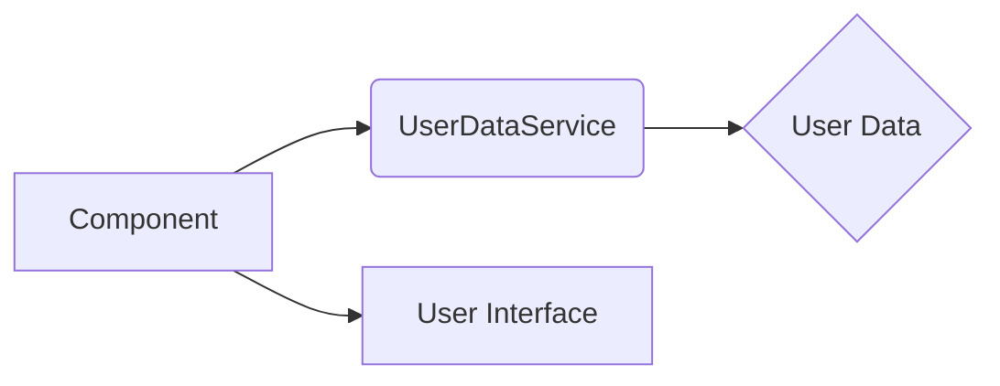
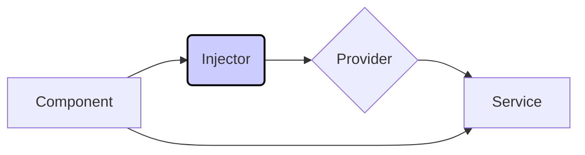
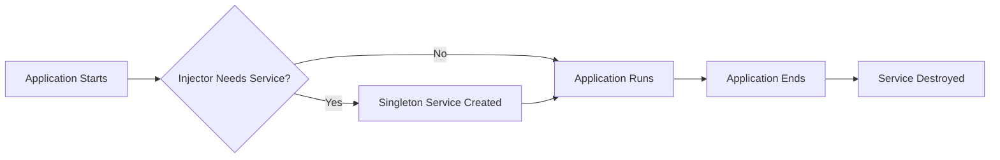

# <span style="color:#e67e22;">What we will learn in this post?</span>
<ul style='list-style-type: none; padding-left: 0;'>
<li><span style='color: #2980b9; font-size: 20px; font-weight: bold;'>👉</span> <span style='color: #2ecc71; font-size: 18px; font-weight: bold;'>Creating and Using Services</span></li>
<li><span style='color: #2980b9; font-size: 20px; font-weight: bold;'>👉</span> <span style='color: #2ecc71; font-size: 18px; font-weight: bold;'>Understanding Dependency Injection</span></li>
<li><span style='color: #2980b9; font-size: 20px; font-weight: bold;'>👉</span> <span style='color: #2ecc71; font-size: 18px; font-weight: bold;'>Singleton Services</span></li>
<li><span style='color: #2980b9; font-size: 20px; font-weight: bold;'>👉</span> <span style='color: #2ecc71; font-size: 18px; font-weight: bold;'>Conclusion!</span></li>
</ul>

# <span style="color:#e67e22">Creating and Using Angular Services 🤝</span>

Angular services are like helpful assistants that handle data and logic for your app.  They're perfect for sharing information between different parts of your application without creating messy dependencies. Think of them as reusable boxes of code!


## <span style="color:#2980b9">Creating a Simple Service ✨</span>

Let's make a service to fetch user data:

1.  **Generate the service:** Use the Angular CLI:  `ng generate service userData`
2.  **Add the logic:**  Open `user-data.service.ts` and add a function:

```typescript
import { Injectable } from '@angular/core';

@Injectable({
  providedIn: 'root'
})
export class UserDataService {
  userData = [{name: 'Alice', age: 30}, {name: 'Bob', age: 25}];

  getUserData() {
    return this.userData;
  }
}
```

This service stores user data and provides a function to get it.


## <span style="color:#2980b9">Using the Service in a Component ⚙️</span>


1.  **Import the service:** In your component's TypeScript file (`*.component.ts`):

```typescript
import { Component } from '@angular/core';
import { UserDataService } from './user-data.service'; // Path to your service

@Component({...})
export class MyComponent {
  users: any[];

  constructor(private userDataService: UserDataService) {}

  ngOnInit() {
    this.users = this.userDataService.getUserData();
  }
}
```

2.  **Access the data:**  Now you can use `this.users` in your component's template (`*.component.html`) to display the user data.


### <span style="color:#8e44ad">Data Flow Diagram</span>



This shows the component requesting data from the service, which then provides the data to update the user interface.


## <span style="color:#2980b9">Benefits of Using Services 💯</span>

*   **Reusability:** Use the service in multiple components.
*   **Organization:** Keeps your code clean and maintainable.
*   **Testability:** Easier to test individual parts of your application.


**Resources:**

*   [Angular Docs on Services](https://angular.io/guide/architecture-services)


Remember, services are your friends when building complex Angular applications! They make your code more manageable, testable, and reusable.  Enjoy coding! 🎉


# <span style="color:#e67e22">Angular Dependency Injection: Giving Your Components What They Need 💉</span>

Imagine you're baking a cake. You need ingredients (like eggs and flour) to make it.  In Angular, dependency injection is like providing those ingredients to your "cake" (components).  It's a design pattern that makes your code cleaner, more testable, and easier to maintain.

## <span style="color:#2980b9">The Core Players: Providers and the Injector</span>

* **Providers:** These are like the recipe instructions, telling Angular how to create the "ingredients" (services) your components need.  They define the *what* and *how* of creating dependencies.  You register providers at various levels (component, module, etc.).

* **Injector:** This is the kitchen itself! It's the system that manages the creation and delivery of the dependencies. When a component needs an ingredient, the injector knows where to find the recipe (provider) and provides the ready-made ingredient (service instance).

### <span style="color:#8e44ad">How it works:</span>

1.  You define a service (your ingredient):

```typescript
import { Injectable } from '@angular/core';

@Injectable({
  providedIn: 'root' //This makes it globally available
})
export class MyService {
  getData() { return 'Hello from service!'; }
}
```

2. You use it in your component (your cake recipe):

```typescript
import { Component } from '@angular/core';
import { MyService } from './my.service';

@Component({
  selector: 'app-my-component',
  template: `{{ myService.getData() }}`
})
export class MyComponent {
  constructor(private myService: MyService) {}
}
```

3. The injector sees the `MyService` dependency in the `MyComponent` constructor and uses the provider to create and inject an instance of `MyService`.


## <span style="color:#2980b9">Example:  A Simple Logger</span>

Let's say you need a logging service:

```typescript
@Injectable({ providedIn: 'root' })
export class LoggerService {
  log(message: string) { console.log(message); }
}
```

Then, in a component:

```typescript
constructor(private logger: LoggerService) {
  this.logger.log('Component initialized!');
}
```

The injector will provide an instance of `LoggerService` to your component.


## <span style="color:#2980b9">Benefits of Dependency Injection ✨</span>

* **Loose Coupling:** Components don't directly create their dependencies, making them more independent and reusable.
* **Testability:** You can easily mock dependencies during testing.
* **Maintainability:** Easier to modify and extend your application.


[Angular Docs on Dependency Injection](https://angular.io/guide/dependency-injection)




This diagram shows how the component gets its service instance through the injector and provider.


# <span style="color:#e67e22">Singleton Services in Angular 👑</span>

Singleton services in Angular are like special helpers that exist only once throughout your application's lifetime.  They're handy for managing things like global configurations, data caches, or logging.  Think of them as your app's *one and only* instance of a specific helper.


## <span style="color:#2980b9">Lifecycle & Management 🔄</span>

### <span style="color:#8e44ad">Creation and Destruction</span>

A singleton service is created when the Angular injector first needs it.  It then persists for the entire application's life.  It's *destroyed* only when the application itself is destroyed.

```typescript
// Example singleton service
@Injectable({
  providedIn: 'root' // This makes it a singleton
})
export class MySingletonService {
  // ... your service logic ...
}
```

### <span style="color:#8e44ad">Effective Management</span>

*   **Keep it simple:**  Avoid complex internal state within your singleton, as changes might have unintended side effects across your application.
*   **Use immutability:** If possible, use immutable data structures to prevent accidental modifications.  This makes debugging and prediction of behavior *much* easier.
*   **Careful injection:**  Ensure it's injected only where absolutely necessary to avoid unexpected dependencies.

## <span style="color:#2980b9">Visualizing the Lifecycle</span>



**Key Points:**

*   Singletons are convenient for centralizing access to resources.
*   Overuse can lead to tight coupling and make testing harder. 
*   Proper management is crucial for maintainable applications.


For more detailed information, please check out the official Angular documentation: [Angular Docs](https://angular.io/guide/architecture-services) (link to be replaced with the relevant documentation link).


<h1><span style='color:#e67e22'>Conclusion</span></h1>

So there you have it!  We hope you enjoyed this read and found it helpful 😊.  We're always striving to improve, and your thoughts matter!  What did you think?  Did we miss anything?  Let us know your comments, feedback, or suggestions below 👇. We'd love to hear from you and continue the conversation!  Let's chat! 💬


