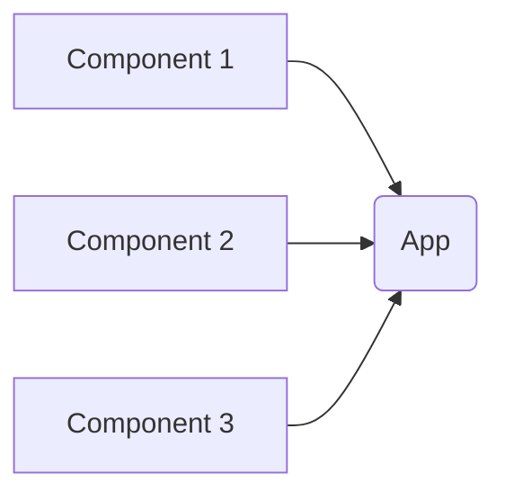
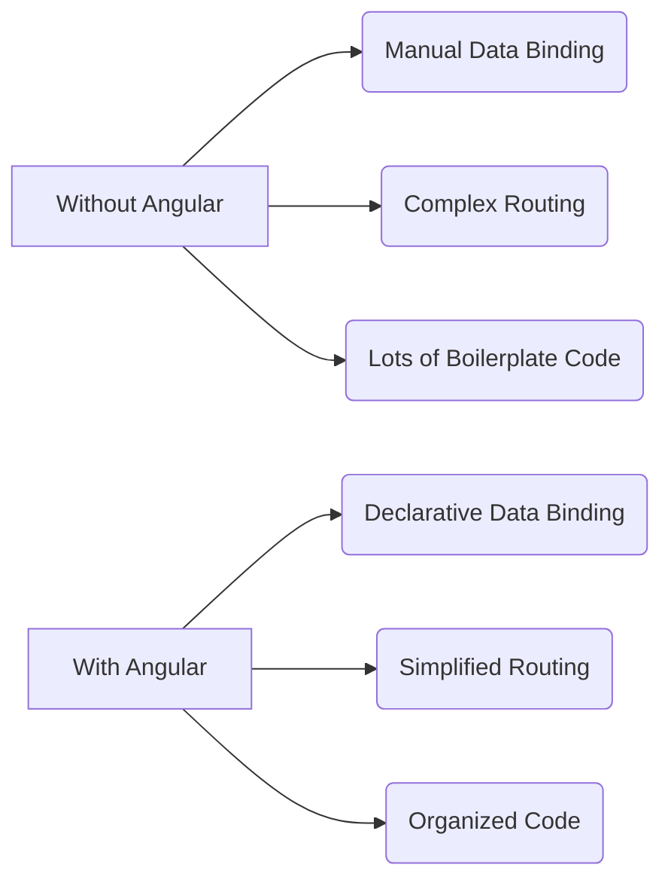
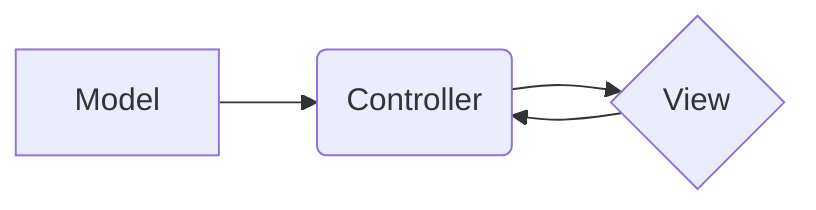

# What we will learn in this post?
<ul style='list-style-type: none; padding-left: 0;'>
<li>👉 What Exactly is Angular?</li>
<li>👉 Where is Angular Used and Why?</li>
<li>👉 Necessity of Angular</li>
<li>👉 What Happens if We Don't Use Angular?</li>
<li>👉 Laying the Groundwork for Angular</li>
<li>👉 Conclusion!</li>
</ul>

# Angular: A Friendly Guide to this Front-End Framework ✨

Angular is a powerful front-end framework for building dynamic and complex web applications.  Think of it as a toolbox filled with pre-built components that make creating websites much easier and faster. 🚀

## What Does Angular Do?

Angular's main purpose is to structure and manage the user interface (UI) of your website. It helps you build interactive elements, handle data efficiently, and create a smooth user experience.  It's like a blueprint that keeps everything organized and working together harmoniously. 🤝

### Origins and History

Developed and maintained by Google, Angular has been around for a while, evolving from AngularJS (Angular 1.x) to its current iteration (Angular 2+). This evolution brought significant improvements, including a component-based architecture that makes development more modular and maintainable.

## Angular vs. Other Frameworks

Angular stands out from other frameworks like React and Vue.js primarily due to its:

* **TypeScript:** Angular uses TypeScript, a superset of JavaScript, which adds static typing and helps catch errors early in development. This leads to more robust and maintainable code.  
* **Comprehensive Ecosystem:** Angular offers a complete solution, including routing, state management, and form handling, all built-in.  Other frameworks often require you to use third-party libraries for these features.
* **Opinionated Structure:** Angular has a more structured and opinionated approach compared to React or Vue.js, which can be a pro or con depending on your preferences. Some developers prefer this structure for larger projects.

## Significance in Modern Web Development

Angular's significance lies in its ability to build scalable and maintainable applications. Large enterprises often choose Angular for its robust features and strong community support.  It's a solid choice for complex projects that demand high performance and a structured approach.

### Key Differences Summarized

| Feature       | Angular             | React                 | Vue.js                |
|---------------|----------------------|-----------------------|-----------------------|
| Language      | TypeScript           | JavaScript (JSX)      | JavaScript             |
| Architecture  | Component-based      | Component-based      | Component-based      |
| Structure     | Opinionated           | More flexible         | Flexible              |
| Ecosystem     | Built-in, extensive | Largely third-party    | Growing, mix of both  |

[Learn more about Angular](https://angular.io/)
[Compare frameworks](https://www.freecodecamp.org/news/react-vs-angular-vs-vue-a-detailed-comparison-for-2021/)

This simple overview should help you understand the basics of Angular! Remember to explore further to discover its full potential. 👍

# Angular Use Cases: Building Amazing Web Apps 🎉

Angular is a powerful JavaScript framework perfect for building various web applications. Let's explore some common use cases:

## Single-Page Applications (SPAs) ✨

SPAs are websites that load a single HTML page and dynamically update the content as the user interacts with it.  Angular excels here because:

*   **Component-based architecture:** Makes building and maintaining complex UIs easier.
*   **Routing:**  Handles navigation within the app seamlessly.
*   **Data binding:**  Simplifies updating the UI based on data changes.

### Example: A dynamic portfolio website that updates its content without full page reloads.

## Enterprise-Level Projects 🏢

Angular's robust features make it ideal for large-scale applications:

*   **Testability:**  Built-in testing features ensure high-quality code.
*   **Scalability:**  Handles complex projects and large teams effectively.
*   **Maintainability:**  Clear structure makes future updates and maintenance easier.

### Example:  A complex CRM system with multiple modules and user roles.

## Dynamic Websites 🌐

Angular powers interactive and data-driven websites:

*   **Data fetching:**  Easily integrates with APIs to fetch and display data.
*   **Server-side rendering (SSR):**  Improves SEO and initial load times (using Angular Universal).
*   **Animations:**  Creates engaging user experiences.

### Example:  An e-commerce site with dynamic product catalogs and shopping carts.

## Why Choose Angular? 🤔

Angular's TypeScript, component-based architecture, and rich ecosystem make it a top choice for developers.  While other frameworks like React or Vue.js are viable options, Angular's structure and tooling often make it better suited for larger, more complex projects requiring strong maintainability and scalability.

[Learn More About Angular](https://angular.io/)

**Note:**  The choice of framework depends on project needs.  Consider factors like team expertise and project complexity when making your decision.

# Angular: Solving Web Development Challenges ✨

Angular is a powerful JavaScript framework that tackles many common headaches in building web applications, especially large and complex ones.  Let's explore some key benefits:

## Managing Complex UIs 🏗️

Angular's component-based architecture makes building and managing intricate user interfaces much easier.  Think of it like building with LEGOs – you create reusable components (small, independent pieces) and assemble them to build a complete app.  This improves code organization and maintainability.

### Example:  A shopping website could have separate components for the product listing, shopping cart, and checkout process.  Changes to one component won't affect others, simplifying development and debugging.

## Handling Large-Scale Projects 🌐

As projects grow, organization and collaboration become vital. Angular provides a structured environment with features like modules, routing, and dependency injection. These help manage the complexity of large codebases, ensuring efficient teamwork.

### Example: A large enterprise application might have different teams working on separate modules (like user authentication, data management, and reporting).  Angular allows them to work independently and integrate seamlessly.

## Benefits for Businesses 💼

*   **Faster Development:** Reusable components and structured code lead to quicker development cycles.
*   **Improved Maintainability:**  Easy to update, debug, and scale.
*   **Enhanced Team Collaboration:**  Clear structure promotes efficient teamwork.
*   **Better User Experience:**  Well-structured UIs lead to a more intuitive and user-friendly experience.

**Example:** Imagine building a banking application. Angular helps ensure secure transactions, maintain data integrity, and provide a smooth user experience—all crucial for a successful business.

For more information: [Angular Official Website](https://angular.io/)

 *(Simple representation of Angular's component-based architecture)*

# Building Web Apps Without a Framework: Challenges & Angular's Advantages 🛠️

Building modern web apps without a framework like Angular can be tough!  Let's look at some key challenges:

## The Framework-less Struggle 🚧

### Lack of Structure & Organization

Without a framework, your code can quickly become a tangled mess.  Imagine spaghetti code 🍝 — difficult to maintain and update.  Angular provides a structured approach with components, modules, and services, keeping everything organized.

### Inefficient Data Binding 🔄

Manually handling data updates between your HTML and JavaScript can be tedious and error-prone.  Angular's declarative data binding simplifies this process, automatically syncing changes.  This reduces development time and bugs.

### Increased Development Time & Complexity ⏱️

You'll end up writing a lot more boilerplate code to achieve features already built into Angular.  Features like routing, form handling, and state management become significantly more complex to implement without a framework.

## Angular: A Helping Hand 🙌

Angular offers several key advantages:

* **Structure:**  Components, modules, and services promote organized and maintainable code.
* **Data Binding:**  Declarative data binding simplifies updating data between HTML and JavaScript.
* **Built-in Features:**  Routing, form handling, and state management are readily available.
* **Large Community & Ecosystem:** Extensive documentation and community support mean help is always available.

## Comparison: With & Without Angular

Building a large-scale application without a framework like Angular is *significantly* more difficult and time-consuming. Angular provides a solid foundation, letting you focus on _building your application_, not _reinventing the wheel_.

**For more info:**

* [Angular Official Website](https://angular.io/)
* [Learn Angular](https://angular.io/guide/quickstart)

Remember, choosing the right tools is crucial for successful web development.  While you *can* build without a framework, it's often less efficient and more prone to issues.  Consider the project size and complexity when making your decision.

# Getting Ready for Angular: Key Concepts 🚀

Before you jump into the exciting world of Angular, let's lay a solid foundation.  Understanding these core concepts will make your learning journey smoother and more enjoyable.

## TypeScript Basics ✍️

Angular uses TypeScript, a superset of JavaScript. Think of it as JavaScript with added superpowers!  TypeScript adds *static typing*, meaning you declare the type of a variable (like `let name: string = "Alice";`). This helps catch errors *early* during development, making your code more robust.

### Key TypeScript Features
* **Types:**  `string`, `number`, `boolean`, `array`, `object`, etc.
* **Interfaces:**  Define the shape of an object.
* **Classes:**  Create reusable blueprints for objects.

[Learn more about TypeScript](https://www.typescriptlang.org/)

## Component-Based Architecture 🧱

Angular applications are built using *components*.  Each component is a self-contained unit with its own template (HTML), styles (CSS), and logic (TypeScript). Think of them as LEGO bricks—you combine them to create a complete application.

### Understanding Components
* **Reusable:** Build once, use many times.
* **Independent:** Changes in one component usually don't affect others.
* **Maintainable:** Easier to manage large applications.

## MVC (Model-View-Controller) Pattern 🔄

Angular follows the MVC pattern, separating concerns into three parts:

* **Model:**  The data of your application.
* **View:**  What the user sees (the UI).
* **Controller:**  The logic that connects the model and view.  In Angular, this is handled by components and services.

This separation keeps your code organized and easier to understand and maintain.

By grasping these fundamentals, you'll be well-prepared to tackle the intricacies of Angular development. Happy coding! 🎉

<h1>Conclusion</h1>

So there you have it!  We've covered a lot of ground today, and hopefully, you found it helpful and insightful. 😊  We're always striving to improve, so we'd love to hear your thoughts!  What did you think of this post?  Anything you'd like to see more of?  Let us know in the comments below – your feedback is invaluable! 👇  We can't wait to read what you have to say! 🤗

