# <span style="color:#e67e22;">What we will learn in this post?</span>

<ul style='list-style-type: none; padding-left: 0;'>
<li><span style='color: #2980b9; font-size: 20px; font-weight: bold;'>👉</span> <span style='color: #2ecc71; font-size: 18px; font-weight: bold;'>What Exactly is Angular?</span></li>
<li><span style='color: #2980b9; font-size: 20px; font-weight: bold;'>👉</span> <span style='color: #2ecc71; font-size: 18px; font-weight: bold;'>Where is Angular Used and Why?</span></li>
<li><span style='color: #2980b9; font-size: 20px; font-weight: bold;'>👉</span> <span style='color: #2ecc71; font-size: 18px; font-weight: bold;'>Necessity of Angular</span></li>
<li><span style='color: #2980b9; font-size: 20px; font-weight: bold;'>👉</span> <span style='color: #2ecc71; font-size: 18px; font-weight: bold;'>What Happens if We Don't Use Angular?</span></li>
<li><span style='color: #2980b9; font-size: 20px; font-weight: bold;'>👉</span> <span style='color: #2ecc71; font-size: 18px; font-weight: bold;'>Laying the Groundwork for Angular</span></li>
<li><span style='color: #2980b9; font-size: 20px; font-weight: bold;'>👉</span> <span style='color: #2ecc71; font-size: 18px; font-weight: bold;'>Conclusion!</span></li>
</ul>

# <span style="color:#e67e22">Angular: A Friendly Look at the Framework</span> 🏠

Angular is a powerful JavaScript framework for building amazing web apps. Think of it as a toolbox filled with pre-built components and tools to make your development faster and easier. It's like having a blueprint for building a house, instead of starting from scratch with each brick!

## <span style="color:#2980b9">What's Angular For? 🤔</span>

Angular helps you create _dynamic_ and _interactive_ websites and web applications. It structures your code neatly, making it easier to manage as your project grows. This is especially useful for complex projects requiring many developers working in a team.

### <span style="color:#8e44ad">Origins & Significance 🌟</span>

Developed and maintained by Google, Angular has a significant presence in the web development world. It's known for its robust structure and large, supportive community. Its component-based architecture makes code reusable and easy to test.

## <span style="color:#2980b9">How Angular Differs ✨</span>

Angular distinguishes itself from other frameworks like React or Vue.js in several key ways:

- **TypeScript:** Angular uses TypeScript, a superset of JavaScript, which adds _static typing_. This helps catch errors early and makes large projects easier to manage.
- **Opinionated Structure:** Angular has a more structured approach, enforcing a specific way to build apps. This can be beneficial for larger teams but might feel restrictive for smaller projects.
- **Two-way Data Binding:** Changes in the UI automatically update the data, and vice-versa. This streamlines development compared to frameworks relying on one-way data binding.

```mermaid
graph LR
    classDef startEndStyle fill:#FFCDD2,stroke:#E53935,color:#000000,font-size:14px,stroke-width:2px,rx:10px,shadow:5px;
    classDef processStyle fill:#BBDEFB,stroke:#1E88E5,color:#000000,font-size:14px,stroke-width:2px,rx:10px,shadow:5px;
    classDef decisionStyle fill:#C8E6C9,stroke:#43A047,color:#000000,font-size:14px,stroke-width:2px,rx:10px,shadow:5px;
    classDef renderStyle fill:#D1C4E9,stroke:#673AB7,color:#000000,font-size:14px,stroke-width:2px,rx:10px,shadow:5px;

    A[👨‍💻 Developer writes code] --> B{🛠️ Angular Compiler};
    B --> C[✨ Optimized JavaScript];
    C --> D[🌐 Browser renders app];

    class A startEndStyle;
    class B decisionStyle;
    class C processStyle;
    class D renderStyle;

```

## <span style="color:#2980b9">Simplified Angular Workflow 🛠️</span>



This simple diagram shows the basic workflow: You write code, Angular compiles it into efficient JavaScript, and the browser displays your app.

**For more info:** [Angular Official Website](https://angular.io/)

This overview should give you a good starting point for understanding Angular. Remember, there's a vast amount of learning resources available online! Happy coding! 🎉

# <span style="color:#e67e22">Angular: Building Amazing Web Apps 🚀</span>

Angular, a powerful JavaScript framework, is a go-to choice for many web development projects. Let's explore its common uses!

## <span style="color:#2980b9">Single-Page Applications (SPAs) ✨</span>

SPAs load a single HTML page and dynamically update the content as users interact. Angular excels here because of its component-based architecture. Each component manages a piece of the UI, making development and maintenance easier. Think of a dynamic website showing user profiles, products, or news feeds—Angular handles all the updates smoothly.

### <span style="color:#8e44ad">Why choose Angular for SPAs?</span>

- **Clean Structure:** Easy to understand and maintain.
- **Efficient Updates:** Only necessary parts of the page are updated, resulting in a snappy user experience.
- **Routing & Navigation:** Angular's built-in router makes navigating between different sections a breeze.

## <span style="color:#2980b9">Enterprise-Level Projects 🏢</span>

Large-scale applications with complex requirements often benefit from Angular's features:

### <span style="color:#8e44ad">Why choose Angular for Enterprise?</span>

- **Testability:** Angular's architecture makes testing easy, crucial for enterprise applications that demand reliability.
- **Scalability:** Large teams can work effectively on modular components, building out huge apps.
- **TypeScript:** TypeScript adds strong typing to JavaScript, preventing many common errors. This increases maintainability, and helps make debugging easier.

## <span style="color:#2980b9">Dynamic Websites 🌐</span>

Any website requiring frequent content updates or interactive elements is a good fit for Angular.

### <span style="color:#8e44ad">Why choose Angular for Dynamic Websites?</span>

- **Data Binding:** Easily connect your website to databases to display and update information.
- **Reusable Components:** Create components once and reuse them throughout the application, saving time and effort.

**Example of a simple Angular component:**

```typescript
@Component({
  selector: "app-my-component",
  template: `<h1>Hello, {{ name }}!</h1>`,
})
export class MyComponent {
  name = "World"
}
```

**For more info:**

- [Angular Official Website](https://angular.io/)

Remember, the best framework depends on the specific project requirements. But for many complex and large-scale applications, Angular's structure and features make it a compelling choice.

# <span style="color:#e67e22">Angular: Tackling Web Development Challenges 💪</span>

Angular is a powerful JavaScript framework that simplifies building complex web applications. It addresses several key problems developers face:

## <span style="color:#2980b9">Managing Complex UIs 🎨</span>

Building intricate user interfaces can be a nightmare without a structured approach. Angular's _component-based architecture_ breaks down the UI into reusable pieces, making it easier to manage and maintain. Think of it like building with LEGOs – small, manageable parts that combine to create something amazing.

### <span style="color:#8e44ad">Example:</span>

Imagine an e-commerce website. Instead of one giant, unwieldy HTML file, you have separate components for the product list, shopping cart, and user profile. Changes to one component don't affect others.

## <span style="color:#2980b9">Scaling for Large Projects 🏗️</span>

As applications grow, organization becomes crucial. Angular's features like _dependency injection_ and _modules_ ensure that code remains well-structured and manageable, even in large teams. This prevents spaghetti code and makes collaboration smoother.

## <span style="color:#2980b9">Benefits for Businesses 💼</span>

- **Faster Development:** Angular's reusable components and features speed up development time, leading to quicker time-to-market.
- **Improved Maintainability:** Well-structured code is easier and cheaper to maintain in the long run.
- **Enhanced Scalability:** Angular handles growth gracefully, allowing businesses to easily add features and scale their applications.

### <span style="color:#8e44ad">Example:</span> A large financial institution might use Angular to build a secure and scalable online banking platform

For more information:

- [Angular Official Website](https://angular.io/)

**Simplified Development Process:**

```mermaid
graph LR
    classDef ideaStyle fill:#FFF9C4,stroke:#FBC02D,color:#000000,font-size:14px,stroke-width:2px,rx:10px,shadow:5px;
    classDef componentStyle fill:#C8E6C9,stroke:#43A047,color:#000000,font-size:14px,stroke-width:2px,rx:10px,shadow:5px;
    classDef reusableStyle fill:#BBDEFB,stroke:#1E88E5,color:#000000,font-size:14px,stroke-width:2px,rx:10px,shadow:5px;
    classDef efficientStyle fill:#D1C4E9,stroke:#673AB7,color:#000000,font-size:14px,stroke-width:2px,rx:10px,shadow:5px;
    classDef marketStyle fill:#FFCDD2,stroke:#E53935,color:#000000,font-size:14px,stroke-width:2px,rx:10px,shadow:5px;

    A[💡 Idea] --> B{🛠️ Angular Components};
    B --> C[🔄 Reusable Code];
    C --> D[⚡ Efficient Development];
    D --> E[⏩ Faster Time-to-Market];

    class A ideaStyle;
    class B componentStyle;
    class C reusableStyle;
    class D efficientStyle;
    class E marketStyle;

```



# <span style="color:#e67e22">Building Web Apps Without a Framework: A Developer's Dilemma 🤔</span>

Building modern web applications without a framework like Angular presents several challenges. Let's explore some key issues:

## <span style="color:#2980b9">The Messy Reality 🧹</span>

### <span style="color:#8e44ad">Lack of Structure and Organization</span>

Without a framework's predefined structure, your codebase can quickly become a tangled mess. Imagine building a house without a blueprint! You'll end up with inconsistent coding styles, duplicated code, and difficulty maintaining your project as it grows.

- **Challenge:** Difficult to manage large projects, leading to increased bugs and slower development.
- **Solution:** Frameworks provide a clear architecture and best practices to avoid this.

### <span style="color:#8e44ad">Inefficient Data Binding 🔄</span>

Manually managing data updates in the DOM (Document Object Model) is incredibly tedious and error-prone. Updating even a simple piece of data might require multiple lines of code, increasing the likelihood of bugs.

- **Challenge:** Slows down development and increases maintenance overhead. Requires more code to achieve the same functionality.
- **Solution:** Angular's data binding simplifies this process significantly.

### <span style="color:#8e44ad">Increased Development Time ⏱️</span>

Re-inventing the wheel is time-consuming! Frameworks provide pre-built components and tools, saving developers significant time and effort. Without them, you'll be spending more time on repetitive tasks.

## <span style="color:#2980b9">Angular's Advantages 🌟</span>

Angular offers a structured approach, efficient data binding (using techniques like `[(ngModel)]`), and pre-built components, reducing development time and increasing code maintainability.

- **Structured Code:** Angular uses TypeScript and components, making your code organized and readable.
- **Two-way Data Binding:** Changes in the model automatically update the view, and vice-versa. This is much simpler than manual DOM manipulation.
- **Pre-built Components:** Angular Material provides a wide range of ready-to-use components, boosting development speed.

For more information on Angular: [Angular Official Documentation](https://angular.io/docs)

# <span style="color:#e67e22">Getting Ready for Angular: Key Concepts</span> 🚀

Before you jump into building amazing web apps with Angular, let's get familiar with some fundamental concepts. Think of it as laying a solid foundation for your Angular journey!

## <span style="color:#2980b9">TypeScript Essentials ✍️</span>

Angular uses TypeScript, a supercharged version of JavaScript. Think of it as JavaScript with added superpowers! It helps you write cleaner, more organized code.

### <span style="color:#8e44ad">Key TypeScript Features</span>

- **Types:** You explicitly define the type of data (like `number`, `string`, `boolean`), making your code easier to understand and debug.
- **Interfaces:** They define the structure of objects, promoting consistency.
- **Classes:** They help you create reusable blueprints for objects.

[Learn more about TypeScript](https://www.typescriptlang.org/)

## <span style="color:#2980b9">Component-Based Architecture 🧱</span>

Angular apps are built using _components_. Imagine them as Lego bricks – small, self-contained units that you assemble to create a larger application. Each component has its own:

- **Template:** The HTML that defines what the user sees.
- **Logic:** The TypeScript code that handles data and user interactions.
- **Styles:** The CSS that styles the component.

### <span style="color:#8e44ad">Component Interaction</span>

Components often communicate with each other, sharing data and triggering actions. This is usually done via _input_ and _output_ properties and services.

## <span style="color:#2980b9">MVC Pattern 🔄</span>

Angular follows the Model-View-Controller (MVC) pattern, a common architectural pattern for separating concerns in an application:

- **Model:** The data of your application.
- **View:** What the user sees (the UI).
- **Controller:** Handles user interactions and updates the model and view.

```mermaid
graph LR
    classDef modelStyle fill:#C5CAE9,stroke:#3F51B5,color:#000000,font-size:14px,stroke-width:2px,rx:10px,shadow:5px;
    classDef controllerStyle fill:#FFCCBC,stroke:#FF5722,color:#000000,font-size:14px,stroke-width:2px,rx:10px,shadow:5px;
    classDef viewStyle fill:#B2DFDB,stroke:#00796B,color:#000000,font-size:14px,stroke-width:2px,rx:10px,shadow:5px;

    A[📊 Model] --> B[🛠️ Controller];
    B --> C{🔍 View};
    C --> B;

    class A modelStyle;
    class B controllerStyle;
    class C viewStyle;

```



This separation makes your code easier to maintain and test.

Remember, mastering these fundamentals will greatly improve your Angular development experience. Happy coding! 😄

<h1><span style='color:#e67e22'>Conclusion</span></h1>

So there you have it! We hope you enjoyed this post and found it helpful 😊. We're always looking to improve, so we'd love to hear your thoughts! What did you think? Anything you'd like to see more of? Let us know in the comments below 👇. Your feedback is super valuable to us! Let's keep the conversation going! 🎉
