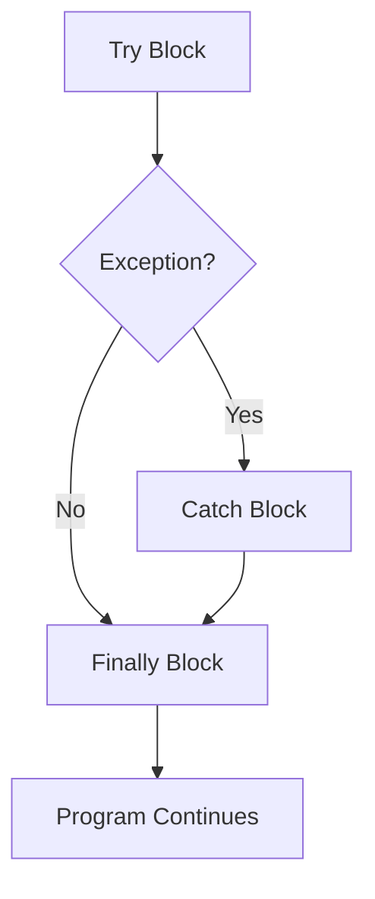
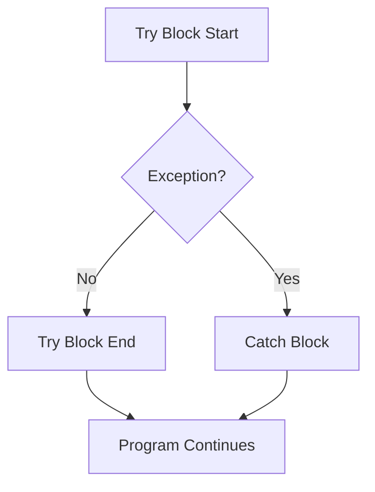
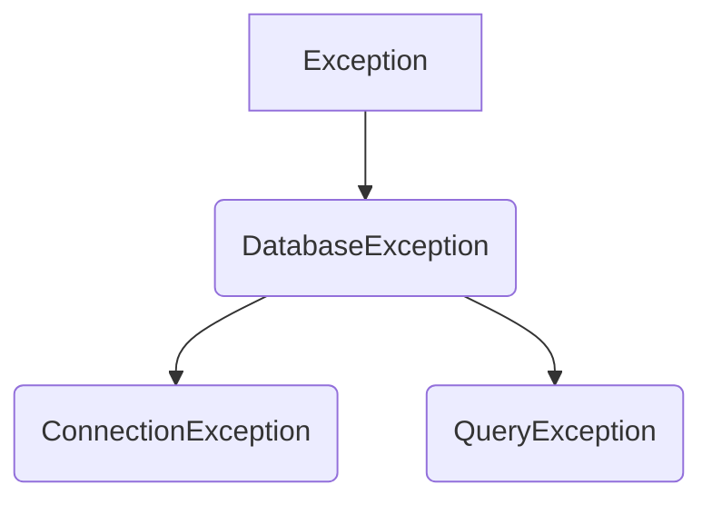
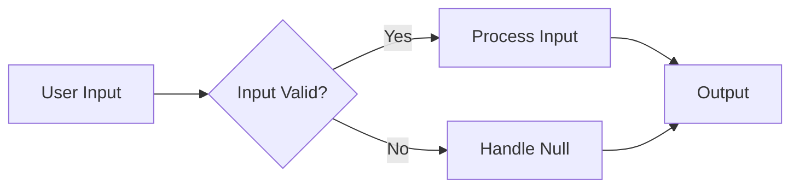

# <span style="color:#e67e22;">What we will learn in this post?</span>
<ul style='list-style-type: none; padding-left: 0;'>
<li><span style='color: #2980b9; font-size: 20px; font-weight: bold;'>👉</span> <span style='color: #2ecc71; font-size: 18px; font-weight: bold;'>Exceptions in Java</span></li>
<li><span style='color: #2980b9; font-size: 20px; font-weight: bold;'>👉</span> <span style='color: #2ecc71; font-size: 18px; font-weight: bold;'>Types of Exceptions</span></li>
<li><span style='color: #2980b9; font-size: 20px; font-weight: bold;'>👉</span> <span style='color: #2ecc71; font-size: 18px; font-weight: bold;'>Checked vs Unchecked Exceptions</span></li>
<li><span style='color: #2980b9; font-size: 20px; font-weight: bold;'>👉</span> <span style='color: #2ecc71; font-size: 18px; font-weight: bold;'>Try, Catch, Finally, throw, and throws</span></li>
<li><span style='color: #2980b9; font-size: 20px; font-weight: bold;'>👉</span> <span style='color: #2ecc71; font-size: 18px; font-weight: bold;'>Flow Control in Try-Catch Block</span></li>
<li><span style='color: #2980b9; font-size: 20px; font-weight: bold;'>👉</span> <span style='color: #2ecc71; font-size: 18px; font-weight: bold;'>Throw vs Throws</span></li>
<li><span style='color: #2980b9; font-size: 20px; font-weight: bold;'>👉</span> <span style='color: #2ecc71; font-size: 18px; font-weight: bold;'>Final vs Finally vs Finalize</span></li>
<li><span style='color: #2980b9; font-size: 20px; font-weight: bold;'>👉</span> <span style='color: #2ecc71; font-size: 18px; font-weight: bold;'>User-defined Custom Exception</span></li>
<li><span style='color: #2980b9; font-size: 20px; font-weight: bold;'>👉</span> <span style='color: #2ecc71; font-size: 18px; font-weight: bold;'>Chained Exceptions</span></li>
<li><span style='color: #2980b9; font-size: 20px; font-weight: bold;'>👉</span> <span style='color: #2ecc71; font-size: 18px; font-weight: bold;'>Null Pointer Exceptions</span></li>
<li><span style='color: #2980b9; font-size: 20px; font-weight: bold;'>👉</span> <span style='color: #2ecc71; font-size: 18px; font-weight: bold;'>Exception Handling with Method Overriding</span></li>
<li><span style='color: #2980b9; font-size: 20px; font-weight: bold;'>👉</span> <span style='color: #2ecc71; font-size: 18px; font-weight: bold;'>Conclusion!</span></li>
</ul>

# <span style="color:#e67e22">Java Exceptions: Graceful Error Handling 🤝</span>

In Java, exceptions are events that disrupt the normal flow of a program.  They occur when something unexpected happens, like trying to divide by zero or accessing a file that doesn't exist.  Instead of crashing, Java allows you to *handle* these exceptions gracefully.  This makes your programs more robust and less prone to unexpected failures.


## <span style="color:#2980b9">The Role of Exceptions</span>

Exceptions help you:

*   **Prevent crashes:** Instead of the program abruptly stopping, exceptions provide a structured way to deal with errors.
*   **Improve code readability:** Separating error handling from the main logic makes your code cleaner and easier to understand.
*   **Handle specific problems:**  Different types of exceptions (like `ArithmeticException`, `FileNotFoundException`) let you address specific issues appropriately.


### <span style="color:#8e44ad">Exception Handling Structure</span>

The basic structure uses `try`, `catch`, and optionally `finally` blocks:

```java
try {
  // Code that might throw an exception
  int result = 10 / 0; //This will throw an ArithmeticException
} catch (ArithmeticException e) {
  // Handle the ArithmeticException
  System.out.println("Cannot divide by zero!");
} finally {
  // Code that always executes (e.g., closing resources)
  System.out.println("This always runs.");
}
```

[More information on Exception Handling](https://docs.oracle.com/javase/tutorial/essential/exceptions/)


## <span style="color:#2980b9">Exception Handling Flowchart</span>

```mermaid
graph TD
    A[Try Block] --> B{Exception?};
    B -- Yes --> C[Catch Block];
    B -- No --> D[End of Try Block];
    C --> E[Handle Exception];
    E --> D;
    D --> F[Finally Block (Optional)];
    F --> G[Program Continues];
```

**Key Points:**

*   The `try` block contains the code that might throw an exception.
*   The `catch` block handles specific exceptions.  You can have multiple `catch` blocks for different exception types.
*   The `finally` block (optional) contains code that always executes, regardless of whether an exception occurred.  It's often used for cleanup tasks (e.g., closing files or network connections).


Remember, using exceptions effectively makes your Java code more robust and reliable! 💻✨


# <span style="color:#e67e22">Java Exceptions: A Friendly Guide 🤝</span>

Java exceptions signal that something went wrong during program execution.  They're categorized into three main types:

## <span style="color:#2980b9">Checked Exceptions ⚠️</span>

These exceptions must be handled (using `try-catch` blocks) by the programmer.  If not, the compiler will flag an error.  They usually represent situations you can reasonably anticipate and handle.

### <span style="color:#8e44ad">Example: `IOException`</span>

This exception occurs during input/output operations (like reading a file).

```java
try {
    FileReader file = new FileReader("myfile.txt"); 
} catch (IOException e) {
    System.out.println("File error: " + e.getMessage());
}
```

## <span style="color:#2980b9">Unchecked Exceptions (Runtime Exceptions) 💥</span>

These exceptions are not checked by the compiler.  They typically indicate programming errors (like trying to access an array element out of bounds).

### <span style="color:#8e44ad">Example: `NullPointerException`, `ArrayIndexOutOfBoundsException`</span>

*   `NullPointerException`: Occurs when you try to use a variable that hasn't been assigned a value (is `null`).
*   `ArrayIndexOutOfBoundsException`: Happens when you try to access an array element using an invalid index.


```java
int[] numbers = {1, 2, 3};
System.out.println(numbers[3]); // Throws ArrayIndexOutOfBoundsException
```


## <span style="color:#2980b9">Errors 🚨</span>

These represent serious problems that usually indicate a bigger issue within the Java Virtual Machine (JVM) itself.  You typically can't (or shouldn't) try to handle these.

### <span style="color:#8e44ad">Example: `OutOfMemoryError`, `StackOverflowError`</span>

*   `OutOfMemoryError`:  The JVM runs out of memory.
*   `StackOverflowError`:  The call stack overflows (usually due to excessive recursion).


**Key Differences Summarized:**

| Exception Type | Checked? | Handling | Example |
|---|---|---|---|
| Checked | Yes | Required | `IOException` |
| Unchecked | No | Optional | `NullPointerException`, `ArrayIndexOutOfBoundsException` |
| Error | No | Usually not handled | `OutOfMemoryError`, `StackOverflowError` |


For more in-depth information, explore the official [Oracle Java documentation](https://docs.oracle.com/javase/tutorial/essential/exceptions/).  Understanding exception handling is *crucial* for writing robust and reliable Java applications! 


# <span style="color:#e67e22">Checked vs. Unchecked Exceptions in Java 🧐</span>

Java uses exceptions to handle errors during program execution.  Two main types exist: checked and unchecked. Let's explore their differences!

## <span style="color:#2980b9">Checked Exceptions ⚠️</span>

*   **Definition:** These are exceptions that the compiler *forces* you to handle.  They typically represent problems that can reasonably be anticipated and recovered from (e.g., `IOException`, `SQLException`).
*   **Handling:** You *must* either catch them using a `try-catch` block or declare them using the `throws` keyword in your method signature.  This ensures the programmer addresses potential issues.
*   **Impact:**  If a checked exception is not handled, the program will not compile.

### <span style="color:#8e44ad">Example</span>

```java
try {
  // Code that might throw IOException
} catch (IOException e) {
  // Handle the exception
}
```


## <span style="color:#2980b9">Unchecked Exceptions 💥</span>

*   **Definition:**  These exceptions are *not* checked at compile time. They usually represent programming errors (e.g., `NullPointerException`, `ArrayIndexOutOfBoundsException`, `ArithmeticException`).
*   **Handling:** You are *not* required to handle them explicitly.  However, it's good practice to address potential unchecked exceptions to improve robustness.
*   **Impact:** If an unchecked exception occurs, it can cause your program to crash.


### <span style="color:#8e44ad">Example</span>

```java
int result = 10 / 0; // This will throw an ArithmeticException
```

## <span style="color:#2980b9">Key Differences Summarized 📝</span>

| Feature        | Checked Exceptions | Unchecked Exceptions |
|----------------|---------------------|-----------------------|
| Compile-time   | Checked             | Not Checked           |
| Handling       | Mandatory           | Optional              |
| Typical Causes | External factors   | Programming errors     |


**For more info:**

*   [Oracle Java Tutorials on Exceptions](https://docs.oracle.com/javase/tutorial/essential/exceptions/)


Remember, proper exception handling is crucial for creating robust and reliable Java applications!  Good luck! 👍


# <span style="color:#e67e22">Java's Try-Catch-Finally: Exception Handling Made Easy 🤝</span>

Java's `try-catch-finally` construct is your best friend when dealing with potential errors (exceptions) in your code. Think of it as a safety net! ✨

## <span style="color:#2980b9">The Players: Try, Catch, and Finally</span>

*   **`try`**: This block contains the code that *might* throw an exception.  It's like saying, "Let's try this, but be prepared for things to go wrong."
*   **`catch`**:  If an exception *does* occur within the `try` block, the matching `catch` block springs into action. It handles the exception—perhaps by displaying an error message or attempting recovery. You can have multiple `catch` blocks to handle different types of exceptions.
*   **`finally`**: This block always executes, regardless of whether an exception occurred or not.  It's perfect for cleanup tasks like closing files or releasing resources.  Think of it as saying, "No matter what happens, do this!"


### <span style="color:#8e44ad">Example</span>

```java
try {
    int result = 10 / 0; // This will throw an ArithmeticException
} catch (ArithmeticException e) {
    System.out.println("Error: Cannot divide by zero!");
} finally {
    System.out.println("This always runs!");
}
```

## <span style="color:#2980b9">Exception Propagation: `throw` and `throws`</span>

*   **`throw`**: You use the `throw` keyword to *manually* throw an exception.  This is useful when you detect a problem and want to signal it to other parts of your program.

*   **`throws`**: The `throws` keyword is used in a method's signature to declare that the method *might* throw certain exceptions. This gives callers a heads-up, so they can prepare to handle those potential exceptions using their own `try-catch` blocks.


## <span style="color:#2980b9">Flowchart</span>




**Resources:**

*   [Oracle Java Tutorials on Exception Handling](https://docs.oracle.com/javase/tutorial/essential/exceptions/)


Remember, proper exception handling makes your code more robust and easier to debug!  Happy coding! 🎉


# <span style="color:#e67e22">Java's Try-Catch Block:  A Friendly Guide 🤝</span>

The `try-catch` block in Java is like a safety net for your code.  It helps you handle errors gracefully, preventing your program from crashing. Let's see how it works:

## <span style="color:#2980b9">The Flow of Execution ➡️</span>

Imagine your code as a road trip. The `try` block is the main highway.  If everything goes smoothly, you reach your destination (the end of the `try` block) without issues. However, if you hit a pothole (an *exception*), you'll be diverted.

### <span style="color:#8e44ad">Scenario 1: No Exceptions 🎉</span>

*   The code inside the `try` block executes without any errors.
*   The `catch` block is skipped entirely.
*   Execution continues after the `try-catch` block.

```java
try {
  int result = 10 / 2; // No exception here
  System.out.println(result); 
} catch (ArithmeticException e) {
  System.out.println("Error!"); // This won't run
}
```


### <span style="color:#8e44ad">Scenario 2: Exception Occurs 💥</span>


*   An exception occurs within the `try` block (e.g., dividing by zero).
*   The program immediately jumps to the relevant `catch` block.  (The type of exception needs to match the `catch` block declaration)
*   The code within the `catch` block is executed (handling the error).
*   Execution continues after the `try-catch` block.


```java
try {
  int result = 10 / 0; // ArithmeticException!
  System.out.println(result); 
} catch (ArithmeticException e) {
  System.out.println("Cannot divide by zero!"); // This will run
}
```

## <span style="color:#2980b9">Visualizing the Flow 📊</span>



**Key takeaway:** The `try-catch` mechanism ensures that even if errors occur, your program doesn't abruptly terminate.  It provides a structured way to handle exceptions and maintain program stability.


For more in-depth information on exception handling in Java, you can refer to the official Oracle Java tutorials: [https://docs.oracle.com/javase/tutorial/essential/exceptions/](https://docs.oracle.com/javase/tutorial/essential/exceptions/)


# <span style="color:#e67e22">Java's `throw` vs. `throws` keywords 💥</span>

Let's explore the difference between `throw` and `throws` in Java exception handling. They might seem similar, but they have distinct roles.


## <span style="color:#2980b9">Understanding `throw` 🎯</span>

The `throw` keyword is used to *explicitly* throw an exception from within a method.  You create an exception object and then "throw" it.

```java
public void myMethod() {
  if (someCondition) {
    throw new IllegalArgumentException("Invalid input!"); 
  }
  // ... rest of the code ...
}
```

### <span style="color:#8e44ad">Key Points about `throw`</span>

*   It's used *inside* a method's body.
*   It immediately stops the current method's execution.
*   It's used to signal that an exceptional situation has occurred.


## <span style="color:#2980b9">Understanding `throws` 📣</span>

The `throws` keyword is used in a method's *signature*. It declares that a method *might* throw one or more checked exceptions.  It *doesn't* actually throw the exception; it just *announces* that the possibility exists.

```java
public void anotherMethod() throws IOException {
  // ... code that might throw an IOException ...
}
```

### <span style="color:#8e44ad">Key Points about `throws`</span>

*   It's part of the method's declaration.
*   It forces the calling method to handle (using `try-catch`) or propagate (using `throws`) the declared exception.
*   It's used for *checked exceptions*—exceptions that the compiler forces you to handle.


## <span style="color:#2980b9">Key Differences Summarized 🤔</span>

| Feature        | `throw`                               | `throws`                              |
|----------------|---------------------------------------|----------------------------------------|
| **Purpose**    | Explicitly throw an exception         | Declare potential exceptions            |
| **Placement**  | Inside method body                     | In method signature                   |
| **Action**     | Immediately throws exception         | Declares a potential exception         |
| **Exception Type** | Any exception (checked or unchecked) | Primarily checked exceptions           |


For more information, check out the official [Oracle Java Tutorials on Exception Handling](https://docs.oracle.com/javase/tutorial/essential/exceptions/).

Remember, using `throws` responsibly improves code readability and maintainability by clearly indicating potential error conditions.  `throw` gives you precise control over when and what exception gets triggered.  Using both correctly is key to robust Java programs!


# <span style="color:#e67e22">Java's Final, Finally, and Finalize: A Friendly Guide</span> 

Java's `final`, `finally`, and `finalize` keywords, while phonetically similar, have distinct roles.  Let's explore!

## <span style="color:#2980b9">Final:  The Unchangeable</span> 

`final` is used to declare constants.  Think of it as a "set in stone" keyword.

### <span style="color:#8e44ad">Uses of `final`</span>

*   **Variables:**  `final int x = 10;`  Once assigned, `x` can't be changed.
*   **Methods:** `final void myMethod(){} ` Prevents overriding in subclasses.
*   **Classes:** `final class MyClass{}` Prevents subclassing.

## <span style="color:#2980b9">Finally: The Cleanup Crew</span> 🧹

`finally` is part of exception handling. It guarantees code execution, regardless of whether an exception occurs.

### <span style="color:#8e44ad">The `finally` Block</span>

```java
try {
    // Code that might throw an exception
} catch (Exception e) {
    // Handle the exception
} finally {
    // This code ALWAYS runs – ideal for closing resources!
    System.out.println("Cleaning up!");
}
```

This ensures resources (files, network connections) are closed, preventing leaks.


## <span style="color:#2980b9">Finalize: The Object's Last Breath</span> 👻

`finalize()` is a *method* called by the garbage collector *before* an object is destroyed.  It's for cleanup, but rarely needed (and can be unpredictable).  Prefer using `try-with-resources` or explicit resource closing in `finally` blocks for more reliable resource management.

### <span style="color:#8e44ad">When to Avoid `finalize()`</span>

*It's generally discouraged.*  Relying on `finalize()` for critical cleanup can lead to performance issues and unpredictable behavior.


### <span style="color:#8e44ad">Resource Management Best Practices</span>

*   Use `try-with-resources` for automatic resource closing.
*   Always close resources explicitly in `finally` blocks.
*   Avoid `finalize()` unless absolutely necessary.


[More on Exception Handling](https://docs.oracle.com/javase/tutorial/essential/exceptions/)

[More on Garbage Collection](https://docs.oracle.com/javase/tutorial/essential/exceptions/)


# <span style="color:#e67e22">Crafting Custom Exceptions in Java ✨</span>

Java's built-in exceptions are great, but sometimes you need *more specific* error messages for your own code. That's where custom exceptions shine!  They let you create exceptions tailored to your application's logic.

## <span style="color:#2980b9">Building Your Own Exception 💪</span>

Creating a custom exception is surprisingly simple.  Just extend the `Exception` class (or one of its subclasses like `RuntimeException`):

```java
public class MyCustomException extends Exception {
    public MyCustomException(String message) {
        super(message);
    }
}
```

This creates `MyCustomException`, which you can throw whenever a specific error occurs in your code.  For example:

```java
if (value < 0) {
    throw new MyCustomException("Value cannot be negative!");
}
```

### <span style="color:#8e44ad">When to Use Custom Exceptions 🤔</span>

*   **Improved Error Reporting:**  Instead of generic `Exception` messages, custom exceptions provide context-specific details.
*   **Enhanced Code Readability:**  Clearer error handling makes your code easier to understand and maintain.
*   **Better Debugging:**  Knowing *exactly* what went wrong simplifies the debugging process.

## <span style="color:#2980b9">Exception Hierarchy 🗂️</span>

You can create a hierarchy of custom exceptions to categorize different error types.  For instance, you might have `DatabaseException` extending `Exception`, and then `ConnectionException` and `QueryException` extending `DatabaseException`.



## <span style="color:#2980b9">Example Scenario 💡</span>

Imagine a program processing user input. If the input is invalid, throwing a `InvalidInputException` is far more informative than a generic `Exception`.


**Remember**:  Use `RuntimeException` for *unchecked* exceptions (ones you don't *have* to catch), and `Exception` for *checked* exceptions (ones you *must* handle).


For more information on Exception handling in Java, check out [Oracle's Java Tutorial](https://docs.oracle.com/javase/tutorial/essential/exceptions/).  Happy coding! 🎉


# <span style="color:#e67e22">Chained Exceptions in Java 🔗</span>

Imagine you're building with LEGOs 🧱 and one brick breaks, causing a cascade of collapses.  Chained exceptions in Java are similar! They link related exceptions together, providing a clearer picture of what went wrong.  Instead of just seeing the *final* error, you get the *whole story*.

## <span style="color:#2980b9">What are Chained Exceptions?</span>

When one exception happens *because* of another, you can "chain" them.  This means the new exception holds a reference to the original one.  This makes debugging so much easier!

### <span style="color:#8e44ad">How it Works</span>

You create a chained exception using the `Throwable` constructor that accepts a `cause` argument:

```java
try {
    // Some code that might throw an exception
} catch (IOException e) {
    throw new MyCustomException("Something went wrong!", e); //e is the cause
}
```

Here, `MyCustomException` is the new exception, and `e` (the original `IOException`) is its cause.

## <span style="color:#2980b9">Why are they Significant?</span>

*   **Improved Debugging:**  You get the complete error history, not just the last error.  Tracing the chain reveals the root cause.
*   **Better Error Handling:** You can handle exceptions at different levels, addressing the underlying problem first and then the consequences.
*   **More Informative Error Messages:**  The chained exceptions give context to the error, helping you quickly understand the situation.

## <span style="color:#2980b9">Example using Mermaid</span>

```mermaid
graph TD
    A[Initial Exception (IOException)] --> B(MyCustomException);
    B --> C[Error Handling];
    style A fill:#f9f,stroke:#333,stroke-width:2px
    style B fill:#ccf,stroke:#333,stroke-width:2px
    style C fill:#fcf,stroke:#333,stroke-width:2px
```

This diagram shows how an `IOException` causes `MyCustomException`, leading to error handling.


## <span style="color:#2980b9">Resources for Further Learning</span>

*   [Oracle Java Docs on Throwable](https://docs.oracle.com/javase/7/docs/api/java/lang/Throwable.html)  Provides detailed information about the `Throwable` class and its methods.


By using chained exceptions, you build more robust and easier-to-debug Java applications!  They're a crucial part of effective error handling. 🎉


# <span style="color:#e67e22">Null Pointer Exceptions 🚫 in Java</span>

NullPointerExceptions (NPEs) are a common headache in Java.  They occur when your program tries to use a variable that's currently holding nothing — a *null* value.  Think of it like trying to open a door that doesn't exist!


## <span style="color:#2980b9">Causes of NPEs</span>

### <span style="color:#8e44ad">Uninitialised Variables</span>

*   Declaring a variable without assigning it a value leaves it *null*.  Using it before assigning a valid object will throw an NPE.  For example:
    ```java
    String name; // name is null
    System.out.println(name.length()); // NPE!
    ```

### <span style="color:#8e44ad">Method Return Values</span>

*   Methods sometimes return *null* to indicate they couldn't find something.  Failing to check for *null* before using the return value is a common mistake.

### <span style="color:#8e44ad">External Data</span>

*   Data from databases, files, or user input might be missing, resulting in *null* values.

## <span style="color:#2980b9">Avoiding NPEs ✨</span>

*   **Initialization:** Always initialize variables before using them.
*   **Null Checks:**  Use `if (object != null)` statements before accessing object members (e.g., `object.method()`).  The Elvis operator (`?:`) can also help: `String name = myObject?.getName() ?: "Default Name";`
*   **Defensive Programming:**  Assume external data might be *null*.  Validate and sanitize input.
*   **Optional Types (Java 8+):** Use `Optional<T>` to represent values that may or may not be present.  This encourages explicit handling of *null* values.  


## <span style="color:#2980b9">Example Scenario 🕵️‍♀️</span>



This flowchart shows a basic null check. If the input is invalid (null), it gracefully handles the situation instead of crashing.


For more information:

* [Oracle's Java Tutorials on NullPointerException](https://docs.oracle.com/javase/tutorial/essential/exceptions/handling.html)


By being mindful of *null* values and employing these strategies, you can significantly reduce the number of NPEs in your code and build more robust applications.


# <span style="color:#e67e22">Exception Handling & Method Overriding 🎉</span>

Java's exception handling interacts interestingly with method overriding.  Let's explore!

## <span style="color:#2980b9">The Basic Rule ⚖️</span>

An overridden method can only throw exceptions that are either:

*   **Subtypes** of the exceptions thrown by the superclass method.  Think of it like this: If the parent can throw a `GeneralException`, the child can throw a `SpecificException` (which is a type of `GeneralException`), but not a completely unrelated `DifferentException`.
*   **No exceptions at all**. The child method can choose *not* to throw any exceptions, even if the parent does. This is often a good choice for simplification.

### <span style="color:#8e44ad">Example Scenario 💡</span>

Let's say we have a `BankAccount` class with a `withdraw` method that throws an `InsufficientFundsException`. A subclass `SavingsAccount` overrides `withdraw`.  `SavingsAccount` *could* also throw `InsufficientFundsException`, or even a more specific exception like `LowBalanceWarning` (a subtype), but it *cannot* throw, say, a `NetworkError`.

```java
//Parent Class
class BankAccount {
    void withdraw(double amount) throws InsufficientFundsException {} 
}

//Child Class
class SavingsAccount extends BankAccount {
    @Override
    void withdraw(double amount) throws InsufficientFundsException {} //OK
    //@Override void withdraw(double amount) throws NetworkError {} // NOT OK!
}
```

## <span style="color:#2980b9">Implications 🤔</span>

*   **Safety:** This rule enhances code safety.  It ensures that calling code can rely on the exceptions declared by the parent class, preventing unexpected exceptions at runtime.
*   **Design:**  It encourages a well-structured exception hierarchy, making your code easier to maintain and understand.


## <span style="color:#2980b9">Exception Handling in Overridden Methods 🛠️</span>

You *must* handle exceptions appropriately in the overridden method.  This usually means:

*   **Catching and handling:**  Use `try-catch` blocks to gracefully handle exceptions within the overridden method.
*   **Re-throwing (carefully):** If necessary, you can re-throw an exception after handling it partially (perhaps logging it).  But remember the subtype rule – you can only re-throw subtypes of exceptions declared in the parent method's signature.

For more detailed information and advanced scenarios, refer to the official [Oracle Java Tutorials on Exception Handling](https://docs.oracle.com/javase/tutorial/essential/exceptions/).


[Mermaid Flowchart would go here, illustrating exception flow from a parent method to a child method] *(Unfortunately, Mermaid isn't supported directly in this text-based response.  You can create a flowchart using a Mermaid editor online and paste it here.)*


<h1><span style='color:#e67e22'>Conclusion</span></h1>

And there you have it!  We hope you enjoyed this post. 😊 We'd love to hear your thoughts!  What did you think?  Any questions or suggestions?  Let us know in the comments below! 👇 We're always looking for ways to improve and appreciate your feedback.  Thanks for reading! 🎉


