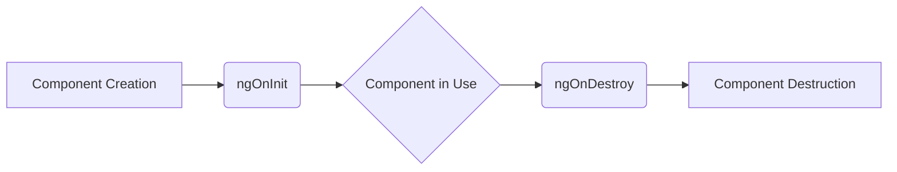

# <span style="color:#e67e22;">What we will learn in this post?</span>
<ul style='list-style-type: none; padding-left: 0;'>
<li><span style='color: #2980b9; font-size: 20px; font-weight: bold;'>👉</span> <span style='color: #2ecc71; font-size: 18px; font-weight: bold;'>Component Lifecycle</span></li>
<li><span style='color: #2980b9; font-size: 20px; font-weight: bold;'>👉</span> <span style='color: #2ecc71; font-size: 18px; font-weight: bold;'>Component Communication</span></li>
<li><span style='color: #2980b9; font-size: 20px; font-weight: bold;'>👉</span> <span style='color: #2ecc71; font-size: 18px; font-weight: bold;'>Data Binding</span></li>
<li><span style='color: #2980b9; font-size: 20px; font-weight: bold;'>👉</span> <span style='color: #2ecc71; font-size: 18px; font-weight: bold;'>Template Syntax</span></li>
<li><span style='color: #2980b9; font-size: 20px; font-weight: bold;'>👉</span> <span style='color: #2ecc71; font-size: 18px; font-weight: bold;'>Using Pipes</span></li>
<li><span style='color: #2980b9; font-size: 20px; font-weight: bold;'>👉</span> <span style='color: #2ecc71; font-size: 18px; font-weight: bold;'>Conclusion!</span></li>
</ul>

# <span style="color:#e67e22">Angular Component Lifecycle 🌱</span>

Angular components have a lifecycle – a series of stages they go through from creation to destruction.  Understanding this lifecycle is crucial for writing efficient and well-behaved applications.  Let's explore some key lifecycle hooks.


## <span style="color:#2980b9">Key Lifecycle Hooks 🎣</span>

Angular provides several hooks, but we'll focus on two important ones:

### <span style="color:#8e44ad">ngOnInit()</span>

This hook is called *after* the component's inputs are initialized, and the component's data-binding is complete.  It's the ideal place to perform any initial setup tasks.

*   **Purpose:**  Initialize component data, subscribe to services, fetch data, etc.
*   **Example:**  Fetching data from an API.

```typescript
ngOnInit() {
  this.myService.getData().subscribe(data => this.data = data);
}
```


### <span style="color:#8e44ad">ngOnDestroy()</span>

This hook is called just *before* Angular destroys the component.  Use it to clean up resources to prevent memory leaks.

*   **Purpose:** Unsubscribe from Observables, clear timers, detach event listeners.
*   **Example:** Unsubscribing from an Observable.

```typescript
ngOnDestroy() {
  this.dataSubscription.unsubscribe();
}
```

## <span style="color:#2980b9">Visualizing the Lifecycle 📊</span>




**Remember**:  Always unsubscribe from Observables in `ngOnDestroy` to prevent memory leaks!


**Further Reading:** For more detailed information on the Angular component lifecycle and other lifecycle hooks, check out the official Angular documentation: [https://angular.io/guide/lifecycle-hooks](https://angular.io/guide/lifecycle-hooks)


This simplified explanation hopefully provides a good overview. Remember to explore the official documentation for more comprehensive information!


# <span style="color:#e67e22">Angular Component Interaction: A Friendly Guide</span>  🎉

Angular components often need to communicate with each other.  Think of it like people talking in a team!  We use `@Input()`, `@Output()`, and Event Emitters to facilitate this.

## <span style="color:#2980b9">Data Passing with `@Input()`</span> ➡️

`@Input()` is like giving a component some information.  The parent component *provides* data to the child component.

### <span style="color:#8e44ad">Example:</span>

Imagine a parent component displaying a user's name and a child component displaying the user's details.

```typescript
// Parent Component
<app-user-details [userName]="userName"></app-user-details>

// Child Component
@Component({...})
export class UserDetailsComponent {
  @Input() userName: string; 
}
```

Here, `userName` is passed from the parent to the child using `[userName]`.


## <span style="color:#2980b9">Event Handling with `@Output()` and Event Emitters</span> ⬅️

`@Output()` allows a child component to *notify* the parent when something happens.  This is done using an `EventEmitter`.

### <span style="color:#8e44ad">Example:</span>

Let's say the child component has a button to save user data.  Clicking it should trigger an action in the parent.

```typescript
// Child Component
@Component({...})
export class UserDetailsComponent {
  @Output() userSaved = new EventEmitter<any>(); //Event emitter

  onSave(){
    this.userSaved.emit({userName: this.userName, ...otherData});
  }
}

//Parent Component
<app-user-details (userSaved)="handleUserSave($event)"></app-user-details>

handleUserSave(userData: any){
  //Handle the saved user data
}
```

The `(userSaved)` in the parent binds to the `userSaved` EventEmitter in the child.  When `userSaved.emit()` is called, the `handleUserSave` function in the parent is triggered.


## <span style="color:#2980b9">Visual Representation</span>

```mermaid
graph LR
    A[Parent Component] --> B(Child Component);
    B --> C((Data/Event));
    C --> A;
    style A fill:#f9f,stroke:#333,stroke-width:2px
    style B fill:#ccf,stroke:#333,stroke-width:2px
    linkStyle 0,1,2,3 stroke:#666,stroke-width:2px
```

This shows data flowing from parent to child (`@Input()`) and events flowing from child to parent (`@Output()`).


For more information:

* [Angular Official Documentation](https://angular.io/guide/component-interaction)


Remember,  using these methods keeps your components modular and easy to maintain! 👍


# <span style="color:#e67e22">Angular Data Binding: A Friendly Guide 🚀</span>

Angular makes it easy to connect your component's data with the user interface.  This is done through *data binding*. Let's explore the key types:

## <span style="color:#2980b9">Property Binding ➡️</span>

Property binding updates component properties from the parent component.  Think of it as sending data *one-way* from parent to child.

### <span style="color:#8e44ad">Example:</span>

```html
<p>The current time is: {{currentTime}}</p> 
```

In the component's TypeScript:

```typescript
currentTime = new Date();
```

Here, the `currentTime` variable's value is displayed.  If `currentTime` changes, the paragraph updates automatically.


## <span style="color:#2980b9">Event Binding ⬅️</span>

Event binding lets you respond to user interactions like button clicks. Data flows *one-way* from the child to the parent.

### <span style="color:#8e44ad">Example:</span>

```html
<button (click)="handleClick()">Click Me!</button>
```

In the component's TypeScript:

```typescript
handleClick() {
  alert('Button clicked!');
}
```

Clicking the button triggers the `handleClick` function.


## <span style="color:#2980b9">Two-Way Binding 🔄</span>

Two-way binding synchronizes data between the component and the template. Changes in either direction update the other.  This uses the `[(ngModel)]` directive.

### <span style="color:#8e44ad">Example:</span>

```html
<input [(ngModel)]="userName" type="text">
<p>Your name is: {{userName}}</p>
```

Typing in the input box immediately updates `userName` in the component, and vice-versa.


**Key Differences Summarized:**

| Binding Type | Data Flow | Directive |
|---|---|---|
| Property | Parent to Child | `[property]="expression"` |
| Event | Child to Parent | `(event)="expression"` |
| Two-Way | Both ways | `[(ngModel)]="expression"` |


For more in-depth information, check out the official Angular documentation: [https://angular.io/guide/template-syntax](https://angular.io/guide/template-syntax)


Remember, understanding data binding is fundamental to building dynamic Angular applications! ✨


# <span style="color:#e67e22">Angular Template Syntax: A Friendly Guide 🎉</span>

Angular's template syntax lets you create dynamic HTML.  It uses special directives to control what's shown and how it looks. Let's explore some key players!

## <span style="color:#2980b9">Structural Directives 🏗️</span>

These directives change the DOM structure.

### <span style="color:#8e44ad">`ngIf`  Conditional Rendering 👀</span>

This shows or hides elements based on a condition:

```html
<div *ngIf="showHero; else noHero">
  Hero is visible!
</div>
<ng-template #noHero>
  Hero is hidden!
</ng-template>
```

This shows "Hero is visible!" only if the `showHero` variable is true.  `#noHero` is a template reference variable that can be used to render a different view when `showHero` is false.


### <span style="color:#8e44ad">`ngFor`  Looping Through Data 🔁</span>

Iterates over an array to display its contents:

```html
<ul>
  <li *ngFor="let hero of heroes">{{hero.name}}</li>
</ul>
```

This creates a list item (`<li>`) for each item in the `heroes` array.


## <span style="color:#2980b9">Attribute Directives ✨</span>

These change the appearance or behavior of elements.

### <span style="color:#8e44ad">`ngClass` Dynamic Styling 🎨</span>

Applies CSS classes conditionally:

```html
<p [ngClass]="{'highlight': isImportant, 'error': isError}">This text has dynamic styling!</p>
```

The `highlight` and `error` classes are applied based on the values of `isImportant` and `isError`.


### <span style="color:#8e44ad">`ngStyle` Dynamic Styling 🖌️</span>

Applies CSS styles dynamically:

```html
<h1 [ngStyle]="{'color': myColor, 'font-size': fontSize + 'px'}">Dynamically styled header!</h1>
```


*Remember to import necessary modules in your component!*


For more detailed information and further examples:

* [Angular Official Documentation](https://angular.io/guide/template-syntax)


This is just a taste of Angular's powerful template syntax. Explore and build amazing things!


# <span style="color:#e67e22">Angular Pipes: Data Transformation Made Easy 💫</span>

Angular pipes are a fantastic way to format and transform data directly within your templates.  This keeps your component logic clean and your templates readable. Think of them as mini-functions for your data!

## <span style="color:#2980b9">Common Built-in Pipes</span>

Angular provides several built-in pipes for common tasks:

*   **`uppercase`**: Converts text to uppercase.  `{{ 'hello' | uppercase }}` outputs `HELLO`.
*   **`lowercase`**: Converts text to lowercase. `{{ 'WORLD' | lowercase }}` outputs `world`.
*   **`date`**: Formats dates. `{{ dateObj | date:'shortDate' }}` might output `10/26/2023`.  
*   **`currency`**: Formats numbers as currency. `{{ price | currency:'USD' }}` might output `$19.99`.
*   **`number`**: Formats numbers with specified precision and notation. `{{ num | number:'1.2-2' }}`  might output `19.99`.


### <span style="color:#8e44ad">Example: Formatting a Date</span>

```html
<p>Today is: {{ today | date:'fullDate' }}</p> 
```

## <span style="color:#2980b9">Creating Custom Pipes 🛠️</span>


Creating a custom pipe lets you handle specific formatting needs not covered by built-ins.  Let's say you want to highlight certain keywords:

```typescript
import { Pipe, PipeTransform } from '@angular/core';

@Pipe({
  name: 'highlight'
})
export class HighlightPipe implements PipeTransform {
  transform(value: string, args: string): string {
    return value.replace(new RegExp(args, 'gi'), `<mark>$&</mark>`); 
  }
}
```

This `highlight` pipe wraps matches in `<mark>` tags.  In your template:

```html
<p>{{ myText | highlight:'Angular' }}</p>
```

This will highlight all instances of "Angular" in `myText`.

[More on Angular Pipes](https://angular.io/guide/pipes)


**Note:**  Remember to declare your custom pipe in your module's `declarations` array.

This simple guide showcases the power and ease of use of Angular pipes for data transformation.  They significantly enhance the readability and maintainability of your Angular applications.


<h1><span style='color:#e67e22'>Conclusion</span></h1>

So there you have it!  We hope you enjoyed this post and found it helpful 😊. We're always looking to improve, so we'd love to hear your thoughts!  What did you think?  Anything you'd like to see more of?  Let us know in the comments below 👇.  Your feedback is super valuable to us and helps us create even better content in the future!  We can't wait to read what you have to say! 🎉


