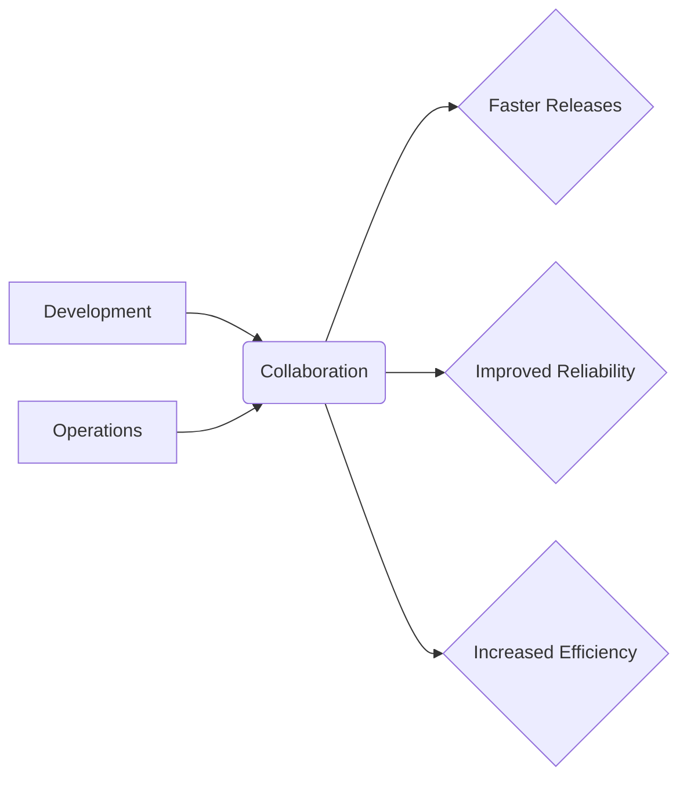
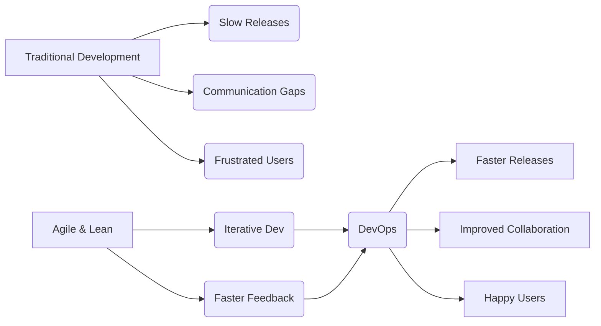
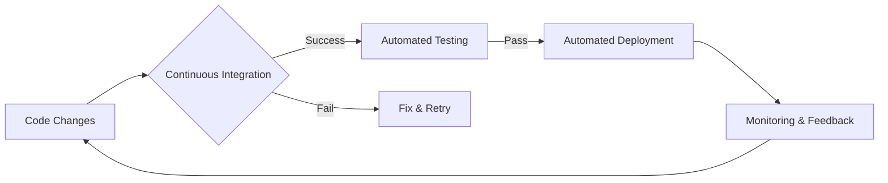
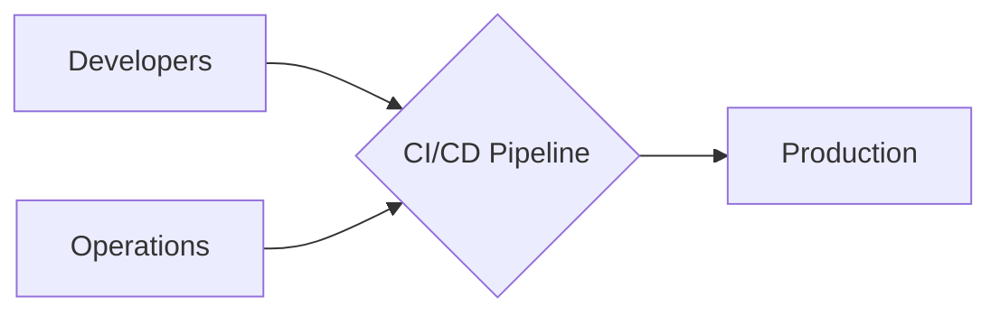
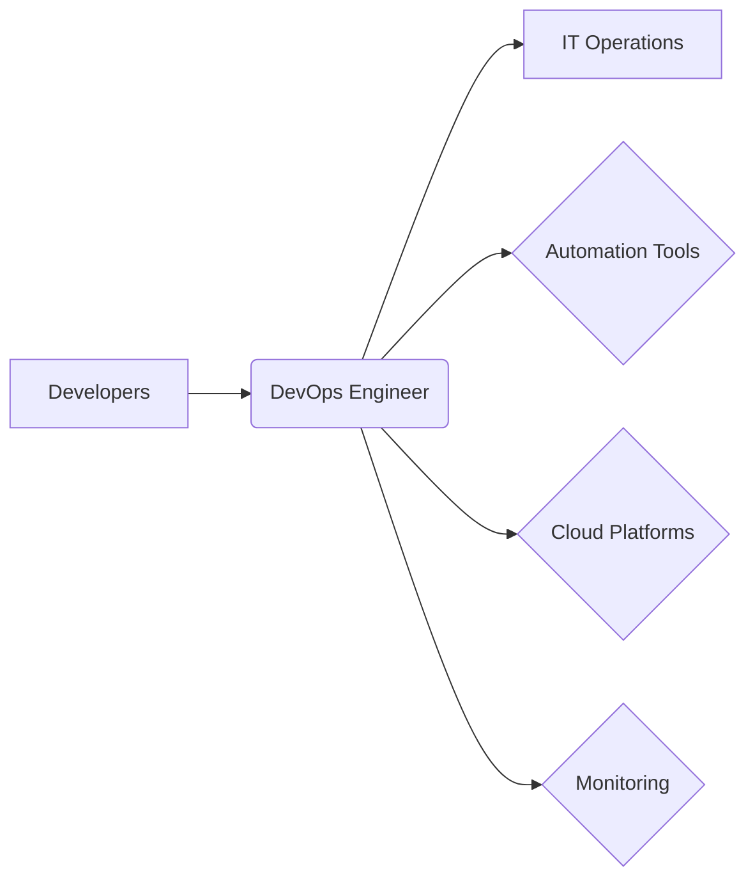

# What we will learn in this post?
<ul style='list-style-type: none; padding-left: 0;'>
<li>👉 What is DevOps?</li>
<li>👉 History and Evolution of DevOps</li>
<li>👉 Principles and Practices of DevOps</li>
<li>👉 Benefits of DevOps</li>
<li>👉 Role of a DevOps Engineer</li>
<li>👉 Conclusion!</li>
</ul>

# DevOps Explained Simply 🤝

DevOps is a fancy word for better teamwork in the tech world!  It combines "Development" (making software) and "Operations" (keeping software running smoothly). Think of it like this:

## Development vs Operations: A Simple Analogy

Imagine you're making a pizza 🍕.  Development is like creating the perfect pizza recipe and making the dough.  Operations is like baking the pizza perfectly and serving it to customers.  Traditionally, these were separate jobs, but with DevOps, they work together as a team from start to finish.

### DevOps: Teamwork Makes the Dream Work!

Just like a group project where everyone shares ideas and helps each other, DevOps means developers and operations teams collaborate closely. They work together to build, deliver, and keep software running without a hitch.  This leads to faster updates, fewer mistakes, and happier users!

## How DevOps Works in Practice

*   **Faster Releases:**  Think of releasing new features in a game—DevOps helps release these updates quickly and efficiently.
*   **Improved Reliability:**  Like a well-oiled machine ⚙️, DevOps ensures the software runs smoothly and reduces downtime.
*   **Increased Efficiency:**  Less time spent fixing problems means more time creating awesome new things!

## Real-World Example

Think of making a group presentation 🧑‍💼👩‍💼.  In a traditional approach, one person writes the content, another designs the slides, and a third person presents it. This can be slow and lead to miscommunications. DevOps is like everyone working together from the start, brainstorming, sharing their work, ensuring everything is consistent, and leading to a polished final presentation.

DevOps is all about simplifying work, making things faster, and making systems more reliable. It’s a win-win for everyone! 🎉

Want to learn more?  Check out these resources: [Google Cloud DevOps](https://cloud.google.com/solutions/devops) and [Microsoft Azure DevOps](https://azure.microsoft.com/en-us/services/devops/).

# DevOps: A Journey from Chaos to Collaboration 🚀

Imagine software development in the old days: long release cycles, constant conflicts between developers and operations teams, and frustrated users waiting ages for updates.  That was the reality before DevOps!

## The Seeds of Change 🌱

Traditional methods struggled with communication gaps and slow processes.  *Agile* and *Lean* methodologies offered a solution by emphasizing iterative development, faster feedback loops, and collaboration. These philosophies formed the bedrock for DevOps.

### Agile and Lean's Influence

*   **Agile:** Focused on iterative development and frequent releases.
*   **Lean:**  Prioritized eliminating waste and improving efficiency.

## DevOps Emerges 🤝

DevOps wasn't a sudden invention but a gradual evolution.  The first **DevOpsDays** conference in 2009 marked a turning point, bringing together developers and operations professionals to share ideas and experiences.

### From Months to Minutes

Companies like Netflix transitioned from lengthy release cycles to deploying updates multiple times a *day*, thanks to DevOps practices.  This meant faster innovation and happier customers!

## Modern DevOps Trends ✨

DevOps continues to evolve.  *GitOps* automates deployments using Git as the single source of truth.  *AI* is integrated for intelligent monitoring, automation, and predictive analysis.

## The Future of DevOps 🔮

DevOps isn't just a set of tools; it's a culture of collaboration and continuous improvement.  The future holds even more automation, AI-driven insights, and a stronger focus on security and observability.

For more information:

* [DevOpsDays](https://www.devopsdays.org/)
* [GitOps](https://www.gitops.tech/)

DevOps is all about building better software, faster, and with happier teams.  It’s a journey, not a destination! 👍

# DevOps: Making Software Better, Together 🚀

DevOps is all about making software development faster, easier, and more reliable by improving teamwork and automation.  Think of it as a smoother way to build and deliver software.

## Key Ingredients 🧑‍🍳

* **Collaboration:**  Imagine a team making a cake.  DevOps is like everyone—bakers, decorators, etc.—working together from the start, instead of passing the cake around at different stages. Everyone shares ideas and works efficiently.

* **Automation:**  Think of automating your morning routine. Instead of manually making coffee and packing your lunch, you could use a coffee machine and prep your lunch the night before. This saves time and reduces errors! Similarly, DevOps automates tasks like *testing* and *deploying* software, reducing human error and speeding up delivery.

* **Continuous Integration (CI):** This is like regularly checking your cake batter to make sure all ingredients are well-mixed before baking.  It means developers frequently integrate their code changes, ensuring early detection of problems.

* **Continuous Delivery/Deployment (CD):** This is like having a system to automatically take your baked cake to the shop for customers to buy. It's the automated process of releasing your software updates frequently, ensuring fast delivery and user feedback.

* **Feedback Loops:**  Getting customer feedback on your cake is crucial to improve the recipe!  DevOps emphasizes continuous feedback throughout the development process, allowing for quick adaptations and improvements.

## Real-World Example 🏢

Imagine a company releasing a new app update. Using DevOps, they automate testing and deployment.  This means faster updates, fewer bugs, and happier users!  Without DevOps, the process would be much slower and prone to errors, leading to delays and frustrated users.

## Visualizing the Process 📊

This flowchart shows how the continuous integration and delivery process streamlines the software release cycle.

Want to learn more? Check out these resources:

* [DevOps.com](https://www.devops.com/)
* [Atlassian DevOps](https://www.atlassian.com/devops)

DevOps improves software quality by emphasizing teamwork, automation, and continuous feedback, resulting in faster, more reliable software releases. It’s all about making software development a better experience for everyone involved! 🎉

# 🚀 DevOps: Supercharge Your Software! 🚀

Ever wished building software was like a well-oiled machine, not a chaotic mess?  That's where DevOps comes in!  Think of it as teamwork on steroids – like a sports team working together to win the championship, or a group project where everyone's on the same page.

## ⚡️ Faster Releases: Get Your App Out There! ⚡️

DevOps helps you deliver updates *way* faster. Imagine your favorite mobile game getting new levels and features *weekly*, without crashing or bugs! That's DevOps in action.  Instead of long, drawn-out release cycles, DevOps uses automation and continuous integration/continuous delivery (CI/CD).

### Example:
A new feature for a weather app (like rain alerts) can be tested and released to users in hours, not months!

## 🐞 Fewer Bugs: Smooth Sailing Ahead! 🐞

DevOps emphasizes automation and testing at *every* stage.  This means catching errors early, preventing major headaches down the line.  Think of it as a quality control team constantly checking for errors, ensuring a smoother experience for users.

### Analogy:
It's like proofreading your essay multiple times before submitting—you catch typos and improve clarity.

## 🤝 Better Teamwork: United We Stand! 🤝

DevOps breaks down silos between development and operations teams.  Instead of finger-pointing, everyone collaborates, sharing responsibility and improving communication – like a perfectly coordinated orchestra!

### Diagram:

## 💪 Improved Collaboration:  The Power of Unity! 💪
* **Shared Goals:**  Everyone works towards a common goal: delivering high-quality software quickly.
* **Increased Efficiency:** Automation reduces manual tasks and speeds up the development process.
* **Reduced Risk:** Early and frequent testing minimizes the chances of major issues.

Want to learn more? Check out these resources:

* [DevOps Institute](https://www.devopsinstitute.com/)
* [Atlassian DevOps](https://www.atlassian.com/devops)

DevOps isn't just a buzzword; it's a powerful tool to make software development easier and more efficient. It's about solving problems, collaborating effectively and building amazing things. So, dive in and unleash your inner DevOps ninja! 🥷

# DevOps Engineer: Bridging the Gap 🤝

Imagine a restaurant kitchen. Chefs (developers) create amazing dishes (software), but they need someone to prepare the ingredients (infrastructure) and ensure everything runs smoothly (deployment). That's where the DevOps Engineer comes in!  They're the bridge between the developers and the IT operations team.

## What Does a DevOps Engineer Do? 🤔

DevOps Engineers make sure software gets from development to the users smoothly and efficiently.  Think of them as the *culinary orchestrators* of the software world!  Their responsibilities include:

*   **Setting up automation tools:**  Like a chef using a food processor, DevOps engineers use tools to automate repetitive tasks, saving time and reducing errors.  Examples include `Jenkins`, `GitLab CI/CD`.
*   **Managing infrastructure:** This involves setting up and managing servers, networks, and databases – preparing the "kitchen" for cooking. They might use tools like _Terraform_ or _Ansible_.
*   **Ensuring smooth deployments:**  Like ensuring a dish is perfectly plated and served, DevOps engineers ensure software is deployed quickly and reliably, minimizing downtime.  They often utilize _Kubernetes_ or _Docker_.
*   **Monitoring and troubleshooting:** They constantly monitor the system's health, identifying and fixing problems before they impact users.

### Example: Preparing the Environment 🍳

A developer writes code.  The DevOps Engineer uses tools like _Chef_ or _Puppet_ to automatically set up the necessary servers, install dependencies, and configure the environment – just like a chef prepares the ingredients before cooking.

## Hot Trends 🔥

*   **Cloud Platforms (AWS, Azure, GCP):**  DevOps engineers often manage infrastructure in the cloud, leveraging its scalability and flexibility.
*   **Kubernetes:** This container orchestration platform automates deployment, scaling, and management of containerized applications.
*   **Infrastructure as Code (IaC):** Managing and provisioning infrastructure through code, rather than manual configuration.

## A Rewarding Career Path 🚀

DevOps is a dynamic and exciting field with high demand. If you enjoy solving problems, automating tasks, and working with cutting-edge technologies, a career as a DevOps engineer could be perfect for you!

**Learn More:**

* [Kubernetes](https://kubernetes.io/)
* [AWS](https://aws.amazon.com/)
* [DevOps Institute](https://www.devopsinstitute.com/)

<h1>Conclusion</h1>

So there you have it!  We've covered a lot of ground today, and hopefully, you found this helpful and insightful. 😊  We're always looking to improve, and your thoughts are incredibly valuable to us.  So, what did you think?  Anything you'd like to add?  Any burning questions? 🤔  Let us know in the comments below!  We'd love to hear your feedback, suggestions, and even just a friendly hello! 👋  Let's keep the conversation going! 🎉

