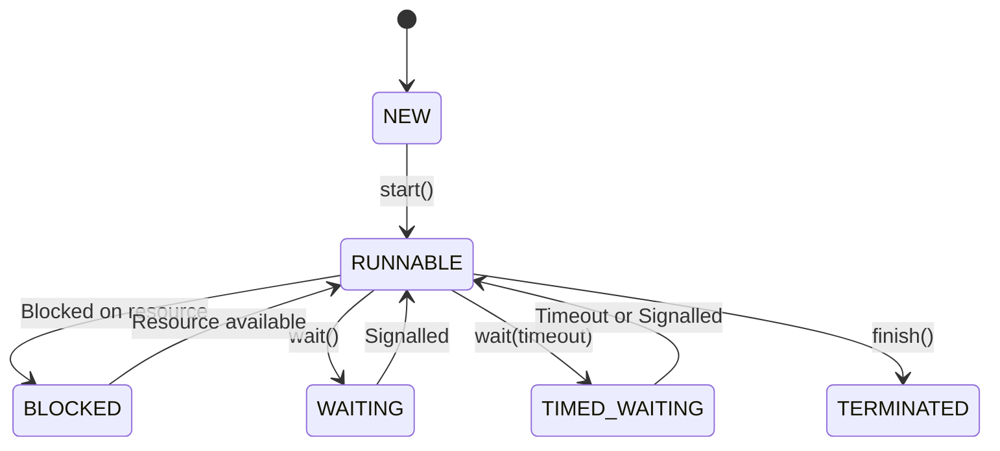
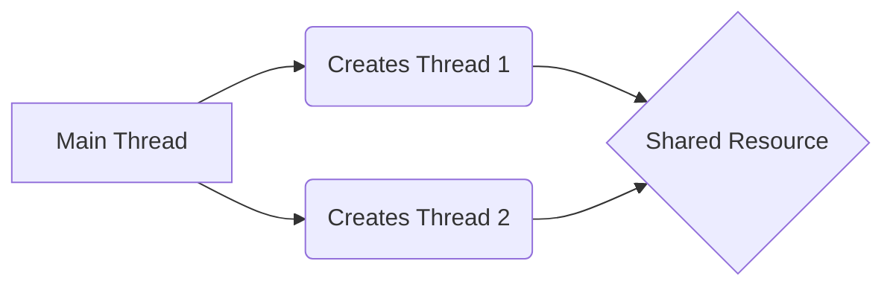
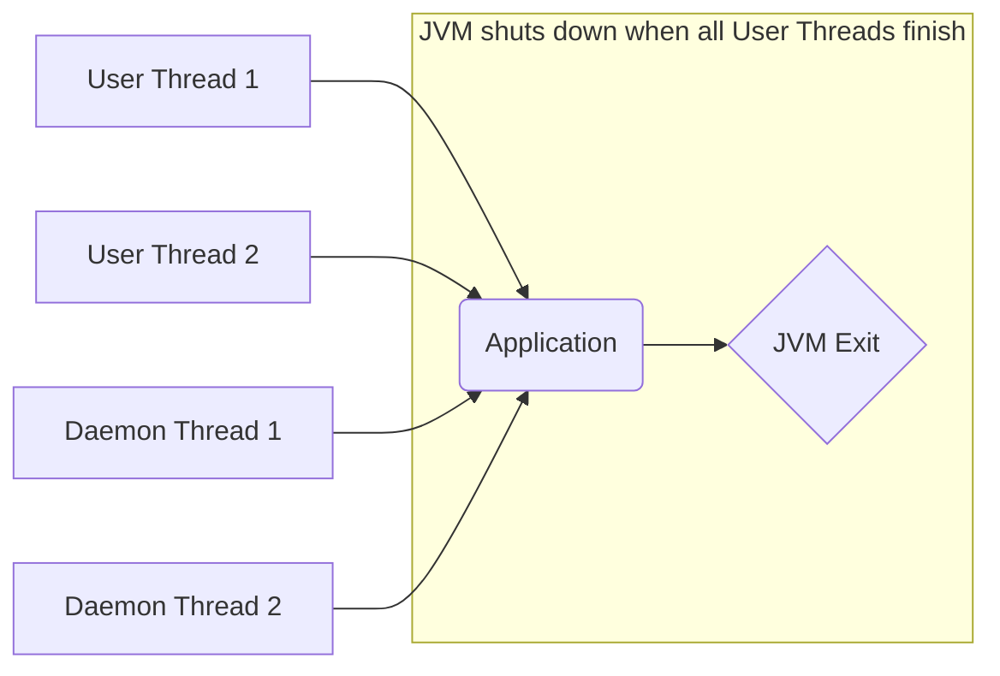
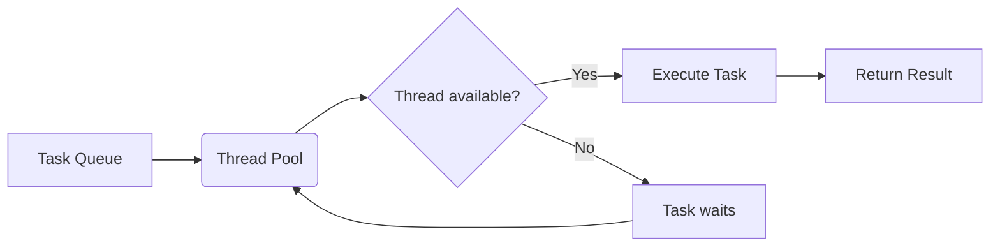
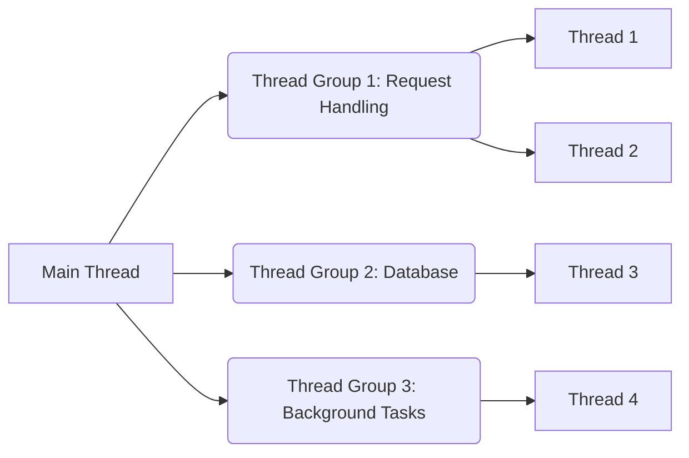
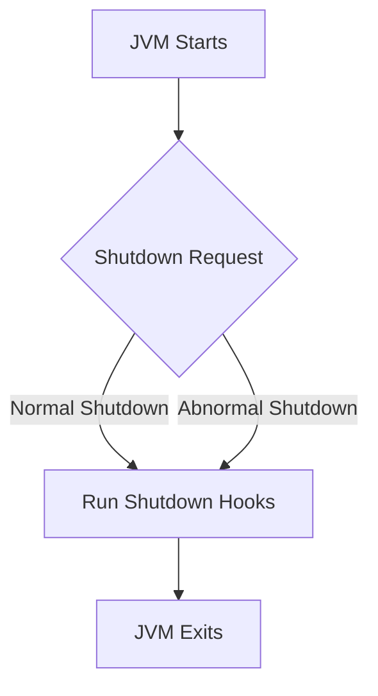

# <span style="color:#e67e22;">What we will learn in this post?</span>
<ul style='list-style-type: none; padding-left: 0;'>
<li><span style='color: #2980b9; font-size: 20px; font-weight: bold;'>👉</span> <span style='color: #2ecc71; font-size: 18px; font-weight: bold;'>Introduction to Multithreading in Java</span></li>
<li><span style='color: #2980b9; font-size: 20px; font-weight: bold;'>👉</span> <span style='color: #2ecc71; font-size: 18px; font-weight: bold;'>Lifecycle and Stages of a Thread</span></li>
<li><span style='color: #2980b9; font-size: 20px; font-weight: bold;'>👉</span> <span style='color: #2ecc71; font-size: 18px; font-weight: bold;'>Thread Priority in Java</span></li>
<li><span style='color: #2980b9; font-size: 20px; font-weight: bold;'>👉</span> <span style='color: #2ecc71; font-size: 18px; font-weight: bold;'>Main Thread in Java</span></li>
<li><span style='color: #2980b9; font-size: 20px; font-weight: bold;'>👉</span> <span style='color: #2ecc71; font-size: 18px; font-weight: bold;'>Thread Class</span></li>
<li><span style='color: #2980b9; font-size: 20px; font-weight: bold;'>👉</span> <span style='color: #2ecc71; font-size: 18px; font-weight: bold;'>Runnable Interface</span></li>
<li><span style='color: #2980b9; font-size: 20px; font-weight: bold;'>👉</span> <span style='color: #2ecc71; font-size: 18px; font-weight: bold;'>How to Name a Thread</span></li>
<li><span style='color: #2980b9; font-size: 20px; font-weight: bold;'>👉</span> <span style='color: #2ecc71; font-size: 18px; font-weight: bold;'>start() Method in Thread</span></li>
<li><span style='color: #2980b9; font-size: 20px; font-weight: bold;'>👉</span> <span style='color: #2ecc71; font-size: 18px; font-weight: bold;'>run() vs start() Method in Java</span></li>
<li><span style='color: #2980b9; font-size: 20px; font-weight: bold;'>👉</span> <span style='color: #2ecc71; font-size: 18px; font-weight: bold;'>sleep() Method</span></li>
<li><span style='color: #2980b9; font-size: 20px; font-weight: bold;'>👉</span> <span style='color: #2ecc71; font-size: 18px; font-weight: bold;'>Daemon Thread</span></li>
<li><span style='color: #2980b9; font-size: 20px; font-weight: bold;'>👉</span> <span style='color: #2ecc71; font-size: 18px; font-weight: bold;'>Thread Pool in Java</span></li>
<li><span style='color: #2980b9; font-size: 20px; font-weight: bold;'>👉</span> <span style='color: #2ecc71; font-size: 18px; font-weight: bold;'>Thread Group in Java</span></li>
<li><span style='color: #2980b9; font-size: 20px; font-weight: bold;'>👉</span> <span style='color: #2ecc71; font-size: 18px; font-weight: bold;'>Thread Safety in Java</span></li>
<li><span style='color: #2980b9; font-size: 20px; font-weight: bold;'>👉</span> <span style='color: #2ecc71; font-size: 18px; font-weight: bold;'>Shutdown Hook</span></li>
<li><span style='color: #2980b9; font-size: 20px; font-weight: bold;'>👉</span> <span style='color: #2ecc71; font-size: 18px; font-weight: bold;'>Multithreading Tutorial</span></li>
<li><span style='color: #2980b9; font-size: 20px; font-weight: bold;'>👉</span> <span style='color: #2ecc71; font-size: 18px; font-weight: bold;'>Conclusion!</span></li>
</ul>

Error: An error occurred while processing your request. Please try again later.

# <span style="color:#e67e22">The Java Thread Lifecycle 🧵</span>

A Java thread's life is a journey through several states. Let's explore!

## <span style="color:#2980b9">Thread States 🚦</span>

A thread can exist in one of these states:

* **NEW:**  The thread has been created but hasn't started yet.  Think of it as being "ready to go!" 🚀
* **RUNNABLE:** The thread is actively executing or ready to execute. This is where the real work happens! ⚙️
* **BLOCKED:** The thread is waiting for a resource (like a lock or I/O). It's paused temporarily. 😴
* **WAITING:** The thread is waiting indefinitely for another thread to perform an action.  Think of it as patiently waiting in line. ⏳
* **TIMED_WAITING:** Similar to WAITING, but with a timeout. It'll wait *only* for a specified duration. ⏱️
* **TERMINATED:** The thread has finished executing. It's done its job! 🎉


## <span style="color:#2980b9">State Transitions ✨</span>

The transitions between states are dynamic:

### <span style="color:#8e44ad">Diagrammatic Representation</span>



*A thread can transition from `RUNNABLE` to `BLOCKED` if it needs to wait for a lock or I/O operation to complete.*  For example, `_Thread.sleep()` will put the thread in `TIMED_WAITING` state.

## <span style="color:#2980b9">Key Points to Remember 🤔</span>

* The JVM manages these transitions automatically.
* Understanding these states is crucial for debugging and optimizing multithreaded applications.
* Incorrect handling of thread states can lead to deadlocks and other concurrency issues.


For more in-depth information, you can check out the official Java documentation on [Threads](https://docs.oracle.com/javase/tutorial/essential/concurrency/index.html).  Happy threading!


Error: An error occurred while processing your request. Please try again later.

# <span style="color:#e67e22">The Main Thread in Java 🧵</span>

Java applications begin their journey with a special thread: the *main thread*.  Think of it as the conductor of an orchestra 🎼.

## <span style="color:#2980b9">The Main Thread's Role as the Entry Point</span>

The `main` method,  `public static void main(String[] args)`, is where your Java program starts executing.  This method runs *within* the main thread.  It's the initial point of execution for all your code.  Everything begins here!


### <span style="color:#8e44ad">A Simple Analogy</span>

Imagine building a house 🏠. The main thread is like the architect who lays out the initial blueprint and starts the construction process.

## <span style="color:#2980b9">Interaction with Other Threads</span>

The main thread doesn't work alone.  It can create and manage other threads,  allowing multiple tasks to happen concurrently.  Think of these as different workers on the construction site 🚧.


*   **Creating Threads:** The `main` thread uses classes like `Thread` or `ExecutorService` to spawn new threads.
*   **Synchronization:**  To prevent chaos, the main thread (and other threads) may need to coordinate access to shared resources using techniques like locks (`synchronized` blocks) to avoid data corruption.
*   **Communication:** Threads can communicate through mechanisms like `wait()` and `notify()` methods or using queues.




This diagram shows the main thread creating and sharing a resource with other threads.


**Important Note:** If the main thread finishes its execution before other threads, the whole program might terminate unexpectedly.  Consider using techniques to keep the main thread alive (e.g., using `Thread.sleep()` or by waiting for other threads to complete) if needed.


For more in-depth information on Java threads, check out:

* [Oracle's Java Tutorials on Concurrency](https://docs.oracle.com/javase/tutorial/essential/concurrency/)


Remember to handle threading carefully to avoid race conditions and deadlocks.  Happy coding! 😊


# <span style="color:#e67e22">Java's Thread Class: A Friendly Guide 🧵</span>

Java's `Thread` class is your tool for creating and managing concurrent processes (threads) within your program.  Think of threads as mini-programs running simultaneously within a larger program. This allows your application to perform multiple tasks at once, making it more responsive and efficient.

## <span style="color:#2980b9">Creating Threads</span>

There are two primary ways to create threads using the `Thread` class:

### <span style="color:#8e44ad">Extending the Thread Class</span>

You create a new class that *extends* `Thread` and overrides the `run()` method.  This `run()` method contains the code you want your thread to execute.

```java
class MyThread extends Thread {
    @Override
    public void run() {
        System.out.println("My thread is running!");
    }
}

MyThread myThread = new MyThread();
myThread.start(); //This starts the thread!
```

### <span style="color:#8e44ad">Implementing the Runnable Interface</span>

Alternatively, create a class that *implements* the `Runnable` interface and provides its `run()` method.  You then pass an instance of this class to a `Thread` object's constructor.

```java
class MyRunnable implements Runnable {
    @Override
    public void run() {
        System.out.println("My runnable thread is running!");
    }
}

Runnable myRunnable = new MyRunnable();
Thread myThread = new Thread(myRunnable);
myThread.start();
```

## <span style="color:#2980b9">Key Thread Methods</span>

*   `start()`: Begins thread execution.  Crucial – don't call `run()` directly!
*   `run()`: Contains the code the thread executes.
*   `sleep(milliseconds)`: Pauses the thread for a specified time.  Use `Thread.sleep()` cautiously!
*   `join()`: Makes the current thread wait until the specified thread finishes.
*   `interrupt()`: Interrupts a sleeping or waiting thread.


## <span style="color:#2980b9">Thread Constructors</span>

The most common constructor takes a `Runnable` object (as shown above).  Another constructor takes a `String` as a name for the thread (helpful for debugging).


**Important Note:**  Managing threads effectively requires careful consideration of synchronization to prevent race conditions and deadlocks.


[Learn more about Threading in Java!](https://docs.oracle.com/javase/tutorial/essential/concurrency/) 


This is a simplified overview. For in-depth information, refer to the official Java documentation.  Happy threading! 🎉


# <span style="color:#e67e22">Understanding Java's `Runnable` Interface 🧵</span>

Java's `Runnable` interface is a crucial part of its multithreading capabilities.  It provides a simple way to create and manage threads, offering a more flexible approach than directly extending the `Thread` class. Think of it as a blueprint for a task that can run concurrently.


## <span style="color:#2980b9">Runnable vs. Thread: What's the Difference?</span>

The key difference lies in *how* you create threads.

*   **`Thread` Class:** You extend the `Thread` class and override its `run()` method. This is straightforward but limits you to extending only one class.

*   **`Runnable` Interface:** You implement the `Runnable` interface and define your task within its `run()` method.  This allows for multiple inheritance (implementing other interfaces) and is generally preferred for better code design.


### <span style="color:#8e44ad">Runnable in Action</span>

Here's a simple example:

```java
class MyRunnable implements Runnable {
    @Override
    public void run() {
        System.out.println("Thread is running!");
    }
}

public class Main {
    public static void main(String[] args) {
        Runnable task = new MyRunnable();
        Thread thread = new Thread(task); //Creating a Thread using Runnable
        thread.start();
    }
}
```

This creates a thread using an instance of `MyRunnable`.

## <span style="color:#2980b9">Why Use `Runnable`?</span>

*   **Flexibility:**  Allows you to implement multiple interfaces.
*   **Better Design:** Promotes cleaner code separation of concerns.
*   **Reusability:** A single `Runnable` instance can be used to create multiple threads.


## <span style="color:#2980b9">Visualizing the Process</span>

```mermaid
graph TD
    A[Create Runnable Object] --> B{Implement run() method};
    B --> C[Create Thread Object];
    C --> D[Pass Runnable to Thread];
    D --> E[Start Thread];
    E --> F[Execute run() method concurrently];
```


For more information and detailed explanations, you can check out:

*   [Oracle's Java Tutorial on Threads](https://docs.oracle.com/javase/tutorial/essential/concurrency/) 


Remember, using `Runnable` is generally recommended for its enhanced flexibility and cleaner code structure when working with threads in Java! 👍


# <span style="color:#e67e22">Thread Naming in Java: Why Bother? 🤔</span>

Giving your Java threads descriptive names is super important for debugging and monitoring your applications.  Imagine trying to figure out which thread crashed without a name – it's like finding a needle in a haystack!  Named threads make log analysis and troubleshooting much easier.


## <span style="color:#2980b9">Setting Thread Names ✨</span>

You have two primary ways to give your threads a name:

*   **During Thread Creation:**  The simplest method is to provide the name directly when you create the thread:

    ```java
    Thread myThread = new Thread(() -> { /* Your code here */ }, "MySpecialThread");
    myThread.start();
    ```

*   **Using `setName()`:** You can also set the name after creating the thread using the `setName()` method:

    ```java
    Thread anotherThread = new Thread(() -> { /* Your code here */ });
    anotherThread.setName("AnotherImportantThread");
    anotherThread.start();
    ```


## <span style="color:#2980b9">Getting Thread Names 🔎</span>

Retrieving a thread's name is straightforward using the `getName()` method:


```java
String threadName = myThread.getName();
System.out.println("Thread name: " + threadName);
```

### <span style="color:#8e44ad">Example Flowchart</span>

```mermaid
graph TD
    A[Create Thread] --> B{Name Provided?};
    B -- Yes --> C[Thread Starts];
    B -- No --> D[Use setName()];
    D --> C;
    C --> E[Access Name with getName()];
```


## <span style="color:#2980b9">Why is it Important? 🤔</span>

*   **Debugging:**  Easily identify the source of errors in multithreaded applications.
*   **Monitoring:** Track the progress and performance of individual threads.
*   **Logging:**  Improve the readability and understandability of log files.


**In short:**  Giving your threads meaningful names significantly boosts the maintainability and debuggability of your Java applications.  It's a simple best practice with big benefits!

[More on Java Threads](https://docs.oracle.com/javase/tutorial/essential/concurrency/runthread.html)


# <span style="color:#e67e22">Understanding Thread.start() vs. Directly Calling run()</span> 🧵

## <span style="color:#2980b9">The Role of `start()`</span>

The `start()` method in Java's `Thread` class is crucial for launching a new thread.  Think of it as the ignition switch for your thread.  When you call `threadObject.start()`, you're not just *running* the thread's code; you're instructing the Java Virtual Machine (JVM) to create and manage a completely separate, parallel execution path.  This allows your program to perform multiple tasks concurrently. 🚀

### <span style="color:#8e44ad">What `start()` Does:</span>

*   Creates a new thread of execution.
*   Allocates system resources for the new thread.
*   Calls the `run()` method of the `Thread` object.
*   Manages the thread's lifecycle (starting, running, and ending).

## <span style="color:#2980b9">The Difference from Directly Calling `run()`</span>

Calling `threadObject.run()` directly *does not* start a new thread. Instead, it simply executes the code within the `run()` method in the *current* thread.  This means no concurrency; your program will execute the `run()` method's instructions sequentially, just like any other method call.  It completely defeats the purpose of using threads for parallel processing! 🚫


### <span style="color:#8e44ad">Key Differences Summarized</span>

| Method       | Result                                      | Concurrency? |
|--------------|----------------------------------------------|----------------|
| `start()`     | New thread created, `run()` executed concurrently | Yes            |
| `run()`       | `run()` executed in the current thread       | No             |


## <span style="color:#2980b9">Illustrative Flowchart</span>

```mermaid
graph TD
    A[Call threadObject.start()] --> B{JVM creates new thread};
    B --> C[JVM calls threadObject.run()];
    D[Call threadObject.run()] --> E[run() executes in current thread];
```

**In short:** Use `start()` to create and manage true concurrent threads. Calling `run()` directly will only execute the code sequentially within the existing thread.  Always prefer `start()` for multi-threading!

**For more information:** [Oracle's Java Thread Documentation](https://docs.oracle.com/javase/8/docs/api/java/lang/Thread.html)


# <span style="color:#e67e22">Java's `run()` vs. `start()` in Multithreading 🧵</span>

Let's explore the difference between `run()` and `start()` methods in Java's threading world!

## <span style="color:#2980b9">Understanding `run()`</span>

The `run()` method contains the code you want your thread to execute. Think of it as the *thread's task*.  It's just a regular method.

*   **Function:** Defines the thread's actions.
*   **Execution:** Calling `myThread.run()` executes the `run()` method *within the current thread*, not creating a new one. It's like doing the task yourself, not delegating it.

### <span style="color:#8e44ad">Example:</span>

```java
Thread myThread = new Thread(() -> System.out.println("Hello from run()!"));
myThread.run(); // Executes in the main thread
```

## <span style="color:#2980b9">The Importance of `start()` 🌟</span>

The `start()` method is where the magic of multithreading happens!

*   **Function:**  It schedules the `run()` method to be executed by a *separate* thread managed by the Java Virtual Machine (JVM).
*   **Execution:** Calling `myThread.start()` creates a new thread, assigns it the `run()` method, and the JVM takes care of executing it concurrently with other threads.  This enables true parallelism (depending on your system).

### <span style="color:#8e44ad">Example:</span>

```java
Thread myThread = new Thread(() -> System.out.println("Hello from a new thread!"));
myThread.start(); // Executes in a new thread
```

## <span style="color:#2980b9">Why `start()` is Crucial</span>

Using `start()` is essential for multithreading because:

*   **Concurrency:** It allows multiple tasks to run seemingly at the same time, improving performance in many applications.
*   **Resource Utilization:**  It lets you utilize multiple CPU cores efficiently.
*   **Responsiveness:** It prevents your application from freezing while performing lengthy operations.

**In short:**  `run()` is just a method; `start()` is the key to unlocking the power of multithreading in Java.  Never call `run()` directly if you intend to create a new thread.

[Learn more about Java Threads](https://docs.oracle.com/javase/tutorial/essential/concurrency/index.html)

```mermaid
graph TD
    A[Main Thread] --> B{myThread.start()};
    B --> C[New Thread];
    C --> D[run() method execution];
```


# <span style="color:#e67e22">😴 Java's `sleep()` Method: A Gentle Pause for Threads</span>


## <span style="color:#2980b9">Understanding `Thread.sleep()`</span>

The `sleep()` method in Java, specifically `Thread.sleep(milliseconds)`, is your friendly neighborhood thread-pauser.  It's a static method within the `Thread` class, meaning you call it directly on the `Thread` class itself (e.g., `Thread.sleep(1000)`).  Its purpose is simple: to temporarily halt the execution of the *current* thread for a specified number of milliseconds.

### <span style="color:#8e44ad">How it Works</span>

Think of it like pressing the pause button on a movie.  The thread stops doing whatever it's doing, and then, after the specified time, it continues from where it left off.  This is extremely useful for various tasks:

*   **Simulating delays:**  Useful for creating animations, games, or any situation where you need a timed pause.
*   **Rate limiting:**  Preventing a thread from consuming too many resources by introducing controlled pauses.
*   **Giving other threads a chance:**  Allowing other threads to run, preventing a single thread from hogging all the CPU.


## <span style="color:#2980b9">Implications for Thread Management</span>

Using `sleep()`  can significantly impact your application's behavior.  Keep these points in mind:


*   **Interruptions:** A sleeping thread can be *interrupted* using `Thread.interrupt()`. This throws an `InterruptedException` which must be handled appropriately (usually with a `catch` block).  Ignoring this exception can lead to unexpected behavior.
*   **Inaccuracy:** `sleep()` doesn't guarantee *precise* timing.  The actual pause might be slightly longer or shorter than specified due to system factors.
*   **Blocking:** While the thread sleeps, it's *blocked*. It doesn't consume CPU resources, but it's not doing any useful work either.


### <span style="color:#8e44ad">Example</span>

```java
try {
    Thread.sleep(2000); // Pause for 2 seconds
    System.out.println("Woke up!");
} catch (InterruptedException e) {
    System.out.println("Sleep interrupted!");
}
```

## <span style="color:#2980b9">Flowchart</span>

```mermaid
graph TD
    A[Thread starts] --> B{Thread.sleep(ms)};
    B --> C[Thread pauses for ms];
    C --> D{Interruption?};
    D -- Yes --> E[InterruptedException];
    D -- No --> F[Thread resumes];
    E --> G[Handle Exception];
    G --> F;
    F --> H[Thread continues];
```

For more in-depth information on thread management in Java, please refer to the official [Java Concurrency Tutorial](https://docs.oracle.com/javase/tutorial/essential/concurrency/index.html).  This is a great resource for understanding the nuances of thread handling.  Happy coding! 🎉


# <span style="color:#e67e22">Daemon Threads in Java 🧵</span>

Daemon threads are a special type of thread in Java that quietly work in the background.  Think of them as helpful assistants that keep things running smoothly without demanding attention.  They're different from *user threads*, which are the main threads performing tasks directly related to the application's functionality.

## <span style="color:#2980b9">Key Characteristics ✨</span>

*   **Background Workers:** Daemon threads support the main application. They often handle tasks like garbage collection or monitoring.
*   **Lifecycle Tied to User Threads:**  A crucial difference is that daemon threads automatically exit when all *non-daemon* (user) threads have finished.  This prevents them from keeping the application running indefinitely.
*   **No Guarantees on Execution:**  The Java Virtual Machine (JVM) doesn't guarantee the execution order or completion of daemon threads.


## <span style="color:#2980b9">Use Cases 💡</span>

Daemon threads are perfect for:

*   **Garbage Collection:**  The JVM uses daemon threads to automatically reclaim memory.
*   **Monitoring:**  Background tasks that check system resources or log events.
*   **Background Processes:**  Any task that needs to run continuously without blocking the main application.

### <span style="color:#8e44ad">Example:  A Simple Daemon Thread</span>

```java
Thread daemonThread = new Thread(() -> {
    while(true){
        //Do background work
    }
});
daemonThread.setDaemon(true); //Mark as daemon
daemonThread.start();
```


## <span style="color:#2980b9">Daemon vs. User Threads ⚖️</span>


| Feature          | Daemon Thread                     | User Thread                       |
|-----------------|-----------------------------------|------------------------------------|
| **Lifecycle**    | Ends when all user threads finish | Runs until explicitly stopped      |
| **Priority**     | Lower priority                     | Higher priority                    |
| **Purpose**      | Background support                 | Main application functionality   |


## <span style="color:#2980b9">Diagram 📊</span>




**For further reading:**  [Oracle's Java Documentation on Threads](https://docs.oracle.com/javase/tutorial/essential/concurrency/daemonthreads.html)


Remember to use daemon threads carefully!  Improper use can lead to unexpected application behavior.  Always ensure that essential tasks are handled by user threads.


# <span style="color:#e67e22">Java Thread Pools: Managing Threads Efficiently 🧵</span>

Imagine a restaurant kitchen.  Instead of hiring and firing chefs for every order, you have a team (a *thread pool*) always ready.  That's what Java thread pools do! They're a group of pre-created threads waiting to handle tasks.

## <span style="color:#2980b9">Why Use Thread Pools? 🤔</span>

Creating and destroying threads constantly is *expensive*. Thread pools solve this by reusing threads, boosting performance.

### <span style="color:#8e44ad">Key Advantages ✨</span>

*   **Reduced overhead:**  No more thread creation/destruction costs for each task.
*   **Resource management:** Limits the number of concurrent threads, preventing resource exhaustion.
*   **Improved responsiveness:** Tasks are handled quickly as threads are immediately available.

## <span style="color:#2980b9">How it Works ⚙️</span>



Tasks are added to a queue.  Threads from the pool grab tasks and execute them. Once finished, the thread returns to the pool, ready for the next job.


### <span style="color:#8e44ad">Example (Simplified)</span>

```java
ExecutorService pool = Executors.newFixedThreadPool(5); // 5 threads
pool.submit(() -> { /* Your task here */ });
pool.shutdown(); // Important: Close the pool when done
```

**Note:**  `Executors.newFixedThreadPool(5)` creates a pool with 5 threads.  Always remember to shut down your pool using `shutdown()` to release resources.


## <span style="color:#2980b9">Learn More 📚</span>

*   [Java Concurrency Tutorial](https://docs.oracle.com/javase/tutorial/essential/concurrency/) - Oracle's official guide.
*   [Effective Java](https://www.amazon.com/Effective-Java-Joshua-Bloch/dp/0321356683) - A great resource on general Java best practices, including concurrency.


Using thread pools is crucial for building efficient and robust concurrent applications in Java.  They're a fundamental tool for any serious Java developer working with multi-threaded applications.


# <span style="color:#e67e22">Java Thread Groups: Managing Threads Like a Pro 👨‍💻</span>

Imagine you're managing a team of workers (threads).  Thread groups in Java are like assigning those workers to different departments (groups) to organize their tasks.  This improves efficiency and control.

## <span style="color:#2980b9">Why Use Thread Groups?</span>

Thread groups provide a way to logically organize and manage a collection of threads. Instead of dealing with each thread individually, you can perform operations on an entire group.  This is especially useful for large applications with many threads.

### <span style="color:#8e44ad">Key Benefits ✨</span>

* **Organization:** Group related threads together for better code structure and maintainability.
* **Control:** You can easily suspend, resume, or interrupt all threads within a specific group.
* **Monitoring:**  Easier to monitor the status and activity of threads within their respective groups.
* **Security:** You can assign permissions to thread groups to manage access control at a group level.

## <span style="color:#2980b9">A Simple Example (Conceptual)</span>

Let's say you have a web server. You might create separate thread groups for:

* **`Handling Requests`**: Threads processing incoming user requests.
* **`Database Interactions`**: Threads handling database connections.
* **`Background Tasks`**: Threads performing background tasks like cleanup.





### <span style="color:#8e44ad">Important Note 🤔</span>

While thread groups *sound* helpful, their usage has *decreased* in modern Java.  `java.lang.ThreadGroup` is less frequently used because other mechanisms (like executors and thread pools) offer more robust thread management. However, understanding the concept remains beneficial for legacy codebases and for grasping fundamental thread management principles.

**For more information, check out the official Java documentation:** [https://docs.oracle.com/javase/7/docs/api/java/lang/ThreadGroup.html](https://docs.oracle.com/javase/7/docs/api/java/lang/ThreadGroup.html) (Note:  This link points to older Java documentation. The concept remains relevant, but modern approaches are preferred.)


# <span style="color:#e67e22">Thread Safety in Java: Sharing is Caring (Safely!) 🤗</span>

Imagine several cooks (threads) working in the same kitchen (your program) with shared ingredients (shared resources).  If they grab ingredients without coordination, chaos ensues!  That's where thread safety comes in.  It's all about ensuring multiple threads access and modify shared data without causing problems like data corruption or unexpected behavior.


## <span style="color:#2980b9">Understanding the Problem ⚠️</span>

### <span style="color:#8e44ad">Race Conditions</span>

A *race condition* occurs when multiple threads try to change the same data simultaneously.  The outcome depends on which thread "wins" the race – leading to unpredictable results.  For example:

```java
int counter = 0; // Shared resource

//Multiple threads incrementing counter concurrently
```


## <span style="color:#2980b9">Techniques for Thread Safety 💪</span>

* **Synchronization:** Using the `synchronized` keyword or locks ensures only one thread can access a shared resource at a time. Think of it as a single-person-at-a-time door to the kitchen!

* **Immutable Objects:**  If your shared resource is immutable (cannot be changed after creation), you avoid race conditions altogether. Strings are a great example.


* **Atomic Variables:**  Java provides `java.util.concurrent.atomic` classes that offer atomic operations (indivisible operations guaranteeing a single thread operates on them at once).  They're super efficient for simple counters or flags.


* **Concurrent Collections:** Java's `java.util.concurrent` package offers thread-safe collections like `ConcurrentHashMap` which handle concurrency internally, simplifying your code.


## <span style="color:#2980b9">Example:  Synchronized Method</span>

```java
public class Counter {
    private int count = 0;

    public synchronized void increment() { // synchronized method
        count++;
    }
}
```

This ensures only one thread can call `increment()` at a time.


**Learn More:**

* [Oracle Java Tutorials on Concurrency](https://docs.oracle.com/javase/tutorial/essential/concurrency/)


---
**Note:**  Choosing the right technique depends on your specific needs and the complexity of your shared resources.  Sometimes a combination of techniques is necessary.  Always prioritize readability and maintainability.


# <span style="color:#e67e22">Java's Shutdown Hooks: Graceful Exits 🧹</span>

Imagine you're closing a shop. You wouldn't just lock the door and leave! You'd turn off the lights, lock up valuable items, and maybe even sweep the floor.  Similarly, when a Java Virtual Machine (JVM) shuts down, it's good practice to perform some cleanup actions. This is where *shutdown hooks* come in handy.

## <span style="color:#2980b9">What are Shutdown Hooks?</span>

Shutdown hooks are a way to register code that will run when the JVM is shutting down.  Think of them as your JVM's "cleanup crew". They allow you to perform essential tasks like:

*   Closing database connections 🗄️
*   Releasing network resources 🌐
*   Writing data to disk 💾
*   Stopping background threads ⚙️

### <span style="color:#8e44ad">Implementing Shutdown Hooks</span>

Implementing a shutdown hook is straightforward:

1.  Create a class that implements the `Runnable` interface.
2.  Inside the `run()` method, add your cleanup code.
3.  Register your hook using `Runtime.getRuntime().addShutdownHook(new YourHookClass())`.

```java
Runtime.getRuntime().addShutdownHook(new Thread(() -> {
    System.out.println("Cleaning up resources..."); 
    // Your cleanup code here
}));
```

## <span style="color:#2980b9">Shutdown Hook Flowchart</span>




### <span style="color:#8e44ad">Important Considerations</span>

*   Shutdown hooks run *after* all non-daemon threads have finished.
*   They run concurrently and are not guaranteed to complete before the JVM exits (especially during abnormal shutdowns).
*   Handle exceptions carefully within your hook's `run()` method.

**Resource:** For more in-depth information, check out the official Java documentation on [Runtime.addShutdownHook()](https://docs.oracle.com/javase/7/docs/api/java/lang/Runtime.html#addShutdownHook(java.lang.Thread)).  Remember to handle potential exceptions gracefully to ensure robust cleanup! 


This ensures your application gracefully exits, leaving no loose ends behind.  It's a crucial part of writing robust and reliable Java applications.


# <span style="color:#e67e22">Java Multithreading: A Practical Guide 🧵</span>

This tutorial introduces the power of multithreading in Java, focusing on practical applications and best practices.  Multithreading allows your program to do multiple things at seemingly the same time, improving performance, especially for CPU-bound tasks.

## <span style="color:#2980b9">What is Multithreading? 🤔</span>

Multithreading lets you break down your program into smaller, independent tasks (threads) that run concurrently.  Think of it like having multiple chefs working in a kitchen simultaneously to prepare a meal faster.

### <span style="color:#8e44ad">Key Concepts</span>

* **Threads:** Independent units of execution within a program.  You create them using the `Thread` class.
* **Concurrency:**  Multiple tasks appearing to run simultaneously.
* **Parallelism:** Multiple tasks actually running simultaneously (requires multiple CPU cores).

## <span style="color:#2980b9">Practical Applications 🚀</span>

* **Responsive GUIs:** Keep your user interface responsive even during long calculations.
* **Background Tasks:** Perform time-consuming operations (e.g., downloading files) without blocking the main thread.
* **Multi-core optimization:** Utilize multiple CPU cores for faster processing.


## <span style="color:#2980b9">Best Practices ⚠️</span>

* **Synchronization:** Use mechanisms like `synchronized` blocks or `ReentrantLock` to prevent data corruption when multiple threads access shared resources.
* **Thread Safety:** Design your code to handle concurrent access correctly.  Immutability helps!
* **Exception Handling:**  Handle exceptions within each thread carefully.
* **Thread Pools:** Use `ExecutorService` for efficient thread management.  Avoid creating and destroying threads constantly.


## <span style="color:#2980b9">Example: Simple Thread</span>

```java
class MyThread extends Thread {
    @Override
    public void run() {
        System.out.println("Thread running!");
    }
}

public class Main {
    public static void main(String[] args) {
        new MyThread().start();
    }
}
```

This simple example shows how to create and start a new thread.


## <span style="color:#2980b9">Further Learning 📚</span>

For more in-depth information, explore these resources:

* [Oracle's Java Tutorials on Concurrency](https://docs.oracle.com/javase/tutorial/essential/concurrency/)
* [Baeldung's Java Concurrency Articles](https://www.baeldung.com/java-concurrency)


Remember, mastering multithreading requires careful planning and attention to detail.  Start with simple examples and gradually increase complexity. Happy coding! 😄


<h1><span style='color:#e67e22'>Conclusion</span></h1>

And there you have it!  We hope you enjoyed this post. 😊  We're always looking to improve, so we'd love to hear your thoughts!  What did you think?  Any questions or suggestions? Let us know in the comments below 👇.  Your feedback helps us create even better content!  Thanks for reading! 🤗


