# <span style="color:#e67e22;">What we will learn in this post?</span>

<ul style='list-style-type: none; padding-left: 0;'>
<li><span style='color: #2980b9; font-size: 20px; font-weight: bold;'>👉</span> <span style='color: #2ecc71; font-size: 18px; font-weight: bold;'>Introduction to Multithreading in Java</span></li>
<li><span style='color: #2980b9; font-size: 20px; font-weight: bold;'>👉</span> <span style='color: #2ecc71; font-size: 18px; font-weight: bold;'>Lifecycle and Stages of a Thread</span></li>
<li><span style='color: #2980b9; font-size: 20px; font-weight: bold;'>👉</span> <span style='color: #2ecc71; font-size: 18px; font-weight: bold;'>Thread Priority in Java</span></li>
<li><span style='color: #2980b9; font-size: 20px; font-weight: bold;'>👉</span> <span style='color: #2ecc71; font-size: 18px; font-weight: bold;'>Main Thread in Java</span></li>
<li><span style='color: #2980b9; font-size: 20px; font-weight: bold;'>👉</span> <span style='color: #2ecc71; font-size: 18px; font-weight: bold;'>Thread Class</span></li>
<li><span style='color: #2980b9; font-size: 20px; font-weight: bold;'>👉</span> <span style='color: #2ecc71; font-size: 18px; font-weight: bold;'>Runnable Interface</span></li>
<li><span style='color: #2980b9; font-size: 20px; font-weight: bold;'>👉</span> <span style='color: #2ecc71; font-size: 18px; font-weight: bold;'>How to Name a Thread</span></li>
<li><span style='color: #2980b9; font-size: 20px; font-weight: bold;'>👉</span> <span style='color: #2ecc71; font-size: 18px; font-weight: bold;'>start() Method in Thread</span></li>
<li><span style='color: #2980b9; font-size: 20px; font-weight: bold;'>👉</span> <span style='color: #2ecc71; font-size: 18px; font-weight: bold;'>run() vs start() Method in Java</span></li>
<li><span style='color: #2980b9; font-size: 20px; font-weight: bold;'>👉</span> <span style='color: #2ecc71; font-size: 18px; font-weight: bold;'>sleep() Method</span></li>
<li><span style='color: #2980b9; font-size: 20px; font-weight: bold;'>👉</span> <span style='color: #2ecc71; font-size: 18px; font-weight: bold;'>Daemon Thread</span></li>
<li><span style='color: #2980b9; font-size: 20px; font-weight: bold;'>👉</span> <span style='color: #2ecc71; font-size: 18px; font-weight: bold;'>Thread Pool in Java</span></li>
<li><span style='color: #2980b9; font-size: 20px; font-weight: bold;'>👉</span> <span style='color: #2ecc71; font-size: 18px; font-weight: bold;'>Thread Group in Java</span></li>
<li><span style='color: #2980b9; font-size: 20px; font-weight: bold;'>👉</span> <span style='color: #2ecc71; font-size: 18px; font-weight: bold;'>Thread Safety in Java</span></li>
<li><span style='color: #2980b9; font-size: 20px; font-weight: bold;'>👉</span> <span style='color: #2ecc71; font-size: 18px; font-weight: bold;'>Shutdown Hook</span></li>
<li><span style='color: #2980b9; font-size: 20px; font-weight: bold;'>👉</span> <span style='color: #2ecc71; font-size: 18px; font-weight: bold;'>Conclusion!</span></li>
</ul>

# <span style="color:#e67e22">Multithreading in Java: Making Your Programs Faster 🏃💨</span>

## <span style="color:#2980b9">What is Multithreading?</span>

Multithreading in Java allows your program to do multiple things _at the same time_. Think of it like having multiple chefs working in a kitchen simultaneously, each preparing a different dish. Instead of one task finishing before the next begins, multiple tasks execute concurrently, making your application faster and more responsive. This is achieved by creating multiple _threads_, which are independent units of execution within a program.

### <span style="color:#8e44ad">Why is it Significant?</span>

- **Improved Responsiveness:** Your application remains responsive even during long-running operations. Imagine a game; multithreading allows the game to continue updating the display while loading assets in the background.
- **Enhanced Performance:** By dividing tasks among multiple threads, your program can utilize multiple CPU cores effectively, leading to significant speed improvements, especially on multi-core processors.
- **Resource Sharing:** Threads can share resources (memory, files, etc.), making communication and data exchange more efficient.

## <span style="color:#2980b9">A Simple Multithreaded Example</span>

Here’s how to create and start a thread using the `Thread` class:

```java
class MyThread extends Thread {
    public void run() {
        System.out.println("Thread is running!");
    }
}

public class Main {
    public static void main(String[] args) {
        MyThread thread = new MyThread();
        thread.start(); //This starts the thread execution
    }
}
```

This code creates a new thread and starts it. The `run()` method contains the code that the thread will execute.

```mermaid
graph LR
    classDef mainThreadStyle fill:#FF5733,stroke:#C70039,color:#FFFFFF,font-size:14px,stroke-width:2px,rx:10px,shadow:3px;
    classDef threadCreationStyle fill:#FFC300,stroke:#FF5733,color:#FFFFFF,font-size:14px,stroke-width:2px,rx:10px,shadow:3px;
    classDef threadStartStyle fill:#337BFF,stroke:#1F618D,color:#FFFFFF,font-size:14px,stroke-width:2px,rx:10px,shadow:3px;
    classDef threadRunStyle fill:#33FF57,stroke:#27AE60,color:#FFFFFF,font-size:14px,stroke-width:2px,rx:10px,shadow:3px;

    A[🧵 Main Thread] --> B(🛠️ Create MyThread);
    B --> C{▶️ Start MyThread};
    C --> D[🏃 MyThread runs];

    class A mainThreadStyle;
    class B threadCreationStyle;
    class C threadStartStyle;
    class D threadRunStyle;

```

## <span style="color:#2980b9">Visual Representation</span>



## <span style="color:#2980b9">Learn More!</span>

For a deeper dive, check out the official Java documentation on [concurrency](https://docs.oracle.com/javase/tutorial/essential/concurrency/index.html).

Remember, multithreading can be complex, but its benefits are significant for building high-performance Java applications! Happy coding! 😊

# <span style="color:#e67e22">Java Thread Lifecycle 🧵</span>

A Java thread's life is a journey through several states. Let's explore!

## <span style="color:#2980b9">Thread States</span>

A thread can be in one of these states at any given time:

- **NEW:** The thread has been created but hasn't started yet. Think of it as being "ready to go".
- **RUNNABLE:** The thread is executing or is ready to execute. It's either actively using the CPU or waiting its turn.
- **BLOCKED:** The thread is waiting for some external event, like acquiring a lock on a resource. Think of it as being "on hold."
- **WAITING:** The thread is waiting indefinitely for another thread to perform an action. A more prolonged pause than _BLOCKED_.
- **TIMED_WAITING:** Similar to `WAITING`, but the wait has a time limit. If the event doesn't happen within that time, the thread continues.
- **TERMINATED:** The thread has finished its execution. It's done its job!

```mermaid
stateDiagram-v2
    [*] --> NEW
    NEW --> RUNNABLE : 🛠️ thread.start()
    RUNNABLE --> BLOCKED : 🔒 Waiting for a lock
    RUNNABLE --> WAITING : ⏸️ object.wait()
    RUNNABLE --> TIMED_WAITING : ⏲️ object.wait(timeout)
    RUNNABLE --> TERMINATED : ✅ Thread finishes
    BLOCKED --> RUNNABLE : 🔓 Lock acquired
    WAITING --> RUNNABLE : 📢 Notified
    TIMED_WAITING --> RUNNABLE : ⏰ Timed out or notified
    TIMED_WAITING --> TERMINATED : 🕒 Timed out and no further action
    BLOCKED --> TERMINATED : 🔚 Transition
    WAITING --> TERMINATED : 🛑 Transition
    TERMINATED --> [*] : 🔄 End State

    %% Styling
    style NEW fill:#FFD700,stroke:#000,stroke-width:2px
    style RUNNABLE fill:#90EE90,stroke:#006400,stroke-width:2px
    style BLOCKED fill:#FF6347,stroke:#8B0000,stroke-width:2px
    style WAITING fill:#ADD8E6,stroke:#00008B,stroke-width:2px
    style TIMED_WAITING fill:#FFA500,stroke:#FF8C00,stroke-width:2px
    style TERMINATED fill:#D3D3D3,stroke:#808080,stroke-width:2px

```

### <span style="color:#8e44ad">State Transitions Diagram</span>



## <span style="color:#2980b9">Code Example (Illustrative)</span>

This simplified example shows a transition from _NEW_ to _RUNNABLE_ to _TERMINATED_:

```java
public class ThreadExample {
    public static void main(String[] args) {
        MyThread thread = new MyThread(); // NEW state
        thread.start(); // Transition to RUNNABLE
        // ... Main thread continues ...
    }

    static class MyThread extends Thread {
        @Override
        public void run() {
            System.out.println("Thread is running!"); // In RUNNABLE state
            // ... Thread performs its task ...
        }
    }
}
```

**Note:** The actual transitions and their precise timing depend heavily on the JVM and system resources. The example above is for illustrative purposes only.

## <span style="color:#2980b9">Further Reading 📚</span>

For a deeper dive, check out the official [Java Concurrency Tutorial](https://docs.oracle.com/javase/tutorial/essential/concurrency/). Understanding thread states is crucial for writing efficient and robust concurrent applications.

# <span style="color:#e67e22">Java Thread Priorities 🧵</span>

In Java, thread priority is a numerical value that influences how the operating system schedules threads for execution. It's a _hint_ to the scheduler, not a guarantee. Think of it like a VIP system at a club—higher priority threads get a better chance of running first, but if the club (CPU) is super busy, even VIPs might have to wait.

## <span style="color:#2980b9">How it Works 🤔</span>

Java provides priorities ranging from `Thread.MIN_PRIORITY` (1) to `Thread.MAX_PRIORITY` (10), with `Thread.NORM_PRIORITY` (5) as the default. The scheduler aims to run higher-priority threads more frequently than lower-priority ones. However, the actual scheduling depends heavily on the operating system's scheduler, which is _not_ directly controlled by Java.

### <span style="color:#8e44ad">Implications of Different Priorities</span>

- **Higher Priority:** These threads get more CPU time, potentially completing faster. Useful for critical tasks like real-time data processing.
- **Lower Priority:** These threads receive less CPU time, making them suitable for background tasks or less critical operations. They might get starved if higher-priority threads are constantly running.
- **Same Priority:** Threads with the same priority are scheduled fairly, usually in a round-robin fashion.

## <span style="color:#2980b9">Setting and Getting Thread Priorities ⚙️</span>

Here's how to set and retrieve thread priorities in Java:

```java
public class PriorityExample {
    public static void main(String[] args) {
        Thread highPriorityThread = new Thread(() -> {
            System.out.println("High priority thread running");
        });
        highPriorityThread.setPriority(Thread.MAX_PRIORITY); // Set to max priority

        Thread lowPriorityThread = new Thread(() -> {
            System.out.println("Low priority thread running");
        });
        lowPriorityThread.setPriority(Thread.MIN_PRIORITY); // Set to min priority

        System.out.println("High priority: " + highPriorityThread.getPriority());
        System.out.println("Low priority: " + lowPriorityThread.getPriority());

        highPriorityThread.start();
        lowPriorityThread.start();
    }
}
```

## <span style="color:#2980b9">Important Note ⚠️</span>

Over-reliance on thread priorities can lead to _priority inversion_ (a lower-priority thread blocking a higher-priority one), _deadlocks_, or unpredictable behavior. Use priorities judiciously and consider other concurrency mechanisms when necessary. Always prioritize proper design and synchronization techniques over relying solely on priorities for controlling thread execution.

For further reading and deeper understanding of Java concurrency, refer to the following resources:

- [Oracle Java Tutorials on Concurrency](https://docs.oracle.com/javase/tutorial/essential/concurrency/)
- [Effective Java](https://www.amazon.com/Effective-Java-Joshua-Bloch/dp/0321356683) (covers best practices in Java)

# <span style="color:#e67e22">The Main Thread in Java 🧵</span>

The main thread is the _first_ and _most important_ thread in any Java application. Think of it as the application's **entry point**, the very first thread that starts executing when you run your program. It's responsible for initializing the application and often performs crucial setup tasks.

## <span style="color:#2980b9">Main Thread's Role & Interaction</span>

The main thread's primary role is to kickstart the program's execution, starting from the `main` method. It can create and manage other threads (worker threads), delegating tasks to them to improve performance, especially for CPU-intensive or I/O-bound operations. The main thread then often waits for these worker threads to complete their tasks, then gracefully shuts down the application. _Improper management_ of threads can lead to crashes or unexpected behavior.

### <span style="color:#8e44ad">Code Example: Creating and Managing Threads</span>

```java
public class MainThreadExample {
    public static void main(String[] args) {
        // Main thread starts here
        System.out.println("Main thread started.");

        // Create and start a new thread
        Thread workerThread = new Thread(() -> {
            System.out.println("Worker thread doing some work...");
            try {
                Thread.sleep(2000); // Simulate work
            } catch (InterruptedException e) {
                e.printStackTrace();
            }
            System.out.println("Worker thread finished.");
        });
        workerThread.start();

        // Main thread continues its execution
        System.out.println("Main thread continuing...");

        // Wait for the worker thread to finish (optional)
        try {
            workerThread.join(); // Main thread waits here
        } catch (InterruptedException e) {
            e.printStackTrace();
        }
        System.out.println("Main thread finished.");
    }
}
```

## <span style="color:#2980b9">Visual Representation</span>



```mermaid
graph LR
    A[🧑‍💻 **Main Thread** main] --> B{{🛠️ **Creates Worker Thread**}}
    B --> C{⚙️ **Worker Thread Executes**}
    C --> D[✔️ **Worker Thread Finishes**]
    A --> E{{⏩ **Main Thread Continues**}}
    E --> F[🕒 **Main Thread Waits** join]
    F --> G[🏁 **Main Thread Finishes**]

    %% Class Definitions
    classDef mainThreadStyle fill:#FF6F61,stroke:#D64541,color:#FFFFFF,font-size:14px,stroke-width:2px,rx:10px,shadow:3px;
    classDef threadCreationStyle fill:#FFC154,stroke:#FF8C42,color:#FFFFFF,font-size:14px,stroke-width:2px,rx:10px,shadow:3px;
    classDef threadStartStyle fill:#3FA7D6,stroke:#0074D9,color:#FFFFFF,font-size:14px,stroke-width:2px,rx:10px,shadow:3px;
    classDef threadRunStyle fill:#2ECC71,stroke:#27AE60,color:#FFFFFF,font-size:14px,stroke-width:2px,rx:10px,shadow:3px;
    classDef threadWaitStyle fill:#A569BD,stroke:#884EA0,color:#FFFFFF,font-size:14px,stroke-width:2px,rx:10px,shadow:3px;
    classDef threadFinishStyle fill:#F5B041,stroke:#DC7633,color:#FFFFFF,font-size:14px,stroke-width:2px,rx:10px,shadow:3px;

    %% Apply Classes
    class A,E mainThreadStyle;
    class B threadCreationStyle;
    class C threadStartStyle;
    class D threadRunStyle;
    class F threadWaitStyle;
    class G threadFinishStyle;

```

_This diagram shows the flow of execution between the main thread and a worker thread._

**Key Points:**

- The main thread is the _first_ thread to execute.
- It _creates and manages_ other threads.
- Efficient thread management is crucial for application stability and performance.

[Learn more about Java threads](https://docs.oracle.com/javase/tutorial/essential/concurrency/index.html) 📚

# <span style="color:#e67e22">Java's Thread Class: A Friendly Guide 🧵</span>

Java's `Thread` class is your key to creating and managing multiple tasks concurrently within a program. Think of threads as mini-programs running simultaneously, allowing your application to be more responsive and efficient.

## <span style="color:#2980b9">Constructors & Methods ✨</span>

The `Thread` class offers several constructors:

- `Thread()`: Creates a new thread with a default name.
- `Thread(Runnable target)`: Creates a new thread that executes a given `Runnable` object.
- `Thread(String name)`: Creates a new thread with a specified name.
- `Thread(Runnable target, String name)`: Creates a new thread with both a `Runnable` and a name.

Crucial methods include:

- `start()`: Begins the execution of the thread. **Never call `run()` directly!**
- `run()`: Contains the code to be executed by the thread. You override this method.
- `sleep(long millis)`: Pauses the thread's execution for a specified time.
- `getName()`: Returns the thread's name.
- `isAlive()`: Checks if the thread is currently running.

## <span style="color:#2980b9">Extending the Thread Class 👨‍💻</span>

Here's how to create a thread by extending the `Thread` class:

```java
class MyThread extends Thread {
    @Override
    public void run() {
        System.out.println("MyThread is running!");
    }
}

public class Main {
    public static void main(String[] args) {
        MyThread myThread = new MyThread();
        myThread.start(); // Starts the thread
    }
}
```

This code creates a `MyThread` class that extends `Thread`. The `run()` method defines the thread's task. `main()` creates an instance and calls `start()` to initiate execution.

```mermaid
graph LR
    A[🆕 **New**] --> B(💻 **Runnable**)
    B --> C{🔄 **Start**}
    C -- ✅ **Success** --> D[🚀 **Running**]
    D --> E{🏁 **Finished**}
    E --> F[💀 **Dead**]
    C -- ❌ **Failure** --> G[💀 **Dead**]

    %% Class Definitions
    classDef newStateStyle fill:#FF6F61,stroke:#D64541,color:#FFFFFF,font-size:14px,stroke-width:2px,rx:10px,shadow:3px;
    classDef runnableStateStyle fill:#FFC154,stroke:#FF8C42,color:#FFFFFF,font-size:14px,stroke-width:2px,rx:10px,shadow:3px;
    classDef startStateStyle fill:#3FA7D6,stroke:#0074D9,color:#FFFFFF,font-size:14px,stroke-width:2px,rx:10px,shadow:3px;
    classDef runningStateStyle fill:#2ECC71,stroke:#27AE60,color:#FFFFFF,font-size:14px,stroke-width:2px,rx:10px,shadow:3px;
    classDef finishedStateStyle fill:#A569BD,stroke:#884EA0,color:#FFFFFF,font-size:14px,stroke-width:2px,rx:10px,shadow:3px;
    classDef deadStateStyle fill:#F5B041,stroke:#DC7633,color:#FFFFFF,font-size:14px,stroke-width:2px,rx:10px,shadow:3px;

    %% Apply Classes
    class A newStateStyle;
    class B runnableStateStyle;
    class C startStateStyle;
    class D runningStateStyle;
    class E finishedStateStyle;
    class F,G deadStateStyle;

```

### <span style="color:#8e44ad">Thread Lifecycle Diagram</span>



## <span style="color:#2980b9">Key Considerations 🤔</span>

- _Thread safety_: Be mindful of concurrent access to shared resources. Use synchronization mechanisms (like `synchronized` blocks) to avoid data corruption.
- _Exception handling_: Handle exceptions within your `run()` method to prevent unexpected thread termination.
- _Thread pooling_: For managing a large number of threads efficiently, consider using `ExecutorService` from `java.util.concurrent`.

For more in-depth information, refer to: [Oracle's Java Documentation on Thread](https://docs.oracle.com/javase/8/docs/api/java/lang/Thread.html)

This guide provides a foundational understanding of Java's `Thread` class. Mastering multithreading is crucial for building robust and performant applications!

# <span style="color:#e67e22">Runnable Interface in Java: A Friendly Guide 🧵</span>

The `Runnable` interface is a core part of Java's concurrency model. It allows you to define a task that can be executed by a thread. Think of it as a blueprint for a job that needs doing. This contrasts with the `Thread` class, which directly represents a thread itself. Let's break down the key differences:

## <span style="color:#2980b9">Runnable vs. Thread 🤝</span>

- **Runnable:** Defines _what_ to do. You implement the `run()` method to specify the task's code. It's a behavior.
- **Thread:** Represents _how_ to do it. It manages the execution of a `Runnable` (or itself). It's a process.

The key advantage of `Runnable` is that it promotes code reusability and flexibility. You can use the same `Runnable` instance with multiple threads, creating a more efficient and manageable system. With `Thread`, you typically create a new object for each thread.

### <span style="color:#8e44ad">Code Example ✨</span>

Here’s how to use the `Runnable` interface:

```java
public class MyRunnable implements Runnable {
    @Override
    public void run() {
        System.out.println("Thread is running!");  //Task to be executed
    }

    public static void main(String[] args) {
        MyRunnable task = new MyRunnable(); //Create an instance of the Runnable
        Thread thread = new Thread(task);  //Create a Thread and pass the task
        thread.start();  //Start the thread
    }
}
```

## <span style="color:#2980b9">Visual Representation 📊</span>



```mermaid
graph LR
    A[📝 **Runnable Task**] --> B(💻 **Thread**)
    B --> C{⚙️ **Execution**}

    %% Class Definitions
    classDef taskStyle fill:#FFD700,stroke:#FFC107,color:#000000,font-size:14px,stroke-width:2px,rx:10px,shadow:3px;
    classDef threadStyle fill:#8E44AD,stroke:#6C3483,color:#FFFFFF,font-size:14px,stroke-width:2px,rx:10px,shadow:3px;
    classDef executionStyle fill:#2ECC71,stroke:#27AE60,color:#FFFFFF,font-size:14px,stroke-width:2px,rx:10px,shadow:3px;

    %% Apply Classes
    class A taskStyle;
    class B threadStyle;
    class C executionStyle;

```

This diagram shows how a `Runnable` object is passed to a `Thread` object for execution.

## <span style="color:#2980b9">Key Takeaways 👍</span>

- Use `Runnable` for defining the _task_ (what to do).
- Use `Thread` for managing the _execution_ (how to do it).
- `Runnable` allows for better code reuse than extending `Thread` directly.

For further reading and more in-depth explanations, refer to the official [Oracle Java documentation](https://docs.oracle.com/javase/tutorial/essential/concurrency/runthread.html) on threads.

# <span style="color:#e67e22">The Importance of Naming Threads in Java 🧵</span>

Giving your Java threads descriptive names is super important for debugging and monitoring your applications. Imagine trying to track down a problem in a program with hundreds of unnamed threads! It'd be a nightmare 😵‍💫. Named threads make it much easier to identify which thread is causing issues, improving your troubleshooting speed and efficiency.

## <span style="color:#2980b9">Setting and Retrieving Thread Names</span>

There are two primary ways to set and retrieve thread names:

### <span style="color:#8e44ad">Setting Thread Names</span>

You can set a thread's name when you create it using the `Thread` constructor:

```java
Thread myThread = new Thread(() -> {
    // Your thread code here
}, "MyThreadName"); //Sets the name here
myThread.start();
```

Alternatively, you can set it after creating the thread using the `setName()` method:

```java
Thread myThread = new Thread(() -> {
    // Your thread code here
});
myThread.setName("AnotherThreadName");
myThread.start();
```

### <span style="color:#8e44ad">Retrieving Thread Names</span>

To get a thread's name, use the `getName()` method:

```java
String threadName = myThread.getName();
System.out.println("Thread name: " + threadName);
```

## <span style="color:#2980b9">Code Example ✨</span>

This example demonstrates both setting and retrieving a thread name:

```java
public class ThreadNaming {
    public static void main(String[] args) {
        Thread thread1 = new Thread(() -> {
            System.out.println("Thread 1: " + Thread.currentThread().getName());
        }, "FirstThread"); //Name set during creation

        Thread thread2 = new Thread(() -> {
            System.out.println("Thread 2: " + Thread.currentThread().getName());
        });
        thread2.setName("SecondThread"); //Name set after creation
        thread1.start();
        thread2.start();
    }
}
```

This will print the names "FirstThread" and "SecondThread" to the console.

## <span style="color:#2980b9">Benefits of Named Threads 👍</span>

- **Easier Debugging:** Quickly identify the source of errors.
- **Improved Monitoring:** Track thread activity and performance.
- **Better Log Analysis:** Make log files more readable and understandable.

[Learn more about Java threads here!](https://docs.oracle.com/javase/tutorial/essential/concurrency/index.html) This link provides a comprehensive guide to Java concurrency.

# <span style="color:#e67e22">Understanding Thread.start() vs. Thread.run() 🧵</span>

Let's explore the crucial difference between using `start()` and `run()` with Java's `Thread` class. Both involve your thread's code, but they achieve this in fundamentally different ways.

## <span style="color:#2980b9">The Role of `start()` 🚀</span>

The `start()` method is the _correct_ way to begin a new thread. When you call `thread.start()`, you're requesting the Java Virtual Machine (JVM) to create and schedule a new thread of execution for the code within your `Runnable` (or inheriting from `Thread`). This new thread will then independently execute the `run()` method.

### <span style="color:#8e44ad">What `start()` Does</span>

- Creates a new thread.
- Schedules the thread for execution by the JVM.
- Calls the `run()` method _within_ the newly created thread.

## <span style="color:#2980b9">The Pitfalls of Directly Calling `run()` 🚫</span>

Calling `thread.run()` directly _doesn't_ create a new thread. Instead, it simply executes the `run()` method within the _current_ thread. This means your code won't run concurrently; it'll block the execution of other tasks in the main thread, defeating the purpose of using threads for parallel processing.

### <span style="color:#8e44ad">Why Avoid `run()` Directly?</span>

- No concurrency: Execution remains in the main thread.
- No benefits of multithreading: You lose the parallelism that threads provide.

## <span style="color:#2980b9">Code Example 💻</span>

```java
class MyThread extends Thread {
    @Override
    public void run() {
        System.out.println("This is running in a new thread!");
    }
}

public class Main {
    public static void main(String[] args) {
        MyThread myThread = new MyThread();

        // Correct usage:
        myThread.start(); // Starts a new thread

        // Incorrect usage:
        //myThread.run(); // Runs in the main thread.
        System.out.println("This runs in the main thread.");
    }
}
```

## <span style="color:#2980b9">Diagrammatic Representation 📊</span>



```mermaid
graph TD
    A["🧵 Main Thread"] --> B{"🔄 start()"}
    B --> C["🌟 New Thread"]
    C --> D["⚙️ run() method"]
    A --> E["⚡ run() method (directly called)"]

    %% Class Definitions
    classDef mainThreadStyle fill:#FF5733,stroke:#C70039,color:#FFFFFF,font-size:14px,stroke-width:2px,rx:10px,shadow:3px;
    classDef startStyle fill:#FFC300,stroke:#FF5733,color:#000000,font-size:14px,stroke-width:2px,rx:10px,shadow:3px;
    classDef threadStyle fill:#8E44AD,stroke:#6C3483,color:#FFFFFF,font-size:14px,stroke-width:2px,rx:10px,shadow:3px;
    classDef runStyle fill:#2ECC71,stroke:#27AE60,color:#FFFFFF,font-size:14px,stroke-width:2px,rx:10px,shadow:3px;
    classDef directRunStyle fill:#5DADE2,stroke:#2874A6,color:#FFFFFF,font-size:14px,stroke-width:2px,rx:10px,shadow:3px;

    %% Apply Classes
    class A mainThreadStyle;
    class B startStyle;
    class C threadStyle;
    class D runStyle;
    class E directRunStyle;

```

This diagram visually explains the key difference: `start()` creates a new path, while `run()` directly executes within the existing thread.

For more in-depth information, consider exploring the official Java documentation on the [`Thread` class](https://docs.oracle.com/javase/7/docs/api/java/lang/Thread.html). Remember, using `start()` is essential for leveraging the power of multithreading in Java.

# <span style="color:#e67e22">Java's `run()` vs. `start()` Methods: A Thread Tale 🧵</span>

Let's explore the key differences between the `run()` and `start()` methods in Java's threading mechanism. Understanding this distinction is crucial for writing robust multithreaded applications.

## <span style="color:#2980b9">The `run()` Method: The Worker Bee 🐝</span>

The `run()` method is where you define the code that your thread will execute. Think of it as the thread's task or job. It's a normal method within your `Thread` class (or a class that extends it). Calling `run()` directly simply executes the code within the method _in the current thread_. It does _not_ create a new thread.

### <span style="color:#8e44ad">Execution Flow of `run()`</span>

- **Single-threaded Execution:** The `run()` method executes sequentially within the existing thread.
- **No Parallelism:** No parallel execution occurs; the code runs just like any other method call.

## <span style="color:#2980b9">The `start()` Method: The Thread Launcher 🚀</span>

The `start()` method is the key to creating and managing multiple threads. When you call `start()` on a `Thread` object, you do the following:

- **Creates a new thread:** A separate thread of execution is spawned by the Java Virtual Machine (JVM).
- **Invokes `run()`:** The `run()` method is _invoked_ by the newly created thread. This means your code will now run _concurrently_, potentially alongside other parts of your program.

### <span style="color:#8e44ad">Execution Flow of `start()`</span>

- **Multithreaded Execution:** The `run()` method executes in a separate thread, allowing for true parallelism.
- **Parallelism:** Multiple threads can run concurrently, potentially speeding up your program.

**Why is `start()` Crucial?** Because without `start()`, you're just executing your code in a single thread, negating the advantages of multithreading.

## <span style="color:#2980b9">Code Example 💻</span>

```java
class MyThread extends Thread {
    @Override
    public void run() {
        System.out.println("Running in a new thread!");
    }
}

public class Main {
    public static void main(String[] args) {
        MyThread thread = new MyThread();

        //Using run() - single threaded
        System.out.println("Calling run():");
        thread.run();

        //Using start() - multithreaded
        System.out.println("\nCalling start():");
        thread.start();
    }
}
```

Running this code will show you the difference. Calling `run()` executes sequentially; `start()` creates a new thread.

**Diagram:**

```mermaid
graph TD
    A["🧵 Main Thread"] --> B{"⚙️ Call thread.run()"}
    B --> C["📜 run() executes sequentially"]
    D["🧵 Main Thread"] --> E{"🚀 Call thread.start()"}
    E --> F["🌟 New Thread Created"]
    F --> G["📜 run() executes concurrently"]

    %% Class Definitions
    classDef mainThreadStyle fill:#FF5733,stroke:#C70039,color:#FFFFFF,font-size:14px,stroke-width:2px,rx:10px,shadow:3px;
    classDef callRunStyle fill:#FFC300,stroke:#FF5733,color:#000000,font-size:14px,stroke-width:2px,rx:10px,shadow:3px;
    classDef sequentialRunStyle fill:#2ECC71,stroke:#27AE60,color:#FFFFFF,font-size:14px,stroke-width:2px,rx:10px,shadow:3px;
    classDef callStartStyle fill:#5DADE2,stroke:#2874A6,color:#FFFFFF,font-size:14px,stroke-width:2px,rx:10px,shadow:3px;
    classDef newThreadStyle fill:#8E44AD,stroke:#6C3483,color:#FFFFFF,font-size:14px,stroke-width:2px,rx:10px,shadow:3px;
    classDef concurrentRunStyle fill:#F39C12,stroke:#D35400,color:#FFFFFF,font-size:14px,stroke-width:2px,rx:10px,shadow:3px;

    %% Apply Classes
    class A,D mainThreadStyle;
    class B,E callRunStyle;
    class C sequentialRunStyle;
    class F newThreadStyle;
    class G concurrentRunStyle;

```



[More info on Java Threads](https://docs.oracle.com/javase/tutorial/essential/concurrency/index.html)

# <span style="color:#e67e22">😴 Understanding Java's `sleep()` Method</span>

The `sleep()` method in Java is your thread's handy pause button! It's a static method within the `Thread` class, allowing you to temporarily halt the execution of the current thread for a specified amount of time. This is incredibly useful for various tasks, from creating simple animations to managing resources effectively.

## <span style="color:#2980b9">💤 Purpose and Usage</span>

The primary purpose is to _pause_ a thread's execution. This pause is not precise; it's an _approximate_ wait. The thread might wake up slightly before or after the specified time due to system scheduling.

The `sleep()` method takes a single argument: the number of _milliseconds_ to sleep. For example, `Thread.sleep(1000)` pauses the thread for approximately one second (1000 milliseconds).

### <span style="color:#8e44ad">Example</span>

Here's a simple code snippet demonstrating its use:

```java
public class SleepExample {
    public static void main(String[] args) {
        System.out.println("Starting...");
        try {
            Thread.sleep(2000); // Sleep for 2 seconds
        } catch (InterruptedException e) {
            e.printStackTrace(); //Handle the exception
        }
        System.out.println("Woke up after 2 seconds!");
    }
}
```

## <span style="color:#2980b9">🤔 Implications for Thread Management</span>

- **Resource Management:** `sleep()` can be used to gracefully release resources temporarily, preventing deadlocks or contention.
- **Synchronization:** It can be employed in conjunction with other synchronization mechanisms (like `wait()` and `notify()`) for controlled access to shared resources.
- **Animation and Timing:** Useful for creating simple animations or delays in GUI applications. (Though for more complex scenarios, dedicated timer mechanisms are preferable).

### <span style="color:#8e44ad">Important Note:</span>

Always handle the `InterruptedException` that `sleep()` can throw. This exception signifies that the thread was interrupted while sleeping – perhaps by another thread calling its `interrupt()` method. Ignoring this exception is generally bad practice.

[Learn more about Thread Management in Java](https://docs.oracle.com/javase/tutorial/essential/concurrency/index.html)

---

**Diagram:** (A simple flowchart would visually represent the thread's execution pausing and resuming after the specified sleep time. Unfortunately, I cannot create visual diagrams within this text-based response.)

# <span style="color:#e67e22">Daemon Threads in Java 🧵</span>

## <span style="color:#2980b9">Understanding Daemon Threads</span>

Daemon threads are a special type of thread in Java. Think of them as _background worker bees_ 🐝 supporting the main application. Unlike _user_ threads, they don't prevent the Java Virtual Machine (JVM) from exiting. Once all _user_ threads finish, the JVM shuts down, taking the daemon threads with it.

### <span style="color:#8e44ad">Key Characteristics</span>

- **Background Processes:** They perform tasks like garbage collection or monitoring.
- **JVM Exit:** The JVM exits when all _non-daemon_ threads complete their execution, regardless of the state of daemon threads.
- **Setting Daemon Status:** You set a thread as a daemon using `thread.setDaemon(true)`; this _must_ be done _before_ the thread starts.

## <span style="color:#2980b9">Use Cases</span>

Daemon threads are perfect for tasks that don't need to run indefinitely or that can be interrupted safely. Examples include:

- **Garbage Collection:** The JVM's garbage collector is a daemon thread.
- **Monitoring Services:** A thread monitoring system resources.
- **Background Tasks:** Performing periodic tasks like logging or updating data.

## <span style="color:#2980b9">Daemon vs. User Threads</span>

| Feature           | Daemon Thread                          | User Thread                      |
| ----------------- | -------------------------------------- | -------------------------------- |
| JVM Exit          | JVM exits when all user threads finish | Prevents JVM exit until finished |
| Purpose           | Background tasks                       | Main application logic           |
| `setDaemon(true)` | Required before thread starts          | Not applicable                   |

## <span style="color:#2980b9">Code Example</span>

```java
public class DaemonThreadExample {
    public static void main(String[] args) {
        Thread daemon = new Thread(() -> {
            while (true) {
                System.out.println("Daemon thread running...");
                try {
                    Thread.sleep(1000); // Simulate work
                } catch (InterruptedException e) {
                    //Handle interruption
                    Thread.currentThread().interrupt();
                }
            }
        });
        daemon.setDaemon(true); // Mark as daemon
        daemon.start();

        System.out.println("Main thread exiting...");
    }
}
```

This code creates a daemon thread that prints a message every second. The main thread then exits, but the JVM will exit immediately because the only thread still running is the daemon thread.

[More information on Java Threads](https://docs.oracle.com/javase/tutorial/essential/concurrency/index.html)

---

**Note:** Always be cautious when using daemon threads. Ensure that they can be gracefully interrupted and that their interruption doesn't cause data corruption or other issues. Unhandled exceptions in daemon threads might go unnoticed.

# <span style="color:#e67e22">Java Thread Pools: Managing Threads Efficiently 🧵</span>

In Java, thread pools are like a _team of worker threads_ ready to handle tasks. Instead of constantly creating and destroying threads (which is slow!), you create a pool upfront. This dramatically improves performance.

## <span style="color:#2980b9">Advantages of Using Thread Pools</span>

- **Resource Efficiency:** Reduced overhead from creating and destroying threads. Think of it like having a team of employees always on hand, ready for work, rather than hiring and firing each time a new job arrives.
- **Improved Performance:** Tasks are handled concurrently, speeding up your application.
- **Controlled Concurrency:** Limits the number of threads running simultaneously, preventing resource exhaustion and system instability.

### <span style="color:#8e44ad">A Simple Example Using `ExecutorService`</span>

```java
import java.util.concurrent.Executors;
import java.util.concurrent.ExecutorService;

public class ThreadPoolExample {
    public static void main(String[] args) {
        // Create a thread pool with 5 threads
        ExecutorService executor = Executors.newFixedThreadPool(5);

        // Submit tasks to the pool
        for (int i = 0; i < 10; i++) {
            executor.submit(() -> {
                System.out.println("Task " + Thread.currentThread().getName() + " is running");
                // Simulate some work
                try {
                    Thread.sleep(1000);
                } catch (InterruptedException e) {
                    e.printStackTrace();
                }
            });
        }

        // Shutdown the pool after all tasks are complete
        executor.shutdown();
    }
}
```

## <span style="color:#2980b9">Simplified Flowchart</span>



```mermaid
graph TD
    A["📤 Submit Task"] --> B{"🤔 Thread Pool Available?"}
    B -- "✅ Yes" --> C["⚙️ Execute Task"]
    B -- "❌ No" --> D["📝 Task Queued"]
    C --> E["✔️ Task Complete"]
    D --> C
    E --> F["📦 Return Result"]

    %% Class Definitions
    classDef taskSubmissionStyle fill:#FF5733,stroke:#C70039,color:#FFFFFF,font-size:14px,stroke-width:2px,rx:10px,shadow:3px;
    classDef decisionStyle fill:#FFC300,stroke:#FF5733,color:#000000,font-size:14px,stroke-width:2px,rx:10px,shadow:3px;
    classDef executionStyle fill:#5DADE2,stroke:#2874A6,color:#FFFFFF,font-size:14px,stroke-width:2px,rx:10px,shadow:3px;
    classDef queueStyle fill:#8E44AD,stroke:#6C3483,color:#FFFFFF,font-size:14px,stroke-width:2px,rx:10px,shadow:3px;
    classDef completeStyle fill:#2ECC71,stroke:#27AE60,color:#FFFFFF,font-size:14px,stroke-width:2px,rx:10px,shadow:3px;
    classDef resultStyle fill:#F39C12,stroke:#D35400,color:#FFFFFF,font-size:14px,stroke-width:2px,rx:10px,shadow:3px;

    %% Apply Classes
    class A taskSubmissionStyle;
    class B decisionStyle;
    class C executionStyle;
    class D queueStyle;
    class E completeStyle;
    class F resultStyle;

```

This example demonstrates how simple it is to use `ExecutorService` to manage your threads. Remember to always shut down your `ExecutorService` to release resources.

**For further reading:**

- [Oracle Java Tutorials on Concurrency](https://docs.oracle.com/javase/tutorial/essential/concurrency/)

By using thread pools effectively, you can build more responsive and efficient concurrent applications in Java! 👍

# <span style="color:#e67e22">Java Thread Groups 🧵</span>

Thread groups in Java are like _containers_ for threads. They help you organize and manage a collection of threads, offering a higher level of control than dealing with individual threads directly. Think of it as grouping related tasks together for easier supervision.

## <span style="color:#2980b9">Purpose & Benefits ✨</span>

- **Organization:** Group threads based on functionality (e.g., network handling, database operations). This makes code more readable and maintainable.
- **Control:** You can pause, resume, or interrupt _all_ threads within a group simultaneously, simplifying thread management. This is particularly useful in scenarios needing coordinated shutdown or emergency stops.
- **Monitoring:** Easily monitor the state of threads within a group. You can get information about the number of active threads or any exceptions that might occur.

### <span style="color:#8e44ad">Limitations 🤔</span>

While helpful, thread groups have limitations. Since Java 1.5, the power of thread groups has been significantly reduced due to security concerns, meaning that many of their methods are deprecated or don't work as expected. Many developers opt for other thread management techniques, such as executors.

## <span style="color:#2980b9">Code Example 💻</span>

```java
public class ThreadGroupExample {
    public static void main(String[] args) {
        // Create a thread group
        ThreadGroup myGroup = new ThreadGroup("MyThreadGroup");

        // Create threads within the group
        MyThread thread1 = new MyThread(myGroup, "Thread 1");
        MyThread thread2 = new MyThread(myGroup, "Thread 2");

        // Start the threads
        thread1.start();
        thread2.start();

        System.out.println("Number of threads in the group: " + myGroup.activeCount());
    }
}

class MyThread extends Thread {
    public MyThread(ThreadGroup group, String name) {
        super(group, name);
    }

    @Override
    public void run() {
        System.out.println("Thread " + getName() + " is running");
        // Your thread logic here
    }
}
```

This example creates a `ThreadGroup` named "MyThreadGroup" and two threads within that group. It then prints the number of active threads in the group.

## <span style="color:#2980b9">Further Reading 📚</span>

For a deeper dive into thread management in Java, check out the official [Oracle Java documentation](https://docs.oracle.com/javase/tutorial/essential/concurrency/index.html).

Remember that while thread groups _can_ be useful, using techniques like `ExecutorService` and `Future` from the `java.util.concurrent` package is often a more robust and preferred approach for managing threads in modern Java applications. This minimizes potential issues arising from deprecated functionalities of `ThreadGroup`.

# <span style="color:#e67e22">Thread Safety in Java 🧵</span>

Imagine multiple cooks trying to use the same ingredients (shared resources) at once in a kitchen (your program). Thread safety means making sure they don't accidentally grab the same ingredient simultaneously causing chaos! In Java, this means protecting shared data from concurrent access by multiple threads.

## <span style="color:#2980b9">Understanding the Problem 🤔</span>

When multiple threads access and modify shared variables without coordination, _race conditions_ can occur, leading to unpredictable and incorrect results. For example, two threads incrementing a counter simultaneously might only increment it once, instead of twice.

### <span style="color:#8e44ad">Solutions: Synchronization 🔒</span>

Java offers several mechanisms to prevent race conditions. The most common are `synchronized` methods and blocks:

- **`synchronized` methods:** A method declared `synchronized` acts as a lock on the object. Only one thread can execute it at a time.
- **`synchronized` blocks:** These provide finer-grained control, allowing you to synchronize access to specific parts of the code, using the `synchronized` keyword with an object as a monitor.

## <span style="color:#2980b9">Code Example 💻</span>

```java
public class Counter {
    private int count = 0;

    public synchronized void increment() { // synchronized method
        count++;
    }

    public int getCount() {
        return count;
    }
}
```

In this example, the `increment()` method is synchronized, ensuring only one thread can modify `count` at a time.

## <span style="color:#2980b9">Further Reading 📚</span>

- [Oracle Java Tutorials on Concurrency](https://docs.oracle.com/javase/tutorial/essential/concurrency/)

**Note:** Other techniques like `volatile` keywords, `atomic` variables, and concurrent collections offer additional ways to manage thread safety in Java, depending on the specific needs of your application. Choosing the right method depends on the complexity of your concurrency requirements.

# <span style="color:#e67e22">Java Shutdown Hooks: Graceful Exits 🧹</span>

Java's shutdown hooks are a neat way to ensure your application performs cleanup tasks before the JVM (Java Virtual Machine) completely shuts down. Think of them as your application's last chance to tidy up—closing files, releasing resources, and saying goodbye gracefully. They're especially crucial for preventing data loss or resource leaks.

## <span style="color:#2980b9">How They Work ⚙️</span>

When the JVM starts shutting down (either normally or due to an error), it executes any registered shutdown hooks. These hooks are simply threads that run in parallel with the JVM's shutdown process. It's important to note that shutdown hooks are not guaranteed to run to completion if the JVM is forcefully terminated (e.g., `kill -9`).

### <span style="color:#8e44ad">Implementation</span>

Adding a shutdown hook is surprisingly simple. You use the `Runtime.getRuntime().addShutdownHook()` method, passing in a `Thread` object. This thread's `run()` method contains the cleanup code.

```java
import java.io.FileWriter;
import java.io.IOException;

public class ShutdownHookExample {
    public static void main(String[] args) throws InterruptedException {
        // ... your main application logic ...

        Runtime.getRuntime().addShutdownHook(new Thread(() -> {
            System.out.println("Executing shutdown hook...");
            try {
                FileWriter writer = new FileWriter("shutdown.log");
                writer.write("Application shut down gracefully.\n");
                writer.close();
            } catch (IOException e) {
                System.err.println("Error writing shutdown log: " + e.getMessage());
            }
        }));

        // ... more application logic ...
        Thread.sleep(5000); // Keep the application running for 5 seconds.
        System.out.println("Application is about to exit");
    }
}

```

This example shows a shutdown hook that writes a log message to a file before the JVM exits.

## <span style="color:#2980b9">Key Considerations 🤔</span>

- **Order is not guaranteed:** Shutdown hooks run concurrently, but their execution order is not defined.
- **Don't block:** Keep your shutdown hook logic concise and avoid long-running operations, as they might delay the JVM's termination.
- **Error Handling:** Wrap your cleanup code in `try-catch` blocks to gracefully handle potential exceptions.

[More info on shutdown hooks](https://docs.oracle.com/javase/8/docs/api/java/lang/Runtime.html#addShutdownHook-java.lang.Thread-)

This ensures a clean and controlled shutdown for your application, minimizing the risk of data loss and improving the overall robustness of your Java programs. Always remember to handle exceptions appropriately in your shutdown hooks for a more resilient application!

<h1><span style='color:#e67e22'>Bonus Examples </span></h1>

<details>
<summary><span style="color:#1abc9c; font-size: 1.5em;">1. Creating and Starting a Thread</span></summary>

```java
public class CreatingThread extends Thread {
    public void run() {
        System.out.println("Thread is running.");
    }

    public static void main(String[] args) {
        CreatingThread thread = new CreatingThread();
        thread.start();
    }
}

// Output:
// Thread is running.
```

</details>

<details>
<summary><span style="color:#1abc9c; font-size: 1.5em;">2. Implementing Runnable Interface</span></summary>

```java
public class ImplementingRunnable implements Runnable {
    public void run() {
        System.out.println("Thread is running.");
    }

    public static void main(String[] args) {
        Thread thread = new Thread(new ImplementingRunnable());
        thread.start();
    }
}

// Output:
// Thread is running.
```

</details>

<details>
<summary><span style="color:#1abc9c; font-size: 1.5em;">3. Thread Lifecycle</span></summary>

```java
public class ThreadLifecycle extends Thread {
    public void run() {
        System.out.println("Thread is running.");
    }

    public static void main(String[] args) throws InterruptedException {
        ThreadLifecycle thread = new ThreadLifecycle();
        System.out.println("Thread state: " + thread.getState()); // NEW
        thread.start();
        System.out.println("Thread state: " + thread.getState()); // RUNNABLE
        thread.join();
        System.out.println("Thread state: " + thread.getState()); // TERMINATED
    }
}

// Output:
// Thread state: NEW
// Thread is running.
// Thread state: RUNNABLE
// Thread state: TERMINATED
```

</details>

<details>
<summary><span style="color:#1abc9c; font-size: 1.5em;">4. Thread Safety with Synchronized Method</span></summary>

```java
class Counter {
    private int count = 0;

    public synchronized void increment() {
        count++;
    }

    public int getCount() {
        return count;
    }
}

public class ThreadSafety {
    public static void main(String[] args) throws InterruptedException {
        Counter counter = new Counter();

        Thread t1 = new Thread(() -> {
            for (int i = 0; i < 1000; i++) {
                counter.increment();
            }
        });

        Thread t2 = new Thread(() -> {
            for (int i = 0; i < 1000; i++) {
                counter.increment();
            }
        });

        t1.start();
        t2.start();

        t1.join();
        t2.join();

        System.out.println("Count: " + counter.getCount()); // Count: 2000
    }
}

// Output:
// Count: 2000
```

</details>

<details>
<summary><span style="color:#1abc9c; font-size: 1.5em;">5. Using Thread Pool</span></summary>

```java
import java.util.concurrent.ExecutorService;
import java.util.concurrent.Executors;

public class ThreadPoolExample {
    public static void main(String[] args) {
        ExecutorService executor = Executors.newFixedThreadPool(2);

        for (int i = 0; i < 5; i++) {
            Runnable worker = new WorkerThread("" + i);
            executor.execute(worker);
        }
        executor.shutdown();
        while (!executor.isTerminated()) {
        }

        System.out.println("Finished all threads");
    }
}

class WorkerThread implements Runnable {
    private String command;

    public WorkerThread(String s) {
        this.command = s;
    }

    public void run() {
        System.out.println(Thread.currentThread().getName() + " Start. Command = " + command);
        processCommand();
        System.out.println(Thread.currentThread().getName() + " End.");
    }

    private void processCommand() {
        try {
            Thread.sleep(5000);
        } catch (InterruptedException e) {
            e.printStackTrace();
        }
    }
}

// Output:
// pool-1-thread-1 Start. Command = 0
// pool-1-thread-2 Start. Command = 1
// pool-1-thread-1 End.
// pool-1-thread-1 Start. Command = 2
// pool-1-thread-2 End.
// pool-1-thread-2 Start. Command = 3
// pool-1-thread-1 End.
// pool-1-thread-1 Start. Command = 4
// pool-1-thread-2 End.
// pool-1-thread-1 End.
// Finished all threads
```

</details>

<details>
<summary><span style="color:#1abc9c; font-size: 1.5em;">6. Deadlock Example</span></summary>

```java
public class DeadlockExample {
    public static void main(String[] args) {
        final String resource1 = "Resource 1";
        final String resource2 = "Resource 2";

        Thread t1 = new Thread(() -> {
            synchronized (resource1) {
                System.out.println("Thread 1: locked resource 1");

                try { Thread.sleep(100);} catch (Exception e) {}

                synchronized (resource2) {
                    System.out.println("Thread 1: locked resource 2");
                }
            }
        });

        Thread t2 = new Thread(() -> {
            synchronized (resource2) {
                System.out.println("Thread 2: locked resource 2");

                try { Thread.sleep(100);} catch (Exception e) {}

                synchronized (resource1) {
                    System.out.println("Thread 2: locked resource 1");
                }
            }
        });

        t1.start();
        t2.start();
    }
}

// Output:
// Thread 1: locked resource 1
// Thread 2: locked resource 2
// (Deadlock occurs, no further output)
```

</details>
<details>
<summary><span style="color:#1abc9c; font-size: 1.5em;">7. Using Callable and Future</span></summary>

```java
import java.util.concurrent.Callable;
import java.util.concurrent.ExecutionException;
import java.util.concurrent.ExecutorService;
import java.util.concurrent.Executors;
import java.util.concurrent.Future;

public class CallableFutureExample {
    public static void main(String[] args) {
        ExecutorService executor = Executors.newSingleThreadExecutor();

        Callable<Integer> callable = () -> {
            Thread.sleep(2000);
            return 123;
        };

        Future<Integer> future = executor.submit(callable);

        try {
            System.out.println("Future result: " + future.get()); // Future result: 123
        } catch (InterruptedException | ExecutionException e) {
            e.printStackTrace();
        }

        executor.shutdown();
    }
}

// Output:
// Future result: 123
```

</details>

<details>
<summary><span style="color:#1abc9c; font-size: 1.5em;">8. Interrupting a Thread</span></summary>

```java
public class InterruptingThread extends Thread {
    public void run() {
        try {
            Thread.sleep(1000);
            System.out.println("Thread is running.");
        } catch (InterruptedException e) {
            System.out.println("Thread interrupted.");
        }
    }

    public static void main(String[] args) {
        InterruptingThread thread = new InterruptingThread();
        thread.start();
        thread.interrupt();
    }
}

// Output:
// Thread interrupted.
```

</details>

<details>
<summary><span style="color:#1abc9c; font-size: 1.5em;">9. Daemon Threads</span></summary>

```java
public class DaemonThreadExample extends Thread {
    public void run() {
        if (Thread.currentThread().isDaemon()) {
            System.out.println("Daemon thread is running.");
        } else {
            System.out.println("User thread is running.");
        }
    }

    public static void main(String[] args) {
        DaemonThreadExample t1 = new DaemonThreadExample();
        DaemonThreadExample t2 = new DaemonThreadExample();

        t1.setDaemon(true);

        t1.start();
        t2.start();
    }
}

// Output:
// Daemon thread is running.
// User thread is running.
```

</details>

<details>
<summary><span style="color:#1abc9c; font-size: 1.5em;">10. Thread Join Example</span></summary>

```java
public class ThreadJoinExample extends Thread {
    public void run() {
        for (int i = 1; i <= 5; i++) {
            try {
                Thread.sleep(500);
            } catch (InterruptedException e) {
                System.out.println(e);
            }
            System.out.println(i);
        }
    }

    public static void main(String[] args) {
        ThreadJoinExample t1 = new ThreadJoinExample();
        ThreadJoinExample t2 = new ThreadJoinExample();
        ThreadJoinExample t3 = new ThreadJoinExample();

        t1.start();
        try {
            t1.join();
        } catch (InterruptedException e) {
            System.out.println(e);
        }

        t2.start();
        t3.start();
    }
}

// Output:
// 1
// 2
// 3
// 4
// 5
// 1
// 1
// 2
// 2
// 3
// 3
// 4
// 4
// 5
// 5
```

</details>

<h1><span style='color:#e67e22'>Conclusion</span></h1>

And there you have it! We hope you enjoyed this post. 😊 We're always looking to improve, so we'd love to hear your thoughts! What did you think? What other topics would you like us to cover? Share your comments, feedback, and suggestions below! 👇 Let's keep the conversation going! 💬
