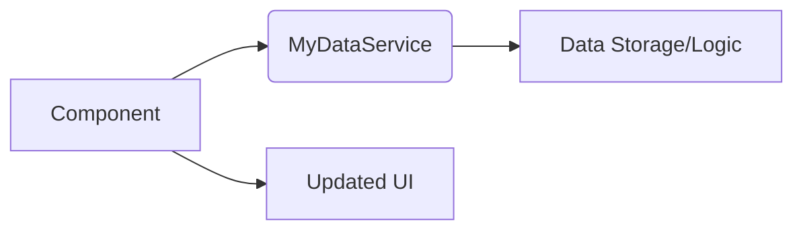

# <span style="color:#e67e22;">What we will learn in this post?</span>
<ul style='list-style-type: none; padding-left: 0;'>
<li><span style='color: #2980b9; font-size: 20px; font-weight: bold;'>👉</span> <span style='color: #2ecc71; font-size: 18px; font-weight: bold;'>Creating and Using Services</span></li>
<li><span style='color: #2980b9; font-size: 20px; font-weight: bold;'>👉</span> <span style='color: #2ecc71; font-size: 18px; font-weight: bold;'>Understanding Dependency Injection</span></li>
<li><span style='color: #2980b9; font-size: 20px; font-weight: bold;'>👉</span> <span style='color: #2ecc71; font-size: 18px; font-weight: bold;'>Singleton Services</span></li>
<li><span style='color: #2980b9; font-size: 20px; font-weight: bold;'>👉</span> <span style='color: #2ecc71; font-size: 18px; font-weight: bold;'>Conclusion!</span></li>
</ul>

# <span style="color:#e67e22">Angular Services: Sharing Data & Logic ✨</span>

Angular services are like helpful assistants that handle data and perform tasks for your components.  This keeps your components clean and reusable!  They're perfect for sharing data between components and centralizing business logic.

## <span style="color:#2980b9">Creating a Service 🛠️</span>

To create a service, use the Angular CLI:

```bash
ng generate service my-data-service
```

This creates a file named `my-data-service.service.ts`.  You'll define methods within it to handle data or logic.


### <span style="color:#8e44ad">Example: Data Sharing</span>

Let's create a service to manage a user's name:

```typescript
import { Injectable } from '@angular/core';

@Injectable({
  providedIn: 'root'
})
export class MyDataService {
  userName: string = 'Guest';

  setUserName(name: string) {
    this.userName = name;
  }

  getUserName() {
    return this.userName;
  }
}
```

## <span style="color:#2980b9">Using the Service 🚀</span>

Now, inject the service into your component:

```typescript
import { Component } from '@angular/core';
import { MyDataService } from './my-data-service.service';

@Component({
  selector: 'app-my-component',
  template: `<h1>Hello, {{ myDataService.getUserName() }}!</h1>`
})
export class MyComponent {
  constructor(public myDataService: MyDataService) {}
}
```

This component now uses the service to display the username.  Changing the name using `myDataService.setUserName()` will update the display.


## <span style="color:#2980b9">Diagrammatic Representation 📊</span>




* **Benefits:**  Improved code organization, reusability, maintainability, and easier testing.

* **More Info:** [Angular Docs on Services](https://angular.io/guide/service)


Remember to inject the service into your component's constructor using dependency injection.  This is the magic that makes services work seamlessly across your application! 🎉


# <span style="color:#e67e22">Understanding Dependency Injection in Angular 💉</span>

Dependency Injection (DI) is a design pattern that makes your Angular applications more modular, testable, and maintainable.  Think of it like this: instead of creating objects directly within your components, you *inject* them.  This allows for loose coupling and easier code reuse.


## <span style="color:#2980b9">The Role of Providers 📦</span>

Providers are like factories for your objects. They tell Angular how to create and configure the dependencies your components need.  You define providers in various places, including:

*   **Component level:**  To provide a service only to a specific component.
*   **Module level:** To provide a service to all components within that module.
*   **Application level:** To make a service available globally.

### <span style="color:#8e44ad">Example Provider</span>

```typescript
import { Injectable } from '@angular/core';

@Injectable({
  providedIn: 'root' // Makes it available globally
})
export class MyService {
  getData() {
    return 'Data from the service!';
  }
}
```


## <span style="color:#2980b9">The Injector System 🧙‍♂️</span>

The injector is Angular's mechanism for providing and retrieving dependencies. It's like a central registry that holds all the available services. When a component requests a dependency, the injector finds the appropriate provider and creates (or retrieves) the object.


### <span style="color:#8e44ad">Example Component using DI</span>

```typescript
import { Component } from '@angular/core';
import { MyService } from './my.service'; // Import the service

@Component({
  selector: 'app-my-component',
  template: `<h1>{{ myService.getData() }}</h1>`
})
export class MyComponent {
  constructor(private myService: MyService) { } // Inject the service
}
```

In this example, `MyComponent` *injects* an instance of `MyService` through its constructor.  Angular's injector handles the creation and provision of `MyService`.


## <span style="color:#2980b9">Benefits of Dependency Injection ✨</span>

*   **Improved Testability:** You can easily mock or stub dependencies during testing.
*   **Increased Reusability:** Services can be reused across multiple components.
*   **Better Maintainability:** Changes to one part of the application are less likely to affect other parts.
*   **Enhanced Code Organization:**  Clear separation of concerns leads to cleaner code.

---

**Further Learning:**

*   [Angular Docs on Dependency Injection](https://angular.io/guide/dependency-injection)


This simplified explanation gives you a good understanding of how DI works in Angular. Remember, mastering DI is crucial for building robust and scalable Angular applications! 🚀


# <span style="color:#e67e22">Singleton Services in Angular 🤝</span>

Singleton services in Angular are like special helpers that exist only once throughout your entire application.  Think of them as a single source of truth for specific data or functionality.  This is great for things like configurations, logging, or interacting with a single database connection.


## <span style="color:#2980b9">Lifecycle and Management 🔄</span>

### <span style="color:#8e44ad">Creation and Destruction</span>

A singleton service is created when it's first injected into a component.  After that, _the same instance_ is used everywhere else it's injected. It's destroyed only when the Angular application itself is destroyed.

### <span style="color:#8e44ad">Effective Management</span>

*   **Avoid Direct Manipulation:** Don't directly access or modify the singleton service's internal state from different components.  Use methods within the service to interact with its data.
*   **Immutability (where possible):**  Design your service to use immutable data structures whenever feasible. This prevents unintended side effects.
*   **Testability:** Design your service to be easily testable.  This means avoiding dependencies that are difficult to mock or stub.


## <span style="color:#2980b9">Example: Config Service</span>

```typescript
import { Injectable } from '@angular/core';

@Injectable({
  providedIn: 'root' // Makes it a singleton
})
export class ConfigService {
  apiUrl = 'https://api.example.com';

  getApiUrl() {
    return this.apiUrl;
  }
}
```

In this example, `providedIn: 'root'` ensures that there is only ever one instance of `ConfigService`.

**Remember:** Overuse of singletons can lead to tight coupling and make testing harder. Use them judiciously!

[Angular Documentation on Services](https://angular.io/guide/services) 🔗


<h1><span style='color:#e67e22'>Conclusion</span></h1>

So there you have it!  We've covered a lot of ground today, and hopefully, you found it helpful and insightful.  We're always striving to improve, and your thoughts are super valuable to us! 😊  What did you think?  Did we miss anything?  Let us know your comments, feedback, or suggestions in the comments section below – we'd love to hear from you! 👇  Let's keep the conversation going! 🎉


