# <span style="color:#e67e22;">What we will learn in this post?</span>

<ul style='list-style-type: none; padding-left: 0;'>
<li><span style='color: #2980b9; font-size: 20px; font-weight: bold;'>👉</span> <span style='color: #2ecc71; font-size: 18px; font-weight: bold;'>Introduction to Git</span></li>
<li><span style='color: #2980b9; font-size: 20px; font-weight: bold;'>👉</span> <span style='color: #2ecc71; font-size: 18px; font-weight: bold;'>Branching and Merging Strategies</span></li>
<li><span style='color: #2980b9; font-size: 20px; font-weight: bold;'>👉</span> <span style='color: #2ecc71; font-size: 18px; font-weight: bold;'>Collaboration using GitHub/GitLab</span></li>
<li><span style='color: #2980b9; font-size: 20px; font-weight: bold;'>👉</span> <span style='color: #2ecc71; font-size: 18px; font-weight: bold;'>GitOps Principles</span></li>
<li><span style='color: #2980b9; font-size: 20px; font-weight: bold;'>👉</span> <span style='color: #2ecc71; font-size: 18px; font-weight: bold;'>Useful Command-Line Tools for Version Control</span></li>
<li><span style='color: #2980b9; font-size: 20px; font-weight: bold;'>👉</span> <span style='color: #2ecc71; font-size: 18px; font-weight: bold;'>Conclusion!</span></li>
</ul>

## <span style="color:#2980b9;">Introduction to Git</span>

Git is a distributed version control system that allows developers to track changes in their codebase. It is widely used for both open-source and commercial software development. In this section, we will cover the basics of Git, including how to set up a repository, commit changes, and push to a remote repository.

### Setting Up Git

To start using Git, you need to install it on your computer. You can download Git from [git-scm.com](https://git-scm.com/). After installation, configure your Git username and email:

```bash
git config --global user.name "Your Name"
git config --global user.email "your.email@example.com"
```

## <span style="color:#2980b9">Getting Started 🚀</span>

### <span style="color:#8e44ad">Initializing a Repository</span>

First, you need a Git _repository_, which is basically a folder where Git will store your project's history. You initialize it using `git init`. This is like opening a new notebook.

### <span style="color:#8e44ad">Making Commits 📝</span>

After making changes, you _stage_ them (select what changes you want to save) using `git add`. Think of this as deciding which parts of your notebook you want to include in your next entry. Then, you _commit_ your staged changes with `git commit -m "Your message"`, creating a snapshot of your project at that point in time. This is like writing a date and description next to a section in your notebook.

To push your changes to a remote repository, you need to add the remote URL:

```bash
git remote add origin https://github.com/yourusername/your-repo.git
```

Then push the changes:

```bash
git push -u origin master
```

## <span style="color:#2980b9">Working with Branches 🌳</span>

Branches let you work on multiple features simultaneously without affecting each other. Think of them as separate "notebook pages" where you can explore different ideas. You create a branch with `git checkout -b <branch_name>`. This is like opening a new page in your notebook for a specific task.

## <span style="color:#2980b9">Remote Repositories & Pushing 🌎</span>

To share your work, you use a _remote repository_ (like GitHub, GitLab, or Bitbucket). You _push_ your commits to the remote using `git push origin <branch_name>`. This is like sharing your notebook with collaborators.



```mermaid
graph LR
    A["📂 Create Repository"] --> B{"⚙️ Make Changes"};
    B --> C["📝 Stage Changes (git add)"];
    C --> D["✅ Commit Changes (git commit)"];
    D --> E["🌐 Push to Remote (git push)"];

    %% Class Definitions
    classDef createRepoStyle fill:#FFC300,stroke:#FF5733,color:#000000,font-size:14px,stroke-width:2px,rx:10px,shadow:3px;
    classDef changesStyle fill:#FF5733,stroke:#C70039,color:#FFFFFF,font-size:14px,stroke-width:2px,rx:10px,shadow:3px;
    classDef stageStyle fill:#33FF57,stroke:#27AE60,color:#FFFFFF,font-size:14px,stroke-width:2px,rx:10px,shadow:3px;
    classDef commitStyle fill:#337BFF,stroke:#1F618D,color:#FFFFFF,font-size:14px,stroke-width:2px,rx:10px,shadow:3px;
    classDef pushStyle fill:#9B59B6,stroke:#8E44AD,color:#FFFFFF,font-size:14px,stroke-width:2px,rx:10px,shadow:3px;

    %% Apply Classes
    class A createRepoStyle;
    class B changesStyle;
    class C stageStyle;
    class D commitStyle;
    class E pushStyle;

```

**Key Concepts in a Nutshell:**

- `git init`: Creates a new Git repository.
- `git add`: Stages changes for the next commit.
- `git commit`: Saves a snapshot of your changes.
- `git push`: Uploads your commits to a remote repository.
- `git checkout -b <branch_name>`: Creates and switches to a new branch.

**Further Learning:**

- [GitHub Learning Lab](https://lab.github.com/)
- [Atlassian Git Tutorial](https://www.atlassian.com/git/tutorials)

This simple introduction will get you started. Git is powerful, but mastering it takes practice! Don't be afraid to experiment and explore its features. Remember, it's all about managing your project's history effectively.

# <span style="color:#e67e22">Git Branching Strategies: A Friendly Guide 🤝</span>

Git branching is like having multiple versions of your project running simultaneously. It's crucial for teamwork and managing changes effectively. Let's explore some popular strategies:

## <span style="color:#2980b9">Feature Branches ✨</span>

- **What:** Isolate new features from the main codebase (`main` or `master`).
- **When:** For any new functionality, bug fixes (sometimes), or experiments.
- **Why:** Prevents unstable code from impacting the main project. Allows parallel development.

```mermaid
 graph TD
  A["💻 Main Branch"] --> B["🌿 Feature Branch"];
  B --> C{"🔄 Merge Request"};
  C --> A;

  %% Class Definitions
  classDef mainBranchStyle fill:#FFC300,stroke:#FF5733,color:#000000,font-size:14px,stroke-width:2px,rx:10px,shadow:3px;
  classDef featureBranchStyle fill:#33FF57,stroke:#27AE60,color:#FFFFFF,font-size:14px,stroke-width:2px,rx:10px,shadow:3px;
  classDef mergeRequestStyle fill:#337BFF,stroke:#1F618D,color:#FFFFFF,font-size:14px,stroke-width:2px,rx:10px,shadow:3px;

  %% Apply Classes
  class A mainBranchStyle;
  class B featureBranchStyle;
  class C mergeRequestStyle;

```



### <span style="color:#8e44ad">Example:</span> Adding a new login system. Create a `feature/new-login` branch, develop it, and merge it back into `main` once ready

## <span style="color:#2980b9">Release Branches 📦</span>

- **What:** Branches created from `main` to prepare a specific release.
- **When:** When a feature set is complete and ready for release.
- **Why:** Allows for bug fixes and minor improvements in a stable environment _without_ affecting active development on `main`.

### <span style="color:#8e44ad">Example:</span> Version 1.0 is ready. Create a `release/v1.0` branch. Fix any last-minute bugs. Once ready, release `v1.0` and merge it back into `main`

## <span style="color:#2980b9">Hotfix Branches 🔥</span>

- **What:** Urgent fixes for bugs in a released version.
- **When:** A critical bug appears in a live product.
- **Why:** Allows rapid patching of live systems without disrupting ongoing development.

### <span style="color:#8e44ad">Example:</span> A critical security flaw in `v1.0` is discovered. Create `hotfix/security-patch`, fix the bug, and merge it into both `release/v1.0` and `main`

## <span style="color:#2980b9">Popular Workflows</span>

- **Git Flow:** A robust model with distinct branches for development, features, releases, and hotfixes. [Learn more](https://www.atlassian.com/git/tutorials/comparing-workflows/gitflow-workflow)
- **GitHub Flow:** Simpler. All work happens on feature branches directly merging into `main`. [Learn more](https://guides.github.com/introduction/flow/)
- **Trunk-Based Development:** Focuses on frequent integration into `main`. Feature branches are short-lived. [Learn more](https://trunkbaseddevelopment.com/)

## <span style="color:#2980b9">Merging and Conflict Resolution 🛠️</span>

Merging combines branches. Conflicts occur when the same lines of code are changed in different branches. Use `git mergetool` to visually resolve these.

## <span style="color:#2980b9">Why Proper Branch Management Matters 🤝</span>

- **Collaboration:** Avoids code chaos and ensures everyone works on a consistent version.
- **Stability:** Prevents breaking the main codebase with unstable changes.
- **History:** Maintains a clean and understandable project history.

Remember, choosing the right branching strategy depends on your team size, project complexity, and release cycle. Experiment and find what works best for you!

# <span style="color:#e67e22">GitHub & GitLab: Teamwork for Software Stars ✨</span>

GitHub and GitLab are like online hubs for software developers to work together seamlessly. They use Git, a powerful version control system, to track code changes and manage projects.

## <span style="color:#2980b9">Key Features for Awesome Collaboration 🤝</span>

- **Forking Repositories:** Imagine copying a project to your own space to experiment. Forking lets you make changes without affecting the original. Once happy, you can send a "pull request" to merge your changes back.

- **Pull Requests (PRs):** These are like proposals for code changes. You create a PR to suggest your improvements to the main project. Teammates review your code, provide feedback, and approve the changes before merging.

- **Issue Tracking:** Need to report a bug or add a feature? Issues let you track tasks, assign them to people, and follow their progress. Think of it as a collaborative to-do list.

### <span style="color:#8e44ad">Creating & Merging a Pull Request</span>

1. **Fork:** Copy the project.
2. **Clone:** Download the forked copy to your computer.
3. **Code Changes:** Make your amazing improvements!
4. **Commit:** Save your changes.
5. **Push:** Upload your changes to your forked repository.
6. **Pull Request:** Send a request to merge your changes into the original project.
7. **Review & Merge:** Teammates review, discuss, and (hopefully!) approve your PR. Once approved, your changes are merged!

```mermaid
graph TD
    A["🍴 Fork Repository"] --> B["💻 Clone to Computer"];
    B --> C{"🛠️ Make Changes"};
    C --> D["📦 Commit Changes"];
    D --> E["⬆️ Push to Fork"];
    E --> F["📩 Create Pull Request"];
    F --> G{"🔍 Review & Merge"};

    %% Class Definitions
    classDef forkStyle fill:#FFC300,stroke:#FF5733,color:#000000,font-size:14px,stroke-width:2px,rx:10px,shadow:3px;
    classDef cloneStyle fill:#33FF57,stroke:#27AE60,color:#FFFFFF,font-size:14px,stroke-width:2px,rx:10px,shadow:3px;
    classDef changeStyle fill:#337BFF,stroke:#1F618D,color:#FFFFFF,font-size:14px,stroke-width:2px,rx:10px,shadow:3px;
    classDef commitStyle fill:#FF5733,stroke:#C70039,color:#FFFFFF,font-size:14px,stroke-width:2px,rx:10px,shadow:3px;
    classDef pushStyle fill:#900C3F,stroke:#581845,color:#FFFFFF,font-size:14px,stroke-width:2px,rx:10px,shadow:3px;
    classDef pullRequestStyle fill:#DAF7A6,stroke:#28B463,color:#000000,font-size:14px,stroke-width:2px,rx:10px,shadow:3px;
    classDef reviewStyle fill:#C39BD3,stroke:#7D3C98,color:#FFFFFF,font-size:14px,stroke-width:2px,rx:10px,shadow:3px;

    %% Apply Classes
    class A forkStyle;
    class B cloneStyle;
    class C changeStyle;
    class D commitStyle;
    class E pushStyle;
    class F pullRequestStyle;
    class G reviewStyle;

```



## <span style="color:#2980b9">Integrating with Project Management 🚀</span>

These platforms integrate smoothly with tools like Jira, Trello, and Asana. You can link issues in GitHub/GitLab to tasks in your project management tool for a complete workflow.

## <span style="color:#2980b9">CI/CD Pipelines ⚙️</span>

Automate testing and deployment. Every code change can trigger automated tests and even automatic deployment to servers, saving time and ensuring quality.

**Learn More:**

- [GitHub Documentation](https://docs.github.com/)
- [GitLab Documentation](https://docs.gitlab.com/)

By using these features effectively, teams can improve code quality, boost productivity, and build amazing software together! 🎉

# <span style="color:#e67e22">GitOps: Managing Everything with Git 💻</span>

GitOps is a way of managing and deploying software that uses Git—that familiar code repository—as the single source of truth. Think of it as a super-powered version control system for _everything_: your code, your infrastructure, and your entire application lifecycle.

## <span style="color:#2980b9">How GitOps Works ✨</span>

Imagine a "desired state" of your application defined in a Git repository. GitOps uses this definition to automate everything. Changes to your Git repo (like adding a new feature or updating infrastructure) trigger automated processes that update your live system to match that desired state.

### <span style="color:#8e44ad">The Magic of Automation 🪄</span>

- **Deployment:** Pushing code to Git automatically triggers deployment pipelines.
- **Monitoring:** Systems continuously check if the live system matches the Git definition. Discrepancies trigger alerts.
- **Rollbacks:** Reverting to a previous state is as simple as reverting a Git commit!

## <span style="color:#2980b9">Benefits of GitOps 🚀</span>

- **Continuous Delivery:** Faster and more reliable releases.
- **Automated Rollbacks:** Quickly recover from errors.
- **Scalability:** Easily manage complex applications and infrastructure.
- **Improved Collaboration:** Everyone works from the same source of truth.
- **Auditing and Traceability:** Full history of all changes.

## <span style="color:#2980b9">Real-World Examples 🌎</span>

Many companies use GitOps, including large-scale deployments on Kubernetes. Imagine a team deploying a new microservice: a change to the configuration files in Git automatically triggers a deployment to the Kubernetes cluster. If something goes wrong, rolling back is as easy as reverting the Git commit.

```mermaid
graph TD
    A["📂 Git Repository (Desired State)"] --> B{"🛠️ Changes"};
    B --> C["🚀 Automated Deployment Pipeline"];
    C --> D["🌐 Live System (Actual State)"];
    D --> E["📊 Monitoring"];
    E -- "⚠️ Discrepancy" --> F["🔄 Alert/Rollback"];
    F --> A;

    %% Class Definitions
    classDef repoStyle fill:#FFC300,stroke:#FF5733,color:#000000,font-size:14px,stroke-width:2px,rx:10px,shadow:3px;
    classDef changeStyle fill:#33FF57,stroke:#27AE60,color:#FFFFFF,font-size:14px,stroke-width:2px,rx:10px,shadow:3px;
    classDef pipelineStyle fill:#337BFF,stroke:#1F618D,color:#FFFFFF,font-size:14px,stroke-width:2px,rx:10px,shadow:3px;
    classDef liveStyle fill:#FF5733,stroke:#C70039,color:#FFFFFF,font-size:14px,stroke-width:2px,rx:10px,shadow:3px;
    classDef monitorStyle fill:#DAF7A6,stroke:#28B463,color:#000000,font-size:14px,stroke-width:2px,rx:10px,shadow:3px;
    classDef alertStyle fill:#C39BD3,stroke:#7D3C98,color:#FFFFFF,font-size:14px,stroke-width:2px,rx:10px,shadow:3px;

    %% Apply Classes
    class A repoStyle;
    class B changeStyle;
    class C pipelineStyle;
    class D liveStyle;
    class E monitorStyle;
    class F alertStyle;

```

## <span style="color:#2980b9">Simplified GitOps Workflow Diagram</span>



For more in-depth information, check out these resources:

- [Weaveworks GitOps](https://www.weave.works/technologies/gitops/)
- [Argo CD](https://argoproj.io/docs/argo-cd/) (A popular GitOps tool)

By embracing GitOps, you're not just using Git; you're _leveraging_ its power to build a more reliable, efficient, and scalable DevOps process. It’s a paradigm shift towards a more declarative and automated approach to managing your infrastructure and applications.

# <span style="color:#e67e22">Boosting Your Git Workflow with Command-Line Tools ✨</span>

Git can be powerful, but command-line tools make it even better! Let's explore some helpful ones.

## <span style="color:#2980b9">Inspecting Changes & History 🔍</span>

- **`git diff`**: Shows changes between commits or your working directory and the staging area. `git diff` shows _uncommitted_ changes. `git diff --cached` shows changes _staged_ for your next commit.

- **`git log`**: Displays your commit history. `git log --oneline --graph` provides a concise, graph-based view. `git log --author="Your Name"` filters by author.

### <span style="color:#8e44ad">Example: Viewing Commit History</span>

```bash
git log --oneline --graph
```

## <span style="color:#2980b9">Managing Your Work 🗂️</span>

- **`git stash`**: Temporarily saves uncommitted changes. `git stash push -u "My stash"` saves changes (including untracked files). `git stash pop` restores the latest stash.

- **`git rebase`**: Integrates changes from one branch into another _by rewriting the commit history_. Useful for cleaning up your branch before merging. _(Use with caution! This modifies history.)_

### <span style="color:#8e44ad">Example: Stashing Changes</span>

```bash
git stash push -u "Fixing a bug"
# ... work on something else ...
git stash pop
```

## <span style="color:#2980b9">Visualizing Your Repository 🖼️</span>

- **`tig`**: A text-based Git interface. It provides a visual representation of branches, commits, and files, making navigation and review much easier. [Learn more about Tig](https://jonasjacek.github.io/tig/)

- **`gitk`**: A graphical Git viewer (requires a GUI). It presents a similar visual overview as `tig` but with a graphical interface.

```mermaid
graph LR
    A["🏁 Start"] --> B{"🛠️ Changes Made?"};
    B -- "✅ Yes" --> C["📂 git add ."];
    C --> D["📝 git commit -m 'Message'"];
    D --> E["📤 git push"];
    B -- "❌ No" --> F["🏁 End"];

    %% Class Definitions
    classDef startStyle fill:#FFC300,stroke:#FF5733,color:#000000,font-size:14px,stroke-width:2px,rx:10px,shadow:3px;
    classDef decisionStyle fill:#33FF57,stroke:#27AE60,color:#FFFFFF,font-size:14px,stroke-width:2px,rx:10px,shadow:3px;
    classDef commandStyle fill:#337BFF,stroke:#1F618D,color:#FFFFFF,font-size:14px,stroke-width:2px,rx:10px,shadow:3px;
    classDef endStyle fill:#FF5733,stroke:#C70039,color:#FFFFFF,font-size:14px,stroke-width:2px,rx:10px,shadow:3px;

    %% Apply Classes
    class A startStyle;
    class B decisionStyle;
    class C commandStyle;
    class D commandStyle;
    class E commandStyle;
    class F endStyle;

```

## <span style="color:#2980b9">A Simple Workflow Diagram</span>



By mastering these tools, you'll significantly improve your Git efficiency and understanding! Remember to consult the official Git documentation for detailed explanations and advanced options. Happy coding! 🎉

<h1><span style='color:#e67e22'>Conclusion</span></h1>

So there you have it! We hope you found this insightful and helpful 😊. We're always looking to improve, so we'd love to hear your thoughts! What did you think of this post? Any questions, feedback, or brilliant suggestions? Let us know in the comments below 👇. We can't wait to chat with you! 🎉
