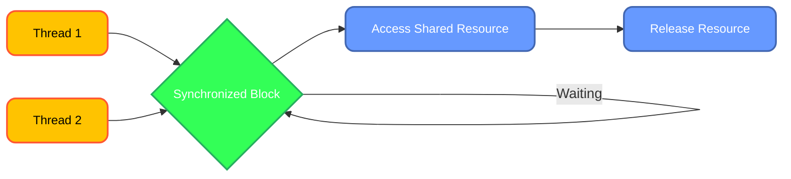

# <span style="color:#e67e22;">What we will learn in this post?</span>

<ul style='list-style-type: none; padding-left: 0;'>
<li><span style='color: #2980b9; font-size: 20px; font-weight: bold;'>👉</span> <span style='color: #2ecc71; font-size: 18px; font-weight: bold;'>Java Synchronization</span></li>
<li><span style='color: #2980b9; font-size: 20px; font-weight: bold;'>👉</span> <span style='color: #2ecc71; font-size: 18px; font-weight: bold;'>Importance of Thread Synchronization in Java</span></li>
<li><span style='color: #2980b9; font-size: 20px; font-weight: bold;'>👉</span> <span style='color: #2ecc71; font-size: 18px; font-weight: bold;'>Method and Block Synchronization in Java</span></li>
<li><span style='color: #2980b9; font-size: 20px; font-weight: bold;'>👉</span> <span style='color: #2ecc71; font-size: 18px; font-weight: bold;'>Local Frameworks vs Thread Synchronization</span></li>
<li><span style='color: #2980b9; font-size: 20px; font-weight: bold;'>👉</span> <span style='color: #2ecc71; font-size: 18px; font-weight: bold;'>Atomic vs Volatile in Java</span></li>
<li><span style='color: #2980b9; font-size: 20px; font-weight: bold;'>👉</span> <span style='color: #2ecc71; font-size: 18px; font-weight: bold;'>Atomic vs Synchronized in Java</span></li>
<li><span style='color: #2980b9; font-size: 20px; font-weight: bold;'>👉</span> <span style='color: #2ecc71; font-size: 18px; font-weight: bold;'>Deadlock in Multithreading</span></li>
<li><span style='color: #2980b9; font-size: 20px; font-weight: bold;'>👉</span> <span style='color: #2ecc71; font-size: 18px; font-weight: bold;'>Deadlock Prevention and Avoidance</span></li>
<li><span style='color: #2980b9; font-size: 20px; font-weight: bold;'>👉</span> <span style='color: #2ecc71; font-size: 18px; font-weight: bold;'>Lock vs Monitor in Concurrency</span></li>
<li><span style='color: #2980b9; font-size: 20px; font-weight: bold;'>👉</span> <span style='color: #2ecc71; font-size: 18px; font-weight: bold;'>Reentrant Lock</span></li>
<li><span style='color: #2980b9; font-size: 20px; font-weight: bold;'>👉</span> <span style='color: #2ecc71; font-size: 18px; font-weight: bold;'>Conclusion!</span></li>
</ul>

# <span style="color:#e67e22">Java Synchronization: Keeping Threads in Harmony 🤝</span>

Imagine multiple cooks trying to use the same oven at once! Chaos, right? That's what happens in Java without synchronization when multiple threads access shared resources simultaneously. Synchronization prevents this chaos by ensuring only _one_ thread can access a shared resource at a time. This is crucial for data integrity and program stability.

## <span style="color:#2980b9">Why is Synchronization Important?</span>

Without synchronization, you can encounter issues like _data corruption_ and _race conditions_. A race condition occurs when the final result depends on which thread finishes first, leading to unpredictable behavior. Synchronization is like a traffic controller, managing access to shared resources and preventing these problems.

### <span style="color:#8e44ad">Synchronized Methods</span>

A simple way to synchronize is by using the `synchronized` keyword with a method:

```java
public class Counter {
    private int count = 0;

    public synchronized void increment() {  // Only one thread can enter this at a time
        count++;
    }
}
```

This ensures that only one thread can execute the `increment()` method at a time.

### <span style="color:#8e44ad">Synchronized Blocks</span>

For finer-grained control, use synchronized blocks:

```java
public class Counter {
    private int count = 0;
    private Object lock = new Object(); // We create a lock

    public void increment() {
        synchronized (lock) { //Only one thread can access this block at a time
            count++;
        }
    }
}
```

Here, only one thread can access the code within the `synchronized` block at a time, using `lock` as the monitor.

## <span style="color:#2980b9">Illustrative Diagram</span>

```mermaid
graph LR
    A[Thread 1] --> B(Synchronized Block);
    C[Thread 2] --> D(Waiting);
    B --> E[Resource Accessed];
    E --> F(Synchronized Block Exited);
    F --> G[Thread 2 gets access];

    classDef threadStyle fill:#FFC300,stroke:#FF5733,color:#000000,font-size:14px,stroke-width:2px,rx:10px,shadow:3px;
    classDef syncStyle fill:#66CDAA,stroke:#483D8B,color:#FFFFFF,font-size:14px,stroke-width:2px,rx:10px,shadow:3px;
    classDef waitStyle fill:#FF69B4,stroke:#FF1493,color:#000000,font-size:14px,stroke-width:2px,rx:10px,shadow:3px;
    classDef accessStyle fill:#90EE90,stroke:#006400,color:#000000,font-size:14px,stroke-width:2px,rx:10px,shadow:3px;


    class A, C threadStyle;
    class B, F syncStyle;
    class D waitStyle;
    class E accessStyle;


```

This diagram shows how synchronization works. Thread 1 accesses the synchronized block and the resource. Thread 2 must wait until Thread 1 releases the lock.

- **Key takeaway:** Synchronization is essential for managing concurrent access to shared resources in Java, preventing data corruption and ensuring program correctness. Choose between synchronized methods and blocks based on the level of granularity needed.

For more in-depth information, check out these resources:

- [Oracle's Java Concurrency Tutorial](https://docs.oracle.com/javase/tutorial/essential/concurrency/)
- [Baeldung's article on Java Synchronization](https://www.baeldung.com/java-synchronization)

Remember, proper synchronization is crucial for building robust and reliable multithreaded applications! 🎉

# <span style="color:#e67e22">Thread Synchronization in Java 🧵</span>

Imagine multiple cooks trying to bake a cake simultaneously using the same ingredients! Chaos, right? That's what happens in Java without thread synchronization when multiple threads access shared resources. Synchronization prevents this "recipe disaster" by ensuring orderly access.

## <span style="color:#2980b9">Why is it important? 🤔</span>

Threads are independent units of execution within a program. If multiple threads modify the same data concurrently, it can lead to _data inconsistency_ and unexpected results. This is where thread synchronization steps in to save the day! ✨

### <span style="color:#8e44ad">Preventing Data Inconsistency</span>

Thread synchronization mechanisms, like `synchronized` blocks or methods, ensure that only one thread can access a shared resource at a time. This prevents race conditions where threads interfere with each other's actions.

**Example using `synchronized` block:**

```java
class Counter {
  private int count = 0;

  public synchronized void increment() { // synchronized method
    count++;
  }
}
```

**Example using `synchronized` method:**

```java
class Counter {
    private int count = 0;
    public synchronized void increment() { //synchronized method
        count++;
    }
}
```

In both examples, only one thread can execute the `increment()` method at any given time, preventing conflicts.

## <span style="color:#2980b9">Achieving Thread Safety 💪</span>

Thread safety means that your shared resources are protected from concurrent access issues. Synchronization helps you achieve this by controlling access, thus preventing data corruption and ensuring reliable results.

### <span style="color:#8e44ad">Benefits of Thread Synchronization</span>

- **Data Integrity:** Prevents data corruption and inconsistencies.
- **Predictable Behavior:** Ensures that your program behaves as expected, even with multiple threads.
- **Reliable Results:** Produces accurate and consistent outputs.

**Diagram illustrating synchronized access:**

---

---



For more information on thread synchronization in Java, you can check out [Oracle's Java Tutorials](https://docs.oracle.com/javase/tutorial/essential/concurrency/index.html). Happy coding! 🎉

# <span style="color:#e67e22">Java Synchronization: Methods vs. Blocks 🤝</span>

Java uses synchronization to manage access to shared resources among multiple threads, preventing data corruption. Two primary mechanisms achieve this: method synchronization and block synchronization.

## <span style="color:#2980b9">Method Synchronization 🔒</span>

This synchronizes an entire method. Only one thread can execute a synchronized method on a particular object at a time.

### <span style="color:#8e44ad">Example</span>

```java
public class Counter {
    private int count = 0;

    public synchronized void increment() { // Synchronized method
        count++;
    }
}
```

- **Impact:** Simple, but can be less efficient if the entire method doesn't need synchronization.

## <span style="color:#2980b9">Block Synchronization 🧱</span>

This synchronizes only a specific code block within a method, offering finer-grained control.

### <span style="color:#8e44ad">Example</span>

```java
public class Counter {
    private int count = 0;
    public void increment() {
        synchronized(this) { // Synchronized block
            count++;
        }
    }
}
```

- **Impact:** More efficient than method synchronization as it only locks the critical section.

## <span style="color:#2980b9">Key Differences 🤔</span>

| Feature     | Method Synchronization | Block Synchronization |
| ----------- | ---------------------- | --------------------- |
| Scope       | Entire method          | Specific code block   |
| Granularity | Coarse-grained         | Fine-grained          |
| Efficiency  | Less efficient         | More efficient        |
| Flexibility | Less flexible          | More flexible         |

## <span style="color:#2980b9">Use Cases 💡</span>

- **Method Synchronization:** Suitable for methods with entirely shared resources.
- **Block Synchronization:** Ideal for situations needing to lock only specific portions of a method, improving concurrency.

[More on Java Concurrency](https://docs.oracle.com/javase/tutorial/essential/concurrency/)

**In essence:** Choose method synchronization for simplicity if the entire method requires synchronization. Opt for block synchronization for better efficiency and control when only parts of a method need protection. Remember, excessive synchronization can hinder performance, so use it judiciously!

# <span style="color:#e67e22">Java Concurrency: Local Frameworks vs. Thread Synchronization 🤝</span>

Java offers several ways to manage concurrent execution, preventing data corruption. Let's compare local frameworks (like `ThreadLocal`) and traditional thread synchronization mechanisms (like `synchronized` blocks).

## <span style="color:#2980b9">ThreadLocal: Data Isolation 🔒</span>

`ThreadLocal` provides _thread-local_ storage. Each thread gets its own copy of a variable. This eliminates the need for explicit synchronization because threads don't share the same data.

### <span style="color:#8e44ad">Example:</span>

```java
ThreadLocal<String> user = ThreadLocal.withInitial(() -> "Guest");

// Each thread gets its own "user" variable
user.set("Alice"); // In thread 1
System.out.println(user.get()); // Output: Alice (in thread 1)

// In another thread
user.set("Bob"); // In thread 2
System.out.println(user.get()); // Output: Bob (in thread 2)
```

## <span style="color:#2980b9">Synchronized Blocks: Shared Data Protection 🛡️</span>

`synchronized` blocks or methods ensure that only one thread can access a shared resource at a time. This prevents race conditions where multiple threads modify data concurrently, leading to inconsistencies.

### <span style="color:#8e44ad">Example:</span>

```java
public class Counter {
    private int count = 0;

    public synchronized void increment() { // synchronized method
        count++;
    }
}
```

Here, only one thread can execute `increment()` at a time, ensuring atomic updates to `count`.

## <span style="color:#2980b9">Comparison ⚖️</span>

- **ThreadLocal:** Simpler for managing per-thread data; avoids synchronization overhead but doesn't help with shared data modification.
- **synchronized:** Handles shared resource access; more complex, introduces potential performance bottlenecks if overused.

Choosing the right approach depends on your application's needs. For independent per-thread data, `ThreadLocal` is ideal. For shared mutable data, `synchronized` (or other concurrency utilities like `ReentrantLock`) are necessary to maintain data integrity.

[More on ThreadLocal](https://docs.oracle.com/javase/7/docs/api/java/lang/ThreadLocal.html)
[More on Synchronization](https://docs.oracle.com/javase/tutorial/essential/concurrency/sync.html)

---

**Note:** For more complex concurrency scenarios, consider using higher-level concurrency utilities like `ExecutorService`, `ConcurrentHashMap`, etc., provided in Java's `java.util.concurrent` package. These offer better performance and scalability.

# <span style="color:#e67e22">Atomic vs. Volatile Variables in Java 🧵</span>

Java offers two crucial mechanisms for managing shared variables in concurrent programs: atomic variables and volatile variables. Let's explore their differences.

## <span style="color:#2980b9">Atomic Variables 🎯</span>

Atomic variables guarantee _atomicity_—operations on them are indivisible. This means multiple threads accessing an atomic variable will never see intermediate states. Think of it like a single, uninterruptible action.

### <span style="color:#8e44ad">Example:</span>

```java
import java.util.concurrent.atomic.AtomicInteger;

AtomicInteger counter = new AtomicInteger(0);

// Incrementing the counter is atomic
counter.incrementAndGet();
```

- **Guarantees:** Atomicity of operations (e.g., increment, decrement, compare-and-swap). No data races.

## <span style="color:#2980b9">Volatile Variables 🚦</span>

Volatile variables ensure _visibility_. Changes made by one thread to a volatile variable are immediately visible to other threads. However, they _don't_ guarantee atomicity for complex operations.

### <span style="color:#8e44ad">Example:</span>

```java
volatile boolean stop = false;

// Multiple threads can see changes to 'stop' immediately.
```

- **Guarantees:** Visibility of changes across threads. No caching of values by threads.

## <span style="color:#2980b9">Key Differences Summarized 📝</span>

| Feature        | Atomic Variable                                    | Volatile Variable                                |
| -------------- | -------------------------------------------------- | ------------------------------------------------ |
| **Atomicity**  | Guaranteed                                         | Not guaranteed                                   |
| **Visibility** | Guaranteed                                         | Guaranteed                                       |
| **Use Cases**  | Incrementing counters, managing shared data safely | Signaling, simple flags indicating program state |

## <span style="color:#2980b9">When to Use Which 🤔</span>

- Use **atomic variables** when you need both atomicity and visibility for complex operations on shared data.
- Use **volatile variables** for simple flags or signals where atomicity isn't crucial, but visibility is essential.

Using the wrong type can lead to subtle concurrency bugs! Choose carefully based on your specific needs.

[More on Java Concurrency](https://docs.oracle.com/javase/tutorial/essential/concurrency/)

[More on Atomic Classes](https://docs.oracle.com/javase/8/docs/api/java/util/concurrent/atomic/package-summary.html)

This information should provide a clear understanding of the differences between atomic and volatile variables in Java. Remember that choosing the correct approach significantly impacts the correctness and performance of your concurrent applications.

# <span style="color:#e67e22">Atomic Variables vs. Synchronized Blocks in Java 🧵</span>

Java offers two primary mechanisms for managing concurrent access to shared variables: atomic variables and synchronized blocks. Let's compare them!

## <span style="color:#2980b9">Atomic Variables ⚛️</span>

Atomic variables provide _atomic_ operations, meaning operations are indivisible and thread-safe. They guarantee that a single thread completes an operation before another starts.

### <span style="color:#8e44ad">Advantages</span>

- **Simplicity:** Easier to use than synchronized blocks for simple update scenarios.
- **Performance:** Often faster for simple operations as they avoid the overhead of acquiring and releasing locks.

### <span style="color:#8e44ad">Code Example</span>

```java
import java.util.concurrent.atomic.AtomicInteger;

AtomicInteger counter = new AtomicInteger(0);
counter.incrementAndGet(); // Atomic increment
```

### <span style="color:#8e44ad">Use Cases</span>

- Incrementing/decrementing counters.
- Simple updates to shared variables where atomicity is sufficient.

## <span style="color:#2980b9">Synchronized Blocks 🔒</span>

Synchronized blocks use _locks_ to control access to shared resources. Only one thread can execute a synchronized block at a time.

### <span style="color:#8e44ad">Advantages</span>

- **Flexibility:** Can protect multiple operations within a single block.
- **Complex Scenarios:** Suitable for managing access to multiple shared variables or complex operations.

### <span style="color:#8e44ad">Code Example</span>

```java
public class Counter {
    private int count = 0;

    public synchronized void increment() {
        count++;
    }
}
```

### <span style="color:#8e44ad">Use Cases</span>

- Protecting multiple operations on shared data.
- Managing access to complex data structures.

## <span style="color:#2980b9">Performance Implications ⏱️</span>

- Atomic variables are generally faster for simple operations due to lower overhead.
- Synchronized blocks can lead to contention if multiple threads frequently try to acquire the lock, impacting performance.

## <span style="color:#2980b9">Choosing the Right Approach 🤔</span>

Use atomic variables for simple, single-variable updates. For more complex scenarios or multiple shared variables, synchronized blocks provide better control and safety. Consider the trade-off between simplicity and performance.

[More on Atomic Variables](https://docs.oracle.com/javase/8/docs/api/java/util/concurrent/atomic/package-summary.html)
[More on Synchronization](https://docs.oracle.com/javase/tutorial/essential/concurrency/sync.html)

# <span style="color:#e67e22">Deadlock in Multithreading 🤝</span>

Deadlock occurs when two or more threads are blocked forever, waiting for each other to release the resources that they need. It's like a traffic jam where every car is waiting for the cars in front to move, but none can! 🚗🚧

## <span style="color:#2980b9">Causes of Deadlock</span>

Deadlock arises from a combination of four necessary conditions:

- **Mutual Exclusion:** A resource can only be held by one thread at a time.
- **Hold and Wait:** A thread holding at least one resource is waiting to acquire additional resources held by other threads.
- **No Preemption:** A resource can only be released voluntarily by the thread holding it.
- **Circular Wait:** There exists a set of threads {T1, T2, ..., Tn} such that T1 is waiting for a resource held by T2, T2 is waiting for a resource held by T3, ..., Tn is waiting for a resource held by T1.

### <span style="color:#8e44ad">Implications of Deadlock</span>

Deadlock leads to application freezes, unresponsive systems, and the need for manual intervention (e.g., restarting the application). It's a serious problem that needs careful prevention.

## <span style="color:#2980b9">Deadlock in Java Example</span>

Here's a simplified Java example illustrating a deadlock:

```java
public class DeadlockExample {
    public static void main(String[] args) {
        Object lock1 = new Object();
        Object lock2 = new Object();

        Thread thread1 = new Thread(() -> {
            synchronized (lock1) {
                System.out.println("Thread 1: Holding lock1");
                try {
                    Thread.sleep(100);
                } catch (InterruptedException e) {}
                synchronized (lock2) {
                    System.out.println("Thread 1: Holding lock1 & lock2");
                }
            }
        });

        Thread thread2 = new Thread(() -> {
            synchronized (lock2) {
                System.out.println("Thread 2: Holding lock2");
                try {
                    Thread.sleep(100);
                } catch (InterruptedException e) {}
                synchronized (lock1) {
                    System.out.println("Thread 2: Holding lock2 & lock1");
                }
            }
        });

        thread1.start();
        thread2.start();
    }
}
```

In this example, `thread1` acquires `lock1` and then tries to acquire `lock2`, while `thread2` does the opposite. This creates a circular wait, resulting in a deadlock.

## <span style="color:#2980b9">Preventing Deadlock</span>

- **Careful Resource Ordering:** Acquire locks in a consistent order across all threads.
- **Timeouts:** Implement timeouts when acquiring locks. If a lock isn't available within a certain time, the thread can back off and retry later.
- **Deadlock Detection and Recovery:** Implement mechanisms to detect deadlocks and recover from them, possibly by terminating one of the involved threads.

[More information on Deadlocks](https://docs.oracle.com/javase/tutorial/essential/concurrency/deadlock.html)

# <span style="color:#e67e22">Avoiding Deadlocks in Java 🤝</span>

Deadlocks occur when two or more threads are blocked indefinitely, waiting for each other to release resources. Let's explore prevention strategies!

## <span style="color:#2980b9">Strategies for Deadlock Prevention</span>

- **Careful Resource Ordering:** Ensure threads acquire resources in a consistent order. This prevents circular dependencies.

```java
// Example: Acquire lock1 then lock2 consistently across all threads
synchronized (lock1) {
    synchronized (lock2) {
        // Access shared resources
    }
}
```

- **Avoid unnecessary locks:** Minimise the use of synchronized blocks and only use them when absolutely necessary to access shared resources. Improper use increases the chance of deadlock.

- **Timeouts:** When acquiring locks, implement timeouts. If a lock isn't available within a certain time, the thread can back off and retry later, preventing indefinite blocking. This requires using `ReentrantLock` and its `tryLock()` method.

```java
import java.util.concurrent.TimeUnit;
import java.util.concurrent.locks.ReentrantLock;

ReentrantLock lock = new ReentrantLock();

if (lock.tryLock(10, TimeUnit.SECONDS)) {
    try {
        // Access shared resource
    } finally {
        lock.unlock();
    }
} else {
    // Handle timeout – log an error or retry
}
```

- **Resource Pooling:** Use a resource pool to manage access to limited resources. This ensures controlled access and avoids conflicts.

### <span style="color:#8e44ad">Example Flowchart (Resource Ordering)</span>

---

---

```mermaid
graph TD
    A["Thread 1"] --> B["🔄 Acquire Lock 1"];
    B -- Yes --> C["🔄 Acquire Lock 2"];
    C --> D["Access Resource"];
    D --> E["🔄 Release Lock 2"];
    E --> F["🔄 Release Lock 1"];
    F --> G["✅ Finish"];
    B -- No --> H["⏳ Wait"];
    A2["Thread 2"] --> I["🔄 Acquire Lock 1"];
    I -- No --> H;
    I -- Yes --> J["🔄 Acquire Lock 2"];

    classDef threadStyle fill:#FFC300,stroke:#FF5733,color:#000000,font-size:14px,stroke-width:2px,rx:10px,shadow:3px;
    classDef lockStyle fill:#66CDAA,stroke:#48D1CC,color:#000000,font-size:14px,stroke-width:2px,rx:10px,shadow:3px;
    classDef accessStyle fill:#FF69B4,stroke:#FF1493,color:#000000,font-size:14px,stroke-width:2px,rx:10px,shadow:3px;
    classDef releaseStyle fill:#FFA500,stroke:#FF8C00,color:#000000,font-size:14px,stroke-width:2px,rx:10px,shadow:3px;
    classDef finishStyle fill:#33FF57,stroke:#27AE60,color:#FFFFFF,font-size:14px,stroke-width:2px,rx:10px,shadow:3px;
    classDef waitStyle fill:#808080,stroke:#A9A9A9,color:#000000,font-size:14px,stroke-width:2px,rx:10px,shadow:3px;


    class A, A2 threadStyle;
    class B, I lockStyle;
    class C, J lockStyle;
    class D accessStyle;
    class E, F releaseStyle;
    class G finishStyle;
    class H waitStyle;


```

## <span style="color:#2980b9">Best Practices</span>

- **Minimize shared resources:** The fewer shared resources, the lower the risk of deadlock.
- **Use appropriate synchronization primitives:** Choose the right tool for the job (`synchronized`, `ReentrantLock`, `Semaphore`, etc.).
- **Thorough testing:** Test your multithreaded code extensively to identify potential deadlock scenarios.

**Resources:**

- [Oracle Java Concurrency Tutorial](https://docs.oracle.com/javase/tutorial/essential/concurrency/)

Remember, prevention is key! By following these strategies, you can significantly reduce the likelihood of deadlocks in your Java applications. Good luck! 👍

# <span style="color:#e67e22">Java Concurrency: Locks vs. Monitors 🔒 vs. 🚦</span>

Java offers several ways to manage concurrent access to shared resources. Two prominent mechanisms are _locks_ and _monitors_ (implicitly using `synchronized` blocks/methods).

## <span style="color:#2980b9">Locks 🔓</span>

Locks provide more granular control over thread synchronization. They're represented by the `ReentrantLock` class.

### <span style="color:#8e44ad">Example:</span>

```java
import java.util.concurrent.locks.ReentrantLock;

ReentrantLock lock = new ReentrantLock();
// ...
lock.lock(); // Acquire the lock
try {
    // Access shared resource
} finally {
    lock.unlock(); // Release the lock
}
```

- **Characteristics:** Explicit acquisition and release; allows for more advanced features like _tryLock_ (attempting to acquire without blocking) and _lockInterruptibly_ (allowing interruption during lock acquisition).

## <span style="color:#2980b9">Monitors (synchronized) 🚦</span>

Monitors leverage the `synchronized` keyword, automatically managing a lock associated with an object or method.

### <span style="color:#8e44ad">Example:</span>

```java
public synchronized void myMethod() {
    // Access shared resource
}

// or using a synchronized block:
synchronized (myObject) {
    // Access shared resource using myObject as the lock
}
```

- **Characteristics:** Simpler syntax; implicit locking; can be less flexible than explicit locks. Only one thread can execute a `synchronized` block/method at a time.

## <span style="color:#2980b9">Key Differences & Implications 📊</span>

| Feature           | Locks (ReentrantLock)              | Monitors (`synchronized`) |
| ----------------- | ---------------------------------- | ------------------------- |
| Acquisition       | Explicit (`lock()`)                | Implicit                  |
| Release           | Explicit (`unlock()`)              | Implicit                  |
| Flexibility       | Higher                             | Lower                     |
| Advanced Features | `tryLock()`, `lockInterruptibly()` | None                      |

**In essence:** `synchronized` is easier for simple synchronization needs. `ReentrantLock` offers more control and features for complex scenarios, especially where fairness or interruption are important. Incorrect use of either can lead to deadlocks or other concurrency issues.

**Resources:**

- [Java Concurrency Tutorial](https://docs.oracle.com/javase/tutorial/essential/concurrency/)
- [Java `ReentrantLock` Documentation](https://docs.oracle.com/en/java/javase/17/docs/api/java.base/java/util/concurrent/locks/ReentrantLock.html)

Remember to always carefully consider your synchronization needs when building concurrent applications! 💡

# <span style="color:#e67e22">Reentrant Locks in Java 🔒</span>

Reentrant locks in Java are like sophisticated door locks that allow the same person to enter a room multiple times without needing to use a separate key each time. They provide more control and flexibility than simpler synchronization mechanisms like `synchronized` blocks.

## <span style="color:#2980b9">Functionality and Advantages ✨</span>

A reentrant lock, implemented using `java.util.concurrent.locks.ReentrantLock`, allows a thread that already holds the lock to acquire it again without blocking. This is crucial in situations where a method might need to call itself recursively (recursion) or call another method that also needs the same lock.

- **Advantages over `synchronized`:**
  - **More flexibility:** Reentrant locks offer finer-grained control over locking, including features like _interruptible locks_ and _timed locks_.
  - **Fairness:** ReentrantLock allows you to specify a fair lock which gives preference to threads that have been waiting the longest. `synchronized` is not fair by default.
  - **TryLock():** Allows a thread to attempt acquiring the lock without blocking, returning `true` if successful and `false` otherwise.

### <span style="color:#8e44ad">When to Use Reentrant Locks 🎯</span>

Use reentrant locks when:

- You need more control than `synchronized` provides.
- You have recursive method calls that need to access shared resources.
- You require features like _interruptible_ or _timed_ locks.

## <span style="color:#2980b9">Code Example 💻</span>

```java
import java.util.concurrent.locks.ReentrantLock;

public class ReentrantLockExample {
    private final ReentrantLock lock = new ReentrantLock();
    private int counter = 0;

    public void increment() {
        lock.lock(); // Acquire the lock
        try {
            counter++;
            System.out.println("Counter incremented: " + counter);
            incrementHelper(); //Recursive call
        } finally {
            lock.unlock(); // Release the lock, even if exceptions occur
        }
    }

    private void incrementHelper(){
        lock.lock();
        try{
            counter++;
            System.out.println("Counter incremented (helper): "+counter);
        } finally{
            lock.unlock();
        }
    }

    public static void main(String[] args) {
        ReentrantLockExample example = new ReentrantLockExample();
        example.increment();
    }
}
```

This example shows a simple counter incremented using a reentrant lock, handling recursive calls safely.

## <span style="color:#2980b9">Further Resources 📚</span>

- [Oracle Java Documentation on `ReentrantLock`](https://docs.oracle.com/javase/8/docs/api/java/util/concurrent/locks/ReentrantLock.html)

Remember to carefully manage locks to avoid deadlocks and ensure thread safety! Using reentrant locks effectively can greatly enhance the performance and robustness of your concurrent applications.

<h1><span style='color:#e67e22'>Conclusion</span></h1>

And there you have it! We hope you found this insightful and helpful. 😊 We're always striving to improve, so your feedback is incredibly valuable to us. What did you think? Did we miss anything? Let us know your thoughts, comments, and suggestions in the comments section below! 👇 We’d love to hear from you! Let's keep the conversation going! 🤗
