# <span style="color:#e67e22;">What we will learn in this post?</span>

<ul style='list-style-type: none; padding-left: 0;'>
<li><span style='color: #2980b9; font-size: 20px; font-weight: bold;'>👉</span> <span style='color: #2ecc71; font-size: 18px; font-weight: bold;'>Java Synchronization</span></li>
<li><span style='color: #2980b9; font-size: 20px; font-weight: bold;'>👉</span> <span style='color: #2ecc71; font-size: 18px; font-weight: bold;'>Importance of Thread Synchronization in Java</span></li>
<li><span style='color: #2980b9; font-size: 20px; font-weight: bold;'>👉</span> <span style='color: #2ecc71; font-size: 18px; font-weight: bold;'>Method and Block Synchronization in Java</span></li>
<li><span style='color: #2980b9; font-size: 20px; font-weight: bold;'>👉</span> <span style='color: #2ecc71; font-size: 18px; font-weight: bold;'>Local Frameworks vs Thread Synchronization</span></li>
<li><span style='color: #2980b9; font-size: 20px; font-weight: bold;'>👉</span> <span style='color: #2ecc71; font-size: 18px; font-weight: bold;'>Atomic vs Volatile in Java</span></li>
<li><span style='color: #2980b9; font-size: 20px; font-weight: bold;'>👉</span> <span style='color: #2ecc71; font-size: 18px; font-weight: bold;'>Atomic vs Synchronized in Java</span></li>
<li><span style='color: #2980b9; font-size: 20px; font-weight: bold;'>👉</span> <span style='color: #2ecc71; font-size: 18px; font-weight: bold;'>Deadlock in Multithreading</span></li>
<li><span style='color: #2980b9; font-size: 20px; font-weight: bold;'>👉</span> <span style='color: #2ecc71; font-size: 18px; font-weight: bold;'>Deadlock Prevention and Avoidance</span></li>
<li><span style='color: #2980b9; font-size: 20px; font-weight: bold;'>👉</span> <span style='color: #2ecc71; font-size: 18px; font-weight: bold;'>Lock vs Monitor in Concurrency</span></li>
<li><span style='color: #2980b9; font-size: 20px; font-weight: bold;'>👉</span> <span style='color: #2ecc71; font-size: 18px; font-weight: bold;'>Reentrant Lock</span></li>
<li><span style='color: #2980b9; font-size: 20px; font-weight: bold;'>👉</span> <span style='color: #2ecc71; font-size: 18px; font-weight: bold;'>Conclusion!</span></li>
</ul>

# <span style="color:#e67e22">Java Synchronization: Keeping Threads in Harmony 🤝</span>

Imagine multiple cooks trying to use the same ingredients (shared resources) at once in a kitchen! That's what can happen in Java without proper synchronization. Synchronization ensures that only one thread can access a shared resource at a time, preventing chaos and data corruption. This is crucial for multithreaded applications.

## <span style="color:#2980b9">Why is Synchronization Important?</span>

Without synchronization, multiple threads accessing and modifying the same data concurrently can lead to:

- **Data inconsistency:** One thread's changes might be overwritten by another, resulting in incorrect data.
- **Race conditions:** The outcome of the program depends on unpredictable thread scheduling.

## <span style="color:#2980b9">Synchronization Mechanisms</span>

Java provides two main ways to synchronize:

### <span style="color:#8e44ad">Synchronized Methods</span>

Declaring a method as `synchronized` automatically locks the object on which it's called. Only one thread can execute a synchronized method on a particular object at a time.

```java
public class Counter {
    private int count = 0;

    public synchronized void increment() { // synchronized method
        count++;
    }
}
```

### <span style="color:#8e44ad">Synchronized Blocks</span>

You can synchronize access to specific parts of your code using `synchronized` blocks. This offers finer-grained control than synchronizing entire methods.

```java
public class Counter {
    private int count = 0;
    private Object lock = new Object(); //Creating a lock object

    public void increment() {
        synchronized (lock) { // synchronized block
            count++;
        }
    }
}
```

## <span style="color:#2980b9">Illustrative Flowchart (Synchronized Method)</span>



```mermaid
graph TD
    A["🔒 Thread 1 requests access"] --> B{"❓ Is the method locked?"};
    B -- "✅ Yes" --> C["⏳ Thread 1 waits"];
    B -- "❌ No" --> D["🔓 Thread 1 enters, locks the method"];
    D --> E["⚙️ Thread 1 executes method"];
    E --> F["🔓 Thread 1 unlocks method"];
    F --> G["🚪 Thread 1 exits"];
    C --> H["🔄 Thread 1 checks again"];
    H --> B;

    %% Class Definitions
    classDef requestStyle fill:#FFB74D,stroke:#F57C00,color:#000000,font-size:14px,stroke-width:2px,rx:10px,shadow:3px;
    classDef decisionStyle fill:#81C784,stroke:#388E3C,color:#000000,font-size:14px,stroke-width:2px,rx:10px,shadow:3px;
    classDef waitStyle fill:#64B5F6,stroke:#1976D2,color:#FFFFFF,font-size:14px,stroke-width:2px,rx:10px,shadow:3px;
    classDef executionStyle fill:#FF8A80,stroke:#D32F2F,color:#FFFFFF,font-size:14px,stroke-width:2px,rx:10px,shadow:3px;
    classDef exitStyle fill:#E0E0E0,stroke:#757575,color:#000000,font-size:14px,stroke-width:2px,rx:10px,shadow:3px;

    %% Apply Classes
    class A requestStyle;
    class B decisionStyle;
    class C waitStyle;
    class D executionStyle;
    class E executionStyle;
    class F executionStyle;
    class G exitStyle;
    class H waitStyle;

```

**Important Note:** Overuse of synchronization can reduce performance due to blocking. Therefore, it's essential to synchronize only the critical sections of your code that access shared resources.

**Resources:**

- [Oracle Java Tutorials on Concurrency](https://docs.oracle.com/javase/tutorial/essential/concurrency/)

Remember to always consider the potential bottlenecks and choose the appropriate synchronization technique to ensure both correctness and efficiency in your multithreaded Java applications.

# <span style="color:#e67e22">Thread Synchronization in Java 🧵</span>

Imagine multiple cooks trying to make a cake simultaneously using the same bowl of ingredients! 🎂 Chaos, right? That's what happens in Java without proper thread synchronization. Threads accessing shared resources (like that bowl) can lead to data inconsistency and program crashes. Synchronization ensures that only one thread accesses a shared resource at a time, maintaining data integrity.

## <span style="color:#2980b9">Why Synchronization Matters 🤔</span>

- **Preventing Data Races:** Multiple threads modifying the same data concurrently can lead to unpredictable results – a _data race_. Synchronization prevents this.
- **Ensuring Thread Safety:** A thread-safe class or method guarantees that it will operate correctly even when accessed by multiple threads concurrently. Synchronization is crucial for achieving this.

### <span style="color:#8e44ad">Illustrative Example</span>

Let's say we have a shared counter:

```java
public class Counter {
    private int count = 0;

    public synchronized void increment() { // synchronized keyword is key!
        count++;
    }

    public int getCount() {
        return count;
    }
}
```

The `synchronized` keyword ensures that only one thread can execute the `increment()` method at a time. Without it, multiple threads could increment the counter simultaneously, leading to inaccurate results.

## <span style="color:#2980b9">Synchronization Mechanisms 💪</span>

- **`synchronized` keyword:** Used to protect methods or blocks of code (as shown above).
- **`ReentrantLock`:** A more flexible alternative to `synchronized`, allowing for more advanced control over locking.
- **`volatile` keyword:** Ensures that changes to a variable are immediately visible to all threads, but doesn't provide mutual exclusion.

---

**In summary,** thread synchronization is crucial for building robust, reliable, and multithreaded Java applications. It's like a traffic controller 🚦 for your threads, preventing collisions and ensuring smooth operation. Choosing the right synchronization mechanism depends on the complexity of your application's concurrency needs.

For more in-depth information, refer to:

- [Oracle's Java Concurrency Tutorial](https://docs.oracle.com/javase/tutorial/essential/concurrency/)

---

**Flowchart illustrating `synchronized` block:**

```mermaid
graph TD
    A["🔒 Thread 1"] --> B{"❓ Acquire Lock"};
    B -- "✅ Lock Acquired" --> C["⚙️ Execute synchronized block"];
    C --> D["🔓 Release Lock"];
    D --> E["🚀 Thread 1 finishes"];

    F["🔒 Thread 2"] --> B;
    B -- "❌ Lock unavailable" --> G["⏳ Wait for lock"];
    G --> B;

    %% Class Definitions
    classDef threadStyle fill:#FFB74D,stroke:#F57C00,color:#000000,font-size:14px,stroke-width:2px,rx:10px,shadow:3px;
    classDef decisionStyle fill:#81C784,stroke:#388E3C,color:#000000,font-size:14px,stroke-width:2px,rx:10px,shadow:3px;
    classDef executionStyle fill:#64B5F6,stroke:#1976D2,color:#FFFFFF,font-size:14px,stroke-width:2px,rx:10px,shadow:3px;
    classDef waitingStyle fill:#FFD54F,stroke:#FF8F00,color:#000000,font-size:14px,stroke-width:2px,rx:10px,shadow:3px;
    classDef completionStyle fill:#E0E0E0,stroke:#757575,color:#000000,font-size:14px,stroke-width:2px,rx:10px,shadow:3px;

    %% Apply Classes
    class A,F threadStyle;
    class B decisionStyle;
    class C executionStyle;
    class D executionStyle;
    class E completionStyle;
    class G waitingStyle;

```



# <span style="color:#e67e22">Java Synchronization: Methods vs. Blocks 🤝</span>

Java uses synchronization to control access to shared resources among multiple threads, preventing race conditions. Let's explore two main approaches: method synchronization and block synchronization.

## <span style="color:#2980b9">Method Synchronization 🔒</span>

Method synchronization uses the `synchronized` keyword before a method's declaration. This ensures that only one thread can execute that method at a time.

### <span style="color:#8e44ad">Example:</span>

```java
public class Counter {
  private int count = 0;

  public synchronized void increment() { // synchronized method
    count++;
  }
}
```

- **Impact:** All access to `increment()` is serialized. Simple, but can lead to performance bottlenecks if the method is long.

## <span style="color:#2980b9">Block Synchronization 🧱</span>

Block synchronization uses the `synchronized` keyword with a code block, locking on a specific object. This allows for finer-grained control.

### <span style="color:#8e44ad">Example:</span>

```java
public class Counter {
  private int count = 0;
  private Object lock = new Object(); //Lock Object

  public void increment() {
    synchronized (lock) { // synchronized block
      count++;
    }
  }
}
```

- **Impact:** Only the code within the `synchronized` block is protected. Multiple threads can access other parts of the class concurrently. More flexible than method synchronization but requires careful management of the lock object.

## <span style="color:#2980b9">Key Differences 🤔</span>

| Feature     | Method Synchronization | Block Synchronization |
| ----------- | ---------------------- | --------------------- |
| Scope       | Entire method          | Specific code block   |
| Granularity | Coarse-grained         | Fine-grained          |
| Flexibility | Less flexible          | More flexible         |
| Performance | Potentially slower     | Potentially faster    |

**Choosing the right approach:** Use method synchronization for simple, short critical sections. Use block synchronization for more complex scenarios requiring finer control over concurrent access. Improper synchronization can lead to data corruption, so choose wisely!

**Further Reading:** [Oracle Java Concurrency Tutorial](https://docs.oracle.com/javase/tutorial/essential/concurrency/)

```mermaid
graph TD
    A["🔒 Multiple Threads"] --> B{"❓ Method/Block synchronized?"};
    B -- "✅ Yes" --> C["⚙️ Single Thread Execution"];
    B -- "❌ No" --> D["⚠️ Race Condition Possible"];
    C --> E["✅ Code execution complete"];
    D --> F["❗ Data Inconsistency"];

    %% Class Definitions
    classDef threadStyle fill:#FFB74D,stroke:#F57C00,color:#000000,font-size:14px,stroke-width:2px,rx:10px,shadow:3px;
    classDef decisionStyle fill:#81C784,stroke:#388E3C,color:#000000,font-size:14px,stroke-width:2px,rx:10px,shadow:3px;
    classDef executionStyle fill:#64B5F6,stroke:#1976D2,color:#FFFFFF,font-size:14px,stroke-width:2px,rx:10px,shadow:3px;
    classDef warningStyle fill:#FFD54F,stroke:#FF8F00,color:#000000,font-size:14px,stroke-width:2px,rx:10px,shadow:3px;
    classDef completionStyle fill:#E0E0E0,stroke:#757575,color:#000000,font-size:14px,stroke-width:2px,rx:10px,shadow:3px;

    %% Apply Classes Individually
    class A threadStyle;
    class B decisionStyle;
    class C executionStyle;
    class D warningStyle;
    class F warningStyle;
    class E completionStyle;

```



# <span style="color:#e67e22">Java Concurrency: Local Frameworks vs. Thread Synchronization</span> 🧵

Java offers several ways to manage concurrent tasks and protect shared data. Let's compare local frameworks (like using `ThreadLocal`) and traditional thread synchronization (using `synchronized` blocks/methods).

## <span style="color:#2980b9">Local Frameworks: ThreadLocal</span> ✨

`ThreadLocal` provides _per-thread_ storage. Each thread gets its own independent copy of a variable, eliminating the need for explicit synchronization. This is perfect for managing thread-specific resources.

### <span style="color:#8e44ad">Example:</span>

```java
ThreadLocal<String> threadName = new ThreadLocal<>();

Runnable task = () -> {
    threadName.set("Thread " + Thread.currentThread().getId());
    System.out.println("Hello from " + threadName.get());
};

//Each thread will have its own name
```

## <span style="color:#2980b9">Thread Synchronization: `synchronized`</span> 🔒

`synchronized` keywords (blocks or methods) provide _mutual exclusion_. Only one thread can access a critical section (protected by `synchronized`) at a time. This prevents data corruption in shared resources.

### <span style="color:#8e44ad">Example:</span>

```java
class Counter {
    private int count = 0;

    public synchronized void increment() { // synchronized method
        count++;
    }
}
```

## <span style="color:#2980b9">Comparison</span> ⚖️

- **ThreadLocal:** Simple for thread-specific data; avoids contention but doesn't solve shared data problems.
- **`synchronized`:** Ensures data integrity for shared resources but can introduce performance bottlenecks (if overuse).

Choosing the right approach depends on your needs. If you have thread-local data, use `ThreadLocal`. If you need to protect shared resources from race conditions, use `synchronized` (or other concurrency utilities like `ReentrantLock` for finer-grained control).

**Note:** Overuse of `synchronized` can lead to performance issues due to contention. Consider using more advanced concurrency tools like `java.util.concurrent` for complex scenarios.

[More on Java Concurrency](https://docs.oracle.com/javase/tutorial/essential/concurrency/)

**(Diagram would go here if space permitted. A simple comparison chart would visually represent ThreadLocal vs synchronized, showing pros/cons regarding shared data, contention, and complexity.)**

# <span style="color:#e67e22">Atomic vs. Volatile in Java Concurrency 🧵</span>

Java offers mechanisms to handle shared variables in concurrent programs. Let's explore atomic and volatile variables.

## <span style="color:#2980b9">Atomic Variables 💪</span>

Atomic variables provide _atomicity_. This means operations on them are guaranteed to be indivisible – they happen as a single, uninterruptible unit. This prevents race conditions where multiple threads try to modify the variable simultaneously, leading to unpredictable results.

### <span style="color:#8e44ad">Example</span>

```java
import java.util.concurrent.atomic.AtomicInteger;

AtomicInteger counter = new AtomicInteger(0);

//Incrementing atomically: no race conditions possible
counter.incrementAndGet();
```

Atomic classes (like `AtomicInteger`, `AtomicLong`, etc.) offer various atomic operations (increment, decrement, compare-and-swap, etc.).

## <span style="color:#2980b9">Volatile Variables ⚡</span>

Volatile variables ensure _visibility_. When a thread modifies a volatile variable, all other threads immediately see the updated value. However, volatile _doesn't_ guarantee atomicity for complex operations.

### <span style="color:#8e44ad">Example</span>

```java
volatile boolean flag = false;

// One thread sets the flag
flag = true;

// Other threads will immediately see the updated value
if (flag) { ... }
```

While simple reads and writes are atomic, compound operations (like `i++`) are _not_. In that case, you still need atomic variables.

## <span style="color:#2980b9">Key Differences Summarized 📝</span>

| Feature        | Atomic Variable                     | Volatile Variable                     |
| -------------- | ----------------------------------- | ------------------------------------- |
| **Atomicity**  | Guaranteed                          | Not guaranteed for complex operations |
| **Visibility** | Guaranteed                          | Guaranteed                            |
| **Use Cases**  | Counter increments, complex updates | Simple flags, signaling               |

**In short:** Use _atomic_ variables when you need indivisible operations, and use _volatile_ variables when you just need immediate visibility of changes to a simple variable. Choosing the right one depends on your specific concurrency needs.

For more in-depth information:

- [Java Concurrency Tutorial](https://docs.oracle.com/javase/tutorial/essential/concurrency/)
- [Java Atomic Classes Documentation](https://docs.oracle.com/javase/8/docs/api/java/util/concurrent/atomic/package-summary.html)

Remember to always carefully consider the thread safety implications of your code when dealing with shared variables! 👍

# <span style="color:#e67e22">Atomic Variables vs. Synchronized Blocks in Java 🧵</span>

Both atomic variables and synchronized blocks help manage concurrency in Java, but they differ significantly in their approach and performance characteristics.

## <span style="color:#2980b9">Atomic Variables 🎯</span>

Atomic variables provide _atomic_ operations, meaning operations are indivisible and thread-safe. They guarantee that operations on the variable complete without interruption from other threads.

### <span style="color:#8e44ad">Advantages</span>

- Simple to use.
- Generally faster than synchronized blocks for simple operations.

### <span style="color:#8e44ad">Performance</span>

- Usually more efficient for single-variable updates.
- Overhead increases with complexity.

### <span style="color:#8e44ad">Code Example</span>

```java
import java.util.concurrent.atomic.AtomicInteger;

AtomicInteger counter = new AtomicInteger(0);
counter.incrementAndGet(); // Atomic increment
```

## <span style="color:#2980b9">Synchronized Blocks 🔒</span>

Synchronized blocks use _locks_ to protect shared resources (like multiple variables) from race conditions. Only one thread can execute code within a synchronized block at any given time.

### <span style="color:#8e44ad">Advantages</span>

- Manage multiple shared resources.
- More flexible for complex scenarios.

### <span style="color:#8e44ad">Performance</span>

- Can be slower due to locking overhead.
- Contention can cause significant performance degradation.

### <span style="color:#8e44ad">Code Example</span>

```java
public class Counter {
    private int counter = 0;
    public synchronized void increment() { //Synchronized method
        counter++;
    }
}
```

## <span style="color:#2980b9">Choosing the Right Approach 🤔</span>

- Use **atomic variables** for simple updates of individual variables. They are generally faster and easier to use.
- Use **synchronized blocks** for complex scenarios involving multiple shared resources or when fine-grained control over synchronization is needed. Be mindful of potential performance bottlenecks due to contention.

[Learn More about Atomic Variables](https://docs.oracle.com/javase/tutorial/essential/concurrency/atomic.html)
[Learn More about Synchronization](https://docs.oracle.com/javase/tutorial/essential/concurrency/sync.html)

# <span style="color:#e67e22">Deadlock in Multithreading 🤝</span>

Deadlock happens when two or more threads are blocked forever, waiting for each other to release the resources that they need. It's like a traffic jam where everyone is stuck, waiting for someone else to move first! 😩

## <span style="color:#2980b9">Causes of Deadlock</span>

Deadlock arises from a combination of four conditions:

- **Mutual Exclusion:** A resource can only be held by one thread at a time.
- **Hold and Wait:** A thread holding at least one resource is waiting to acquire additional resources held by other threads.
- **No Preemption:** A resource can only be released voluntarily by the thread holding it.
- **Circular Wait:** A circular chain of two or more threads exists, where each thread in the chain is waiting for a resource held by the next thread in the chain.

## <span style="color:#2980b9">Implications of Deadlock</span>

Deadlocks are serious! They cause your application to freeze, requiring a restart or manual intervention. This leads to:

- **Application unresponsiveness:** Your program stops working.
- **Resource wastage:** Resources are held unnecessarily.
- **Data inconsistency:** If the deadlock involves shared data, it can be left in an inconsistent state.

## <span style="color:#2980b9">Deadlock Example in Java</span>

### <span style="color:#8e44ad">Code Example</span>

Here's a simple Java example demonstrating a deadlock:

```java
class DeadlockExample {
    private final Object lock1 = new Object();
    private final Object lock2 = new Object();

    public void method1() {
        synchronized (lock1) {
            System.out.println("Thread 1 holding lock1");
            try {
                Thread.sleep(100); // Simulate some work
            } catch (InterruptedException e) {
                e.printStackTrace();
            }
            synchronized (lock2) {
                System.out.println("Thread 1 holding lock2");
            }
        }
    }

    public void method2() {
        synchronized (lock2) {
            System.out.println("Thread 2 holding lock2");
            try {
                Thread.sleep(100); // Simulate some work
            } catch (InterruptedException e) {
                e.printStackTrace();
            }
            synchronized (lock1) {
                System.out.println("Thread 2 holding lock1");
            }
        }
    }

    public static void main(String[] args) {
        DeadlockExample dl = new DeadlockExample();
        Thread t1 = new Thread(dl::method1);
        Thread t2 = new Thread(dl::method2);
        t1.start();
        t2.start();
    }
}
```

This code creates a classic deadlock scenario: Thread 1 holds `lock1` and tries to acquire `lock2`, while Thread 2 holds `lock2` and tries to acquire `lock1`. Neither can proceed.

[More info on Deadlocks](https://docs.oracle.com/javase/tutorial/essential/concurrency/deadlock.html)

**Note:** The exact order of execution might vary slightly depending on the JVM's scheduling.

# <span style="color:#e67e22">Avoiding Deadlocks in Java 🤝</span>

Deadlocks occur when two or more threads are blocked indefinitely, waiting for each other to release resources. Let's explore prevention strategies!

## <span style="color:#2980b9">Strategies to Prevent Deadlocks</span>

- **Careful Resource Ordering:** Always acquire resources in a predefined order. This prevents circular dependencies.

  ```java
  // Example: Acquiring locks on resources A and B in a consistent order.
  synchronized (resourceA) {
      synchronized (resourceB) {
          // Access shared resources
      }
  }
  ```

- **Timeouts:** When acquiring a lock, use timeouts to prevent indefinite waiting. If a lock isn't acquired within the timeout period, the thread can back off and retry later.

- **Avoid unnecessary synchronization:** Minimize the use of synchronized blocks and methods to reduce contention.

### <span style="color:#8e44ad">Example with Timeouts</span>

```java
Lock lock = new ReentrantLock();
try {
    if (!lock.tryLock(10, TimeUnit.SECONDS)) { // Try to acquire the lock with a 10-second timeout
        System.out.println("Could not acquire lock within timeout.");
        // Handle the situation, e.g., retry or back off
    } else {
        // Access resources
        lock.unlock();
    }
} catch (InterruptedException e) {
    //Handle exception
}
```

## <span style="color:#2980b9">Best Practices</span>

- **Minimize shared resources:** Reduce the number of resources that multiple threads need to access concurrently.
- **Use finer-grained locks:** Instead of a single large lock, use multiple smaller locks to reduce contention.
- **Properly handle exceptions:** Ensure that locks are released even if exceptions occur using `finally` blocks.

## <span style="color:#2980b9">Resource Links 🔗</span>

- [Java Concurrency Tutorial](https://docs.oracle.com/javase/tutorial/essential/concurrency/) - Excellent resource from Oracle.
- [Effective Java](https://www.amazon.com/Effective-Java-Joshua-Bloch/dp/0321356683) - A classic book on best Java practices, including concurrency.

Remember, _prevention is better than cure_ when it comes to deadlocks! Careful planning and adherence to these best practices will significantly improve the robustness and reliability of your multithreaded Java applications. 🎉

# <span style="color:#e67e22">Locks vs. Monitors in Java Concurrency 🔒</span>

Both locks and monitors in Java help manage concurrent access to shared resources, preventing race conditions. However, they differ significantly in their implementation and usage.

## <span style="color:#2980b9">Locks 🔑</span>

Locks, typically implemented using `ReentrantLock`, offer more granular control over synchronization. They allow for more complex locking strategies, including try-locks and timed locks.

### <span style="color:#8e44ad">Example:</span>

```java
ReentrantLock lock = new ReentrantLock();
lock.lock(); // Acquire the lock
try {
    // Access shared resource
} finally {
    lock.unlock(); // Release the lock
}
```

- **Characteristics:** Explicit acquisition and release; finer-grained control.
- **Advantages:** Flexibility in handling lock acquisition and release.
- **Disadvantages:** Requires manual management, prone to errors if not handled correctly.

## <span style="color:#2980b9">Monitors (synchronized keyword) 🚦</span>

Monitors utilize Java's `synchronized` keyword, implicitly associating a lock with a specific object. Any block of code declared `synchronized` on an object can only be executed by one thread at a time.

### <span style="color:#8e44ad">Example:</span>

```java
public synchronized void myMethod() {
    // Access shared resource
}
```

- **Characteristics:** Implicit locking; simpler syntax; associated with a particular object.
- **Advantages:** Easier to use and less error-prone; automatic lock management.
- **Disadvantages:** Less flexible; can lead to deadlocks if not carefully designed.

## <span style="color:#2980b9">Key Differences Summarized 📝</span>

| Feature        | Locks (`ReentrantLock`)     | Monitors (`synchronized`) |
| -------------- | --------------------------- | ------------------------- |
| Locking        | Explicit                    | Implicit                  |
| Control        | Fine-grained                | Coarse-grained            |
| Error Handling | Requires careful management | Simpler, less error-prone |
| Flexibility    | Higher                      | Lower                     |

**For more information:**

- [Oracle Java Concurrency Tutorials](https://docs.oracle.com/javase/tutorial/essential/concurrency/)

Remember, choosing between locks and monitors depends on the specific needs of your application. For simple synchronization scenarios, `synchronized` might suffice. For more complex situations requiring fine-grained control, `ReentrantLock` offers greater flexibility. Always prioritize code clarity and maintainability when dealing with concurrent programming.

# <span style="color:#e67e22">Reentrant Locks in Java 🔒</span>

Reentrant locks in Java are like sophisticated door locks that allow the same person who locked the door to unlock it without facing any issues. They provide more control and flexibility compared to traditional `synchronized` blocks or methods.

## <span style="color:#2980b9">Functionality ✨</span>

A reentrant lock, implemented using `java.util.concurrent.locks.ReentrantLock`, allows a thread that already holds the lock to acquire it again without blocking. This is crucial for avoiding deadlocks in recursive methods or when multiple locks are involved. Think of it as a smart key that recognizes its owner.

### <span style="color:#8e44ad">Advantages over `synchronized`</span>

- **More Control:** ReentrantLocks offer finer-grained control over locking, enabling features like _tryLock_ (attempt to acquire lock without blocking) and _lockInterruptibly_ (interrupt a thread waiting for the lock).
- **Fairness:** You can choose whether to make the lock fair, meaning threads wait in a FIFO (first-in, first-out) order. `synchronized` is always unfair.
- **Condition Variables:** They work with `Condition` objects, allowing sophisticated wait/notify mechanisms beyond simple `wait()` and `notifyAll()`.

## <span style="color:#2980b9">When to Use 💡</span>

Use reentrant locks when:

- You need more control over locking than `synchronized` provides.
- You have recursive methods that need to acquire the same lock.
- You need features like _tryLock_ or _lockInterruptibly_.
- You want a fair locking mechanism.

## <span style="color:#2980b9">Code Example 💻</span>

```java
import java.util.concurrent.locks.ReentrantLock;

public class ReentrantLockExample {
    private final ReentrantLock lock = new ReentrantLock();
    private int counter = 0;

    public void increment() {
        lock.lock(); // Acquire the lock
        try {
            counter++;
        } finally {
            lock.unlock(); // Always release the lock
        }
    }

    public static void main(String[] args) {
        ReentrantLockExample example = new ReentrantLockExample();
        //In a real application this would likely involve multiple threads
        example.increment();
        System.out.println("Counter: " + example.counter);
    }
}
```

This example shows a simple counter incremented using a reentrant lock. The `finally` block ensures the lock is always released, even if exceptions occur.

## <span style="color:#2980b9">Further Reading 📚</span>

For more in-depth information, refer to the official Java documentation on [ReentrantLock](https://docs.oracle.com/javase/8/docs/api/java/util/concurrent/locks/ReentrantLock.html).

Remember that while reentrant locks offer powerful features, they should be used judiciously to avoid performance overhead and potential complexities. Use them where necessary for better control and safety.

<h1><span style='color:#e67e22'>Conclusion</span></h1>

And there you have it! We hope you found this insightful and helpful. 😊 We're always striving to improve, so we'd love to hear your thoughts! Did we miss anything? What did you find most useful? Share your comments, feedback, and suggestions below – we're all ears! 👇 Let's keep the conversation going! 🗣️ We appreciate your time and engagement! ✨
