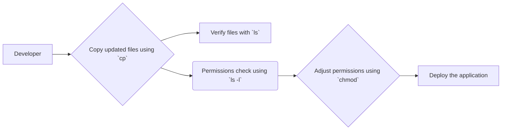
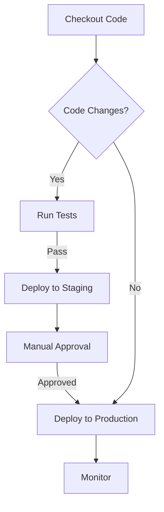

# <span style="color:#e67e22;">What we will learn in this post?</span>
<ul style='list-style-type: none; padding-left: 0;'>
<li><span style='color: #2980b9; font-size: 20px; font-weight: bold;'>👉</span> <span style='color: #2ecc71; font-size: 18px; font-weight: bold;'>Linux/Unix Basics: File Management, Permissions, and Processes</span></li>
<li><span style='color: #2980b9; font-size: 20px; font-weight: bold;'>👉</span> <span style='color: #2ecc71; font-size: 18px; font-weight: bold;'>Writing Shell Scripts for Automation</span></li>
<li><span style='color: #2980b9; font-size: 20px; font-weight: bold;'>👉</span> <span style='color: #2ecc71; font-size: 18px; font-weight: bold;'>Useful CLI Tools (e.g., awk, sed, grep)</span></li>
<li><span style='color: #2980b9; font-size: 20px; font-weight: bold;'>👉</span> <span style='color: #2ecc71; font-size: 18px; font-weight: bold;'>Basic Networking Concepts: TCP/IP, DNS, and Firewalls</span></li>
<li><span style='color: #2980b9; font-size: 20px; font-weight: bold;'>👉</span> <span style='color: #2ecc71; font-size: 18px; font-weight: bold;'>SSH and Remote Connections</span></li>
<li><span style='color: #2980b9; font-size: 20px; font-weight: bold;'>👉</span> <span style='color: #2ecc71; font-size: 18px; font-weight: bold;'>Conclusion!</span></li>
</ul>

# <span style="color:#e67e22">Linux/Unix File Management & Process Control</span> 📁

This guide provides a friendly introduction to fundamental Linux/Unix commands for file management and process control, crucial skills for any DevOps professional.


## <span style="color:#2980b9">Navigating Files & Directories</span> 🚶‍♀️

*   **`ls`**: Lists directory contents.  `ls -l` shows details (permissions, size, etc.).
*   **`cd`**: Changes directory. `cd ..` goes up one level; `cd /` goes to the root.
*   **Example:** `ls -l /home/user/documents` shows detailed listing of the documents directory.


### <span style="color:#8e44ad">Creating, Moving, & Deleting</span> 🛠️

*   **`cp`**: Copies files/directories.  `cp file1.txt file2.txt` copies file1 to file2. `cp -r dir1 dir2` recursively copies directory1 to directory2.
*   **`mv`**: Moves/renames files/directories. `mv file1.txt newfile.txt` renames file1.
*   **`rm`**: Deletes files/directories.  `rm file.txt` deletes file.txt; `rm -r dir` recursively deletes dir (**use with caution!**).


## <span style="color:#2980b9">File Permissions</span> 🔒

Linux uses permissions to control access.  Each file has read (r), write (w), and execute (x) permissions for the owner, group, and others.

*   **`chmod`**: Changes file permissions.  `chmod 755 file.sh` sets permissions (read, write, execute for owner; read, execute for group and others).  Learn more about [chmod octal notation](https://ss64.com/bash/chmod.html).
*   **`chown`**: Changes file owner. `chown user:group file.txt` changes owner to 'user' and group to 'group'.
*   **`chgrp`**: Changes file group. `chgrp group file.txt` changes group to 'group'.


## <span style="color:#2980b9">Process Management</span> ⚙️

*   **`ps`**: Lists running processes. `ps aux` shows a detailed list.
*   **`top`**: Displays dynamic real-time view of processes.
*   **`kill`**: Terminates a process. `kill <process_id>` sends a termination signal. Use with care!
*   **`bg`**: Moves a job to the background.


## <span style="color:#2980b9">DevOps Applications</span> 💻

These commands are fundamental in DevOps:

*   **Monitoring:** `top`, `ps` help monitor system resource usage and identify bottlenecks.
*   **Automation:**  Scripting these commands (e.g., using Bash) automates tasks like file backups, deployments, and log analysis.
*   **Troubleshooting:** `ps`, `kill` help debug problems and manage runaway processes.
*   **Deployment:** `cp`, `mv`, `rm` are used to manage files and directories during deployment.


**Example Workflow (Simplified Deployment):**



Remember to always back up important data before performing actions like `rm -r`!  Happy Linuxing! 😊


# <span style="color:#e67e22">Automating DevOps with Shell Scripts 🚀</span>

Shell scripts are incredibly useful for automating repetitive tasks in DevOps.  They let you combine multiple commands into a single, reusable script, saving you time and reducing errors.  Let's explore how!

## <span style="color:#2980b9">Bash Scripting Basics 💡</span>

Bash is a popular shell for scripting. Here's a quick look at essential elements:

### <span style="color:#8e44ad">Variables</span>

Variables store data.  Declare them like this: `myVar="Hello World"`.


### <span style="color:#8e44ad">Loops</span>

Loops repeat actions.  For example, a `for` loop:

```bash
for i in {1..5}; do
  echo "Iteration: $i"
done
```

### <span style="color:#8e44ad">Conditionals</span>

Conditionals let you make decisions.  An `if` statement:

```bash
if [ "$myVar" == "Hello World" ]; then
  echo "Match!"
fi
```

### <span style="color:#8e44ad">Functions</span>

Functions group commands for reusability:

```bash
myFunc() {
  echo "This is a function!"
}
myFunc
```

## <span style="color:#2980b9">Automating Common Tasks ⚙️</span>

*   **Backups:**  A script can automatically compress and copy files to a remote server.
*   **Deployment:** Automate code deployment to servers, including updates and rollbacks.
*   **System Monitoring:** Regularly check server resources (CPU, memory, disk space) and send alerts if thresholds are exceeded.

**Example: Simple Backup Script (Conceptual)**

```bash
#!/bin/bash
backupDir="/path/to/backup"
tar -czvf "$backupDir/backup.tar.gz" /path/to/data
```

## <span style="color:#2980b9">Improving Efficiency and Reducing Errors 📈</span>

*   **Reduced manual effort:** Automate repetitive tasks, freeing up your time.
*   **Consistency:** Scripts ensure tasks are performed consistently every time.
*   **Error reduction:**  Minimizes human error by automating processes.
*   **Improved reproducibility:**  Easier to replicate environments and deployments.

[Learn more about Bash scripting](https://www.gnu.org/software/bash/manual/bash.html)


## <span style="color:#2980b9">Workflow Example: Deployment</span>



By using shell scripting, DevOps engineers can create efficient and reliable workflows, significantly improving the overall software development lifecycle.  Remember to always test your scripts thoroughly before deploying them to production!


# <span style="color:#e67e22">Essential DevOps Command-Line Tools</span> ✨

DevOps engineers rely heavily on command-line tools for automation and efficient system management.  Let's explore three powerhouses: `grep`, `sed`, and `awk`.

## <span style="color:#2980b9">Grep: The Pattern Finder 🔎</span>

`grep` is your friend when searching for text within files.  It's incredibly powerful for finding specific patterns.

### <span style="color:#8e44ad">Example:</span>
Find all lines containing "error" in a log file:
```bash
grep "error" logfile.txt
```

## <span style="color:#2980b9">Sed: The Stream Editor ✏️</span>

`sed` lets you perform stream editing—making changes to text *as it flows* through a pipeline.  This is ideal for quick text manipulations.

### <span style="color:#8e44ad">Example:</span>
Replace all occurrences of "oldstring" with "newstring" in a file:
```bash
sed 's/oldstring/newstring/g' file.txt
```

## <span style="color:#2980b9">Awk: The Pattern Scanner & Processor ⚙️</span>

`awk` is a more sophisticated tool for processing text based on patterns. It excels at extracting specific data and performing calculations on it.

### <span style="color:#8e44ad">Example:</span>
Extract the second column from a CSV file:
```bash
awk -F, '{print $2}' data.csv
```


## <span style="color:#2980b9">Combining the Power Trio 💪</span>

These tools often work together.  Imagine you want to find all error messages in a log file and extract the timestamp:

```bash
grep "error" logfile.txt | awk '{print $1}'
```

This first filters for lines with "error" using `grep`, then uses `awk` to print only the first column (assuming timestamp is the first).


**Key takeaway:** Mastering `grep`, `sed`, and `awk` significantly boosts your DevOps efficiency.  They are invaluable for automating tasks, analyzing logs, and managing configurations.

**Resources:**

* **grep:** [Learn more about grep](https://www.gnu.org/software/grep/manual/grep.html)
* **sed:** [Sed tutorial](https://www.tutorialspoint.com/sed/index.htm)
* **awk:** [Awk tutorial](https://www.tutorialspoint.com/awk/index.htm)


# <span style="color:#e67e22">DevOps Networking Essentials 🌐</span>

DevOps engineers need a solid understanding of networking to build reliable and secure systems. Let's explore some key concepts:

## <span style="color:#2980b9">TCP/IP Model 📦➡️💻</span>

The TCP/IP model is like a postal service for your data.  It defines how data travels across networks.

### <span style="color:#8e44ad">How it works:</span>

*   **IP Addresses:**  Every device has a unique IP address (e.g., `192.168.1.1`), like a street address.
*   **Transmission:** Data is broken into packets, each with its destination IP address.
*   **TCP:**  Ensures reliable delivery (like registered mail). It checks if packets arrive and re-sends lost ones.
*   **IP:** Handles the addressing and routing of packets (like the postal service sorting mail).

[More on TCP/IP](https://www.cloudflare.com/learning/ddos/what-is-tcp-ip/)


## <span style="color:#2980b9">DNS: The Name Resolver 🔍</span>

Imagine trying to remember every IP address! DNS (Domain Name System) translates human-readable domain names (like `google.com`) into IP addresses.

### <span style="color:#8e44ad">Impact on Web Access:</span>

*   You type `google.com` in your browser.
*   Your computer asks a DNS server for the IP address of `google.com`.
*   The DNS server returns the IP address.
*   Your browser connects to that IP address.


## <span style="color:#2980b9">Firewalls: Network Guards 🔥🛡️</span>

Firewalls act as security checkpoints, controlling network traffic. They examine incoming and outgoing data and block suspicious activity.

### <span style="color:#8e44ad">Protection and Traffic Control:</span>

*   **Filtering:**  Block unauthorized access attempts.
*   **Monitoring:** Detect and log suspicious traffic patterns.
*   **Rules:**  Define what traffic is allowed and blocked (e.g., only allow SSH connections on port 22).

[More on Firewalls](https://www.cloudflare.com/learning/ddos/what-is-a-firewall/)


## <span style="color:#2980b9">DevOps & Networking in Action 🛠️</span>

*   **Troubleshooting:** A DevOps engineer might use `traceroute` or `ping` to diagnose network connectivity issues.  They might check firewall logs to understand why a server is unreachable.
*   **Security:**  Implementing and managing firewalls, intrusion detection systems (IDS), and other security measures to protect applications and data is crucial.
*   **Automation:** DevOps engineers use tools to automate network configuration and management, ensuring consistency and reducing human error.  This includes tools like Ansible and Terraform.

By understanding these basic networking concepts, DevOps professionals can build robust, secure, and scalable systems.  Remember, a well-functioning network is the backbone of any successful application!


# <span style="color:#e67e22">SSH: Your Secure Gateway to Remote Servers 🔑</span>

SSH (Secure Shell) is like a secure tunnel for your commands and files to travel to remote servers.  It encrypts all communication, protecting your data from prying eyes.  This is *crucial* in DevOps, where you frequently interact with remote servers.

## <span style="color:#2980b9">How SSH Works ✨</span>

SSH uses cryptography to create a secure connection.  You initiate a connection to a server, and SSH establishes an encrypted channel. All subsequent commands and data are sent through this secure channel.

### <span style="color:#8e44ad">Passwordless Authentication with SSH Keys 🛡️</span>

Instead of typing passwords repeatedly, SSH keys offer a much more secure and convenient method.  Here's how:

1. **Generate a key pair:**  Use `ssh-keygen` to create a public and a private key.
2. **Copy the public key:** Add your public key to the `.ssh/authorized_keys` file on the server you want to access.
3. **Connect:** Now you can connect using `ssh username@server_ip` without needing a password.


## <span style="color:#2980b9">DevOps Use Cases 🚀</span>

*   **Remote Deployment:** Deploying code to a server using `ssh` and then executing deployment scripts.
*   **File Transfer (scp):** Securely copying files between your local machine and the server using `scp file.txt username@server_ip:/path/to/destination`.
*   **Server Management:** Managing servers in cloud environments (AWS, Azure, GCP) directly via the command line.

## <span style="color:#2980b9">Managing SSH Access 🧑‍💼</span>

*   **Restrict access:** Use firewall rules and SSH configuration to limit connections to specific IP addresses or users.
*   **Regular key rotation:** Update your SSH keys periodically to enhance security.
*   **Strong passwords (if using password auth):** Use a robust password manager if you must use passwords.


For more information, check out:

* [OpenSSH website](https://www.openssh.com/)
* [DigitalOcean SSH tutorial](https://www.digitalocean.com/community/tutorials/how-to-use-ssh-keys-to-authenticate-on-a-linux-server)


Remember, security is paramount!  Always keep your private keys secure and follow best practices for managing SSH access.


<h1><span style='color:#e67e22'>Conclusion</span></h1>

So there you have it!  We've covered a lot of ground today, and hopefully, you found it helpful and interesting 😊.  We're always striving to improve, so we'd love to hear your thoughts!  What did you think of this post?  Anything we missed?  Let us know your comments, feedback, and suggestions below 👇. We can't wait to hear from you!  Happy reading (and commenting!) 😄


