# <span style="color:#e67e22;">What we will learn in this post?</span>

<ul style='list-style-type: none; padding-left: 0;'>
<li><span style='color: #2980b9; font-size: 20px; font-weight: bold;'>👉</span> <span style='color: #2ecc71; font-size: 18px; font-weight: bold;'>Understanding Scripting in DevOps: Importance, Types, and Benefits</span></li>
<li><span style='color: #2980b9; font-size: 20px; font-weight: bold;'>👉</span> <span style='color: #2ecc71; font-size: 18px; font-weight: bold;'>Linux/Unix Basics: File Management, Permissions, and Processes</span></li>
<li><span style='color: #2980b9; font-size: 20px; font-weight: bold;'>👉</span> <span style='color: #2ecc71; font-size: 18px; font-weight: bold;'>Writing Shell Scripts for Automation</span></li>
<li><span style='color: #2980b9; font-size: 20px; font-weight: bold;'>👉</span> <span style='color: #2ecc71; font-size: 18px; font-weight: bold;'>Useful CLI Tools (e.g., awk, sed, grep)</span></li>
<li><span style='color: #2980b9; font-size: 20px; font-weight: bold;'>👉</span> <span style='color: #2ecc71; font-size: 18px; font-weight: bold;'>Basic Networking Concepts: TCP/IP, DNS, and Firewalls</span></li>
<li><span style='color: #2980b9; font-size: 20px; font-weight: bold;'>👉</span> <span style='color: #2ecc71; font-size: 18px; font-weight: bold;'>SSH and Remote Connections</span></li>
<li><span style='color: #2980b9; font-size: 20px; font-weight: bold;'>👉</span> <span style='color: #2ecc71; font-size: 18px; font-weight: bold;'>Conclusion!</span></li>
</ul>

# <span style="color:#e67e22">Scripting in DevOps: Your Automation Superhero</span> 🦸‍♂️

DevOps thrives on automation, and scripting is its secret weapon! Scripting is simply writing a set of instructions (a _script_) for a computer to follow. These instructions automate tasks, making DevOps processes faster, more reliable, and less prone to errors.

## <span style="color:#2980b9">Why Scripting is Essential in DevOps</span>

Imagine manually configuring dozens of servers – tedious, right? Scripting eliminates this repetitive work. It streamlines workflows, reducing the time spent on mundane tasks and freeing up DevOps engineers for more strategic work. Plus, scripts are precise; they minimize human error, ensuring consistency across deployments.

## <span style="color:#2980b9">Popular Scripting Languages in DevOps</span>

- **Bash:** Excellent for Linux/Unix system administration. Great for automating server tasks and managing files.
- **Python:** A versatile language for complex workflows. Its extensive libraries handle almost anything, from data analysis to interacting with APIs.
- **PowerShell:** The go-to for Windows systems. Manages Windows servers and applications effectively.

### <span style="color:#8e44ad">Example: Simple Bash Script for Creating a Directory</span>

```bash
#!/bin/bash
mkdir -p /tmp/my_new_directory
echo "Directory created successfully!"
```

This script creates a directory `/tmp/my_new_directory`. The output would be: `Directory created successfully!`

## <span style="color:#2980b9">Where Scripting Shines in DevOps</span>

- **Automated Server Provisioning:** Spin up new servers with pre-configured settings using scripts.
- **CI/CD Pipelines:** Scripts automate building, testing, and deploying applications.
- **Log Analysis:** Scripts process and analyze logs, identifying errors and bottlenecks.
- **Configuration Management:** Maintain consistent configurations across servers.

## <span style="color:#2980b9">Scripting with DevOps Tools</span>

Scripting integrates beautifully with popular DevOps tools:

- **Jenkins:** Uses scripts to define jobs and automate build processes.
- **Ansible:** Uses YAML-based scripts (playbooks) for configuration management and automation.
- **Terraform:** Uses declarative configuration files (HCL) to manage infrastructure as code.

## <span style="color:#2980b9">Benefits of Scripting in DevOps</span>

- **Faster Deployments:** 🚀 Automated processes speed up releases.
- **Improved Consistency:** 🔄 Reduce human error and ensure uniformity.
- **Better Resource Management:** ☁️ Optimize resource usage through automation.

**For more information:**

- [Bash scripting tutorial](https://www.linux.com/topic/linux-basics/)
- [Python for DevOps](https://realpython.com/python-devops/)
- [PowerShell tutorial](https://learn.microsoft.com/en-us/powershell/)

By mastering scripting, DevOps teams can unlock the true potential of automation, leading to more efficient, reliable, and scalable systems.

# <span style="color:#e67e22">Linux/Unix File Management & Process Control: A DevOps Primer</span>

This guide provides a friendly introduction to essential Linux/Unix commands for file and process management, crucial skills for any DevOps engineer.

## <span style="color:#2980b9">Navigating the File System 🗺️</span>

The core of Linux file management revolves around the command line. Let's start with navigating directories:

- `ls`: Lists directory contents.

  ```bash
  ls /tmp
  # Output: (list of files and directories in /tmp)
  ```

- `cd`: Changes directory.

  ```bash
  cd /var/log  #Navigates to /var/log
  pwd #Shows current working directory.
  #Output: /var/log
  ```

## <span style="color:#2980b9">File Manipulation 📝</span>

- `touch example.txt`: Creates an empty file named `example.txt`.
- `cp example.txt /tmp/`: Copies `example.txt` to `/tmp`.
- `mv /tmp/example.txt /tmp/my_file.txt`: Renames `example.txt` to `my_file.txt` within `/tmp`.
- `rm /tmp/my_file.txt`: Deletes `my_file.txt`. **Be cautious with `rm`!** Use `rm -i` for interactive confirmation.

## <span style="color:#2980b9">Permissions 🛡️</span>

Linux uses permissions to control access. `chmod`, `chown`, and `chgrp` manage these:

- `chmod u+x my_script.sh`: Makes `my_script.sh` executable for the owner (u).
- `chown john:developers /var/www`: Changes the owner to `john` and group to `developers` for `/var/www`.

### <span style="color:#8e44ad">Understanding Permissions</span>

Permissions are represented by a 9-character string (e.g., `rwxr-xr-x`). The first three characters apply to the owner, the next three to the group, and the last three to others. `r` (read), `w` (write), `x` (execute), and `-` (no permission).

## <span style="color:#2980b9">Process Management ⚙️</span>

- `ps aux`: Displays all running processes.
- `top`: Shows real-time process information.
- `kill <process_id>`: Terminates a process. Use `kill -9` as a last resort (force kill).
- `bg`: Moves a job to the background.

### <span style="color:#8e44ad">Example: Stopping a Hung Process</span>

1. Find the process ID using `ps aux | grep <process_name>`.
2. Use `kill <process_id>` to stop it gracefully. If it doesn't respond, use `kill -9 <process_id>`.

## <span style="color:#2980b9">DevOps Applications 🚀</span>

These commands are fundamental in DevOps:

- **Log file maintenance:** Use `ls`, `grep`, `tail`, `head` and `rm` to manage log files (e.g., rotate, analyze, delete old logs).
- **System monitoring:** Use `top`, `ps`, and other monitoring tools to track resource usage and identify performance bottlenecks.

Remember to always practice these commands in a safe environment (e.g., a virtual machine) before applying them to production systems. For more advanced topics, explore resources like the [Linux Documentation Project](https://www.kernel.org/doc/html/latest/).

# <span style="color:#e67e22">Automating DevOps with Shell Scripts 🤖</span>

Shell scripts are incredibly useful for automating repetitive tasks in DevOps, boosting efficiency and minimizing errors. Let's explore how to craft simple Bash scripts.

## <span style="color:#2980b9">Bash Scripting Basics</span>

### <span style="color:#8e44ad">Variables, Loops, and Conditionals</span>

Bash uses variables to store data (e.g., `my_var="hello"`). Loops repeat actions; `for` loops iterate over lists, while `while` loops continue as long as a condition is true. Conditionals (`if`, `elif`, `else`) control the flow based on conditions.

```bash
#!/bin/bash
my_var="Hello, world!"
echo $my_var # Prints "Hello, world!"

for i in {1..5}; do
  echo "Iteration: $i"
done

if [ $my_var == "Hello, world!" ]; then
  echo "Variable matches!"
fi
```

### <span style="color:#8e44ad">Functions</span>

Functions group code for reusability:

```bash
my_function() {
  echo "This is a function!"
}
my_function
```

## <span style="color:#2980b9">Example: Automating Backups 💾</span>

This script backs up `/etc` to `/backup/etc` with timestamped filenames:

```bash
#!/bin/bash
backup_dir="/backup/etc"
timestamp=$(date +%Y%m%d_%H%M%S)
backup_file="${backup_dir}/etc_${timestamp}.tar.gz"

mkdir -p "$backup_dir"

if tar -czvf "$backup_file" /etc; then
  echo "Backup created successfully: $backup_file"
else
  echo "Error creating backup!" >&2 # Send error to stderr
  exit 1 # Indicate failure
fi
```

**Expected Output (Success):**

```
Backup created successfully: /backup/etc/etc_20241027_103000.tar.gz
```

**Error Handling & Logging:** The `>&2` redirects error messages to `stderr`, and `exit 1` signals an error. Adding logging to a file enhances debugging.

## <span style="color:#2980b9">Additional Examples</span>

### <span style="color:#8e44ad">Cleaning Old Log Files 🧹</span>

```bash
#!/bin/bash
find /var/log -type f -mtime +7 -exec rm -f {} \;
```

This removes log files older than 7 days.

### <span style="color:#8e44ad">Monitoring Disk Usage 📊</span>

```bash
#!/bin/bash
df -h | awk '$NF=="/"{printf "Disk usage: %s %s\n", $5,$1}'
```

This shows the usage of the root partition.

## <span style="color:#2980b9">Enhancing Efficiency & Reducing Errors 🚀</span>

Shell scripts automate tedious tasks like deployments and system monitoring, freeing up valuable time and minimizing human error. They are essential tools in any DevOps arsenal.

**Further Resources:**

- [Bash Manual](https://www.gnu.org/software/bash/manual/bash.html)
- [Advanced Bash-Scripting Guide](https://tldp.org/LDP/abs/html/)

Remember to always test your scripts thoroughly before deploying them to production! Use version control (like Git) to track your changes.

# <span style="color:#e67e22">Essential Command-Line Tools for DevOps</span> 🛠️

DevOps engineers rely heavily on command-line tools for automation and efficient system management. Let's explore three essential tools: `grep`, `sed`, and `awk`.

## <span style="color:#2980b9">Grep: The Search Master 🔎</span>

`grep` is your go-to tool for searching text within files. It's incredibly useful for sifting through logs to find errors or specific events.

- **Example:** Finding all lines containing "ERROR" in the system log:

  ```bash
  grep 'ERROR' /var/log/syslog
  ```

  This will output all lines from `/var/log/syslog` containing the word "ERROR".

## <span style="color:#2980b9">Sed: The Text Editor ✏️</span>

`sed` (stream editor) allows you to perform text transformations on files, ideal for modifying configuration files or automating text changes.

- **Example:** Replacing "old_password" with "new_password" in a config file:

  ```bash
  sed -i 's/old_password/new_password/g' config.txt
  ```

  The `-i` flag edits the file in place. The `g` flag ensures all occurrences are replaced. _Be cautious when using `-i`!_ Always back up important files.

## <span style="color:#2980b9">Awk: The Data Extractor 📊</span>

`awk` excels at processing structured data, particularly CSV files. It's powerful for extracting specific fields or performing calculations on data.

- **Example:** Extracting the second field (assuming comma as separator) from a CSV:

  ```bash
  awk -F',' '{print $2}' data.csv
  ```

  `-F','` sets the field separator to a comma. `$2` refers to the second field.

## <span style="color:#2980b9">Combining the Power Trio: A Practical Example 💪</span>

Let's imagine we need to find all error messages related to database connections from a log file (`access.log`) and extract the timestamp.

```bash
grep "database connection error" access.log | awk '{print $1}'
```

This pipeline first uses `grep` to filter lines containing "database connection error". Then, it pipes the output to `awk` which extracts the first field (assuming timestamp is the first field).

```mermaid
graph LR
    A["📄 access.log"] --> B{"🔍 grep 'database connection error'"};
    B --> C{"🔧 awk '{print $1}'"};
    C --> D["🕒 Timestamp Output"];

    classDef logFileStyle fill:#4CAF50,stroke:#388E3C,color:#FFFFFF,font-size:16px,stroke-width:2px,rx:10px,shadow:5px;
    classDef grepStyle fill:#2196F3,stroke:#1976D2,color:#FFFFFF,font-size:14px,stroke-width:2px,rx:10px,shadow:3px;
    classDef awkStyle fill:#FFC107,stroke:#FFA000,color:#FFFFFF,font-size:14px,stroke-width:2px,rx:10px,shadow:3px;
    classDef outputStyle fill:#9C27B0,stroke:#7B1FA2,color:#FFFFFF,font-size:14px,stroke-width:2px,rx:10px,shadow:3px;

    class A logFileStyle;
    class B grepStyle;
    class C awkStyle;
    class D outputStyle;

```

### <span style="color:#8e44ad">Pipeline Visualization</span>



## <span style="color:#2980b9">Real-World DevOps Use Cases</span>

- **Log Analysis:** `grep` and `awk` are invaluable for analyzing log files, identifying error patterns, and tracking performance issues.
- **Configuration Management:** `sed` streamlines the process of updating configuration files across multiple servers.
- **Troubleshooting:** These tools help pinpoint the root cause of problems by efficiently filtering and analyzing system logs and configuration data.

**Resources:**

- [grep manual](https://www.gnu.org/software/grep/manual/grep.html)
- [sed manual](https://www.gnu.org/software/sed/manual/sed.html)
- [awk manual](https://www.gnu.org/software/gawk/manual/gawk.html)

Remember to always test your commands on a sample data set before applying them to production systems! Happy scripting! 🎉

# <span style="color:#e67e22">DevOps Networking Basics 🌐</span>

DevOps engineers frequently interact with networking concepts. Let's explore some key elements:

## <span style="color:#2980b9">TCP/IP: The Foundation of Communication 🧱</span>

TCP/IP is the _core_ protocol suite of the internet. It defines how data is transmitted between devices. Imagine you host a web server at `192.168.1.100`. When a client (your browser) requests a webpage, TCP/IP handles the communication:

- The client sends a request using TCP (a reliable, connection-oriented protocol).
- The server receives the request, processes it, and sends the webpage back via TCP.
- IP handles the addressing and routing of the packets across the network.

**Example:** A simple `ping` command shows TCP/IP in action:

```bash
ping 192.168.1.100
```

This sends packets to the server and shows if it's reachable. If the server is down or unreachable you will see a response like this: `Request timed out`.

## <span style="color:#2980b9">DNS: Finding Addresses 🔎</span>

DNS (Domain Name System) translates human-readable domain names (like `google.com`) into machine-readable IP addresses (`172.217.160.142`, for example). Without DNS, you'd have to remember IP addresses for every website!

**Example:**

```bash
nslookup google.com
```

This command shows the IP address associated with `google.com`. DNS issues often cause website access problems.

## <span style="color:#2980b9">Firewalls: Network Security Guards 🛡️</span>

Firewalls control network traffic, blocking unwanted connections while allowing authorized ones. In DevOps, you often manage firewall rules.

### <span style="color:#8e44ad">Example: Opening Port 80 with UFW</span>

To allow web traffic (port 80) on a server using `ufw` (Uncomplicated Firewall):

```bash
sudo ufw allow 80/tcp
sudo ufw enable
```

### <span style="color:#8e44ad">Example: Blocking an IP Address</span>

To block traffic from a malicious IP address `192.168.1.200`:

```bash
sudo ufw deny from 192.168.1.200 to any
sudo ufw enable
```

## <span style="color:#2980b9">DevOps Tasks and Networking 🛠️</span>

- **Firewall Configuration:** Setting up rules to allow/deny traffic based on application needs.
- **DNS Troubleshooting:** Diagnosing connectivity issues by checking DNS resolution.
- **Network Security:** Implementing security best practices to protect servers and applications.

<br>

**Resources:**

- [TCP/IP Guide](https://www.tcpipguide.com/)
- [Understanding DNS](https://www.cloudflare.com/learning/dns/)
- [UFW documentation](https://help.ubuntu.com/community/UFW)

# <span style="color:#e67e22">SSH: Your Secure Gateway to Remote Servers 🔑</span>

SSH (Secure Shell) is like a secure tunnel for your commands and files to travel to remote servers. It's _essential_ in DevOps for managing servers remotely.

## <span style="color:#2980b9">Accessing Servers Securely</span>

The simplest way to connect is using your username and password:

```bash
ssh user@server_ip
```

(Replace `user` and `server_ip` with your credentials). You'll be prompted for your password. However, using passwords directly is risky!

## <span style="color:#2980b9">SSH Keys for Passwordless Login ✨</span>

SSH keys provide a much more secure way to connect. Here's how:

### <span style="color:#8e44ad">Generating Keys</span>

```bash
ssh-keygen -t ed25519  # Generates a key pair (ed25519 is recommended)
```

You'll be prompted to save the key and enter a passphrase (optional but recommended for extra security).

### <span style="color:#8e44ad">Copying the Public Key</span>

```bash
ssh-copy-id user@server_ip
```

This copies your public key to the authorized_keys file on the server, enabling passwordless login.

### <span style="color:#8e44ad">Connecting without a password</span>

Now you can connect simply with:

```bash
ssh user@server_ip
```

You should connect without being asked for a password.

## <span style="color:#2980b9">Common SSH Use Cases in DevOps</span>

- **File Transfer (SCP):** Copy files securely using `scp`:

  ```bash
  scp file.txt user@server_ip:/path/to/destination
  ```

- **Troubleshooting:** Connect directly to a server to check logs, network status, etc.

- **Application Deployment:** Deploy and manage applications on remote servers.

- **Automation:** Use SSH within scripts to automate tasks, like backups or server configuration.

- **Cloud Server Management:** Manage servers on platforms like AWS, Google Cloud, or Azure.

```mermaid
graph TD
    A["💻 Your Computer"] --> B["🔑 SSH Client"];
    B --> C{"🔒 Encryption"};
    C --> D["🌐 Network"];
    D --> E{"🔓 Decryption"};
    E --> F["🖥️ Remote Server"];

    classDef computerStyle fill:#4CAF50,stroke:#388E3C,color:#FFFFFF,font-size:16px,stroke-width:2px,rx:10px,shadow:5px;
    classDef sshClientStyle fill:#2196F3,stroke:#1976D2,color:#FFFFFF,font-size:14px,stroke-width:2px,rx:10px,shadow:3px;
    classDef encryptionStyle fill:#FFC107,stroke:#FFA000,color:#FFFFFF,font-size:14px,stroke-width:2px,rx:10px,shadow:3px;
    classDef networkStyle fill:#FF9800,stroke:#F57C00,color:#FFFFFF,font-size:14px,stroke-width:2px,rx:10px,shadow:3px;
    classDef decryptionStyle fill:#FFC107,stroke:#FFA000,color:#FFFFFF,font-size:14px,stroke-width:2px,rx:10px,shadow:3px;
    classDef serverStyle fill:#9C27B0,stroke:#7B1FA2,color:#FFFFFF,font-size:14px,stroke-width:2px,rx:10px,shadow:3px;

    class A computerStyle;
    class B sshClientStyle;
    class C encryptionStyle;
    class D networkStyle;
    class E decryptionStyle;
    class F serverStyle;

```

## <span style="color:#2980b9">Diagram: SSH Connection Flow</span>



**For more information:**

- [OpenSSH Website](https://www.openssh.com/)

Using SSH keys is crucial for secure and efficient DevOps workflows. Remember to protect your private key! It's like your password, so keep it secret.

<h1><span style='color:#e67e22'>Conclusion</span></h1>

So there you have it! We hope you found this information helpful and engaging. 😊 We're always looking to improve, so we'd love to hear your thoughts! What did you think of this post? Any questions or suggestions? Let us know in the comments below! 👇 We're excited to hear from you! 💬
