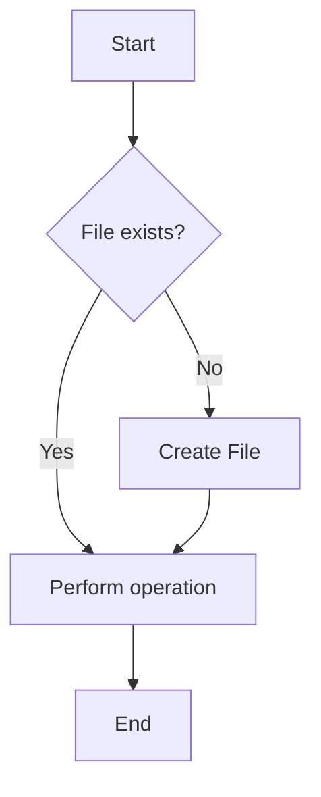
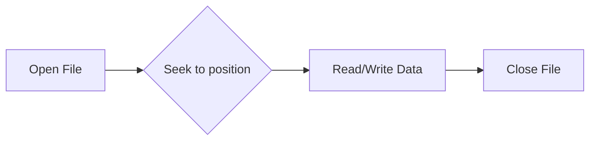

# <span style="color:#e67e22;">What we will learn in this post?</span>
<ul style='list-style-type: none; padding-left: 0;'>
<li><span style='color: #2980b9; font-size: 20px; font-weight: bold;'>👉</span> <span style='color: #2ecc71; font-size: 18px; font-weight: bold;'>File Class in Java</span></li>
<li><span style='color: #2980b9; font-size: 20px; font-weight: bold;'>👉</span> <span style='color: #2ecc71; font-size: 18px; font-weight: bold;'>How to Create Files in Java</span></li>
<li><span style='color: #2980b9; font-size: 20px; font-weight: bold;'>👉</span> <span style='color: #2ecc71; font-size: 18px; font-weight: bold;'>How to Read Files in Java</span></li>
<li><span style='color: #2980b9; font-size: 20px; font-weight: bold;'>👉</span> <span style='color: #2ecc71; font-size: 18px; font-weight: bold;'>How to Write on Files in Java</span></li>
<li><span style='color: #2980b9; font-size: 20px; font-weight: bold;'>👉</span> <span style='color: #2ecc71; font-size: 18px; font-weight: bold;'>How to Delete a File in Java</span></li>
<li><span style='color: #2980b9; font-size: 20px; font-weight: bold;'>👉</span> <span style='color: #2ecc71; font-size: 18px; font-weight: bold;'>File Permissions</span></li>
<li><span style='color: #2980b9; font-size: 20px; font-weight: bold;'>👉</span> <span style='color: #2ecc71; font-size: 18px; font-weight: bold;'>FileReader</span></li>
<li><span style='color: #2980b9; font-size: 20px; font-weight: bold;'>👉</span> <span style='color: #2ecc71; font-size: 18px; font-weight: bold;'>FileWriter</span></li>
<li><span style='color: #2980b9; font-size: 20px; font-weight: bold;'>👉</span> <span style='color: #2ecc71; font-size: 18px; font-weight: bold;'>FileDescriptor Class</span></li>
<li><span style='color: #2980b9; font-size: 20px; font-weight: bold;'>👉</span> <span style='color: #2ecc71; font-size: 18px; font-weight: bold;'>RandomAccessFile Class</span></li>
<li><span style='color: #2980b9; font-size: 20px; font-weight: bold;'>👉</span> <span style='color: #2ecc71; font-size: 18px; font-weight: bold;'>Conclusion!</span></li>
</ul>

# <span style="color:#e67e22">Java's File Class: Your File Management Friend 🤝</span>

The `File` class in Java is your go-to tool for interacting with files and directories on your computer's file system.  It doesn't handle the actual *content* of files (that's for `InputStream` and `OutputStream`), but it lets you create, delete, rename, and check properties like file size and existence.

## <span style="color:#2980b9">Key Methods & Usage</span>

Here are some commonly used methods:

*   `createNewFile()`: Creates a new, empty file.  Returns `true` on success, `false` if it already exists.
*   `exists()`: Checks if a file or directory exists.
*   `delete()`: Deletes a file or an empty directory.
*   `renameTo(File newName)`: Renames a file.
*   `isDirectory()`: Checks if it's a directory.
*   `isFile()`: Checks if it's a regular file.
*   `length()`: Gets the file size in bytes.


### <span style="color:#8e44ad">Code Examples ✨</span>

```java
import java.io.File;
import java.io.IOException;

public class FileExample {
    public static void main(String[] args) {
        File myFile = new File("my_new_file.txt");

        try {
            if (myFile.createNewFile()) {
                System.out.println("File created: " + myFile.getName());
            } else {
                System.out.println("File already exists.");
            }
        } catch (IOException e) {
            System.out.println("An error occurred.");
            e.printStackTrace();
        }

        System.out.println("File exists? " + myFile.exists());
        System.out.println("File size: " + myFile.length() + " bytes");

        if (myFile.delete()) {
          System.out.println("File deleted successfully!");
        } else {
          System.out.println("Failed to delete the file.");
        }
    }
}
```

## <span style="color:#2980b9">Flowchart: Basic File Operations</span>



**Note:**  Always handle potential `IOExceptions` when working with files.  Error handling is crucial!


For more detailed information and advanced functionalities, refer to the official [Java File Class Documentation](https://docs.oracle.com/javase/7/docs/api/java/io/File.html). Remember to handle exceptions appropriately for robust code!  Happy coding! 😊


# <span style="color:#e67e22">Creating Files in Java 📄</span>

Java offers several ways to create files, each suited to different situations. Let's explore some common methods.


## <span style="color:#2980b9">Method 1: Using `FileOutputStream` 🌊</span>

This is a low-level approach, ideal for situations requiring fine-grained control over file writing.  It directly interacts with the file system.

### <span style="color:#8e44ad">Example</span>

```java
import java.io.FileOutputStream;
import java.io.IOException;

public class FileCreation {
    public static void main(String[] args) {
        try (FileOutputStream fos = new FileOutputStream("my_file.txt")) {
            String data = "Hello, file!";
            fos.write(data.getBytes()); // Write data to the file
            System.out.println("File created successfully!");
        } catch (IOException e) {
            System.out.println("Error creating file: " + e.getMessage());
        }
    }
}
```

This creates `my_file.txt` and writes "Hello, file!" to it.  *Note the use of try-with-resources for automatic resource management.*


## <span style="color:#2980b9">Method 2: Using `FileWriter` ✍️</span>

`FileWriter` simplifies writing text to files. It handles character encoding automatically, making it easier to use than `FileOutputStream` for text files.

### <span style="color:#8e44ad">Example</span>

```java
import java.io.FileWriter;
import java.io.IOException;

public class FileCreation {
    public static void main(String[] args) {
        try (FileWriter fw = new FileWriter("my_text_file.txt")) {
            fw.write("This is a text file.");
            System.out.println("Text file created!");
        } catch (IOException e) {
            System.out.println("Error creating file: " + e.getMessage());
        }
    }
}
```

This creates `my_text_file.txt` and writes the specified text.


## <span style="color:#2980b9">Method 3: Using `Files.createFile()` (Java 7+) 🎉</span>

This method from the `java.nio.file` package provides a more modern and efficient approach. It's concise and handles exceptions effectively.

### <span style="color:#8e44ad">Example</span>

```java
import java.io.IOException;
import java.nio.file.Files;
import java.nio.file.Path;
import java.nio.file.Paths;

public class FileCreation {
  public static void main(String[] args) throws IOException {
    Path filePath = Paths.get("my_new_file.txt");
    Files.createFile(filePath);
    System.out.println("File created using Files.createFile()!");
  }
}

```

This creates an empty file named `my_new_file.txt`.  *Error handling is crucial; always include `try-catch` blocks.*


**Remember:** Always handle potential `IOExceptions` when working with files.  Appropriate error handling prevents unexpected program termination.


For more information:

* [Oracle Java Tutorials on I/O](https://docs.oracle.com/javase/tutorial/essential/io/index.html)
* [Java NIO.2 Documentation](https://docs.oracle.com/javase/7/docs/api/java/nio/file/package-summary.html)


# <span style="color:#e67e22">Reading Files in Java 📖</span>

Java offers several ways to read files. Let's explore the most common approaches.

## <span style="color:#2980b9">Using `FileReader` and `BufferedReader` ☕</span>

This is a simple approach for reading text files character by character or line by line.  `FileReader` opens the file, and `BufferedReader` improves reading efficiency.

### <span style="color:#8e44ad">Code Example</span>

```java
import java.io.*;

public class FileReaderExample {
    public static void main(String[] args) {
        try (FileReader fr = new FileReader("myFile.txt");
             BufferedReader br = new BufferedReader(fr)) {
            String line;
            while ((line = br.readLine()) != null) {
                System.out.println(line);
            }
        } catch (IOException e) {
            e.printStackTrace();
        }
    }
}
```

*   Remember to replace `"myFile.txt"` with your file's path.
*   The `try-with-resources` statement ensures the file is automatically closed.


## <span style="color:#2980b9">Using `Scanner` 🔎</span>

`Scanner` provides a more convenient way to read different data types from a file.

### <span style="color:#8e44ad">Code Example</span>

```java
import java.io.File;
import java.util.Scanner;

public class ScannerExample {
    public static void main(String[] args) {
        try (Scanner scanner = new Scanner(new File("myFile.txt"))) {
            while (scanner.hasNextLine()) {
                String line = scanner.nextLine();
                System.out.println(line);
            }
        } catch (Exception e) {
            e.printStackTrace();
        }
    }
}
```

*   `Scanner` can handle integers, doubles, and other data types easily using methods like `nextInt()`, `nextDouble()`, etc.


## <span style="color:#2980b9">Handling Exceptions ⚠️</span>

Always wrap file I/O operations in a `try-catch` block to handle potential `IOExceptions` (e.g., file not found).


## <span style="color:#2980b9">Further Reading 🚀</span>

For a deeper dive into Java file I/O, explore the official Java documentation:  [Oracle Java Tutorials - I/O](https://docs.oracle.com/javase/tutorial/essential/io/index.html)


**Note:**  Remember to handle potential exceptions appropriately and always close your file resources to prevent resource leaks.  Using *try-with-resources* is best practice.


# <span style="color:#e67e22">Writing Data to Files in Java ✍️</span>

Java offers several ways to write data to files.  Let's explore the most common approaches.

## <span style="color:#2980b9">Using `FileWriter` 📄</span>

This class is best for writing text data. It's simple and straightforward.

### <span style="color:#8e44ad">Example:</span>

```java
import java.io.FileWriter;
import java.io.IOException;

public class FileWriterExample {
    public static void main(String[] args) {
        try (FileWriter writer = new FileWriter("myFile.txt")) {
            writer.write("Hello, file!"); 
        } catch (IOException e) {
            e.printStackTrace();
        }
    }
}
```

*This creates a file named "myFile.txt" and writes "Hello, file!" to it.*  Remember to handle potential `IOExceptions`.


## <span style="color:#2980b9">Using `BufferedWriter` 缓冲区 💨</span>

For improved performance, especially when writing large amounts of data, use `BufferedWriter`. It buffers data before writing it to the file, reducing the number of disk I/O operations.


### <span style="color:#8e44ad">Example:</span>

```java
import java.io.BufferedWriter;
import java.io.FileWriter;
import java.io.IOException;

public class BufferedWriterExample {
    public static void main(String[] args) {
        try (BufferedWriter writer = new BufferedWriter(new FileWriter("myFile2.txt"))) {
            writer.write("This is a line of text.");
            writer.newLine(); // Add a new line
            writer.write("Another line!");
        } catch (IOException e) {
            e.printStackTrace();
        }
    }
}
```

*   `BufferedWriter` wraps a `FileWriter` (or other `Writer`) for efficient writing.


## <span style="color:#2980b9">Using `PrintWriter`  打印机 🖨️</span>

`PrintWriter` provides convenient methods for writing various data types, including formatted output.


### <span style="color:#8e44ad">Example:</span>

```java
import java.io.PrintWriter;
import java.io.IOException;
import java.io.FileWriter;

public class PrintWriterExample {
    public static void main(String[] args) {
        try (PrintWriter writer = new PrintWriter(new FileWriter("myFile3.txt"))) {
            writer.println("Formatted output: " + 10 + " " + "words"); //Formatted output
            writer.printf("This is a formatted string: %d %s%n", 10, "words"); //Another formatted output
        } catch (IOException e) {
            e.printStackTrace();
        }
    }
}
```


*   `PrintWriter` offers formatted output capabilities.


**Remember to always handle potential `IOExceptions` when working with files!**  Using try-with-resources ensures that the file is closed properly, even if exceptions occur.


For more detailed information and advanced techniques, you can refer to the official Java documentation: [Java I/O documentation](https://docs.oracle.com/javase/tutorial/essential/io/index.html)


# <span style="color:#e67e22">Deleting Files in Java: A Friendly Guide 👋</span>

Java provides a straightforward way to delete files using the `File` class.  Let's explore the methods and best practices.

## <span style="color:#2980b9">Methods for Deletion 🗑️</span>

The core method is `delete()`.  It attempts to delete the file represented by the `File` object.

*   **`boolean delete()`:** This returns `true` if the deletion was successful, `false` otherwise.  This method will fail if the file is in use or you lack the necessary permissions.

### <span style="color:#8e44ad">Handling Failure Scenarios</span>

It's crucial to handle potential failures gracefully.  Check the return value of `delete()` and take appropriate action if it's `false`. This might involve logging an error message, retrying the deletion, or notifying the user.

## <span style="color:#2980b9">Code Example ✨</span>

Here's a simple example demonstrating file deletion:

```java
import java.io.File;

public class DeleteFile {
    public static void main(String[] args) {
        File fileToDelete = new File("my_file.txt"); // Replace with your file path

        if (fileToDelete.exists()) {
            if (fileToDelete.delete()) {
                System.out.println("File deleted successfully!");
            } else {
                System.err.println("Failed to delete the file.");
            }
        } else {
            System.err.println("File does not exist.");
        }
    }
}
```

**Remember to replace `"my_file.txt"` with the actual path to your file.**


## <span style="color:#2980b9">Important Considerations 🤔</span>

*   **Permissions:** Ensure your Java program has the necessary permissions to delete the file.
*   **File Locking:**  If the file is currently open by another process, deletion might fail.  Try closing any related resources before attempting deletion.
*   **Error Handling:** Always check the return value of `delete()` and handle potential errors appropriately.  A `try-catch` block can help manage exceptions.
*   **Directory Deletion:**  To delete directories, use `delete()` method on the directory object. It will recursively delete files and subdirectories within it. Make sure the directory is empty before deleting it.


This friendly guide helps you delete files safely and effectively in Java. Remember to always handle errors appropriately and ensure you have the necessary permissions. Happy coding!


[More information on the `File` class](https://docs.oracle.com/javase/7/docs/api/java/io/File.html)


# <span style="color:#e67e22">Java File Permissions: A Friendly Guide 🤝</span>

Java offers ways to manage file permissions, although it's primarily reliant on the underlying operating system's file system.  You can't directly manipulate permissions in a platform-independent way within Java itself.  Instead, you utilize OS-specific commands or libraries.


## <span style="color:#2980b9">Understanding File Permissions 🤔</span>

File permissions dictate who (user, group, others) can perform actions (read, write, execute) on a file.  Incorrect permissions can lead to issues like inability to read data or write changes.


### <span style="color:#8e44ad">Example: Unix-like Systems (Linux, macOS)</span>

On Unix-like systems, you typically use the `chmod` command (not directly in Java), which modifies permissions based on octal representation.  For instance:

`chmod 755 myfile.txt` grants read, write, and execute for owner, read and execute for group and others.


## <span style="color:#2980b9">Managing Permissions Programmatically 💻</span>

In Java, you typically interact with files using the `java.io` package.  However, fine-grained permission control is achieved through external processes:


```java
// Example using Runtime to execute external chmod command (Unix-like systems)
try {
    Process process = Runtime.getRuntime().exec("chmod 755 myfile.txt");
    int exitCode = process.waitFor(); //check if successful
    if (exitCode == 0) {
        System.out.println("Permissions changed successfully!");
    } else {
        System.err.println("Error changing permissions.");
    }
} catch (Exception e) {
    e.printStackTrace();
}
```

**Note:**  This code uses `Runtime.getRuntime().exec()`,  which is generally discouraged for security reasons for production systems due to potential vulnerabilities if not handled carefully.  Consider using safer alternatives like `ProcessBuilder` for better control.

### <span style="color:#8e44ad">Important Considerations ⚠️</span>

*   Always validate user input to prevent malicious code injection.
*   Error handling is crucial to manage potential exceptions during process execution.
*   Consider using alternative approaches like access control lists (ACLs) for more granular control.

For Windows systems, you'd employ similar techniques but utilize the appropriate Windows commands instead of `chmod`.  The core concept remains the same: Java facilitates file *access*, but OS-level commands manage *permissions*.


**Resources:**

*   [Java's `java.io` Package](https://docs.oracle.com/javase/tutorial/essential/io/index.html)
*   [Unix `chmod` command](https://man7.org/linux/man-pages/man1/chmod.1.html)


This information should help you understand how to handle file permissions safely and effectively in your Java programs.  Remember to prioritize security and error handling. 😊


# <span style="color:#e67e22">FileReader in Java: Your Friendly Character File Reader 📖</span>

The `FileReader` class in Java is your go-to tool for reading character-based files (like `.txt` files).  Think of it as a friendly helper that lets your Java program easily access and process the text within these files.

## <span style="color:#2980b9">Purpose & Use Cases</span>

Its primary purpose is to provide a simple way to read characters from a file sequentially.  This is useful for various tasks, including:

* Reading configuration files.
* Processing text data from log files.
* Loading text-based game data.
* Analyzing textual content for various purposes.

Essentially, whenever you need to work with the text content of a file, `FileReader` is likely your best friend!


## <span style="color:#2980b9">Key Methods ✨</span>

### <span style="color:#8e44ad">Reading Characters</span>

The most important method is `read()`.  It reads a single character from the file and returns it as an integer (or -1 if the end of the file is reached).

```java
FileReader reader = new FileReader("my_file.txt");
int character;
while ((character = reader.read()) != -1) {
    System.out.print((char) character); // Cast to char to print as a character
}
reader.close(); // Important: Always close the reader!
```

### <span style="color:#8e44ad">Reading Arrays of Characters</span>

For more efficient reading, `read(char[] cbuf, int off, int len)` reads characters into a character array.  It's faster than reading one character at a time.

```java
FileReader reader = new FileReader("my_file.txt");
char[] buffer = new char[1024]; // Adjust buffer size as needed
int charsRead;
while ((charsRead = reader.read(buffer)) != -1) {
    System.out.print(new String(buffer, 0, charsRead)); 
}
reader.close();
```

Remember to always close the `FileReader` using `reader.close()` to release system resources after you're done reading.  Failure to do so can lead to resource leaks.


## <span style="color:#2980b9">  A Simple Flowchart 📊</span>

```mermaid
graph TD
    A[Create FileReader] --> B{Read Character/Array?};
    B -- Character --> C[Read() Method];
    B -- Array --> D[read(char[], int, int) Method];
    C --> E[Process Character];
    D --> E;
    E --> F{End of File?};
    F -- Yes --> G[Close FileReader];
    F -- No --> B;
    G --> H[Finished];

```

For more detailed information and advanced techniques, refer to the official Java documentation: [Java FileReader Documentation](https://docs.oracle.com/javase/7/docs/api/java/io/FileReader.html) (This link may vary depending on your Java version).  Happy coding! 🎉


# <span style="color:#e67e22">Writing Files in Java with FileWriter ✍️</span>

The `FileWriter` class in Java is your go-to tool for writing character data to files.  It's simple, straightforward, and perfect for many common file writing tasks. Think of it as your digital pen for writing text to files!

## <span style="color:#2980b9">Key Methods and Usage</span>

### <span style="color:#8e44ad">Creating a FileWriter</span>

To start writing, you create a `FileWriter` object, specifying the file's path:

```java
FileWriter writer = new FileWriter("my_file.txt"); 
```

This creates a `FileWriter` linked to "my_file.txt".  If the file doesn't exist, it's created; if it exists, its contents are overwritten (unless you use a constructor that appends instead).

### <span style="color:#8e44ad">Writing Data</span>

The `write()` method adds characters to the file:

```java
writer.write("Hello, FileWriter!");
writer.write("\nThis is on a new line.");
```

Remember to close the writer using `writer.close()` to ensure all data is written and resources are released.  Failure to close can lead to data loss.


### <span style="color:#8e44ad">Complete Example</span>

```java
import java.io.FileWriter;
import java.io.IOException;

public class FileWriterExample {
    public static void main(String[] args) {
        try (FileWriter writer = new FileWriter("my_file.txt")) {
            writer.write("This is a test file.\n");
            writer.write("Using FileWriter is easy!");
        } catch (IOException e) {
            System.err.println("An error occurred: " + e.getMessage());
        }
    }
}
```

**Note:** The `try-with-resources` statement ensures the file is automatically closed, even if exceptions occur.


## <span style="color:#2980b9">Important Considerations ⚠️</span>

*   **Error Handling:** Always wrap `FileWriter` operations in a `try-catch` block to handle potential `IOExceptions`.
*   **Character Encoding:** For more control over character encoding (e.g., UTF-8), consider using `OutputStreamWriter` with a specified encoding.
*   **Appending:**  Use the constructor `FileWriter(String fileName, boolean append)` with `append = true` to add to an existing file instead of overwriting it.


[More information on FileWriter](https://docs.oracle.com/javase/7/docs/api/java/io/FileWriter.html)


This friendly guide should get you started writing files in Java efficiently and safely! Remember to always handle potential errors gracefully.  Happy coding! 🎉


# <span style="color:#e67e22">Understanding Java's `FileDescriptor` Class 📖</span>

The `FileDescriptor` class in Java is a crucial component for handling files. Think of it as a low-level, system-dependent handle or pointer to an open file.  It's not directly used for reading or writing file contents; instead, it acts as an intermediary, allowing other higher-level classes like `FileInputStream` and `FileOutputStream` to interact with the operating system's file system.  Essentially, it's the bridge between your Java program and the actual file on your computer's disk.


## <span style="color:#2980b9">Significance in File Handling 🗄️</span>

*   **Low-level access:** `FileDescriptor` provides a low-level, platform-independent way to represent an open file, abstracting away the complexities of different operating systems.
*   **Underlying mechanism:** It's the foundation upon which higher-level stream classes build.  These stream classes provide convenient methods for reading and writing data, while `FileDescriptor` handles the nitty-gritty of managing the file handle itself.
*   **Efficient resource management:**  By using `FileDescriptor`, Java can efficiently manage open file resources, minimizing potential conflicts and improving overall performance.


## <span style="color:#2980b9">Relationship to File I/O 🖱️</span>

`FileDescriptor` itself doesn't perform file I/O operations directly. Instead, classes like `FileInputStream` and `FileOutputStream` use a `FileDescriptor` object internally to manage the file handle, facilitating the actual read/write actions.


### <span style="color:#8e44ad">Code Example ✨</span>

```java
import java.io.*;

public class FileDescriptorExample {
    public static void main(String[] args) {
        try (FileOutputStream fos = new FileOutputStream("myFile.txt")) {
            FileDescriptor fd = fos.getFD();  //Get the FileDescriptor
            System.out.println("File Descriptor: " + fd);
            fos.write("Hello, FileDescriptor!".getBytes()); //Write to the file
        } catch (IOException e) {
            e.printStackTrace();
        }
    }
}
```

This code shows how to obtain a `FileDescriptor` from a `FileOutputStream`.  Note that you generally don't directly manipulate the `FileDescriptor`  unless you're working with very low-level I/O operations. The higher-level stream classes are usually sufficient for most tasks.


## <span style="color:#2980b9">Further Resources 🔗</span>

*   [Oracle Java Docs on FileDescriptor](https://docs.oracle.com/javase/7/docs/api/java/io/FileDescriptor.html)


**In short:**  While rarely directly manipulated, `FileDescriptor` is a fundamental, behind-the-scenes component crucial for efficient and reliable file I/O in Java.  It's the bedrock upon which more user-friendly stream classes are built.


# <span style="color:#e67e22">RandomAccessFile in Java: Accessing Files Randomly 💾</span>

Java's `RandomAccessFile` class offers a unique way to interact with files, unlike the standard `FileReader` and `FileWriter`.  It allows you to read and write data at *any* position within a file, making it perfect for scenarios needing flexible file manipulation.

## <span style="color:#2980b9">Key Features ✨</span>

* **Random Access:** The standout feature!  You can jump directly to a specific byte offset in the file using `seek()`, enabling efficient modifications and data retrieval without sequential reading.
* **Read and Write:** It supports both reading and writing operations. You can update specific parts of a file without rewriting the entire thing.
* **File Pointer:**  An internal pointer tracks your current position within the file.
* **Mode Selection:**  You specify the file access mode (`"r"` for reading, `"rw"` for reading and writing) during object creation.

## <span style="color:#2980b9">Core Methods 🛠️</span>

* `RandomAccessFile(String name, String mode)`: Constructor.
* `seek(long pos)`: Moves the file pointer to the specified byte offset.
* `read(byte[] b)`: Reads bytes into an array.
* `write(byte[] b)`: Writes bytes from an array.
* `readUTF()`, `writeUTF()`: Read/write strings in UTF-8 format.  These are particularly useful for handling text.
* `length()`: Returns the file's size in bytes.


### <span style="color:#8e44ad">Code Example 💻</span>

```java
import java.io.RandomAccessFile;
import java.io.IOException;

public class RandomAccessExample {
    public static void main(String[] args) throws IOException {
        RandomAccessFile raf = new RandomAccessFile("mydata.txt", "rw");
        raf.writeUTF("Hello, "); // Write at the beginning
        raf.seek(6); // Move to position 6
        raf.writeUTF("world!"); // Append to existing text
        raf.seek(0); // Go back to the start
        String data = raf.readUTF(); // Read the complete content.
        System.out.println(data); // Output: Hello, world!
        raf.close();
    }
}
```

## <span style="color:#2980b9">Use Cases 🚀</span>

* **Database-like structures:**  Storing and updating records in a file.
* **Binary file manipulation:** Editing image or audio files.
* **Log files:**  Efficiently appending new log entries.
* **Configuration files:** Modifying specific settings in a config file.


## <span style="color:#2980b9">Diagrammatic Representation 🗺️</span>



For more detailed information and advanced examples, refer to the official Java documentation: [Java RandomAccessFile Documentation](https://docs.oracle.com/javase/7/docs/api/java/io/RandomAccessFile.html)


Remember to handle potential `IOExceptions` when working with files!  Always close the `RandomAccessFile` using `raf.close()` to release resources.


<h1><span style='color:#e67e22'>Conclusion</span></h1>

And there you have it!  We hope you found this insightful and helpful 😊.  We're always striving to improve, so your thoughts matter!  Share your comments, feedback, or suggestions below 👇.  Let's keep the conversation going! We'd love to hear what you think and answer any questions you might have.  Thanks for reading! 🎉


