# What we will learn in this post?

<ul style='list-style-type: none; padding-left: 0;'>
<li>👉 Understanding CI and Its Workflow</li>
<li>👉 Benefits of Continuous Integration</li>
<li>👉 Key CI Tools Overview (e.g., Jenkins, GitHub Actions, GitLab CI/CD)</li>
<li>👉 Setting Up Jenkins and Running Your First Job</li>
<li>👉 Automating Builds and Unit Tests</li>
<li>👉 Conclusion!</li>
</ul>

# Continuous Integration (CI) Explained 🤝

Continuous Integration (CI) is a development practice where developers regularly merge their code changes into a central repository, after which automated builds and tests are run. Think of it as constantly keeping your codebase healthy and up-to-date! 🌱

## The CI Workflow ✨

The typical CI workflow looks like this:

1. **Code Changes:** Developers write code and commit changes to their individual branches in a version control system (like Git).
2. **Merge to Main:** Regularly (e.g., several times a day), these changes are merged into the main branch (often called `main` or `master`).
3. **Automated Build:** A CI server (e.g., Jenkins, GitLab CI, CircleCI) automatically detects the merge and triggers a build process. This compiles the code into a runnable application.
4. **Automated Tests:** The CI server then runs automated tests (unit tests, integration tests, etc.) to ensure the new code doesn't break existing functionality.
5. **Feedback:** The results (success or failure) are reported back to the team immediately. If tests fail, the team knows about the problem _early_, before it impacts other developers or users.

```mermaid
graph TD
    A["👩‍💻 Developer commits code"] --> B{"🔄 Merge to Main Branch?"};
    B -- "✔️ Success" --> C["🛠️ Automated Build"];
    B -- "❌ Failure" --> D["🛠️ Fix Code"];
    C --> E["✅ Automated Tests"];
    E -- "✔️ Success" --> F["🚀 Deployable Software"];
    E -- "❌ Failure" --> G["🔍 Investigate & Fix"];
    D --> B;
    G --> B;

    classDef startStyle fill:#4CAF50,stroke:#388E3C,color:#FFFFFF,font-size:16px,stroke-width:2px,rx:10,shadow:3px;
    classDef decisionStyle fill:#FFC107,stroke:#FFA000,color:#000000,font-size:14px,stroke-width:2px,rx:10,shadow:3px;
    classDef actionStyle fill:#2196F3,stroke:#1976D2,color:#FFFFFF,font-size:14px,stroke-width:2px,rx:10,shadow:3px;
    classDef errorStyle fill:#FF5722,stroke:#E64A19,color:#FFFFFF,font-size:14px,stroke-width:2px,rx:10,shadow:3px;
    classDef successStyle fill:#8BC34A,stroke:#689F38,color:#FFFFFF,font-size:14px,stroke-width:2px,rx:10,shadow:3px;

    class A startStyle;
    class B decisionStyle;
    class C actionStyle;
    class D errorStyle;
    class E actionStyle;
    class F successStyle;
    class G errorStyle;

```

### Benefits of CI

- **Early Bug Detection:** Find and fix bugs _much_ sooner, saving time and resources.
- **Improved Code Quality:** Regular testing ensures higher quality code.
- **Reduced Integration Issues:** Frequent merges minimize the risk of large, complex integration problems.
- **Faster Feedback Loops:** Developers get instant feedback on their code changes.
- **Increased Confidence:** Knowing your software is always in a deployable state gives the team more confidence.

## Key Players in CI 🛠️

- **Version Control (e.g., Git):** Essential for tracking code changes and enabling collaboration. [Learn more about Git](https://git-scm.com/)
- **Automated Build Tools (e.g., Maven, Gradle, npm):** Automate the process of compiling code and creating deployable artifacts.
- **CI Servers (e.g., Jenkins, GitLab CI, CircleCI, Travis CI):** Automate the build, test, and deployment processes. [Explore Jenkins](https://www.jenkins.io/)

By implementing CI, development teams can significantly improve their software development process, leading to higher quality software delivered faster and more reliably. It's a game-changer! 🚀

# Continuous Integration: Smoother Sailing for Your Development 🚢

Continuous Integration (CI) is like having a helpful co-pilot for your development journey. Instead of integrating code at the very end (a recipe for disaster!), CI merges code changes frequently, often multiple times a day. This seemingly small change has huge benefits!

## Fewer Integration Headaches 🤕

Imagine building a LEGO castle piece by piece. In traditional development, you might build separate towers in isolation, only to find they don't fit together at the end. CI prevents this by frequently integrating those 'pieces' – smaller, manageable code changes – leading to much fewer surprises when merging.

### Example:

- **Traditional:** Integrating once a week or even month leads to huge conflicts and massive debugging sessions at the end.
- **CI:** Daily or even multiple times a day merges mean that conflicts are smaller and easier to solve, preventing huge delays.

## Higher Code Quality ✨

CI usually includes automated tests. These tests run after each code merge, catching bugs early. This is like having a quality control check at each step of the LEGO-building process. Early detection saves time and avoids costly fixes later.

## Faster Feedback ⚡️

With CI, developers get near-instant feedback on their code. If a change breaks something, it's identified immediately, not weeks later. This dramatically reduces debugging time and accelerates the development cycle.

### Example:

- **Traditional:** A bug found only after weeks of development might require a major rework.
- **CI:** A bug detected immediately means it is fixed quickly, before it propagates further.

## Improved Team Collaboration 🤗

CI fosters better team communication. Everyone is working with the most up-to-date codebase, making collaboration smoother. It reduces conflicts and encourages a shared sense of responsibility for the project.

```mermaid
graph TD
    A["👨‍💻 Developer Makes Changes"] --> B{"📝 Code Commit"};
    B --> C["⚙️ Automated Build"];
    C --> D{"✅ Automated Tests"};
    D -- "✔️ Tests Pass" --> E["🤝 Integration Successful"];
    D -- "❌ Tests Fail" --> F["📢 Notify Developer"];
    E --> G["🚀 Deploy (Optional)"];

    classDef startStyle fill:#4CAF50,stroke:#388E3C,color:#FFFFFF,font-size:16px,stroke-width:2px,rx:10,shadow:3px;
    classDef decisionStyle fill:#FFC107,stroke:#FFA000,color:#000000,font-size:14px,stroke-width:2px,rx:10,shadow:3px;
    classDef actionStyle fill:#2196F3,stroke:#1976D2,color:#FFFFFF,font-size:14px,stroke-width:2px,rx:10,shadow:3px;
    classDef notificationStyle fill:#FF5722,stroke:#E64A19,color:#FFFFFF,font-size:14px,stroke-width:2px,rx:10,shadow:3px;

    class A startStyle;
    class B decisionStyle;
    class C actionStyle;
    class D decisionStyle;
    class E actionStyle;
    class F notificationStyle;
    class G actionStyle;

```

## CI Workflow (Simplified):

**Resources:**

- [Learn more about CI/CD](https://www.atlassian.com/continuous-delivery/continuous-integration)
- [GitHub Actions](https://github.com/features/actions) (an example CI/CD platform)

By implementing CI, organizations can significantly improve their development processes, creating higher-quality software faster and with fewer integration nightmares. It's an investment that pays off in increased efficiency and happier developers!

# Popular CI/CD Tools: A Friendly Introduction 🚀

Continuous Integration/Continuous Delivery (CI/CD) automates your software development workflow. Let's explore some popular tools:

## Jenkins: The Veteran 👴

Jenkins is a powerful, open-source automation server. It's highly customizable but can have a steeper learning curve.

### Features & Integrations:

- Extensive plugin ecosystem for diverse integrations (Git, Docker, etc.)
- Supports various build systems (Maven, Gradle, Ant)
- Flexible pipeline creation with Jenkinsfile

### Use Cases:

- Building and testing Java applications
- Deploying to multiple environments
- Automating complex workflows

_Strengths:_ Highly customizable, large community support.
_Weaknesses:_ Steeper learning curve, requires more manual configuration.

[Learn more about Jenkins](https://www.jenkins.io/)

## GitHub Actions: GitHub's Native Solution 🐙

GitHub Actions is seamlessly integrated into GitHub. It's user-friendly and ideal for projects hosted on GitHub.

### Features & Integrations:

- YAML-based workflows for easy configuration
- Built-in integrations with GitHub features (pull requests, issues)
- Pre-built actions for common tasks

### Use Cases:

- Running tests on pull requests
- Automating deployments to GitHub Pages
- Building and deploying Docker images

_Strengths:_ Easy to use, integrated with GitHub, excellent documentation.
_Weaknesses:_ Limited customization compared to Jenkins, dependent on GitHub.

[Learn more about GitHub Actions](https://github.com/features/actions)

## GitLab CI/CD: All-in-One Solution 🦊

GitLab CI/CD is integrated directly into GitLab, offering a complete DevOps platform.

### Features & Integrations:

- Built-in CI/CD features with simple YAML configuration
- Excellent integration with GitLab's features (issues, merge requests)
- Auto DevOps for streamlined deployments

### Use Cases:

- Automating testing and deployments for various applications
- Managing entire software development lifecycle within GitLab
- Monitoring application performance

_Strengths:_ Seamless integration with GitLab, user-friendly interface, built-in monitoring tools.
_Weaknesses:_ Can be less flexible than Jenkins for highly customized pipelines.

[Learn more about GitLab CI/CD](https://docs.gitlab.com/ee/ci/)

**Choosing the Right Tool:**

Consider your project's size, complexity, existing infrastructure, and team familiarity when choosing a CI/CD tool. For simple projects hosted on GitHub, GitHub Actions is a great starting point. For complex projects requiring extensive customization, Jenkins provides the flexibility. GitLab CI/CD offers a powerful all-in-one solution within the GitLab ecosystem.

```mermaid
graph TD
    A["📤 Code Push"] --> B{"🤖 CI Tool: Jenkins/GitHub Actions/GitLab CI"};
    B --> C["🔨 Build"];
    C --> D["🧪 Test"];
    D -- "✔️ Success" --> E["🚀 Deploy"];
    D -- "❌ Failure" --> F["📢 Notify"];

    classDef startStyle fill:#4CAF50,stroke:#388E3C,color:#FFFFFF,font-size:16px,stroke-width:2px,rx:10,shadow:3px;
    classDef ciToolStyle fill:#FFC107,stroke:#FFA000,color:#000000,font-size:14px,stroke-width:2px,rx:10,shadow:3px;
    classDef actionStyle fill:#2196F3,stroke:#1976D2,color:#FFFFFF,font-size:14px,stroke-width:2px,rx:10,shadow:3px;
    classDef notifyStyle fill:#FF5722,stroke:#E64A19,color:#FFFFFF,font-size:14px,stroke-width:2px,rx:10,shadow:3px;

    class A startStyle;
    class B ciToolStyle;
    class C actionStyle;
    class D actionStyle;
    class E actionStyle;
    class F notifyStyle;

```

# 🎉 Your First Jenkins Job: A Step-by-Step Guide 🎉

This guide will walk you through setting up Jenkins and running your very first build job. Let's get started!

## Installing Jenkins

The easiest way to install Jenkins is usually through your operating system's package manager (e.g., `apt` on Debian/Ubuntu, `brew` on macOS). Alternatively, you can download the WAR file from [Jenkins' official website](https://www.jenkins.io/download/) and run it using Java.

### Post-Installation Setup

After installation, locate the initial setup URL (usually displayed in the console output). You'll be prompted to unlock Jenkins using a password found in a file on your system.

## Creating Your First Job

1. **Create a New Job:** Once logged in, click "New Item". Give your job a name (e.g., "MyFirstJob") and select "Freestyle project". Click "OK".

2. **Source Code Management:** In the "Source Code Management" section, select your repository type (e.g., Git). Enter your repository URL, credentials, and branch.

3. **Build Triggers:** (Optional) Configure triggers like "Poll SCM" to automatically build when changes are pushed to your repository (`* * * * *` for every minute).

4. **Build Steps:** Add a build step. For a simple example, choose "Execute shell" and enter a command like `echo "Hello, Jenkins!"`. This prints a message to the console output. For more complex builds, you can use plugins (see below).

5. **Save:** Save your job configuration.

## Running Your Job & Key Plugins

1. **Build Now:** Click "Build Now" to trigger your first build.

2. **Console Output:** Observe the build process in the "Console Output" section. You should see "Hello, Jenkins!"

### Useful Plugins

- **Git Plugin:** For Git repository integration.
- **Maven Integration plugin:** For building Java projects.
- **JUnit Plugin:** For running and reporting JUnit tests.
- **Email-ext Plugin:** For sending email notifications about build results.

```mermaid
graph TD
    A["🛠️ Create New Job"] --> B{"📂 Source Code Management"};
    B --> C["⏰ Build Triggers"];
    C --> D["🔧 Build Steps"];
    D --> E["💾 Save"];
    E --> F["▶️ Build Now"];
    F --> G["📜 Console Output"];

    classDef stepStyle fill:#4CAF50,stroke:#388E3C,color:#FFFFFF,font-size:14px,stroke-width:2px,rx:10,shadow:3px;
    classDef actionStyle fill:#2196F3,stroke:#1976D2,color:#FFFFFF,font-size:14px,stroke-width:2px,rx:10,shadow:3px;
    classDef finalStyle fill:#FFC107,stroke:#FFA000,color:#000000,font-size:14px,stroke-width:2px,rx:10,shadow:3px;

    class A stepStyle;
    class B actionStyle;
    class C actionStyle;
    class D actionStyle;
    class E actionStyle;
    class F finalStyle;
    class G finalStyle;

```

## Example Workflow

Remember to consult the official Jenkins documentation ([https://www.jenkins.io/doc/](https://www.jenkins.io/doc/)) for detailed information and more advanced configurations. Happy building! 🚀

# Automating Builds & Tests with CI ⚙️

Continuous Integration (CI) automates the process of building and testing code after every code change. This dramatically improves code quality and reduces errors. Let's see how!

## Automating with Jenkins & GitHub Actions 🚀

Tools like Jenkins and GitHub Actions act as the central nervous system of your CI process. They monitor your code repository (e.g., GitHub, GitLab) and trigger actions upon code commits.

### Jenkins Example

1. **Configure a Jenkins job:** This job will be triggered automatically whenever code is pushed to your repository.
2. **Build Step:** Jenkins will use a build tool (like Maven, Gradle, or npm – see below) to compile your code.
3. **Test Step:** Jenkins executes your unit tests using a testing framework (like JUnit, pytest, or Jest).
4. **Report Generation:** Jenkins displays the build and test results, indicating success or failure.

### GitHub Actions Example

GitHub Actions are integrated directly into GitHub. You define workflows (YAML files) that specify the actions to perform upon specific events (like a push to a branch). Similar steps as above are used: checkout code, run build, run tests, and report.

[Learn more about GitHub Actions](https://docs.github.com/en/actions)

## Integrating Build Tools 🧰

- **Maven (Java):** `mvn clean install` compiles, tests, and packages your Java project.
- **Gradle (Java, Kotlin, Groovy):** `./gradlew build` performs similar tasks as Maven.
- **npm (JavaScript):** `npm test` runs your JavaScript unit tests.

These commands are integrated into your Jenkins/GitHub Actions job's build and test steps.

## Benefits of Automated Testing 🛡️

- **Early Error Detection:** Find bugs _before_ they reach production.
- **Improved Code Reliability:** More frequent testing means more confident code releases.
- **Reduced Manual Work:** Automate repetitive tasks, freeing developers for more complex work.
- **Faster Feedback Loops:** Get quick feedback on code changes, enabling faster iteration.

```mermaid
graph TD
    A["💻 Code Commit"] --> B{"⚙️ Jenkins/GitHub Actions"};
    B --> C["📂 Checkout Code"];
    C --> D["🔧 Build (Maven/Gradle/npm)"];
    D --> E["🧪 Run Unit Tests"];
    E -- "✅ Tests Pass" --> F["🎉 Success!"];
    E -- "❌ Tests Fail" --> G["🚨 Failure"];
    F --> H["🚀 Deploy (Optional)"];
    G --> I["🔄 Fix Code"];
    I --> A;

    classDef stepStyle fill:#4CAF50,stroke:#388E3C,color:#FFFFFF,font-size:14px,stroke-width:2px,rx:10,shadow:3px;
    classDef actionStyle fill:#2196F3,stroke:#1976D2,color:#FFFFFF,font-size:14px,stroke-width:2px,rx:10,shadow:3px;
    classDef finalSuccess fill:#FFC107,stroke:#FFA000,color:#000000,font-size:14px,stroke-width:2px,rx:10,shadow:3px;
    classDef finalFailure fill:#F44336,stroke:#D32F2F,color:#FFFFFF,font-size:14px,stroke-width:2px,rx:10,shadow:3px;

    class A stepStyle;
    class B actionStyle;
    class C actionStyle;
    class D actionStyle;
    class E actionStyle;
    class F finalSuccess;
    class G finalFailure;
    class H actionStyle;
    class I actionStyle;


```

## CI Pipeline Flowchart 📊

By automating builds and tests, you create a more efficient, reliable, and less error-prone development process. Embrace CI for a smoother development journey!

<h1>Conclusion</h1>

So there you have it! We've covered a lot of ground today, and hopefully, you found it helpful and interesting. 😊 But the conversation doesn't end here! We'd love to hear your thoughts, feedback, and any suggestions you might have. What did you think of [mention a specific point from the blog]? What other topics would you like us to explore? Let us know in the comments section below! 👇 We can't wait to hear from you! 🎉
