# Module 01. What we will learn in this post?

<ul style='list-style-type: none; padding-left: 0;'>
<li>👉 What is DevOps?</li>
<li>👉 The History and Evolution of DevOps</li>
<li>👉 Understanding the DevOps Lifecycle</li>
<li>👉 Key Principles of DevOps: CAMS</li>
<li>👉 DevOps vs. Traditional IT Operations</li>
</ul>

# What is DevOps?🤝

DevOps isn't just a set of tools; it's a _cultural philosophy_ and a _set of practices_ that automate and integrate the processes between software development and IT teams. The goal? To shorten the systems development life cycle and provide continuous delivery with high software quality. It removes the barrier between worlds of developers (building the software) and operations (running the software).

## What are the Primary Goals of DevOps?

DevOps aims to achieve several key objectives:

- **Faster Delivery:** Get software features and updates into the hands of users quicker. This means more frequent releases and quicker responses to market demands. 🚀
- **Improved Collaboration:** Break down the walls between development and operations teams, fostering a culture of shared responsibility and communication. 🗣️
- **Increased Reliability:** Reduce the number of bugs and errors in production. This leads to more stable and dependable software. 🛡️
- **Enhanced Efficiency:** Streamline processes and automate tasks to reduce manual effort and improve overall productivity. ⚙️
- **Better Monitoring & Feedback:** Continuously monitor applications and infrastructure to identify and resolve issues promptly. This leads to faster problem resolution and improved user experience. 📊

## Key Practices of DevOps

DevOps employs various practices to achieve its goals. Here are some of the most important:

### Continuous Integration (CI)

- Developers regularly merge their code changes into a central repository.
- Automated builds and tests are run to identify integration issues early.
- This allows for faster detection and resolution of bugs.

```mermaid
graph TD
    A["👩‍💻 Developer 1"] --> B["💾 Code Commit"];
    C["👨‍💻 Developer 2"] --> B;
    B --> D{"🛠️ Automated Build & Test"};
    D -- "✅ Success" --> E["🚀 Deploy to Staging"];
    D -- "❌ Failure" --> F["📢 Notify Developers"];

    classDef developerStyle fill:#FFEB3B,stroke:#FBC02D,color:#000000,font-size:14px,stroke-width:2px,rx:10,shadow:3px;
    classDef commitStyle fill:#4CAF50,stroke:#388E3C,color:#FFFFFF,font-size:14px,stroke-width:2px,rx:10,shadow:3px;
    classDef processStyle fill:#2196F3,stroke:#1976D2,color:#FFFFFF,font-size:14px,stroke-width:2px,rx:10,shadow:3px;
    classDef successStyle fill:#8BC34A,stroke:#689F38,color:#FFFFFF,font-size:14px,stroke-width:2px,rx:10,shadow:3px;
    classDef failureStyle fill:#F44336,stroke:#D32F2F,color:#FFFFFF,font-size:14px,stroke-width:2px,rx:10,shadow:3px;

    class A,C developerStyle;
    class B commitStyle;
    class D processStyle;
    class E successStyle;
    class F failureStyle;

```

### Continuous Delivery (CD)

- Automates the release process, making it easier to deploy software frequently and reliably.
- Includes automated testing and deployment to different environments (e.g., testing, staging, production).
- Reduces the risk and time associated with deployments.

### Infrastructure as Code (IaC)

- Manage and provision infrastructure (servers, networks, etc.) through code instead of manual processes.
- Enables consistent and repeatable infrastructure setups.
- Tools like _Terraform_ and _Ansible_ are commonly used.

### Monitoring and Logging

- Continuous monitoring of application performance and infrastructure health is crucial.
- Tools like _Prometheus_, _Grafana_, and _ELK stack_ are used to collect and analyze data.
- This allows for proactive identification and resolution of issues.

## DevOps Tools

Many tools support DevOps practices. Here are a few examples:

- **Version Control:** Git
- **CI/CD:** Jenkins, GitLab CI, CircleCI, Azure DevOps
- **Configuration Management:** Ansible, Puppet, Chef
- **Containerization:** Docker, Kubernetes
- **Monitoring:** Prometheus, Grafana, Datadog

## Example: Faster Delivery with DevOps

Imagine a team building a mobile app. Without DevOps, deploying a new feature might take weeks due to manual testing, approvals, and deployment processes. With DevOps, the same feature could be deployed multiple times a day through automated CI/CD pipelines. Developers can push code, automated tests run, and if successful, the new feature is automatically deployed to users, dramatically speeding up the feedback loop.

## Significance in the Software Development Lifecycle (SDLC)

DevOps transforms the traditional, often sequential SDLC into a more iterative and collaborative process. Instead of distinct phases (requirements, design, development, testing, deployment, maintenance), DevOps emphasizes continuous integration and continuous delivery, blurring the lines between these phases and fostering a culture of continuous improvement.

## Further Resources

- [DevOps Institute](https://www.devopsinstitute.com/)
- [Puppet](https://puppet.com/)
- [GitHub Learning Lab](https://lab.github.com/)

By embracing DevOps principles and tools, organizations can deliver software faster, more reliably, and with higher quality, ultimately leading to greater customer satisfaction and a competitive advantage. Remember, DevOps is a journey, not a destination – continuous improvement is key!

# The History and Evolution of DevOps🚀

Software development used to be a slow, painful process. Think of it like building a house one brick at a time, without ever checking if the foundation is solid until the very end. That's essentially what the Waterfall methodology was like.

## The Waterfall Challenges

The traditional Waterfall method had several major drawbacks:

- **Long release cycles:** Releases took months, even years! Imagine waiting that long for a new app feature. 😩
- **Limited flexibility:** Changes were incredibly difficult and expensive to implement once the project was underway. 🧱
- **Siloed teams:** Development and operations teams worked separately, leading to communication breakdowns and finger-pointing. 💔
- **Late testing and bug fixing:** Testing was often crammed into the end, leading to costly fixes and delays. 🐞

## Agile and Lean: Laying the Foundation 🏗️

Agile and Lean methodologies emerged as a response to Waterfall's limitations. They emphasized:

- **Iterative development:** Breaking down projects into smaller, manageable chunks. This allowed for faster feedback and adaptation. 🔄
- **Continuous integration:** Regularly integrating code changes to detect problems early. 💻
- **Collaboration:** Fostering close collaboration between development and operations teams. 🙌

### Agile Principles in Action

Agile methodologies like Scrum and Kanban focused on:

- **Sprints:** Short, time-boxed iterations (e.g., 2 weeks) with specific goals.
- **Daily stand-ups:** Brief meetings to track progress and identify roadblocks.
- **Continuous feedback:** Gathering feedback from users and stakeholders throughout the development process.

[Learn more about Agile](https://www.agilealliance.org/)

## Continuous Delivery and the Rise of DevOps ⚙️

Continuous Delivery built upon Agile principles by automating the software release process. This meant:

- **Automated testing:** Automated tests were run frequently to catch bugs early.
- **Automated deployments:** Deploying code to production environments automatically.
- **Continuous monitoring:** Monitoring application performance in real-time.

This led to the emergence of DevOps – a cultural and professional movement that emphasizes collaboration and automation to deliver software faster and more reliably.

### Key Milestones in DevOps Adoption

- **2009:** The term "DevOps" was coined.
- **2010s:** Cloud computing and containerization (Docker) accelerated DevOps adoption.
- **Present:** DevSecOps (incorporating security into DevOps) and GitOps (using Git as the source of truth for infrastructure) are becoming increasingly important.

[Read more about the history of DevOps](https://www.devops.com/what-is-devops/)

## DevOps in the Modern World 🌐

Today, DevOps is essential for businesses to remain competitive. It enables:

- **Faster time to market:** Get new features and products to customers quickly.
- **Increased efficiency:** Automate tasks and reduce manual effort.
- **Improved quality:** Catch bugs early and improve software reliability.
- **Enhanced scalability:** Handle increasing traffic and user demand.

### Modern DevOps Practices

- **Infrastructure as Code (IaC):** Managing and provisioning infrastructure through code. `terraform apply`
- **Microservices:** Breaking down applications into small, independent services.
- **Serverless Computing:** Running code without managing servers.
- **AI/ML in DevOps:** Using AI and machine learning to automate tasks and improve decision-making.

```mermaid
graph TD
    A["💻 Develop"] --> B{"🧪 Test"};
    B -- "✅ Pass" --> C["🚀 Deploy"];
    B -- "❌ Fail" --> A;
    C --> D["📊 Monitor"];
    D --> A;

    classDef developStyle fill:#FFEB3B,stroke:#FBC02D,color:#000000,font-size:14px,stroke-width:2px,rx:10,shadow:3px;
    classDef testStyle fill:#2196F3,stroke:#1976D2,color:#FFFFFF,font-size:14px,stroke-width:2px,rx:10,shadow:3px;
    classDef deployStyle fill:#4CAF50,stroke:#388E3C,color:#FFFFFF,font-size:14px,stroke-width:2px,rx:10,shadow:3px;
    classDef monitorStyle fill:#FFC107,stroke:#FFA000,color:#000000,font-size:14px,stroke-width:2px,rx:10,shadow:3px;

    class A developStyle;
    class B testStyle;
    class C deployStyle;
    class D monitorStyle;

```

## The DevOps Workflow (Simplified)

DevOps is not just a set of tools; it's a _culture_ of collaboration, automation, and continuous improvement. It's about breaking down silos and working together to deliver amazing software. ✨

# Understanding the DevOps Lifecycle🚀

DevOps is all about delivering software faster, more reliably, and with fewer headaches. It achieves this through a continuous cycle of development and operations. Let's break down the key stages:

```mermaid
graph TB
    A["📋 Plan"] --> B["💻 Develop"]
    B --> C{"🛠️ Build"}
    C --> D["✅ Test"]
    D --> E["📤 Release"]
    E --> F["🚀 Deploy"]
    F --> G["⚙️ Operate"]
    G --> H["📈 Monitor"]
    H --> A

    classDef planStyle fill:#FFECB3,stroke:#FFD54F,color:#000,font-size:12px,stroke-width:2px,rx:10;
    classDef developStyle fill:#90CAF9,stroke:#42A5F5,color:#FFFFFF,font-size:12px,stroke-width:2px,rx:10;
    classDef buildStyle fill:#80DEEA,stroke:#26C6DA,color:#FFFFFF,font-size:12px,stroke-width:2px,rx:10;
    classDef testStyle fill:#A5D6A7,stroke:#4CAF50,color:#FFFFFF,font-size:12px,stroke-width:2px,rx:10;
    classDef releaseStyle fill:#FFD54F,stroke:#FFA000,color:#000,font-size:12px,stroke-width:2px,rx:10;
    classDef deployStyle fill:#DCE775,stroke:#9CCC65,color:#FFFFFF,font-size:12px,stroke-width:2px,rx:10;
    classDef operateStyle fill:#FFAB91,stroke:#E64A19,color:#FFFFFF,font-size:12px,stroke-width:2px,rx:10;
    classDef monitorStyle fill:#BDBDBD,stroke:#616161,color:#FFFFFF,font-size:12px,stroke-width:2px,rx:10;

    class A planStyle;
    class B developStyle;
    class C buildStyle;
    class D testStyle;
    class E releaseStyle;
    class F deployStyle;
    class G operateStyle;
    class H monitorStyle;

```

## 1. Plan ✍️: Laying the Foundation

This is where the magic starts! The planning stage involves defining the project goals, outlining the features, and creating a roadmap. Think of it as your blueprint for success.

### Key Activities:

- Defining project scope and objectives.
- Setting timelines and milestones.
- Identifying resources and dependencies.
- Determining success metrics.

### Tools:

- **Jira:** Project management and issue tracking.
- **Trello:** Kanban board for visualizing workflow.
- **Azure DevOps:** Comprehensive platform for planning and tracking.
  [Learn more about project management tools](https://www.projectmanager.com/blog/best-project-management-software)

## 2. Develop 💻: Building the Blocks

This is where developers write the actual code! Collaboration and version control are crucial here.

### Key Activities:

- Writing code according to specifications.
- Conducting code reviews.
- Managing code changes using version control.

### Tools:

- **Git:** Version control system (GitHub, GitLab, Bitbucket).
- **IDE (Integrated Development Environments):** VS Code, IntelliJ, Eclipse.
- **Collaboration tools:** Slack, Microsoft Teams.

## 3. Build ⚙️: Compiling the Code

The code is compiled or packaged into a deployable artifact (e.g., a JAR file, a Docker image). This step ensures the code is ready for testing and deployment.

### Key Activities:

- Compiling source code.
- Packaging the application.
- Creating deployment artifacts.

### Tools:

- **Maven/Gradle:** Build automation tools for Java.
- **npm/Yarn:** Package managers for JavaScript.
- **Docker:** Containerization for consistent deployments.

## 4. Test 🧪: Ensuring Quality

Thorough testing is essential to ensure the software meets requirements and is free of bugs. This involves various types of testing, including unit, integration, and system testing.

### Key Activities:

- Unit testing: testing individual components.
- Integration testing: testing how components work together.
- System testing: testing the entire system.
- Automation testing

### Tools:

- **JUnit/TestNG:** Unit testing frameworks for Java.
- **Selenium:** Web application testing.
- **Cypress:** Modern JavaScript end-to-end testing framework
- **TestRail:** Test case management

## 5. Release 📦: Preparing for Deployment

This stage involves creating a release candidate, which is a version of the software that's ready for deployment to a production-like environment.

### Key Activities:

- Creating release packages.
- Managing release notes.
- Approving releases.

### Tools:

- **Jenkins/GitLab CI/CD:** Continuous integration/continuous delivery tools.
- **Artifactory/Nexus:** Artifact repositories.

## 6. Deploy ⬆️: Getting it Live

The software is deployed to the target environment (e.g., a server, cloud platform). Automation is key here to ensure consistent and reliable deployments.

### Key Activities:

- Automating deployment processes.
- Rolling out updates.
- Managing configurations.

### Tools:

- **Ansible/Chef/Puppet:** Configuration management tools.
- **Kubernetes/Docker Swarm:** Container orchestration platforms.
- **AWS/Azure/GCP:** Cloud platforms.

## 7. Operate ⚙️: Keeping it Running

This is where operations teams monitor the software in production, handling incidents, and ensuring it continues to run smoothly.

### Key Activities:

- Monitoring application performance.
- Handling incidents and outages.
- Providing support to users.

### Tools:

- **Nagios/Zabbix:** Monitoring tools.
- **Prometheus/Grafana:** Monitoring and visualization.
- **Datadog/New Relic:** Application performance monitoring (APM).

## 8. Monitor 👁️‍🗨️: Learning and Improving

Continuous monitoring allows teams to identify issues, optimize performance, and gather valuable insights for future development.

### Key Activities:

- Tracking application performance.
- Analyzing logs.
- Identifying areas for improvement.

### Tools:

- Same as Operate stage + Logging tools like Elasticsearch, Fluentd, Kibana (the ELK stack).

This continuous cycle ensures that software is delivered efficiently, reliably, and with continuous improvement. Remember, DevOps is a _culture_ as much as a set of processes and tools! Embrace collaboration and automation for the best results.

# Key Principles of DevOps: CAMS 🤝🤖📈🗣️

DevOps is more than just a set of tools; it's a cultural shift that emphasizes collaboration, automation, measurement, and sharing (CAMS) to deliver software faster and more reliably. Let's dive into each pillar:

## 1. Collaboration 🤝: Breaking Down Silos

### Importance

DevOps thrives on teamwork. Breaking down the traditional silos between development, operations, and security teams is crucial. Collaboration ensures everyone is on the same page, reducing misunderstandings and conflicts. It fosters a shared sense of responsibility and ownership for the entire software lifecycle.

### Real-World Examples

- **Joint Planning Sessions:** Developers, operations engineers, and security specialists collaborate from the initial design phase, identifying potential issues early on.
- **Shared Tools & Platforms:** Utilizing collaborative platforms like Slack, Jira, or Microsoft Teams for communication, issue tracking, and code reviews.
- **Cross-Functional Teams:** Forming teams with members from different disciplines working together on a project from start to finish.

### Contribution to Organizational Success

Increased efficiency, faster delivery cycles, reduced errors, improved product quality, enhanced customer satisfaction.

### Cultural Shift Required

- **Open Communication:** Encourage open dialogue and feedback, fostering a blameless culture where mistakes are seen as learning opportunities.
- **Shared Goals:** Define clear, shared objectives for the entire team, promoting a sense of unity and purpose.
- **Trust and Respect:** Build trust and respect among team members from different backgrounds and expertise.

## 2. Automation 🤖: Efficiency & Repeatability

### Importance

Automating repetitive tasks frees up valuable time for engineers to focus on more complex and creative work. Automation also improves consistency and reduces the risk of human error.

### Real-World Examples

- **Continuous Integration/Continuous Delivery (CI/CD):** Automating the build, test, and deployment process through tools like Jenkins, GitLab CI, or Azure DevOps.
- **Infrastructure as Code (IaC):** Managing and provisioning infrastructure (servers, networks, etc.) through code using tools like Terraform or Ansible.
- **Automated Testing:** Implementing automated unit, integration, and end-to-end tests to ensure software quality.

### Contribution to Organizational Success

Faster release cycles, reduced deployment errors, increased efficiency, improved developer productivity.

### Cultural Shift Required

- **Embrace of New Technologies:** Willingness to learn and adopt new automation tools and technologies.
- **Focus on Efficiency:** A shift from manual processes to automated workflows.
- **Investment in Training:** Providing sufficient training for the team to effectively use automation tools.

## 3. Measurement 📈: Data-Driven Decisions

### Importance

Monitoring and measuring key metrics provide valuable insights into the effectiveness of DevOps practices. This data-driven approach helps identify areas for improvement and optimize processes.

### Real-World Examples

- **Monitoring Tools:** Using tools like Prometheus, Grafana, Datadog, or New Relic to track system performance, application health, and error rates.
- **Key Performance Indicators (KPIs):** Defining and tracking KPIs such as deployment frequency, lead time for changes, mean time to recovery (MTTR), and change failure rate.
- **A/B Testing:** Using A/B testing to compare different deployment strategies and identify the most effective approach.

### Contribution to Organizational Success

Improved decision-making, optimized processes, identification of bottlenecks, enhanced performance, reduced costs.

### Cultural Shift Required

- **Data-Driven Culture:** Encouraging data analysis and decision-making based on objective metrics.
- **Transparency and Accountability:** Making data transparent and accessible to all relevant stakeholders.
- **Continuous Improvement:** Using data to identify areas for improvement and iterate on processes.

## 4. Sharing 🗣️: Knowledge is Power

### Importance

Sharing knowledge and best practices across teams and organizations fosters a culture of continuous learning and improvement.

### Real-World Examples

- **Knowledge Bases:** Creating internal wikis or documentation portals to share information about processes, tools, and troubleshooting techniques.
- **Communities of Practice:** Establishing communities of practice where team members can share knowledge and learn from each other.
- **Open Source Contributions:** Contributing to open-source projects to share expertise and benefit from the contributions of others.
- **Internal Blogs and Presentations:** Sharing learnings through internal communications channels.

### Contribution to Organizational Success

Improved team skills, faster onboarding of new employees, reduced knowledge silos, increased innovation, improved efficiency.

### Cultural Shift Required

- **Openness and Transparency:** A willingness to share knowledge and experiences freely.
- **Continuous Learning:** A commitment to continuous learning and development.
- **Knowledge Sharing Culture:** Establishing a culture where sharing knowledge is valued and rewarded.

**A Simple DevOps Workflow (Illustrative Mermaid Diagram):**

```mermaid
graph LR
    A["🔄 Code Commit"] --> B["⚙️ Build"];
    B --> C{"🧪 Test"};
    C -- ✅ Pass --> D["🚀 Deploy"];
    C -- ❌ Fail --> E["🔄 Feedback Loop"];
    D --> F["📊 Monitor"];
    F --> G["🔄 Feedback Loop"];
    E --> A;
    G --> A;

    classDef commitStyle fill:#4CAF50,stroke:#388E3C,color:#FFFFFF,font-size:14px,stroke-width:2px,rx:10,shadow:3px;
    classDef buildStyle fill:#2196F3,stroke:#1976D2,color:#FFFFFF,font-size:14px,stroke-width:2px,rx:10,shadow:3px;
    classDef testStyle fill:#FFC107,stroke:#FFA000,color:#000000,font-size:14px,stroke-width:2px,rx:10,shadow:3px;
    classDef deployStyle fill:#8BC34A,stroke:#689F38,color:#FFFFFF,font-size:14px,stroke-width:2px,rx:10,shadow:3px;
    classDef monitorStyle fill:#FF5722,stroke:#E64A19,color:#FFFFFF,font-size:14px,stroke-width:2px,rx:10,shadow:3px;
    classDef feedbackStyle fill:#9E9E9E,stroke:#616161,color:#FFFFFF,font-size:14px,stroke-width:2px,rx:10,shadow:3px;

    class A commitStyle;
    class B buildStyle;
    class C testStyle;
    class D deployStyle;
    class E feedbackStyle;
    class F monitorStyle;
    class G feedbackStyle;

```

Remember, implementing DevOps successfully requires a fundamental shift in organizational culture. It's about embracing collaboration, automation, measurement, and sharing to achieve a common goal: delivering high-quality software faster and more reliably. Adopting these principles will significantly improve your organization's efficiency and success!

# DevOps vs. Traditional IT Operations🚀

Traditional IT operations and DevOps represent two distinct approaches to software development and deployment. While both aim to deliver functional software, their methods, philosophies, and outcomes differ significantly. Let's explore these differences.

## Collaboration: The Teamwork Makes the Dream Work 🤝

### Traditional IT: Siloed Teams 🧱

Traditional IT often involves separate, isolated teams: Development, Operations, Testing, and Security. Each team works in its own silo, passing work along sequentially. This leads to communication bottlenecks and finger-pointing when issues arise.

- **Scenario:** Imagine a bug discovered in production. The Ops team reports it to Development, who then assigns it to Testing. The cycle of back-and-forth takes days or even weeks to resolve, impacting users and business operations.

### DevOps: Breaking Down the Walls 🧱➡️🤝

DevOps emphasizes collaboration and shared responsibility. Development and Operations teams work closely together, often sharing the same tools and goals. This fosters a culture of shared ownership and faster problem resolution.

- **Scenario (DevOps):** Using monitoring tools, the Ops team immediately alerts the Development team to the production bug. The teams collaborate directly to identify the root cause, implement a fix, and deploy it quickly, minimizing user disruption.

## Processes: Speed vs. Stagnation ⏱️

### Traditional IT: Waterfall and Long Release Cycles

Traditional IT often uses the _waterfall_ methodology, a linear approach with lengthy release cycles (months or even years). This makes it difficult to adapt to changing requirements or incorporate user feedback quickly.

### DevOps: Agile and Continuous Integration/Continuous Delivery (CI/CD) 🔄

DevOps embraces _agile_ methodologies and _CI/CD_. This means frequent, smaller releases, enabling faster feedback loops and quicker adaptation to user needs. Changes are integrated and tested continuously, reducing the risk of major issues in production.

## Tools: Automation and Efficiency ⚙️

### Traditional IT: Manual Processes ✍️

Traditional IT relies heavily on manual processes for tasks like deployments, monitoring, and configuration management. This is time-consuming, error-prone, and inefficient.

### DevOps: Automation is Key 🤖

DevOps leverages automation tools for almost every stage of the software lifecycle. This reduces human error, increases speed, and frees up teams to focus on higher-value tasks. Examples include:

- **Configuration Management:** Tools like _Ansible_, _Chef_, and _Puppet_ automate server configuration.
- **Continuous Integration:** Tools like _Jenkins_, _GitLab CI_, and _CircleCI_ automate code building, testing, and deployment.
- **Monitoring and Logging:** Tools like _Prometheus_, _Grafana_, and _ELK stack_ provide real-time insights into application performance.

## Efficiency: Faster Delivery, Happier Customers 😊

### Traditional IT: Slow and Risky Deployments 🐢

Long release cycles in traditional IT increase the risk of deploying faulty code and encountering significant problems in production. This leads to delays, downtime, and frustrated users.

### DevOps: Faster Time to Market and Improved Quality 🚀

DevOps significantly reduces the time it takes to deliver new features and updates, leading to faster time to market and increased customer satisfaction. Automated testing and continuous monitoring also improve software quality and reduce the likelihood of production issues.

## Limitations of Traditional IT and How DevOps Addresses Them

| Limitation                         | Traditional IT Approach                             | DevOps Approach                                                 |
| ---------------------------------- | --------------------------------------------------- | --------------------------------------------------------------- |
| **Siloed Teams**                   | Separate Development, Operations, etc. teams.       | Collaborative teams with shared responsibility.                 |
| **Long Release Cycles**            | Infrequent, large releases.                         | Frequent, small releases via CI/CD.                             |
| **Manual Processes**               | Manual deployments, configurations, and monitoring. | Automated processes throughout the lifecycle.                   |
| **Slow Feedback Loops**            | Delayed feedback on issues and user input.          | Rapid feedback loops through continuous monitoring and testing. |
| **High Risk of Production Issues** | Large releases introduce significant risk.          | Smaller, frequent releases mitigate risk.                       |

```mermaid
graph TD
    A["💻 Traditional IT"] --> B["📅 Sequential Processes"];
    B --> C{"⏳ Long Release Cycles"};
    C --> D["⚠️ High Risk"];
    D --> E["😞 User Frustration"];

    F["🚀 DevOps"] --> G["🤝 Collaborative Teams"];
    G --> H{"🔄 CI/CD"};
    H --> I["🤖 Automated Processes"];
    I --> J["⚡ Fast Feedback"];
    J --> K["😊 Happy Users"];

    class A traditionalITStyle;
    class B processStyle;
    class C processStyle;
    class D riskStyle;
    class E riskStyle;
    class F devOpsStyle;
    class G devOpsStyle;
    class H feedbackStyle;
    class I feedbackStyle;
    class J feedbackStyle;
    class K feedbackStyle;

    classDef traditionalITStyle fill:#FF5722,stroke:#D84315,color:#FFFFFF,font-size:14px,stroke-width:2px,rx:10,shadow:3px;
    classDef devOpsStyle fill:#00C853,stroke:#00796B,color:#FFFFFF,font-size:14px,stroke-width:2px,rx:10,shadow:3px;
    classDef processStyle fill:#2196F3,stroke:#1976D2,color:#FFFFFF,font-size:14px,stroke-width:2px,rx:10,shadow:3px;
    classDef riskStyle fill:#F44336,stroke:#D32F2F,color:#FFFFFF,font-size:14px,stroke-width:2px,rx:10,shadow:3px;
    classDef feedbackStyle fill:#FFEB3B,stroke:#F57C00,color:#000000,font-size:14px,stroke-width:2px,rx:10,shadow:3px;

```

## Visualizing the Difference: A Simple Flowchart

## Further Resources 📚

- [DevOps Institute](https://www.devopsinstitute.com/)
- [Puppet](https://puppet.com/) - A leading DevOps automation tool.
- [Jenkins](https://www.jenkins.io/) - A popular CI/CD tool.

By adopting DevOps principles and practices, organizations can significantly improve their software development and deployment processes, leading to faster delivery, higher quality software, and happier customers. Remember, DevOps is a cultural shift as much as it is a set of tools. Embracing collaboration and automation is key to its success!
